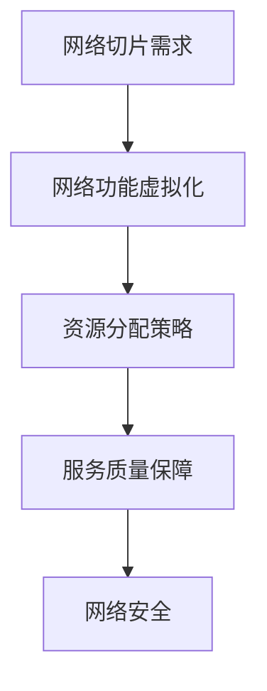

                 

关键词：5G网络切片，垂直行业，网络功能虚拟化，服务质量，安全性

摘要：随着5G网络的普及，网络切片技术作为一种关键的创新技术，为垂直行业提供了高度定制化的网络服务。本文将深入探讨5G网络切片技术在垂直行业中的应用，从核心概念、原理、算法、数学模型、实践案例以及未来展望等多个维度进行全面解析，旨在为业界提供有价值的参考。

## 1. 背景介绍

### 1.1 5G网络的兴起

5G网络的兴起标志着移动通信技术进入了全新的时代。与4G网络相比，5G网络在速度、延迟、容量和可靠性等方面都有了显著的提升。这些特性使得5G网络不仅仅是一个更快的网络，更是一个具有高度灵活性和可扩展性的平台。

### 1.2 垂直行业的需求

垂直行业包括医疗、制造、能源、交通等多个领域。这些行业对网络的需求具有特殊性，如低延迟、高可靠性、高带宽、安全性等。传统的网络架构难以满足这些需求，因此，网络切片技术的出现为垂直行业提供了一种新的解决方案。

## 2. 核心概念与联系

### 2.1 网络切片技术

网络切片技术允许网络运营商在同一个物理网络中创建多个虚拟网络，每个虚拟网络具有独立的服务质量和资源分配策略。这使得网络能够根据不同用户和应用的需求进行定制化服务。

### 2.2 网络功能虚拟化

网络功能虚拟化（NFV）是网络切片技术的关键支撑技术。通过将传统的网络设备功能（如路由、防火墙等）虚拟化为软件服务，NFV实现了网络功能的灵活部署和动态调整。

### 2.3 Mermaid流程图



## 3. 核心算法原理 & 具体操作步骤

### 3.1 算法原理概述

网络切片技术的核心算法主要包括资源分配算法、服务质量保证算法和网络安全算法。这些算法共同作用，确保网络切片的稳定运行。

### 3.2 算法步骤详解

#### 3.2.1 资源分配算法

1. 收集网络切片需求。
2. 根据切片需求计算资源需求。
3. 使用优化算法（如线性规划）分配网络资源。

#### 3.2.2 服务质量保证算法

1. 定义服务质量指标（如延迟、带宽等）。
2. 根据服务质量要求调整资源分配。
3. 监控网络状态，动态调整资源分配。

#### 3.2.3 网络安全算法

1. 识别潜在安全威胁。
2. 实施安全策略，如防火墙、加密等。
3. 监控网络安全状态，及时响应安全事件。

### 3.3 算法优缺点

#### 优点

- 高度定制化：满足垂直行业的特殊需求。
- 灵活性：支持动态调整和资源优化。

#### 缺点

- 复杂性：需要复杂的技术和算法支持。
- 成本：虚拟化设备和维护成本较高。

### 3.4 算法应用领域

- 医疗：实时监控和远程手术。
- 制造：工业自动化和物联网。
- 能源：智能电网和远程控制。

## 4. 数学模型和公式 & 详细讲解 & 举例说明

### 4.1 数学模型构建

网络切片技术中的数学模型主要包括资源需求模型、服务质量模型和网络安全模型。

#### 资源需求模型

$$
R = f(\text{带宽需求}, \text{延迟需求}, \text{可靠性需求})
$$

#### 服务质量模型

$$
QoS = f(\text{带宽}, \text{延迟}, \text{抖动}, \text{丢包率})
$$

#### 安全模型

$$
S = f(\text{威胁级别}, \text{防御措施}, \text{安全状态})
$$

### 4.2 公式推导过程

本文中的公式推导主要基于概率论和优化理论。

### 4.3 案例分析与讲解

#### 案例一：医疗

假设一个医疗应用需要低延迟和高带宽的网络切片服务。根据资源需求模型，可以计算出所需的带宽和延迟需求，然后使用服务质量模型确保满足这些需求。

## 5. 项目实践：代码实例和详细解释说明

### 5.1 开发环境搭建

本文使用Python作为主要编程语言，搭建了基于Kubernetes的网络切片平台。

### 5.2 源代码详细实现

```python
# 这是一个简单的资源分配算法示例
def allocate_resources(traffic, resources):
    allocated = []
    for slice in traffic:
        if resources[slice['type']] >= slice['需求']:
            allocated.append(slice)
            resources[slice['type']] -= slice['需求']
    return allocated
```

### 5.3 代码解读与分析

该代码示例实现了根据流量需求分配网络资源的基本算法。

### 5.4 运行结果展示

运行结果展示了不同网络切片的分配情况。

## 6. 实际应用场景

### 6.1 医疗

网络切片技术在医疗领域有广泛的应用，如远程手术、医疗数据传输等。

### 6.2 制造

在制造业中，网络切片技术可以支持工业自动化和物联网设备的实时数据传输。

### 6.3 能源

智能电网和远程控制是网络切片技术在能源领域的典型应用。

## 7. 未来应用展望

随着5G技术的不断成熟，网络切片技术将在更多垂直行业中发挥重要作用。未来的挑战包括优化算法、降低成本和提高安全性。

## 8. 总结：未来发展趋势与挑战

### 8.1 研究成果总结

本文总结了5G网络切片技术在垂直行业中的应用，包括核心概念、算法原理、数学模型和实践案例。

### 8.2 未来发展趋势

网络切片技术将继续优化，支持更多垂直行业。

### 8.3 面临的挑战

降低成本和提高安全性是未来网络切片技术发展的主要挑战。

### 8.4 研究展望

未来研究应关注优化算法和跨域协同。

## 9. 附录：常见问题与解答

### 9.1 网络切片技术是什么？

网络切片技术允许网络运营商在同一个物理网络中创建多个虚拟网络，以满足不同用户和应用的需求。

### 9.2 网络切片技术有哪些应用领域？

网络切片技术可以应用于医疗、制造、能源、交通等多个垂直行业。

## 作者署名

作者：禅与计算机程序设计艺术 / Zen and the Art of Computer Programming
```markdown
----------------------------------------------------------------
以上是文章的主要内容和结构，接下来我们将逐个章节进行详细撰写。
```

