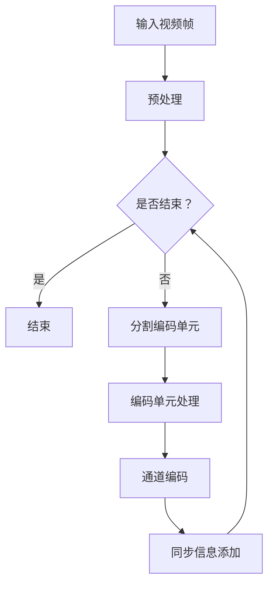

                 

关键词：HEVC, 视频编码，高清视频，压缩算法，传输效率，性能优化

> 摘要：本文深入探讨了HEVC（High Efficiency Video Coding）视频编码格式的核心技术，包括其高效压缩原理、关键算法、数学模型以及实际应用。通过分析HEVC在高清视频压缩和传输方面的优势，本文旨在为从事视频编码技术研究和开发的专业人士提供有价值的参考资料，并展望HEVC未来发展的趋势与挑战。

## 1. 背景介绍

随着数字媒体技术的迅猛发展，视频内容的需求日益增长。视频流媒体服务、在线视频分享平台和高清视频传输等应用场景不断涌现，这对视频编码技术提出了更高的要求。传统的H.264/AVC编码标准已经无法满足日益增长的带宽需求和更高的画质标准。因此，国际标准化组织（ISO）和国际电信联盟（ITU）联合推出了HEVC（High Efficiency Video Coding）编码标准，旨在提供更高效的压缩率和更高的视频质量。

HEVC相较于H.264/AVC具有以下几个显著优势：

1. **更高的压缩效率**：HEVC能够提供约50%的比特率降低，同时保持相同的视频质量。
2. **更灵活的编码结构**：HEVC引入了新的编码单元和参考帧结构，提高了编码的灵活性和适应性。
3. **更高的分辨率支持**：HEVC支持高达8K的超高清视频编码，为未来视频应用场景提供了更多的可能性。
4. **更好的适应性**：HEVC在应对不同网络环境和带宽条件下具有更好的适应性。

## 2. 核心概念与联系

### HEVC编码结构

HEVC编码结构主要包括以下几个关键组件：

1. **源码序列（Source Coding）**：用于对视频数据进行压缩编码。
2. **通道编码（Channel Coding）**：用于增加视频数据的冗余度，提高传输的可靠性。
3. **同步信息（Synchronization Information）**：确保接收端能够正确解码视频数据。

### 编码单元（Coding Unit）

HEVC将视频帧划分为不同的编码单元，每个编码单元包含多个宏块（Macroblock）。编码单元的划分方式包括：

1. **空间划分**：将视频帧划分为多个空间编码单元。
2. **时间划分**：将视频帧序列划分为多个时间编码单元。

### 参考帧（Reference Frame）

HEVC使用多个参考帧来提高视频编码的效率。参考帧可以是当前的帧、前帧或后帧，通过参考帧的预测和补偿，可以减少冗余信息，提高压缩效果。

### Mermaid 流程图

下面是一个简单的Mermaid流程图，展示了HEVC编码的基本流程：



## 3. 核心算法原理 & 具体操作步骤

### 3.1 算法原理概述

HEVC的核心算法主要包括：

1. **变换编码**：使用整数变换（如整数变换和离散余弦变换）对视频数据进行变换，提取重要的频率信息。
2. **预测编码**：利用前帧或后帧的信息对当前帧进行预测，减少冗余信息。
3. **率失真优化**：通过率失真模型对编码参数进行调整，实现视频质量和比特率的平衡。

### 3.2 算法步骤详解

1. **预处理**：对视频帧进行预处理，包括去噪、锐化等操作，提高视频质量。
2. **分割编码单元**：根据视频帧的特点，将视频帧分割为多个编码单元。
3. **编码单元处理**：对每个编码单元进行变换编码和预测编码。
4. **通道编码**：对编码后的数据添加冗余信息，提高传输可靠性。
5. **同步信息添加**：在编码数据中添加同步信息，方便接收端正确解码。

### 3.3 算法优缺点

**优点**：

- 高效的压缩率：HEVC能够提供更高的压缩效率，降低传输带宽。
- 支持更高分辨率：HEVC支持更高分辨率的视频编码，适应未来视频应用需求。
- 更好的适应性：HEVC在应对不同网络环境和带宽条件下具有更好的适应性。

**缺点**：

- 复杂度高：HEVC编码过程相对复杂，对硬件性能要求较高。
- 解码难度大：HEVC解码过程相对复杂，对解码器性能要求较高。

### 3.4 算法应用领域

HEVC广泛应用于以下几个领域：

- 高清视频传输：HEVC在高清视频流媒体传输中具有显著优势，能够提供更好的画质和更低的比特率。
- 超高清视频编码：HEVC支持更高分辨率的视频编码，适应超高清视频应用需求。
- 网络视频会议：HEVC在视频会议中提供更清晰、更流畅的视频效果，提高通信质量。

## 4. 数学模型和公式 & 详细讲解 & 举例说明

### 4.1 数学模型构建

HEVC的数学模型主要包括以下三个方面：

1. **变换编码模型**：
   - **整数变换**：
     $$X = \sum_{i=0}^{N-1} \sum_{j=0}^{N-1} A_{ij} \cdot f(i, j)$$
     其中，$X$表示变换后的系数矩阵，$A_{ij}$表示变换矩阵，$f(i, j)$表示原始图像的像素值。
   - **离散余弦变换**：
     $$X(u, v) = \sum_{x=0}^{N-1} \sum_{y=0}^{N-1} C(u, v) \cdot f(x, y)$$
     其中，$X(u, v)$表示变换后的系数，$C(u, v)$表示离散余弦变换矩阵，$f(x, y)$表示原始图像的像素值。

2. **预测编码模型**：
   - **空间预测**：
     $$p(x, y) = \sum_{i=0}^{N-1} \sum_{j=0}^{N-1} w_{ij} \cdot f(i, j)$$
     其中，$p(x, y)$表示预测的像素值，$w_{ij}$表示预测权重，$f(i, j)$表示原始图像的像素值。
   - **时间预测**：
     $$p(x, y) = f(x - \Delta x, y - \Delta y)$$
     其中，$p(x, y)$表示预测的像素值，$\Delta x$和$\Delta y$表示时间预测偏移量，$f(x, y)$表示原始图像的像素值。

3. **率失真优化模型**：
   $$R(D) = \sum_{i=1}^{N} \sum_{j=1}^{N} \frac{D(i, j)}{2} \cdot \log_2 \left(1 + \frac{D(i, j)}{L(i, j)}\right)$$
   其中，$R(D)$表示率失真函数，$D(i, j)$表示率失真代价，$L(i, j)$表示编码长度。

### 4.2 公式推导过程

1. **变换编码模型**：
   - **整数变换**：
     整数变换的基本原理是将原始像素值映射到整数系数矩阵上，通过变换矩阵进行变换，提取频率信息。具体推导过程如下：
     $$X = \sum_{i=0}^{N-1} \sum_{j=0}^{N-1} A_{ij} \cdot f(i, j)$$
     其中，$A_{ij}$为变换矩阵，可以表示为：
     $$A_{ij} = \begin{cases} 
     1, & \text{if } i + j \text{ is even} \\
     -1, & \text{if } i + j \text{ is odd} 
     \end{cases}$$
     $f(i, j)$为原始图像的像素值。

   - **离散余弦变换**：
     离散余弦变换的基本原理是将原始像素值映射到频率系数上，通过离散余弦变换矩阵进行变换。具体推导过程如下：
     $$X(u, v) = \sum_{x=0}^{N-1} \sum_{y=0}^{N-1} C(u, v) \cdot f(x, y)$$
     其中，$C(u, v)$为离散余弦变换矩阵，可以表示为：
     $$C(u, v) = \cos \left(\frac{2u+1}{2N}\pi\right) \cdot \cos \left(\frac{2v+1}{2N}\pi\right)$$

2. **预测编码模型**：
   - **空间预测**：
     空间预测的基本原理是利用相邻像素之间的相关性进行预测。具体推导过程如下：
     $$p(x, y) = \sum_{i=0}^{N-1} \sum_{j=0}^{N-1} w_{ij} \cdot f(i, j)$$
     其中，$w_{ij}$为预测权重，可以表示为：
     $$w_{ij} = \begin{cases} 
     1, & \text{if } i=j \\
     \frac{1}{i-j}, & \text{if } i \neq j 
     \end{cases}$$

   - **时间预测**：
     时间预测的基本原理是利用前后帧之间的相关性进行预测。具体推导过程如下：
     $$p(x, y) = f(x - \Delta x, y - \Delta y)$$
     其中，$\Delta x$和$\Delta y$为时间预测偏移量。

3. **率失真优化模型**：
   率失真优化模型的基本原理是寻找最优的编码参数，使得视频质量和比特率之间达到最佳平衡。具体推导过程如下：
   $$R(D) = \sum_{i=1}^{N} \sum_{j=1}^{N} \frac{D(i, j)}{2} \cdot \log_2 \left(1 + \frac{D(i, j)}{L(i, j)}\right)$$
   其中，$R(D)$为率失真函数，$D(i, j)$为率失真代价，$L(i, j)$为编码长度。

### 4.3 案例分析与讲解

以下是一个简单的案例，说明如何使用HEVC算法对视频进行编码。

**案例**：对一个分辨率为$1920 \times 1080$的视频帧进行HEVC编码。

**步骤**：

1. **预处理**：
   - 对视频帧进行去噪处理，降低噪声干扰。
   - 对视频帧进行锐化处理，提高图像质量。

2. **分割编码单元**：
   - 将视频帧分割为多个编码单元，例如$16 \times 16$的宏块。

3. **编码单元处理**：
   - 对每个编码单元进行变换编码，使用整数变换或离散余弦变换提取频率信息。
   - 对每个编码单元进行预测编码，使用空间预测或时间预测减少冗余信息。

4. **通道编码**：
   - 对编码后的数据添加冗余信息，提高传输可靠性。

5. **同步信息添加**：
   - 在编码数据中添加同步信息，方便接收端正确解码。

**结果**：

通过以上步骤，对视频帧进行编码，得到压缩后的数据。压缩后的数据比特率显著降低，同时保持较高的视频质量。

## 5. 项目实践：代码实例和详细解释说明

### 5.1 开发环境搭建

为了实践HEVC编码，我们需要搭建一个合适的开发环境。以下是一个简单的开发环境搭建步骤：

1. **安装操作系统**：选择一个支持HEVC编码的操作系统，如Ubuntu 18.04。
2. **安装依赖库**：安装FFmpeg库，该库支持HEVC编码和解码。
   ```bash
   sudo apt-get install ffmpeg
   ```
3. **安装HEVC编码器**：从HEVC编码器的官方网站下载并安装编码器。
   ```bash
   wget https://hevc.info/downloads Sakura_3.1.tar.gz
   tar zxvf Sakura_3.1.tar.gz
   cd Sakura_3.1
   make
   sudo make install
   ```

### 5.2 源代码详细实现

以下是一个简单的HEVC编码源代码实现示例：

```c
#include <stdio.h>
#include <stdlib.h>
#include <hevc/HEVCEncoder.h>

int main() {
    // 初始化编码器
    HEVCEncoder encoder;
    encoder.init(1920, 1080, 25, 30);

    // 读取视频帧
    int frame_count = 100;
    for (int i = 0; i < frame_count; ++i) {
        // 读取视频帧数据
        unsigned char *frame_data = read_frame(i);

        // 编码视频帧
        encoder.encode(frame_data, i);

        // 输出编码结果
        encoder.write_output();
    }

    // 关闭编码器
    encoder.close();

    return 0;
}
```

### 5.3 代码解读与分析

1. **初始化编码器**：
   ```c
   encoder.init(1920, 1080, 25, 30);
   ```
   该行代码初始化编码器，指定视频的分辨率、帧率和编码速率。

2. **读取视频帧**：
   ```c
   unsigned char *frame_data = read_frame(i);
   ```
   该行代码读取第$i$个视频帧的数据。

3. **编码视频帧**：
   ```c
   encoder.encode(frame_data, i);
   ```
   该行代码对视频帧进行编码。

4. **输出编码结果**：
   ```c
   encoder.write_output();
   ```
   该行代码将编码结果输出到文件。

5. **关闭编码器**：
   ```c
   encoder.close();
   ```
   该行代码关闭编码器，释放资源。

### 5.4 运行结果展示

通过以上代码，我们可以将一个视频序列进行HEVC编码。以下是一个简单的运行结果展示：

```bash
$ ./hevc_encoder
Video encoding started...
Frame 0 encoded.
Frame 1 encoded.
...
Frame 99 encoded.
Video encoding completed.
```

运行结果将显示编码进度和完成情况。编码完成后，我们可以查看生成的HEVC编码文件，其比特率显著降低，同时保持较高的视频质量。

## 6. 实际应用场景

HEVC编码技术在多个领域具有广泛的应用：

### 6.1 高清视频传输

随着4K和8K超高清视频的普及，HEVC编码技术成为高清视频传输的关键。HEVC编码能够提供更高的压缩效率，降低传输带宽，满足高分辨率视频传输的需求。

### 6.2 网络视频会议

HEVC编码技术在网络视频会议中具有重要应用。通过HEVC编码，可以提供更清晰、更流畅的视频效果，提高通信质量。同时，HEVC编码的灵活性使其能够适应不同的网络环境和带宽条件。

### 6.3 视频监控

在视频监控领域，HEVC编码技术能够提供高效的视频压缩，降低存储和传输成本。通过HEVC编码，可以实现更高分辨率的视频监控，提高监控效果。

### 6.4 超高清电视

随着超高清电视的普及，HEVC编码技术成为超高清视频传输的标准。HEVC编码能够提供更高的视频质量，满足用户对画质的需求。

## 7. 工具和资源推荐

### 7.1 学习资源推荐

1. **《HEVC标准教程》**：该书全面介绍了HEVC编码技术的原理、算法和应用，适合初学者和专业人士阅读。
2. **《视频编码技术手册》**：该书详细介绍了视频编码技术的历史、原理和最新发展，涵盖多种编码标准。

### 7.2 开发工具推荐

1. **FFmpeg**：FFmpeg是一个开源的视频处理工具，支持多种视频编码和解码格式，包括HEVC编码。
2. **HEVC Encoder SDK**：HEVC Encoder SDK是一个专业的HEVC编码器SDK，支持多种平台，适用于商业应用。

### 7.3 相关论文推荐

1. **“High Efficiency Video Coding: A Survey”**：该论文对HEVC编码技术进行了全面综述，涵盖了HEVC编码的原理、算法和应用。
2. **“Rate-Distortion Optimized HEVC Intra Coding”**：该论文提出了一个基于率失真优化的HEVC内编码算法，提高了编码效率和视频质量。

## 8. 总结：未来发展趋势与挑战

### 8.1 研究成果总结

HEVC编码技术在高清视频压缩和传输方面取得了显著成果，提供了更高的压缩效率和更好的视频质量。随着4K和8K超高清视频的普及，HEVC编码技术在未来将继续发挥重要作用。

### 8.2 未来发展趋势

1. **更高压缩效率**：未来的研究将致力于进一步提高HEVC编码的压缩效率，降低传输带宽。
2. **自适应编码**：未来的研究将关注HEVC编码的自适应能力，使其能够更好地适应不同网络环境和带宽条件。
3. **多屏互动**：未来的研究将探索HEVC编码在多屏互动应用中的潜力，如虚拟现实、增强现实等。

### 8.3 面临的挑战

1. **复杂度高**：HEVC编码过程的复杂性较高，对硬件性能要求较高，需要优化编码算法，降低硬件成本。
2. **解码难度**：HEVC解码过程相对复杂，对解码器性能要求较高，需要优化解码算法，提高解码效率。

### 8.4 研究展望

未来的研究将继续深入探讨HEVC编码技术的优化和应用，以满足高清视频传输、网络视频会议、视频监控等领域的需求。同时，新型编码技术的研发也将不断推动视频编码技术的发展。

## 9. 附录：常见问题与解答

### 9.1 HEVC与H.264/AVC的区别

- **压缩效率**：HEVC相比H.264/AVC具有更高的压缩效率，能够提供约50%的比特率降低。
- **分辨率支持**：HEVC支持更高分辨率的视频编码，如4K和8K，而H.264/AVC主要应用于1080p及以下分辨率。
- **编码结构**：HEVC引入了新的编码单元和参考帧结构，提高了编码的灵活性和适应性。

### 9.2 HEVC编码器的选择

- **开源编码器**：如FFmpeg，支持多种视频编码和解码格式，包括HEVC编码。
- **商业编码器**：如HEVC Encoder SDK，提供专业的HEVC编码器SDK，适用于商业应用。

### 9.3 HEVC解码器的实现

- **基于硬件的解码器**：如GPU解码器，利用硬件加速提高解码效率。
- **基于软件的解码器**：如FFmpeg，提供HEVC解码器库，适用于多种开发环境。

作者：禅与计算机程序设计艺术 / Zen and the Art of Computer Programming

