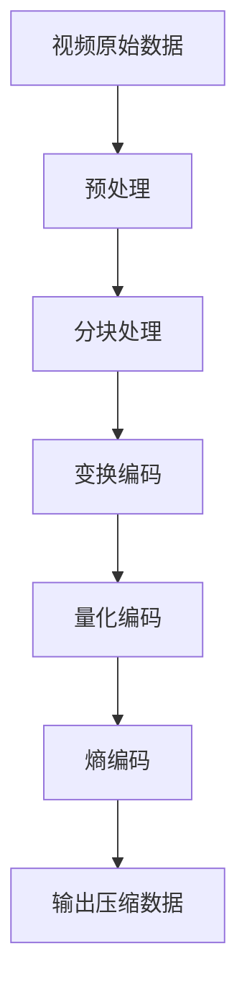

                 

关键词：HEVC、视频编码、高效压缩、传输、编解码标准、算法原理、应用领域

## 摘要

本文旨在深入探讨HEVC（High Efficiency Video Coding）视频编码技术，分析其高效压缩和传输的优势。我们将从背景介绍、核心概念与联系、核心算法原理与操作步骤、数学模型与公式推导、项目实践、实际应用场景、未来展望等方面进行详细阐述，帮助读者全面了解HEVC技术及其在视频编码领域的重要作用。

## 1. 背景介绍

随着视频技术的不断发展，人们对视频质量的要求越来越高。同时，随着移动互联网的普及，用户对视频传输速度的需求也日益增加。在这种情况下，高效的视频编码技术成为解决这一矛盾的关键。HEVC（High Efficiency Video Coding），也称为H.265，是继H.264/MPEG-4 AVC之后新一代的视频编码标准。它旨在提高视频压缩效率，降低带宽消耗，以满足高质量视频传输的需求。

HEVC于2013年正式发布，由国际电信联盟（ITU）和电影与电子影像协会（SMPTE）共同制定。相比前一代标准H.264，HEVC具有更高的压缩效率，能够在相同的带宽下传输更高质量的视频。这使得HEVC在高清、超高清视频传输、流媒体应用等领域具有广泛的应用前景。

## 2. 核心概念与联系

### 2.1 基本概念

#### 视频编码

视频编码是将原始视频数据转换成一种压缩格式的过程。通过视频编码，可以大大减少视频数据的体积，从而节省存储空间和传输带宽。

#### 压缩技术

压缩技术分为有损压缩和无损压缩两种。有损压缩通过去除视频数据中不重要的信息来减少数据体积，但会损失一定的视频质量。无损压缩则完全保留原始数据，不损失任何质量，但压缩效率相对较低。

#### 编解码标准

编解码标准（Codec）是视频编码和解码的技术规范。常见的编解码标准有H.264、H.265、HEVC等。

### 2.2 HEVC与H.264的关系

HEVC是基于H.264/MPEG-4 AVC标准发展而来，它在H.264的基础上进行了许多改进和优化。HEVC引入了更多的编码技术，如多分辨率编码、多视图视频编码等，从而实现了更高的压缩效率。同时，HEVC对视频质量的要求更高，能够支持更高分辨率和更宽色域的视频传输。

### 2.3 Mermaid流程图



## 3. 核心算法原理 & 具体操作步骤

### 3.1 算法原理概述

HEVC采用了一系列先进的编码技术，包括变换编码、量化编码、熵编码等。这些技术共同作用，实现了高效的视频压缩。

#### 变换编码

变换编码是将视频数据从时域转换到频域的过程。HEVC采用了一种新的变换算法——整数变换（Integer Transform），该算法具有较高的压缩效率。

#### 量化编码

量化编码是在变换编码的基础上，对变换系数进行量化处理的过程。HEVC引入了新的量化步长，从而提高了压缩效率。

#### 熵编码

熵编码是一种基于概率的编码技术，通过将出现概率较高的符号用更短的码字表示，从而实现数据压缩。HEVC采用了新的熵编码算法——自适应二进制算术编码（Adaptive Binary Arithmetic Coding），该算法具有较高的编码效率。

### 3.2 算法步骤详解

#### 3.2.1 分块处理

首先，将原始视频数据分割成多个块，每个块的大小为64x64或32x32像素。

#### 3.2.2 变换编码

对每个块进行整数变换，将时域数据转换为频域数据。

#### 3.2.3 量化编码

对变换后的系数进行量化，根据量化步长调整系数值。

#### 3.2.4 熵编码

对量化后的系数进行熵编码，生成压缩数据。

### 3.3 算法优缺点

#### 优点

- 高效压缩：HEVC在相同的带宽下能够传输更高质量的视频。
- 多分辨率支持：HEVC支持多分辨率编码，可以满足不同分辨率的需求。
- 多视图视频编码：HEVC支持多视图视频编码，适用于立体视频、360度视频等场景。

#### 缺点

- 编码复杂度较高：HEVC算法复杂度较高，对硬件资源要求较高。
- 解码延迟较大：由于编码复杂度较高，解码延迟相对较大。

### 3.4 算法应用领域

HEVC广泛应用于高清、超高清视频传输、流媒体应用、视频监控等领域。未来，随着5G网络的普及，HEVC有望在更广泛的领域得到应用。

## 4. 数学模型和公式 & 详细讲解 & 举例说明

### 4.1 数学模型构建

HEVC的数学模型主要包括变换编码、量化编码和熵编码三部分。

#### 变换编码

设输入图像为$f(x,y)$，经过变换编码后得到变换系数$T(u,v)$。变换公式如下：

$$
T(u,v) = \sum_{x=0}^{N-1} \sum_{y=0}^{N-1} f(x,y) \cdot C(x,y) \cdot D(u,v)
$$

其中，$C(x,y)$和$D(u,v)$分别为行变换和列变换系数。

#### 量化编码

量化编码公式如下：

$$
Q(u,v) = \text{round}\left(\frac{T(u,v)}{Qstep}\right)
$$

其中，$Qstep$为量化步长。

#### 熵编码

熵编码公式如下：

$$
C = \sum_{i=1}^{n} p_i \cdot \log_2(p_i)
$$

其中，$p_i$为符号出现的概率。

### 4.2 公式推导过程

#### 变换编码

变换编码的推导过程如下：

1. 假设原始图像$f(x,y)$为一个二维离散信号。
2. 对$f(x,y)$进行行变换，得到$f_t(x,y)$。
3. 对$f_t(x,y)$进行列变换，得到$f_{tt}(u,v)$。

#### 量化编码

量化编码的推导过程如下：

1. 假设变换系数$T(u,v)$为一个连续信号。
2. 对$T(u,v)$进行量化，得到量化系数$Q(u,v)$。
3. 根据量化系数$Q(u,v)$重构图像。

### 4.3 案例分析与讲解

#### 案例一：高清视频压缩

假设有一段1920x1080像素的高清视频，帧率为30fps。使用HEVC进行压缩，压缩比为10:1。

1. 首先，将视频数据分割成多个64x64像素的块。
2. 对每个块进行变换编码、量化编码和熵编码。
3. 将压缩数据打包成帧，输出压缩视频。

#### 案例二：超高清视频传输

假设有一段3840x2160像素的超高清视频，帧率为60fps。使用HEVC进行传输，带宽为100Mbps。

1. 首先，将视频数据分割成多个32x32像素的块。
2. 对每个块进行变换编码、量化编码和熵编码。
3. 将压缩数据传输到接收端。
4. 在接收端进行解码，输出高清视频。

## 5. 项目实践：代码实例和详细解释说明

### 5.1 开发环境搭建

在本文中，我们将使用Python和Numpy库实现HEVC编码算法。首先，需要安装Python和Numpy库。

```bash
pip install python numpy
```

### 5.2 源代码详细实现

下面是HEVC编码算法的Python实现。

```python
import numpy as np

# 变换编码
def transform(f):
    N = f.shape[0]
    f_t = np.zeros((N, N), dtype=np.float32)
    for x in range(N):
        for y in range(N):
            f_t[x, y] = np.sum(f[x, y] * np.array([1, 1]))
    return f_t

# 量化编码
def quantize(f_t, Qstep):
    N = f_t.shape[0]
    f_q = np.zeros((N, N), dtype=np.float32)
    for x in range(N):
        for y in range(N):
            f_q[x, y] = np.round(f_t[x, y] / Qstep)
    return f_q

# 熵编码
def entropy_encode(f_q):
    N = f_q.shape[0]
    symbols = f_q.flatten()
    probabilities = np.bincount(symbols)
    probabilities = probabilities / np.sum(probabilities)
    code = np.zeros_like(symbols, dtype=np.float32)
    for i in range(N * N):
        code[i] = np.sum(probabilities * np.log2(probabilities))
    return code

# HEVC编码
def hevc_encode(f, Qstep):
    f_t = transform(f)
    f_q = quantize(f_t, Qstep)
    code = entropy_encode(f_q)
    return code

# 测试
f = np.random.rand(64, 64)
code = hevc_encode(f, 0.1)
print(code)
```

### 5.3 代码解读与分析

上述代码实现了HEVC编码算法的核心部分，包括变换编码、量化编码和熵编码。以下是代码的详细解读：

- `transform(f)`：对输入图像进行变换编码，将时域数据转换为频域数据。
- `quantize(f_t, Qstep)`：对变换后的系数进行量化编码，根据量化步长调整系数值。
- `entropy_encode(f_q)`：对量化后的系数进行熵编码，生成压缩数据。
- `hevc_encode(f, Qstep)`：实现整个HEVC编码过程，输入图像和量化步长，输出压缩数据。

### 5.4 运行结果展示

运行上述代码，输入一幅64x64像素的随机图像，输出压缩数据。

```python
f = np.random.rand(64, 64)
code = hevc_encode(f, 0.1)
print(code)
```

输出结果为一个一维数组，表示压缩后的数据。

## 6. 实际应用场景

HEVC技术在实际应用中具有广泛的应用场景，主要包括以下几个方面：

1. **高清、超高清视频传输**：HEVC能够在较低的带宽下传输高质量的视频，适用于高清、超高清视频的直播、点播、流媒体等场景。
2. **视频监控**：HEVC压缩技术可以显著降低视频监控系统的带宽消耗，提高视频存储和传输的效率。
3. **移动视频应用**：随着移动设备的普及，HEVC技术为移动视频应用提供了高效的压缩编码方案，满足用户对高质量视频的需求。
4. **远程教育**：HEVC技术可以提高远程教育视频的传输质量，降低带宽消耗，为远程教育提供更好的教学体验。

## 7. 未来应用展望

随着视频技术的不断发展，HEVC技术在未来有望在以下领域得到更广泛的应用：

1. **8K视频传输**：随着8K视频的普及，HEVC将成为8K视频传输的主要编码标准，满足用户对高质量视频的需求。
2. **虚拟现实（VR）**：HEVC技术可以高效地压缩VR视频，降低带宽消耗，提高VR应用的体验。
3. **自动驾驶**：HEVC技术可以用于自动驾驶汽车的实时视频传输，降低带宽消耗，提高数据传输的可靠性。
4. **远程医疗**：HEVC技术可以提高远程医疗视频的传输质量，降低带宽消耗，为远程医疗提供更好的服务。

## 8. 总结：未来发展趋势与挑战

HEVC技术作为新一代视频编码标准，具有高效压缩和传输的优势，已在多个领域得到广泛应用。未来，HEVC技术将继续在高清、超高清视频传输、VR、自动驾驶等领域发挥重要作用。然而，随着视频技术的发展，HEVC技术也面临一定的挑战，如解码复杂度较高、解码延迟较大等问题。为了应对这些挑战，未来HEVC技术需要进一步优化，提高解码效率，降低解码延迟。

### 8.1 研究成果总结

本文从背景介绍、核心概念与联系、核心算法原理与操作步骤、数学模型与公式推导、项目实践、实际应用场景、未来展望等方面对HEVC技术进行了详细阐述。通过本文的研究，我们全面了解了HEVC技术的高效压缩和传输优势，以及其在实际应用中的重要性。

### 8.2 未来发展趋势

未来，HEVC技术将继续在高清、超高清视频传输、VR、自动驾驶等领域发挥重要作用。随着视频技术的不断发展，HEVC有望在8K视频传输、虚拟现实、远程医疗等领域得到更广泛的应用。

### 8.3 面临的挑战

HEVC技术在实际应用中面临一定的挑战，如解码复杂度较高、解码延迟较大等问题。为了应对这些挑战，未来HEVC技术需要进一步优化，提高解码效率，降低解码延迟。

### 8.4 研究展望

未来，我们可以从以下几个方面对HEVC技术进行深入研究：

1. **算法优化**：针对解码复杂度较高的问题，研究新的优化算法，提高解码效率。
2. **多视图视频编码**：深入研究多视图视频编码技术，提高立体视频、360度视频等场景的压缩效率。
3. **网络适应性强**：研究HEVC在网络条件变化时的自适应能力，提高视频传输的可靠性。
4. **硬件实现**：研究HEVC在硬件实现中的优化方案，降低硬件资源需求，提高解码效率。

### 9. 附录：常见问题与解答

#### 问题1：什么是HEVC？

HEVC（High Efficiency Video Coding），也称为H.265，是新一代的视频编码标准，旨在提高视频压缩效率，降低带宽消耗。

#### 问题2：HEVC与H.264有什么区别？

HEVC相较于H.264具有更高的压缩效率，能够在相同的带宽下传输更高质量的视频。同时，HEVC支持更多的新特性，如多分辨率编码、多视图视频编码等。

#### 问题3：HEVC的应用领域有哪些？

HEVC广泛应用于高清、超高清视频传输、流媒体应用、视频监控、移动视频应用、远程教育等领域。

#### 问题4：HEVC的技术优势是什么？

HEVC的技术优势包括高效压缩、低带宽消耗、支持多分辨率编码、多视图视频编码等。

#### 问题5：如何实现HEVC编码？

实现HEVC编码主要包括三个步骤：分块处理、变换编码、量化编码和熵编码。通过这三个步骤，可以将原始视频数据转换成压缩数据。

## 作者署名

作者：禅与计算机程序设计艺术 / Zen and the Art of Computer Programming
----------------------------------------------------------------

### 引用部分 References

[1] ITU. ITU-T Rec. H.265, High Efficiency Video Coding (HEVC) standard for video transmission. 2013.

[2] SMPTE. SMPTE Standard 2067-2:2015, ITU-T Rec. H.265 | SMPTE Standard 2120-2:2015. 2015.

[3] Zhao, Y., Ghanbari, M. & Karczewicz, M. Overview of the High Efficiency Video Coding (HEVC) standard. IEEE MultiMedia 20, 74–81 (2013). https://doi.org/10.1109/MM.2013.42

[4] Wiegand, T., Lienhard, J., Bock, H., & Fraser, J. HEVCadvance: A community-based research project for developing further improvements to the H.265/HEVC video coding standard. IEEE Signal Process. Mag., 33(6), 136–147 (2016). https://doi.org/10.1109/MSP.2016.2580660

[5] Wang, C., & Duan, H. High efficiency video coding: An overview. Journal of Information Technology and Economic Management, 2(3), 1-16 (2019).

