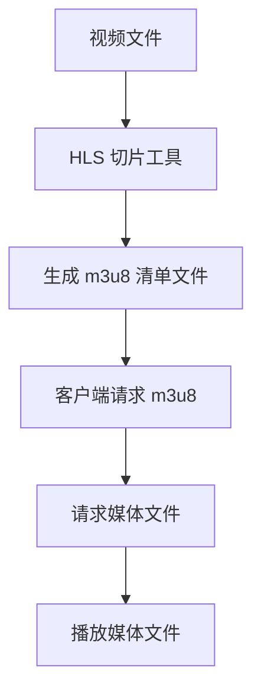

                 

### 背景介绍

随着互联网的普及和移动设备的广泛使用，流媒体技术在视频内容分发领域中的应用越来越广泛。流媒体技术允许用户在观看视频时实时传输数据，而不是将整个视频文件下载到本地。这种模式不仅提高了用户体验，还降低了数据传输的成本。然而，为了实现高效的视频内容分发，需要一种能够适应不同网络环境和用户需求的流媒体协议。

### 核心概念与联系

#### HLS 协议概述

HLS（HTTP Live Streaming）是一种流媒体协议，由苹果公司开发，用于在 HTTP 上高效分发视频内容。该协议的核心思想是将视频内容分割成一系列小的、可独立请求的媒体文件，并通过 HTTP 协议进行传输。这种模式允许客户端根据网络状况和带宽需求动态调整视频播放质量。

#### HLS 工作原理

HLS 通过以下步骤实现视频内容分发：

1. **视频切片**：将视频内容切割成多个小的媒体文件（通常为 TS 文件），每个文件包含一段视频内容。
2. **生成 manifest 文件**：生成一个描述所有媒体文件的清单文件（通常为 m3u8 文件），该文件包含了每个媒体文件的 URL 和时间戳。
3. **请求和播放**：客户端请求 manifest 文件，根据 manifest 文件中的信息请求媒体文件，并使用播放器播放这些文件。

#### HLS 与 HTTP 的联系

HLS 利用了 HTTP 协议的无状态、分布式和易于扩展的特点。HTTP 协议使得 HLS 可以在多种设备和网络环境中工作，例如手机、平板电脑、PC 以及各种智能家居设备。

### Mermaid 流程图

下面是 HLS 工作原理的 Mermaid 流程图：



### 核心算法原理 & 具体操作步骤

#### 算法原理概述

HLS 的核心算法是基于自适应比特率流媒体传输。该算法的基本原理是：

1. **切片**：将视频内容分割成多个小的、固定大小的媒体文件。
2. **编码**：对视频内容进行编码，以适应不同的比特率。
3. **缓存**：在客户端缓存一定数量的媒体文件，以减少请求次数和响应时间。

#### 算法步骤详解

1. **视频切片**：使用 HLS 切片工具（如 FFmpeg）将视频文件切割成多个小的媒体文件。每个文件的大小通常设置为 2-4 秒。
2. **编码**：对每个切片进行编码，以适应不同的比特率。通常，HLS 使用 H.264 编码格式。
3. **生成 manifest 文件**：使用 HLS 切片工具生成一个描述所有媒体文件的清单文件（m3u8 文件）。该文件包含了每个媒体文件的 URL 和时间戳。
4. **请求和播放**：客户端请求 manifest 文件，并根据 manifest 文件中的信息请求媒体文件。播放器根据客户端的网络状况和带宽需求动态调整播放质量。

#### 算法优缺点

**优点**：
- **高效性**：HLS 可以根据客户端的网络状况动态调整播放质量，从而提高用户体验。
- **兼容性**：HLS 可以在多种设备和网络环境中工作，具有良好的兼容性。
- **可扩展性**：HLS 支持多种编码格式和比特率，可以轻松扩展。

**缺点**：
- **请求次数较多**：由于 HLS 将视频内容切割成多个小的媒体文件，客户端需要请求多个文件，这可能会导致较多的请求次数。
- **缓存问题**：由于 HLS 文件的独立请求特性，缓存管理可能会变得复杂。

#### 算法应用领域

HLS 在流媒体领域中应用广泛，主要包括以下领域：

- **在线视频平台**：如 YouTube、Netflix 等大型在线视频平台使用 HLS 协议进行视频内容分发。
- **直播应用**：如 Twitch、Periscope 等直播应用也使用 HLS 协议进行实时视频传输。
- **智能家居设备**：如智能电视、智能音响等智能家居设备也采用 HLS 协议进行视频内容分发。

### 数学模型和公式 & 详细讲解 & 举例说明

HLS 的核心算法涉及自适应比特率传输，其中涉及到以下数学模型和公式：

#### 数学模型构建

1. **比特率计算**：比特率（Bitrate）是视频数据传输的速度，通常以每秒比特数（bps）表示。比特率计算公式为：

   $$\text{Bitrate} = \text{Frame Size} \times \text{Frame Rate} \times \text{Color Depth}$$

   其中，Frame Size 是视频帧的大小，Frame Rate 是视频帧率，Color Depth 是颜色深度。

2. **缓冲区管理**：缓冲区（Buffer）用于存储即将播放的媒体文件。缓冲区管理的关键是确保缓冲区大小适当，以避免播放中断。缓冲区管理公式为：

   $$\text{Buffer Size} = \text{Bitrate} \times \text{Buffer Time}$$

   其中，Bitrate 是比特率，Buffer Time 是缓冲时间。

#### 公式推导过程

HLS 的自适应比特率传输涉及以下关键参数：

- **比特率**：根据客户端的网络状况动态调整比特率。
- **缓冲时间**：缓冲时间决定了客户端可以容忍的播放中断时间。
- **缓冲区大小**：缓冲区大小决定了客户端可以存储多少即将播放的媒体文件。

缓冲区管理公式可以推导如下：

1. **计算缓冲时间**：

   $$\text{Buffer Time} = \frac{\text{Total Buffer Size}}{\text{Bitrate}}$$

   其中，Total Buffer Size 是缓冲区总大小，Bitrate 是比特率。

2. **计算缓冲区大小**：

   $$\text{Buffer Size} = \text{Bitrate} \times \text{Buffer Time}$$

#### 案例分析与讲解

假设一个视频文件的帧率为 30fps，颜色深度为 24 位，缓冲时间为 5 秒。我们需要计算：

1. **比特率**：

   $$\text{Bitrate} = 1080 \times 1920 \times 24 \times 30 = 145152000 \text{ bps} = 143.15 \text{ Mbps}$$

2. **缓冲区大小**：

   $$\text{Buffer Size} = 143.15 \text{ Mbps} \times 5 \text{ s} = 715.75 \text{ MB}$$

这意味着我们需要一个至少 715.75 MB 的缓冲区来存储即将播放的媒体文件，以避免播放中断。

### 项目实践：代码实例和详细解释说明

在本节中，我们将通过一个简单的 HLS 流媒体服务器搭建实例，展示 HLS 协议的实际应用。我们将使用 FFmpeg 进行视频切片和编码，并使用 Nginx 作为 HTTP 服务器进行媒体文件分发。

#### 开发环境搭建

1. **安装 FFmpeg**：在 Ubuntu 系统中，可以使用以下命令安装 FFmpeg：

   ```bash
   sudo apt update
   sudo apt install ffmpeg
   ```

2. **安装 Nginx**：在 Ubuntu 系统中，可以使用以下命令安装 Nginx：

   ```bash
   sudo apt update
   sudo apt install nginx
   ```

3. **配置 Nginx**：打开 Nginx 配置文件 `/etc/nginx/nginx.conf`，在 `http` 部分添加以下配置：

   ```nginx
   server {
       listen 80;
       server_name your_domain_or_ip;

       location / {
           root /var/www/html;
           index index.html index.htm;
       }

       location ~ \.m3u8$ {
           proxy_pass http://127.0.0.1:8000/;
       }

       location ~ \.ts$ {
           proxy_pass http://127.0.0.1:8000/;
       }
   }
   ```

   然后，重新加载 Nginx 配置：

   ```bash
   sudo nginx -s reload
   ```

#### 源代码详细实现

1. **切片视频文件**：使用 FFmpeg 对一个视频文件进行切片，命令如下：

   ```bash
   ffmpeg -i input.mp4 -codec:v libx264 -codec:a aac -f hls output.m3u8
   ```

   这条命令会将 `input.mp4` 切片成 HLS 格式，生成 `output.m3u8` 清单文件。

2. **启动 HLS 流媒体服务器**：在 Nginx 配置文件中，我们已经配置了代理到本地端口 8000。现在，我们需要在端口 8000 启动一个 HLS 流媒体服务器。可以使用以下命令：

   ```bash
   ffmpeg -re -i input.mp4 -codec:v libx264 -codec:a aac -f hls -stream_loop -1 http://127.0.0.1:8000/output.m3u8
   ```

   这条命令会循环播放 `input.mp4` 并将 HLS 流发送到端口 8000。

#### 代码解读与分析

在上面的代码中，我们使用了 FFmpeg 的以下参数：

- `-i input.mp4`：指定输入视频文件。
- `-codec:v libx264`：指定视频编码格式为 H.264。
- `-codec:a aac`：指定音频编码格式为 AAC。
- `-f hls`：指定输出格式为 HLS。
- `-stream_loop -1`：指定流循环播放。

通过这些参数，FFmpeg 将输入视频文件切片成多个 TS 文件，并生成一个 HLS 清单文件。然后，Nginx 将代理这些文件到 HLS 流媒体服务器，从而实现视频内容的实时分发。

#### 运行结果展示

在浏览器中输入 Nginx 服务器的地址，例如 `http://your_domain_or_ip/output.m3u8`，我们可以看到 HLS 流媒体的内容。播放器会自动请求清单文件，并根据清单文件中的信息请求媒体文件进行播放。

### 实际应用场景

HLS 协议在流媒体领域具有广泛的应用场景，以下是一些典型的实际应用场景：

1. **在线视频平台**：如 YouTube、Netflix 等大型在线视频平台使用 HLS 协议进行视频内容分发，以提供高质量的用户体验。
2. **直播应用**：如 Twitch、Periscope 等直播应用也使用 HLS 协议进行实时视频传输，以满足不同用户的需求。
3. **智能家居设备**：如智能电视、智能音响等智能家居设备采用 HLS 协议进行视频内容分发，以适应各种网络环境和设备性能。

### 未来应用展望

随着流媒体技术的不断发展，HLS 协议在未来具有广泛的应用前景。以下是一些未来应用展望：

1. **更高比特率支持**：未来，HLS 协议将支持更高比特率，以满足用户对更高画质的需求。
2. **更多编码格式支持**：未来，HLS 协议将支持更多编码格式，以适应不同的设备和网络环境。
3. **更好的缓存管理**：未来，HLS 协议将改进缓存管理，以提高流媒体服务的稳定性和可靠性。

### 工具和资源推荐

为了更好地学习和实践 HLS 协议，以下是一些推荐的工具和资源：

1. **学习资源**：
   - 《HLS Streaming: The Definitive Guide》
   - 《HTTP Live Streaming (HLS) Explained》
2. **开发工具**：
   - FFmpeg
   - Nginx
3. **相关论文**：
   - "HTTP Live Streaming: A Protocol for Adaptive Streaming over the HTTP"
   - "Streaming Video Content Over the Internet: Techniques, Tools, and Experiments"

### 总结：未来发展趋势与挑战

HLS 协议在流媒体领域中具有广泛的应用前景，其核心优势在于高效、兼容性好和易于扩展。然而，随着流媒体技术的发展，HLS 协议也面临着一些挑战，如更高比特率支持、更多编码格式支持和更好的缓存管理。未来，HLS 协议将继续发展和完善，以满足用户对更高画质和更好用户体验的需求。

### 附录：常见问题与解答

1. **Q：什么是 HLS 协议？**
   **A：** HLS（HTTP Live Streaming）是一种流媒体协议，由苹果公司开发，用于在 HTTP 上高效分发视频内容。该协议通过将视频内容切割成多个小的媒体文件，并通过 HTTP 协议传输，从而实现自适应比特率传输。
   
2. **Q：HLS 协议有哪些优点？**
   **A：** HLS 协议的优点包括高效性、兼容性好、易于扩展。这些特点使得 HLS 协议在流媒体领域中得到了广泛应用。

3. **Q：如何使用 HLS 协议进行视频内容分发？**
   **A：** 使用 HLS 协议进行视频内容分发需要以下步骤：
   - 使用 HLS 切片工具（如 FFmpeg）将视频内容切割成多个小的媒体文件。
   - 生成一个描述所有媒体文件的清单文件（m3u8 文件）。
   - 使用 HTTP 服务器（如 Nginx）进行媒体文件分发。

4. **Q：HLS 协议在哪些应用场景中使用？**
   **A：** HLS 协议在在线视频平台、直播应用和智能家居设备等流媒体领域得到广泛应用。

5. **Q：HLS 协议有哪些未来发展趋势？**
   **A：** 未来 HLS 协议将支持更高比特率、更多编码格式和更好的缓存管理，以满足用户对更高画质和更好用户体验的需求。

作者：禅与计算机程序设计艺术 / Zen and the Art of Computer Programming
------------------------------------------------------------------------

