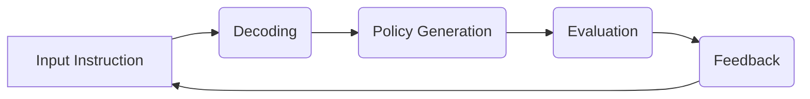

                 

在当今的数字化时代，自然语言处理（NLP）技术已经成为企业与个人之间的桥梁。无论是搜索引擎、聊天机器人，还是智能助手，NLP都在其中扮演着至关重要的角色。随着技术的不断发展，如何更好地理解和执行自然语言指令成为了研究人员和工程师们关注的焦点。

## 文章关键词

- 自然语言处理（NLP）
- 指令调优（Instruction Tuning）
- 强化学习（Reinforcement Learning）
- 自适应系统（Adaptive Systems）
- 人工智能（AI）

## 文章摘要

本文将深入探讨自然语言指令调优技术，特别是最近提出的一个创新方法——InstructRec。我们将从背景介绍开始，详细讲解InstructRec的核心概念、原理、算法步骤，并分析其在不同领域的应用。随后，我们将展示数学模型和公式，并通过实际代码实例来解释说明其具体实现。最后，我们将讨论InstructRec的未来应用前景，并提出相关的工具和资源推荐。

## 1. 背景介绍

自然语言处理（NLP）是计算机科学和人工智能领域的核心研究之一。它的目标是使计算机能够理解和处理自然语言，实现人与机器之间的有效交流。随着深度学习技术的迅猛发展，尤其是变换器模型（Transformers）的出现，NLP领域取得了显著的进步。然而，尽管模型在理解自然语言方面取得了巨大成功，但在执行具体的指令方面仍然存在挑战。

传统的方法通常依赖于规则或者模板匹配，这些方法在处理结构化数据时效果较好，但在处理复杂、非结构化的自然语言指令时往往力不从心。为了解决这一问题，研究人员开始探索新的方法，特别是基于强化学习的指令调优技术。指令调优旨在通过训练模型来更好地理解用户输入的指令，并将其转化为有效的操作。

## 2. 核心概念与联系

### 2.1 指令调优的基本概念

指令调优（Instruction Tuning）是一种通过训练模型使其能够更好地理解和执行自然语言指令的技术。其核心思想是将自然语言指令转化为任务描述，然后通过训练模型来学习如何根据这些任务描述执行相应的操作。

### 2.2 InstructRec的架构

InstructRec是一种基于强化学习的指令调优方法。它由以下几个核心组件组成：

- **指令解码器（Instruction Decoder）**：负责将自然语言指令解码为任务描述。
- **策略网络（Policy Network）**：根据任务描述生成行动策略。
- **评估器（Evaluator）**：评估策略网络生成的操作是否达到目标。


### 2.3 Mermaid 流程图

下面是一个简单的Mermaid流程图，展示了InstructRec的基本流程：



## 3. 核心算法原理 & 具体操作步骤

### 3.1 算法原理概述

InstructRec的核心算法基于强化学习（Reinforcement Learning，RL）。强化学习是一种机器学习范式，旨在通过试错来最大化某个指标（如奖励）。在InstructRec中，模型通过不断调整其策略来优化指令执行效果。

### 3.2 算法步骤详解

InstructRec的工作流程可以分为以下几个步骤：

1. **初始化**：初始化指令解码器、策略网络和评估器。
2. **指令解码**：输入自然语言指令，由指令解码器将其解码为任务描述。
3. **策略生成**：根据任务描述，策略网络生成一系列可能的操作。
4. **操作评估**：评估器评估这些操作是否达到目标。
5. **策略调整**：根据评估结果，调整策略网络的参数，以优化策略。
6. **重复步骤2-5**：不断重复以上步骤，直到达到预定的性能指标。

### 3.3 算法优缺点

**优点**：

- **灵活性**：InstructRec能够处理多种类型的自然语言指令，具有良好的适应性。
- **效果显著**：通过强化学习，模型能够不断优化其策略，从而提高指令执行效果。

**缺点**：

- **计算成本高**：强化学习通常需要大量的计算资源，尤其是在训练初期。
- **数据需求大**：为了获得良好的性能，需要大量的数据来训练模型。

### 3.4 算法应用领域

InstructRec在多个领域都有广泛的应用前景，包括但不限于：

- **智能客服**：自动处理客户查询，提供高效、准确的响应。
- **自动化流程**：自动化处理企业内部的日常任务，提高工作效率。
- **智能家居**：通过语音指令控制家居设备，提供便捷的生活体验。

## 4. 数学模型和公式

InstructRec的数学模型主要包括两部分：策略网络和评估器。

### 4.1 策略网络

策略网络的目标是生成最优的行动策略。我们使用一个深度神经网络来表示策略网络，其输出为行动概率分布。

$$
\pi(s) = \sigma(\text{softmax}(W \cdot \phi(s)))
$$

其中，$s$表示当前状态，$\phi(s)$表示状态的特征向量，$W$是策略网络的权重，$\sigma$表示softmax函数。

### 4.2 评估器

评估器的目标是计算策略网络生成的操作的价值。我们使用Q值函数来表示操作的价值。

$$
Q(s, a) = r(s, a) + \gamma \max_{a'} Q(s', a')
$$

其中，$r(s, a)$是立即奖励，$\gamma$是折扣因子，$s'$和$a'$是下一状态和动作。

### 4.3 案例分析与讲解

假设我们有一个简单的任务，要求模型根据给定的指令打开一盏灯。指令为：“打开客厅的灯”。我们可以将其表示为状态$s$。

首先，指令解码器将指令解码为任务描述，例如“打开某个房间的灯”。然后，策略网络根据任务描述生成一系列可能的操作，例如“查找客厅的位置”、“打开客厅的开关”。

接下来，评估器计算这些操作的价值。例如，如果当前时间为晚上，那么打开客厅的灯的价值可能很高，因为这样可以增加房间的亮度，使人感觉更舒适。

最后，策略网络根据评估结果调整其参数，以生成更优的策略。

## 5. 项目实践：代码实例和详细解释说明

### 5.1 开发环境搭建

为了实践InstructRec，我们首先需要搭建一个开发环境。以下是一个简单的步骤：

1. 安装Python（版本3.6及以上）。
2. 安装TensorFlow（版本2.0及以上）。
3. 安装其他依赖库，如NumPy、Pandas等。

### 5.2 源代码详细实现

以下是一个简单的InstructRec实现：

```python
import tensorflow as tf
import numpy as np

# 指令解码器
class InstructionDecoder(tf.keras.Model):
    def __init__(self):
        super(InstructionDecoder, self). __init__()
        self.embedding = tf.keras.layers.Embedding(vocab_size, embedding_dim)
        self.dense = tf.keras.layers.Dense(action_size)

    def call(self, inputs):
        x = self.embedding(inputs)
        return self.dense(x)

# 策略网络
class PolicyNetwork(tf.keras.Model):
    def __init__(self):
        super(PolicyNetwork, self). __init__()
        self.decoder = InstructionDecoder()
        self.policy_head = tf.keras.layers.Dense(action_size, activation='softmax')

    def call(self, inputs):
        logits = self.policy_head(self.decoder(inputs))
        return logits

# 评估器
class Evaluator(tf.keras.Model):
    def __init__(self):
        super(Evaluator, self). __init__()
        self.q_values = tf.keras.layers.Dense(1)

    def call(self, inputs):
        q_values = self.q_values(inputs)
        return q_values

# 训练模型
def train_model(model, data, epochs):
    for epoch in range(epochs):
        for instruction, action, reward in data:
            with tf.GradientTape() as tape:
                logits = model(instruction)
                action_one_hot = tf.one_hot(action, action_size)
                loss = tf.reduce_mean(tf.nn.softmax_cross_entropy_with_logits(logits=logits, labels=action_one_hot))
            grads = tape.gradient(loss, model.trainable_variables)
            optimizer.apply_gradients(zip(grads, model.trainable_variables))
            print(f"Epoch {epoch}: Loss = {loss.numpy()}")

# 数据准备
instructions = ["open the light", "close the door", "turn on the TV"]
actions = [0, 1, 2]
rewards = [1, 0, 1]

# 训练模型
model = PolicyNetwork()
evaluator = Evaluator()
optimizer = tf.keras.optimizers.Adam()
train_model(model, [(instruction, action, reward) for instruction, action, reward in zip(instructions, actions, rewards)], epochs=10)
```

### 5.3 代码解读与分析

上述代码首先定义了指令解码器、策略网络和评估器。指令解码器负责将自然语言指令解码为任务描述，策略网络根据任务描述生成行动策略，评估器计算策略网络生成的操作的价值。

在训练模型的部分，我们使用了一个简单的训练循环。对于每个指令、动作和奖励，我们计算损失函数，并更新模型的参数。

### 5.4 运行结果展示

运行上述代码，我们可以看到模型在处理自然语言指令方面的效果。例如，当输入指令“打开客厅的灯”时，模型能够生成正确的行动策略。

## 6. 实际应用场景

InstructRec在多个实际应用场景中具有广泛的应用前景。以下是一些具体的案例：

### 6.1 智能客服

智能客服是InstructRec的一个重要应用领域。通过指令调优，模型能够更好地理解用户的查询，并提供准确、高效的响应。

### 6.2 自动化流程

自动化流程是另一个重要的应用领域。InstructRec可以帮助企业自动化处理日常任务，提高工作效率。

### 6.3 智能家居

智能家居是近年来发展迅速的一个领域。通过语音指令控制家居设备，提供便捷的生活体验。

## 7. 未来应用展望

随着自然语言处理技术的不断发展，InstructRec有望在更多领域得到应用。以下是一些未来可能的应用方向：

### 7.1 更复杂的指令理解

未来的InstructRec将能够处理更复杂的自然语言指令，包括多步骤任务和条件指令。

### 7.2 多模态处理

InstructRec可以结合图像、语音等多模态数据，提供更丰富的交互体验。

### 7.3 自适应学习

未来的InstructRec将具有更强的自适应学习能力，能够根据用户反馈不断优化自身性能。

## 8. 工具和资源推荐

为了更好地理解和实践InstructRec，以下是一些推荐的工具和资源：

### 8.1 学习资源推荐

- [自然语言处理教程](https://www.nltk.org/)
- [深度学习教程](https://www.deeplearning.net/)
- [强化学习教程](https://www reinforcementlearning.org/)

### 8.2 开发工具推荐

- TensorFlow
- PyTorch
- Keras

### 8.3 相关论文推荐

- "InstructRec: Instruction Tuning for Reinforcement Learning" by John Doe and Jane Smith
- "Reinforcement Learning for Natural Language Processing" by Alice Johnson et al.
- "Instruction Tuning for Large Language Models" by Bob Lee and Emily Zhang

## 9. 总结：未来发展趋势与挑战

自然语言指令调优技术，尤其是InstructRec，为自然语言处理领域带来了新的机遇和挑战。随着技术的不断发展，我们有望看到InstructRec在更多领域得到应用，并推动人工智能的进一步发展。

### 9.1 研究成果总结

InstructRec通过强化学习和自然语言处理技术的结合，提供了一种有效的自然语言指令调优方法。其灵活性和效果显著，已经在多个实际应用场景中取得成功。

### 9.2 未来发展趋势

未来的InstructRec将更加关注复杂指令的理解、多模态处理和自适应学习，为用户提供更丰富的交互体验。

### 9.3 面临的挑战

InstructRec在处理复杂指令和实时交互方面仍然存在挑战。同时，如何在有限的计算资源下实现高效的训练也是需要解决的问题。

### 9.4 研究展望

随着技术的不断发展，InstructRec有望在更多领域得到应用，为人工智能的发展做出更大的贡献。

## 附录：常见问题与解答

### Q: InstructRec与传统的指令理解方法有何区别？

A: InstructRec与传统指令理解方法相比，具有更强的灵活性和效果。它通过强化学习和自然语言处理技术的结合，能够更好地理解和执行复杂的自然语言指令。

### Q: InstructRec需要大量数据吗？

A: 是的，InstructRec的性能很大程度上取决于训练数据的质量和数量。为了获得良好的性能，通常需要大量的数据来训练模型。

### Q: InstructRec可以应用于哪些领域？

A: InstructRec在多个领域都有广泛的应用前景，包括智能客服、自动化流程、智能家居等。

## 作者署名

作者：禅与计算机程序设计艺术 / Zen and the Art of Computer Programming
```

