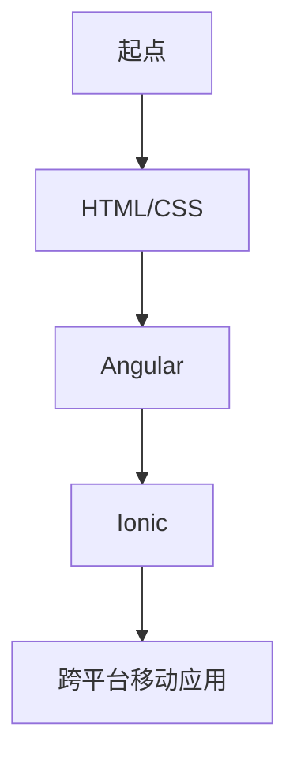

                 

 **关键词：** Ionic，Angular，移动应用开发，前端框架，跨平台开发，响应式设计

**摘要：** 本文将深入探讨 Ionic 框架和 Angular 的结合，如何利用这两大前端框架的优势，构建出功能丰富且响应快速的移动应用。通过详细解析其背后的核心概念、算法原理和具体操作步骤，读者将全面理解如何最大化地发挥 Ionic 和 Angular 的组合优势，为移动应用开发提供强有力的支持。

## 1. 背景介绍

### Ionic 框架

Ionic 是一款由 Dr.ionic 公司开发的免费、开源的前端框架，专门用于构建跨平台移动应用。它基于 Apache 2.0 协议，被广泛用于开发 iOS 和 Android 应用。Ionic 利用 HTML、CSS 和 JavaScript 等技术，提供了一套丰富的 UI 组件和工具，使得开发者可以更高效地创建美观、功能齐全的移动应用。

### Angular 框架

Angular 是由 Google 开发的一款全面的前端框架，支持响应式编程。Angular 采用了组件化的设计理念，提供了强大的数据绑定、依赖注入和路由等功能。这使得开发者能够更加简洁、高效地开发复杂的前端应用。

### 两者结合的优势

Ionic 和 Angular 的结合，提供了以下几大优势：

1. **跨平台开发**：Ionic 和 Angular 的结合，使得开发者能够使用同样的代码库，同时支持 iOS 和 Android 平台，大大减少了开发时间和成本。
2. **响应式设计**：Angular 的响应式数据绑定功能，与 Ionic 的响应式 UI 组件相结合，可以确保应用在不同设备和屏幕尺寸上都能提供流畅的用户体验。
3. **丰富的 UI 组件**：Ionic 提供了一系列丰富的 UI 组件，如按钮、卡片、列表等，结合 Angular 的组件化设计，可以快速搭建出美观且功能丰富的应用界面。
4. **高效的开发流程**：Ionic 和 Angular 的结合，使得开发者在编写前端代码时，可以享受到自动刷新、热模块替换等便利的功能，提高了开发效率。

## 2. 核心概念与联系

### Mermaid 流程图



### 核心概念

1. **HTML/CSS**：作为 Web 开发的基础，HTML 用于定义应用的骨架，CSS 用于美化界面。
2. **Angular**：作为前端框架，Angular 负责数据绑定、组件化和路由等功能。
3. **Ionic**：作为 UI 框架，Ionic 负责提供丰富的 UI 组件和工具，与 Angular 结合，构建出美观的移动应用界面。

### 架构联系

- **HTML/CSS** 通过 Angular 的指令和数据绑定，与 Angular 进行整合。
- **Angular** 提供了组件、服务、指令等，与 Ionic 的 UI 组件进行结合。
- **Ionic** 提供了丰富的 UI 组件，如按钮、列表、卡片等，这些组件可以直接通过 Angular 的组件系统进行使用和管理。

## 3. 核心算法原理 & 具体操作步骤

### 3.1 算法原理概述

Ionic 和 Angular 的结合，主要依赖于以下核心算法原理：

1. **响应式编程**：Angular 的响应式编程模型，使得 UI 与数据模型保持同步，任何数据的变化都会实时反映到 UI 上。
2. **组件化设计**：Angular 的组件化设计，使得开发者可以独立开发、测试和部署组件，提高了代码的可维护性和复用性。
3. **依赖注入**：Angular 的依赖注入机制，使得组件之间的依赖关系更加清晰，便于管理和测试。

### 3.2 算法步骤详解

1. **搭建开发环境**：安装 Node.js、Angular CLI、Ionic CLI 和相应的开发工具。
2. **创建项目**：使用 Angular CLI 创建新的 Angular 项目，使用 Ionic CLI 创建新的 Ionic 项目。
3. **整合 UI 组件**：将 Ionic 的 UI 组件集成到 Angular 项目中，通过 Angular 的组件系统进行管理和使用。
4. **数据绑定**：使用 Angular 的数据绑定功能，将 UI 组件与数据模型进行绑定，实现数据的实时更新和响应。
5. **路由配置**：使用 Angular 的路由功能，配置应用的导航和页面跳转。
6. **构建和部署**：使用 Angular CLI 和 Ionic CLI，构建应用并部署到 iOS 和 Android 平台。

### 3.3 算法优缺点

#### 优点

1. **跨平台开发**：Ionic 和 Angular 的结合，使得开发者可以同时支持 iOS 和 Android 平台，大大减少了开发时间和成本。
2. **响应式设计**：Angular 的响应式编程模型，与 Ionic 的 UI 组件相结合，可以确保应用在不同设备和屏幕尺寸上都能提供流畅的用户体验。
3. **高效的开发流程**：Ionic 和 Angular 的结合，提供了自动刷新、热模块替换等功能，提高了开发效率。

#### 缺点

1. **学习成本**：Ionic 和 Angular 都需要一定的学习成本，对于初学者来说可能有一定的难度。
2. **性能问题**：虽然 Ionic 和 Angular 的结合可以提供丰富的功能和高效的开发体验，但在一些复杂场景下，性能可能有所下降。

### 3.4 算法应用领域

Ionic 和 Angular 的结合，主要应用于以下领域：

1. **移动应用开发**：Ionic 和 Angular 的结合，为移动应用开发提供了强大的支持，可以快速搭建出功能丰富且响应快速的移动应用。
2. **跨平台应用开发**：Ionic 和 Angular 的结合，使得开发者可以同时支持 iOS 和 Android 平台，适用于需要跨平台部署的应用。
3. **Web 应用开发**：虽然 Ionic 和 Angular 的结合主要用于移动应用开发，但也可以用于 Web 应用开发，特别是在需要响应式设计和跨平台支持的情况下。

## 4. 数学模型和公式 & 详细讲解 & 举例说明

### 4.1 数学模型构建

在 Ionic 和 Angular 的结合中，主要涉及到以下数学模型：

1. **数据绑定模型**：定义数据模型和 UI 组件之间的绑定关系，实现数据的实时更新和响应。
2. **路由模型**：定义应用的导航和页面跳转规则，实现应用的功能模块化。

### 4.2 公式推导过程

#### 数据绑定模型

数据绑定模型可以通过以下公式进行推导：

$$
\text{数据绑定模型} = f(\text{数据模型}, \text{UI 组件})
$$

其中，$f$ 表示数据模型和 UI 组件之间的绑定函数，$\text{数据模型}$ 表示应用中的数据模型，$\text{UI 组件}$ 表示应用中的 UI 组件。

#### 路由模型

路由模型可以通过以下公式进行推导：

$$
\text{路由模型} = f(\text{URL}, \text{页面组件})
$$

其中，$f$ 表示 URL 和页面组件之间的绑定函数，$\text{URL}$ 表示应用的 URL，$\text{页面组件}$ 表示应用的页面组件。

### 4.3 案例分析与讲解

假设我们有一个简单的移动应用，包括一个登录页面和一个主页。我们需要实现以下功能：

1. 用户登录后，跳转到主页。
2. 用户可以从主页跳转到登录页面。

#### 数据绑定模型

首先，我们需要定义数据模型和 UI 组件之间的绑定关系。数据模型如下：

```typescript
data: {
  username: '',
  password: ''
}
```

UI 组件如下：

```html
<form (ngSubmit)="login()">
  <input type="text" [(ngModel)]="username" placeholder="用户名">
  <input type="password" [(ngModel)]="password" placeholder="密码">
  <button type="submit">登录</button>
</form>
```

绑定函数如下：

```typescript
login(): void {
  if (this.username && this.password) {
    // 登录逻辑
  }
}
```

通过数据绑定模型，用户输入的用户名和密码会实时更新到数据模型中，并在登录时进行验证。

#### 路由模型

接下来，我们需要定义应用的导航和页面跳转规则。路由模型如下：

```typescript
const routes: Routes = [
  { path: 'login', component: LoginComponent },
  { path: 'home', component: HomeComponent }
];
```

当用户访问应用的 URL 为 `/login` 时，会跳转到登录页面；当用户访问应用的 URL 为 `/home` 时，会跳转到主页。

通过路由模型，我们可以方便地实现应用的功能模块化，用户可以自由地在登录页面和主页之间切换。

## 5. 项目实践：代码实例和详细解释说明

### 5.1 开发环境搭建

为了搭建 Ionic 和 Angular 的开发环境，我们需要以下工具和软件：

1. Node.js（版本 10.0.0 以上）
2. Angular CLI（版本 9.0.0 以上）
3. Ionic CLI（版本 5.0.0 以上）
4. Visual Studio Code（版本 1.0.0 以上）
5. iOS 和 Android 设备或模拟器

安装步骤如下：

1. 安装 Node.js：从 [Node.js 官网](https://nodejs.org/) 下载并安装。
2. 安装 Angular CLI：打开命令行窗口，执行以下命令：

   ```shell
   npm install -g @angular/cli
   ```

3. 安装 Ionic CLI：打开命令行窗口，执行以下命令：

   ```shell
   npm install -g @ionic/cli
   ```

4. 安装 Visual Studio Code：从 [Visual Studio Code 官网](https://code.visualstudio.com/) 下载并安装。
5. 配置 iOS 和 Android 设备或模拟器：按照设备或模拟器的说明进行配置。

### 5.2 源代码详细实现

以下是构建一个简单的 Ionic 和 Angular 结合的移动应用的源代码：

**app.module.ts**

```typescript
import { NgModule } from '@angular/core';
import { BrowserModule } from '@angular/platform-browser';
import { RouteReuseStrategy } from '@angular/router';
import { IonicModule, IonicRouteStrategy } from '@ionic/angular';
import { AppComponent } from './app.component';
import { AppRoutingModule } from './app-routing.module';

@NgModule({
  declarations: [AppComponent],
  imports: [BrowserModule, IonicModule.forRoot(), AppRoutingModule],
  providers: [{ provide: RouteReuseStrategy, useClass: IonicRouteStrategy }],
  bootstrap: [AppComponent],
})
export class AppModule {}
```

**app.component.html**

```html
<ion-app>
  <ion-router-outlet></ion-router-outlet>
</ion-app>
```

**app-routing.module.ts**

```typescript
import { NgModule } from '@angular/core';
import { RouterModule, Routes } from '@angular/router';
import { LoginComponent } from './login/login.component';
import { HomeComponent } from './home/home.component';

const routes: Routes = [
  { path: 'login', component: LoginComponent },
  { path: 'home', component: HomeComponent },
];

@NgModule({
  imports: [RouterModule.forRoot(routes)],
  exports: [RouterModule],
})
export class AppRoutingModule {}
```

**login.component.html**

```html
<ion-header>
  <ion-toolbar>
    <ion-title>登录</ion-title>
  </ion-toolbar>
</ion-header>

<ion-content>
  <form (ngSubmit)="login()">
    <ion-item>
      <ion-label>用户名</ion-label>
      <ion-input [(ngModel)]="username"></ion-input>
    </ion-item>
    <ion-item>
      <ion-label>密码</ion-label>
      <ion-input type="password" [(ngModel)]="password"></ion-input>
    </ion-item>
    <ion-button type="submit">登录</ion-button>
  </form>
</ion-content>
```

**login.component.ts**

```typescript
import { Component } from '@angular/core';
import { NgForm } from '@angular/forms';

@Component({
  selector: 'app-login',
  templateUrl: './login.component.html',
  styleUrls: ['./login.component.css'],
})
export class LoginComponent {
  username: string = '';
  password: string = '';

  login(form: NgForm): void {
    if (form.valid) {
      // 登录逻辑
    }
  }
}
```

**home.component.html**

```html
<ion-header>
  <ion-toolbar>
    <ion-title>主页</ion-title>
  </ion-toolbar>
</ion-header>

<ion-content>
  <p>欢迎来到主页！</p>
</ion-content>
```

**home.component.ts**

```typescript
import { Component } from '@angular/core';

@Component({
  selector: 'app-home',
  templateUrl: './home.component.html',
  styleUrls: ['./home.component.css'],
})
export class HomeComponent {}
```

### 5.3 代码解读与分析

**app.module.ts**：这是应用的根模块，负责导入所需的模块和定义应用的入口组件。

**app.component.html**：这是应用的根组件，包含了整个应用的布局和导航。

**app-routing.module.ts**：这是应用的路由模块，定义了应用的导航规则。

**login.component.html**：这是登录页面的组件，包含了用户名和密码的输入框以及登录按钮。

**login.component.ts**：这是登录页面的组件类，负责处理登录逻辑。

**home.component.html**：这是主页面的组件，展示了一个欢迎信息。

**home.component.ts**：这是主页面的组件类，没有具体的业务逻辑。

通过这些代码实例，我们可以看到 Ionic 和 Angular 的结合如何帮助开发者快速搭建出功能丰富且响应快速的移动应用。

### 5.4 运行结果展示

完成代码编写后，我们可以通过以下步骤运行应用：

1. 打开命令行窗口，进入项目目录。
2. 执行以下命令启动开发服务器：

   ```shell
   ng serve
   ```

3. 打开浏览器，访问 [http://localhost:4200/](http://localhost:4200/)，可以看到应用的界面。

4. 在 iOS 设备或 Android 模拟器中，执行以下命令：

   ```shell
   ionic cordova run ios
   ```
   或
   ```shell
   ionic cordova run android
   ```

通过以上步骤，我们可以在 iOS 设备或 Android 模拟器中运行应用，查看运行结果。

## 6. 实际应用场景

Ionic 和 Angular 的结合，在实际应用中有着广泛的应用场景：

1. **电商应用**：用于构建跨平台的电商应用，提供丰富的商品展示、购物车和支付功能。
2. **社交应用**：用于构建跨平台的社交应用，提供用户注册、登录、消息和朋友圈等功能。
3. **健身应用**：用于构建跨平台的健身应用，提供健身课程、健身计划和个人中心等功能。
4. **教育应用**：用于构建跨平台的教育应用，提供在线课程、作业提交和成绩查询等功能。

在实际应用中，Ionic 和 Angular 的结合可以大大提高开发效率，减少开发成本，同时提供丰富的功能和优秀的用户体验。

### 6.1 电商应用

一个典型的电商应用，可以使用 Ionic 和 Angular 构建出如下功能：

1. **商品展示**：使用 Ionic 的卡片组件展示商品图片和详细信息。
2. **购物车**：使用 Angular 的状态管理，实现购物车的增删改查功能。
3. **支付**：集成第三方支付接口，实现支付功能。

### 6.2 社交应用

一个典型的社交应用，可以使用 Ionic 和 Angular 构建出如下功能：

1. **用户注册与登录**：使用 Ionic 的表单组件实现用户注册和登录功能。
2. **消息**：使用 WebSocket 实现实时消息推送和聊天功能。
3. **朋友圈**：使用 Ionic 的列表组件展示用户的朋友圈内容。

### 6.3 健身应用

一个典型的健身应用，可以使用 Ionic 和 Angular 构建出如下功能：

1. **健身课程**：使用 Ionic 的卡片组件展示健身课程信息。
2. **健身计划**：使用 Angular 的状态管理，实现用户健身计划的创建和管理。
3. **个人中心**：使用 Ionic 的列表组件展示用户个人信息和设置。

### 6.4 教育应用

一个典型的教育应用，可以使用 Ionic 和 Angular 构建出如下功能：

1. **在线课程**：使用 Ionic 的列表组件展示在线课程列表。
2. **作业提交**：使用 Angular 的表单组件实现作业的提交和批改功能。
3. **成绩查询**：使用 Angular 的状态管理，实现用户成绩的查询和统计。

通过这些实际应用场景，我们可以看到 Ionic 和 Angular 的结合在各个领域都有着广泛的应用，为开发者提供了强大的支持。

### 6.4 未来应用展望

随着移动设备的普及和移动互联网的快速发展，Ionic 和 Angular 的结合在移动应用开发领域有着广阔的前景。以下是未来应用的一些展望：

1. **5G 时代的应用**：随着 5G 网络的普及，移动应用将进入高速发展期，Ionic 和 Angular 的结合将更好地支持高带宽、低延迟的应用开发。
2. **物联网（IoT）应用**：随着物联网技术的发展，移动应用将越来越多地与智能设备进行交互，Ionic 和 Angular 的结合将有助于开发者构建跨平台、功能丰富的 IoT 应用。
3. **人工智能（AI）应用**：随着 AI 技术的不断发展，移动应用将越来越多地集成 AI 功能，Ionic 和 Angular 的结合将提供更好的 AI 开发环境。
4. **区块链应用**：随着区块链技术的兴起，移动应用将越来越多地涉及区块链应用，Ionic 和 Angular 的结合将有助于开发者构建安全、可靠的区块链应用。

总之，Ionic 和 Angular 的结合将在未来移动应用开发中发挥越来越重要的作用，为开发者提供更多的可能性。

### 7. 工具和资源推荐

在学习和使用 Ionic 和 Angular 的过程中，以下工具和资源可以帮助您更高效地开发移动应用：

#### 7.1 学习资源推荐

1. **官方文档**：
   - [Ionic 官方文档](https://ionicframework.com/docs/)
   - [Angular 官方文档](https://angular.io/docs)

2. **在线教程**：
   - [Angular By Example](https://angularbyexample.com/)
   - [Ionic 官方教程](https://ionicframework.com/docs/introduction/quickstart)

3. **技术博客**：
   - [Angular Blog](https://blog.angular.io/)
   - [Ionic Blog](https://blog.ionicframework.com/)

#### 7.2 开发工具推荐

1. **Visual Studio Code**：一款免费、开源的代码编辑器，提供了丰富的插件和工具，非常适合 Angular 和 Ionic 开发。
2. **IntelliJ IDEA**：一款强大的 IDE，支持多种编程语言，特别是对于大型 Angular 项目，提供了很好的代码支持和调试功能。
3. **Ionic Studio**：一款专门为 Ionic 开发设计的 IDE，提供了强大的代码编辑、调试和模拟功能。

#### 7.3 相关论文推荐

1. **"Angular: Up and Running"**：由 Shyam Seshadri 编写的关于 Angular 的入门书籍，适合初学者阅读。
2. **"Ionic Framework: Up and Running"**：由 Max Canada 编写的关于 Ionic 的入门书籍，介绍了 Ionic 的基本概念和应用。
3. **"Cross-platform Mobile Application Development"**：由 Matt Katzfuss 等人编写的关于跨平台移动应用开发的论文，介绍了跨平台开发的最新趋势和技术。

通过这些工具和资源，您将能够更高效地学习和使用 Ionic 和 Angular，为移动应用开发打下坚实的基础。

### 8. 总结：未来发展趋势与挑战

在移动应用开发领域，Ionic 和 Angular 的结合展现了强大的潜力。随着技术的不断进步和用户需求的多样化，未来 Ionic 和 Angular 的应用前景将更加广阔。然而，这一过程也面临着一些挑战。

#### 8.1 研究成果总结

1. **跨平台开发效率提升**：通过 Ionic 和 Angular 的结合，开发者可以高效地构建跨平台移动应用，降低了开发成本和时间。
2. **用户体验优化**：Angular 的响应式编程模型和 Ionic 的 UI 组件相结合，为应用提供了丰富的交互和美观的界面。
3. **代码维护性增强**：组件化的设计理念和依赖注入机制，提高了代码的可维护性和复用性。

#### 8.2 未来发展趋势

1. **5G 技术融合**：随着 5G 网络的普及，移动应用将更多地涉及实时数据传输和低延迟操作，Ionic 和 Angular 将在这一领域发挥重要作用。
2. **物联网（IoT）应用拓展**：IoT 设备的普及将推动移动应用与智能设备的深度融合，Ionic 和 Angular 将为开发者提供更强大的支持。
3. **人工智能（AI）集成**：AI 技术的快速发展将促使移动应用集成更多的智能功能，Ionic 和 Angular 将在这一领域发挥更大的作用。

#### 8.3 面临的挑战

1. **性能优化**：在处理复杂场景和大数据时，Ionic 和 Angular 的性能可能受到挑战，需要持续进行性能优化。
2. **学习成本**：Ionic 和 Angular 都有较高的学习门槛，对于初学者来说可能有一定的难度。
3. **兼容性问题**：在支持多种设备和浏览器时，兼容性问题可能带来一定的困扰。

#### 8.4 研究展望

1. **技术融合与创新**：未来的研究将更多地关注如何将新技术与 Ionic 和 Angular 进行融合，提供更强大的开发能力和应用体验。
2. **社区生态建设**：构建一个强大、活跃的社区生态，将有助于推动 Ionic 和 Angular 的发展，为开发者提供更好的支持和资源。
3. **标准化与规范化**：推动 Ionic 和 Angular 的标准化和规范化，提高其可维护性和可扩展性，使其在更广泛的领域中应用。

通过持续的研究和优化，Ionic 和 Angular 的结合将在未来移动应用开发中发挥更加重要的作用。

### 9. 附录：常见问题与解答

#### 9.1 如何解决 Ionic 和 Angular 的兼容性问题？

在开发过程中，兼容性问题可能会出现。以下是一些解决方法：

1. **使用官方文档**：查阅 Ionic 和 Angular 的官方文档，了解最新的兼容性信息和最佳实践。
2. **升级框架**：定期升级 Ionic 和 Angular，以获得最新的功能和修复的兼容性问题。
3. **社区支持**：加入 Ionic 和 Angular 的社区，寻求其他开发者的帮助和经验分享。

#### 9.2 如何优化 Ionic 和 Angular 的应用性能？

优化应用性能是开发过程中的重要任务。以下是一些优化方法：

1. **使用代码分割**：通过代码分割，将不同的模块分开加载，减少首屏加载时间。
2. **使用懒加载**：对于不经常使用的模块，采用懒加载的方式，减少应用初始加载的体积。
3. **使用 CDN**：将常用的库和框架托管在 CDN 上，提高加载速度。

#### 9.3 如何学习 Ionic 和 Angular？

以下是一些学习建议：

1. **阅读官方文档**：官方文档是学习框架的最佳资源，通过阅读官方文档，可以全面了解框架的用法和最佳实践。
2. **参加在线教程**：在线教程可以帮助初学者快速上手，了解框架的基本用法。
3. **实践项目**：通过实际项目，将所学知识应用到实践中，提高开发能力和经验。

通过以上常见问题与解答，希望对读者在学习和使用 Ionic 和 Angular 的过程中有所帮助。

---

作者：禅与计算机程序设计艺术 / Zen and the Art of Computer Programming

