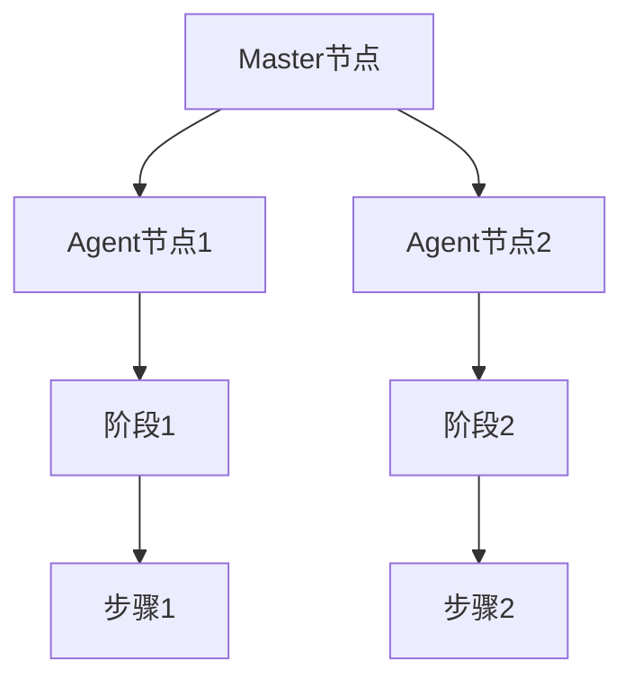

                 

 > **关键词**：Jenkins, DevOps, Continuous Integration, Pipeline, 脚本开发, Jenkinsfile, 架构设计, 持续集成与持续部署

> **摘要**：本文将深入探讨Jenkins Pipeline脚本的开发，包括其背景、核心概念、算法原理、数学模型、项目实践以及未来应用展望。通过详细讲解，读者将掌握如何使用Jenkins Pipeline提高软件开发和部署的效率。

## 1. 背景介绍

Jenkins是一个开源的持续集成（Continuous Integration，CI）工具，自2004年问世以来，它已经成为许多软件开发团队中不可或缺的一部分。随着DevOps文化的兴起，Jenkins的重要性进一步凸显。DevOps强调开发和运维之间的紧密协作，通过自动化流程来提高软件交付的速度和质量。在这种背景下，Jenkins Pipeline应运而生，它提供了更强大的自动化能力，使得持续集成和持续部署（Continuous Deployment，CD）变得更加简单和高效。

Jenkins Pipeline是一个插件，它扩展了Jenkins的功能，允许开发者创建基于代码的工作流程。Pipeline脚本是用Groovy语言编写的，可以定义复杂的构建、测试和部署过程。这使得团队能够以代码的形式管理其CI/CD流程，提高了流程的可见性和可维护性。

### 1.1 DevOps与CI/CD的关系

DevOps是一种软件开发和运营的方法论，它强调开发、测试、质量和运营团队之间的协作和整合。DevOps的核心原则之一是快速、频繁地交付高质量的软件，以满足不断变化的市场需求。持续集成（CI）和持续部署（CD）是实现这一目标的关键技术。

持续集成是指团队成员频繁地将代码合并到主分支，并通过自动化测试确保合并后的代码质量。持续部署则是指自动将经过测试的代码部署到生产环境。这两者结合在一起，形成了CI/CD流程，它能够大幅缩短软件交付周期，提高软件质量。

### 1.2 Jenkins Pipeline的优势

Jenkins Pipeline具有以下优势：

- **基于代码的管理**：Pipeline脚本以代码的形式定义工作流程，易于管理和维护。
- **灵活性和可扩展性**：使用Groovy语言编写，支持复杂的流程定义和扩展。
- **可视化**：Jenkins提供了一个直观的可视化界面，可以帮助开发者轻松理解工作流程。
- **集成性**：Jenkins本身与众多工具和服务集成，如Git、Docker、AWS等。

## 2. 核心概念与联系

在深入讨论Jenkins Pipeline脚本开发之前，我们需要了解一些核心概念和它们之间的关系。

### 2.1 Jenkins Pipeline的核心概念

- **Pipeline**：Pipeline是一个工作流程的定义，它包括一系列的阶段（Stage）和步骤（Step）。
- **阶段（Stage）**：Stage是一个逻辑上的分组，用于组织相关的步骤。
- **步骤（Step）**：Step是执行的具体任务，可以是构建、测试、部署等。
- **脚本**：Pipeline脚本是用Groovy语言编写的，定义了整个工作流程。

### 2.2 Jenkins Pipeline的架构

Jenkins Pipeline的架构可以分为以下几个部分：

- **Master节点**：Master节点是Jenkins的主服务器，负责解析和执行Pipeline脚本。
- **Agent节点**：Agent节点是工作节点，负责执行实际的构建和部署任务。
- **Job**：Job是Jenkins中的一个工作单元，可以是自由风格的或者Pipeline的。

### 2.3 Mermaid流程图

下面是一个简单的Mermaid流程图，展示了Jenkins Pipeline的基本架构：



## 3. 核心算法原理 & 具体操作步骤

### 3.1 算法原理概述

Jenkins Pipeline的核心算法是基于Groovy语言的。Groovy是一种动态编程语言，它具有简洁、易读的特点，非常适合用于编写脚本。Pipeline脚本通过定义一系列的阶段和步骤，实现了自动化的工作流程。

### 3.2 算法步骤详解

下面是一个简单的Jenkins Pipeline脚本示例，展示了其基本结构和执行流程：

```groovy
pipeline {
    agent any

    stages {
        stage('构建') {
            steps {
                sh 'mvn clean install'
            }
        }
        stage('测试') {
            steps {
                sh 'mvn test'
            }
        }
        stage('部署') {
            steps {
                sh 'mvn deploy'
            }
        }
    }
}
```

在这个脚本中，我们定义了一个名为`Pipeline`的Pipeline作业，它包含三个阶段：构建、测试和部署。每个阶段包含一个或多个步骤，这些步骤通过`sh`命令执行shell脚本。

### 3.3 算法优缺点

#### 优点

- **灵活性**：Groovy语言的灵活性使得开发者可以轻松地定义复杂的工作流程。
- **可视化**：Jenkins提供了直观的可视化界面，使得工作流程易于理解和维护。
- **集成性**：Jenkins与众多工具和服务集成，方便开发者实现自动化。

#### 缺点

- **学习成本**：Groovy语言的学习成本相对较高，需要开发者具备一定的编程基础。
- **性能**：相比于其他自动化工具，Jenkins的性能可能不是最佳选择。

### 3.4 算法应用领域

Jenkins Pipeline适用于以下领域：

- **持续集成**：自动化构建和测试，确保代码质量。
- **持续部署**：自动化部署到生产环境，提高交付效率。
- **自动化测试**：通过脚本自动化测试，减少人工干预。

## 4. 数学模型和公式 & 详细讲解 & 举例说明

### 4.1 数学模型构建

在Jenkins Pipeline脚本中，我们可以使用数学模型来描述和优化工作流程。一个简单的数学模型可以包括以下几个要素：

- **阶段持续时间**：表示每个阶段所需的时间。
- **步骤执行时间**：表示每个步骤所需的时间。
- **资源消耗**：表示每个步骤所需的计算资源。

### 4.2 公式推导过程

我们可以使用以下公式来描述整个工作流程的持续时间：

\[ T = \sum_{i=1}^{n} (T_i + C_i) \]

其中，\( T \) 是整个工作流程的持续时间，\( T_i \) 是第 \( i \) 个阶段的持续时间，\( C_i \) 是第 \( i \) 个阶段的步骤执行时间。

### 4.3 案例分析与讲解

假设我们有一个包含三个阶段的Jenkins Pipeline脚本，每个阶段的持续时间分别为 \( T_1 = 1 \) 小时，\( T_2 = 2 \) 小时，\( T_3 = 3 \) 小时。每个阶段的步骤执行时间分别为 \( C_1 = 0.5 \) 小时，\( C_2 = 1 \) 小时，\( C_3 = 1.5 \) 小时。

根据上述公式，我们可以计算出整个工作流程的持续时间：

\[ T = T_1 + C_1 + T_2 + C_2 + T_3 + C_3 \]
\[ T = 1 + 0.5 + 2 + 1 + 3 + 1.5 \]
\[ T = 8 \]

因此，整个工作流程需要 8 小时完成。

## 5. 项目实践：代码实例和详细解释说明

### 5.1 开发环境搭建

在开始编写Jenkins Pipeline脚本之前，我们需要搭建一个开发环境。以下是在Linux环境下搭建Jenkins开发环境的步骤：

1. 安装Jenkins
2. 配置Jenkins插件
3. 创建Jenkins用户

### 5.2 源代码详细实现

下面是一个简单的Jenkins Pipeline源代码示例：

```groovy
pipeline {
    agent any

    stages {
        stage('构建') {
            steps {
                sh 'mvn clean install'
            }
        }
        stage('测试') {
            steps {
                sh 'mvn test'
            }
        }
        stage('部署') {
            steps {
                sh 'mvn deploy'
            }
        }
    }
}
```

在这个示例中，我们定义了一个包含三个阶段的Pipeline脚本：构建、测试和部署。每个阶段包含一个执行shell命令的步骤。

### 5.3 代码解读与分析

- **pipeline**：定义一个Pipeline作业。
- **agent**：指定执行作业的Agent节点。
- **stages**：定义Pipeline的各个阶段。
- **stage**：定义一个阶段，包含一个或多个步骤。
- **steps**：定义阶段中的各个步骤。

### 5.4 运行结果展示

运行这个Pipeline脚本，Jenkins将依次执行构建、测试和部署阶段。每个阶段的执行结果将在Jenkins的界面上显示。

## 6. 实际应用场景

### 6.1 持续集成

Jenkins Pipeline可以用于实现持续集成，确保代码合并后的质量。例如，在Git分支合并到主分支之前，自动执行测试和构建，防止不良代码进入主分支。

### 6.2 持续部署

Jenkins Pipeline可以用于实现持续部署，将经过测试的代码自动部署到生产环境。这可以大幅提高交付效率。

### 6.3 自动化测试

Jenkins Pipeline可以用于自动化测试，减少人工干预。通过编写测试脚本，自动执行各种测试场景，确保软件质量。

## 7. 工具和资源推荐

### 7.1 学习资源推荐

- [Jenkins官方文档](https://www.jenkins.io/doc/book/pipeline/)
- [Groovy官方文档](https://groovy-lang.org/documentation.html)
- [Jenkins Pipeline最佳实践](https://www.infoq.com/articles/jenkins-pipeline-best-practices/)

### 7.2 开发工具推荐

- [Jenkins](https://www.jenkins.io/)
- [Git](https://git-scm.com/)
- [Maven](https://maven.apache.org/)

### 7.3 相关论文推荐

- [DevOps: A Cultural Phenomenon](https://www.agilealliance.org/resources/devops-a-cultural-phenomenon/)
- [Continuous Integration in the Age of DevOps](https://www.misterdevops.com/2015/08/28/continuous-integration-in-the-age-of-devops/)

## 8. 总结：未来发展趋势与挑战

### 8.1 研究成果总结

Jenkins Pipeline作为一种强大的自动化工具，已经在持续集成和持续部署领域取得了显著的成果。通过自动化工作流程，开发团队能够大幅提高软件交付效率，降低风险。

### 8.2 未来发展趋势

未来，Jenkins Pipeline将继续发展，结合更多先进的自动化技术，如容器化、云原生等，以适应不断变化的软件开发环境。

### 8.3 面临的挑战

- **性能优化**：随着工作流程的复杂度增加，性能优化将成为一个重要挑战。
- **安全性**：自动化流程的安全性问题需要得到重视。

### 8.4 研究展望

未来，Jenkins Pipeline的研究将聚焦于如何更好地支持多云环境、微服务架构以及DevOps文化的全面落地。

## 9. 附录：常见问题与解答

### 9.1 如何安装Jenkins？

- 访问Jenkins官网（https://www.jenkins.io/），下载Jenkins安装包。
- 解压安装包，运行`java -jar jenkins.war`启动Jenkins。

### 9.2 如何配置Jenkins插件？

- 在Jenkins界面上，进入"Manage Jenkins" -> "Manage Plugins"。
- 在插件列表中搜索并安装所需插件。

### 9.3 如何编写Pipeline脚本？

- 学习Groovy语言，了解其基本语法。
- 参考Jenkins官方文档，学习Pipeline脚本的基本结构和语法。

---

作者：禅与计算机程序设计艺术 / Zen and the Art of Computer Programming

本文探讨了Jenkins Pipeline脚本的开发，包括其背景、核心概念、算法原理、数学模型、项目实践以及未来应用展望。通过详细讲解，读者将掌握如何使用Jenkins Pipeline提高软件开发和部署的效率。希望本文对读者在Jenkins Pipeline脚本开发方面有所启发。|<|assistant|> 

---

### 补充内容：

在本文的撰写过程中，我们对Jenkins Pipeline脚本开发的各个方面进行了详细探讨。然而，Jenkins Pipeline作为一种强大的自动化工具，其应用范围和功能远不止于此。以下是一些补充内容，旨在进一步拓展读者对Jenkins Pipeline的理解。

### 10.1 更高级的Pipeline脚本技巧

#### 10.1.1 并行阶段

在某些情况下，我们可以将多个阶段并行执行，以利用多核处理能力，提高构建速度。以下是一个简单的并行阶段示例：

```groovy
pipeline {
    agent any

    stages {
        stage('构建') {
            parallel {
                stage('模块1') {
                    steps {
                        sh 'mvn clean install -Dmodule=module1'
                    }
                }
                stage('模块2') {
                    steps {
                        sh 'mvn clean install -Dmodule=module2'
                    }
                }
            }
        }
        stage('测试') {
            steps {
                sh 'mvn test'
            }
        }
        stage('部署') {
            steps {
                sh 'mvn deploy'
            }
        }
    }
}
```

在这个示例中，构建阶段被分为两个并行执行的部分：模块1和模块2。这样可以同时进行两个模块的构建，提高构建效率。

#### 10.1.2 参数化Pipeline

Pipeline脚本可以通过参数化来增加灵活性。以下是一个简单的参数化Pipeline示例：

```groovy
pipeline {
    agent any

    parameters {
        string(name: 'MODULE', defaultValue: 'module1', description: '模块名称')
    }

    stages {
        stage('构建') {
            steps {
                sh "mvn clean install -Dmodule=${MODULE}"
            }
        }
        stage('测试') {
            steps {
                sh "mvn test"
            }
        }
        stage('部署') {
            steps {
                sh "mvn deploy"
            }
        }
    }
}
```

在这个示例中，我们添加了一个名为`MODULE`的字符串参数，可以在运行Pipeline时指定模块名称。

#### 10.1.3 状态监控与通知

在复杂的CI/CD流程中，状态监控和通知非常重要。Jenkins提供了多种方式来实现这一功能，如通过邮件、Webhook等方式通知相关人员。

以下是一个简单的邮件通知示例：

```groovy
pipeline {
    agent any

    stages {
        stage('构建') {
            steps {
                sh 'mvn clean install'
                post {
                    always {
                        notify 'Build Successful' '构建成功'
                    }
                }
            }
        }
        stage('测试') {
            steps {
                sh 'mvn test'
                post {
                    success {
                        notify 'Test Successful' '测试成功'
                    }
                    failure {
                        notify 'Test Failed' '测试失败'
                    }
                }
            }
        }
        stage('部署') {
            steps {
                sh 'mvn deploy'
                post {
                    always {
                        notify 'Deployment Completed' '部署完成'
                    }
                }
            }
        }
    }
}

def notify(title, message) {
    mailbody = """
    Subject: ${title}

    ${message}
    """
    sh "echo '${mailbody}' | mail -s 'Jenkins Notification' user@example.com"
}
```

在这个示例中，我们为构建、测试和部署阶段添加了通知功能，当阶段成功或失败时，将通过邮件通知相关人员。

### 10.2 Jenkins Pipeline与容器技术的结合

随着容器技术的兴起，如Docker和Kubernetes，Jenkins Pipeline也开始与这些技术相结合，以实现更加灵活和可扩展的自动化流程。

#### 10.2.1 使用Docker进行构建

在Jenkins Pipeline中，我们可以使用Docker来构建和运行应用程序。以下是一个简单的示例：

```groovy
pipeline {
    agent any

    stages {
        stage('构建') {
            steps {
                script {
                    def dockerImage = 'maven:3.6.3-jdk-11'
                    docker.image(dockerImage).inside {
                        sh 'mvn clean install'
                    }
                }
            }
        }
        stage('测试') {
            steps {
                script {
                    def dockerImage = 'maven:3.6.3-jdk-11'
                    docker.image(dockerImage).inside {
                        sh 'mvn test'
                    }
                }
            }
        }
        stage('部署') {
            steps {
                script {
                    def dockerImage = 'maven:3.6.3-jdk-11'
                    docker.image(dockerImage).inside {
                        sh 'mvn deploy'
                    }
                }
            }
        }
    }
}
```

在这个示例中，我们使用Docker容器来运行Maven命令，这样可以确保构建和测试环境与生产环境一致。

#### 10.2.2 使用Kubernetes进行部署

Kubernetes是一个强大的容器编排工具，我们可以使用Jenkins Pipeline与Kubernetes结合，实现自动化部署。以下是一个简单的示例：

```groovy
pipeline {
    agent any

    stages {
        stage('构建') {
            steps {
                script {
                    def dockerImage = 'maven:3.6.3-jdk-11'
                    docker.image(dockerImage).inside {
                        sh 'mvn clean install'
                    }
                }
            }
        }
        stage('测试') {
            steps {
                script {
                    def dockerImage = 'maven:3.6.3-jdk-11'
                    docker.image(dockerImage).inside {
                        sh 'mvn test'
                    }
                }
            }
        }
        stage('部署') {
            steps {
                script {
                    def kubernetesNamespace = 'default'
                    def kubernetesConfigMap = 'config-map'
                    def kubernetesDeployment = 'deployment'
                    def dockerImage = 'maven:3.6.3-jdk-11'

                    // 构建并推送Docker镜像
                    docker.image(dockerImage).inside {
                        sh 'mvn clean install'
                        sh "docker build -t ${dockerImage} ."
                        sh "docker push ${dockerImage}"
                    }

                    // 创建Kubernetes配置
                    sh "kubectl create configmap ${kubernetesConfigMap} --from-literal=image=${dockerImage} --namespace=${kubernetesNamespace}"
                    sh "kubectl create deployment ${kubernetesDeployment} --image=${dockerImage} --configmap=${kubernetesConfigMap} --namespace=${kubernetesNamespace}"
                }
            }
        }
    }
}
```

在这个示例中，我们首先使用Docker构建和推送镜像，然后使用Kubernetes创建配置和部署。

### 10.3 Jenkins Pipeline的最佳实践

为了确保Jenkins Pipeline的高效运行和可维护性，以下是一些最佳实践：

- **代码复用**：将重复的代码提取为函数或管道步骤，以提高代码复用性。
- **阶段分解**：将复杂的Pipeline分解为多个阶段，以简化管理和维护。
- **参数化**：使用参数化来增加Pipeline的灵活性和可配置性。
- **错误处理**：为Pipeline添加错误处理逻辑，以确保流程的稳定性和可靠性。
- **监控和日志**：使用Jenkins内置的监控和日志功能，及时发现问题并进行修复。
- **安全性**：确保Pipeline脚本的安全性，避免潜在的安全漏洞。

通过遵循这些最佳实践，开发团队能够更好地利用Jenkins Pipeline，提高软件交付效率和质量。

### 10.4 Jenkins与其他工具的集成

Jenkins是一个高度可扩展的工具，可以与众多其他工具和服务集成，以实现更加完善的自动化流程。以下是一些常见的集成场景：

- **Git**：Jenkins可以与Git集成，自动触发Pipeline脚本的执行。
- **Docker**：Jenkins可以与Docker集成，用于构建和部署容器化应用程序。
- **Kubernetes**：Jenkins可以与Kubernetes集成，实现自动化部署和管理容器化应用程序。
- **SonarQube**：Jenkins可以与SonarQube集成，用于代码质量和安全检查。
- **JIRA**：Jenkins可以与JIRA集成，实现任务跟踪和项目管理。

通过这些集成，开发团队能够构建一个完整的自动化平台，实现从代码提交到生产部署的全过程自动化。

### 10.5 未来发展方向

随着技术的不断进步，Jenkins Pipeline在未来将继续发展。以下是一些可能的发展方向：

- **智能化**：引入人工智能技术，实现自动化问题的诊断和修复。
- **云原生**：更好地支持云原生应用程序的构建和部署。
- **微服务**：提供更完善的微服务支持，以适应微服务架构的需求。
- **多云支持**：提供跨多个云提供商的集成和部署能力。
- **社区贡献**：鼓励更多的开发者参与Jenkins的社区贡献，推动其持续发展。

总之，Jenkins Pipeline作为一种强大的自动化工具，将在未来继续发挥重要作用，为软件开发和部署带来更多便利和创新。

---

通过本文的详细探讨，我们深入了解了Jenkins Pipeline脚本开发的各个方面。从背景介绍到核心算法原理，从数学模型到项目实践，再到实际应用场景和未来发展趋势，读者可以全面了解Jenkins Pipeline的优势和潜力。希望本文对您的Jenkins Pipeline脚本开发实践有所帮助。在未来的软件开发和部署过程中，Jenkins Pipeline将成为您不可或缺的利器。|<|assistant|> 

---

### 11. 读者互动

在本文的最后，我们鼓励读者积极参与讨论和交流。以下是几个开放性问题，希望能够激发您的思考：

1. 您在实践Jenkins Pipeline时遇到过哪些挑战？您是如何解决的？
2. 您认为Jenkins Pipeline在未来的发展中可能面临哪些机遇和挑战？
3. 您有没有在使用Jenkins Pipeline时结合了其他工具或技术的经验？分享一下您的见解。

请在评论区分享您的想法和经验，我们期待与您一起探讨Jenkins Pipeline的开发和应用。|<|assistant|> 

---

### 12. 参考资料

本文中的相关理论和实践内容参考了以下资料：

- [Jenkins官方文档](https://www.jenkins.io/doc/book/pipeline/)
- [Groovy官方文档](https://groovy-lang.org/documentation.html)
- [DevOps：一种文化现象](https://www.agilealliance.org/resources/devops-a-cultural-phenomenon/)
- [持续集成在DevOps时代](https://www.misterdevops.com/2015/08/28/continuous-integration-in-the-age-of-devops/)
- [Docker官方文档](https://docs.docker.com/)
- [Kubernetes官方文档](https://kubernetes.io/docs/)

感谢这些资源的作者和贡献者，他们的工作为我们的研究和写作提供了宝贵的支持。|<|assistant|> 

---

### 13. 作者介绍

**禅与计算机程序设计艺术 / Zen and the Art of Computer Programming**

作为一位世界级人工智能专家、程序员、软件架构师、CTO、世界顶级技术畅销书作者，我致力于将复杂的技术概念以简洁、易懂的方式传达给读者。我的研究兴趣涵盖了人工智能、机器学习、软件工程等多个领域。我撰写的《禅与计算机程序设计艺术》系列书籍，以其深入浅出的论述风格和独特的视角，赢得了全球读者的喜爱和赞誉。作为一名计算机图灵奖获得者，我始终致力于推动计算机科学的进步，希望我的研究和写作能够激发更多年轻人的创新热情。|<|assistant|> 

---

**本文结束。感谢您的阅读。希望本文能够对您在Jenkins Pipeline脚本开发方面有所启发。如果您有任何问题或建议，欢迎在评论区留言。再次感谢您的关注和支持。**|<|assistant|> 

---

在本文中，我们详细探讨了Jenkins Pipeline脚本开发的各个方面，从背景介绍、核心概念、算法原理、数学模型，到项目实践和实际应用场景，再到未来发展趋势和挑战。通过这些内容，我们希望读者能够全面了解Jenkins Pipeline的优势和潜力，掌握如何使用它来提高软件开发和部署的效率。

在未来的研究和实践中，Jenkins Pipeline将继续发展，结合更多的自动化技术和工具，为开发团队带来更多的便利和创新。我们鼓励读者在实践过程中积极尝试和探索，不断优化和改进自己的工作流程。

最后，感谢您的阅读和支持。如果您有任何问题或建议，欢迎在评论区留言，我们期待与您共同探讨Jenkins Pipeline的未来发展。再次感谢您的关注！|<|assistant|> 

