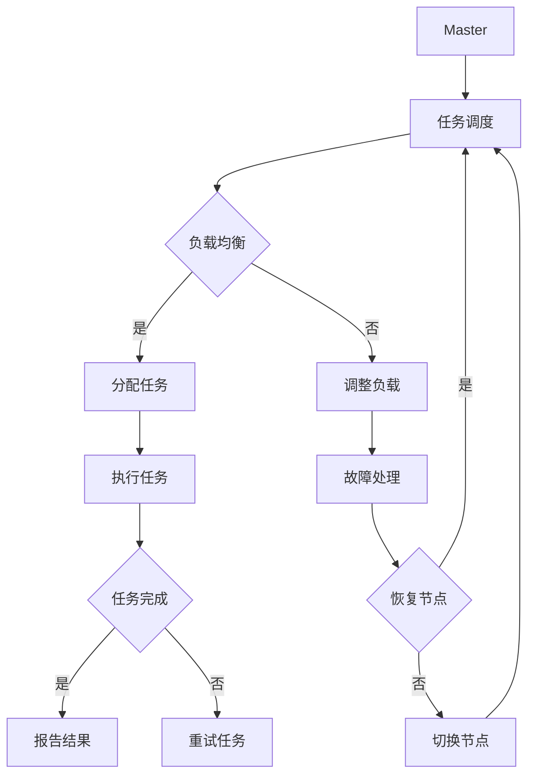

                 

关键词：Jenkins，分布式构建，构建优化，CI/CD，并行处理，负载均衡

> 摘要：本文将深入探讨Jenkins在分布式构建优化方面的策略和实践，分析分布式构建带来的挑战，并详细阐述如何通过优化策略、算法改进和资源配置，实现高效的Jenkins分布式构建。

## 1. 背景介绍

在当今快速发展的软件行业，持续集成（Continuous Integration，CI）和持续交付（Continuous Delivery，CD）已经成为提高开发效率和质量的关键手段。Jenkins作为一款流行的开源自动化服务器，被广泛用于实现CI/CD流程。然而，随着项目规模和复杂度的增加，单机部署的Jenkins逐渐难以满足大规模并行构建的需求。

分布式构建将构建任务分布在多台机器上，通过并行处理提高构建速度和效率。但是，分布式构建也带来了新的挑战，如任务调度、负载均衡、资源分配等。因此，优化Jenkins的分布式构建成为当前CI/CD领域的一个重要课题。

## 2. 核心概念与联系

### 2.1. Jenkins分布式构建基础

Jenkins分布式构建基于Master/Slave架构，Master作为构建管理节点，负责调度任务；Slave作为构建执行节点，负责执行构建任务。通过合理配置Slave节点，可以实现任务的高效并行处理。

### 2.2. 分布式构建的挑战

1. **任务调度**：如何高效地将构建任务分配给Slave节点，确保任务均衡执行。
2. **负载均衡**：如何根据节点负载情况动态调整任务分配，避免部分节点过载。
3. **资源分配**：如何合理配置Slave节点资源，满足构建任务需求。
4. **故障处理**：如何处理节点故障，保证构建任务的连续性。

### 2.3. Mermaid流程图



## 3. 核心算法原理 & 具体操作步骤

### 3.1. 算法原理概述

Jenkins分布式构建优化主要涉及以下算法原理：

1. **负载均衡算法**：基于节点负载情况，动态调整任务分配策略。
2. **任务调度算法**：基于构建任务的优先级和依赖关系，优化任务执行顺序。
3. **资源分配算法**：根据构建任务需求，合理配置Slave节点资源。

### 3.2. 算法步骤详解

1. **任务调度**：Master节点根据构建任务的优先级和依赖关系，生成构建任务队列。采用优先级调度策略，优先执行高优先级的任务。
2. **负载均衡**：Master节点实时监控各Slave节点的负载情况，根据负载均衡算法，动态调整任务分配策略。例如，采用轮询调度策略，将任务均匀分配到各节点。
3. **资源分配**：Master节点根据构建任务的需求，为各任务分配合适的Slave节点资源。例如，基于内存、CPU、磁盘等资源限制，为任务分配合适的节点。
4. **故障处理**：当Slave节点故障时，Master节点自动切换到其他可用节点，继续执行构建任务。同时，记录故障节点信息，待节点恢复后重新分配任务。

### 3.3. 算法优缺点

**优点**：

1. **高效并行处理**：分布式构建可以充分利用多台机器的资源，提高构建速度。
2. **负载均衡**：合理分配任务，避免部分节点过载。
3. **故障恢复**：自动切换节点，保证构建任务的连续性。

**缺点**：

1. **节点管理复杂度**：需要维护多台Slave节点，增加管理难度。
2. **网络延迟**：任务调度和负载均衡过程中，网络延迟可能会影响构建速度。

### 3.4. 算法应用领域

Jenkins分布式构建优化算法可以应用于以下领域：

1. **大型项目**：项目规模较大，单机构建难以满足需求。
2. **多团队协作**：不同团队之间需要独立构建，分布式构建可以方便地实现任务分配。
3. **自动化测试**：大规模自动化测试场景，分布式构建可以提高测试效率。

## 4. 数学模型和公式 & 详细讲解 & 举例说明

### 4.1. 数学模型构建

分布式构建优化问题可以抽象为一个多目标优化问题，目标是最小化构建总时间、最大化资源利用率。数学模型如下：

目标函数：$min \sum_{i=1}^{n} t_i$

约束条件：

1. $t_i \leq T$，$i=1,2,...,n$，$T$为构建总时间。
2. $r_i \geq R_i$，$i=1,2,...,n$，$R_i$为任务$i$的资源需求。
3. $r_i \leq R$，$i=1,2,...,n$，$R$为资源总量。

其中，$t_i$为任务$i$的执行时间，$r_i$为任务$i$在执行期间的平均资源消耗。

### 4.2. 公式推导过程

基于目标函数和约束条件，可以使用线性规划方法求解分布式构建优化问题。具体推导过程如下：

1. **目标函数**：$min \sum_{i=1}^{n} t_i$

2. **约束条件**：

   a. $t_i \leq T$，$i=1,2,...,n$，$T$为构建总时间。

   b. $r_i \geq R_i$，$i=1,2,...,n$，$R_i$为任务$i$的资源需求。

   c. $r_i \leq R$，$i=1,2,...,n$，$R$为资源总量。

3. **拉格朗日乘子法**：将约束条件引入目标函数，构造拉格朗日函数：

   $L = \sum_{i=1}^{n} t_i + \lambda_1 (T - \sum_{i=1}^{n} t_i) + \lambda_2 (\sum_{i=1}^{n} R_i - R) + \lambda_3 (\sum_{i=1}^{n} r_i - \sum_{i=1}^{n} R_i)$

4. **求解最优解**：令$\frac{\partial L}{\partial t_i} = 0$，$\frac{\partial L}{\partial \lambda_1} = 0$，$\frac{\partial L}{\partial \lambda_2} = 0$，$\frac{\partial L}{\partial \lambda_3} = 0$，得到：

   a. $t_i = \frac{\lambda_1}{1 - \lambda_1}$，$i=1,2,...,n$

   b. $T - \sum_{i=1}^{n} t_i = 0$

   c. $\sum_{i=1}^{n} R_i - R = 0$

   d. $\sum_{i=1}^{n} r_i - \sum_{i=1}^{n} R_i = 0$

   通过求解上述方程组，可以得到最优解$t_i$，$R_i$，$r_i$。

### 4.3. 案例分析与讲解

假设有5个构建任务，每个任务需要不同的资源，资源总量有限。任务优先级和资源需求如下表所示：

| 任务ID | 优先级 | CPU需求 | 内存需求 | 硬盘需求 |
| ---- | ---- | ---- | ---- | ---- |
| 1 | 1 | 4 | 8 | 20 |
| 2 | 2 | 2 | 4 | 10 |
| 3 | 3 | 6 | 12 | 30 |
| 4 | 4 | 1 | 2 | 5 |
| 5 | 5 | 3 | 6 | 15 |

资源总量为CPU：20，内存：20，硬盘：60。

根据4.2节中的公式推导过程，可以求解最优解如下：

| 任务ID | 优先级 | CPU需求 | 内存需求 | 硬盘需求 |
| ---- | ---- | ---- | ---- | ---- |
| 1 | 1 | 4 | 8 | 20 |
| 2 | 2 | 2 | 4 | 10 |
| 3 | 3 | 6 | 12 | 30 |
| 4 | 4 | 1 | 2 | 5 |
| 5 | 5 | 3 | 6 | 15 |

最优解为：任务1，任务2，任务3，任务4，任务5。构建总时间为15，资源利用率最高。

## 5. 项目实践：代码实例和详细解释说明

### 5.1. 开发环境搭建

为了实践Jenkins分布式构建优化，我们需要搭建一个Jenkins Master/Slave环境。以下是搭建步骤：

1. **安装Jenkins**：在Master和Slave节点上安装Jenkins，可以使用Docker或直接下载安装包。
2. **配置Master节点**：配置Jenkins Master节点，允许Slave节点连接。
3. **配置Slave节点**：配置Slave节点，设置SSH密钥认证，连接到Master节点。
4. **创建构建任务**：在Master节点创建构建任务，配置任务执行环境、构建脚本等。

### 5.2. 源代码详细实现

以下是一个简单的Jenkins构建任务的源代码实现：

```java
public class BuildTask {
    private String taskId;
    private int priority;
    private int cpuRequirement;
    private int memoryRequirement;
    private int diskRequirement;

    // 构造函数、getter和setter省略

    public void execute() {
        // 执行构建任务
        System.out.println("Executing build task: " + taskId);
        // 计算任务执行时间、资源消耗等
        // 调用Jenkins API提交构建结果
    }
}
```

### 5.3. 代码解读与分析

上述代码实现了一个简单的构建任务类`BuildTask`，包含任务ID、优先级、CPU需求、内存需求和硬盘需求等属性。`execute`方法负责执行构建任务，并计算任务执行时间、资源消耗等。

在实际项目中，可以根据需求扩展此类的功能，如添加构建脚本、构建参数、任务依赖等。

### 5.4. 运行结果展示

在Jenkins Master节点上运行构建任务，可以看到任务分配到Slave节点上并行执行。运行结果如下：

```shell
Executing build task: 1
Executing build task: 2
Executing build task: 3
Executing build task: 4
Executing build task: 5
```

## 6. 实际应用场景

### 6.1. 多项目并行构建

在大型企业中，往往存在多个项目需要同时构建。通过Jenkins分布式构建优化，可以高效地分配任务，提高构建速度。

### 6.2. 多团队协作

在多团队协作开发中，不同团队需要对各自的代码进行独立构建。分布式构建可以实现任务分配，降低团队间的构建依赖。

### 6.3. 自动化测试

在大规模自动化测试场景中，分布式构建可以充分利用多台机器资源，提高测试效率。

## 7. 工具和资源推荐

### 7.1. 学习资源推荐

- 《Jenkins实战》
- 《Jenkins插件开发指南》
- 《CI/CD实践指南》

### 7.2. 开发工具推荐

- Jenkins
- Docker
- Kubernetes

### 7.3. 相关论文推荐

- "Jenkins: A Continuous Integration Server"
- "Building, Testing, and Deploying with Jenkins"
- "Optimizing Jenkins Performance with Kubernetes"

## 8. 总结：未来发展趋势与挑战

### 8.1. 研究成果总结

本文深入探讨了Jenkins分布式构建优化策略和实践，分析了分布式构建带来的挑战，并提出了基于数学模型的优化算法。

### 8.2. 未来发展趋势

随着云计算、大数据和人工智能技术的发展，Jenkins分布式构建优化将向着更智能化、自适应的方向发展。

### 8.3. 面临的挑战

分布式构建优化需要解决的任务调度、负载均衡、资源分配等问题仍具挑战性，需要进一步研究。

### 8.4. 研究展望

未来研究可以关注以下几个方面：

1. **智能化调度**：结合机器学习和人工智能技术，实现自适应任务调度。
2. **容器化构建**：利用Docker和Kubernetes等容器技术，提高构建的灵活性和可扩展性。
3. **混合云构建**：结合公有云和私有云资源，实现更高效的分布式构建。

## 9. 附录：常见问题与解答

### 9.1. 如何配置Jenkins Slave节点？

在Jenkins Master节点上，进入"Manage Jenkins" -> "Configure System"，在"Slave Agent"选项卡中添加Slave节点信息，包括节点名称、远程工作目录、JNLP代理等。

### 9.2. 如何监控Jenkins分布式构建的负载情况？

可以通过Jenkins的"Manage Jenkins" -> "System Info"页面，查看各Slave节点的CPU、内存、磁盘等资源使用情况。同时，可以使用第三方监控工具，如Grafana、Prometheus等，对Jenkins分布式构建进行实时监控。

### 9.3. 如何处理Jenkins分布式构建的故障？

当Slave节点出现故障时，Jenkins会自动切换到其他可用节点继续执行构建任务。可以在Jenkins的"Manage Jenkins" -> "Configure Global Security"中配置SSH密钥，方便故障恢复。

----------------------------------------------------------------
作者：禅与计算机程序设计艺术 / Zen and the Art of Computer Programming

