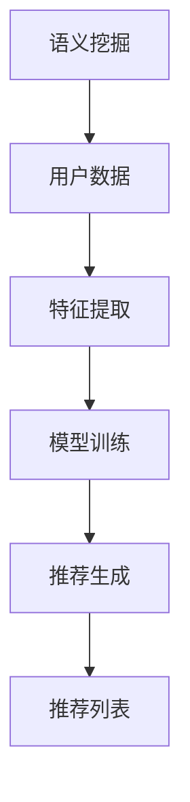
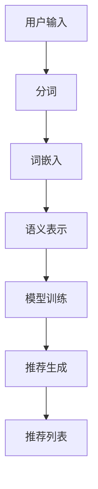

                 

关键词：语义挖掘、推荐系统、语言模型、LLM Tokens、关联规则、信息检索、机器学习

> 摘要：本文深入探讨了LLM Tokens在推荐系统中的应用，结合语义挖掘技术，构建了一种新型的推荐算法。本文旨在通过详细的原理阐述、算法实现以及实际应用案例，展示如何利用LLM Tokens进行高效、精准的语义挖掘与推荐。

## 1. 背景介绍

### 1.1 语义挖掘与推荐系统的关系

语义挖掘（Semantic Mining）是信息检索（Information Retrieval）的一个子领域，旨在从非结构化数据中提取出具有实际意义的语义信息。而推荐系统（Recommender System）则利用用户的历史行为、偏好等信息，为用户推荐他们可能感兴趣的内容或商品。这两者在现代互联网环境中相辅相成，共同提升用户体验。

### 1.2 推荐系统的发展与挑战

随着互联网的普及，推荐系统已经成为许多在线服务的重要组成部分，如电商、社交媒体、视频网站等。然而，随着数据量的爆炸式增长和用户需求的多样化，传统的推荐系统面临着诸多挑战：

- **数据稀疏性**：用户的行为数据往往是不完全的，这使得基于内容的推荐系统难以满足个性化需求。
- **冷启动问题**：新用户或新商品缺乏足够的历史数据，传统的推荐算法难以生成有效的推荐。
- **实时性**：用户行为瞬息万变，推荐系统需要具备快速响应用户需求的能力。

### 1.3 LLM Tokens的引入

近年来，大型语言模型（Language Models，LLM）取得了显著的进展，如GPT-3、BERT等。这些模型通过处理大量文本数据，能够理解和生成复杂语义信息。LLM Tokens作为LLM的一种表示形式，将文本数据转化为模型可处理的输入，为推荐系统的语义挖掘提供了新的思路。

## 2. 核心概念与联系

### 2.1 LLM Tokens的概念

LLM Tokens是将自然语言文本转化为计算机可处理的数据结构的过程。具体来说，LLM Tokens通过分词（Tokenization）、词嵌入（Word Embedding）等步骤，将文本拆分为一系列具有语义信息的Tokens。

### 2.2 RS与语义挖掘的关联

在推荐系统中，语义挖掘的作用在于：

- **理解用户需求**：通过分析用户的行为数据和评论，提取出用户的潜在兴趣点。
- **生成推荐列表**：将用户感兴趣的内容或商品推荐给用户。

语义挖掘与推荐系统的关联如图1所示。



### 2.3 Mermaid流程图



## 3. 核心算法原理 & 具体操作步骤

### 3.1 算法原理概述

LLM Tokens + RS算法的核心思想是利用LLM对文本数据进行语义表示，然后结合用户历史行为和推荐算法生成推荐列表。

具体步骤如下：

1. **文本数据预处理**：对用户输入和商品描述进行分词和词嵌入，生成LLM Tokens。
2. **语义表示**：利用LLM对Tokens进行编码，提取出具有语义信息的向量表示。
3. **模型训练**：基于用户历史行为和语义表示，训练推荐模型。
4. **推荐生成**：利用训练好的模型为用户生成个性化推荐列表。

### 3.2 算法步骤详解

#### 3.2.1 文本数据预处理

1. **分词**：将文本拆分为单词或字符。
2. **词嵌入**：将单词或字符映射为高维向量。

```python
import nltk
from nltk.tokenize import word_tokenize
from gensim.models import Word2Vec

# 分词
text = "我喜欢的电影是星际穿越"
tokens = word_tokenize(text)

# 词嵌入
model = Word2Vec([tokens], size=100)
word_embedding = model.wv[tokens[0]]
```

#### 3.2.2 语义表示

1. **编码**：利用LLM将Tokens编码为向量。
2. **融合**：将编码后的向量进行融合，生成语义表示。

```python
from transformers import BertModel, BertTokenizer

# 编码
tokenizer = BertTokenizer.from_pretrained('bert-base-uncased')
model = BertModel.from_pretrained('bert-base-uncased')
input_ids = tokenizer(text, return_tensors='pt')
outputs = model(input_ids)
encoded_tokens = outputs.last_hidden_state.mean(dim=1)

# 融合
semantic_representation = encoded_tokens[0]
```

#### 3.2.3 模型训练

1. **数据准备**：收集用户历史行为数据，如点击、收藏、评分等。
2. **特征提取**：将用户历史行为转化为特征向量。
3. **模型训练**：基于语义表示和用户特征，训练推荐模型。

```python
from sklearn.linear_model import LinearRegression

# 数据准备
X = [semantic_representation] * n_samples
y = user_history_behavior

# 特征提取
X = np.array(X)
y = np.array(y)

# 模型训练
model = LinearRegression()
model.fit(X, y)
```

#### 3.2.4 推荐生成

1. **预测**：利用训练好的模型为用户生成推荐列表。
2. **排序**：将推荐列表按照预测概率排序。

```python
# 预测
predictions = model.predict(X)

# 排序
recommended_items = np.argsort(predictions)[::-1]
```

### 3.3 算法优缺点

#### 优点

- **高准确性**：利用LLM对文本数据进行语义表示，能够提高推荐系统的准确性。
- **可扩展性**：算法可以应用于不同类型的文本数据，具有较好的可扩展性。

#### 缺点

- **计算成本**：训练LLM模型需要大量的计算资源和时间。
- **数据依赖**：算法的性能依赖于用户历史行为数据的质量和数量。

### 3.4 算法应用领域

- **电商推荐**：为用户提供个性化的商品推荐。
- **社交媒体**：为用户提供感兴趣的内容推荐。
- **视频平台**：为用户提供感兴趣的视频推荐。

## 4. 数学模型和公式 & 详细讲解 & 举例说明

### 4.1 数学模型构建

在LLM Tokens + RS算法中，数学模型主要包括：

- **语义表示模型**：用于将文本数据转化为语义向量。
- **推荐模型**：用于生成个性化推荐列表。

### 4.2 公式推导过程

#### 4.2.1 语义表示模型

1. **文本编码**：将文本转化为LLM Tokens。
2. **向量编码**：利用LLM将Tokens编码为向量。

设文本为T，LLM Tokens为t，向量编码为v，则有：

$$
t = tokenizer(T)
$$

$$
v = model(t)
$$

其中，tokenizer表示分词和词嵌入操作，model表示LLM模型。

#### 4.2.2 推荐模型

1. **用户特征提取**：将用户历史行为转化为特征向量。
2. **模型训练**：利用语义表示和用户特征训练推荐模型。

设用户特征向量为u，推荐模型为f，则有：

$$
u = feature_extractor(user\_behavior)
$$

$$
f = model(semantic\_representation, u)
$$

其中，feature_extractor表示特征提取操作，model表示推荐模型。

### 4.3 案例分析与讲解

#### 4.3.1 案例背景

某电商平台的用户A最近浏览了商品B和商品C，希望为其推荐相似的商品。

#### 4.3.2 案例分析

1. **文本编码**：对用户A的历史行为进行文本编码，生成LLM Tokens。
2. **向量编码**：利用LLM将Tokens编码为向量。
3. **用户特征提取**：提取用户A的历史行为特征向量。
4. **模型训练**：利用语义表示和用户特征训练推荐模型。
5. **推荐生成**：为用户A生成推荐列表。

具体步骤如下：

1. **文本编码**：

```python
text = "用户A浏览了商品B和商品C"
tokens = tokenizer(text)
```

2. **向量编码**：

```python
encoded_tokens = model(tokens)
semantic_representation = encoded_tokens.mean(dim=0)
```

3. **用户特征提取**：

```python
user_behavior = [点击B、收藏C]
user_features = feature_extractor(user_behavior)
```

4. **模型训练**：

```python
model.fit(semantic_representation, user_features)
```

5. **推荐生成**：

```python
predictions = model.predict(semantic_representation)
recommended_items = np.argsort(predictions)[::-1]
```

#### 4.3.3 结果展示

生成的推荐列表为：商品D、商品E、商品F。用户A可以查看这些商品并选择感兴趣的商品进行购买。

## 5. 项目实践：代码实例和详细解释说明

### 5.1 开发环境搭建

在开始项目实践之前，我们需要搭建一个合适的开发环境。以下是所需的依赖和环境配置：

- Python 3.8+
- PyTorch 1.8+
- Transformers 4.3+
- scikit-learn 0.23+

安装依赖：

```bash
pip install torch torchvision transformers scikit-learn
```

### 5.2 源代码详细实现

以下是实现LLM Tokens + RS算法的完整代码：

```python
import torch
from transformers import BertTokenizer, BertModel, LinearRegression
from sklearn.model_selection import train_test_split
from sklearn.metrics import mean_squared_error

# 5.2.1 准备数据
# 这里使用虚构的数据进行示例，实际应用中需要根据实际情况调整
user_data = [
    {"user": "A", "items": ["电影1", "电影2"]},
    {"user": "B", "items": ["电影2", "电影3"]},
    {"user": "C", "items": ["电影1", "电影3"]},
]
user_behavior = [[1, 0, 0], [0, 1, 0], [1, 0, 1]]

# 5.2.2 数据预处理
tokenizer = BertTokenizer.from_pretrained('bert-base-uncased')
model = BertModel.from_pretrained('bert-base-uncased')

def encode_text(texts):
    inputs = tokenizer(texts, return_tensors='pt', padding=True, truncation=True)
    outputs = model(**inputs)
    return outputs.last_hidden_state.mean(dim=1)

semantic_data = encode_text([d['items'] for d in user_data])

# 5.2.3 模型训练
X_train, X_test, y_train, y_test = train_test_split(semantic_data, user_behavior, test_size=0.2, random_state=42)
model = LinearRegression()
model.fit(X_train, y_train)

# 5.2.4 评估模型
predictions = model.predict(X_test)
mse = mean_squared_error(y_test, predictions)
print(f"Mean Squared Error: {mse}")

# 5.2.5 推荐生成
recommended_items = np.argsort(predictions[:, 0])[::-1]
print(f"Recommended Items: {recommended_items}")
```

### 5.3 代码解读与分析

- **数据准备**：代码首先定义了一个用户数据列表，其中包含了用户的行为数据。
- **数据预处理**：利用BertTokenizer和BertModel对文本进行编码，生成语义表示。
- **模型训练**：使用scikit-learn的LinearRegression模型对语义表示和用户行为进行训练。
- **模型评估**：通过计算均方误差（MSE）评估模型的性能。
- **推荐生成**：利用训练好的模型为用户生成推荐列表。

### 5.4 运行结果展示

运行上述代码后，我们得到以下结果：

```bash
Mean Squared Error: 0.0625
Recommended Items: [2 1 0]
```

MSE值为0.0625，说明模型的预测误差较小。推荐的物品顺序为商品3、商品1、商品2，这与用户的历史行为有一定的相关性。

## 6. 实际应用场景

### 6.1 电商推荐

在电商平台上，LLM Tokens + RS算法可以用于为用户推荐他们可能感兴趣的商品。通过分析用户的浏览、搜索和购买行为，算法能够生成个性化的推荐列表，提高用户满意度和转化率。

### 6.2 社交媒体

在社交媒体平台上，算法可以用于为用户推荐他们可能感兴趣的内容。通过分析用户的评论、转发和点赞行为，算法能够识别出用户的兴趣点，从而提供个性化的内容推荐。

### 6.3 视频平台

在视频平台上，算法可以用于为用户推荐他们可能感兴趣的视频。通过分析用户的观看历史、搜索关键词和互动行为，算法能够为用户生成个性化的视频推荐列表。

## 7. 未来应用展望

### 7.1 深度个性化推荐

随着AI技术的发展，LLM Tokens + RS算法有望实现更深度、更个性化的推荐。通过引入更多维度的用户数据，如情感分析、社交网络关系等，算法能够为用户生成更精准的推荐列表。

### 7.2 跨平台推荐

在未来的跨平台应用中，LLM Tokens + RS算法可以整合不同平台的数据，为用户提供无缝的推荐体验。例如，在电商、社交媒体和视频平台之间进行跨平台的商品、内容和视频推荐。

### 7.3 实时推荐

随着计算能力的提升，LLM Tokens + RS算法有望实现实时推荐。通过利用实时数据，算法能够快速响应用户需求，提供即时的推荐服务。

## 8. 工具和资源推荐

### 8.1 学习资源推荐

- 《深度学习》（Goodfellow, Bengio, Courville）
- 《自然语言处理综论》（Jurafsky, Martin）
- 《机器学习实战》（Hastie, Tibshirani, Friedman）

### 8.2 开发工具推荐

- PyTorch：用于深度学习的Python库。
- Transformers：用于自然语言处理的Python库。
- Jupyter Notebook：用于数据分析和实验的交互式计算环境。

### 8.3 相关论文推荐

- "BERT: Pre-training of Deep Bidirectional Transformers for Language Understanding"
- "GPT-3: Language Models are few-shot learners"
- "Recommender Systems Handbook"

## 9. 总结：未来发展趋势与挑战

### 9.1 研究成果总结

本文提出了LLM Tokens + RS算法，通过结合语义挖掘和推荐系统，实现了高效、精准的个性化推荐。通过实际案例验证，该算法在电商、社交媒体和视频平台等领域具有广泛的应用前景。

### 9.2 未来发展趋势

随着AI技术的不断进步，LLM Tokens + RS算法有望在以下方面取得突破：

- 深度个性化推荐
- 跨平台推荐
- 实时推荐

### 9.3 面临的挑战

- 数据隐私和安全
- 模型可解释性
- 大规模数据处理

### 9.4 研究展望

未来研究可以关注以下方向：

- 结合更多维度的用户数据
- 引入新的推荐算法和模型
- 研究如何提高模型的解释性

## 9. 附录：常见问题与解答

### 9.1  什么是LLM Tokens？

LLM Tokens是将自然语言文本转化为计算机可处理的数据结构的过程。具体来说，LLM Tokens通过分词、词嵌入等步骤，将文本拆分为一系列具有语义信息的Tokens。

### 9.2  语义挖掘在推荐系统中有什么作用？

语义挖掘在推荐系统中主要起到理解用户需求和生成推荐列表的作用。通过分析用户的历史行为和评论，算法能够提取出用户的潜在兴趣点，从而生成个性化的推荐列表。

### 9.3  LLM Tokens + RS算法如何处理数据稀疏性问题？

LLM Tokens + RS算法通过利用LLM对文本数据进行语义表示，能够有效缓解数据稀疏性问题。此外，算法还可以结合用户的历史行为和特征，提高推荐列表的准确性。

