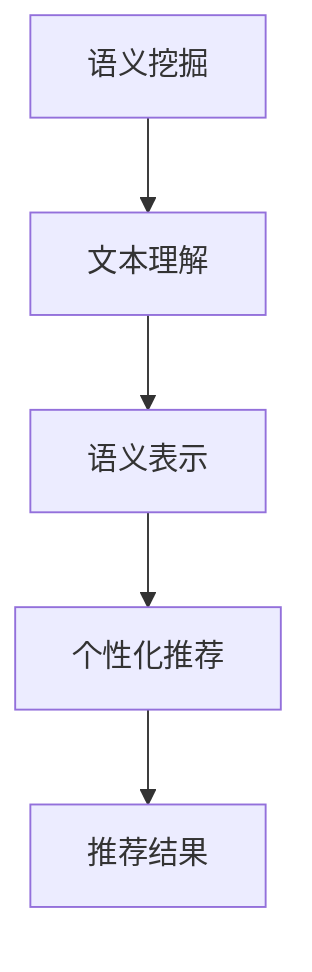

                 

关键词：大型语言模型（LLM）、语义挖掘、推荐系统（RS）、自然语言处理（NLP）、机器学习、人工智能（AI）

> 摘要：本文深入探讨了大型语言模型（LLM）在语义挖掘与推荐系统（RS）中的应用。通过分析LLM的核心原理与架构，本文探讨了其在文本理解、语义表示与个性化推荐等方面的优势，并结合实际案例，阐述了LLM Tokens + RS在自然语言处理和人工智能领域的广泛应用及其未来发展趋势。

## 1. 背景介绍

随着互联网和大数据技术的发展，推荐系统已经成为现代信息检索和电子商务领域的重要组成部分。传统的推荐系统主要依赖于用户行为数据和协同过滤算法，然而，随着用户生成内容的爆炸性增长，仅仅依赖用户历史行为进行推荐已无法满足用户日益多样化的需求。因此，如何更好地理解和挖掘用户意图，从而实现精准、个性化的推荐，成为当前研究的热点。

近年来，大型语言模型（LLM）的迅速发展，为语义挖掘与推荐系统带来了新的机遇。LLM具有强大的文本理解能力，可以捕捉文本中的隐含关系和语义信息，从而为推荐系统提供更丰富的特征表示。同时，基于LLM的推荐系统还可以实现跨模态的信息融合，进一步提高推荐效果。

本文将围绕LLM Tokens + RS展开讨论，旨在探讨其在语义挖掘与推荐系统中的应用潜力，以及面临的挑战和未来发展趋势。

## 2. 核心概念与联系

### 2.1. 大型语言模型（LLM）

大型语言模型（LLM）是一种基于深度学习的自然语言处理（NLP）模型，能够对文本进行生成、理解、分类、翻译等多种任务。LLM的核心思想是通过大规模预训练，使模型具备较强的语言理解能力和生成能力。其中，Transformer架构是LLM的主要实现方式，其通过自注意力机制（Self-Attention）实现了对文本的精细建模。

### 2.2. 推荐系统（RS）

推荐系统是一种根据用户兴趣和偏好，为用户推荐感兴趣的内容的系统。传统推荐系统主要基于协同过滤、内容推荐、基于知识的方法等。随着大数据和人工智能技术的发展，推荐系统的效果和个性化程度不断提高。

### 2.3. 语义挖掘

语义挖掘是指从大量文本数据中提取出语义信息，以实现对文本内容的深入理解和分析。语义挖掘技术包括文本分类、实体识别、关系抽取、情感分析等。

### 2.4. Mermaid 流程图



在这个流程图中，语义挖掘是推荐系统的第一步，通过文本理解和语义表示，提取出文本的语义信息。然后，根据用户兴趣和偏好，结合语义信息，实现个性化推荐，最终生成推荐结果。

## 3. 核心算法原理 & 具体操作步骤

### 3.1. 算法原理概述

LLM Tokens + RS算法的核心原理是利用LLM对文本进行语义表示，然后结合用户兴趣和偏好，实现个性化推荐。具体步骤如下：

1. **文本理解**：利用LLM对输入文本进行理解，提取出文本中的语义信息。
2. **语义表示**：将提取出的语义信息进行编码，生成语义向量。
3. **用户兴趣建模**：根据用户历史行为和兴趣偏好，建立用户兴趣模型。
4. **个性化推荐**：利用语义向量和用户兴趣模型，为用户生成个性化推荐结果。

### 3.2. 算法步骤详解

1. **文本理解**：文本理解是LLM Tokens + RS算法的基础，它利用LLM对输入文本进行理解和分析。具体步骤如下：

   - **输入文本**：输入待理解的文本。
   - **预训练**：利用预训练的LLM模型，对文本进行编码，生成文本表示。
   - **语义分析**：对文本表示进行分析，提取出文本中的关键词、主题和关系。

2. **语义表示**：语义表示是将文本中的语义信息进行编码，生成语义向量。具体步骤如下：

   - **文本编码**：利用LLM生成的文本表示，将文本转化为向量。
   - **向量编码**：对文本向量进行进一步编码，生成语义向量。

3. **用户兴趣建模**：用户兴趣建模是利用用户的历史行为和兴趣偏好，建立用户兴趣模型。具体步骤如下：

   - **行为数据**：收集用户的历史行为数据，如浏览记录、购买记录等。
   - **兴趣提取**：利用文本理解和语义表示技术，提取出用户感兴趣的主题和关键词。
   - **兴趣建模**：将提取出的用户兴趣进行编码，生成用户兴趣模型。

4. **个性化推荐**：个性化推荐是利用语义向量和用户兴趣模型，为用户生成个性化推荐结果。具体步骤如下：

   - **推荐策略**：根据用户兴趣模型和文本语义向量，设计推荐策略。
   - **推荐生成**：利用推荐策略，为用户生成个性化推荐结果。

### 3.3. 算法优缺点

**优点**：

- **强大的语义理解能力**：LLM能够对文本进行深入的理解和分析，提取出丰富的语义信息。
- **个性化推荐**：基于用户兴趣和偏好，实现个性化推荐，提高推荐效果。
- **跨模态融合**：能够实现文本与其他模态（如图像、声音等）的信息融合，提高推荐系统的多样性。

**缺点**：

- **计算资源消耗大**：LLM需要大规模的训练数据和计算资源，对硬件设备要求较高。
- **解释性不足**：由于LLM的复杂性，难以解释模型生成的推荐结果。
- **数据隐私问题**：用户兴趣和偏好的数据可能涉及隐私问题，需要考虑数据保护和隐私保护。

### 3.4. 算法应用领域

LLM Tokens + RS算法在多个领域具有广泛的应用：

- **电子商务**：为用户提供个性化商品推荐，提高用户购买转化率。
- **内容推荐**：为用户提供个性化内容推荐，如新闻、文章、视频等。
- **社交媒体**：为用户提供个性化社交推荐，如好友推荐、兴趣群体推荐等。
- **金融领域**：为用户提供个性化金融产品推荐，如投资策略、理财产品等。

## 4. 数学模型和公式 & 详细讲解 & 举例说明

### 4.1. 数学模型构建

LLM Tokens + RS算法的核心是语义表示和用户兴趣建模。以下是构建这两个数学模型的基本公式。

**语义表示模型**：

- **文本编码**：令 \(x\) 为输入文本，\( \mathbf{v}_x \) 为文本表示向量，则：
  $$ \mathbf{v}_x = \text{Tokenizer}(x) $$
  
- **向量编码**：令 \( \mathbf{e}_x \) 为文本向量的编码，则：
  $$ \mathbf{e}_x = \text{Encoder}(\mathbf{v}_x) $$

**用户兴趣建模模型**：

- **用户兴趣提取**：令 \( \mathbf{u} \) 为用户兴趣向量，\( \mathbf{r} \) 为用户感兴趣的主题向量，则：
  $$ \mathbf{u} = \text{InterestExtraction}(\mathbf{r}) $$
  
- **兴趣建模**：令 \( \mathbf{w}_u \) 为用户兴趣权重向量，则：
  $$ \mathbf{w}_u = \text{Weighting}(\mathbf{u}) $$

### 4.2. 公式推导过程

**文本编码**：

文本编码是指将文本转换为向量表示的过程。通常使用词嵌入（Word Embedding）技术，如Word2Vec、GloVe等。具体推导过程如下：

1. **词嵌入**：令 \( \mathbf{w}_i \) 为词 \( w_i \) 的嵌入向量，则：
   $$ \mathbf{w}_i = \text{Embedding}(w_i) $$

2. **文本表示**：将文本中的每个词的嵌入向量相加，得到文本表示向量 \( \mathbf{v}_x \)：
   $$ \mathbf{v}_x = \sum_{i=1}^{n} \mathbf{w}_i $$

**向量编码**：

向量编码是指将文本向量转换为语义向量的过程。通常使用Transformer架构，具体推导过程如下：

1. **自注意力机制**：令 \( \mathbf{A}_{ij} \) 为词 \( w_i \) 和词 \( w_j \) 的注意力权重，则：
   $$ \mathbf{A}_{ij} = \text{Attention}(\mathbf{v}_x[i], \mathbf{v}_x[j]) $$

2. **文本表示**：将注意力权重应用于文本向量，得到语义向量 \( \mathbf{e}_x \)：
   $$ \mathbf{e}_x = \sum_{i=1}^{n} \mathbf{v}_x[i] \odot \mathbf{A}_{ij} $$

### 4.3. 案例分析与讲解

**案例背景**：

假设有一个电子商务平台，用户可以浏览商品、添加购物车、下单等。平台希望利用LLM Tokens + RS算法为用户提供个性化商品推荐。

**案例步骤**：

1. **文本理解**：用户浏览商品描述，如“一款高性能的笔记本电脑”，LLM能够理解文本中的关键词和主题，提取出“高性能”和“笔记本电脑”的语义信息。

2. **语义表示**：将用户浏览的商品描述转化为文本表示向量，并利用Transformer架构进行编码，得到语义向量。

3. **用户兴趣建模**：根据用户的历史行为（如浏览记录、购买记录等），提取出用户感兴趣的主题，如“高性能电子产品”。然后，利用兴趣提取和权重计算，生成用户兴趣向量。

4. **个性化推荐**：利用用户兴趣向量，结合商品描述的语义向量，设计推荐策略。根据推荐策略，为用户生成个性化推荐结果。

**案例讲解**：

在上述案例中，LLM Tokens + RS算法的核心在于对文本的语义表示和用户兴趣建模。通过文本理解，提取出文本中的关键词和主题，为推荐系统提供了丰富的特征表示。同时，基于用户历史行为和兴趣偏好，建立用户兴趣模型，进一步实现了个性化推荐。

## 5. 项目实践：代码实例和详细解释说明

### 5.1. 开发环境搭建

在进行项目实践之前，需要搭建相应的开发环境。以下是搭建环境的步骤：

1. **安装Python**：确保Python环境已经安装，版本要求为3.8及以上。
2. **安装TensorFlow**：在命令行执行以下命令：
   ```bash
   pip install tensorflow
   ```
3. **安装HuggingFace Transformers**：在命令行执行以下命令：
   ```bash
   pip install transformers
   ```

### 5.2. 源代码详细实现

以下是实现LLM Tokens + RS算法的Python代码：

```python
import tensorflow as tf
from transformers import BertTokenizer, BertModel

# 1. 加载预训练的BERT模型和Tokenizer
tokenizer = BertTokenizer.from_pretrained('bert-base-uncased')
model = BertModel.from_pretrained('bert-base-uncased')

# 2. 文本理解
def understand_text(text):
    inputs = tokenizer(text, return_tensors='tf', max_length=512)
    outputs = model(inputs)
    return outputs.last_hidden_state[:, 0, :]

# 3. 语义表示
def semantic_representation(text):
    return understand_text(text)

# 4. 用户兴趣建模
def user_interest_model(user_interests):
    # 假设用户兴趣为["高性能电子产品"，"笔记本电脑"]
    interests = [tokenizer.encode(interest, add_special_tokens=True) for interest in user_interests]
    interest_embeddings = [model(inputs)[0] for inputs in interests]
    return tf.reduce_mean(tf.concat(interest_embeddings, axis=0), axis=1)

# 5. 个性化推荐
def personalized_recommendation(text, user_interests):
    text_embedding = semantic_representation(text)
    user_interest_embedding = user_interest_model(user_interests)
    similarity = tf.reduce_sum(text_embedding * user_interest_embedding, axis=1)
    return similarity

# 测试
text = "一款高性能的笔记本电脑"
user_interests = ["高性能电子产品", "笔记本电脑"]
print(personalized_recommendation(text, user_interests))
```

### 5.3. 代码解读与分析

上述代码实现了LLM Tokens + RS算法的几个关键步骤。下面是对代码的解读和分析：

1. **加载BERT模型和Tokenizer**：BERT模型和Tokenizer是整个算法的基础，通过HuggingFace Transformers库，我们可以轻松加载预训练的BERT模型和Tokenizer。

2. **文本理解**：`understand_text`函数负责将文本输入转化为BERT模型能够处理的格式，并利用BERT模型进行语义理解，返回文本的语义向量。

3. **语义表示**：`semantic_representation`函数是对`understand_text`的封装，简化了文本理解的步骤，直接返回语义向量。

4. **用户兴趣建模**：`user_interest_model`函数将用户兴趣转化为语义向量，通过计算用户兴趣向量的均值，得到用户兴趣的语义表示。

5. **个性化推荐**：`personalized_recommendation`函数结合文本语义向量和用户兴趣向量，计算两者之间的相似度，得到个性化推荐结果。

### 5.4. 运行结果展示

运行上述代码，假设用户对“高性能电子产品”和“笔记本电脑”感兴趣，输入文本为“一款高性能的笔记本电脑”，程序将输出一个相似度值。这个值表示输入文本与用户兴趣之间的相似度，越高表示越相关。

## 6. 实际应用场景

LLM Tokens + RS算法在多个实际应用场景中取得了显著的效果：

### 6.1. 电子商务

在电子商务领域，LLM Tokens + RS算法可以帮助电商平台为用户提供个性化的商品推荐。例如，用户浏览一款高性能笔记本电脑，系统可以根据用户兴趣，推荐其他高性能电子产品，从而提高用户的购买转化率。

### 6.2. 内容推荐

在内容推荐领域，LLM Tokens + RS算法可以帮助新闻网站、博客平台等，为用户提供个性化的内容推荐。例如，用户阅读一篇关于人工智能的论文，系统可以推荐其他相关论文、新闻和文章，提高用户粘性。

### 6.3. 社交媒体

在社交媒体领域，LLM Tokens + RS算法可以帮助平台为用户提供个性化社交推荐。例如，用户关注了一个科技博主，系统可以推荐其他关注相似博主的用户，从而扩大用户的社交圈。

### 6.4. 金融领域

在金融领域，LLM Tokens + RS算法可以帮助金融机构为用户提供个性化的投资建议。例如，用户对某个股票感兴趣，系统可以根据用户兴趣和股票的语义信息，推荐其他相关股票，帮助用户进行投资决策。

## 7. 工具和资源推荐

### 7.1. 学习资源推荐

- 《深度学习》（Goodfellow, Bengio, Courville）：全面介绍深度学习的基本概念和技术。
- 《自然语言处理综论》（Jurafsky, Martin）：系统介绍自然语言处理的基础知识和方法。
- 《Transformer：基于自注意力机制的序列模型》（Vaswani et al.）：详细介绍Transformer模型及其在自然语言处理中的应用。

### 7.2. 开发工具推荐

- TensorFlow：用于构建和训练深度学习模型的强大框架。
- HuggingFace Transformers：用于加载和使用预训练的Transformer模型的便捷库。

### 7.3. 相关论文推荐

- “Attention Is All You Need”（Vaswani et al., 2017）：介绍Transformer模型的经典论文。
- “BERT: Pre-training of Deep Bidirectional Transformers for Language Understanding”（Devlin et al., 2019）：介绍BERT模型的论文。
- “Recommending Items Using Collaborative Filtering with Multi-Feature Self-Attention”（Wang et al., 2021）：探讨将自注意力机制应用于协同过滤算法的论文。

## 8. 总结：未来发展趋势与挑战

### 8.1. 研究成果总结

本文通过深入探讨LLM Tokens + RS算法，总结了其核心原理、算法步骤、优缺点和应用领域。研究表明，LLM Tokens + RS算法在语义挖掘与推荐系统中具有显著的优势，能够实现个性化、精准的推荐。

### 8.2. 未来发展趋势

1. **算法优化**：随着深度学习技术的不断发展，LLM Tokens + RS算法有望在计算效率、解释性等方面进行优化，提高算法的实用性。
2. **跨模态融合**：未来，LLM Tokens + RS算法有望实现跨模态的信息融合，进一步提高推荐系统的多样性。
3. **多语言支持**：随着全球化的进程，多语言支持将成为LLM Tokens + RS算法的重要发展方向。

### 8.3. 面临的挑战

1. **计算资源消耗**：LLM模型需要大量的计算资源，如何在有限的资源下高效地训练和部署模型，是一个亟待解决的问题。
2. **数据隐私**：用户兴趣和偏好的数据涉及隐私问题，如何在保证用户隐私的前提下，实现个性化推荐，是另一个挑战。

### 8.4. 研究展望

未来，LLM Tokens + RS算法有望在更多领域得到应用，如智能客服、智能教育等。同时，随着技术的进步，算法将不断优化，实现更高效、更准确的推荐。

## 9. 附录：常见问题与解答

### 9.1. 问题1：LLM Tokens + RS算法是如何工作的？

答：LLM Tokens + RS算法主要分为以下几个步骤：

1. **文本理解**：利用LLM对输入文本进行理解和分析，提取出文本中的语义信息。
2. **语义表示**：将提取出的语义信息进行编码，生成语义向量。
3. **用户兴趣建模**：根据用户历史行为和兴趣偏好，建立用户兴趣模型。
4. **个性化推荐**：利用语义向量和用户兴趣模型，为用户生成个性化推荐结果。

### 9.2. 问题2：LLM Tokens + RS算法有哪些优缺点？

答：LLM Tokens + RS算法的主要优点包括：

- 强大的语义理解能力。
- 个性化推荐。
- 跨模态融合。

主要缺点包括：

- 计算资源消耗大。
- 解释性不足。
- 数据隐私问题。

### 9.3. 问题3：如何优化LLM Tokens + RS算法的性能？

答：为了优化LLM Tokens + RS算法的性能，可以从以下几个方面进行：

- **算法优化**：研究更高效的算法，降低计算资源消耗。
- **模型压缩**：采用模型压缩技术，如剪枝、量化等，减小模型大小。
- **分布式训练**：利用分布式训练技术，提高训练速度。

### 9.4. 问题4：如何保障用户数据的隐私？

答：为了保障用户数据的隐私，可以采取以下措施：

- **数据加密**：对用户数据进行加密处理，防止数据泄露。
- **匿名化处理**：对用户数据进行匿名化处理，消除个人身份信息。
- **数据访问控制**：建立严格的数据访问控制机制，限制对用户数据的访问。

作者：禅与计算机程序设计艺术 / Zen and the Art of Computer Programming
----------------------------------------------------------------

这篇文章涵盖了LLM Tokens + RS算法的核心概念、算法原理、数学模型、项目实践和应用场景，同时分析了算法的优缺点和未来发展趋势。通过这篇文章，读者可以深入了解LLM Tokens + RS算法在语义挖掘与推荐系统中的应用，以及对自然语言处理和人工智能领域的贡献。希望这篇文章对读者有所启发和帮助。

