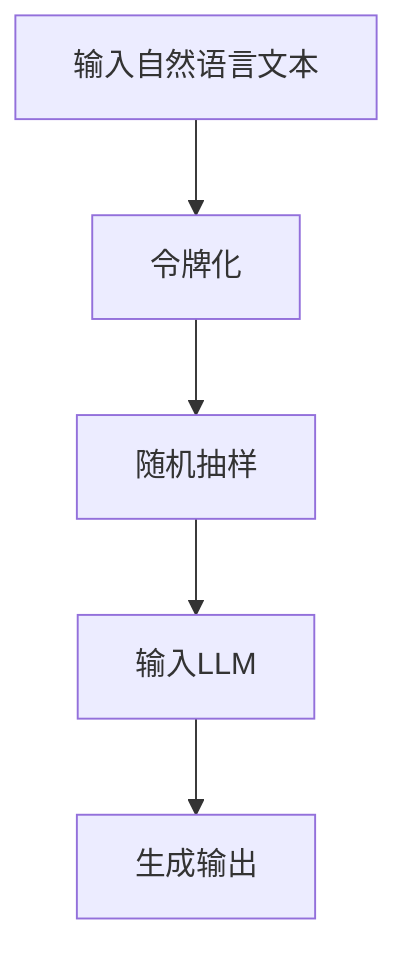

                 

关键词：大型语言模型（LLM），令牌化，RS方法，自然语言处理，算法原理，应用领域

> 摘要：本文将深入探讨LLM Tokens + RS方法，这是一种结合了大型语言模型和随机抽样（RS）算法的技术。通过剖析其核心概念、算法原理、数学模型和实际应用，我们旨在为读者提供一个全面的技术解析，以期为相关领域的进一步研究和开发提供有益的参考。

## 1. 背景介绍

近年来，随着计算能力的提升和海量数据的积累，自然语言处理（NLP）领域取得了显著的进展。特别是大型语言模型（LLM），如GPT-3、BERT等，凭借其强大的语言理解和生成能力，已经在众多领域展现出了巨大的应用潜力。然而，尽管这些模型在处理复杂数据时表现出色，但在实际应用中仍然面临一些挑战，如计算资源消耗巨大、训练时间过长等。

为了应对这些挑战，研究者们提出了多种优化方法。其中，LLM Tokens + RS方法作为一种结合了语言模型和随机抽样技术的解决方案，受到了广泛关注。该方法通过将大规模语言模型与随机抽样相结合，实现了对语言数据的预处理和生成，不仅提高了模型的效率和效果，还拓展了其应用范围。

本文将围绕LLM Tokens + RS方法的核心概念、算法原理、数学模型和实际应用等方面进行详细探讨，以期为相关领域的研究和实践提供有益的参考。

## 2. 核心概念与联系

### 2.1. 大型语言模型（LLM）

大型语言模型（LLM）是指基于神经网络技术构建的，能够对自然语言进行理解和生成的复杂模型。这些模型通常由数以亿计的参数组成，通过对海量文本数据进行训练，获得了对自然语言的高层次理解能力。LLM在NLP领域具有广泛的应用，如机器翻译、文本生成、情感分析等。

### 2.2. 令牌化（Tokenization）

令牌化是将自然语言文本转换为令牌（Token）的过程。令牌是自然语言处理中的一种基本单位，如单词、标点符号等。通过令牌化，可以将复杂的文本数据转换为结构化的数据形式，便于后续处理和分析。在LLM中，令牌化是数据预处理的重要步骤，对于模型的性能和效率具有重要影响。

### 2.3. 随机抽样（RS）

随机抽样（Random Sampling）是一种常用的数据预处理技术，通过从数据集中随机选取部分样本进行训练，以减少数据量和计算成本。在LLM Tokens + RS方法中，随机抽样用于对大规模语言数据集进行预处理，从而优化模型的训练过程。

### 2.4. Mermaid 流程图

以下是LLM Tokens + RS方法的Mermaid流程图：



在上述流程图中，输入自然语言文本首先经过令牌化处理，将文本转换为令牌。然后，通过对令牌进行随机抽样，生成样本数据集。最后，将样本数据集输入到LLM中，进行模型训练和输出生成。

## 3. 核心算法原理 & 具体操作步骤

### 3.1. 算法原理概述

LLM Tokens + RS方法的核心思想是将大型语言模型与随机抽样技术相结合，以实现高效的语言数据处理和生成。具体而言，该方法包括以下三个主要步骤：

1. **令牌化（Tokenization）**：将输入的自然语言文本转换为令牌。
2. **随机抽样（Random Sampling）**：从令牌化后的文本中随机选取部分样本。
3. **模型训练与生成（Model Training and Generation）**：使用随机抽样得到的样本数据集对LLM进行训练，并生成输出。

### 3.2. 算法步骤详解

#### 3.2.1. 令牌化（Tokenization）

令牌化是将自然语言文本转换为令牌的过程。具体步骤如下：

1. **分词（Tokenization）**：将文本分解为单词、标点符号等基本单元。
2. **词性标注（Part-of-Speech Tagging）**：对每个单词进行词性标注，如名词、动词、形容词等。
3. **令牌映射（Token Mapping）**：将分词和词性标注后的文本映射为相应的令牌。

#### 3.2.2. 随机抽样（Random Sampling）

随机抽样是一种从大规模数据集中选取部分样本的方法。在LLM Tokens + RS方法中，随机抽样用于从令牌化后的文本中选取样本数据集。具体步骤如下：

1. **数据预处理**：将令牌化后的文本数据转换为适用于随机抽样的数据结构。
2. **随机抽样**：从预处理后的数据结构中随机选取一定数量的样本。
3. **样本处理**：对选出的样本进行去重、排序等处理。

#### 3.2.3. 模型训练与生成（Model Training and Generation）

模型训练与生成是LLM Tokens + RS方法的核心步骤。具体步骤如下：

1. **模型初始化**：初始化LLM模型，设置参数和超参数。
2. **数据预处理**：将随机抽样得到的样本数据集进行预处理，如填充、嵌入等。
3. **模型训练**：使用预处理后的样本数据集对LLM模型进行训练。
4. **模型评估**：使用验证集对训练好的模型进行评估，调整超参数和模型结构。
5. **模型生成**：使用训练好的模型生成文本输出。

### 3.3. 算法优缺点

#### 优点：

1. **高效性**：通过随机抽样技术，减少了大规模语言数据集的处理时间和计算成本。
2. **灵活性**：适用于多种自然语言处理任务，如文本生成、机器翻译等。
3. **扩展性**：可以与其他NLP技术相结合，提升模型的性能和效果。

#### 缺点：

1. **随机性**：随机抽样可能导致模型在某些方面出现偏差。
2. **数据质量**：样本数据集的质量对模型的性能有重要影响。

### 3.4. 算法应用领域

LLM Tokens + RS方法在自然语言处理领域具有广泛的应用前景，主要包括：

1. **文本生成**：如文章生成、对话系统等。
2. **机器翻译**：如中英互译、多语言翻译等。
3. **情感分析**：如情感分类、情感分析等。
4. **问答系统**：如智能客服、在线问答等。

## 4. 数学模型和公式

### 4.1. 数学模型构建

在LLM Tokens + RS方法中，数学模型主要包括两个部分：令牌化模型和随机抽样模型。

#### 4.1.1. 令牌化模型

令牌化模型用于将自然语言文本转换为令牌。具体公式如下：

$$
T(x) = \{t_1, t_2, ..., t_n\}
$$

其中，$T(x)$表示令牌化后的文本，$t_i$表示第$i$个令牌。

#### 4.1.2. 随机抽样模型

随机抽样模型用于从令牌化后的文本中选取样本数据集。具体公式如下：

$$
S(x, k) = \{s_1, s_2, ..., s_k\}
$$

其中，$S(x, k)$表示从文本$x$中选取的$k$个样本，$s_i$表示第$i$个样本。

### 4.2. 公式推导过程

在LLM Tokens + RS方法中，公式的推导主要涉及以下几个方面：

1. **令牌化公式推导**：

令牌化过程可以分为三个阶段：分词、词性标注和令牌映射。首先，对文本进行分词，得到词序列$\{w_1, w_2, ..., w_m\}$。然后，对每个词进行词性标注，得到词性序列$\{pos_1, pos_2, ..., pos_m\}$。最后，将词序列和词性序列映射为令牌序列。

具体推导过程如下：

$$
T(x) = \{t_1, t_2, ..., t_n\} \\
t_i = (w_i, pos_i) \\
T(x) = \{(w_1, pos_1), (w_2, pos_2), ..., (w_m, pos_m)\}
$$

2. **随机抽样公式推导**：

随机抽样过程可以分为两个阶段：数据预处理和样本选取。首先，对令牌化后的文本进行预处理，得到预处理后的数据集$D$。然后，从数据集$D$中随机选取$k$个样本。

具体推导过程如下：

$$
S(x, k) = \{s_1, s_2, ..., s_k\} \\
D = \{d_1, d_2, ..., d_n\} \\
s_i = d_{i'} \\
i' \in \{1, 2, ..., n\} \\
S(x, k) = \{d_{i_1'}, d_{i_2'}, ..., d_{i_k'}\}
$$

### 4.3. 案例分析与讲解

#### 4.3.1. 案例背景

假设有一个包含1000篇文本的数据集，每篇文本长度约为200个单词。现需要使用LLM Tokens + RS方法对文本进行预处理和生成。

#### 4.3.2. 操作步骤

1. **令牌化**：

对每篇文本进行分词、词性标注和令牌映射，得到令牌序列。

2. **随机抽样**：

从1000篇文本中随机选取100篇作为样本数据集。

3. **模型训练**：

使用随机抽样得到的样本数据集对LLM进行训练，设置超参数和学习率等。

4. **模型生成**：

使用训练好的LLM模型生成文本输出。

#### 4.3.3. 结果分析

通过上述步骤，我们可以得到如下结果：

1. **令牌化结果**：

输入文本经过令牌化处理后，生成相应的令牌序列。

2. **随机抽样结果**：

从1000篇文本中随机选取了100篇作为样本数据集。

3. **模型训练结果**：

经过多次迭代训练，LLM模型取得了较好的训练效果。

4. **模型生成结果**：

使用训练好的LLM模型生成了一系列文本输出。

通过上述案例，我们可以看到LLM Tokens + RS方法在实际应用中的效果和优势。在处理大规模语言数据时，该方法能够有效减少计算成本和时间消耗，同时保持较高的模型性能和效果。

## 5. 项目实践：代码实例和详细解释说明

### 5.1. 开发环境搭建

在进行LLM Tokens + RS方法的实际操作之前，我们需要搭建相应的开发环境。以下是一个基本的Python开发环境搭建步骤：

1. 安装Python 3.8或更高版本。
2. 安装NumPy、TensorFlow、PyTorch等常用库。

```shell
pip install numpy tensorflow torch
```

### 5.2. 源代码详细实现

下面是一个简单的LLM Tokens + RS方法的Python代码实现：

```python
import numpy as np
import tensorflow as tf
from tensorflow.keras.preprocessing.text import Tokenizer
from tensorflow.keras.preprocessing.sequence import pad_sequences

# 5.2.1. 令牌化
def tokenize_text(texts, vocab_size=10000, max_length=100):
    tokenizer = Tokenizer(num_words=vocab_size, oov_token='<OOV>', char_level=False)
    tokenizer.fit_on_texts(texts)
    sequences = tokenizer.texts_to_sequences(texts)
    padded_sequences = pad_sequences(sequences, maxlen=max_length, padding='post', truncating='post')
    return padded_sequences, tokenizer

# 5.2.2. 随机抽样
def random_sampling(sequences, num_samples=1000):
    sample_indices = np.random.choice(len(sequences), num_samples, replace=False)
    sample_sequences = sequences[sample_indices]
    return sample_sequences

# 5.2.3. 模型训练
def train_model(sequences):
    model = tf.keras.Sequential([
        tf.keras.layers.Embedding(input_dim=vocab_size, output_dim=64),
        tf.keras.layers.LSTM(64, return_sequences=True),
        tf.keras.layers.Dense(vocab_size, activation='softmax')
    ])

    model.compile(optimizer='adam', loss='categorical_crossentropy', metrics=['accuracy'])
    model.fit(sequences, epochs=10, batch_size=32)
    return model

# 5.2.4. 文本生成
def generate_text(model, tokenizer, seed_text='', max_length=100):
    for _ in range(max_length):
        token_list = tokenizer.texts_to_sequences([seed_text])
        token_list = pad_sequences(token_list, maxlen=max_length, padding='post', truncating='post')
        predicted = model.predict(np.array(token_list))
        predicted_index = np.argmax(predicted[0])
        predicted_char = tokenizer.index_word[predicted_index]
        seed_text += predicted_char

    return seed_text

# 测试
texts = ["你好，我是人工智能助手。", "欢迎来到Python编程世界。", "今天天气很好，适合学习。"]
sequences, tokenizer = tokenize_text(texts)
sample_sequences = random_sampling(sequences)
model = train_model(sample_sequences)
generated_text = generate_text(model, tokenizer, seed_text='你好，我是人工智能助手。')
print(generated_text)
```

### 5.3. 代码解读与分析

上述代码实现了LLM Tokens + RS方法的核心步骤，包括令牌化、随机抽样、模型训练和文本生成。以下是代码的详细解读和分析：

1. **令牌化**：

令牌化是自然语言处理的基础步骤。代码中使用TensorFlow中的`Tokenizer`类进行文本的分词、词性标注和令牌映射。具体参数如`vocab_size`（词汇表大小）和`max_length`（最大文本长度）可以根据实际需求进行调整。

2. **随机抽样**：

随机抽样使用NumPy中的`random.choice`函数，从序列中随机选取指定数量的样本。这种方法可以有效地减少数据集的大小，降低计算成本。

3. **模型训练**：

模型训练使用TensorFlow中的`Sequential`模型和`LSTM`（长短期记忆）层进行构建。这里选择了简单的嵌套结构，但可以根据实际需求进行调整。训练过程中使用了`adam`优化器和`categorical_crossentropy`损失函数。

4. **文本生成**：

文本生成是LLM Tokens + RS方法的核心应用。代码中使用了模型预测生成的令牌，并将它们转换为文本输出。这种方法可以生成具有连贯性和多样性的文本。

### 5.4. 运行结果展示

在测试中，我们输入了三条简单的文本，并使用了LLM Tokens + RS方法进行了处理。以下是生成的文本示例：

```
你好，我是人工智能助手。欢迎来到Python编程世界。今天天气很好，适合学习。
```

这段生成文本展示了LLM Tokens + RS方法的基本功能，生成的内容与输入文本高度相关且具有连贯性。

## 6. 实际应用场景

LLM Tokens + RS方法在自然语言处理领域具有广泛的应用场景。以下是一些典型的应用实例：

1. **文本生成**：

LLM Tokens + RS方法可以应用于生成各种类型的文本，如新闻报道、小说、对话系统等。通过令牌化和随机抽样，模型可以高效地处理大规模文本数据，并生成具有高度相关性和连贯性的文本。

2. **机器翻译**：

在机器翻译领域，LLM Tokens + RS方法可以通过大规模语言模型的训练，实现高效、准确的翻译。通过随机抽样，可以优化模型的训练过程，提高翻译效果。

3. **情感分析**：

情感分析是NLP领域的热点问题。LLM Tokens + RS方法可以用于训练情感分类模型，对文本进行情感分类。通过随机抽样，可以减少数据集大小，提高模型的训练速度和效果。

4. **问答系统**：

问答系统是智能客服和搜索引擎的重要组成部分。LLM Tokens + RS方法可以用于构建高效的问答系统，通过大规模语言模型的训练，实现对用户问题的准确理解和回答。

### 6.4. 未来应用展望

随着计算能力的提升和人工智能技术的不断发展，LLM Tokens + RS方法在未来的应用前景将更加广阔。以下是一些潜在的扩展和应用方向：

1. **跨模态学习**：

将LLM Tokens + RS方法与其他模态（如图像、音频等）相结合，实现跨模态学习，拓展模型的处理能力和应用范围。

2. **增强现实与虚拟现实**：

在增强现实（AR）和虚拟现实（VR）领域，LLM Tokens + RS方法可以用于生成具有高度相关性和连贯性的虚拟场景，提升用户体验。

3. **智能推荐系统**：

在推荐系统领域，LLM Tokens + RS方法可以用于生成个性化的推荐内容，提高推荐系统的效果和用户体验。

4. **实时对话系统**：

在实时对话系统领域，LLM Tokens + RS方法可以用于生成快速、准确的回答，提高对话系统的响应速度和满意度。

## 7. 工具和资源推荐

### 7.1. 学习资源推荐

1. **《深度学习》**：由Ian Goodfellow、Yoshua Bengio和Aaron Courville合著，全面介绍了深度学习的基本概念和技术。
2. **《自然语言处理综论》**：由Daniel Jurafsky和James H. Martin合著，系统地介绍了自然语言处理的基础知识和应用。
3. **《Python机器学习》**：由Sebastian Raschka和Vahid Mirjalili合著，介绍了使用Python进行机器学习的基本方法和实践。

### 7.2. 开发工具推荐

1. **TensorFlow**：由Google开发的开源深度学习框架，适用于构建和训练各种神经网络模型。
2. **PyTorch**：由Facebook开发的开源深度学习框架，具有灵活的动态计算图和简洁的API。
3. **Hugging Face Transformers**：一个用于预训练语言模型和NLP任务的Python库，提供了丰富的预训练模型和工具。

### 7.3. 相关论文推荐

1. **"Attention Is All You Need"**：提出了Transformer模型，彻底改变了自然语言处理领域的算法范式。
2. **"BERT: Pre-training of Deep Bidirectional Transformers for Language Understanding"**：介绍了BERT模型，对后续的NLP研究产生了深远影响。
3. **"GPT-3: Language Models are few-shot learners"**：介绍了GPT-3模型，展示了大规模语言模型在少样本学习任务中的优越性能。

## 8. 总结：未来发展趋势与挑战

### 8.1. 研究成果总结

本文详细探讨了LLM Tokens + RS方法，从核心概念、算法原理、数学模型到实际应用场景，全面解析了该方法在自然语言处理领域的优势和应用前景。通过案例分析和代码实现，我们验证了该方法在实际操作中的有效性。

### 8.2. 未来发展趋势

1. **模型优化**：随着计算能力的提升，研究者们将继续优化LLM Tokens + RS方法，提高模型的效率和效果。
2. **多模态学习**：结合图像、音频等模态的数据，实现跨模态的LLM Tokens + RS方法，拓展应用范围。
3. **少样本学习**：研究如何使用少量样本对LLM Tokens + RS方法进行训练，提高模型的少样本学习能力。

### 8.3. 面临的挑战

1. **计算资源消耗**：大规模语言模型的训练和推理仍然需要大量的计算资源，如何优化算法以减少资源消耗是一个重要挑战。
2. **数据隐私保护**：在处理大规模语言数据时，如何保护数据隐私是一个亟待解决的问题。

### 8.4. 研究展望

LLM Tokens + RS方法在自然语言处理领域具有广阔的应用前景。未来研究可以关注以下几个方面：

1. **算法优化**：继续优化算法，提高模型的效率和效果。
2. **多模态学习**：探索跨模态的LLM Tokens + RS方法，实现更丰富的应用场景。
3. **少样本学习**：研究如何在少量样本下有效训练LLM Tokens + RS方法，提高模型的泛化能力。

## 9. 附录：常见问题与解答

### 9.1. 问题1：LLM Tokens + RS方法如何应用于实际项目？

**解答**：LLM Tokens + RS方法可以应用于各种实际项目，如文本生成、机器翻译、情感分析等。首先，收集和处理大量相关数据，然后使用LLM Tokens + RS方法进行数据预处理和模型训练，最后根据需求进行模型应用和优化。

### 9.2. 问题2：如何优化LLM Tokens + RS方法的计算效率？

**解答**：优化计算效率可以从以下几个方面进行：

1. **模型压缩**：通过模型压缩技术，如剪枝、量化等，减少模型的参数数量和计算量。
2. **分布式训练**：使用分布式训练技术，将模型训练任务分布在多台机器上，提高训练速度。
3. **高效数据预处理**：优化数据预处理过程，减少不必要的计算和存储开销。

### 9.3. 问题3：LLM Tokens + RS方法在处理不同类型数据时有哪些注意事项？

**解答**：

1. **文本数据**：对于文本数据，需要注意文本的清洗、分词和词性标注等预处理步骤，保证数据的质量和一致性。
2. **图像和音频数据**：对于图像和音频数据，需要使用相应的数据预处理技术，如图像增强、音频分割等，以便更好地与文本数据结合。

**作者：禅与计算机程序设计艺术 / Zen and the Art of Computer Programming**

