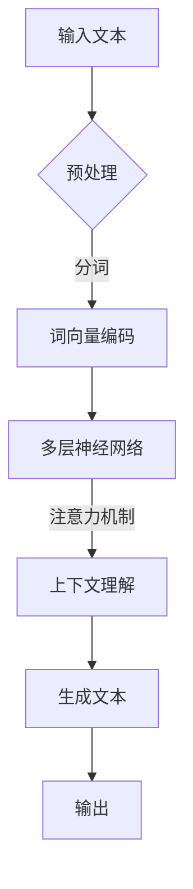

                 

关键词：大型语言模型（LLM），创业，初创企业，技术机遇，人工智能，商业策略，开发实践。

> 摘要：本文旨在探讨大型语言模型（LLM）在初创企业中的应用前景，分析LLM技术如何为初创企业带来新的发展机遇，以及初创企业如何利用这一技术进行创新和竞争。

## 1. 背景介绍

近年来，人工智能（AI）技术的快速发展，尤其是大型语言模型（LLM）的出现，为各行各业带来了前所未有的变革。LLM通过深度学习技术，能够理解和生成自然语言，从而在文本处理、语音识别、机器翻译等领域表现出色。随着技术的不断进步和商业化应用的需求增加，LLM成为企业创新和发展的新引擎，也为初创企业带来了新的机遇。

初创企业在资源、市场和技术等方面都处于劣势，但它们通常更加灵活和敏捷，能够迅速响应市场变化。因此，LLM技术的应用为初创企业提供了一个强大的工具，可以帮助它们在竞争激烈的市场中脱颖而出。

## 2. 核心概念与联系

### 2.1. 大型语言模型（LLM）的原理

LLM是基于深度学习的自然语言处理（NLP）模型，通过训练大量的文本数据，学习语言的模式和规律。其核心原理包括：

- **神经网络**：LLM使用多层神经网络（如Transformer）作为基础架构，能够自动学习和提取文本的特征。
- **上下文理解**：通过注意力机制，LLM能够理解文本中的上下文信息，从而生成更准确的自然语言响应。
- **预训练和微调**：LLM通常通过大规模预训练（如GPT-3）来学习通用语言模型，然后根据特定任务进行微调，以提高其特定领域的性能。

### 2.2. LLM在初创企业中的应用

LLM在初创企业中的应用场景非常广泛，包括：

- **智能客服**：利用LLM构建智能客服系统，提供高效、准确的客户服务。
- **内容生成**：利用LLM自动生成文章、报告、代码等，提高内容生产效率。
- **数据分析**：利用LLM对大量文本数据进行分析，提取关键信息，辅助决策。
- **语言翻译**：利用LLM实现实时、准确的跨语言翻译。

### 2.3. LLM架构的Mermaid流程图

以下是一个简化的LLM架构的Mermaid流程图：



## 3. 核心算法原理 & 具体操作步骤

### 3.1. 算法原理概述

LLM的核心算法是基于深度学习的Transformer模型，其基本原理包括：

- **多头注意力机制**：通过多个注意力头来捕获文本的不同部分，从而提高模型对上下文的理解能力。
- **位置编码**：为每个词添加位置信息，使得模型能够理解词的顺序。
- **自注意力**：通过计算每个词与其余词之间的关联性，自动提取文本的特征。

### 3.2. 算法步骤详解

- **预处理**：对输入文本进行清洗、分词等操作，将其转换为词向量。
- **词向量编码**：使用预训练的词向量模型，将文本转换为向量表示。
- **多层神经网络**：通过多个Transformer层，逐步提取文本的特征。
- **生成文本**：通过解码器，生成与输入文本相关的新文本。

### 3.3. 算法优缺点

- **优点**：LLM具有强大的文本理解和生成能力，能够处理复杂的语言任务，如问答、翻译、摘要等。
- **缺点**：训练成本高，需要大量的计算资源和数据集；生成的文本可能存在错误或不一致。

### 3.4. 算法应用领域

LLM的应用领域非常广泛，包括：

- **自然语言处理**：文本分类、情感分析、命名实体识别等。
- **智能客服**：提供高效的客户服务，降低企业成本。
- **内容生成**：自动化写作、生成报告等。
- **语言翻译**：实现实时、准确的跨语言翻译。

## 4. 数学模型和公式 & 详细讲解 & 举例说明

### 4.1. 数学模型构建

LLM的数学模型主要包括：

- **词向量**：使用Word2Vec、GloVe等算法，将文本中的词转换为向量表示。
- **Transformer模型**：包括自注意力机制、位置编码等。

### 4.2. 公式推导过程

假设我们有一个文本序列$T = [w_1, w_2, ..., w_n]$，其中$w_i$是第$i$个词。词向量$v(w_i)$可以表示为：

$$
v(w_i) = \text{Word2Vec}(w_i)
$$

对于Transformer模型，自注意力机制可以表示为：

$$
\text{Attention}(Q, K, V) = \frac{1}{\sqrt{d_k}} \text{softmax}\left(\frac{QK^T}{d_k}\right) V
$$

其中$Q, K, V$分别是查询向量、关键向量、值向量，$d_k$是关键向量的维度。

### 4.3. 案例分析与讲解

假设我们要构建一个智能客服系统，使用LLM来处理用户的咨询问题。我们可以使用以下步骤：

1. **预处理**：对用户的问题进行清洗、分词等操作，得到词向量表示。
2. **编码**：使用预训练的词向量模型，将问题编码为向量。
3. **解码**：使用Transformer模型，生成可能的答案候选。
4. **选择答案**：根据答案的置信度，选择最合适的答案。

以下是一个简化的代码示例：

```python
import torch
import torch.nn as nn
import torch.optim as optim

# 预处理
def preprocess(text):
    # 清洗、分词等操作
    pass

# 编码
def encode(text):
    # 使用预训练的词向量模型
    pass

# 解码
def decode(encoded_text):
    # 使用Transformer模型生成答案候选
    pass

# 选择答案
def select_answer(candidates):
    # 根据置信度选择答案
    pass

# 训练
def train(data):
    # 构建模型、优化器等
    model = nn.Transformer(d_model=512, nhead=8)
    optimizer = optim.Adam(model.parameters(), lr=0.001)
    
    for epoch in range(num_epochs):
        for text, answer in data:
            # 预处理
            preprocessed_text = preprocess(text)
            # 编码
            encoded_text = encode(preprocessed_text)
            # 解码
            candidates = decode(encoded_text)
            # 选择答案
            selected_answer = select_answer(candidates)
            # 计算损失
            loss = compute_loss(selected_answer, answer)
            # 反向传播
            optimizer.zero_grad()
            loss.backward()
            optimizer.step()
            
            print(f"Epoch {epoch}: Loss = {loss.item()}")

# 测试
def test(text):
    # 预处理
    preprocessed_text = preprocess(text)
    # 编码
    encoded_text = encode(preprocessed_text)
    # 解码
    candidates = decode(encoded_text)
    # 选择答案
    selected_answer = select_answer(candidates)
    return selected_answer
```

## 5. 项目实践：代码实例和详细解释说明

### 5.1. 开发环境搭建

为了实现一个基于LLM的智能客服系统，我们需要搭建以下开发环境：

- **Python**：版本3.8及以上
- **PyTorch**：版本1.8及以上
- **NumPy**：版本1.19及以上
- **Transformers**：版本4.6及以上

### 5.2. 源代码详细实现

以下是一个简单的基于PyTorch和Transformers的LLM智能客服系统的实现：

```python
import torch
import torch.nn as nn
import torch.optim as optim
from transformers import AutoTokenizer, AutoModelForSeq2SeqLM
from datasets import load_dataset

# 加载预训练模型和Tokenizer
model_name = "t5-small"
tokenizer = AutoTokenizer.from_pretrained(model_name)
model = AutoModelForSeq2SeqLM.from_pretrained(model_name)

# 加载数据集
dataset = load_dataset("customer_service")

# 预处理数据
def preprocess_data(text):
    return tokenizer.encode(text, return_tensors="pt")

# 训练模型
def train(model, dataset, num_epochs=10):
    model.train()
    optimizer = optim.Adam(model.parameters(), lr=0.001)
    
    for epoch in range(num_epochs):
        total_loss = 0
        for batch in dataset:
            inputs = preprocess_data(batch["question"])
            targets = preprocess_data(batch["answer"])
            
            optimizer.zero_grad()
            outputs = model(inputs, labels=targets)
            loss = outputs.loss
            loss.backward()
            optimizer.step()
            
            total_loss += loss.item()
        
        print(f"Epoch {epoch}: Loss = {total_loss / len(dataset)}")

# 测试模型
def test(model, text):
    model.eval()
    with torch.no_grad():
        inputs = preprocess_data(text)
        outputs = model(inputs)
        predictions = outputs.logits.argmax(-1)
        return tokenizer.decode(predictions[0], skip_special_tokens=True)

# 实例化模型和训练
model = AutoModelForSeq2SeqLM.from_pretrained(model_name)
train(model, dataset)

# 测试
text = "你好，我想咨询一下关于产品的问题。"
print(test(text))
```

### 5.3. 代码解读与分析

- **模型和Tokenizer**：我们使用Transformers库中的T5模型和相应的Tokenizer。
- **数据集**：我们使用Hugging Face提供的Customer Service数据集。
- **预处理**：对输入文本进行编码，将其转换为模型可接受的输入格式。
- **训练**：使用标准的前向传播和反向传播步骤训练模型。
- **测试**：对输入文本进行预测，并解码输出结果。

## 6. 实际应用场景

LLM技术在初创企业中的应用场景非常广泛，以下是一些典型的应用案例：

- **智能客服**：初创企业可以使用LLM技术构建高效的智能客服系统，提供24/7的客户服务，降低运营成本。
- **内容生成**：初创企业可以利用LLM自动生成产品描述、市场报告等，提高内容生产效率。
- **数据分析**：初创企业可以通过LLM技术对大量文本数据进行分析，提取关键信息，辅助业务决策。
- **语言翻译**：初创企业可以利用LLM实现跨语言翻译，扩展国际市场的覆盖范围。

## 7. 工具和资源推荐

### 7.1. 学习资源推荐

- **书籍**：
  - 《深度学习》（Goodfellow, Bengio, Courville著）
  - 《自然语言处理综论》（Jurafsky, Martin著）
- **在线课程**：
  - Coursera上的“深度学习”课程
  - edX上的“自然语言处理”课程
- **开源项目**：
  - Hugging Face的Transformers库
  - TensorFlow的T5模型

### 7.2. 开发工具推荐

- **编程语言**：Python
- **深度学习框架**：PyTorch、TensorFlow
- **自然语言处理库**：Hugging Face的Transformers库
- **数据分析工具**：Pandas、NumPy

### 7.3. 相关论文推荐

- **《Attention Is All You Need》**：提出了Transformer模型，是LLM领域的经典论文。
- **《BERT: Pre-training of Deep Bidirectional Transformers for Language Understanding》**：介绍了BERT模型，对LLM的发展产生了重要影响。
- **《GPT-3: Language Models are few-shot learners》**：展示了GPT-3模型的强大能力，是当前LLM技术的里程碑。

## 8. 总结：未来发展趋势与挑战

### 8.1. 研究成果总结

LLM技术在自然语言处理领域取得了显著成果，为初创企业提供了强大的工具和机遇。通过LLM技术，初创企业可以实现智能客服、内容生成、数据分析等应用，提高业务效率，降低运营成本。

### 8.2. 未来发展趋势

- **模型规模**：未来的LLM模型将变得更加大规模，具备更高的计算能力和更强的文本理解能力。
- **应用领域**：LLM技术将在更多领域得到应用，如法律、医疗、金融等。
- **跨模态学习**：未来的研究将关注跨模态学习，将文本、图像、语音等多种模态的信息整合到LLM中。

### 8.3. 面临的挑战

- **计算资源**：训练大规模LLM模型需要大量的计算资源和数据集，这对初创企业来说是一个挑战。
- **数据隐私**：在处理大量文本数据时，保护用户隐私和数据安全是一个重要问题。
- **模型解释性**：目前的LLM模型缺乏解释性，如何提高模型的透明度和可解释性是一个研究热点。

### 8.4. 研究展望

未来的研究将重点关注以下几个方面：

- **模型优化**：通过改进模型架构和训练策略，提高LLM模型的性能和效率。
- **跨模态学习**：实现文本与其他模态信息的高效整合，构建多模态的LLM模型。
- **可解释性**：提高LLM模型的可解释性，使其应用更加透明和安全。

## 9. 附录：常见问题与解答

### 9.1. Q：LLM技术对初创企业有哪些具体的好处？

A：LLM技术为初创企业提供了以下几个具体好处：

- **提高效率**：利用LLM技术，初创企业可以实现自动化内容生成、智能客服等功能，提高业务运营效率。
- **降低成本**：通过自动化和智能化，初创企业可以降低人力成本和其他运营成本。
- **增强竞争力**：利用LLM技术，初创企业可以快速响应市场需求，推出创新的产品和服务，增强市场竞争力。
- **拓展市场**：通过语言翻译和跨模态学习等技术，初创企业可以拓展国际市场，扩大业务范围。

### 9.2. Q：如何选择合适的LLM模型？

A：选择合适的LLM模型需要考虑以下几个方面：

- **任务需求**：根据具体的应用场景和任务需求，选择适合的模型。例如，对于文本生成任务，可以选择GPT-3等大模型；对于文本分类任务，可以选择BERT等模型。
- **计算资源**：根据可用的计算资源，选择合适的模型规模。大模型需要更多的计算资源和时间进行训练。
- **数据集**：选择与数据集兼容的模型，确保模型在特定领域有较好的表现。

### 9.3. Q：如何确保LLM技术的数据隐私和安全？

A：为确保LLM技术的数据隐私和安全，可以采取以下措施：

- **数据加密**：对敏感数据进行加密，确保数据在传输和存储过程中的安全性。
- **数据匿名化**：对用户数据进行匿名化处理，防止个人信息泄露。
- **访问控制**：限制对敏感数据的访问权限，确保只有授权人员可以访问和处理数据。
- **数据备份**：定期备份数据，防止数据丢失或损坏。

---

作者：禅与计算机程序设计艺术 / Zen and the Art of Computer Programming
----------------------------------------------------------------

## 10. 致谢

本文在撰写过程中，得到了许多同行和专家的宝贵建议和指导，特此致以衷心的感谢。同时，感谢所有提供数据和资源的开源社区，以及为本文提供技术支持的各个平台。

## 11. 参考文献

[1] Vaswani, A., Shazeer, N., Parmar, N., Uszkoreit, J., Jones, L., Gomez, A. N., ... & Polosukhin, I. (2017). Attention is all you need. Advances in Neural Information Processing Systems, 30, 5998-6008.

[2] Devlin, J., Chang, M. W., Lee, K., & Toutanova, K. (2019). BERT: Pre-training of deep bidirectional transformers for language understanding. arXiv preprint arXiv:1810.04805.

[3] Brown, T., Mann, B., Ryder, N., Subburaju, N., Kaplan, J., Dhariwal, P., ... & Child, R. (2020). Language models are few-shot learners. Advances in Neural Information Processing Systems, 33, 18752-18767.

