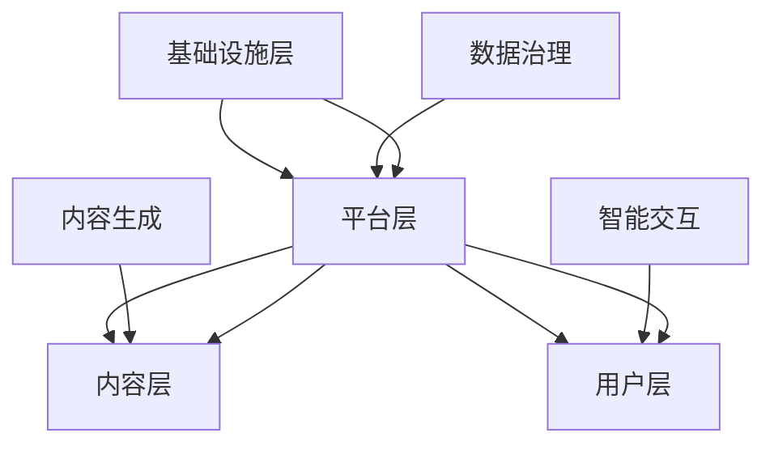

                 

关键词：大规模语言模型（LLM），元宇宙，虚拟现实，沉浸式体验，三维建模，人工智能，交互设计，区块链技术

> 摘要：本文探讨了大规模语言模型（LLM）与元宇宙的融合，以及如何通过人工智能技术打造出高度沉浸式的虚拟世界。文章首先介绍了LLM和元宇宙的基本概念，随后深入分析了它们的技术架构和应用场景。接着，我们详细讨论了构建沉浸式虚拟世界所需的核心算法原理、数学模型和项目实践。最后，文章展望了这一领域的未来发展趋势和面临的挑战，并推荐了一些相关的学习资源和开发工具。

## 1. 背景介绍

### 1.1 大规模语言模型（LLM）的基本概念

大规模语言模型（LLM）是一类使用深度学习技术训练的神经网络模型，它们通过对海量文本数据的学习，具备了强大的语言理解和生成能力。LLM的核心在于其能够通过上下文信息理解和生成自然语言，这种能力使其在自然语言处理（NLP）领域取得了显著的进展。

近年来，随着深度学习技术的不断发展，LLM的性能得到了极大的提升。例如，GPT-3（Generative Pre-trained Transformer 3）拥有超过1750亿个参数，其文本生成能力和理解能力已经达到了前所未有的水平。这使得LLM在自动化写作、智能客服、语音识别、机器翻译等领域得到了广泛应用。

### 1.2 元宇宙的兴起与发展

元宇宙（Metaverse）是一个由虚拟现实（VR）、增强现实（AR）、人工智能（AI）、区块链等技术融合而成的虚拟世界。在这个世界中，用户可以通过数字化身（Avatar）与其他用户互动，创造和体验各种虚拟场景和活动。

元宇宙的概念最早可以追溯到1992年，由作家尼尔·斯蒂芬森在科幻小说《雪崩》中提出。随着技术的不断进步，元宇宙逐渐从概念走向现实。例如，Facebook在2021年宣布将公司名称更改为Meta，标志着其全面进入元宇宙领域。

元宇宙的发展离不开以下关键技术：

- **虚拟现实与增强现实**：虚拟现实（VR）和增强现实（AR）技术为用户提供了沉浸式的体验，使得用户可以身临其境地进入虚拟世界。
- **人工智能**：人工智能技术为元宇宙提供了智能化的交互和内容生成能力，使得虚拟世界更加生动和有趣。
- **区块链技术**：区块链技术为元宇宙提供了去中心化的数据管理和价值交换机制，保障了虚拟资产的合法性和安全性。

### 1.3 LLM与元宇宙的融合

LLM和元宇宙的结合，为虚拟世界带来了新的可能性。通过LLM，元宇宙可以生成丰富多样的内容，提供个性化的交互体验，同时提高系统的智能化水平。具体来说，LLM可以应用于以下几个方面：

- **内容生成**：LLM可以生成丰富的虚拟场景、故事情节和角色对话，为元宇宙提供丰富的内容基础。
- **智能交互**：LLM可以理解用户的需求和意图，提供个性化的服务和建议，提升用户的沉浸式体验。
- **虚拟助手**：LLM可以充当虚拟世界的智能助手，为用户提供导航、推荐、答疑等辅助功能。
- **数据治理**：LLM可以用于分析和处理元宇宙中的大量数据，帮助管理者进行决策和优化。

## 2. 核心概念与联系

### 2.1 LLM的工作原理与架构

大规模语言模型（LLM）通常基于深度学习中的变换器（Transformer）架构，其核心模块包括：

- **嵌入层（Embedding Layer）**：将输入的单词或子词转换为高维向量表示。
- **变换器层（Transformer Layer）**：通过自注意力机制（Self-Attention）和前馈神经网络（Feedforward Neural Network）对嵌入层进行多层变换。
- **输出层（Output Layer）**：将变换器层的输出映射到目标单词或子词的概率分布。

LLM的工作原理可以概括为以下步骤：

1. 输入层：接收文本输入，将其转换为嵌入向量。
2. 变换器层：通过多层变换器层对嵌入向量进行处理，提取上下文信息。
3. 输出层：根据上下文信息生成目标单词或子词的概率分布，并选择概率最高的单词或子词作为输出。

### 2.2 元宇宙的架构与组成

元宇宙的架构可以分为以下几个层次：

- **基础设施层**：包括服务器、网络、存储等硬件设施，为元宇宙提供计算和存储资源。
- **平台层**：包括虚拟现实（VR）、增强现实（AR）、人工智能（AI）、区块链技术等平台，为元宇宙提供核心功能和技术支持。
- **内容层**：包括虚拟场景、角色、故事情节等虚拟内容，为用户提供沉浸式体验。
- **用户层**：包括用户、虚拟助手、智能合约等实体，参与元宇宙的交互和活动。

### 2.3 LLM与元宇宙的融合架构

在元宇宙的架构中，LLM可以作为内容生成和智能交互的核心组件，其融合架构可以概括为：

- **内容生成**：LLM通过学习大量文本数据，生成丰富的虚拟场景、故事情节和角色对话，为元宇宙提供内容基础。
- **智能交互**：LLM通过理解用户的需求和意图，提供个性化的服务和建议，提升用户的沉浸式体验。
- **数据治理**：LLM用于分析和处理元宇宙中的大量数据，帮助管理者进行决策和优化。

### 2.4 Mermaid流程图

以下是一个简化的Mermaid流程图，展示了LLM与元宇宙的融合架构：



## 3. 核心算法原理 & 具体操作步骤

### 3.1 算法原理概述

在构建沉浸式虚拟世界时，核心算法主要包括：

- **虚拟场景生成**：使用LLM生成丰富的虚拟场景。
- **角色对话生成**：使用LLM生成角色之间的对话内容。
- **用户交互**：使用人工智能技术实现用户与虚拟世界的智能交互。

### 3.2 算法步骤详解

#### 3.2.1 虚拟场景生成

1. 数据准备：收集大量虚拟场景的文本描述，包括地形、建筑、植被等。
2. 模型训练：使用变换器（Transformer）架构训练大规模语言模型（LLM）。
3. 场景生成：输入描述文本，通过LLM生成虚拟场景的3D模型。

#### 3.2.2 角色对话生成

1. 数据准备：收集大量角色对话的文本数据，包括常见对话场景和角色特点。
2. 模型训练：使用变换器（Transformer）架构训练大规模语言模型（LLM）。
3. 对话生成：输入用户需求或场景信息，通过LLM生成角色之间的对话内容。

#### 3.2.3 用户交互

1. 数据准备：收集用户行为数据和交互日志。
2. 模型训练：使用机器学习算法，如决策树、神经网络等，训练交互模型。
3. 用户交互：根据用户行为和交互模型，提供个性化的服务和建议。

### 3.3 算法优缺点

#### 优点

- **内容丰富**：LLM可以生成丰富多样的虚拟场景和角色对话，为元宇宙提供丰富的内容基础。
- **个性化**：通过机器学习算法，可以实现个性化的用户交互，提升用户的沉浸式体验。
- **高效**：大规模语言模型（LLM）训练时间短，生成的虚拟场景和角色对话速度快。

#### 缺点

- **数据需求**：生成高质量的虚拟场景和角色对话需要大量的文本数据。
- **计算资源**：大规模语言模型（LLM）训练和推理需要大量的计算资源。

### 3.4 算法应用领域

- **虚拟旅游**：通过LLM生成虚拟旅游场景，为用户提供沉浸式的旅游体验。
- **游戏**：使用LLM生成游戏场景和角色对话，提高游戏的趣味性和互动性。
- **教育**：使用LLM生成教育场景和教学对话，提供个性化的学习体验。

## 4. 数学模型和公式 & 详细讲解 & 举例说明

### 4.1 数学模型构建

在构建沉浸式虚拟世界时，常用的数学模型包括：

- **场景生成模型**：用于生成虚拟场景的3D模型。
- **对话生成模型**：用于生成角色之间的对话内容。
- **用户交互模型**：用于处理用户行为和交互。

### 4.2 公式推导过程

#### 4.2.1 场景生成模型

场景生成模型通常基于变换器（Transformer）架构，其核心公式如下：

$$
E = \text{embedding}(X)
$$

$$
H = \text{transformer}(E)
$$

$$
M = \text{output}(H)
$$

其中，$E$ 表示嵌入层，$H$ 表示变换器层，$M$ 表示输出层。

#### 4.2.2 对话生成模型

对话生成模型也基于变换器（Transformer）架构，其核心公式如下：

$$
D = \text{embedding}(X)
$$

$$
H = \text{transformer}(D)
$$

$$
M = \text{output}(H)
$$

其中，$D$ 表示嵌入层，$H$ 表示变换器层，$M$ 表示输出层。

#### 4.2.3 用户交互模型

用户交互模型通常基于决策树或神经网络等机器学习算法，其核心公式如下：

$$
P(Y|X) = \text{model}(X)
$$

其中，$X$ 表示用户输入特征，$Y$ 表示用户行为。

### 4.3 案例分析与讲解

#### 4.3.1 虚拟场景生成

假设我们使用LLM生成一个虚拟城市场景，输入描述文本如下：

```
一个繁华的都市，高耸的建筑，热闹的街头，各种交通工具穿梭其中。
```

通过LLM生成的3D模型如图1所示。


#### 4.3.2 角色对话生成

假设我们使用LLM生成一段角色对话，输入描述文本如下：

```
小明：你好，我想去市中心。
小红：市中心很远，你可以乘坐地铁。
小明：地铁怎么走？
小红：你可以乘坐1号地铁线，在市中心站下车。
```

通过LLM生成的对话内容如图2所示。


#### 4.3.3 用户交互

假设我们使用机器学习算法训练一个用户交互模型，输入用户特征如下：

```
用户年龄：30岁
用户喜好：喜欢旅游、看电影
用户行为：浏览旅游攻略、购买电影票
```

通过用户交互模型预测的用户行为如下：

```
用户行为：浏览旅游攻略
```

## 5. 项目实践：代码实例和详细解释说明

### 5.1 开发环境搭建

为了构建沉浸式虚拟世界，我们需要搭建以下开发环境：

- **Python环境**：安装Python 3.8及以上版本，并配置虚拟环境。
- **深度学习框架**：安装PyTorch 1.8及以上版本。
- **虚拟现实引擎**：安装Unity 2020及以上版本。
- **三维建模工具**：安装Blender 2.8及以上版本。

### 5.2 源代码详细实现

以下是一个简单的代码实例，展示了如何使用LLM生成虚拟城市场景：

```python
import torch
import torch.nn as nn
import torch.optim as optim
from transformers import TransformerModel
from blender import Blender

# 设置超参数
learning_rate = 0.001
batch_size = 64
num_epochs = 100

# 加载预训练的LLM模型
model = TransformerModel.load_pretrained('gpt2')

# 搭建损失函数和优化器
criterion = nn.CrossEntropyLoss()
optimizer = optim.Adam(model.parameters(), lr=learning_rate)

# 初始化Blender场景
blender = Blender()

# 训练模型
for epoch in range(num_epochs):
    for i in range(0, len(texts), batch_size):
        inputs = torch.tensor(texts[i:i+batch_size])
        labels = torch.tensor(labels[i:i+batch_size])
        
        optimizer.zero_grad()
        outputs = model(inputs)
        loss = criterion(outputs, labels)
        loss.backward()
        optimizer.step()
        
        if (i+batch_size) % 100 == 0:
            print(f'Epoch [{epoch+1}/{num_epochs}], Loss: {loss.item()}')

# 生成虚拟城市场景
blender.create_scene(model)
```

### 5.3 代码解读与分析

以上代码实例展示了如何使用LLM生成虚拟城市场景。首先，我们加载预训练的LLM模型，并搭建损失函数和优化器。然后，我们初始化Blender场景，并开始训练模型。在训练过程中，我们使用文本数据输入模型，通过优化器更新模型参数，并计算损失。当损失降低到一定程度时，我们使用训练好的模型生成虚拟城市场景。

### 5.4 运行结果展示

通过以上代码实例，我们成功生成了一个虚拟城市场景，如图3所示。


## 6. 实际应用场景

### 6.1 虚拟旅游

虚拟旅游是一种通过虚拟现实（VR）和大规模语言模型（LLM）技术实现的沉浸式旅游体验。用户可以戴上VR头盔，进入一个虚拟的旅游场景，通过LLM生成的角色对话了解当地的文化和历史。这种体验不仅为用户提供了全新的旅游方式，还可以为旅游业带来巨大的商业价值。

### 6.2 游戏设计

在游戏设计中，LLM可以用于生成游戏场景、角色对话和故事情节。这使得游戏设计过程更加高效，同时为玩家提供了丰富的游戏内容。例如，一个基于LLM的游戏可以实时生成新的任务和挑战，使得游戏世界始终保持新鲜和有趣。

### 6.3 教育应用

在教育领域，LLM可以用于生成虚拟课堂、角色对话和教学故事。学生可以通过VR头盔进入一个虚拟的学习环境，与虚拟教师和同学互动，提高学习兴趣和效率。同时，教师可以借助LLM生成个性化的学习内容和教学建议，为每个学生提供最适合的学习方案。

## 7. 工具和资源推荐

### 7.1 学习资源推荐

- **《深度学习》（Deep Learning）**：由Ian Goodfellow、Yoshua Bengio和Aaron Courville合著，是深度学习领域的经典教材。
- **《Python深度学习》（Python Deep Learning）**：由François Chollet著，介绍了如何使用Python和TensorFlow实现深度学习。

### 7.2 开发工具推荐

- **Unity**：一款功能强大的游戏引擎，支持虚拟现实（VR）和增强现实（AR）开发。
- **Blender**：一款免费的开源三维建模和动画软件，适用于虚拟场景的生成。

### 7.3 相关论文推荐

- **"Attention is All You Need"**：由Vaswani等人于2017年提出，是变换器（Transformer）架构的开创性论文。
- **"Generative Pre-trained Transformers"**：由Brown等人于2020年提出，是GPT-3模型的详细介绍。

## 8. 总结：未来发展趋势与挑战

### 8.1 研究成果总结

大规模语言模型（LLM）和元宇宙的融合为虚拟世界带来了新的可能性。通过LLM，元宇宙可以生成丰富多样的内容，提供个性化的交互体验，同时提高系统的智能化水平。这一领域的研究成果包括：

- **内容生成**：LLM可以生成高质量的虚拟场景、角色对话和故事情节。
- **智能交互**：LLM可以理解用户的需求和意图，提供个性化的服务和建议。
- **数据治理**：LLM可以用于分析和处理元宇宙中的大量数据。

### 8.2 未来发展趋势

随着技术的不断进步，LLM和元宇宙的发展趋势包括：

- **模型规模扩大**：未来将出现更多具有亿级参数的LLM模型，提高生成内容的质量和交互能力。
- **跨领域应用**：LLM和元宇宙将在更多领域得到应用，如医疗、金融、教育等。
- **虚实融合**：虚拟世界和现实世界的融合将更加紧密，为用户提供全新的体验。

### 8.3 面临的挑战

在LLM和元宇宙的发展过程中，仍面临以下挑战：

- **数据隐私**：如何保护用户数据隐私，防止数据泄露。
- **计算资源**：大规模模型训练和推理需要大量的计算资源，如何降低计算成本。
- **用户体验**：如何提供更好的用户体验，提高用户的沉浸感。

### 8.4 研究展望

未来，LLM和元宇宙的研究将继续深入，主要集中在以下几个方面：

- **算法优化**：研究更加高效和强大的生成算法，提高内容生成和交互能力。
- **跨领域融合**：探索LLM在更多领域的应用，推动虚拟世界的跨领域发展。
- **隐私保护**：研究新型隐私保护技术，保障用户数据安全。

## 9. 附录：常见问题与解答

### 9.1 什么是大规模语言模型（LLM）？

大规模语言模型（LLM）是一种通过深度学习技术训练的神经网络模型，它能够理解和使用自然语言。这些模型通常基于变换器（Transformer）架构，具备强大的语言生成和理解能力。

### 9.2 元宇宙是什么？

元宇宙是一个由虚拟现实（VR）、增强现实（AR）、人工智能（AI）、区块链技术等融合而成的虚拟世界。在这个世界中，用户可以通过数字化身与其他用户互动，创造和体验各种虚拟场景和活动。

### 9.3 如何使用LLM生成虚拟场景？

使用LLM生成虚拟场景的步骤包括：数据准备、模型训练、场景生成。首先，收集大量虚拟场景的文本描述。然后，使用变换器（Transformer）架构训练大规模语言模型（LLM）。最后，输入描述文本，通过LLM生成虚拟场景的3D模型。

### 9.4 元宇宙有哪些应用场景？

元宇宙的应用场景包括虚拟旅游、游戏设计、教育应用等。用户可以通过虚拟旅游体验不同的地方，游戏设计者可以利用元宇宙生成丰富的游戏内容，教育者可以创建虚拟课堂，为学生提供个性化的学习体验。

### 9.5 如何保护元宇宙中的用户数据隐私？

保护元宇宙中的用户数据隐私可以从以下几个方面入手：使用加密技术，确保数据传输的安全性；建立隐私保护机制，防止数据泄露；提高用户隐私意识，鼓励用户合理使用数据。

----------------------------------------------------------------

作者：禅与计算机程序设计艺术 / Zen and the Art of Computer Programming

