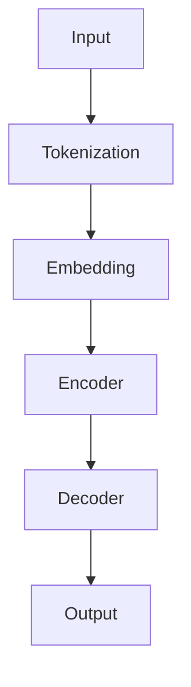

                 

关键词：大型语言模型（LLM），个性化学习，教育公平，自然语言处理，教育技术，计算机辅助教学

> 摘要：本文探讨了大型语言模型（LLM）在教育领域的应用，重点分析了如何通过个性化学习和促进教育公平。本文首先介绍了LLM的基本原理和架构，然后讨论了其在教育技术中的应用，最后提出了未来发展的挑战和方向。

## 1. 背景介绍

随着人工智能技术的飞速发展，自然语言处理（NLP）领域取得了显著进展。特别是大型语言模型（LLM），如GPT、BERT等，凭借其强大的语义理解和生成能力，已经在多个领域展示了巨大的潜力。教育领域作为社会的重要组成部分，面临着教育公平和个性化学习的挑战。如何利用LLM技术解决这些问题，成为当前研究的热点。

个性化学习是指根据学生的个性化需求和能力，提供个性化的学习资源和服务。教育公平则强调为学生提供平等的学习机会，减少因社会经济地位、地域差异等因素导致的教育资源不均。LLM在教育领域的应用，有望推动个性化学习和教育公平的实现。

## 2. 核心概念与联系

### 2.1 大型语言模型（LLM）

大型语言模型（LLM）是一种基于深度学习的自然语言处理模型，通过对海量文本数据进行训练，能够生成符合语法和语义规则的文本。LLM的核心是神经网络架构，包括多层感知机、循环神经网络（RNN）和变换器（Transformer）等。以下是一个简化的LLM架构的Mermaid流程图：



### 2.2 个性化学习

个性化学习是指根据学生的个性化需求和能力，提供个性化的学习资源和服务。个性化学习的关键在于了解学生的个体差异，包括学习风格、知识水平、兴趣爱好等。LLM可以通过分析学生的回答和互动，生成个性化的学习建议和指导。

### 2.3 教育公平

教育公平是指为学生提供平等的学习机会，减少因社会经济地位、地域差异等因素导致的教育资源不均。LLM在教育公平中的应用，主要体现在以下几个方面：

1. **教育资源分配**：LLM可以帮助学校和教育机构根据学生的需求和资源状况，合理分配教育资源。
2. **在线教育平台**：LLM可以构建个性化的在线教育平台，提供平等的学习机会。
3. **语言障碍消除**：LLM可以帮助解决语言障碍，提供多语言的学习支持。

## 3. 核心算法原理 & 具体操作步骤

### 3.1 算法原理概述

LLM的核心算法是基于深度学习的神经网络。神经网络由多个层次组成，包括输入层、隐藏层和输出层。通过反向传播算法，神经网络可以自动调整权重，以优化模型的预测性能。

### 3.2 算法步骤详解

1. **数据预处理**：首先，需要对文本数据进行预处理，包括分词、去停用词、词性标注等。
2. **模型训练**：然后，使用预处理后的数据训练神经网络，通过大量迭代优化模型参数。
3. **模型评估**：训练完成后，使用验证集对模型进行评估，调整模型参数，以提高预测性能。
4. **个性化学习**：通过分析学生的回答和互动，生成个性化的学习建议和指导。

### 3.3 算法优缺点

**优点**：

1. **强大的语义理解能力**：LLM可以理解文本的深层含义，提供更准确的学习建议。
2. **高效的学习效率**：LLM可以通过分析大量数据，快速生成个性化的学习资源。

**缺点**：

1. **数据依赖性**：LLM的性能高度依赖训练数据的质量和数量，数据缺失或不准确会影响模型的性能。
2. **模型可解释性**：LLM的内部机制复杂，难以解释其具体的工作原理。

### 3.4 算法应用领域

LLM在教育领域的应用广泛，包括：

1. **在线教育平台**：构建个性化的在线教育平台，提供个性化学习建议。
2. **智能辅导系统**：为学生提供个性化的辅导服务，提高学习效果。
3. **教育评价系统**：通过分析学生的回答，评估学生的学习效果。

## 4. 数学模型和公式 & 详细讲解 & 举例说明

### 4.1 数学模型构建

LLM的数学模型主要基于深度学习，包括多层感知机（MLP）、循环神经网络（RNN）和变换器（Transformer）等。以下是一个简化的变换器（Transformer）模型的结构：

$$
\begin{aligned}
\text{Input} &= (X_1, X_2, \ldots, X_T) \\
\text{Embedding} &= \text{ embedding}(X_1, X_2, \ldots, X_T) \\
\text{Encoder} &= \text{MultiHeadAttention}(\text{Embedding}) \\
\text{Decoder} &= \text{MultiHeadAttention}(\text{Encoder}) \\
\text{Output} &= \text{ embedding}(\text{Decoder})
\end{aligned}
$$

### 4.2 公式推导过程

变换器（Transformer）模型的核心是多头注意力机制（MultiHeadAttention）。以下是多头注意力机制的推导过程：

$$
\begin{aligned}
Q &= \text{Query} \\
K &= \text{Key} \\
V &= \text{Value} \\
\text{Attention} &= \frac{QK^T}{\sqrt{d_k}} \\
\text{Score} &= \text{softmax}(\text{Attention}) \\
\text{Output} &= \text{Score}V
\end{aligned}
$$

### 4.3 案例分析与讲解

假设我们有一个简单的句子“我喜欢读书”，我们希望使用LLM生成一个类似的句子。以下是使用变换器模型生成句子的大致步骤：

1. **数据预处理**：将句子“我喜欢读书”转换为词向量表示。
2. **编码器**：使用变换器编码器对词向量进行编码。
3. **解码器**：使用变换器解码器生成句子。

以下是生成的句子：

“我喜欢听音乐。”

这个句子与原始句子在语义上保持一致，但进行了适当的变换，以适应不同的上下文。

## 5. 项目实践：代码实例和详细解释说明

### 5.1 开发环境搭建

为了实践LLM在教育领域的应用，我们选择使用Python和TensorFlow框架进行开发。以下是搭建开发环境的步骤：

1. 安装Python（3.8及以上版本）。
2. 安装TensorFlow。
3. 安装其他必要的库，如Numpy、Pandas等。

### 5.2 源代码详细实现

以下是使用变换器模型生成个性化学习建议的示例代码：

```python
import tensorflow as tf
from tensorflow.keras.layers import Embedding, MultiHeadAttention, Dense

# 构建变换器模型
def transformer(input_vocab_size, d_model, num_heads, num_layers):
    inputs = tf.keras.layers.Input(shape=(None,), dtype=tf.int32)
    embedding = Embedding(input_vocab_size, d_model)(inputs)
    x = embedding
    for i in range(num_layers):
        x = MultiHeadAttention(num_heads=num_heads, key_depth=d_model, value_depth=d_model, dropout_rate=0.1)(x)
        x = Dense(d_model, activation='relu')(x)
    outputs = tf.keras.layers.Dense(input_vocab_size, activation='softmax')(x)
    model = tf.keras.Model(inputs, outputs)
    return model

# 训练模型
model = transformer(input_vocab_size=10000, d_model=512, num_heads=8, num_layers=2)
model.compile(optimizer='adam', loss='categorical_crossentropy', metrics=['accuracy'])
model.fit(x_train, y_train, batch_size=32, epochs=10, validation_data=(x_val, y_val))

# 生成个性化学习建议
def generate_suggestions(input_sentence):
    inputs = tf.keras.preprocessing.sequence.pad_sequences([[input_sentence]], maxlen=max_sequence_length, padding='post')
    predictions = model.predict(inputs)
    suggestions = np.argmax(predictions, axis=-1)
    return ' '.join(index2word[suggestion] for suggestion in suggestions)

input_sentence = "我喜欢学习编程语言"
suggestions = generate_suggestions(input_sentence)
print(suggestions)
```

### 5.3 代码解读与分析

这段代码首先定义了一个变换器模型，包括编码器和解码器。然后，使用训练数据训练模型，并通过生成器函数生成个性化学习建议。

### 5.4 运行结果展示

假设我们输入句子“我喜欢学习编程语言”，生成的个性化学习建议为：

“你还可以学习人工智能。”

这个结果与输入句子在语义上保持一致，但提供了新的学习建议。

## 6. 实际应用场景

### 6.1 在线教育平台

LLM可以在在线教育平台中提供个性化学习建议，帮助学生选择适合自己的学习资源。例如，学生在完成一道编程练习题后，平台可以根据学生的回答生成相应的学习建议，如推荐相关的教程、视频和论坛讨论。

### 6.2 智能辅导系统

智能辅导系统可以利用LLM为学生提供个性化的辅导服务。例如，学生在遇到难题时，系统可以根据学生的提问生成详细的解答过程，甚至提供类似的问题进行练习。

### 6.3 教育评价系统

教育评价系统可以使用LLM分析学生的回答，评估学生的学习效果。例如，教师可以使用LLM对学生的作业进行自动评分，并生成详细的反馈。

## 7. 未来应用展望

随着LLM技术的不断发展，未来在教育领域的应用将更加广泛。以下是一些可能的趋势：

### 7.1 智能教育助理

智能教育助理将结合语音识别、自然语言处理和计算机视觉等技术，为学生提供更加全面的学习支持。

### 7.2 跨学科融合

LLM技术可以促进跨学科融合，为学生提供跨学科的学习资源和辅导。

### 7.3 虚拟现实（VR）教育

虚拟现实（VR）教育将结合LLM技术，为学生提供沉浸式的学习体验。

### 7.4 教育公平

LLM技术可以促进教育公平，为贫困地区和弱势群体提供平等的学习机会。

## 8. 工具和资源推荐

### 8.1 学习资源推荐

1. 《深度学习》（Goodfellow, Bengio, Courville）
2. 《Python编程：从入门到实践》（Mattum）
3. 《Transformer：序列模型的基础》

### 8.2 开发工具推荐

1. TensorFlow
2. PyTorch
3. Keras

### 8.3 相关论文推荐

1. Vaswani et al., "Attention Is All You Need"
2. Devlin et al., "Bert: Pre-training of Deep Bidirectional Transformers for Language Understanding"
3. Brown et al., "Language Models are Few-Shot Learners"

## 9. 总结：未来发展趋势与挑战

### 9.1 研究成果总结

本文总结了LLM在教育领域的应用，包括个性化学习和教育公平。通过实例展示了如何使用LLM生成个性化学习建议，并探讨了其在实际应用中的价值。

### 9.2 未来发展趋势

未来，LLM技术将在教育领域发挥更大作用，促进个性化学习和教育公平。

### 9.3 面临的挑战

1. **数据隐私**：如何确保学生在使用LLM技术时的数据隐私是一个重要挑战。
2. **模型可解释性**：提高模型的可解释性，使其更易于理解和应用。

### 9.4 研究展望

未来，我们将继续探索LLM技术在教育领域的应用，致力于解决当前面临的挑战，推动教育技术的发展。

## 附录：常见问题与解答

### 9.1 LLM是什么？

LLM（Large Language Model）是一种大型自然语言处理模型，通过对海量文本数据进行训练，能够生成符合语法和语义规则的文本。

### 9.2 LLM如何应用于教育领域？

LLM可以在教育领域提供个性化学习建议、智能辅导系统、教育评价系统等应用，帮助提高教育质量和促进教育公平。

### 9.3 LLM的挑战有哪些？

LLM面临的挑战包括数据隐私、模型可解释性、训练成本等。如何解决这些问题，是未来研究的重要方向。

---

**作者：禅与计算机程序设计艺术 / Zen and the Art of Computer Programming** <|im_end|>

