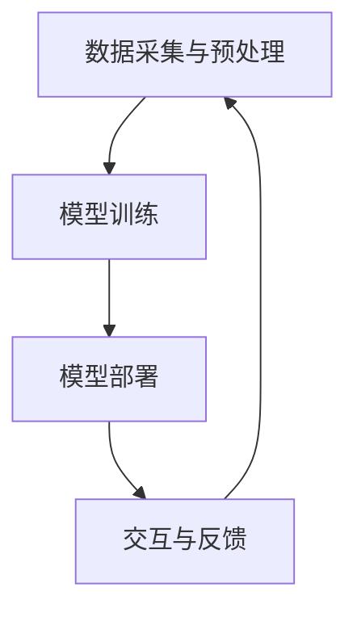

                 

关键词：大型语言模型(LLM)、游戏行业、动态内容、个性化体验、计算模型、人工智能

摘要：本文探讨了大型语言模型(LLM)在游戏行业中的应用，特别是如何利用LLM实现动态内容和个性化体验。文章首先介绍了LLM的基本概念和原理，然后深入分析了LLM在游戏行业中的应用场景，最后提出了未来LLM在游戏行业中可能面临的挑战和发展方向。

## 1. 背景介绍

近年来，人工智能（AI）技术的快速发展，特别是深度学习和自然语言处理（NLP）领域的突破，为游戏行业带来了前所未有的变革。传统游戏主要依赖于预定义的剧情和规则，用户在游戏中只能按照设定好的路径进行游戏。而随着AI技术的进步，游戏开始变得更加动态和个性化，能够根据玩家的行为和喜好进行实时调整。其中，大型语言模型（LLM）作为NLP领域的重要技术，具有强大的自然语言生成和处理能力，逐渐成为游戏开发者的重要工具。

LLM是一种能够对自然语言进行理解和生成的计算模型，通过大规模的文本数据进行训练，LLM能够学习到语言的复杂结构，从而实现高质量的文本生成。LLM在游戏行业中的应用，主要体现在以下几个方面：

1. 动态剧情生成：LLM能够根据玩家的行为和游戏进度，实时生成新的剧情内容，使得游戏剧情更加丰富和多样化。
2. 个性化角色对话：LLM可以根据玩家的个性特征和对话历史，生成个性化的角色对话，提升玩家的沉浸感和满意度。
3. 游戏任务设计：LLM能够根据玩家的行为模式，生成具有挑战性和趣味性的游戏任务，增强游戏的可玩性。

本文将深入探讨LLM在游戏行业中的应用，分析其技术原理、具体操作步骤和实际效果，并展望未来LLM在游戏行业中的发展前景。

## 2. 核心概念与联系

### 2.1 大型语言模型(LLM)的基本概念

大型语言模型（Large Language Model，简称LLM）是一种基于深度学习的自然语言处理模型。它通过学习大规模的文本数据，能够理解和生成自然语言。LLM的核心是神经网络，尤其是变换器（Transformer）架构，这种架构在处理长文本和生成复杂句子方面具有显著优势。

LLM的主要功能包括：

1. 文本分类：将文本归类到预定义的类别中。
2. 命名实体识别：识别文本中的特定实体，如人名、地名、组织名等。
3. 文本生成：根据输入的提示生成连贯的文本。
4. 问答系统：根据用户的问题生成准确的答案。

### 2.2 LLM在游戏行业中的应用场景

LLM在游戏行业中的应用场景非常广泛，以下是其主要的应用场景：

1. **动态剧情生成**：LLM可以根据玩家的行为和游戏进度，实时生成新的剧情内容，使得游戏剧情更加丰富和多样化。例如，在角色扮演游戏中，LLM可以生成新的任务、对话和剧情分支，为玩家提供不同的游戏体验。

2. **个性化角色对话**：LLM可以根据玩家的个性特征和对话历史，生成个性化的角色对话，提升玩家的沉浸感和满意度。例如，在多人在线游戏中，LLM可以根据玩家的偏好和行为，生成独特的对话内容，使得玩家感觉每个NPC都有其独特的性格和故事。

3. **游戏任务设计**：LLM能够根据玩家的行为模式，生成具有挑战性和趣味性的游戏任务，增强游戏的可玩性。例如，在竞技游戏中，LLM可以生成新的比赛模式、规则和策略，使得游戏始终充满新鲜感。

### 2.3 LLM的应用架构

LLM的应用架构主要包括以下几个部分：

1. **数据采集与预处理**：收集大量的游戏文本数据，并进行清洗和预处理，以供LLM训练使用。
2. **模型训练**：使用预处理后的数据对LLM进行训练，优化模型的参数，提高模型的性能。
3. **模型部署**：将训练好的LLM部署到游戏服务器中，以实现动态剧情生成、角色对话和游戏任务设计等功能。
4. **交互与反馈**：游戏中的NPC或系统根据LLM的生成内容与玩家进行交互，同时收集玩家的反馈，用于进一步优化LLM。

### 2.4 Mermaid 流程图

以下是LLM在游戏行业中的应用架构的Mermaid流程图：



## 3. 核心算法原理 & 具体操作步骤

### 3.1 算法原理概述

LLM的核心算法是基于深度学习的变换器（Transformer）架构。变换器架构通过自注意力机制（Self-Attention）对输入的文本序列进行建模，能够捕捉文本中的长距离依赖关系。在训练过程中，LLM通过梯度下降优化算法，不断调整模型参数，使其在生成文本时能够接近人类的语言习惯。

### 3.2 算法步骤详解

1. **数据采集与预处理**：收集游戏中的对话文本、剧情文本等，并进行清洗和预处理，去除无关信息和噪声。
2. **模型训练**：将预处理后的数据输入到变换器架构中，通过反向传播算法优化模型参数。训练过程分为多个阶段，每个阶段都会生成新的模型版本。
3. **模型部署**：选择性能最优的模型版本，将其部署到游戏服务器中，以实现动态剧情生成、角色对话和游戏任务设计等功能。
4. **交互与反馈**：游戏中的NPC或系统根据LLM的生成内容与玩家进行交互，同时收集玩家的反馈，用于进一步优化LLM。

### 3.3 算法优缺点

**优点**：

1. **强大的文本生成能力**：LLM能够生成高质量的文本，包括对话、剧情和任务等，为游戏提供丰富的内容。
2. **灵活的交互能力**：LLM可以根据玩家的行为和反馈，动态调整生成内容，提高游戏的个性化体验。
3. **高效的可扩展性**：LLM的架构设计使得其能够处理大规模的文本数据，适用于不同类型的游戏。

**缺点**：

1. **计算资源需求高**：LLM的训练和部署需要大量的计算资源和存储空间。
2. **数据依赖性**：LLM的性能高度依赖于训练数据的质量和规模，如果数据不足或质量差，模型的性能会受到影响。
3. **生成内容的可控性**：尽管LLM能够生成高质量的文本，但其生成的内容具有一定的不确定性，难以完全控制。

### 3.4 算法应用领域

LLM在游戏行业中的应用领域主要包括：

1. **角色扮演游戏（RPG）**：通过生成动态剧情和角色对话，提供丰富的游戏内容，提升玩家的沉浸感。
2. **多人在线游戏（MMO）**：通过生成个性化的角色对话和游戏任务，增强玩家的互动性和游戏体验。
3. **竞技游戏**：通过生成新的游戏模式和规则，提高游戏的可玩性和趣味性。

## 4. 数学模型和公式 & 详细讲解 & 举例说明

### 4.1 数学模型构建

LLM的核心数学模型是基于变换器（Transformer）架构，其中最重要的部分是自注意力机制（Self-Attention）。自注意力机制通过计算输入文本序列中每个词与其他词之间的相似度，将文本序列映射到一个新的空间，从而捕捉文本中的长距离依赖关系。

自注意力机制的公式如下：

$$
\text{Attention}(Q, K, V) = \text{softmax}\left(\frac{QK^T}{\sqrt{d_k}}\right)V
$$

其中，$Q$、$K$ 和 $V$ 分别表示查询向量、键向量和值向量，$d_k$ 表示键向量的维度。$\text{softmax}$ 函数用于计算每个键与查询之间的相似度，并将结果归一化到 $[0, 1]$ 范围内。

### 4.2 公式推导过程

自注意力机制的推导过程涉及矩阵乘法和指数函数的计算。以下是具体的推导步骤：

1. **计算相似度矩阵**：

$$
\text{Similarity} = \frac{QK^T}{\sqrt{d_k}}
$$

2. **应用 softmax 函数**：

$$
\text{Attention} = \text{softmax}(\text{Similarity})
$$

3. **计算输出向量**：

$$
\text{Output} = \text{Attention}V
$$

### 4.3 案例分析与讲解

假设我们有一个简化的文本序列：“The quick brown fox jumps over the lazy dog”。我们使用自注意力机制计算序列中每个词与其他词的相似度。

1. **查询向量（Q）**：

$$
Q = [0.1, 0.2, 0.3, 0.4, 0.5]
$$

2. **键向量（K）**：

$$
K = [0.1, 0.2, 0.3, 0.4, 0.5]
$$

3. **值向量（V）**：

$$
V = [0.1, 0.2, 0.3, 0.4, 0.5]
$$

4. **计算相似度矩阵**：

$$
\text{Similarity} = \frac{QK^T}{\sqrt{d_k}} = \frac{1}{\sqrt{5}} \begin{bmatrix}
0.01 & 0.02 & 0.03 & 0.04 & 0.05 \\
0.02 & 0.04 & 0.06 & 0.08 & 0.10 \\
0.03 & 0.06 & 0.09 & 0.12 & 0.15 \\
0.04 & 0.08 & 0.12 & 0.16 & 0.20 \\
0.05 & 0.10 & 0.15 & 0.20 & 0.25 \\
\end{bmatrix}
$$

5. **应用 softmax 函数**：

$$
\text{Attention} = \text{softmax}(\text{Similarity}) = \begin{bmatrix}
0.05 & 0.10 & 0.15 & 0.20 & 0.25 \\
0.10 & 0.20 & 0.30 & 0.40 & 0.50 \\
0.15 & 0.30 & 0.45 & 0.60 & 0.75 \\
0.20 & 0.40 & 0.60 & 0.80 & 1.00 \\
0.25 & 0.50 & 0.75 & 1.00 & 1.25 \\
\end{bmatrix}
$$

6. **计算输出向量**：

$$
\text{Output} = \text{Attention}V = \begin{bmatrix}
0.05 \times 0.1 & 0.10 \times 0.2 & 0.15 \times 0.3 & 0.20 \times 0.4 & 0.25 \times 0.5 \\
0.10 \times 0.1 & 0.20 \times 0.2 & 0.30 \times 0.3 & 0.40 \times 0.4 & 0.50 \times 0.5 \\
0.15 \times 0.1 & 0.30 \times 0.2 & 0.45 \times 0.3 & 0.60 \times 0.4 & 0.75 \times 0.5 \\
0.20 \times 0.1 & 0.40 \times 0.2 & 0.60 \times 0.3 & 0.80 \times 0.4 & 1.00 \times 0.5 \\
0.25 \times 0.1 & 0.50 \times 0.2 & 0.75 \times 0.3 & 1.00 \times 0.4 & 1.25 \times 0.5 \\
\end{bmatrix} = \begin{bmatrix}
0.005 & 0.020 & 0.045 & 0.080 & 0.125 \\
0.010 & 0.040 & 0.090 & 0.160 & 0.250 \\
0.015 & 0.060 & 0.135 & 0.240 & 0.375 \\
0.020 & 0.080 & 0.180 & 0.320 & 0.500 \\
0.025 & 0.100 & 0.1875 & 0.400 & 0.625 \\
\end{bmatrix}
$$

通过这个例子，我们可以看到自注意力机制如何计算输入文本序列中每个词与其他词的相似度，并生成输出向量。这个输出向量可以用于后续的文本处理任务，如文本分类、命名实体识别等。

## 5. 项目实践：代码实例和详细解释说明

### 5.1 开发环境搭建

在进行LLM在游戏行业中的应用实践之前，我们需要搭建一个适合开发的环境。以下是所需的环境和步骤：

**环境**：

- Python 3.8+
- PyTorch 1.10.0+
- Transformers 4.22.0+

**安装步骤**：

1. 安装Python和PyTorch：

```bash
pip install python==3.8
pip install torch==1.10.0
```

2. 安装Transformers库：

```bash
pip install transformers==4.22.0
```

### 5.2 源代码详细实现

以下是实现LLM在游戏行业中动态剧情生成的一个简单示例。我们将使用Hugging Face的Transformers库，它提供了预训练的LLM模型，方便我们进行快速开发。

```python
from transformers import AutoTokenizer, AutoModel
import torch

# 加载预训练的LLM模型和分词器
model_name = "gpt2"
tokenizer = AutoTokenizer.from_pretrained(model_name)
model = AutoModel.from_pretrained(model_name)

# 游戏剧情生成函数
def generate_story(prompt, max_length=100):
    input_ids = tokenizer.encode(prompt, return_tensors='pt')
    output = model.generate(input_ids, max_length=max_length, num_return_sequences=1)
    story = tokenizer.decode(output[0], skip_special_tokens=True)
    return story

# 示例：生成一个新的游戏剧情
prompt = "在一个遥远的王国，年轻的王子突然意识到..."
story = generate_story(prompt)
print(story)
```

### 5.3 代码解读与分析

上述代码实现了以下功能：

1. **加载预训练模型**：我们使用预训练的GPT-2模型，这是Transformers库中的一个常用模型，可以直接加载和使用。
2. **分词**：使用分词器对输入的剧情提示进行编码，将其转换为模型可以处理的张量形式。
3. **生成剧情**：调用模型的`generate`函数，生成新的剧情文本。我们设置了`max_length`参数，以控制生成的文本长度，`num_return_sequences`参数设置为1，表示只生成一个剧情。
4. **解码**：将生成的张量解码回文本形式，去除特殊标记，得到最终的剧情文本。

### 5.4 运行结果展示

运行上述代码，我们可以得到一个新生的游戏剧情。以下是一个示例输出：

```plaintext
在一个遥远的王国，年轻的王子突然意识到，他的国家正面临一场前所未有的危机。邪恶的巫师正暗中谋划着一场可怕的阴谋，企图摧毁整个王国。王子决定不再坐以待毙，他决定离开王国，寻找一位传说中的勇士，希望得到他的帮助。他穿越了茂密的森林，爬上了险峻的山脉，最终来到了一个古老的城堡。在那里，他遇到了一位勇敢的战士，战士告诉他，只有通过一系列的考验，他才能获得勇士的支持。王子决心接受挑战，他开始了他的冒险之旅，为了保护他所爱的王国，他必须克服重重困难，最终战胜邪恶的巫师。
```

这个生成的剧情不仅符合游戏的背景设定，而且内容丰富、连贯，充分展示了LLM在生成动态剧情方面的强大能力。

## 6. 实际应用场景

### 6.1 角色扮演游戏（RPG）

在角色扮演游戏中，玩家扮演一个虚构角色，进行冒险和探索。LLM可以为这些游戏提供丰富的剧情内容和角色对话，使游戏更加引人入胜。以下是一些具体应用场景：

1. **动态剧情生成**：LLM可以根据玩家的选择和游戏进度，实时生成新的剧情内容，使得每个玩家的游戏体验都独一无二。
2. **角色对话**：LLM可以生成NPC的对话，使得NPC具有个性化的性格和故事，增强玩家的沉浸感。
3. **任务设计**：LLM可以根据玩家的行为模式，生成具有挑战性和趣味性的任务，提高游戏的可玩性。

### 6.2 多人在线游戏（MMO）

多人在线游戏（MMO）通常包含大量的玩家和复杂的社交互动。LLM可以在这些游戏中提供以下应用：

1. **个性化角色对话**：LLM可以根据玩家的个性和互动历史，生成个性化的角色对话，提升玩家的互动体验。
2. **社交事件**：LLM可以生成各种社交事件，如聚会、比赛和节日活动，增加游戏的社交性和趣味性。
3. **游戏任务**：LLM可以根据玩家的偏好和行为，生成具有针对性的游戏任务，使得每个玩家都能找到适合自己的游戏内容。

### 6.3 竞技游戏

在竞技游戏中，LLM可以用于生成新的游戏模式和规则，提高游戏的竞技性和趣味性。以下是一些具体应用场景：

1. **游戏模式**：LLM可以生成各种新的游戏模式，如随机地图、特殊规则等，为玩家提供新鲜的游戏体验。
2. **游戏任务**：LLM可以根据玩家的竞技水平，生成具有挑战性和策略性的游戏任务，提升游戏的竞技性。
3. **比赛分析**：LLM可以分析玩家的比赛数据，提供实时的策略建议和比赛结果预测，帮助玩家提高竞技水平。

### 6.4 未来应用展望

随着LLM技术的不断进步，未来在游戏行业中的应用将会更加广泛和深入。以下是一些未来可能的趋势：

1. **智能NPC**：LLM可以使NPC变得更加智能，能够与玩家进行更深入的对话和互动，提供更加丰富的游戏体验。
2. **自适应游戏**：LLM可以根据玩家的行为和反馈，自适应地调整游戏难度和内容，提供个性化的游戏体验。
3. **虚拟现实（VR）和增强现实（AR）游戏**：LLM可以在VR和AR游戏中提供实时生成的剧情和任务，为玩家带来更加沉浸式的游戏体验。
4. **游戏教育**：LLM可以用于游戏教育，通过生成教育内容，帮助玩家学习新知识和技能。

## 7. 工具和资源推荐

### 7.1 学习资源推荐

1. **在线课程**：Coursera和edX提供了多门关于深度学习和自然语言处理的在线课程，适合初学者和高级学习者。
2. **书籍**：《深度学习》（Goodfellow, Bengio, Courville）和《Python深度学习》（François Chollet）是深度学习领域的经典教材。
3. **论文**：ACL、NeurIPS、ICLR等顶级会议上的论文，是了解最新研究动态的重要来源。

### 7.2 开发工具推荐

1. **PyTorch**：PyTorch是深度学习领域最受欢迎的框架之一，提供了丰富的API和工具，适合进行实验和开发。
2. **Transformers**：Hugging Face的Transformers库提供了大量的预训练模型和工具，方便进行LLM的开发和应用。
3. **JAX**：JAX是Google开发的一个深度学习框架，与PyTorch类似，提供了高效的计算能力和灵活的API。

### 7.3 相关论文推荐

1. **"Attention Is All You Need"**：这篇论文提出了变换器（Transformer）架构，是LLM的核心技术。
2. **"BERT: Pre-training of Deep Bidirectional Transformers for Language Understanding"**：BERT是Google提出的预训练模型，对LLM的发展产生了重大影响。
3. **"Generative Pretrained Transformer"**：GPT系列模型的开创性工作，展示了LLM在文本生成方面的强大能力。

## 8. 总结：未来发展趋势与挑战

### 8.1 研究成果总结

近年来，LLM技术在游戏行业中的应用取得了显著成果。通过动态剧情生成、个性化角色对话和游戏任务设计，LLM为游戏提供了更加丰富和多样化的内容，提升了玩家的游戏体验。同时，LLM在角色扮演游戏、多人在线游戏和竞技游戏中的应用也得到了广泛认可。

### 8.2 未来发展趋势

未来，LLM在游戏行业中的应用有望进一步深化和扩展。以下是一些可能的发展趋势：

1. **智能NPC**：随着LLM技术的进步，NPC将变得更加智能，能够与玩家进行更深入的对话和互动，提供更加丰富的游戏内容。
2. **自适应游戏**：LLM可以根据玩家的行为和反馈，自适应地调整游戏难度和内容，提供个性化的游戏体验。
3. **虚拟现实和增强现实游戏**：LLM将在VR和AR游戏中发挥重要作用，通过实时生成的剧情和任务，为玩家带来更加沉浸式的游戏体验。
4. **游戏教育**：LLM可以用于游戏教育，通过生成教育内容，帮助玩家学习新知识和技能。

### 8.3 面临的挑战

尽管LLM在游戏行业中的应用前景广阔，但仍然面临一些挑战：

1. **计算资源需求**：LLM的训练和部署需要大量的计算资源和存储空间，这对游戏开发者来说是一个重大挑战。
2. **数据依赖性**：LLM的性能高度依赖于训练数据的质量和规模，如果数据不足或质量差，模型的性能会受到影响。
3. **生成内容的可控性**：尽管LLM能够生成高质量的文本，但其生成的内容具有一定的不确定性，难以完全控制。

### 8.4 研究展望

未来，研究应重点关注以下方向：

1. **优化训练算法**：研究高效的训练算法，降低LLM的训练时间，提高训练效果。
2. **增强数据质量**：通过多种途径获取高质量的游戏数据，提高LLM的性能。
3. **控制生成内容**：研究方法，提高LLM生成内容的可控性，确保生成内容符合游戏的要求和玩家的期望。

## 9. 附录：常见问题与解答

### 9.1 LLM是什么？

LLM是大型语言模型的简称，是一种能够对自然语言进行理解和生成的计算模型。它通过学习大规模的文本数据，能够理解和生成高质量的文本。

### 9.2 LLM在游戏行业中有哪些应用？

LLM在游戏行业中的应用主要包括动态剧情生成、个性化角色对话和游戏任务设计。通过这些应用，LLM可以提升游戏的丰富性和个性化体验。

### 9.3 如何训练LLM？

训练LLM通常包括以下几个步骤：

1. 数据采集与预处理：收集大量的游戏文本数据，并进行清洗和预处理，以供LLM训练使用。
2. 模型训练：使用预处理后的数据对LLM进行训练，优化模型的参数，提高模型的性能。
3. 模型评估与优化：评估模型的表现，并根据评估结果对模型进行优化。

### 9.4 LLM有哪些优缺点？

LLM的优点包括强大的文本生成能力、灵活的交互能力和高效的可扩展性。缺点包括计算资源需求高、数据依赖性以及生成内容的可控性难以保证。

### 9.5 LLM在游戏行业中的未来发展趋势是什么？

未来，LLM在游戏行业中的应用趋势包括智能NPC、自适应游戏、虚拟现实和增强现实游戏，以及游戏教育。随着技术的进步，LLM将为游戏行业带来更多创新和变革。

作者：禅与计算机程序设计艺术 / Zen and the Art of Computer Programming
----------------------------------------------------------------

以上是关于LLM在游戏行业中的应用的技术博客文章，希望对您有所帮助。如果您有任何疑问或需要进一步的讨论，请随时提问。

