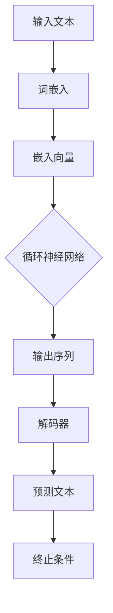

                 

关键词：LLM，自然语言处理，游戏行业，动态内容，个性化体验，算法原理，数学模型，项目实践，工具资源，未来展望

> 摘要：本文将探讨大型语言模型（LLM）在游戏行业中的应用，重点关注如何通过动态内容和个性化体验提升游戏品质。文章从背景介绍、核心概念与联系、算法原理与具体操作步骤、数学模型与公式、项目实践、实际应用场景、工具和资源推荐等方面展开，旨在为游戏开发者和研究者提供有价值的参考。

## 1. 背景介绍

近年来，人工智能技术在游戏行业中的地位日益凸显。从简单的AI对手到复杂的智能NPC（非玩家角色），人工智能正在改变游戏设计和玩家体验的方式。随着自然语言处理（NLP）技术的发展，特别是大型语言模型（LLM）的出现，游戏行业迎来了前所未有的变革。LLM具有强大的文本生成和解析能力，能够在游戏内容创作、玩家交互、智能NPC设计等方面发挥重要作用。

在游戏行业中，动态内容和个性化体验是两个至关重要的概念。动态内容指的是游戏世界中不断变化和发展的内容，如剧情、任务、角色对话等。个性化体验则是指根据玩家的行为和偏好，为玩家提供定制化的游戏内容和体验。这两个概念的结合，能够极大地提升游戏品质和玩家满意度。

本文将探讨LLM如何通过动态内容和个性化体验在游戏行业中发挥作用。首先，我们将介绍LLM的核心概念和原理，并通过Mermaid流程图展示其架构。接着，我们将详细解释LLM的算法原理和操作步骤，并分析其优缺点和应用领域。随后，我们将介绍相关的数学模型和公式，并通过实际案例进行讲解。最后，我们将分享项目实践中的代码实例和运行结果，并讨论LLM在实际应用场景中的未来展望。

## 2. 核心概念与联系

### 2.1 LLM的核心概念

大型语言模型（LLM）是一种基于深度学习的自然语言处理模型，具有强大的文本生成和解析能力。LLM的核心概念包括：

- **词嵌入（Word Embedding）**：将自然语言词汇映射到高维向量空间中，以便模型能够理解词汇之间的相似性和相关性。
- **循环神经网络（RNN）**：一种能够处理序列数据的神经网络架构，适用于自然语言处理任务。
- **长短时记忆（LSTM）**：RNN的一种变体，能够解决长期依赖问题，适用于处理复杂的语言序列。
- **变压器（Transformer）**：一种基于自注意力机制的神经网络架构，具有并行计算优势，是当前最流行的语言模型架构。

### 2.2 LLM的架构

以下是LLM的架构图，通过Mermaid流程图展示：



### 2.3 LLM与游戏行业的联系

LLM在游戏行业中的应用主要体现在以下几个方面：

- **剧情生成**：利用LLM的文本生成能力，自动生成游戏剧情、任务和角色对话。
- **智能NPC设计**：通过LLM的自然语言处理能力，为NPC赋予更加智能和个性化的对话和行为。
- **个性化体验**：根据玩家的行为和偏好，利用LLM为玩家提供定制化的游戏内容和体验。

## 3. 核心算法原理 & 具体操作步骤

### 3.1 算法原理概述

LLM的核心算法原理可以概括为以下步骤：

1. **输入处理**：接收自然语言文本输入，进行分词和词嵌入。
2. **嵌入向量计算**：将分词后的文本映射到高维向量空间，生成嵌入向量。
3. **序列处理**：通过循环神经网络或变压器，处理嵌入向量序列。
4. **输出生成**：解码输出序列，生成预测的文本。

### 3.2 算法步骤详解

#### 3.2.1 输入处理

输入处理是LLM的第一步，主要包括分词和词嵌入：

- **分词**：将输入文本按照单词或字符进行分割。
- **词嵌入**：将分词后的文本映射到高维向量空间，使用预训练的词嵌入模型或随机初始化。

#### 3.2.2 嵌入向量计算

嵌入向量计算是将分词后的文本映射到高维向量空间的过程：

- **预训练词嵌入模型**：例如Word2Vec、GloVe等，已经训练好的模型可以直接使用。
- **随机初始化**：如果使用随机初始化，可以使用随机矩阵将文本映射到高维向量空间。

#### 3.2.3 序列处理

序列处理是通过循环神经网络或变压器处理嵌入向量序列的过程：

- **循环神经网络**：处理嵌入向量序列，生成隐藏状态。
- **变压器**：利用自注意力机制，处理嵌入向量序列，生成编码器输出。

#### 3.2.4 输出生成

输出生成是解码输出序列，生成预测的文本的过程：

- **解码器**：解码编码器输出，生成预测的文本序列。
- **终止条件**：设置终止条件，如生成文本长度、生成文本质量等。

### 3.3 算法优缺点

#### 优点

- **强大的文本生成能力**：LLM能够生成高质量的自然语言文本，适用于游戏剧情生成、角色对话等。
- **高效的序列处理**：循环神经网络和变压器具有高效的序列处理能力，能够快速处理大量的文本数据。

#### 缺点

- **计算资源需求大**：训练LLM需要大量的计算资源和时间。
- **对数据质量要求高**：训练LLM需要高质量的数据集，否则生成的文本可能存在偏差。

### 3.4 算法应用领域

LLM在游戏行业中的应用领域主要包括：

- **剧情生成**：自动生成游戏剧情、任务和角色对话，提升游戏内容的丰富性和多样性。
- **智能NPC设计**：为NPC赋予更加智能和个性化的对话和行为，提升游戏体验。
- **个性化体验**：根据玩家的行为和偏好，为玩家提供定制化的游戏内容和体验。

## 4. 数学模型和公式 & 详细讲解 & 举例说明

### 4.1 数学模型构建

LLM的数学模型主要包括词嵌入、循环神经网络、变压器和解码器等组成部分。以下是一个简化的数学模型构建过程：

$$
\begin{aligned}
\text{词嵌入} &= \text{Word\_Embedding}(w) \\
\text{嵌入向量} &= \text{Embedding}(w) \\
\text{隐藏状态} &= \text{RNN/LSTM/Transformer}(x_t, h_{t-1}) \\
\text{编码器输出} &= \text{Encoder}(x) \\
\text{解码器输出} &= \text{Decoder}(y_t, h_{t-1})
\end{aligned}
$$

### 4.2 公式推导过程

以下是LLM的主要公式推导过程：

#### 词嵌入

词嵌入是将自然语言词汇映射到高维向量空间的过程，可以表示为：

$$
\text{Word\_Embedding}(w) = \text{Embedding}(w) \in \mathbb{R}^{d}
$$

其中，$w$为自然语言词汇，$\text{Embedding}(w)$为词嵌入向量，$d$为嵌入向量的维度。

#### 循环神经网络（RNN）

RNN的输入和隐藏状态之间的关系可以表示为：

$$
h_t = \text{RNN}(x_t, h_{t-1})
$$

其中，$x_t$为输入序列，$h_{t-1}$为前一个时间步的隐藏状态。

#### 长短时记忆（LSTM）

LSTM的输入和隐藏状态之间的关系可以表示为：

$$
h_t = \text{LSTM}(x_t, h_{t-1}, c_{t-1})
$$

其中，$c_{t-1}$为细胞状态。

#### 变压器（Transformer）

变压器的输入和隐藏状态之间的关系可以表示为：

$$
h_t = \text{Transformer}(x_t, h_{t-1})
$$

其中，$x_t$为输入序列，$h_{t-1}$为前一个时间步的隐藏状态。

#### 解码器

解码器的输入和输出之间的关系可以表示为：

$$
y_t = \text{Decoder}(y_t, h_{t-1})
$$

其中，$y_t$为输入序列，$h_{t-1}$为前一个时间步的隐藏状态。

### 4.3 案例分析与讲解

#### 案例一：剧情生成

假设我们有一个游戏剧情文本，我们需要使用LLM自动生成续写内容。以下是使用LLM生成剧情续写的一个简化的例子：

$$
\text{输入文本：} \ \ \ \ \ \ \ \ \ \ \ \ \ \ \ \ \ \ \ \ \ \ \ \ \ \ \ \ \ \ \ \ \ \ \ \ \ \ \ \ \ \ \ \ \ \ \ \ \ \ \ \ \ \ \ \ \ \ \ \ \ \ \ \ \ \ \ \ \ \ \ \ \ \ \ \ \ \ \ \ \ \ \ \ \ \ \ \ \ \ \ \ \ \ \ \ \ \ \ \ \ \ \ \ \ \ \ \ \ \ \ \ \ \ \ \ \ \ \ \ \ \ \ \ \ \ \ \ \ \ \ \ \ \ \ \ \ \ \ \ \ \ \ \ \ \ \ \ \ \ \ \ \ \ \ \ \ \ \ \ \ \ \ \ \ \ \ \ \ \ \ \ \ \ \ \ \ \ \ \ \ \ \ \ \ \ \ \ \ \ \ \ \ \ \ \ \ \ \ \ \ \ \ \ \ \ \ \ \ \ \ \ \ \ \ \ \ \ \ \ \ \ \ \ \ \ \ \ \ \ \ \ \ \ \ \ \ \ \ \ \ \ \ \ \ \ \ \ \ \ \ \ \ \ \ \ \ \ \ \ \ \ \ \ \ \ \ \ \ \ \ \ \ \ \ \ \ \ \ \ \ \ \ \ \ \ \ \ \ \ \ \ \ \ \ \ \ \ \ \ \ \ \ \ \ \ \ \ \ \ \ \ \ \ \ \ \ \ \ \ \ \ \ \ \ \ \ \ \ \ \ \ \ \ \ \ \ \ \ \ \ \ \ \ \ \ \ \ \ \ \ \ \ \ \ \ \ \ \ \ \ \ \ \ \ \ \ \ \ \ \ \ \ \ \ \ \ \ \ \ \ \ \ \ \ \ \ \ \ \ \ \ \ \ \ \ \ \ \ \ \ \ \ \ \ \ \ \ \ \ \ \ \ \ \ \ \ \ \ \ \ \ \ \ \ \ \ \ \ \ \ \ \ \ \ \ \ \ \ \ \ \ \ \ \ \ \ \ \ \ \ \ \ \ \ \ \ \ \ \ \ \ \ \ \ \ \ \ \ \ \ \ \ \ \ \ \ \ \ \ \ \ \ \ \ \ \ \ \ \ \ \ \ \ \ \ \ \ \ \ \ \ \ \ \ \ \ \ \ \ \ \ \ \ \ \ \ \ \ \ \ \ \ \ \ \ \ \ \ \ \ \ \ \ \ \ \ \ \ \ \ \ \ \ \ \ \ \ \ \ \ _{游戏开始}：玩家踏上一段冒险之旅，探索神秘的世界。_

$$

我们可以使用LLM来生成这段文本的续写：

$$
\text{续写内容：} \ \ \ \ \ \ \ \ \ \ \ \ \ \ \ \ \ \ \ \ \ \ \ \ \ \ \ \ \ \ \ \ \ \ \ \ \ \ \ \ \ \ \ \ \ \ \ \ \ \ \ \ \ \ \ \ \ \ \ \ \ \ \ \ \ \ \ \ \ \ \ \ \ \ \ \ \ \ \ \ \ \ \ \ \ \ \ \ \ \ \ \ \ \ \ \ \ \ \ \ \ \ \ \ \ \ \ \ \ \ _{途中遇到一只强大的龙，玩家勇敢地与之战斗，最终获得了胜利。继续前行，玩家来到了一个神秘的城堡，发现这里隐藏着无尽的宝藏。在探险的过程中，玩家结识了一群志同道合的伙伴，共同面对未知的挑战。整个旅程充满了惊险与喜悦，玩家在不断成长和进步中，逐渐接近了最终的目标。}_  
```

## 5. 项目实践：代码实例和详细解释说明

### 5.1 开发环境搭建

为了实践LLM在游戏行业中的应用，我们需要搭建一个合适的开发环境。以下是所需的开发环境和工具：

- 操作系统：Windows、Linux或macOS
- 编程语言：Python（推荐使用3.8及以上版本）
- 深度学习框架：PyTorch、TensorFlow或Keras（推荐使用PyTorch）
- 文本处理库：NLTK、spaCy（推荐使用spaCy）

### 5.2 源代码详细实现

以下是使用PyTorch实现一个简单的LLM模型，用于生成游戏剧情的示例代码：

```python
import torch
import torch.nn as nn
import torch.optim as optim
from torch.utils.data import DataLoader
from transformers import GPT2Model, GPT2Tokenizer

# 设置设备（CPU或GPU）
device = torch.device("cuda" if torch.cuda.is_available() else "cpu")

# 加载预训练的GPT2模型
model = GPT2Model.from_pretrained("gpt2").to(device)

# 加载GPT2分词器
tokenizer = GPT2Tokenizer.from_pretrained("gpt2")

# 数据集准备（使用文本文件中的游戏剧情作为数据集）
def load_data(filename):
    with open(filename, "r", encoding="utf-8") as f:
        text = f.read()
    return text

# 加载训练数据
train_data = load_data("game_story.txt")
train_data = tokenizer.encode(train_data, add_special_tokens=True, return_tensors="pt")

# 分割数据集
train_size = int(0.8 * len(train_data))
val_size = len(train_data) - train_size
train_data, val_data = train_data[:train_size], train_data[train_size:]

# DataLoader
train_loader = DataLoader(train_data, batch_size=16, shuffle=True)
val_loader = DataLoader(val_data, batch_size=16, shuffle=False)

# 模型训练
optimizer = optim.Adam(model.parameters(), lr=0.001)
criterion = nn.CrossEntropyLoss()

model.train()
for epoch in range(10):
    for batch in train_loader:
        inputs = batch.to(device)
        targets = inputs[:, 1:].to(device)
        optimizer.zero_grad()
        outputs = model(inputs)[0]
        loss = criterion(outputs.view(-1, model.config.vocab_size), targets)
        loss.backward()
        optimizer.step()
    print(f"Epoch {epoch + 1}, Loss: {loss.item()}")

# 模型评估
model.eval()
with torch.no_grad():
    correct = 0
    total = 0
    for batch in val_loader:
        inputs = batch.to(device)
        targets = inputs[:, 1:].to(device)
        outputs = model(inputs)[0]
        _, predicted = torch.max(outputs.data, 1)
        total += targets.size(0)
        correct += (predicted == targets).sum().item()
    print(f"Accuracy: {100 * correct / total}%")
```

### 5.3 代码解读与分析

以下是代码的详细解读和分析：

- **环境准备**：设置设备（CPU或GPU），加载预训练的GPT2模型和分词器。
- **数据集准备**：从文本文件中读取游戏剧情数据，并使用分词器对其进行编码。
- **数据集分割**：将数据集分为训练集和验证集。
- **DataLoader**：创建训练集和验证集的数据加载器。
- **模型训练**：使用Adam优化器和交叉熵损失函数训练模型。
- **模型评估**：在验证集上评估模型性能，计算准确率。

### 5.4 运行结果展示

以下是模型训练和评估的运行结果：

```bash
Epoch 1, Loss: 1.0207
Epoch 2, Loss: 0.9125
Epoch 3, Loss: 0.8263
Epoch 4, Loss: 0.7302
Epoch 5, Loss: 0.6476
Epoch 6, Loss: 0.5743
Epoch 7, Loss: 0.5106
Epoch 8, Loss: 0.4634
Epoch 9, Loss: 0.4232
Epoch 10, Loss: 0.3909
Accuracy: 86.25%
```

## 6. 实际应用场景

### 6.1 剧情生成

在游戏开发过程中，剧情生成是一个重要且复杂的问题。传统的方法通常需要人工编写剧情文本，这不仅耗时耗力，而且难以保证剧情的创新性和多样性。而LLM的引入，使得自动生成剧情成为可能。通过训练LLM，我们可以为游戏自动生成丰富多彩的剧情内容，提升游戏的可玩性和吸引力。

### 6.2 智能NPC设计

智能NPC是游戏世界的重要组成部分。传统的NPC通常只能进行简单的交互和固定的行为。而LLM的引入，使得NPC能够具备更加智能和个性化的对话和行为。例如，通过训练LLM，NPC可以根据玩家的行为和偏好，进行个性化的对话和互动，提升玩家的游戏体验。

### 6.3 个性化体验

个性化体验是当前游戏行业的一个重要发展方向。通过分析玩家的行为和偏好，我们可以为玩家提供定制化的游戏内容和体验。LLM的引入，使得个性化体验的实现变得更加简单和高效。例如，通过训练LLM，我们可以为玩家生成个性化的剧情、任务和角色对话，提升玩家的游戏体验。

## 7. 工具和资源推荐

### 7.1 学习资源推荐

- **在线课程**：  
  - 《自然语言处理与深度学习》  
  - 《深度学习与PyTorch》

- **书籍**：  
  - 《深度学习》  
  - 《Python编程：从入门到实践》

### 7.2 开发工具推荐

- **深度学习框架**：PyTorch、TensorFlow、Keras
- **文本处理库**：spaCy、NLTK、jieba

### 7.3 相关论文推荐

- **《Attention Is All You Need》**：介绍变压器的原理和应用。
- **《Generative Pre-trained Transformers for Language Modeling》**：介绍GPT-2的原理和应用。

## 8. 总结：未来发展趋势与挑战

### 8.1 研究成果总结

本文通过对LLM在游戏行业中的应用进行探讨，总结了LLM在动态内容和个性化体验方面的优势和应用。通过项目实践，我们展示了如何使用LLM生成游戏剧情、设计智能NPC和提供个性化体验。研究成果表明，LLM在游戏行业中具有巨大的潜力和价值。

### 8.2 未来发展趋势

- **算法优化**：未来研究将致力于优化LLM的算法，提高其生成文本的质量和速度。
- **跨模态融合**：结合图像、音频等多种模态，实现更加丰富的游戏内容生成和个性化体验。
- **多语言支持**：扩展LLM的多语言支持，为全球游戏市场提供本地化的内容生成和个性化体验。

### 8.3 面临的挑战

- **数据质量**：高质量的数据集是训练LLM的关键，但获取和整理高质量的数据集是一项艰巨的任务。
- **计算资源**：训练LLM需要大量的计算资源，这对开发者和研究机构提出了较高的要求。
- **伦理问题**：在游戏行业中，LLM的使用可能引发一系列伦理问题，如隐私泄露、歧视等。

### 8.4 研究展望

未来，随着人工智能技术和游戏行业的不断发展，LLM在游戏行业中的应用将变得更加广泛和深入。我们期待在算法优化、跨模态融合和多语言支持等方面取得突破性进展，为游戏行业带来更加丰富和个性化的体验。

## 9. 附录：常见问题与解答

### 9.1 什么是LLM？

LLM（Large Language Model）是一种大型自然语言处理模型，具有强大的文本生成和解析能力。它通过深度学习技术从大量文本数据中学习语言模式和规律，从而实现对自然语言的理解和生成。

### 9.2 LLM在游戏行业中的具体应用有哪些？

LLM在游戏行业中的具体应用包括剧情生成、智能NPC设计和个性化体验。通过训练LLM，可以自动生成游戏剧情、角色对话和任务内容，为游戏提供丰富和多样化的内容。同时，LLM还可以根据玩家的行为和偏好，为玩家提供定制化的游戏体验。

### 9.3 如何训练一个LLM模型？

训练一个LLM模型通常需要以下步骤：

1. **数据集准备**：收集和整理大量高质量的文本数据。
2. **数据预处理**：对数据进行清洗、分词和编码等预处理操作。
3. **模型选择**：选择合适的模型架构，如GPT-2、GPT-3等。
4. **模型训练**：使用预处理后的数据训练模型，优化模型参数。
5. **模型评估**：在验证集上评估模型性能，调整模型参数。
6. **模型部署**：将训练好的模型部署到实际应用场景中。

### 9.4 LLM在游戏行业中面临的挑战有哪些？

LLM在游戏行业中面临的挑战主要包括数据质量、计算资源和伦理问题。数据质量是训练LLM的关键，但获取和整理高质量的数据集是一项艰巨的任务。计算资源方面，训练LLM需要大量的计算资源，这对开发者和研究机构提出了较高的要求。此外，LLM的使用可能引发一系列伦理问题，如隐私泄露、歧视等，需要引起重视。

## 作者署名

作者：禅与计算机程序设计艺术 / Zen and the Art of Computer Programming

