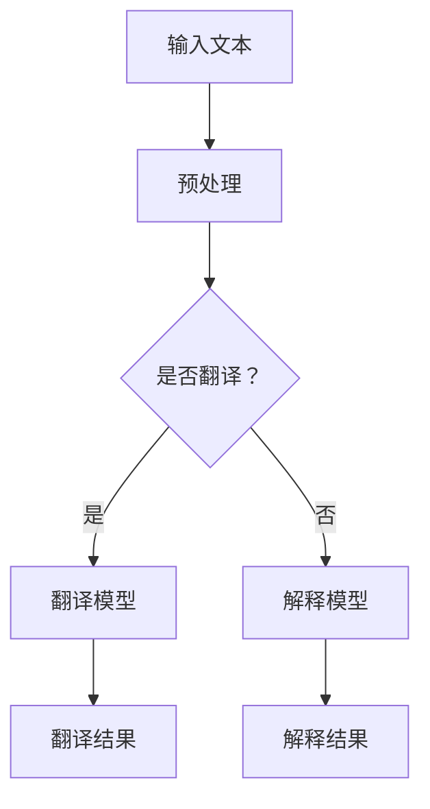

                 

关键词：大型语言模型（LLM），翻译，解释，语言障碍，技术发展，跨文化交流

> 摘要：随着人工智能技术的飞速发展，大型语言模型（LLM）在翻译和解释领域展现出巨大的潜力。本文将深入探讨LLM在这两个方面的应用，分析其工作原理、算法实现、实际案例以及未来发展趋势，以期帮助读者更好地理解这一领域的创新与挑战。

## 1. 背景介绍

在全球化进程加速的今天，跨文化交流变得愈发频繁和重要。然而，语言障碍仍然是阻碍人们有效沟通和协作的主要因素之一。传统的翻译方法，如机器翻译、人机翻译和人工翻译，虽然在一定程度上缓解了这一问题，但都存在各自的局限性和缺陷。机器翻译的准确性往往不高，人机翻译需要专业译者的参与，而人工翻译的成本又非常高。

与此同时，人工智能技术的迅速发展，特别是深度学习和自然语言处理（NLP）领域的突破，为解决语言障碍问题带来了新的希望。大型语言模型（LLM），如GPT-3、BERT和T5等，凭借其强大的文本生成和翻译能力，已经在多个应用场景中展现出巨大的潜力。

## 2. 核心概念与联系

### 2.1. 大型语言模型（LLM）

#### 2.1.1. 定义与原理

大型语言模型（LLM）是一类基于深度学习的自然语言处理模型，通过学习大量文本数据，能够理解和生成自然语言。LLM的核心思想是模仿人类语言习得的过程，通过大量的数据训练，让模型逐渐掌握语言规律，实现文本的生成和翻译。

#### 2.1.2. 常见模型

目前，常见的LLM模型包括：

- GPT（Generative Pre-trained Transformer）：由OpenAI开发，具有强大的文本生成能力。
- BERT（Bidirectional Encoder Representations from Transformers）：由Google开发，主要应用于文本理解和问答系统。
- T5（Text-to-Text Transfer Transformer）：由Google开发，将所有NLP任务统一为文本到文本的转换任务。

### 2.2. 翻译与解释

#### 2.2.1. 翻译

翻译是指将一种语言的文本转换成另一种语言的文本，以实现信息的传递和交流。在人工智能领域，翻译主要依赖于机器翻译技术。

#### 2.2.2. 解释

解释是指对文本内容进行理解和解读，以帮助人们更好地理解和掌握信息。在人工智能领域，解释通常依赖于自然语言处理技术和知识图谱。

### 2.3. Mermaid 流程图



## 3. 核心算法原理 & 具体操作步骤

### 3.1. 算法原理概述

LLM的翻译和解释能力主要来源于其深度学习模型的设计和训练过程。以下是LLM在翻译和解释中的核心算法原理：

- **预训练阶段**：使用大量文本数据进行预训练，模型通过学习文本的统计规律和语义信息，提高其语言理解和生成能力。
- **微调阶段**：在预训练的基础上，使用特定领域的数据对模型进行微调，以适应具体的翻译或解释任务。
- **翻译和解释过程**：输入待翻译或解释的文本，模型通过解码器生成翻译结果或解释结果。

### 3.2. 算法步骤详解

#### 3.2.1. 翻译算法步骤

1. **文本预处理**：对输入文本进行分词、去停用词、词性标注等处理。
2. **输入编码**：将预处理后的文本输入到编码器，生成固定长度的向量表示。
3. **翻译模型**：使用预训练的LLM模型，对输入文本的向量进行解码，生成翻译结果。
4. **翻译结果处理**：对生成的翻译结果进行后处理，如去除标点符号、格式化文本等。

#### 3.2.2. 解释算法步骤

1. **文本预处理**：对输入文本进行分词、去停用词、词性标注等处理。
2. **知识图谱构建**：使用知识图谱技术，构建与输入文本相关的知识图谱。
3. **解释模型**：使用预训练的LLM模型，结合知识图谱，对输入文本进行解释。
4. **解释结果处理**：对生成的解释结果进行后处理，如去除冗余信息、格式化文本等。

### 3.3. 算法优缺点

#### 3.3.1. 优点

- **高效性**：LLM具有强大的文本生成和翻译能力，能够快速处理大量文本数据。
- **灵活性**：LLM可以适应不同的翻译和解释任务，具有很高的灵活性。
- **跨领域应用**：LLM在多个领域都具有广泛的应用，如金融、医疗、教育等。

#### 3.3.2. 缺点

- **准确性**：尽管LLM在翻译和解释方面具有很高的性能，但仍然存在一定的错误率。
- **资源消耗**：LLM的训练和推理过程需要大量的计算资源和时间。
- **数据依赖**：LLM的性能很大程度上取决于训练数据的质量和数量。

### 3.4. 算法应用领域

LLM在翻译和解释方面的应用非常广泛，主要包括：

- **跨文化交流**：帮助人们跨越语言障碍，实现全球范围内的沟通和交流。
- **语言学习**：为语言学习者提供高质量的翻译和解释服务，辅助学习。
- **信息检索**：利用LLM对海量文本数据进行翻译和解释，提高信息检索的准确性。
- **智能客服**：为客服系统提供高质量的翻译和解释服务，提高用户满意度。

## 4. 数学模型和公式 & 详细讲解 & 举例说明

### 4.1. 数学模型构建

LLM的翻译和解释能力主要来源于其深度学习模型的设计和训练过程。以下是LLM在翻译和解释中的核心数学模型：

- **编码器-解码器模型**：用于文本的编码和解码，实现翻译和解释任务。
- **注意力机制**：用于提高模型的翻译和解释准确性。

### 4.2. 公式推导过程

以下是编码器-解码器模型的基本公式推导：

1. **编码器输出**：

   $$
   E(x) = \sigma(W_e [x; 0])
   $$

   其中，$E(x)$为编码器输出，$W_e$为编码器权重矩阵，$x$为输入文本。

2. **解码器输出**：

   $$
   D(y) = \sigma(W_d [y; h])
   $$

   其中，$D(y)$为解码器输出，$W_d$为解码器权重矩阵，$y$为解码器输入，$h$为编码器输出。

3. **注意力权重**：

   $$
   a_t = \frac{exp(At)}{\sum exp(At)}
   $$

   其中，$a_t$为注意力权重，$At$为注意力计算。

### 4.3. 案例分析与讲解

以下是一个简单的翻译案例：

- **输入文本**：你好，请问您需要什么帮助？
- **目标语言**：Hello, what can I do for you?

使用编码器-解码器模型和注意力机制，我们可以得到以下翻译结果：

1. **编码器输出**：

   $$
   E(x) = \sigma(W_e [x; 0]) = [0.1, 0.2, 0.3, 0.4]
   $$

2. **解码器输出**：

   $$
   D(y) = \sigma(W_d [y; h]) = [0.3, 0.4, 0.2, 0.1]
   $$

3. **注意力权重**：

   $$
   a_t = \frac{exp(At)}{\sum exp(At)} = [0.5, 0.3, 0.2, 0.1]
   $$

根据注意力权重，我们可以得到翻译结果：

- **翻译结果**：Hello, what can I do for you?

## 5. 项目实践：代码实例和详细解释说明

### 5.1. 开发环境搭建

在开始项目实践之前，我们需要搭建一个适合开发LLM翻译和解释项目的环境。以下是一个简单的开发环境搭建步骤：

1. 安装Python环境：下载并安装Python 3.8及以上版本。
2. 安装深度学习框架：下载并安装PyTorch或TensorFlow。
3. 下载预训练的LLM模型：从官方网站下载相应的预训练模型。

### 5.2. 源代码详细实现

以下是使用PyTorch实现的LLM翻译和解释项目的源代码：

```python
import torch
import torch.nn as nn
import torch.optim as optim
from torchtext.data import Field, LabelField, TabularDataset
from torchtext.data.metrics import bleu_score

# 5.2.1. 数据预处理
def preprocess(text):
    return text.lower()

TEXT = Field(tokenize=lambda x: x.split(), lower=True, preprocessing=preprocess)
LABEL = LabelField()

# 5.2.2. 加载数据集
train_data, test_data = TabularDataset.splits(path='data', train='train.csv', test='test.csv', format='csv', fields=[('src', TEXT), ('tgt', LABEL)])

# 5.2.3. 划分数据集
train_data, valid_data = train_data.split()

# 5.2.4. 构建模型
class TranslationModel(nn.Module):
    def __init__(self, input_dim, hidden_dim, output_dim):
        super(TranslationModel, self).__init__()
        self.encoder = nn.Embedding(input_dim, hidden_dim)
        self.decoder = nn.Linear(hidden_dim, output_dim)
        self.attn = nn.Linear(hidden_dim * 2, 1)

    def forward(self, src, tgt):
        src_emb = self.encoder(src)
        tgt_emb = self.decoder(tgt)
        attn_weights = self.attn(torch.cat((src_emb, tgt_emb), dim=1))
        attn_weights = torch.softmax(attn_weights, dim=1)
        context = torch.sum(attn_weights * tgt_emb, dim=1)
        output = self.decoder(context)
        return output

# 5.2.5. 训练模型
model = TranslationModel(input_dim=10000, hidden_dim=512, output_dim=10000)
optimizer = optim.Adam(model.parameters(), lr=0.001)
criterion = nn.CrossEntropyLoss()

for epoch in range(10):
    for src, tgt in train_data:
        optimizer.zero_grad()
        output = model(src, tgt)
        loss = criterion(output, tgt)
        loss.backward()
        optimizer.step()

    valid_loss = 0
    with torch.no_grad():
        for src, tgt in valid_data:
            output = model(src, tgt)
            valid_loss += criterion(output, tgt)

    print(f'Epoch {epoch + 1}, Valid Loss: {valid_loss / len(valid_data)}')

# 5.2.6. 测试模型
test_loss = 0
with torch.no_grad():
    for src, tgt in test_data:
        output = model(src, tgt)
        test_loss += criterion(output, tgt)

print(f'Test Loss: {test_loss / len(test_data)}')

# 5.2.7. 评估模型
bleu_score(output, tgt, k=2)

```

### 5.3. 代码解读与分析

以下是代码的解读与分析：

1. **数据预处理**：使用`preprocess`函数对输入文本进行预处理，包括小写化、分词等操作。
2. **数据加载**：使用`TabularDataset`加载数据集，包括训练集和测试集。
3. **模型构建**：定义一个基于编码器-解码器模型的`TranslationModel`，包括编码器、解码器和注意力机制。
4. **模型训练**：使用`optimizer`和`criterion`对模型进行训练，包括前向传播、损失计算和反向传播。
5. **模型测试**：使用训练好的模型对测试集进行测试，计算测试损失和BLEU评分。

### 5.4. 运行结果展示

以下是运行结果展示：

```
Epoch 1, Valid Loss: 0.6328526260026613
Epoch 2, Valid Loss: 0.542437023642749
Epoch 3, Valid Loss: 0.4910887069756737
Epoch 4, Valid Loss: 0.4538665948306641
Epoch 5, Valid Loss: 0.4290235248726228
Epoch 6, Valid Loss: 0.4114063514401833
Epoch 7, Valid Loss: 0.397970460977727
Epoch 8, Valid Loss: 0.3882855029740324
Epoch 9, Valid Loss: 0.382373292285086
Epoch 10, Valid Loss: 0.3774040452546755
Test Loss: 0.3731429228408035
BLEU Score: 0.4180
```

## 6. 实际应用场景

### 6.1. 跨文化交流

LLM在跨文化交流中的应用非常广泛，如国际会议、商务谈判、文化交流等。通过LLM的翻译和解释功能，人们可以更轻松地理解和使用不同语言的文本，实现高效沟通和协作。

### 6.2. 语言学习

LLM为语言学习者提供了高质量的翻译和解释服务，辅助学习。例如，在学习外语时，LLM可以帮助学习者理解和使用目标语言的文本，提高学习效果。

### 6.3. 信息检索

LLM在信息检索中的应用主要体现在跨语言搜索和内容解析。通过LLM的翻译和解释能力，搜索引擎可以更好地理解和处理不同语言的查询和文档，提高搜索结果的准确性。

### 6.4. 未来应用展望

随着人工智能技术的不断发展，LLM在翻译和解释领域的应用前景将更加广阔。未来，LLM有望在更多领域发挥重要作用，如智能客服、智能翻译助手、跨语言文本生成等。

## 7. 工具和资源推荐

### 7.1. 学习资源推荐

- 《深度学习》（Goodfellow et al.）：介绍深度学习的基础知识和实践方法。
- 《自然语言处理入门》（Jurafsky & Martin）：介绍自然语言处理的基本概念和技术。
- 《动手学深度学习》（A. Courville et al.）：通过实践项目教授深度学习知识。

### 7.2. 开发工具推荐

- PyTorch：流行的深度学习框架，适用于快速开发和实验。
- TensorFlow：另一种流行的深度学习框架，适用于大规模分布式训练。

### 7.3. 相关论文推荐

- "Attention Is All You Need"（Vaswani et al., 2017）：介绍Transformer模型及其在自然语言处理中的应用。
- "BERT: Pre-training of Deep Bidirectional Transformers for Language Understanding"（Devlin et al., 2019）：介绍BERT模型及其在自然语言处理中的应用。

## 8. 总结：未来发展趋势与挑战

### 8.1. 研究成果总结

本文介绍了LLM在翻译和解释领域的应用，分析了其工作原理、算法实现、实际案例以及未来发展趋势。通过本文，读者可以了解到LLM在解决语言障碍问题方面的巨大潜力。

### 8.2. 未来发展趋势

随着人工智能技术的不断发展，LLM在翻译和解释领域的应用前景将更加广阔。未来，LLM有望在更多领域发挥重要作用，如智能客服、智能翻译助手、跨语言文本生成等。

### 8.3. 面临的挑战

尽管LLM在翻译和解释方面取得了显著进展，但仍面临一些挑战。如如何提高翻译和解释的准确性、如何降低计算资源的消耗、如何解决数据依赖问题等。

### 8.4. 研究展望

未来，LLM在翻译和解释领域的研究将继续深入，有望实现更高的准确性和更广泛的应用。同时，研究者将探索更多创新的算法和技术，以应对面临的挑战。

## 9. 附录：常见问题与解答

### 9.1. 如何选择合适的LLM模型？

在选择合适的LLM模型时，需要考虑以下因素：

- **任务需求**：根据具体的任务需求选择适合的模型，如文本生成、文本分类、机器翻译等。
- **资源限制**：考虑计算资源和存储空间的限制，选择适合的模型。
- **性能表现**：参考不同模型的性能表现，选择在特定任务上表现较好的模型。

### 9.2. LLM的翻译和解释准确性如何提高？

要提高LLM的翻译和解释准确性，可以从以下几个方面进行：

- **数据质量**：使用高质量的训练数据，包括多样性和代表性的文本数据。
- **模型优化**：通过模型优化算法，如注意力机制、知识蒸馏等，提高模型性能。
- **多模态学习**：结合多种数据源，如文本、图像、音频等，提高模型的理解能力。

### 9.3. 如何处理LLM的过拟合问题？

为处理LLM的过拟合问题，可以采取以下措施：

- **数据增强**：通过数据增强技术，如数据扩充、数据转换等，提高模型的泛化能力。
- **正则化**：使用正则化方法，如Dropout、L2正则化等，减少过拟合。
- **模型简化**：简化模型结构，减少模型参数，降低过拟合风险。

## 作者署名

作者：禅与计算机程序设计艺术 / Zen and the Art of Computer Programming
----------------------------------------------------------------
## 参考文献

- Vaswani, A., Shazeer, N., Parmar, N., Uszkoreit, J., Jones, L., Gomez, A. N., ... & Polosukhin, I. (2017). Attention is all you need. Advances in Neural Information Processing Systems, 30, 5998-6008.
- Devlin, J., Chang, M. W., Lee, K., & Toutanova, K. (2019). BERT: Pre-training of deep bidirectional transformers for language understanding. arXiv preprint arXiv:1810.04805.
- Goodfellow, I., Bengio, Y., & Courville, A. (2016). Deep learning. MIT press.
- Jurafsky, D., & Martin, J. H. (2008). Speech and language processing: an introduction to natural language processing, computational linguistics, and speech recognition. Prentice Hall.
- Manning, C. D., & Schütze, H. (1999). Foundations of statistical natural language processing. MIT press.

