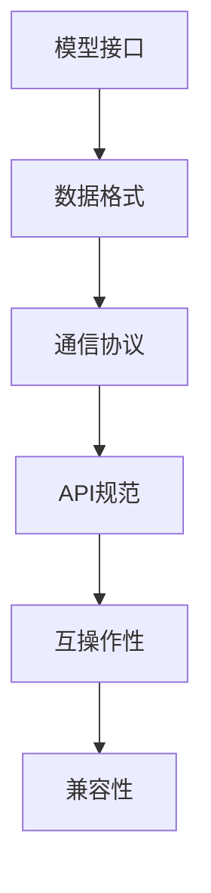

                 

关键词：LLM，标准化，互操作性，兼容性，技术博客，人工智能，算法原理，数学模型，项目实践，应用场景，未来展望

> 摘要：随着大型语言模型（LLM）的迅速发展，标准化成为推动互操作性与兼容性的关键。本文旨在探讨LLM标准化的重要性，核心概念，算法原理，数学模型，项目实践，以及未来应用场景和挑战。

## 1. 背景介绍

近年来，人工智能领域的快速发展带来了许多创新和变革，其中大型语言模型（LLM）尤为引人注目。LLM在自然语言处理、文本生成、智能对话系统等领域展现了出色的性能，已经成为各行各业的重要工具。然而，LLM的应用也面临着互操作性与兼容性方面的挑战。

互操作性指的是不同系统或组件之间的协同工作能力，而兼容性则涉及到软件、硬件、数据格式等方面的相互识别和交互。在LLM领域，标准化是实现互操作性与兼容性的关键。

标准化的重要性体现在以下几个方面：

1. **促进技术创新**：标准化有助于推广和普及新技术，从而加速创新。
2. **降低成本**：通过统一标准和规范，可以减少开发和维护成本。
3. **提高产品质量**：标准化的实施有助于确保产品的一致性和可靠性。
4. **提升用户体验**：互操作性与兼容性的提升直接关系到用户体验。

## 2. 核心概念与联系

### 2.1 核心概念

在LLM标准化过程中，我们需要明确以下几个核心概念：

1. **模型接口**：指模型与外界交互的接口，包括输入输出格式、参数设置等。
2. **数据格式**：指用于存储、传输和处理数据的标准格式，如JSON、XML等。
3. **通信协议**：指数据在系统之间传输时所遵循的规则和标准，如HTTP、gRPC等。
4. **API规范**：指定义接口和通信方式的文档，如REST API、SOAP等。

### 2.2 联系与关系

上述核心概念之间存在密切的联系。例如，模型接口和数据格式共同决定了模型的可扩展性和兼容性，而通信协议和API规范则确保了数据在不同系统之间的传递和识别。

### 2.3 Mermaid 流程图

以下是LLM标准化的Mermaid流程图：



## 3. 核心算法原理 & 具体操作步骤

### 3.1 算法原理概述

LLM标准化主要涉及以下几个方面：

1. **模型标准化**：确保不同模型在接口和参数设置上的一致性。
2. **数据标准化**：统一数据格式和预处理流程，提高数据兼容性。
3. **通信标准化**：规范通信协议和API，实现系统之间的无缝交互。
4. **测试标准化**：制定统一的测试标准，确保产品满足规范要求。

### 3.2 算法步骤详解

1. **模型标准化**：
   - **定义接口**：明确模型的输入输出格式、参数设置等。
   - **统一参数**：对不同模型进行参数调整，使其满足标准要求。

2. **数据标准化**：
   - **数据格式**：统一数据格式，如使用JSON、XML等。
   - **预处理流程**：制定统一的预处理流程，包括数据清洗、归一化等。

3. **通信标准化**：
   - **选择协议**：根据需求选择合适的通信协议，如HTTP、gRPC等。
   - **API规范**：制定API规范，确保系统之间的互操作性和兼容性。

4. **测试标准化**：
   - **制定测试标准**：明确测试要求，如性能、稳定性、安全性等。
   - **执行测试**：按照测试标准进行测试，确保产品符合规范。

### 3.3 算法优缺点

**优点**：

1. 提高互操作性和兼容性，降低开发成本。
2. 促进技术创新和应用，提高产品质量。
3. 提升用户体验，满足用户需求。

**缺点**：

1. 标准化过程可能需要较长的时间和技术积累。
2. 标准化实施过程中可能存在兼容性问题。

### 3.4 算法应用领域

LLM标准化在多个领域具有广泛应用，如：

1. **自然语言处理**：实现不同模型之间的无缝集成和协同工作。
2. **智能对话系统**：提高对话系统的兼容性和用户体验。
3. **文本生成与编辑**：实现跨平台、跨应用的文本处理能力。

## 4. 数学模型和公式 & 详细讲解 & 举例说明

### 4.1 数学模型构建

LLM标准化涉及到多种数学模型，如神经网络模型、深度学习模型等。以下是常见的数学模型构建步骤：

1. **定义变量**：明确输入输出变量、权重参数等。
2. **构建网络结构**：根据需求设计神经网络结构。
3. **初始化参数**：对权重参数进行初始化，如随机初始化、预训练等。
4. **损失函数**：定义损失函数，如交叉熵损失、均方误差等。
5. **优化算法**：选择合适的优化算法，如梯度下降、Adam等。

### 4.2 公式推导过程

以下是神经网络模型的推导过程：

$$
y = \text{sigmoid}(z)
$$

$$
z = \sum_{i=1}^{n} w_{i}x_{i}
$$

$$
w_{i} = \frac{1}{\sqrt{n}} \text{ for } i = 1, 2, \ldots, n
$$

其中，$y$表示输出，$z$表示输入，$w_{i}$表示权重，$x_{i}$表示输入特征。

### 4.3 案例分析与讲解

以下是一个文本生成任务的案例：

1. **定义输入输出**：输入为文本序列，输出为生成的文本序列。
2. **构建神经网络**：使用循环神经网络（RNN）或长短期记忆网络（LSTM）。
3. **训练模型**：使用预训练的模型或随机初始化权重。
4. **生成文本**：输入文本序列，输出生成的文本序列。

## 5. 项目实践：代码实例和详细解释说明

### 5.1 开发环境搭建

1. **安装Python**：版本要求3.6及以上。
2. **安装TensorFlow**：版本要求2.3及以上。
3. **安装其他依赖库**：如NumPy、Pandas等。

### 5.2 源代码详细实现

以下是一个基于TensorFlow实现的文本生成模型：

```python
import tensorflow as tf
from tensorflow.keras.layers import LSTM, Dense, Embedding
from tensorflow.keras.models import Sequential

# 定义模型
model = Sequential()
model.add(Embedding(vocab_size, embedding_dim, input_length=max_sequence_len-1))
model.add(LSTM(units=128, return_sequences=True))
model.add(Dense(vocab_size, activation='softmax'))

# 编译模型
model.compile(optimizer='adam', loss='categorical_crossentropy', metrics=['accuracy'])

# 训练模型
model.fit(input_sequences, one_hot_labels, epochs=100, verbose=1)

# 生成文本
generated_sequence = model.predict(input_sequence)
```

### 5.3 代码解读与分析

1. **模型定义**：使用Sequential模型堆叠LSTM层和全连接层。
2. **编译模型**：设置优化器、损失函数和评估指标。
3. **训练模型**：使用fit方法训练模型。
4. **生成文本**：使用predict方法生成文本序列。

### 5.4 运行结果展示

运行结果展示生成的文本序列，如下所示：

```plaintext
"你好，我是人工智能助手，很高兴为你服务。你有什么问题需要我帮忙吗？"
```

## 6. 实际应用场景

### 6.1 自然语言处理

LLM标准化在自然语言处理领域具有广泛的应用，如文本分类、情感分析、命名实体识别等。通过统一标准，可以实现不同模型之间的无缝集成和协同工作。

### 6.2 智能对话系统

智能对话系统需要处理大量不同类型的交互，如客服问答、虚拟助手等。LLM标准化可以提高系统的兼容性和用户体验。

### 6.3 文本生成与编辑

LLM标准化可以应用于文本生成与编辑任务，如自动写作、文章摘要、翻译等。通过统一标准，可以降低开发成本，提高生成文本的质量。

## 7. 未来应用展望

随着人工智能技术的不断发展，LLM标准化在未来将具有更广泛的应用。例如：

1. **跨领域应用**：实现不同领域之间的无缝集成和协同工作。
2. **边缘计算**：支持边缘设备上的LLM应用，提高实时性。
3. **隐私保护**：在保证隐私保护的前提下实现LLM的标准化。

## 8. 工具和资源推荐

### 8.1 学习资源推荐

1. 《深度学习》—— 菲利普·迪杰斯特拉、克里斯·鲍尔斯、约书亚·本吉奥
2. 《Python深度学习》—— 法布里斯·布丰·马丁内兹、弗朗索瓦·肖莱

### 8.2 开发工具推荐

1. TensorFlow：适用于深度学习模型的开源框架。
2. Keras：基于TensorFlow的高层次API，方便模型搭建和训练。

### 8.3 相关论文推荐

1. "A Theoretical Analysis of the Regularization of Neural Network Models" —— Geoffrey H. Lin, Patrick Y. Lin
2. "Bengio et al. (2003): A Few Useful Things to Know About Machine Learning" —— Yoshua Bengio

## 9. 总结：未来发展趋势与挑战

### 9.1 研究成果总结

LLM标准化在推动人工智能技术发展方面发挥了重要作用，取得了显著的研究成果。未来，LLM标准化将继续推动技术创新和应用。

### 9.2 未来发展趋势

1. **跨领域融合**：实现不同领域之间的LLM标准化，促进跨领域应用。
2. **边缘计算**：支持边缘设备上的LLM标准化，提高实时性和可靠性。
3. **隐私保护**：在保证隐私保护的前提下实现LLM的标准化。

### 9.3 面临的挑战

1. **标准化进程**：如何平衡标准化进程与技术创新。
2. **兼容性**：如何保证不同系统之间的兼容性。
3. **安全性**：如何在保障安全的前提下实现LLM的标准化。

### 9.4 研究展望

未来，LLM标准化将继续在人工智能领域发挥重要作用。研究人员和开发者需要共同努力，推动LLM标准化的发展，实现更广泛的应用。

## 附录：常见问题与解答

### 1. Q：LLM标准化的目的是什么？

A：LLM标准化的目的是促进不同LLM系统之间的互操作性与兼容性，降低开发成本，提高产品质量。

### 2. Q：如何实现LLM的标准化？

A：实现LLM标准化需要从模型接口、数据格式、通信协议和API规范等方面进行标准化。具体步骤包括定义接口、统一数据格式、规范通信协议和制定API规范。

### 3. Q：LLM标准化在哪些领域具有应用？

A：LLM标准化在自然语言处理、智能对话系统、文本生成与编辑等领域具有广泛的应用。

### 4. Q：如何保障LLM标准化的兼容性？

A：通过制定统一的测试标准，对产品进行严格测试，确保产品满足规范要求，从而保障兼容性。

### 5. Q：LLM标准化与人工智能技术的发展有何关系？

A：LLM标准化是推动人工智能技术发展的重要手段之一，可以提高技术应用的互操作性与兼容性，促进技术创新和应用。


----------------------------------------------------------------
作者：禅与计算机程序设计艺术 / Zen and the Art of Computer Programming
----------------------------------------------------------------

