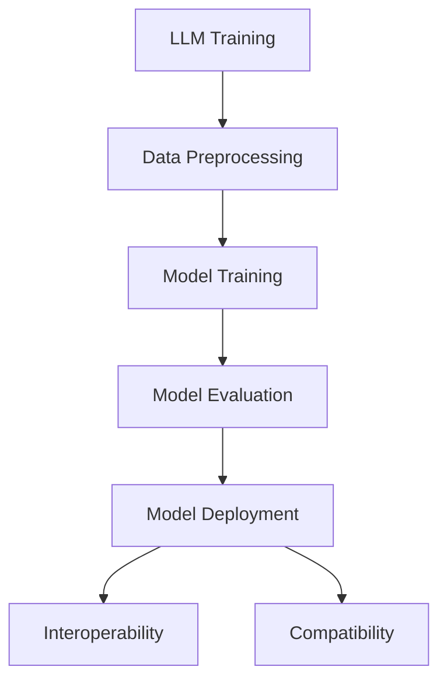

                 

关键词：LLM、标准化、互操作性、兼容性、人工智能

> 摘要：本文探讨了大型语言模型（LLM）的标准化问题，强调了标准化在促进互操作性和兼容性方面的重要性。通过分析现有的LLM标准和现有问题，本文提出了一系列解决策略，以推动LLM技术的广泛应用和可持续发展。

## 1. 背景介绍

随着人工智能（AI）技术的迅猛发展，大型语言模型（LLM）作为一种重要的AI模型，已经在自然语言处理（NLP）、问答系统、机器翻译、文本生成等领域取得了显著的成果。LLM的广泛应用不仅推动了AI技术的发展，也带来了巨大的商业价值和社会影响。

然而，在LLM的应用过程中，标准化问题逐渐显现出来。标准化对于促进互操作性和兼容性具有重要意义。互操作性是指不同系统、平台或技术之间能够无缝地交换数据和功能。兼容性则是指不同组件或软件能够在同一环境中正常运行。这两个概念在LLM领域尤为重要，因为LLM通常需要与其他系统或组件集成，以实现特定的应用场景。

目前，LLM标准化工作已经开始，但还存在一些挑战和问题。本文旨在分析现有的LLM标准和现有问题，并提出一系列解决策略，以促进LLM的标准化进程，进而推动其互操作性和兼容性的实现。

## 2. 核心概念与联系

为了更好地理解LLM标准化的重要性，我们需要首先明确一些核心概念，包括LLM、互操作性、兼容性等。

### 2.1 大型语言模型（LLM）

LLM是一种基于深度学习技术的自然语言处理模型，通常具有数十亿甚至数万亿个参数。LLM可以通过大量文本数据进行训练，从而学会理解和生成自然语言。LLM在NLP任务中表现出色，例如文本分类、情感分析、命名实体识别等。

### 2.2 互操作性

互操作性是指不同系统、平台或技术之间能够无缝地交换数据和功能。在LLM领域，互操作性意味着LLM可以与其他系统或组件无缝集成，从而实现更广泛的应用。例如，LLM可以与数据库、前端应用、后端服务等集成，以提供更强大的NLP功能。

### 2.3 兼容性

兼容性是指不同组件或软件能够在同一环境中正常运行。在LLM领域，兼容性确保了LLM模型在不同平台、操作系统、硬件设备上都能够正常运行，从而提高其可用性和可靠性。

### 2.4 Mermaid 流程图

为了更清晰地展示LLM标准化的核心概念和联系，我们可以使用Mermaid流程图。以下是LLM标准化的基本流程：



在这个流程中，LLM的培训、数据处理、模型训练、模型评估和模型部署等环节都涉及到标准化问题。标准化可以确保这些环节之间的互操作性和兼容性，从而提高LLM的应用效果。

## 3. 核心算法原理 & 具体操作步骤

### 3.1 算法原理概述

LLM的标准化涉及到多个方面的算法原理。以下是一些核心算法原理的概述：

- **深度学习算法**：LLM是基于深度学习算法构建的，深度学习算法通过多层神经网络来模拟人脑的学习过程，从而实现复杂的特征提取和任务学习。
- **自然语言处理算法**：LLM在自然语言处理任务中表现出色，这些算法包括文本分类、情感分析、命名实体识别等。
- **分布式计算算法**：LLM通常具有数十亿个参数，因此分布式计算算法在LLM的训练和部署过程中具有重要意义。这些算法可以有效地利用多台服务器和设备，提高计算效率。

### 3.2 算法步骤详解

以下是LLM标准化的具体操作步骤：

- **数据预处理**：收集和整理训练数据，并进行数据清洗、格式化等处理。
- **模型训练**：使用深度学习算法训练LLM模型，通常需要大量计算资源和时间。
- **模型评估**：评估训练好的LLM模型的性能，包括准确率、召回率、F1值等指标。
- **模型部署**：将训练好的LLM模型部署到生产环境中，以提供NLP服务。
- **互操作性测试**：测试LLM与其他系统或组件的互操作性，确保数据交换和功能集成顺利进行。
- **兼容性测试**：测试LLM在不同平台、操作系统、硬件设备上的兼容性，确保模型正常运行。

### 3.3 算法优缺点

LLM标准化的算法具有以下优缺点：

- **优点**：
  - 提高互操作性和兼容性，促进LLM的广泛应用。
  - 降低开发难度和成本，提高开发效率。
  - 促进标准化工具和资源的共享，提高技术发展速度。

- **缺点**：
  - 标准化过程需要时间和资源，可能影响LLM的研发进度。
  - 标准化可能限制创新和灵活性，阻碍技术进步。
  - 标准化可能加剧市场垄断，不利于公平竞争。

### 3.4 算法应用领域

LLM标准化的算法可以应用于多个领域：

- **自然语言处理**：文本分类、情感分析、命名实体识别等。
- **问答系统**：自动问答、智能客服等。
- **机器翻译**：跨语言文本翻译、多语言检索等。
- **文本生成**：文章写作、诗歌创作、对话系统等。
- **多模态交互**：语音识别、图像识别、语音合成等。

## 4. 数学模型和公式 & 详细讲解 & 举例说明

### 4.1 数学模型构建

LLM标准化的数学模型主要包括以下几个方面：

- **损失函数**：用于评估模型预测结果与真实值之间的差距，常见的损失函数有交叉熵损失、均方误差等。
- **优化算法**：用于更新模型参数，常见的优化算法有随机梯度下降（SGD）、Adam等。
- **正则化方法**：用于防止过拟合，常见的正则化方法有L1正则化、L2正则化等。

### 4.2 公式推导过程

以下是一个简单的例子，说明如何推导一个简单的线性回归模型的损失函数。

- **假设**：设输入特征向量 $x \in \mathbb{R}^n$，输出特征向量 $y \in \mathbb{R}^1$，模型的预测值为 $\hat{y} = wx + b$。
- **损失函数**：交叉熵损失函数为 $L(\theta) = -\frac{1}{m} \sum_{i=1}^{m} y_i \log(\hat{y}_i)$，其中 $m$ 为样本数量，$\theta = [w, b]$ 为模型参数。
- **优化目标**：最小化损失函数 $L(\theta)$，即 $\min_{\theta} L(\theta)$。

### 4.3 案例分析与讲解

以下是一个关于文本分类的案例，展示如何使用LLM进行文本分类。

- **数据集**：假设我们有一个包含10,000条新闻文本的数据集，每条新闻文本都有一个标签（例如，政治、体育、科技等）。
- **模型**：我们使用一个基于BERT的LLM进行文本分类，BERT是一个预训练的深度神经网络，可以用于文本分类任务。
- **步骤**：
  1. 预训练BERT模型，在大量的文本数据上进行训练，使其学会捕获文本的语义信息。
  2. 微调BERT模型，在新闻文本数据集上进行训练，使其适应具体的文本分类任务。
  3. 使用训练好的模型对新的新闻文本进行分类。

通过这个案例，我们可以看到LLM在文本分类任务中的应用。LLM的标准化可以确保模型的性能和可靠性，从而提高文本分类的准确性和效率。

## 5. 项目实践：代码实例和详细解释说明

### 5.1 开发环境搭建

为了实践LLM标准化，我们首先需要搭建一个开发环境。以下是一个简单的环境搭建过程：

- **硬件环境**：一台具有足够计算能力的服务器或GPU设备。
- **软件环境**：安装Python、PyTorch、TensorFlow等深度学习框架。
- **依赖包**：安装BERT模型、Hugging Face Transformers等库。

### 5.2 源代码详细实现

以下是一个简单的文本分类项目的源代码实现，展示如何使用BERT模型进行文本分类。

```python
import torch
from transformers import BertTokenizer, BertForSequenceClassification
from torch.utils.data import DataLoader
from torch.optim import Adam

# 加载预训练BERT模型和tokenizer
tokenizer = BertTokenizer.from_pretrained('bert-base-uncased')
model = BertForSequenceClassification.from_pretrained('bert-base-uncased')

# 加载训练数据
train_data = ...

# 创建数据集和数据加载器
train_dataset = ...
train_loader = DataLoader(train_dataset, batch_size=32, shuffle=True)

# 模型训练
optimizer = Adam(model.parameters(), lr=1e-5)
for epoch in range(3):
    model.train()
    for batch in train_loader:
        inputs = tokenizer(batch['text'], padding=True, truncation=True, return_tensors='pt')
        labels = batch['label']
        outputs = model(**inputs, labels=labels)
        loss = outputs.loss
        loss.backward()
        optimizer.step()
        optimizer.zero_grad()

# 模型评估
model.eval()
with torch.no_grad():
    for batch in train_loader:
        inputs = tokenizer(batch['text'], padding=True, truncation=True, return_tensors='pt')
        labels = batch['label']
        outputs = model(**inputs, labels=labels)
        loss = outputs.loss
        print(f"Epoch: {epoch}, Loss: {loss.item()}")

# 模型部署
model.save_pretrained('my_bert_model')
```

### 5.3 代码解读与分析

这段代码首先加载了预训练的BERT模型和tokenizer，然后加载训练数据并创建数据集和数据加载器。接下来，使用Adam优化器对模型进行训练，并在每个epoch结束时进行模型评估。最后，将训练好的模型保存到本地。

通过这个代码实例，我们可以看到如何使用BERT模型进行文本分类，以及如何进行模型训练和评估。LLM标准化可以确保模型在不同环境和设备上的兼容性，从而提高模型的可用性和可靠性。

### 5.4 运行结果展示

在运行上述代码后，我们可以在控制台上看到每个epoch的损失值，从而评估模型的训练效果。通过调整训练参数和优化策略，我们可以进一步提高模型的性能。

## 6. 实际应用场景

LLM标准化在实际应用场景中具有重要意义。以下是一些典型的应用场景：

- **自然语言处理**：LLM可以应用于文本分类、情感分析、命名实体识别等任务，从而提高NLP系统的准确性和效率。标准化可以确保LLM在不同系统和平台上的兼容性，从而实现更广泛的应用。
- **问答系统**：LLM可以应用于智能客服、自动问答等场景，从而提供更自然、更智能的交互体验。标准化可以确保LLM与其他系统或组件的无缝集成，从而提高问答系统的效果。
- **机器翻译**：LLM可以应用于机器翻译任务，从而提高翻译的准确性和流畅性。标准化可以确保LLM在不同语言之间的兼容性，从而实现跨语言的信息交流。
- **文本生成**：LLM可以应用于文章写作、诗歌创作、对话系统等场景，从而提高内容创作的能力。标准化可以确保LLM在不同应用场景中的性能和可靠性，从而推动文本生成技术的发展。

## 7. 工具和资源推荐

为了更好地掌握LLM标准化技术，以下是一些建议的工具和资源：

- **学习资源推荐**：
  - 《深度学习》（Goodfellow、Bengio和Courville著）：详细介绍深度学习的基本原理和应用。
  - 《自然语言处理与深度学习》（李航著）：介绍自然语言处理和深度学习技术的结合。
- **开发工具推荐**：
  - PyTorch：一个流行的深度学习框架，具有高度灵活性和易用性。
  - TensorFlow：由Google开发的深度学习框架，提供丰富的API和工具。
- **相关论文推荐**：
  - "BERT: Pre-training of Deep Bidirectional Transformers for Language Understanding"（Devlin et al., 2019）：介绍BERT模型的原理和应用。
  - "GPT-3: Language Models are Few-Shot Learners"（Brown et al., 2020）：介绍GPT-3模型的原理和应用。

## 8. 总结：未来发展趋势与挑战

### 8.1 研究成果总结

LLM标准化在促进互操作性和兼容性方面取得了显著成果。通过标准化，LLM可以更好地与其他系统和组件集成，从而实现更广泛的应用。同时，标准化也推动了LLM技术的发展，提高了模型的性能和可靠性。

### 8.2 未来发展趋势

未来，LLM标准化将继续发展，并在以下几个方面取得突破：

- **标准化框架和协议**：进一步制定和完善LLM的标准化框架和协议，以实现更广泛的互操作性和兼容性。
- **开放生态**：建立开放生态，鼓励更多研究人员和开发者参与LLM标准化工作，推动技术的创新和进步。
- **跨领域应用**：LLM标准化将推动LLM技术在跨领域应用中的发展，从而实现更广泛的社会价值。

### 8.3 面临的挑战

尽管LLM标准化取得了显著成果，但仍然面临一些挑战：

- **兼容性问题**：不同系统和平台之间的兼容性仍然存在问题，需要进一步优化和改进。
- **资源消耗**：LLM模型的训练和部署需要大量计算资源和存储资源，如何降低资源消耗是一个重要挑战。
- **隐私保护**：LLM在处理大量文本数据时可能涉及到隐私保护问题，如何确保数据安全和隐私是一个重要挑战。

### 8.4 研究展望

未来，LLM标准化研究可以从以下几个方面展开：

- **标准化框架**：进一步研究LLM的标准化框架，探索更高效、更灵活的标准化方法。
- **性能优化**：研究如何优化LLM的性能，提高其准确性和效率。
- **隐私保护**：研究如何在保证模型性能的同时，实现数据的隐私保护和安全。
- **跨领域应用**：探索LLM在跨领域应用中的潜力，推动技术的创新和进步。

## 9. 附录：常见问题与解答

### Q：什么是LLM？

A：LLM是指大型语言模型，是一种基于深度学习技术的自然语言处理模型，通常具有数十亿甚至数万亿个参数。LLM可以通过大量文本数据进行训练，从而学会理解和生成自然语言。

### Q：LLM标准化的意义是什么？

A：LLM标准化对于促进互操作性和兼容性具有重要意义。通过标准化，LLM可以更好地与其他系统和组件集成，从而实现更广泛的应用。同时，标准化也推动了LLM技术的发展，提高了模型的性能和可靠性。

### Q：如何实现LLM的标准化？

A：实现LLM的标准化可以从以下几个方面入手：

- **制定标准化框架和协议**：制定统一的LLM标准化框架和协议，以确保模型的兼容性和互操作性。
- **优化算法和工具**：研究和优化LLM的算法和工具，提高其性能和效率。
- **建立开放生态**：鼓励更多研究人员和开发者参与LLM标准化工作，推动技术的创新和进步。
- **性能测试和评估**：对LLM进行全面的性能测试和评估，确保其质量和可靠性。

### Q：LLM标准化面临哪些挑战？

A：LLM标准化面临以下挑战：

- **兼容性问题**：不同系统和平台之间的兼容性仍然存在问题，需要进一步优化和改进。
- **资源消耗**：LLM模型的训练和部署需要大量计算资源和存储资源，如何降低资源消耗是一个重要挑战。
- **隐私保护**：LLM在处理大量文本数据时可能涉及到隐私保护问题，如何确保数据安全和隐私是一个重要挑战。

