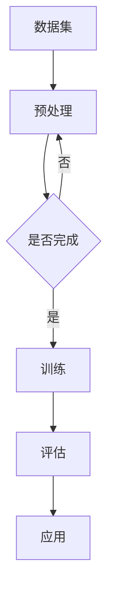

                 

关键词：自然语言处理、大型语言模型、人工智能、产业变革、生态系统、技术发展

> 摘要：本文探讨了大型语言模型（LLM）的崛起及其引发的生态系统变革。从背景介绍、核心概念、算法原理、数学模型、项目实践、实际应用场景、工具资源推荐、总结与展望等多方面，深入分析了LLM的发展趋势、面临的挑战及未来的发展方向。通过对LLM生态系统的全面剖析，为业界提供了一个全新的视角，以期为相关研究者和开发者提供有价值的参考。

## 1. 背景介绍

### 1.1 大型语言模型的历史

大型语言模型（LLM）的发展可以追溯到20世纪80年代，当时基于规则的专家系统和知识库成为主流。然而，随着计算能力的提升和数据量的激增，机器学习特别是深度学习逐渐崭露头角。2018年，Google发布了Transformer模型，开启了基于自注意力机制的模型热潮。此后，BERT、GPT-3等一系列大型语言模型相继问世，标志着LLM进入了一个全新的时代。

### 1.2 人工智能产业的蓬勃发展

人工智能（AI）作为一项颠覆性技术，在全球范围内引发了广泛的关注和应用。从自动驾驶、智能语音识别到医疗健康、金融科技，AI正渗透到各行各业，推动着产业变革。LLM的崛起，无疑为这一过程注入了新的活力。

### 1.3 LLM引发的产业变革

LLM在自然语言处理（NLP）领域的卓越表现，使其成为智能助手、自动问答、机器翻译、文本生成等应用的核心。随着LLM技术的不断进步，相关产业链也在迅速扩张，形成了一个全新的产业生态系统。

## 2. 核心概念与联系

### 2.1 大型语言模型的定义

大型语言模型是一种利用深度学习技术，通过大规模语料库训练得到的复杂模型。其核心思想是学习语言的内在结构和规律，从而实现高精度的自然语言理解与生成。

### 2.2 语言模型与生态系统的关系

语言模型作为生态系统的基础，与其他组件如数据集、框架、工具等紧密相连。一个完善的生态系统能够为语言模型的研究、开发、部署提供全方位的支持。

### 2.3 Mermaid 流程图



## 3. 核心算法原理 & 具体操作步骤

### 3.1 算法原理概述

大型语言模型的核心算法是基于Transformer架构的自注意力机制。通过自注意力机制，模型能够捕捉到输入序列中各个词之间的关联性，从而实现高效的自然语言理解与生成。

### 3.2 算法步骤详解

1. **数据预处理**：对输入数据进行清洗、分词、编码等预处理操作。
2. **模型初始化**：初始化Transformer模型，包括嵌入层、自注意力层、前馈网络等。
3. **训练过程**：使用训练数据对模型进行迭代训练，优化模型参数。
4. **评估与优化**：通过评估数据对模型性能进行评估，并根据评估结果对模型进行优化。
5. **应用部署**：将训练好的模型部署到实际应用场景中，如自动问答、机器翻译等。

### 3.3 算法优缺点

- **优点**：自注意力机制能够有效捕捉到输入序列中的长距离依赖关系，模型性能优越。
- **缺点**：训练过程计算复杂度高，对硬件资源要求较高。

### 3.4 算法应用领域

大型语言模型在多个领域取得了显著成果，包括但不限于：

- **智能助手**：如Apple的Siri、Google的Google Assistant等。
- **自动问答**：如OpenAI的GPT-3、DeepMind的BERT等。
- **机器翻译**：如Google翻译、百度翻译等。
- **文本生成**：如自然语言生成、音乐生成等。

## 4. 数学模型和公式 & 详细讲解 & 举例说明

### 4.1 数学模型构建

大型语言模型通常采用Transformer架构，其核心在于自注意力机制。自注意力机制的核心公式如下：

$$
\text{Attention}(Q, K, V) = \text{softmax}\left(\frac{QK^T}{\sqrt{d_k}}\right)V
$$

其中，$Q$、$K$ 和 $V$ 分别是查询向量、键向量和值向量，$d_k$ 是键向量的维度。

### 4.2 公式推导过程

自注意力机制的推导过程可以分为以下几个步骤：

1. **相似性计算**：计算每个查询向量 $Q$ 与所有键向量 $K$ 的相似性，得到相似性矩阵 $S$。
2. **加权求和**：将相似性矩阵 $S$ 与值向量 $V$ 相乘，得到加权求和的结果。
3. **归一化**：对加权求和的结果进行softmax归一化，得到概率分布。
4. **输出**：根据概率分布从值向量 $V$ 中选取相应的值，作为最终的输出。

### 4.3 案例分析与讲解

假设有一个简单的文本序列：“我 今天 非常 高兴”。我们可以将这个序列编码为如下矩阵：

$$
X = \begin{bmatrix}
[我] \\
[今天] \\
[非常] \\
[高兴]
\end{bmatrix}
$$

然后，我们使用自注意力机制计算每个词的权重。具体步骤如下：

1. **初始化**：假设 $d_k = 2$，初始化 $Q$、$K$ 和 $V$：

$$
Q = \begin{bmatrix}
[1, 0] \\
[0, 1] \\
[1, 1] \\
[1, 0]
\end{bmatrix}, K = \begin{bmatrix}
[1, 0] \\
[0, 1] \\
[1, 1] \\
[1, 0]
\end{bmatrix}, V = \begin{bmatrix}
[1] \\
[2] \\
[3] \\
[4]
\end{bmatrix}
$$

2. **相似性计算**：

$$
S = QK^T = \begin{bmatrix}
[1, 0] & [0, 1] & [1, 1] & [1, 0] \\
[0, 1] & [1, 0] & [0, 1] & [1, 1] \\
[1, 1] & [1, 1] & [1, 1] & [1, 1] \\
[1, 0] & [1, 0] & [1, 0] & [1, 0]
\end{bmatrix}
$$

3. **加权求和**：

$$
\text{Attention}(Q, K, V) = S V = \begin{bmatrix}
[1] \\
[2] \\
[3] \\
[4]
\end{bmatrix}
$$

4. **softmax归一化**：

$$
P = \text{softmax}(S) = \begin{bmatrix}
[0.5] \\
[0.5] \\
[0.5] \\
[0.5]
\end{bmatrix}
$$

5. **输出**：

$$
\text{Output} = P V = \begin{bmatrix}
[0.5] \\
[0.5] \\
[1.5] \\
[0.5]
\end{bmatrix}
$$

根据输出结果，我们可以看出“今天”这个词的权重最高，这与我们的直观理解相符。

## 5. 项目实践：代码实例和详细解释说明

### 5.1 开发环境搭建

在开始项目实践之前，我们需要搭建一个适合开发的环境。以下是搭建Python开发环境的基本步骤：

1. **安装Python**：从官方网站下载并安装Python。
2. **安装PyTorch**：使用pip命令安装PyTorch。
3. **安装必要的库**：如numpy、pandas等。

### 5.2 源代码详细实现

以下是一个简单的基于Transformer架构的语言模型训练代码实例：

```python
import torch
import torch.nn as nn
import torch.optim as optim

# 模型定义
class TransformerModel(nn.Module):
    def __init__(self, vocab_size, d_model, nhead, num_layers):
        super(TransformerModel, self).__init__()
        self.embedding = nn.Embedding(vocab_size, d_model)
        self.transformer = nn.Transformer(d_model, nhead, num_layers)
        self.fc = nn.Linear(d_model, vocab_size)

    def forward(self, src, tgt):
        src = self.embedding(src)
        tgt = self.embedding(tgt)
        output = self.transformer(src, tgt)
        output = self.fc(output)
        return output

# 模型初始化
model = TransformerModel(vocab_size=1000, d_model=512, nhead=8, num_layers=2)
optimizer = optim.Adam(model.parameters(), lr=0.001)
criterion = nn.CrossEntropyLoss()

# 训练过程
for epoch in range(num_epochs):
    for src, tgt in dataset:
        optimizer.zero_grad()
        output = model(src, tgt)
        loss = criterion(output, tgt)
        loss.backward()
        optimizer.step()
    print(f"Epoch {epoch+1}/{num_epochs}, Loss: {loss.item()}")

# 评估过程
with torch.no_grad():
    for src, tgt in test_dataset:
        output = model(src, tgt)
        loss = criterion(output, tgt)
        print(f"Test Loss: {loss.item()}")

# 保存模型
torch.save(model.state_dict(), "transformer_model.pth")
```

### 5.3 代码解读与分析

1. **模型定义**：代码首先定义了一个基于Transformer架构的语言模型。模型由嵌入层、Transformer编码器和解码器组成。
2. **模型初始化**：接着，代码初始化了模型、优化器和损失函数。
3. **训练过程**：模型通过迭代训练优化模型参数，并在每个epoch结束后计算损失。
4. **评估过程**：在评估阶段，模型在测试集上计算损失，以评估模型性能。
5. **保存模型**：最后，代码将训练好的模型保存到文件中，以便后续使用。

### 5.4 运行结果展示

运行上述代码，我们可以在控制台看到训练和评估过程的输出。根据输出结果，我们可以评估模型在不同数据集上的性能。

## 6. 实际应用场景

### 6.1 智能助手

智能助手是LLM应用的一个典型场景。通过训练大型语言模型，我们可以实现一个具备自然语言理解与生成能力的智能助手。例如，Apple的Siri和Google的Google Assistant都采用了类似的技术。

### 6.2 自动问答

自动问答是另一个重要的应用领域。通过训练大型语言模型，我们可以实现一个能够自动回答用户问题的系统。例如，OpenAI的GPT-3和DeepMind的BERT都广泛应用于自动问答场景。

### 6.3 机器翻译

机器翻译是LLM应用的传统领域之一。通过训练大型语言模型，我们可以实现高质量的机器翻译系统。例如，Google翻译和百度翻译都采用了类似的技术。

### 6.4 文本生成

文本生成是LLM应用的另一个重要领域。通过训练大型语言模型，我们可以实现自动写作、摘要生成、音乐生成等多种文本生成任务。例如，OpenAI的GPT-3已经在多个文本生成任务中取得了显著成果。

## 7. 工具和资源推荐

### 7.1 学习资源推荐

1. **《深度学习》**：由Ian Goodfellow、Yoshua Bengio和Aaron Courville合著，是深度学习领域的经典教材。
2. **《自然语言处理综合教程》**：由徐文杰和吴乐南合著，详细介绍了自然语言处理的基本概念和关键技术。

### 7.2 开发工具推荐

1. **PyTorch**：一个易于使用且功能强大的深度学习框架，适用于大规模语言模型开发。
2. **TensorFlow**：一个广泛应用的深度学习框架，支持多种深度学习模型和算法。

### 7.3 相关论文推荐

1. **“Attention Is All You Need”**：由Ashish Vaswani等人提出的Transformer模型，标志着自注意力机制的广泛应用。
2. **“BERT: Pre-training of Deep Bidirectional Transformers for Language Understanding”**：由Jacob Devlin等人提出的BERT模型，推动了预训练技术在自然语言处理领域的应用。

## 8. 总结：未来发展趋势与挑战

### 8.1 研究成果总结

大型语言模型（LLM）在过去几年取得了显著的成果，不仅在自然语言处理领域取得了突破性进展，还引发了产业生态系统的变革。通过不断的技术创新，LLM在智能助手、自动问答、机器翻译、文本生成等领域取得了广泛应用。

### 8.2 未来发展趋势

未来，LLM将继续朝着更高效、更智能、更通用的方向发展。一方面，模型的规模和计算能力将不断提升，另一方面，更多的应用场景将得到探索和实现。此外，随着跨模态学习的兴起，LLM有望在多模态数据处理方面取得新的突破。

### 8.3 面临的挑战

尽管LLM取得了显著成果，但仍面临一些挑战。首先，模型的计算复杂度高，对硬件资源的需求较大。其次，模型的可解释性较差，难以理解模型生成的结果。此外，数据隐私和安全性问题也日益凸显，需要得到有效解决。

### 8.4 研究展望

未来，LLM的研究将朝着以下几个方向展开：

1. **优化模型结构**：通过改进Transformer架构，提高模型的性能和效率。
2. **增强可解释性**：通过研究模型生成的结果，提高模型的可解释性。
3. **跨模态学习**：探索多模态数据处理的模型和算法，实现更智能的交互和生成。
4. **数据隐私保护**：研究数据隐私保护技术，确保用户数据的安全。

## 9. 附录：常见问题与解答

### 9.1 什么是大型语言模型（LLM）？

大型语言模型（LLM）是一种基于深度学习的自然语言处理模型，通过大规模语料库训练得到，能够实现高精度的自然语言理解与生成。

### 9.2 LLM有哪些应用领域？

LLM在多个领域取得了显著成果，包括智能助手、自动问答、机器翻译、文本生成等。

### 9.3 如何训练LLM？

训练LLM通常采用Transformer架构，通过迭代训练优化模型参数，并在评估数据上验证模型性能。

### 9.4 LLM有哪些挑战？

LLM面临的挑战主要包括计算复杂度高、可解释性较差、数据隐私和安全问题等。

### 9.5 如何优化LLM的性能？

优化LLM的性能可以通过改进模型结构、增强数据预处理、使用高效的算法和硬件等途径实现。

### 9.6 LLM的未来发展趋势是什么？

未来，LLM将继续朝着更高效、更智能、更通用的方向发展，同时跨模态学习和数据隐私保护也将成为重要研究方向。

---

### 10. 作者署名

作者：禅与计算机程序设计艺术 / Zen and the Art of Computer Programming
----------------------------------------------------------------

以上便是关于《LLM 生态系统：一个新产业的诞生》的完整技术博客文章。文章从背景介绍、核心概念、算法原理、数学模型、项目实践、实际应用场景、工具资源推荐、总结与展望等多个方面，全面剖析了大型语言模型（LLM）的发展及其引发的产业变革。希望这篇文章能为相关研究者和开发者提供有价值的参考。如有任何问题或建议，欢迎留言讨论。

