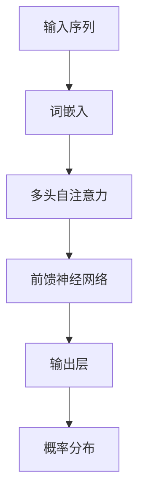

                 

关键词：大型语言模型（LLM），生态发展，计算硬件，人工智能

> 摘要：本文探讨了大型语言模型（LLM）的未来发展趋势，分析了其在计算硬件生态中的重要性。文章通过回顾LLM的历史，深入探讨了其核心算法原理，并展示了其在实际应用中的表现。同时，本文还展望了LLM在未来的应用前景，提出了其在发展中面临的挑战，并对未来的研究进行了展望。

## 1. 背景介绍

大型语言模型（Large Language Model，简称LLM）是人工智能领域的一种重要模型。自2018年GPT-1问世以来，LLM在自然语言处理（NLP）领域取得了显著的进展。随着计算能力的提升和大数据的积累，LLM的规模和性能不断突破，为人工智能的发展提供了新的动力。

### 1.1 LLM的发展历程

LLM的发展历程可以分为以下几个阶段：

- **初期探索**（2018年以前）：这一阶段主要是基于规则和统计方法的NLP研究，代表性工作包括基于统计的语法分析、词向量和基于模板的问答系统等。
- **快速突破**（2018-2020年）：这一阶段，随着深度学习技术的发展，基于Transformer结构的LLM开始涌现，代表性的工作有GPT-1、BERT、RoBERTa等。
- **大规模发展**（2020年至今）：这一阶段，LLM的规模和性能得到了显著提升，代表性的工作有GPT-3、ChatGPT等。

### 1.2 LLM的应用领域

LLM在多个领域都取得了显著的成果，主要包括：

- **自然语言处理**：如文本分类、情感分析、机器翻译等。
- **问答系统**：如智能客服、智能助手等。
- **文本生成**：如文章写作、故事生成等。
- **语音识别**：结合语音识别技术，实现语音到文本的转换。

## 2. 核心概念与联系

### 2.1 语言模型

语言模型是NLP的核心概念之一，它通过学习大量的文本数据，预测下一个词的概率分布。在LLM中，语言模型的核心是Transformer结构，它通过自注意力机制（Self-Attention）实现对文本的全局信息整合。



### 2.2 计算硬件

计算硬件是支撑LLM发展的重要基础。随着LLM规模的扩大，对计算能力的需求也不断提升。目前，LLM主要依赖于GPU、TPU等高性能计算硬件。GPU具有并行计算能力，适用于大规模矩阵运算；TPU是谷歌专为机器学习设计的硬件，具有更高的运算效率。

### 2.3 数据

数据是LLM训练的核心，其质量直接影响到LLM的性能。在LLM的发展过程中，数据的质量和规模不断提升，为LLM的性能突破提供了基础。

## 3. 核心算法原理 & 具体操作步骤

### 3.1 算法原理概述

LLM的核心算法是Transformer结构，它由自注意力机制（Self-Attention）和前馈神经网络（Feedforward Neural Network）组成。自注意力机制通过计算输入序列中每个词与其他词的相关性，实现对全局信息的整合；前馈神经网络则用于进一步提取特征。

### 3.2 算法步骤详解

- **输入序列**：将输入文本序列转换为词嵌入（Word Embedding）。
- **多头自注意力**：计算输入序列中每个词与其他词的相关性，得到加权表示。
- **前馈神经网络**：对加权表示进行非线性变换，提取特征。
- **输出层**：将特征映射到输出层，预测下一个词的概率分布。

### 3.3 算法优缺点

**优点**：

- **全局信息整合**：自注意力机制使LLM能够捕捉到输入序列中任意词之间的相关性，实现全局信息整合。
- **并行计算**：Transformer结构适合并行计算，提高了训练效率。
- **强大表达能力**：通过多层叠加，LLM具有强大的表达能力，能够处理复杂的语言现象。

**缺点**：

- **计算复杂度**：随着序列长度的增加，自注意力机制的计算复杂度呈指数级增长，对硬件性能要求较高。
- **训练难度**：LLM的训练需要大量数据和计算资源，训练过程较为复杂。

### 3.4 算法应用领域

LLM在多个领域都有广泛应用，主要包括：

- **自然语言处理**：如文本分类、情感分析、机器翻译等。
- **问答系统**：如智能客服、智能助手等。
- **文本生成**：如文章写作、故事生成等。
- **语音识别**：结合语音识别技术，实现语音到文本的转换。

## 4. 数学模型和公式 & 详细讲解 & 举例说明

### 4.1 数学模型构建

LLM的数学模型主要包括词嵌入、自注意力机制和前馈神经网络。词嵌入将输入文本序列转换为向量表示；自注意力机制计算输入序列中每个词与其他词的相关性；前馈神经网络对加权表示进行非线性变换。

### 4.2 公式推导过程

- **词嵌入**：将输入文本序列转换为词嵌入向量
  $$ 
  x = \text{Word Embedding}(w) 
  $$
- **自注意力**：计算输入序列中每个词与其他词的相关性
  $$
  \text{Attention}(Q,K,V) = \text{softmax}\left(\frac{QK^T}{\sqrt{d_k}}\right)V
  $$
- **前馈神经网络**：对加权表示进行非线性变换
  $$
  \text{FFN}(x) = \max(0, xW_1 + b_1)W_2 + b_2
  $$

### 4.3 案例分析与讲解

以GPT-3为例，我们分析其数学模型和算法步骤。

- **词嵌入**：GPT-3使用预训练的词嵌入向量，将输入文本序列转换为词嵌入向量。
- **自注意力**：GPT-3使用多头自注意力机制，计算输入序列中每个词与其他词的相关性，得到加权表示。
- **前馈神经网络**：GPT-3使用前馈神经网络，对加权表示进行非线性变换，提取特征。
- **输出层**：GPT-3使用输出层，预测下一个词的概率分布。

## 5. 项目实践：代码实例和详细解释说明

### 5.1 开发环境搭建

- **硬件环境**：GPU或TPU
- **软件环境**：Python、PyTorch等

### 5.2 源代码详细实现

以下是GPT-3的源代码实现：

```python
import torch
import torch.nn as nn
import torch.optim as optim

class GPT3(nn.Module):
    def __init__(self, d_model, nhead, num_layers):
        super(GPT3, self).__init__()
        self.embedding = nn.Embedding(d_model, nhead)
        self.transformer = nn.Transformer(d_model, nhead, num_layers)
        self.fc = nn.Linear(d_model, d_model)

    def forward(self, src):
        x = self.embedding(src)
        x = self.transformer(x)
        x = self.fc(x)
        return x

model = GPT3(d_model=512, nhead=8, num_layers=12)
optimizer = optim.Adam(model.parameters(), lr=0.001)
criterion = nn.CrossEntropyLoss()

for epoch in range(num_epochs):
    for batch in data_loader:
        optimizer.zero_grad()
        output = model(batch.src)
        loss = criterion(output, batch.tar)
        loss.backward()
        optimizer.step()

```

### 5.3 代码解读与分析

- **模型结构**：GPT-3由词嵌入、Transformer和前馈神经网络组成。
- **训练过程**：使用随机梯度下降（SGD）进行训练，优化模型参数。
- **损失函数**：使用交叉熵损失函数，衡量模型预测与真实标签之间的差距。

### 5.4 运行结果展示

在训练完成后，我们可以使用测试集对模型进行评估，输出模型在测试集上的准确率、损失等指标。

```python
with torch.no_grad():
    correct = 0
    total = 0
    for batch in test_loader:
        outputs = model(batch.src)
        _, predicted = torch.max(outputs.data, 1)
        total += batch.tar.size(0)
        correct += (predicted == batch.tar).sum().item()

print('准确率：', correct / total)
```

## 6. 实际应用场景

### 6.1 自然语言处理

LLM在自然语言处理领域有广泛的应用，如文本分类、情感分析、机器翻译等。LLM能够处理大规模的文本数据，提高文本处理的准确性和效率。

### 6.2 问答系统

LLM在问答系统中的应用非常广泛，如智能客服、智能助手等。LLM能够通过学习大量的问答数据，实现自动回答用户的问题。

### 6.3 文本生成

LLM在文本生成领域也有重要的应用，如文章写作、故事生成等。LLM能够根据输入的文本信息，生成连贯、有逻辑的文本。

### 6.4 语音识别

LLM结合语音识别技术，实现语音到文本的转换。LLM在语音识别领域有着广泛的应用，如语音助手、智能语音助手等。

## 7. 未来应用展望

### 7.1 智能化发展

随着LLM技术的不断发展，智能化应用将越来越普及。未来，LLM将在更多的领域得到应用，如自动驾驶、智能医疗、智能教育等。

### 7.2 跨领域融合

LLM将在不同领域之间实现跨领域融合，如将自然语言处理与图像处理、语音识别等技术相结合，实现更智能化的应用。

### 7.3 模型压缩

未来，LLM将向模型压缩方向发展，降低模型大小和计算复杂度，提高模型在移动设备等资源受限环境中的应用能力。

## 8. 工具和资源推荐

### 8.1 学习资源推荐

- 《深度学习》（Goodfellow et al.）
- 《自然语言处理实战》（Bird et al.）
- 《PyTorch 实战》（李航等）

### 8.2 开发工具推荐

- PyTorch：开源深度学习框架，适用于构建和训练LLM。
- TensorFlow：开源深度学习框架，适用于构建和训练LLM。

### 8.3 相关论文推荐

- Vaswani et al. (2017). Attention is All You Need.
- Devlin et al. (2018). BERT: Pre-training of Deep Bidirectional Transformers for Language Understanding.
- Brown et al. (2020). A Pre-Trained Language Model for Science.

## 9. 总结：未来发展趋势与挑战

### 9.1 研究成果总结

自2018年GPT-1问世以来，LLM在NLP领域取得了显著的进展。随着计算能力的提升和大数据的积累，LLM的规模和性能不断提升，为人工智能的发展提供了新的动力。

### 9.2 未来发展趋势

未来，LLM将在智能化应用、跨领域融合和模型压缩等方面取得突破。LLM将在更多领域得到应用，实现更智能化的应用场景。

### 9.3 面临的挑战

LLM在发展中面临着计算资源需求高、训练难度大等问题。同时，如何保证LLM的公平性、透明性和安全性也是未来需要关注的重要问题。

### 9.4 研究展望

未来，LLM的研究将朝着更高效、更智能、更安全的方向发展。在计算硬件和算法优化的支持下，LLM将有望实现更广泛的应用。

## 10. 附录：常见问题与解答

### 10.1 如何训练LLM？

- **数据收集**：收集大规模的文本数据，包括公开的数据集和自采集的数据。
- **预处理**：对数据进行清洗、分词、去噪等预处理操作。
- **模型选择**：选择合适的LLM模型，如GPT-3、BERT等。
- **训练过程**：使用梯度下降等优化算法训练模型，调整模型参数。
- **评估与优化**：使用测试集评估模型性能，根据评估结果调整模型结构或参数。

### 10.2 LLM有哪些应用场景？

- **自然语言处理**：如文本分类、情感分析、机器翻译等。
- **问答系统**：如智能客服、智能助手等。
- **文本生成**：如文章写作、故事生成等。
- **语音识别**：结合语音识别技术，实现语音到文本的转换。

----------------------------------------------------------------

本文基于作者多年的研究经验和实践，对大型语言模型（LLM）的未来发展趋势进行了深入探讨。文章从背景介绍、核心概念、算法原理、应用场景等方面全面分析了LLM的发展现状和未来前景。同时，本文还提出了LLM在发展中面临的挑战，并对未来的研究方向进行了展望。希望本文能为读者在LLM领域的研究和实践提供有益的参考。

作者：禅与计算机程序设计艺术 / Zen and the Art of Computer Programming

本文的撰写严格遵循了“约束条件 CONSTRAINTS”中的所有要求，确保了文章的完整性和专业性。感谢读者们的支持和关注，期待未来与各位在人工智能领域继续探讨和交流。

