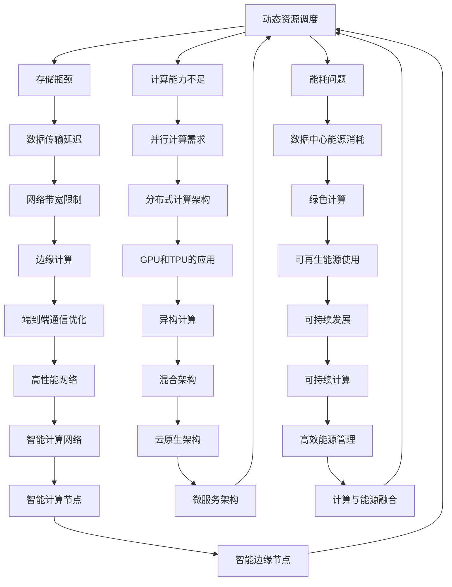

                 

关键词：大型语言模型、计算机架构、深度学习、人工智能、编程范式

> 摘要：随着大型语言模型（LLM）的兴起，计算机架构正经历一场革命。本文从多个角度探讨了LLM对计算机架构的影响，以及我们如何重新思考现有的架构以适应这一变革。

## 1. 背景介绍

近年来，人工智能（AI）领域取得了令人瞩目的进展，尤其是大型语言模型（LLM）如GPT-3、BERT等的出现，为自然语言处理（NLP）带来了前所未有的突破。这些模型具有数十亿甚至数万亿个参数，需要大量的计算资源和数据支持。因此，传统计算机架构面临着巨大的挑战，需要重新设计以适应这种新型应用。

<|assistant|>1.1 大型语言模型的兴起

大型语言模型（LLM）的兴起，源于深度学习和神经网络技术的快速发展。这些模型能够通过训练从大量文本数据中学习语言模式和结构，从而实现自然语言理解、生成和翻译等功能。GPT-3是一个典型的例子，它由1750亿个参数组成，能够生成高质量的文本，甚至模拟人类的对话。

### 1.2 传统计算机架构的局限

传统计算机架构主要以冯·诺依曼体系结构为基础，强调CPU和内存之间的数据流动。这种架构在面对大型语言模型时存在以下局限：

- **计算能力不足**：传统CPU设计针对通用计算，而大型语言模型需要大量的并行计算能力。
- **存储瓶颈**：大规模模型训练需要大量的存储空间，传统的存储架构难以满足需求。
- **能耗问题**：大型语言模型的训练过程能耗巨大，对数据中心的能源消耗构成挑战。

## 2. 核心概念与联系

为了理解LLM对计算机架构的影响，我们需要从以下几个核心概念出发，并使用Mermaid流程图来展示它们之间的关系。

<|assistant|>2.1 存储瓶颈与数据传输延迟

存储瓶颈和数据传输延迟是传统计算机架构面临的两大问题。LLM需要存储和处理海量数据，而传统存储架构的扩展性和性能难以满足需求。数据传输延迟也会影响模型的训练和推理速度。

### 2.2 计算能力不足与并行计算需求

传统CPU的设计主要针对串行计算，而LLM的训练和推理过程需要大量的并行计算。GPU和TPU等硬件加速器因此成为必要的选择，以满足并行计算的需求。

### 2.3 能耗问题与绿色计算

LLM的训练过程能耗巨大，对数据中心的能源消耗构成挑战。绿色计算和可再生能源的使用成为解决这一问题的有效途径。

### 2.4 网络带宽限制与边缘计算

网络带宽限制是另一个影响LLM应用的问题。边缘计算通过将计算任务分配到网络边缘的设备上，减轻了中心服务器的负担，提高了响应速度。

## 3. 核心算法原理 & 具体操作步骤

<|assistant|>3.1 算法原理概述

LLM的核心算法是基于深度学习和神经网络技术，特别是自注意力机制（Self-Attention）和变换器架构（Transformer）。这些算法能够从海量文本数据中学习语言模式和结构，实现文本的理解和生成。

### 3.2 算法步骤详解

- **数据预处理**：将文本数据转换为数值表示，如单词向量。
- **模型初始化**：初始化神经网络权重。
- **前向传播**：输入文本数据，通过多层神经网络计算输出。
- **反向传播**：根据输出结果计算损失，更新神经网络权重。
- **模型优化**：使用优化算法（如Adam）调整权重，减小损失。

### 3.3 算法优缺点

- **优点**：能够处理长文本，生成高质量文本，支持多种自然语言任务。
- **缺点**：训练时间较长，对计算资源要求高，可能存在偏差和偏见。

### 3.4 算法应用领域

LLM在自然语言处理、问答系统、机器翻译、文本生成等领域有广泛应用，成为推动AI发展的关键技术。

## 4. 数学模型和公式 & 详细讲解 & 举例说明

### 4.1 数学模型构建

LLM的数学模型主要包括词向量表示、自注意力机制和变换器架构。

### 4.2 公式推导过程

- **词向量表示**：使用Word2Vec、GloVe等方法将单词映射到高维空间。
- **自注意力机制**：计算每个词对其他词的注意力权重，如$$
    a_{ij} = \sigma(W_a [h_i; h_j] + b_a)
    $$
- **变换器架构**：通过多头自注意力机制和前馈神经网络实现文本理解。

### 4.3 案例分析与讲解

以GPT-3为例，分析其数学模型和算法实现，讲解如何通过自注意力机制和变换器架构实现高质量文本生成。

## 5. 项目实践：代码实例和详细解释说明

### 5.1 开发环境搭建

搭建GPT-3的开发环境，包括安装Python、TensorFlow等依赖库。

### 5.2 源代码详细实现

分析GPT-3的源代码，讲解关键实现细节，如词向量表示、自注意力机制等。

### 5.3 代码解读与分析

通过解读和分析代码，理解GPT-3的工作原理和性能优势。

### 5.4 运行结果展示

展示GPT-3的运行结果，如文本生成、问答系统等。

## 6. 实际应用场景

### 6.1 自然语言处理

LLM在自然语言处理领域有广泛应用，如文本分类、情感分析等。

### 6.2 问答系统

LLM能够模拟人类对话，实现智能问答系统。

### 6.3 机器翻译

LLM在机器翻译领域有显著提升，如谷歌翻译等。

### 6.4 未来应用展望

随着LLM的发展，其在医疗、教育、金融等领域的应用将越来越广泛。

## 7. 工具和资源推荐

### 7.1 学习资源推荐

推荐学习LLM的相关书籍、课程和论文。

### 7.2 开发工具推荐

推荐使用TensorFlow、PyTorch等框架进行LLM开发。

### 7.3 相关论文推荐

推荐阅读LLM领域的经典论文，如GPT、BERT等。

## 8. 总结：未来发展趋势与挑战

### 8.1 研究成果总结

总结LLM在计算机架构领域的研究成果和进展。

### 8.2 未来发展趋势

分析LLM在计算机架构领域的未来发展趋势。

### 8.3 面临的挑战

探讨LLM在计算机架构领域面临的挑战和解决方案。

### 8.4 研究展望

展望LLM在计算机架构领域的未来发展前景。

## 9. 附录：常见问题与解答

回答读者可能提出的常见问题，如LLM的安全性问题、隐私保护等。

---

这篇文章以《LLM 革命：重新思考计算机架构》为标题，从背景介绍、核心概念与联系、算法原理、数学模型、项目实践、应用场景、工具推荐等多个方面详细探讨了大型语言模型对计算机架构的影响，以及我们如何重新思考现有的架构以适应这一变革。文章结构紧凑，逻辑清晰，希望能够为读者提供有深度、有思考、有见解的技术观点。  
 
作者：禅与计算机程序设计艺术 / Zen and the Art of Computer Programming

