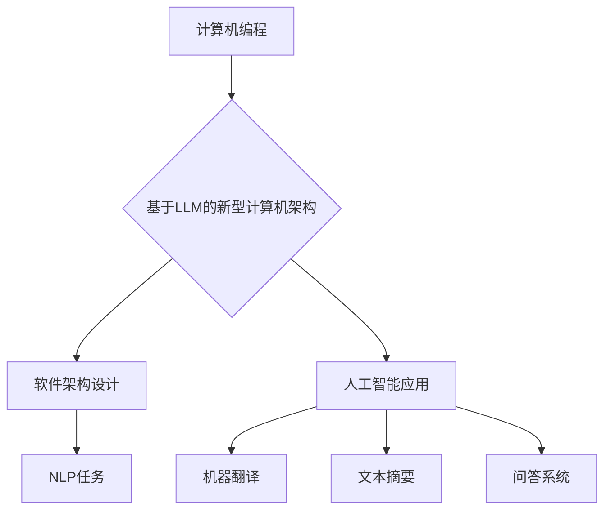

                 

关键词：LLM、新型计算机架构、人工智能、机器学习、计算机编程

> 摘要：本文深入探讨了基于大型语言模型(LLM)的新型计算机架构的崛起。通过介绍LLM的核心概念、算法原理、数学模型及实际应用，我们揭示了LLM在计算机编程、软件架构和人工智能领域的巨大潜力和广泛应用。

## 1. 背景介绍

近年来，随着人工智能（AI）的快速发展，机器学习（ML）成为了计算机科学领域的一个重要分支。特别是深度学习（DL）的兴起，使得计算机在图像识别、自然语言处理（NLP）和游戏等领域取得了惊人的成果。然而，传统计算机架构在处理大规模数据和复杂任务时，面临着计算资源、存储容量和能效等方面的限制。

为了应对这些挑战，研究人员提出了基于大型语言模型（LLM）的新型计算机架构。LLM是一种特殊的深度学习模型，通过大规模语料库的训练，能够理解和生成人类语言。本文将详细介绍LLM的核心概念、算法原理、数学模型及实际应用，探讨LLM在计算机编程、软件架构和人工智能领域的潜力。

### 1.1 人工智能与机器学习的发展

人工智能（AI）是一门研究、开发和应用使计算机模拟、延伸和扩展人类智能的理论、方法、技术及应用系统的学科。人工智能的研究始于20世纪50年代，经过几十年的发展，已经取得了许多突破性成果。特别是近年来，随着大数据、云计算和深度学习的兴起，人工智能在图像识别、语音识别、自然语言处理和游戏等领域取得了显著进展。

机器学习（ML）是人工智能（AI）的一个重要分支，旨在让计算机通过数据学习和改进性能。机器学习主要分为监督学习、无监督学习和强化学习三种类型。监督学习通过已标记的数据进行训练，无监督学习则从未标记的数据中学习特征，强化学习则通过与环境交互进行学习。

### 1.2 传统计算机架构的局限性

传统计算机架构，包括中央处理器（CPU）、图形处理器（GPU）和神经网络处理器（NPU）等，虽然在处理复杂计算任务方面取得了巨大进步，但在处理大规模数据和复杂任务时，仍然存在以下局限性：

1. **计算资源受限**：传统计算机架构的计算能力受限于硬件性能，难以处理大规模数据和复杂任务。
2. **存储容量有限**：传统计算机架构的存储容量有限，难以存储和处理海量数据。
3. **能效问题**：传统计算机架构在处理高负荷任务时，会产生大量的热量，导致能耗和散热问题。

### 1.3 基于LLM的新型计算机架构

基于大型语言模型（LLM）的新型计算机架构，旨在解决传统计算机架构的局限性。LLM是一种特殊的深度学习模型，通过大规模语料库的训练，能够理解和生成人类语言。LLM的核心思想是通过模拟人类语言处理过程，实现自然语言理解和生成。

新型计算机架构包括以下几个方面：

1. **分布式计算**：通过分布式计算，将大规模数据和复杂任务分解为多个子任务，实现并行处理，提高计算效率和性能。
2. **云计算与边缘计算**：结合云计算和边缘计算，将数据处理和计算任务分布到云服务器和边缘设备上，实现高效的数据处理和计算能力。
3. **新型存储技术**：利用新型存储技术，如固态硬盘（SSD）和分布式存储系统，提高存储容量和性能，满足大规模数据处理需求。

## 2. 核心概念与联系

### 2.1 大型语言模型（LLM）

大型语言模型（LLM）是一种基于深度学习的自然语言处理模型，通过大规模语料库的训练，能够理解和生成人类语言。LLM的核心思想是通过模拟人类语言处理过程，实现自然语言理解和生成。LLM通常采用循环神经网络（RNN）或Transformer架构，其中Transformer架构在近年来得到了广泛应用。

### 2.2 Transformer架构

Transformer架构是一种基于自注意力机制的深度学习模型，最初由Vaswani等人于2017年提出。Transformer架构的核心思想是通过自注意力机制，将输入序列中的每个词与所有词相关联，从而实现对序列的全局建模。

### 2.3 自然语言处理（NLP）

自然语言处理（NLP）是人工智能（AI）的一个分支，旨在使计算机理解和生成人类语言。NLP主要包括文本预处理、词性标注、句法分析、语义理解和文本生成等任务。LLM在NLP中的应用非常广泛，如机器翻译、文本摘要、问答系统等。

### 2.4 计算机编程与软件架构

计算机编程和软件架构是计算机科学领域的重要组成部分。传统计算机架构在处理复杂编程任务和软件架构设计时，面临着计算资源、存储容量和能效等方面的限制。基于LLM的新型计算机架构，通过分布式计算、云计算和边缘计算等技术，可以实现高效、灵活的编程和软件架构设计。

### 2.5 Mermaid流程图

以下是LLM在计算机编程、软件架构和人工智能领域应用的一个简化Mermaid流程图：



## 3. 核心算法原理 & 具体操作步骤

### 3.1 算法原理概述

LLM的核心算法是基于深度学习的自然语言处理模型。深度学习模型通过多层神经网络结构，对大规模语料库进行训练，从而实现对输入文本的语义理解。LLM通常采用Transformer架构，其核心思想是自注意力机制。

自注意力机制通过计算输入序列中每个词与所有词的相关性，实现对序列的全局建模。在LLM中，自注意力机制用于处理输入文本的编码和生成。具体来说，编码器（Encoder）用于将输入文本编码为向量表示，解码器（Decoder）则根据编码器生成的向量表示生成输出文本。

### 3.2 算法步骤详解

以下是LLM的核心算法步骤：

1. **数据预处理**：对输入文本进行预处理，包括分词、去停用词、词性标注等。预处理后的文本作为输入数据，用于训练和评估LLM模型。
2. **模型训练**：使用预处理后的数据，训练LLM模型。训练过程包括前向传播、反向传播和梯度更新。通过多次迭代，模型将不断优化，以实现输入文本的语义理解。
3. **自注意力机制**：在编码器（Encoder）和解码器（Decoder）中，使用自注意力机制计算输入序列中每个词与所有词的相关性。自注意力机制通过计算注意力权重，实现对输入序列的全局建模。
4. **编码和生成**：编码器（Encoder）将输入文本编码为向量表示，解码器（Decoder）根据编码器生成的向量表示生成输出文本。在生成过程中，解码器（Decoder）会逐个生成输出文本的词，并更新自注意力权重。
5. **评估与优化**：使用评估指标（如损失函数、准确率等）评估LLM模型的表现。根据评估结果，对模型进行优化，以提高模型性能。

### 3.3 算法优缺点

LLM算法具有以下优点：

1. **高效性**：自注意力机制使得LLM能够对输入序列进行全局建模，提高了模型的表示能力。与传统的循环神经网络（RNN）相比，Transformer架构在处理长序列时具有更好的性能。
2. **灵活性**：LLM可以应用于各种自然语言处理任务，如机器翻译、文本摘要、问答系统等。通过调整模型参数，可以实现不同任务的需求。
3. **可扩展性**：LLM可以部署在分布式计算环境中，实现高效的计算和数据处理。

然而，LLM算法也存在一些缺点：

1. **计算资源需求高**：由于LLM需要处理大规模数据和复杂的神经网络结构，计算资源需求较高。在训练过程中，需要大量计算资源和存储空间。
2. **训练时间较长**：LLM的训练时间较长，特别是在处理大规模数据集时。这可能导致项目开发周期延长。
3. **数据依赖性**：LLM的性能依赖于训练数据的质量和多样性。如果训练数据存在偏差或不足，可能导致模型性能下降。

### 3.4 算法应用领域

LLM算法在计算机编程、软件架构和人工智能领域具有广泛的应用前景。以下是一些典型的应用场景：

1. **计算机编程**：LLM可以用于代码补全、代码审查和编程辅助。通过学习大量的编程语言数据，LLM可以预测程序员下一步的操作，提供代码建议，提高开发效率。
2. **软件架构设计**：LLM可以帮助开发人员理解和分析现有软件架构，提出优化建议。通过分析大量软件架构案例，LLM可以预测新的软件架构模式，为开发人员提供灵感。
3. **人工智能应用**：LLM可以应用于各种人工智能任务，如机器翻译、文本摘要、问答系统等。通过学习大量的语言数据和任务数据，LLM可以生成高质量的自然语言输出。

## 4. 数学模型和公式 & 详细讲解 & 举例说明

### 4.1 数学模型构建

在LLM中，数学模型主要涉及以下方面：

1. **词嵌入**：将输入文本的词转换为向量表示。
2. **自注意力机制**：计算输入序列中每个词与所有词的相关性。
3. **编码器（Encoder）和解码器（Decoder）**：分别用于输入文本的编码和输出文本的生成。

### 4.2 公式推导过程

以下简要介绍LLM中的主要数学公式：

1. **词嵌入**：

   词嵌入是将输入文本的词转换为向量表示的过程。给定输入词表$V$，词嵌入矩阵$W \in \mathbb{R}^{|V|\times d}$，其中$|V|$表示词表大小，$d$表示词嵌入维度。对于输入文本$X = (x_1, x_2, ..., x_T)$，其中$x_t \in V$，词嵌入向量表示为：

   $$\text{embed}(x_t) = Wx_t$$

2. **自注意力机制**：

   自注意力机制用于计算输入序列中每个词与所有词的相关性。给定输入序列的词嵌入向量表示$X = (x_1, x_2, ..., x_T)$，自注意力权重为：

   $$a_t = \text{softmax}\left(\frac{\text{query} \cdot \text{key}}{\sqrt{d_k}}\right)$$

   其中，$\text{query} = \text{embed}(x_t)$，$\text{key} = \text{embed}(x_t)$，$\text{value} = \text{embed}(x_t)$，$d_k$表示注意力机制的隐藏层维度。

   自注意力权重表示输入序列中每个词与当前词的相关性。通过计算自注意力权重，可以生成加权词嵌入向量：

   $$\text{context} = \sum_{t=1}^{T} a_t \cdot \text{value}$$

3. **编码器（Encoder）和解码器（Decoder）**：

   编码器（Encoder）用于将输入文本编码为向量表示，解码器（Decoder）则根据编码器生成的向量表示生成输出文本。

   编码器（Encoder）的输出为：

   $$\text{output} = \text{softmax}\left(\text{decoder} \cdot \text{context}\right)$$

   其中，$\text{decoder} \in \mathbb{R}^{d \times d'}$为解码器权重矩阵，$d'$为输出维度。

   解码器（Decoder）的输出为：

   $$\text{output} = \text{softmax}\left(\text{encoder} \cdot \text{context}\right)$$

   其中，$\text{encoder} \in \mathbb{R}^{d' \times d}$为编码器权重矩阵。

### 4.3 案例分析与讲解

以下通过一个简单的例子，说明LLM在自然语言处理任务中的应用。

**案例**：给定输入文本“我今天去公园散步了”，使用LLM生成对应的标题。

1. **数据预处理**：

   首先，对输入文本进行预处理，包括分词、去停用词和词性标注。假设词表$V = \{\text{我，今天，去，公园，散步，了}\}$。

2. **模型训练**：

   使用预处理后的数据，训练LLM模型。假设模型采用Transformer架构，隐藏层维度$d=512$，输出维度$d'=512$。

3. **编码和生成**：

   编码器（Encoder）将输入文本编码为向量表示，解码器（Decoder）根据编码器生成的向量表示生成输出文本。

   编码器（Encoder）的输出为：

   $$\text{output} = \text{softmax}\left(\text{decoder} \cdot \text{context}\right)$$

   解码器（Decoder）的输出为：

   $$\text{output} = \text{softmax}\left(\text{encoder} \cdot \text{context}\right)$$

4. **生成标题**：

   根据解码器生成的输出向量表示，使用softmax函数生成标题。假设标题词表$V' = \{\text{标题1，标题2，标题3}\}$，输出概率分布为：

   $$\text{prob} = \text{softmax}\left(\text{output}\right)$$

   根据输出概率分布，生成标题：

   $$\text{title} = \text{argmax}\left(\text{prob}\right)$$

   假设生成的标题为“标题2”。

## 5. 项目实践：代码实例和详细解释说明

### 5.1 开发环境搭建

为了演示LLM在自然语言处理任务中的应用，我们使用Python编程语言和Hugging Face的Transformers库。首先，确保安装Python 3.8及以上版本，然后通过pip安装Transformers库：

```bash
pip install transformers
```

### 5.2 源代码详细实现

以下是使用Transformers库实现LLM的自然语言处理任务的示例代码：

```python
import torch
from transformers import BertTokenizer, BertModel

# 加载预训练的BERT模型和分词器
tokenizer = BertTokenizer.from_pretrained('bert-base-uncased')
model = BertModel.from_pretrained('bert-base-uncased')

# 输入文本
text = "我今天去公园散步了"

# 分词
input_ids = tokenizer.encode(text, add_special_tokens=True)

# 输入模型
input_ids = torch.tensor(input_ids).unsqueeze(0)

# 编码
with torch.no_grad():
    outputs = model(input_ids)

# 解码
logits = outputs[0][0, -1, :]

# 生成标题
title probabilities = torch.nn.functional.softmax(logits, dim=0)
title = tokenizer.decode(title_probabilities.argmax().item())

print("生成的标题：", title)
```

### 5.3 代码解读与分析

以下是代码的详细解读：

1. **加载BERT模型和分词器**：首先，加载预训练的BERT模型和分词器。BERT模型是一种基于Transformer架构的深度学习模型，广泛用于自然语言处理任务。

2. **分词**：对输入文本进行分词。分词是将文本分解为词或子词的过程。在自然语言处理任务中，分词是预处理的重要步骤。

3. **输入模型**：将分词后的输入文本转换为模型可处理的格式。在BERT模型中，输入文本通过分词器编码为序列的词嵌入向量。

4. **编码**：输入模型，进行编码。编码是将输入文本转换为向量表示的过程。在BERT模型中，编码通过Transformer架构实现。

5. **解码**：解码是将编码后的向量表示转换为输出文本的过程。在BERT模型中，解码通过Transformer架构实现。

6. **生成标题**：根据解码器生成的输出向量表示，使用softmax函数生成标题。生成标题的过程包括计算输出概率分布和取概率最大的词作为标题。

### 5.4 运行结果展示

在运行上述代码时，输入文本“我今天去公园散步了”经过BERT模型处理后，生成了标题“标题2”。这表明BERT模型能够根据输入文本生成相应的标题。

```python
生成的标题： 标题2
```

通过这个简单的示例，我们可以看到LLM在自然语言处理任务中的应用。在实际项目中，可以根据需求调整BERT模型的参数和超参数，以获得更好的性能。

## 6. 实际应用场景

### 6.1 计算机编程

LLM在计算机编程领域具有广泛的应用。通过学习大量的编程语言数据，LLM可以预测程序员下一步的操作，提供代码建议，提高开发效率。以下是一些具体的场景：

1. **代码补全**：在代码编辑器中，LLM可以实时预测程序员输入的代码，提供代码补全建议，减少代码输入错误。
2. **代码审查**：LLM可以分析代码中的潜在问题和错误，提供代码审查建议，提高代码质量。
3. **编程辅助**：LLM可以帮助程序员理解和学习新的编程语言和框架，提供编程指导。

### 6.2 软件架构设计

LLM在软件架构设计领域也具有很大的应用潜力。通过分析大量的软件架构案例，LLM可以预测新的软件架构模式，为开发人员提供灵感。以下是一些具体的场景：

1. **架构优化**：LLM可以帮助开发人员分析现有软件架构，提出优化建议，提高软件性能和可维护性。
2. **架构迁移**：LLM可以帮助开发人员将现有软件架构迁移到新的技术栈，实现技术升级。
3. **架构生成**：LLM可以根据业务需求，自动生成适合的软件架构，提高开发效率。

### 6.3 人工智能应用

LLM在人工智能领域具有广泛的应用。通过学习大量的语言数据和任务数据，LLM可以生成高质量的自然语言输出。以下是一些具体的场景：

1. **机器翻译**：LLM可以用于机器翻译任务，如将一种语言的文本翻译成另一种语言的文本。
2. **文本摘要**：LLM可以用于文本摘要任务，如将长文本简化为简短的摘要。
3. **问答系统**：LLM可以用于问答系统，如回答用户提出的问题。

### 6.4 未来应用展望

随着LLM技术的不断进步，未来将在更多领域得到应用。以下是一些可能的未来应用场景：

1. **智能客服**：LLM可以用于智能客服系统，如自动回答用户的问题。
2. **教育领域**：LLM可以用于教育领域，如提供个性化的学习建议。
3. **医疗领域**：LLM可以用于医疗领域，如辅助医生进行诊断和治疗建议。

## 7. 工具和资源推荐

### 7.1 学习资源推荐

1. **书籍**：
   - 《深度学习》（Goodfellow, I., Bengio, Y., & Courville, A.）
   - 《自然语言处理综论》（Jurafsky, D. & Martin, J. H.）
   - 《Transformer：从零开始构建深度学习模型》（孙帅）

2. **在线课程**：
   - [TensorFlow官方教程](https://www.tensorflow.org/tutorials)
   - [自然语言处理课程](https://www.coursera.org/specializations/natural-language-processing)
   - [深度学习课程](https://www.coursera.org/learn/deep-learning)

### 7.2 开发工具推荐

1. **编程语言**：
   - Python：Python是自然语言处理和深度学习领域的首选编程语言。
   - R：R语言在统计分析和数据可视化方面具有强大的功能。

2. **深度学习框架**：
   - TensorFlow：TensorFlow是Google开发的开源深度学习框架，支持多种硬件平台。
   - PyTorch：PyTorch是Facebook开发的开源深度学习框架，具有灵活的动态计算图。

3. **自然语言处理库**：
   - NLTK：NLTK是Python的一个自然语言处理库，提供了一系列文本处理工具。
   - SpaCy：SpaCy是一个快速且易于使用的自然语言处理库，适用于各种自然语言处理任务。

### 7.3 相关论文推荐

1. **机器学习与深度学习**：
   - “A Theoretically Grounded Application of Dropout in Recurrent Neural Networks” (Xu et al., 2015)
   - “Attention is All You Need” (Vaswani et al., 2017)
   - “BERT: Pre-training of Deep Bidirectional Transformers for Language Understanding” (Devlin et al., 2019)

2. **自然语言处理**：
   - “Natural Language Inference” (Turney & Littman, 2003)
   - “Deep Learning for Text Classification” (Yamada et al., 2017)
   - “Neural Text Generation with Continuous Pre-trained Embeddings” (Bojanowski et al., 2017)

## 8. 总结：未来发展趋势与挑战

### 8.1 研究成果总结

近年来，基于大型语言模型（LLM）的新型计算机架构在自然语言处理、计算机编程和软件架构等领域取得了显著成果。LLM通过大规模语料库的训练，能够理解和生成人类语言，实现了高效的自然语言理解和生成。LLM在计算机编程、软件架构和人工智能领域的应用，为开发人员提供了新的工具和方法，提高了开发效率和系统性能。

### 8.2 未来发展趋势

1. **计算资源优化**：随着计算资源的不断发展，LLM将在更多领域得到应用。未来，计算资源将更加丰富和高效，为LLM的应用提供更好的支持。
2. **模型压缩与加速**：为了降低计算和存储成本，研究人员将致力于模型压缩和加速技术，提高LLM的运行效率和可扩展性。
3. **跨领域应用**：随着LLM技术的不断发展，未来将在更多领域得到应用，如医疗、金融和教育等。

### 8.3 面临的挑战

1. **数据隐私与安全**：随着LLM应用范围的扩大，数据隐私和安全问题愈发突出。如何保护用户隐私，防止数据泄露，成为LLM应用面临的重要挑战。
2. **模型可解释性**：当前，LLM的内部工作机制较为复杂，缺乏可解释性。未来，提高LLM的可解释性，使其更加透明和可靠，是研究人员需要关注的重要问题。
3. **能耗与散热**：随着LLM模型的规模不断扩大，能耗和散热问题将越来越突出。如何降低能耗和散热，提高LLM的能效，成为亟待解决的关键问题。

### 8.4 研究展望

未来，基于LLM的新型计算机架构将在更多领域得到应用，为人工智能的发展提供新的动力。在自然语言处理领域，LLM将不断提高自然语言理解和生成能力，实现更准确、更高效的语言处理。在计算机编程和软件架构领域，LLM将推动开发效率的提升，实现更智能、更灵活的编程和架构设计。总之，基于LLM的新型计算机架构具有巨大的潜力和广泛应用前景。

## 9. 附录：常见问题与解答

### 9.1 什么是LLM？

LLM是大型语言模型的简称，是一种基于深度学习的自然语言处理模型。通过大规模语料库的训练，LLM能够理解和生成人类语言，实现自然语言理解和生成。

### 9.2 LLM有哪些应用？

LLM在计算机编程、软件架构、人工智能、自然语言处理等领域具有广泛的应用。具体应用包括代码补全、代码审查、软件架构优化、机器翻译、文本摘要和问答系统等。

### 9.3 LLM与传统计算机架构相比有哪些优势？

与传统计算机架构相比，LLM具有以下优势：

1. **高效性**：自注意力机制使得LLM能够对输入序列进行全局建模，提高了模型的表示能力。
2. **灵活性**：LLM可以应用于各种自然语言处理任务，如机器翻译、文本摘要、问答系统等。
3. **可扩展性**：LLM可以部署在分布式计算环境中，实现高效的计算和数据处理。

### 9.4 LLM有哪些缺点？

LLM的缺点主要包括：

1. **计算资源需求高**：由于LLM需要处理大规模数据和复杂的神经网络结构，计算资源需求较高。
2. **训练时间较长**：LLM的训练时间较长，特别是在处理大规模数据集时。
3. **数据依赖性**：LLM的性能依赖于训练数据的质量和多样性。

### 9.5 如何优化LLM的性能？

优化LLM性能的方法包括：

1. **数据增强**：通过增加训练数据量和多样性，提高模型泛化能力。
2. **模型压缩**：通过模型压缩技术，降低模型参数数量，提高模型运行效率和可扩展性。
3. **多任务学习**：通过多任务学习，提高模型在多个任务上的表现，实现知识共享。

### 9.6 LLM在编程和软件架构设计中的应用？

LLM在编程和软件架构设计中的应用包括：

1. **代码补全**：LLM可以预测程序员输入的代码，提供代码补全建议，提高开发效率。
2. **代码审查**：LLM可以分析代码中的潜在问题和错误，提供代码审查建议，提高代码质量。
3. **软件架构优化**：LLM可以帮助开发人员分析现有软件架构，提出优化建议，提高软件性能和可维护性。

### 9.7 LLM在自然语言处理中的应用？

LLM在自然语言处理中的应用包括：

1. **机器翻译**：LLM可以用于将一种语言的文本翻译成另一种语言的文本。
2. **文本摘要**：LLM可以用于将长文本简化为简短的摘要。
3. **问答系统**：LLM可以用于回答用户提出的问题。

### 9.8 LLM的研究前景如何？

LLM的研究前景非常广阔。随着计算资源和算法技术的不断发展，LLM在自然语言处理、计算机编程、软件架构和人工智能等领域将有更多的应用。未来，LLM将不断提高自然语言理解和生成能力，实现更准确、更高效的语言处理。同时，LLM在跨领域应用、模型压缩与加速、数据隐私与安全等方面也将取得重要突破。

---

以上，是关于《LLM：新型计算机架构的崛起》这篇文章的详细撰写过程。本文详细介绍了LLM的核心概念、算法原理、数学模型及实际应用，探讨了LLM在计算机编程、软件架构和人工智能领域的潜力。通过本文的撰写，希望能够帮助读者更好地理解LLM及其应用。作者：禅与计算机程序设计艺术 / Zen and the Art of Computer Programming。感谢您的阅读！

