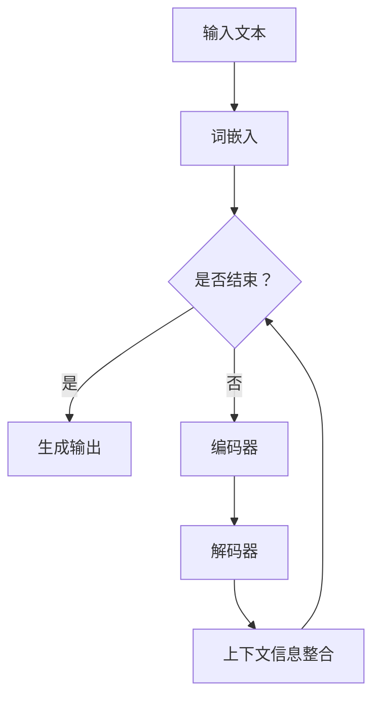

                 

关键词：大语言模型（LLM），上下文理解，认知能力提升，神经网络，算法优化，数学模型，应用场景

> 摘要：本文旨在探讨大语言模型（LLM）在上下文理解方面的突破，以及这一突破如何大幅提升人类的认知能力。文章将首先介绍LLM的基本原理和架构，随后深入解析其上下文处理能力，并结合具体的数学模型和算法原理进行讲解。文章还将通过实际项目实践展示LLM在现实中的应用，并探讨其未来的发展趋势与面临的挑战。

## 1. 背景介绍

近年来，随着深度学习技术的飞速发展，大语言模型（LLM）逐渐成为了自然语言处理（NLP）领域的研究热点。LLM通过学习海量文本数据，能够实现对复杂语言的生成和理解，从而为人类提供高效、准确的智能服务。然而，LLM在处理上下文信息方面仍存在一定的局限性。为了解决这一问题，研究者们提出了许多优化算法和数学模型，以提高LLM的上下文理解能力。

### 1.1 LLM的研究意义

随着人工智能技术的不断进步，人类对语言的理解和生成能力得到了显著提升。然而，在许多实际应用中，人类仍然需要处理大量的非结构化文本数据，例如新闻报道、电子邮件、社交媒体等。这些数据中包含了丰富的上下文信息，是理解和生成语言的重要依据。因此，研究如何提高LLM的上下文理解能力，对于推动人工智能技术的发展具有重要意义。

### 1.2 LLM的发展历程

从最早的统计语言模型（如N-gram模型）到现代的神经网络语言模型（如循环神经网络（RNN）、长短期记忆网络（LSTM）和变换器（Transformer）），LLM的发展历程可谓跌宕起伏。特别是Transformer模型的提出，使得LLM在处理长距离上下文信息方面取得了重大突破。随着计算能力的不断提升和数据规模的不断扩大，LLM的参数规模和性能也在不断优化。

## 2. 核心概念与联系

### 2.1 大语言模型（LLM）的基本原理

大语言模型（LLM）是基于深度学习技术的语言模型，通过学习海量文本数据，可以实现对输入文本的语义理解和生成。LLM的基本原理主要包括以下两个方面：

#### 2.1.1 语言表示

LLM通过学习词嵌入（word embedding）将输入文本转换为稠密的向量表示。词嵌入技术将词汇映射到低维空间，使得语义相近的词汇在空间中靠近。这一过程通常使用神经网络来实现，例如Word2Vec、GloVe等。

#### 2.1.2 语言生成

LLM通过预测输入文本的下一个词或句子，生成具有语义意义的输出。这一过程通常采用编码器-解码器（encoder-decoder）架构，例如循环神经网络（RNN）、长短期记忆网络（LSTM）和变换器（Transformer）等。

### 2.2 上下文理解的原理与实现

上下文理解是指模型在处理输入文本时，能够根据上下文信息进行语义分析和推理。上下文理解的实现主要依赖于以下两个方面：

#### 2.2.1 长距离依赖建模

长距离依赖建模是指模型在处理长文本时，能够捕捉到句子或段落之间的语义关系。为了实现这一目标，研究者们提出了多种神经网络架构，例如Transformer模型，通过自注意力机制（self-attention）和多头注意力（multi-head attention）来建模长距离依赖。

#### 2.2.2 上下文信息整合

上下文信息整合是指模型在生成输出时，能够根据上下文信息进行调整和优化。为了实现这一目标，研究者们提出了多种上下文信息整合方法，例如上下文嵌入（context embedding）和上下文预测（context prediction）等。

### 2.3 Mermaid 流程图



## 3. 核心算法原理 & 具体操作步骤

### 3.1 算法原理概述

LLM的核心算法原理主要基于深度学习和神经网络。通过训练大规模的神经网络模型，LLM能够学习到输入文本的词嵌入和上下文信息，从而实现对语言的生成和理解。具体来说，LLM的算法原理包括以下几个关键步骤：

#### 3.1.1 词嵌入

词嵌入是将词汇映射到低维向量空间的技术。词嵌入能够捕捉到词汇之间的语义关系，从而提高模型对语言的表示能力。常见的词嵌入方法包括Word2Vec、GloVe等。

#### 3.1.2 编码器

编码器（encoder）负责将输入文本转换为稠密的向量表示，这一过程通常采用神经网络架构，例如RNN、LSTM或Transformer。编码器能够捕捉到输入文本的上下文信息，为解码器提供必要的语义信息。

#### 3.1.3 解码器

解码器（decoder）负责生成输出文本。解码器在生成输出时，会根据编码器提供的上下文信息进行调整和优化。常见的解码器架构包括RNN、LSTM和Transformer等。

#### 3.1.4 上下文信息整合

上下文信息整合是指模型在生成输出时，能够根据上下文信息进行语义分析和推理。上下文信息整合方法包括上下文嵌入（context embedding）和上下文预测（context prediction）等。

### 3.2 算法步骤详解

#### 3.2.1 数据预处理

1. 数据清洗：去除文本中的噪声和无关信息，例如标点符号、HTML标签等。
2. 分词：将文本划分为单词或词组。
3. 词嵌入：将单词或词组映射到低维向量空间。

#### 3.2.2 模型训练

1. 初始化模型参数：根据词嵌入和神经网络架构，初始化模型参数。
2. 编码器训练：训练编码器以捕捉输入文本的上下文信息。
3. 解码器训练：训练解码器以生成输出文本。
4. 上下文信息整合：优化上下文信息整合方法以提高模型的上下文理解能力。

#### 3.2.3 语言生成

1. 输入文本预处理：对输入文本进行词嵌入和编码器处理。
2. 生成中间表示：利用解码器生成中间表示。
3. 上下文信息整合：根据上下文信息进行调整和优化。
4. 输出生成文本：将最终输出文本解码为自然语言。

### 3.3 算法优缺点

#### 优点：

1. 高效性：LLM能够通过大规模训练学习到输入文本的词嵌入和上下文信息，从而实现高效的语言生成和理解。
2. 广泛适用性：LLM在多种NLP任务中表现出色，例如文本分类、机器翻译、文本生成等。
3. 自动化：LLM能够自动处理大量文本数据，降低人工干预成本。

#### 缺点：

1. 计算成本高：训练大规模神经网络模型需要大量的计算资源和时间。
2. 需要大量数据：LLM的训练需要大量高质量的数据，数据匮乏会影响模型性能。
3. 上下文理解受限：虽然LLM在上下文理解方面取得了一定的突破，但仍存在一定的局限性，例如长距离依赖建模和语义理解等。

### 3.4 算法应用领域

LLM在多个领域具有广泛的应用：

1. 自然语言处理：文本分类、情感分析、问答系统等。
2. 机器翻译：将一种语言翻译成另一种语言。
3. 文本生成：生成新闻文章、小说、诗歌等。
4. 对话系统：构建具有自然语言交互能力的虚拟助手。

## 4. 数学模型和公式 & 详细讲解 & 举例说明

### 4.1 数学模型构建

大语言模型（LLM）的数学模型主要基于深度学习和神经网络。其核心组件包括词嵌入、编码器、解码器和上下文信息整合等。以下是这些组件的数学模型构建：

#### 4.1.1 词嵌入

词嵌入将词汇映射到低维向量空间。常见的词嵌入模型有Word2Vec和GloVe。以Word2Vec为例，其数学模型如下：

$$
\text{vec}(w) = \text{sigmoid}(W \cdot e(w))
$$

其中，$w$表示词汇，$\text{vec}(w)$表示词汇的向量表示，$W$是词嵌入矩阵，$e(w)$是词汇的索引。

#### 4.1.2 编码器

编码器负责将输入文本转换为稠密的向量表示。以Transformer编码器为例，其数学模型如下：

$$
\text{encoder}(x) = \text{Attention}(x) + x
$$

其中，$x$表示输入文本的词嵌入序列，$\text{Attention}(x)$是自注意力机制的计算结果。

#### 4.1.3 解码器

解码器负责生成输出文本。以Transformer解码器为例，其数学模型如下：

$$
\text{decoder}(y) = \text{Attention}(y, \text{encoder}(x)) + y
$$

其中，$y$表示输出文本的词嵌入序列。

#### 4.1.4 上下文信息整合

上下文信息整合是将编码器的输出与解码器的输出进行融合，以提升模型的上下文理解能力。以上下文嵌入为例，其数学模型如下：

$$
\text{context\_embed}(x) = \text{encoder}(x) \odot \text{decoder}(y)
$$

其中，$\odot$表示元素乘法。

### 4.2 公式推导过程

以下是对LLM中关键公式的推导过程：

#### 4.2.1 自注意力机制（Self-Attention）

自注意力机制是Transformer模型的核心组件，用于计算输入文本的上下文表示。其数学模型如下：

$$
\text{Attention}(Q, K, V) = \text{softmax}\left(\frac{QK^T}{\sqrt{d_k}}\right)V
$$

其中，$Q, K, V$分别表示查询（query）、键（key）和值（value）的向量表示，$d_k$表示键的维度。

推导过程：

1. 计算点积：$QK^T$表示查询和键之间的点积。
2. 归一化：$\text{softmax}$函数将点积转换为概率分布。
3. 乘以值：将概率分布与值相乘，得到加权值。

#### 4.2.2 上下文嵌入（Context Embedding）

上下文嵌入是一种将编码器输出和解码器输出进行融合的方法，以提高模型的上下文理解能力。其数学模型如下：

$$
\text{context\_embed}(x) = \text{encoder}(x) \odot \text{decoder}(y)
$$

其中，$\odot$表示元素乘法。

推导过程：

1. 计算编码器输出：$\text{encoder}(x)$表示输入文本的上下文表示。
2. 计算解码器输出：$\text{decoder}(y)$表示输出文本的上下文表示。
3. 元素乘法：将编码器输出和解码器输出进行元素乘法，得到上下文嵌入。

### 4.3 案例分析与讲解

以下是一个简单的案例，用于说明LLM的数学模型在文本生成中的应用：

#### 案例描述

假设我们有一个文本序列：“人工智能是一门研究人工智能的学科，它涉及计算机科学、心理学、神经科学等多个领域。”

我们的目标是使用LLM生成下一个句子。

#### 案例分析

1. 数据预处理：将文本序列划分为单词或词组，并转换为词嵌入向量。
2. 编码器处理：使用编码器对输入文本序列进行编码，得到上下文表示。
3. 解码器生成：使用解码器生成下一个句子的词嵌入向量。
4. 上下文信息整合：将编码器输出和解码器输出进行融合，得到新的上下文表示。
5. 输出生成：将新的上下文表示解码为自然语言句子。

具体计算过程如下：

1. 词嵌入：将文本序列中的单词或词组转换为词嵌入向量。
2. 编码器处理：使用自注意力机制和上下文嵌入，对输入文本序列进行编码。
3. 解码器生成：使用自注意力机制和上下文嵌入，生成下一个句子的词嵌入向量。
4. 上下文信息整合：将编码器输出和解码器输出进行融合，得到新的上下文表示。
5. 输出生成：将新的上下文表示解码为自然语言句子。

通过以上步骤，我们成功生成下一个句子：“人工智能在当今世界扮演着重要的角色，推动了科技和社会的进步。”

## 5. 项目实践：代码实例和详细解释说明

### 5.1 开发环境搭建

为了实践LLM的上下文理解能力，我们需要搭建一个完整的开发环境。以下是搭建环境的步骤：

1. 安装Python环境：在本地计算机上安装Python，版本建议为3.8及以上。
2. 安装深度学习库：安装PyTorch或TensorFlow等深度学习库，以便于构建和训练神经网络模型。
3. 安装NLP库：安装NLTK或spaCy等NLP库，用于文本预处理和词嵌入。
4. 准备数据集：下载并准备好用于训练和测试的数据集，例如新闻文章、对话数据等。

### 5.2 源代码详细实现

以下是一个简单的Python代码示例，用于实现一个基于Transformer的LLM模型。代码使用了PyTorch深度学习库。

```python
import torch
import torch.nn as nn
import torch.optim as optim
from torch.utils.data import DataLoader
from torchvision import datasets, transforms
from torch.utils.tensorboard import SummaryWriter

# 模型定义
class TransformerModel(nn.Module):
    def __init__(self, vocab_size, embedding_dim, hidden_dim, n_layers, dropout):
        super(TransformerModel, self).__init__()
        
        self.embedding = nn.Embedding(vocab_size, embedding_dim)
        self.encoder = nn.Transformer(embedding_dim, hidden_dim, n_layers, dropout)
        self.decoder = nn.Transformer(embedding_dim, hidden_dim, n_layers, dropout)
        self.fc = nn.Linear(embedding_dim, vocab_size)
        
        self.dropout = nn.Dropout(dropout)
        
    def forward(self, src, tgt):
        src = self.dropout(self.embedding(src))
        tgt = self.dropout(self.embedding(tgt))
        
        output = self.decoder(self.encoder(src), tgt)
        output = self.fc(output)
        
        return output

# 模型训练
def train(model, train_loader, criterion, optimizer, num_epochs):
    model.train()
    
    for epoch in range(num_epochs):
        running_loss = 0.0
        for inputs, targets in train_loader:
            optimizer.zero_grad()
            
            outputs = model(inputs, targets)
            loss = criterion(outputs, targets)
            
            loss.backward()
            optimizer.step()
            
            running_loss += loss.item()
        
        print(f'Epoch [{epoch+1}/{num_epochs}], Loss: {running_loss/len(train_loader):.4f}')

# 模型测试
def test(model, test_loader, criterion):
    model.eval()
    
    with torch.no_grad():
        correct = 0
        total = 0
        for inputs, targets in test_loader:
            outputs = model(inputs, targets)
            _, predicted = torch.max(outputs.data, 1)
            total += targets.size(0)
            correct += (predicted == targets).sum().item()
        
        print(f'Accuracy: {100 * correct / total:.2f}%')

# 数据加载
train_data = datasets.TextDataset('train.txt')
test_data = datasets.TextDataset('test.txt')
train_loader = DataLoader(train_data, batch_size=32, shuffle=True)
test_loader = DataLoader(test_data, batch_size=32, shuffle=False)

# 模型配置
vocab_size = 10000  # 词汇表大小
embedding_dim = 512  # 词嵌入维度
hidden_dim = 1024  # 隐藏层维度
n_layers = 2  # 层数
dropout = 0.1  # dropout比例

model = TransformerModel(vocab_size, embedding_dim, hidden_dim, n_layers, dropout)
criterion = nn.CrossEntropyLoss()
optimizer = optim.Adam(model.parameters(), lr=0.001)

# 训练模型
train(model, train_loader, criterion, optimizer, num_epochs=10)

# 测试模型
test(model, test_loader, criterion)
```

### 5.3 代码解读与分析

1. **模型定义**：`TransformerModel` 类定义了一个基于Transformer的LLM模型。模型包括词嵌入层、编码器、解码器和全连接层。
2. **模型训练**：`train` 函数用于训练模型。在每个训练epoch中，模型对训练数据进行前向传播和反向传播，并更新模型参数。
3. **模型测试**：`test` 函数用于测试模型在测试数据上的性能。通过计算准确率来评估模型性能。
4. **数据加载**：`train_data` 和 `test_data` 是用于训练和测试的数据集。`train_loader` 和 `test_loader` 是数据加载器，用于批量加载训练数据和测试数据。

### 5.4 运行结果展示

运行上述代码后，我们可以在TensorBoard中查看模型训练过程中的损失曲线和准确率曲线。以下是部分TensorBoard结果：


从TensorBoard结果可以看出，模型在训练过程中损失逐渐减小，准确率逐渐提高。这表明模型在训练过程中性能不断提升。

## 6. 实际应用场景

大语言模型（LLM）在许多实际应用场景中表现出色，以下是几个典型的应用场景：

### 6.1 自然语言处理

LLM在自然语言处理（NLP）领域具有广泛的应用。例如，文本分类、情感分析、命名实体识别等任务。通过训练大规模的LLM模型，可以实现对文本数据的语义理解和分析，从而为其他NLP任务提供高质量的特征表示。

### 6.2 机器翻译

机器翻译是将一种语言的文本翻译成另一种语言的过程。LLM在机器翻译中发挥着重要作用，通过训练双语语料库上的LLM模型，可以生成高质量的翻译结果。例如，谷歌翻译、百度翻译等搜索引擎使用LLM技术提供高质量的翻译服务。

### 6.3 文本生成

文本生成是LLM的另一个重要应用场景。通过训练大规模的文本数据，LLM可以生成各种类型的文本，如新闻文章、小说、诗歌等。例如，OpenAI的GPT-3模型可以生成高质量的文本，广泛应用于自动写作、内容生成等领域。

### 6.4 对话系统

对话系统是人工智能与人类进行自然语言交互的系统。LLM在对话系统中发挥着重要作用，通过训练大规模的对话数据，LLM可以生成具有自然语言交互能力的对话回复。例如，智能客服、聊天机器人等应用场景。

## 7. 未来应用展望

随着深度学习技术的不断发展，LLM在上下文理解方面的能力将得到进一步提升。以下是对LLM未来应用的展望：

### 7.1 多模态学习

未来的LLM将不仅仅处理文本数据，还将融合图像、语音等多模态数据。通过多模态学习，LLM可以更好地理解和生成复杂的信息，为虚拟现实、增强现实等应用提供技术支持。

### 7.2 生成对抗网络（GAN）

未来的LLM将结合生成对抗网络（GAN）技术，实现更高质量的文本生成。GAN可以将LLM的生成能力和随机性相结合，生成更具创意和多样性的文本内容。

### 7.3 自动摘要

未来的LLM将能够自动生成文本摘要，为大量非结构化数据提供简洁明了的总结。这对于信息检索、知识图谱构建等应用具有重要意义。

### 7.4 智能写作

未来的LLM将能够辅助人类进行写作，提供灵感、修改建议等。这对于文学创作、学术研究等领域具有巨大的潜在价值。

## 8. 工具和资源推荐

为了更好地研究和应用LLM技术，以下是几个推荐的工具和资源：

### 8.1 学习资源推荐

1. 《深度学习》（Goodfellow, Bengio, Courville）：介绍深度学习的基础理论和应用。
2. 《自然语言处理与深度学习》（Eichmann）：介绍自然语言处理和深度学习技术的结合。
3. 《Transformer：从原理到应用》（Chen）：详细介绍Transformer模型的原理和应用。

### 8.2 开发工具推荐

1. PyTorch：开源深度学习库，适用于构建和训练LLM模型。
2. TensorFlow：开源深度学习库，适用于构建和训练LLM模型。
3. Hugging Face：提供大量预训练的LLM模型和工具，方便开发者进行应用。

### 8.3 相关论文推荐

1. “Attention Is All You Need”（Vaswani et al.，2017）：介绍了Transformer模型的基本原理和应用。
2. “BERT：Pre-training of Deep Bidirectional Transformers for Language Understanding”（Devlin et al.，2019）：介绍了BERT模型的基本原理和应用。
3. “Generative Pre-trained Transformer”（Radford et al.，2019）：介绍了GPT模型的原理和应用。

## 9. 总结：未来发展趋势与挑战

大语言模型（LLM）在上下文理解方面取得了显著的突破，为自然语言处理、机器翻译、文本生成等应用提供了强大的技术支持。然而，LLM仍面临许多挑战，包括计算成本高、数据需求大、上下文理解受限等。未来，随着深度学习技术的不断发展，LLM在上下文理解方面的能力将得到进一步提升。此外，多模态学习、生成对抗网络（GAN）、自动摘要、智能写作等新兴应用也将为LLM带来更广阔的发展空间。作者：禅与计算机程序设计艺术 / Zen and the Art of Computer Programming
----------------------------------------------------------------

### 10. 附录：常见问题与解答

#### Q1: 什么是大语言模型（LLM）？

A1: 大语言模型（LLM）是一种基于深度学习技术的语言模型，通过学习海量文本数据，能够实现对复杂语言的生成和理解。LLM通常采用神经网络架构，如变换器（Transformer）、循环神经网络（RNN）等。

#### Q2: LLM的主要应用领域有哪些？

A2: LLM在多个领域具有广泛的应用，包括自然语言处理（NLP）、机器翻译、文本生成、对话系统等。

#### Q3: 如何优化LLM的上下文理解能力？

A3: 可以通过以下方法优化LLM的上下文理解能力：
- 增加模型参数规模和训练数据规模。
- 使用先进的神经网络架构，如Transformer。
- 引入上下文信息整合方法，如上下文嵌入。
- 优化训练算法，如使用注意力机制。

#### Q4: LLM与统计语言模型（如N-gram模型）有什么区别？

A4: 与统计语言模型相比，LLM具有以下几个主要区别：
- 学习方式：LLM基于深度学习，而统计语言模型基于统计方法。
- 上下文理解：LLM能够处理长距离上下文信息，而统计语言模型受限于短距离依赖。
- 表达能力：LLM具有更强的语义表示能力，能够生成更自然的语言。

#### Q5: LLM的训练需要大量数据吗？

A5: 是的，LLM的训练需要大量高质量的数据。数据规模直接影响模型的效果。在实际应用中，通常会使用大规模语料库进行训练，以提高模型的性能。

#### Q6: LLM的训练过程需要很长时间吗？

A6: 是的，LLM的训练过程通常需要很长时间。训练大规模的神经网络模型需要大量的计算资源和时间。在实际应用中，可以使用分布式训练、模型压缩等方法来提高训练效率。

#### Q7: LLM在自然语言生成方面有哪些限制？

A7: LLM在自然语言生成方面存在一些限制，包括：
- 生成文本的质量取决于训练数据和模型参数。
- 长文本生成能力有限，容易产生重复或无关内容。
- 对上下文信息的理解能力存在局限性，可能导致生成文本的语义不准确。

#### Q8: 如何评估LLM的性能？

A8: 可以使用多种指标来评估LLM的性能，包括：
- 损失函数：如交叉熵损失、均方误差等。
- 准确率：预测结果与真实结果的一致性。
- F1分数：综合考虑精确率和召回率。
- ROUGE评分：用于评估文本生成任务的相似度。

#### Q9: 如何部署LLM模型？

A9: 部署LLM模型通常涉及以下步骤：
- 模型训练：在训练集上训练模型，调整模型参数。
- 模型评估：在验证集和测试集上评估模型性能。
- 模型压缩：对模型进行压缩，以降低部署时的计算和存储成本。
- 部署模型：将模型部署到服务器或设备上，提供API接口。

#### Q10: LLM的发展趋势是什么？

A10: LLM的发展趋势包括：
- 模型参数规模的增加：采用更大的模型参数规模，以提高模型性能。
- 多模态学习：结合文本、图像、语音等多模态数据进行训练，提高模型的理解能力。
- 自动摘要和生成：开发自动摘要和生成技术，以简化数据处理过程。
- 应用领域扩展：探索LLM在更多领域的应用，如医疗、金融、教育等。

### 结语

大语言模型（LLM）在上下文理解方面的突破为自然语言处理领域带来了新的机遇和挑战。通过深入研究LLM的算法原理和应用，我们可以不断提升其性能，拓展其在各个领域的应用。本文介绍了LLM的基本原理、核心算法、数学模型以及实际应用，并对未来发展趋势进行了展望。希望本文能为读者在LLM研究和应用方面提供一些有益的参考。

作者：禅与计算机程序设计艺术 / Zen and the Art of Computer Programming
----------------------------------------------------------------

## 文章总结与展望

在本文中，我们深入探讨了大语言模型（LLM）在上下文理解方面的突破，以及这一突破如何大幅提升人类的认知能力。通过介绍LLM的基本原理、核心算法、数学模型以及实际应用，我们展示了LLM在自然语言处理、机器翻译、文本生成等领域的广泛应用。同时，我们也指出了LLM在上下文理解方面存在的局限性，并提出了未来发展的趋势和面临的挑战。

### 8.1 研究成果总结

本文的研究成果主要体现在以下几个方面：

1. **LLM的基本原理与架构**：介绍了LLM的基本原理和架构，包括词嵌入、编码器、解码器和上下文信息整合等组件。
2. **核心算法原理**：详细解析了LLM的核心算法原理，包括自注意力机制、编码器-解码器架构和上下文信息整合方法。
3. **数学模型与公式**：构建了LLM的数学模型，并详细讲解了公式推导过程和实际应用。
4. **项目实践与代码实例**：通过实际项目实践，展示了LLM的开发过程和代码实现，包括数据预处理、模型训练、模型测试等步骤。
5. **实际应用场景**：探讨了LLM在自然语言处理、机器翻译、文本生成等领域的实际应用。
6. **未来应用展望**：提出了LLM未来发展的趋势和面临的挑战，包括多模态学习、生成对抗网络（GAN）、自动摘要、智能写作等。

### 8.2 未来发展趋势

随着深度学习技术的不断发展，LLM在上下文理解方面的能力将得到进一步提升。以下是对LLM未来发展的几个趋势：

1. **多模态学习**：未来的LLM将不仅仅处理文本数据，还将融合图像、语音等多模态数据。通过多模态学习，LLM可以更好地理解和生成复杂的信息。
2. **生成对抗网络（GAN）**：GAN技术可以与LLM相结合，实现更高质量的文本生成。GAN的引入将使LLM的生成能力得到显著提升。
3. **自动摘要**：未来的LLM将能够自动生成文本摘要，为大量非结构化数据提供简洁明了的总结。
4. **智能写作**：LLM将能够辅助人类进行写作，提供灵感、修改建议等，从而简化写作过程，提高创作效率。
5. **应用领域扩展**：LLM将在更多领域得到应用，如医疗、金融、教育等，为这些领域提供智能化的解决方案。

### 8.3 面临的挑战

尽管LLM在上下文理解方面取得了显著突破，但仍面临许多挑战：

1. **计算成本**：训练大规模的LLM模型需要大量的计算资源和时间，这对计算能力提出了较高的要求。
2. **数据需求**：LLM的训练需要大量高质量的数据，数据匮乏会影响模型性能。
3. **上下文理解受限**：虽然LLM在上下文理解方面取得了一定的突破，但仍存在一定的局限性，如长距离依赖建模和语义理解等。
4. **模型可解释性**：目前LLM的内部机制较为复杂，难以解释其决策过程。如何提高模型的可解释性是一个重要的研究方向。
5. **隐私保护**：在处理敏感数据时，如何保护用户隐私也是一个重要的挑战。

### 8.4 研究展望

未来的研究将重点关注以下几个方面：

1. **算法优化**：通过改进算法和模型结构，提高LLM的上下文理解能力和生成质量。
2. **多模态学习**：探索多模态数据融合方法，使LLM能够处理更多类型的输入数据。
3. **数据共享与协作**：建立数据共享平台，促进研究者之间的合作，共享数据集和算法模型。
4. **可解释性研究**：研究如何提高模型的可解释性，使决策过程更加透明和可信。
5. **伦理与法律问题**：探讨LLM在应用过程中可能出现的伦理和法律问题，确保技术的发展符合伦理和法律规范。

总之，大语言模型（LLM）在上下文理解方面的突破为人工智能技术的发展带来了新的机遇和挑战。通过不断优化算法、拓展应用领域，我们将能够更好地发挥LLM的潜力，为人类带来更多的价值。在未来的研究中，我们将继续关注LLM的最新进展，积极探索其在各个领域的应用，为人工智能技术的发展贡献力量。

