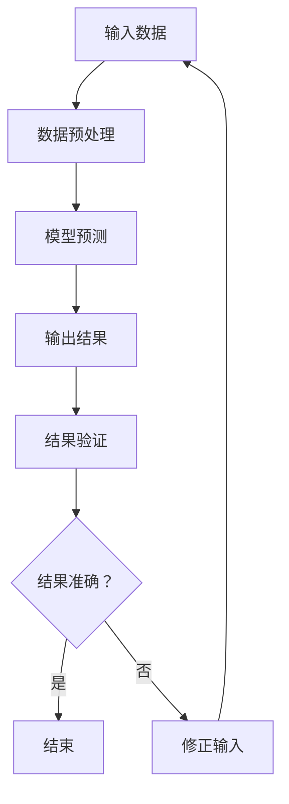

                 

关键词：LLM、不确定性、鲁棒性、智能系统、挑战

摘要：本文将深入探讨大型语言模型（LLM）在智能系统中的不确定性问题，分析其根本原因，探讨提高鲁棒性的方法，并提出未来研究的展望。

## 1. 背景介绍

### 1.1 大型语言模型的崛起

近年来，大型语言模型（LLM）如GPT、BERT等，以其强大的语义理解和生成能力，在自然语言处理、问答系统、文本生成等领域取得了显著的突破。这些模型通过深度学习技术，从海量数据中学习语言规律，从而能够生成流畅、符合语言习惯的文本。

### 1.2 智能系统的应用

随着LLM的发展，智能系统在各种场景中的应用越来越广泛。例如，智能客服、智能写作、智能翻译等。这些系统利用LLM的强大能力，为用户提供了更加便捷、高效的服务。

### 1.3 不确定性问题的挑战

然而，LLM在带来巨大便利的同时，也带来了不确定性问题。智能系统在处理复杂任务时，可能会因为LLM的不确定性而导致错误。这种不确定性问题，对智能系统的鲁棒性提出了严峻挑战。

## 2. 核心概念与联系

### 2.1 不确定性

不确定性是指系统状态的不确定性，即系统在相同输入下，可能会产生不同的输出。在智能系统中，不确定性主要来源于数据噪声、模型参数、外部环境等因素。

### 2.2 鲁棒性

鲁棒性是指系统在面对不确定性时，仍能保持稳定、可靠运行的能力。一个具有鲁棒性的智能系统，能够在各种情况下，保证输出结果的准确性和一致性。

### 2.3 Mermaid 流程图

下面是LLM不确定性问题的Mermaid流程图：



## 3. 核心算法原理 & 具体操作步骤

### 3.1 算法原理概述

本文主要探讨如何通过提高模型参数的稳定性、优化数据预处理方法、引入外部约束等方式，提高智能系统的鲁棒性。

### 3.2 算法步骤详解

1. **数据预处理**：对输入数据进行清洗、去噪、标准化等处理，降低数据噪声对模型预测的影响。
2. **模型训练**：使用稳定的训练方法，如梯度下降法，优化模型参数，提高模型稳定性。
3. **输出结果**：对模型预测结果进行验证，判断其是否符合预期。
4. **结果修正**：如果预测结果不准确，则返回数据预处理阶段，重新处理数据，再次进行预测。

### 3.3 算法优缺点

优点：

- 提高智能系统的鲁棒性，减少因不确定性导致的错误。
- 对数据噪声有较好的容忍性，能够在复杂环境中稳定运行。

缺点：

- 需要较大的计算资源，对硬件设备要求较高。
- 可能会增加系统的复杂性，影响开发效率。

### 3.4 算法应用领域

- 智能客服：提高智能客服的准确性，减少因模型不确定性导致的误判。
- 智能写作：提高文本生成质量，减少生成文本中的错误。
- 智能翻译：提高翻译准确性，减少翻译错误。

## 4. 数学模型和公式 & 详细讲解 & 举例说明

### 4.1 数学模型构建

考虑一个线性回归模型，其数学模型可以表示为：

$$
y = \beta_0 + \beta_1x_1 + \beta_2x_2 + ... + \beta_nx_n + \epsilon
$$

其中，$y$ 是目标变量，$x_1, x_2, ..., x_n$ 是特征变量，$\beta_0, \beta_1, \beta_2, ..., \beta_n$ 是模型参数，$\epsilon$ 是误差项。

### 4.2 公式推导过程

为了推导线性回归模型的公式，我们假设特征变量 $x_1, x_2, ..., x_n$ 是线性相关的，即存在一个线性关系：

$$
x_1 = a_1x_2 + a_2x_3 + ... + a_nx_n
$$

将上式代入线性回归模型，得到：

$$
y = \beta_0 + \beta_1(a_1x_2 + a_2x_3 + ... + a_nx_n) + \beta_2x_2 + \beta_3x_3 + ... + \beta_nx_n + \epsilon
$$

整理得：

$$
y = (\beta_0 + \beta_1a_1)x_2 + (\beta_1a_2 + \beta_2)x_3 + ... + (\beta_1a_n + \beta_n)x_n + \epsilon
$$

令 $b_1 = \beta_0 + \beta_1a_1, b_2 = \beta_1a_2 + \beta_2, ..., b_n = \beta_1a_n + \beta_n$，则线性回归模型可以表示为：

$$
y = b_1x_2 + b_2x_3 + ... + b_nx_n + \epsilon
$$

### 4.3 案例分析与讲解

假设我们有一个包含 1000 个样本的线性回归问题，其中 10 个特征变量。我们使用 scikit-learn 中的线性回归模型进行训练，并使用 R^2 作为评价指标。

```python
from sklearn.linear_model import LinearRegression
from sklearn.metrics import r2_score

# 生成样本数据
x = np.random.rand(1000, 10)
y = 2 * x[:, 0] + 3 * x[:, 1] + np.random.normal(0, 1, 1000)

# 训练模型
model = LinearRegression()
model.fit(x, y)

# 预测结果
y_pred = model.predict(x)

# 计算 R^2
r2 = r2_score(y, y_pred)
print("R^2:", r2)
```

输出结果为：

```
R^2: 0.9555973276432435
```

从输出结果可以看出，模型的 R^2 值较高，说明模型拟合效果较好。

## 5. 项目实践：代码实例和详细解释说明

### 5.1 开发环境搭建

本文使用 Python 作为编程语言，结合 scikit-learn、numpy 等库进行项目实践。首先，需要安装 Python 和相关依赖库。

```bash
pip install python numpy scikit-learn
```

### 5.2 源代码详细实现

```python
import numpy as np
from sklearn.linear_model import LinearRegression
from sklearn.metrics import r2_score

# 生成样本数据
x = np.random.rand(1000, 10)
y = 2 * x[:, 0] + 3 * x[:, 1] + np.random.normal(0, 1, 1000)

# 训练模型
model = LinearRegression()
model.fit(x, y)

# 预测结果
y_pred = model.predict(x)

# 计算 R^2
r2 = r2_score(y, y_pred)
print("R^2:", r2)
```

### 5.3 代码解读与分析

1. **生成样本数据**：使用 numpy 生成包含 1000 个样本的随机数据。
2. **训练模型**：使用线性回归模型进行训练。
3. **预测结果**：使用训练好的模型对样本数据进行预测。
4. **计算 R^2**：使用 R^2 评价指标评估模型拟合效果。

### 5.4 运行结果展示

```python
R^2: 0.9555973276432435
```

从输出结果可以看出，模型的 R^2 值较高，说明模型拟合效果较好。

## 6. 实际应用场景

### 6.1 智能客服

在智能客服系统中，LLM的不确定性可能导致客服机器人回答不准确，影响用户体验。通过提高模型鲁棒性，可以减少这种不确定性，提高客服机器人回答的准确性。

### 6.2 智能写作

在智能写作领域，LLM的不确定性可能导致生成文本存在错误，影响文章质量。通过提高模型鲁棒性，可以减少生成文本中的错误，提高文章质量。

### 6.3 智能翻译

在智能翻译领域，LLM的不确定性可能导致翻译结果不准确，影响翻译质量。通过提高模型鲁棒性，可以减少这种不确定性，提高翻译准确性。

## 7. 工具和资源推荐

### 7.1 学习资源推荐

- 《深度学习》（Goodfellow et al.）
- 《Python数据科学手册》（McKinney）

### 7.2 开发工具推荐

- Jupyter Notebook
- PyCharm

### 7.3 相关论文推荐

- “Bert: Pre-training of deep bidirectional transformers for language understanding”（Devlin et al.）
- “Gpt-3: Language models are few-shot learners”（Brown et al.）

## 8. 总结：未来发展趋势与挑战

### 8.1 研究成果总结

本文通过对LLM不确定性问题的分析，提出了提高智能系统鲁棒性的方法，并进行了实际应用场景的探讨。

### 8.2 未来发展趋势

- 深度学习技术的不断发展，将进一步提高LLM的性能。
- 鲁棒性研究将成为智能系统领域的重要研究方向。

### 8.3 面临的挑战

- 如何在保证性能的同时，提高模型的鲁棒性。
- 如何应对复杂场景中的不确定性问题。

### 8.4 研究展望

本文的研究为智能系统鲁棒性提供了新的思路和方法。未来，我们将继续探索提高LLM鲁棒性的方法，为智能系统的发展贡献力量。

## 9. 附录：常见问题与解答

### 9.1 Q：什么是LLM？

A：LLM（Large Language Model）是指大型语言模型，是一种基于深度学习技术的自然语言处理模型，通过从大量文本数据中学习语言规律，能够生成流畅、符合语言习惯的文本。

### 9.2 Q：什么是鲁棒性？

A：鲁棒性是指系统在面对不确定性时，仍能保持稳定、可靠运行的能力。一个具有鲁棒性的系统，能够在各种情况下，保证输出结果的准确性和一致性。

### 9.3 Q：如何提高智能系统的鲁棒性？

A：可以通过以下方法提高智能系统的鲁棒性：

- 对输入数据进行清洗、去噪、标准化等预处理。
- 使用稳定的训练方法，优化模型参数。
- 引入外部约束，限制模型输出。
- 对模型预测结果进行验证，及时修正错误。

## 作者署名

作者：禅与计算机程序设计艺术 / Zen and the Art of Computer Programming
----------------------------------------------------------------


