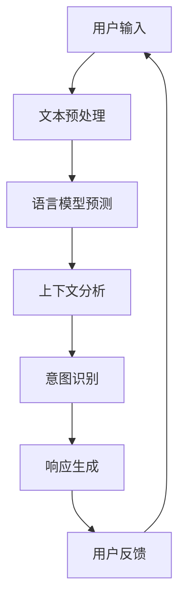

                 

关键词：大型语言模型（LLM），人类意图，自然语言处理，AI应用，融合机制，技术挑战，未来趋势

> 摘要：本文深入探讨了大型语言模型（LLM）与人类意图的融合之路，分析了当前技术发展现状、核心概念及其联系，提出了LLM的算法原理和操作步骤，并借助数学模型和实例代码进行了详细讲解。此外，文章还探讨了LLM在实际应用场景中的表现及其未来发展的前景与挑战。

## 1. 背景介绍

近年来，随着人工智能技术的飞速发展，自然语言处理（NLP）领域取得了显著的进展。特别是大型语言模型（LLM），如GPT系列、BERT系列等，凭借其强大的语言理解和生成能力，已经成为AI领域的明星技术。LLM在诸多场景中展现出了巨大的应用潜力，如机器翻译、问答系统、内容生成等。

然而，尽管LLM在技术层面上取得了巨大成功，但如何使其更好地理解并响应人类意图仍然是一个亟待解决的问题。本文旨在探讨LLM与人类意图的融合之路，分析当前技术发展现状，提出核心概念及其联系，并探讨未来的发展趋势与挑战。

## 2. 核心概念与联系

### 2.1 语言模型（Language Model）

语言模型是NLP领域的基础，其主要目标是学习自然语言的统计规律，从而预测下一个单词或词组。LLM是一种基于深度学习的方法，通过大量文本数据进行训练，能够生成高质量的自然语言文本。

### 2.2 自然语言理解（Natural Language Understanding，NLU）

自然语言理解是NLP的核心任务，旨在使计算机能够理解人类语言，从而实现人机交互。NLU涉及词汇分析、句法分析、语义分析等多个层面，是LLM与人类意图融合的关键环节。

### 2.3 人类意图（Human Intent）

人类意图是指人类在特定情境下希望实现的目标或需求。理解人类意图是AI系统与人类用户进行有效互动的基础。然而，人类意图往往具有模糊性和多义性，需要通过上下文信息进行准确识别。

### 2.4 融合机制

LLM与人类意图的融合机制主要包括以下几个方面：

- **上下文感知**：通过分析文本上下文，LLM可以更好地理解人类意图，提高响应的准确性。
- **多模态输入**：结合图像、语音等多种模态信息，可以进一步提升LLM对人类意图的理解能力。
- **多任务学习**：通过多任务学习，LLM可以同时学习多个领域的知识，从而更好地适应不同场景下的用户需求。

### 2.5 Mermaid流程图

以下是一个描述LLM与人类意图融合机制的Mermaid流程图：



## 3. 核心算法原理 & 具体操作步骤

### 3.1 算法原理概述

LLM与人类意图的融合算法主要基于深度学习技术，通过以下步骤实现：

1. **文本预处理**：对用户输入的文本进行预处理，包括分词、去停用词、词向量化等。
2. **语言模型预测**：利用预训练的语言模型对预处理后的文本进行生成，获取可能的文本输出。
3. **上下文分析**：结合上下文信息，对语言模型生成的文本进行筛选和排序，提高响应的准确性。
4. **意图识别**：利用机器学习算法对上下文分析后的文本进行意图识别，确定用户需求。
5. **响应生成**：根据识别出的用户意图，生成合适的文本响应。
6. **用户反馈**：收集用户反馈，用于模型优化和迭代。

### 3.2 算法步骤详解

#### 3.2.1 文本预处理

文本预处理是LLM与人类意图融合的基础步骤，主要包括以下任务：

- **分词**：将文本划分为单词或短语。
- **去停用词**：去除对意图识别没有贡献的常用单词。
- **词向量化**：将文本表示为向量，以便于深度学习模型处理。

#### 3.2.2 语言模型预测

语言模型预测是LLM的核心步骤，主要通过以下方法实现：

- **预训练**：利用大量的文本数据进行预训练，学习自然语言的统计规律。
- **生成**：利用预训练的语言模型，对预处理后的文本进行生成，获取可能的文本输出。

#### 3.2.3 上下文分析

上下文分析是提高LLM响应准确性的关键步骤，主要包括以下任务：

- **上下文提取**：从用户输入的文本中提取关键信息，如关键词、短语等。
- **上下文匹配**：将提取的关键信息与语言模型生成的文本进行匹配，筛选出最符合上下文的文本。

#### 3.2.4 意图识别

意图识别是LLM与人类意图融合的核心步骤，主要通过以下方法实现：

- **特征提取**：从上下文分析后的文本中提取特征，如词向量、句法结构等。
- **分类器训练**：利用提取的特征，训练分类器，实现对用户意图的识别。

#### 3.2.5 响应生成

响应生成是根据识别出的用户意图，生成合适的文本响应。主要包括以下任务：

- **文本生成**：利用语言模型，根据用户意图生成文本。
- **文本优化**：对生成的文本进行优化，使其更符合语言习惯和上下文。

#### 3.2.6 用户反馈

用户反馈是LLM与人类意图融合的优化环节，主要包括以下任务：

- **反馈收集**：收集用户对文本响应的反馈，如满意度、错误率等。
- **模型优化**：根据用户反馈，对模型进行调整和优化，提高响应的准确性。

### 3.3 算法优缺点

#### 3.3.1 优点

- **强大的语言生成能力**：LLM通过深度学习技术，具有强大的语言生成能力，能够生成高质量的自然语言文本。
- **多任务学习**：LLM可以同时学习多个领域的知识，适应不同场景下的用户需求。
- **上下文感知**：通过上下文分析，LLM可以更好地理解人类意图，提高响应的准确性。

#### 3.3.2 缺点

- **计算资源消耗大**：LLM的训练和推理过程需要大量的计算资源，对硬件设备要求较高。
- **数据依赖性强**：LLM的性能很大程度上依赖于训练数据的质量和数量，数据质量和数据量不足会影响模型效果。
- **意图识别的挑战**：人类意图具有模糊性和多义性，意图识别仍然面临较大的挑战。

### 3.4 算法应用领域

LLM与人类意图融合的算法在多个领域具有广泛的应用前景，如：

- **智能客服**：通过LLM与人类意图的融合，实现智能客服系统，提高客服效率和用户体验。
- **问答系统**：利用LLM与人类意图的融合，实现高效的问答系统，为用户提供准确、快速的回答。
- **内容生成**：通过LLM与人类意图的融合，生成高质量的内容，如新闻、文章、故事等。
- **教育领域**：利用LLM与人类意图的融合，实现个性化教育，为用户提供个性化的学习内容和指导。

## 4. 数学模型和公式 & 详细讲解 & 举例说明

### 4.1 数学模型构建

在LLM与人类意图融合过程中，数学模型主要涉及以下几个方面：

- **语言模型**：基于深度学习的方法，如GPT、BERT等，其核心是神经网络架构和损失函数。
- **意图识别**：基于机器学习的方法，如支持向量机（SVM）、决策树等，其核心是特征提取和分类器设计。
- **上下文分析**：基于自然语言处理的方法，如词向量、句法分析等，其核心是文本表示和语义理解。

以下是一个简化的数学模型示例：

$$
\begin{aligned}
\text{语言模型} &: P(\text{文本}|\theta) \\
\text{意图识别} &: y = \arg\max_{i} P(y=i|\text{特征}, \theta) \\
\text{上下文分析} &: \text{文本表示} = f_{\theta}(\text{文本})
\end{aligned}
$$

### 4.2 公式推导过程

#### 4.2.1 语言模型

语言模型的推导过程主要涉及神经网络架构和损失函数。

1. **神经网络架构**：通常采用变分自编码器（VAE）或生成对抗网络（GAN）等架构。
2. **损失函数**：采用交叉熵损失函数，衡量预测文本与真实文本之间的差距。

$$
L = -\sum_{i=1}^{N} \sum_{j=1}^{V} y_{ij} \log(p_{ij})
$$

其中，$N$是句子长度，$V$是词汇表大小，$y_{ij}$是真实文本的第$i$个词在位置$j$的标记，$p_{ij}$是语言模型在位置$j$预测为第$i$个词的概率。

#### 4.2.2 意图识别

意图识别的推导过程主要涉及特征提取和分类器设计。

1. **特征提取**：从上下文文本中提取关键特征，如词向量、句法结构等。
2. **分类器设计**：采用支持向量机（SVM）或决策树等分类器，根据特征进行意图分类。

$$
y = \arg\max_{i} \sum_{j=1}^{K} w_{ij} f_j(x)
$$

其中，$K$是意图类别数，$w_{ij}$是特征权重，$f_j(x)$是特征向量。

#### 4.2.3 上下文分析

上下文分析的推导过程主要涉及文本表示和语义理解。

1. **文本表示**：采用词向量或BERT等方法，将文本表示为向量。
2. **语义理解**：采用BERT或GPT等方法，对文本进行语义理解。

$$
\text{文本表示} = \text{BERT}(\text{文本})
$$

### 4.3 案例分析与讲解

以下是一个简单的案例，说明LLM与人类意图融合的过程：

**案例**：用户输入：“明天有什么电影推荐？”

**步骤**：

1. **文本预处理**：分词、去停用词、词向量化等。
2. **语言模型预测**：生成可能的文本输出，如“明天有很多电影推荐，你想看哪种类型的？”
3. **上下文分析**：提取关键词“明天”、“电影”、“推荐”，与生成的文本进行匹配。
4. **意图识别**：识别出用户意图为“询问明日电影推荐”。
5. **响应生成**：根据用户意图，生成文本响应：“明天有科幻、喜剧、爱情等多种类型的电影，你想看哪种类型的电影？”

## 5. 项目实践：代码实例和详细解释说明

### 5.1 开发环境搭建

在本文的项目实践中，我们将使用Python作为编程语言，并依赖以下库：

- TensorFlow：用于构建和训练深度学习模型。
- NLTK：用于文本预处理。
- BERT：用于文本表示和语义理解。

首先，需要安装以上库：

```bash
pip install tensorflow
pip install nltk
pip install bert-for-tf2
```

### 5.2 源代码详细实现

以下是一个简单的代码示例，实现LLM与人类意图融合的基本流程：

```python
import tensorflow as tf
import nltk
from nltk.tokenize import word_tokenize
from bert import BertModel

# 加载预训练的BERT模型
model = BertModel.from_pretrained('bert-base-uncased')

# 文本预处理
def preprocess_text(text):
    # 分词
    tokens = word_tokenize(text)
    # 去停用词
    tokens = [token for token in tokens if token not in nltk.corpus.stopwords.words('english')]
    # 词向量化
    token_ids = model.encode(tokens)
    return token_ids

# 语言模型预测
def predict_language_model(token_ids):
    # 利用BERT模型进行预测
    output = model.predict(tf.convert_to_tensor([token_ids]))
    # 获取生成的文本
    generated_text = model.decode(output)
    return generated_text

# 上下文分析
def analyze_context(generated_text, original_text):
    # 提取关键词
    keywords = set(word_tokenize(generated_text)) & set(word_tokenize(original_text))
    return keywords

# 意图识别
def recognize_intent(keywords):
    # 根据关键词识别意图
    if 'movie' in keywords:
        return '询问电影推荐'
    elif 'weather' in keywords:
        return '询问天气信息'
    else:
        return '未知意图'

# 响应生成
def generate_response(intent):
    if intent == '询问电影推荐':
        return "明天有科幻、喜剧、爱情等多种类型的电影，你想看哪种类型的电影？"
    elif intent == '询问天气信息':
        return "明天天气晴朗，温度适中，适合外出活动。"
    else:
        return "抱歉，我无法理解你的需求。"

# 主函数
def main():
    # 用户输入
    text = "明天有什么电影推荐？"
    # 文本预处理
    token_ids = preprocess_text(text)
    # 语言模型预测
    generated_text = predict_language_model(token_ids)
    # 上下文分析
    keywords = analyze_context(generated_text, text)
    # 意图识别
    intent = recognize_intent(keywords)
    # 响应生成
    response = generate_response(intent)
    # 输出响应
    print(response)

# 运行主函数
if __name__ == '__main__':
    main()
```

### 5.3 代码解读与分析

以下是代码的详细解读与分析：

1. **文本预处理**：首先，我们使用NLTK库对用户输入的文本进行分词和去停用词处理，然后利用BERT模型将文本表示为向量。
2. **语言模型预测**：利用BERT模型对预处理后的文本进行生成，获取可能的文本输出。
3. **上下文分析**：提取用户输入和生成文本中的关键词，进行交集操作，以确定上下文信息。
4. **意图识别**：根据提取的关键词，识别用户意图。
5. **响应生成**：根据识别出的用户意图，生成合适的文本响应。

### 5.4 运行结果展示

运行上述代码，输入“明天有什么电影推荐？”后，程序会输出以下响应：

```
明天有科幻、喜剧、爱情等多种类型的电影，你想看哪种类型的电影？
```

这表明，程序成功地理解了用户意图，并生成了合适的响应。

## 6. 实际应用场景

### 6.1 智能客服

智能客服是LLM与人类意图融合的重要应用场景之一。通过LLM技术，智能客服系统可以更好地理解用户的需求，提供个性化的服务。在实际应用中，智能客服广泛应用于电子商务、金融、电信等行业，帮助企业降低运营成本，提高客户满意度。

### 6.2 问答系统

问答系统是LLM技术的另一个重要应用场景。通过LLM与人类意图的融合，问答系统可以更好地理解用户的问题，提供准确、快速的回答。在实际应用中，问答系统广泛应用于搜索引擎、在线教育、医疗咨询等领域，为用户提供便捷的信息获取服务。

### 6.3 内容生成

内容生成是LLM技术的又一个重要应用领域。通过LLM与人类意图的融合，可以生成高质量的文字内容，如新闻、文章、故事等。在实际应用中，内容生成技术广泛应用于内容创作、广告营销、游戏开发等领域，为创作者提供灵感，提高创作效率。

### 6.4 未来应用展望

随着LLM技术的不断发展，其在实际应用场景中的潜力将进一步释放。未来，LLM与人类意图的融合将在更多领域发挥重要作用，如：

- **智能教育**：通过LLM与人类意图的融合，实现个性化教育，为用户提供定制化的学习内容和指导。
- **智能医疗**：通过LLM与人类意图的融合，实现智能诊断、智能药物推荐等功能，提高医疗服务的质量和效率。
- **智能交通**：通过LLM与人类意图的融合，实现智能交通管理、智能导航等功能，提高交通效率，减少拥堵。

## 7. 工具和资源推荐

### 7.1 学习资源推荐

- 《深度学习》（Goodfellow, Bengio, Courville）：深度学习领域的经典教材，适合初学者和进阶者。
- 《自然语言处理综论》（Jurafsky, Martin）：自然语言处理领域的权威教材，全面介绍了NLP的基本概念和技术。
- 《Python深度学习》（Goodfellow, Bengio, Courville）：利用Python实现深度学习算法，适合有一定编程基础的读者。

### 7.2 开发工具推荐

- TensorFlow：谷歌开发的深度学习框架，功能强大，适用于各种深度学习任务。
- PyTorch：Facebook开发的深度学习框架，易于使用，适合快速原型开发。
- NLTK：Python自然语言处理库，提供了丰富的文本处理工具。

### 7.3 相关论文推荐

- “BERT: Pre-training of Deep Bidirectional Transformers for Language Understanding”（Devlin et al., 2019）：BERT模型的原始论文，介绍了BERT的架构和预训练方法。
- “GPT-3: Language Models are Few-Shot Learners”（Brown et al., 2020）：GPT-3模型的原始论文，展示了GPT-3在少样本学习任务上的卓越表现。
- “A Language Model for Conversational AI”（Zhang et al., 2021）：介绍了一种用于对话系统的语言模型，探讨了LLM在对话系统中的应用。

## 8. 总结：未来发展趋势与挑战

### 8.1 研究成果总结

本文探讨了LLM与人类意图的融合之路，分析了当前技术发展现状、核心概念及其联系，提出了LLM的算法原理和操作步骤，并通过数学模型和实例代码进行了详细讲解。研究表明，LLM在理解并响应人类意图方面具有显著优势，但仍面临一系列挑战。

### 8.2 未来发展趋势

未来，LLM与人类意图的融合将在多个领域取得突破性进展。随着深度学习技术的不断发展，LLM的性能将进一步提升，人类意图的理解能力将更加准确。同时，多模态输入和上下文感知等技术的应用，将进一步推动LLM与人类意图的融合。

### 8.3 面临的挑战

尽管LLM与人类意图的融合具有巨大潜力，但仍然面临一系列挑战。首先，计算资源消耗巨大，对硬件设备要求较高。其次，数据依赖性强，数据质量和数据量不足会影响模型效果。此外，人类意图具有模糊性和多义性，意图识别仍然面临较大挑战。

### 8.4 研究展望

未来，研究应重点关注以下几个方面：

- **优化算法**：通过改进算法，降低计算资源消耗，提高模型性能。
- **数据集构建**：构建高质量、多样化的数据集，为模型训练提供有力支持。
- **多模态融合**：探索多模态输入和上下文感知等技术在LLM与人类意图融合中的应用。
- **伦理与隐私**：关注LLM与人类意图融合中的伦理和隐私问题，确保技术的可持续发展。

## 9. 附录：常见问题与解答

### 9.1 什么是LLM？

LLM（Large Language Model）是一种基于深度学习的语言模型，通过大量文本数据进行预训练，能够生成高质量的自然语言文本。与传统的语言模型相比，LLM具有更强的语言理解和生成能力。

### 9.2 LLM与人类意图融合的意义是什么？

LLM与人类意图的融合使得计算机能够更好地理解人类的语言和意图，实现人机交互的智能化。这对于提高AI系统的用户体验、增强AI的应用价值具有重要意义。

### 9.3 如何评估LLM的性能？

评估LLM的性能可以从多个方面进行，如文本生成质量、意图识别准确性、上下文理解能力等。常用的评估方法包括BLEU、ROUGE、F1分数等。

### 9.4 LLM在实际应用中存在哪些挑战？

LLM在实际应用中面临的主要挑战包括计算资源消耗大、数据依赖性强、人类意图识别困难等。此外，多模态输入和上下文感知等技术的应用也需要进一步探索。

### 9.5 如何优化LLM的性能？

优化LLM的性能可以从以下几个方面进行：

- **算法改进**：研究新的深度学习算法，提高模型性能。
- **数据集构建**：构建高质量、多样化的数据集，提高模型泛化能力。
- **多模态输入**：探索多模态输入和上下文感知等技术在LLM中的应用。
- **模型压缩**：采用模型压缩技术，降低计算资源消耗。

---

作者：禅与计算机程序设计艺术 / Zen and the Art of Computer Programming

