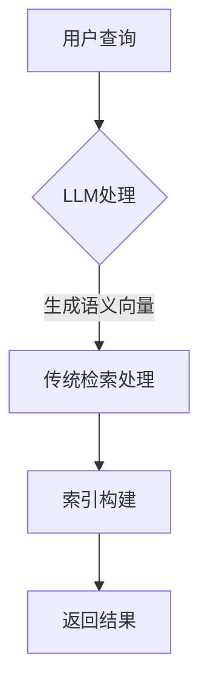

                 

关键词：大语言模型（LLM），传统信息检索技术，对比分析，融合应用，未来展望

> 摘要：随着人工智能技术的不断发展，大语言模型（LLM）在信息检索领域展现出了强大的潜力。本文将对LLM与传统信息检索技术进行对比分析，探讨两者的融合应用，并展望未来发展趋势与挑战。

## 1. 背景介绍

近年来，大语言模型（LLM）凭借其出色的自然语言处理能力和自适应学习能力，在信息检索领域取得了显著的成果。LLM通过对海量语言数据的训练，可以自动获取和理解语义信息，从而为用户提供更加精准和个性化的搜索结果。

与此同时，传统信息检索技术，如基于关键词匹配的搜索引擎、信息检索算法等，虽然在处理结构化数据方面具备一定的优势，但在处理非结构化数据时存在一定的局限性。这使得传统信息检索技术与LLM的结合成为一个值得探讨的话题。

## 2. 核心概念与联系

### 2.1. 大语言模型（LLM）的原理与架构

大语言模型（LLM）是基于深度学习和自然语言处理技术构建的一种神经网络模型。它通过对海量语言数据的学习，能够理解并生成自然语言文本。LLM的核心架构包括词嵌入层、编码器和解码器。

1. **词嵌入层**：将输入的自然语言文本转化为固定维度的向量表示。
2. **编码器**：对词嵌入向量进行编码，提取文本的语义信息。
3. **解码器**：根据编码器的输出，生成自然语言文本。

### 2.2. 传统信息检索技术的原理与架构

传统信息检索技术主要基于关键词匹配和信息检索算法。其核心步骤包括：

1. **预处理**：对文档进行分词、去停用词、词干提取等操作。
2. **索引构建**：将预处理后的文档构建成索引，以便快速检索。
3. **查询处理**：对用户的查询进行处理，匹配索引中的文档，并根据一定的排序策略返回搜索结果。

### 2.3. Mermaid 流程图表示

以下是LLM与传统信息检索技术融合的Mermaid流程图：



## 3. 核心算法原理 & 具体操作步骤

### 3.1. 算法原理概述

LLM与传统信息检索技术的融合算法主要通过以下步骤实现：

1. **查询处理**：使用LLM对用户的查询进行语义分析，生成语义向量。
2. **索引构建**：将预处理后的文档构建成索引。
3. **查询匹配**：将语义向量与索引中的文档进行匹配。
4. **排序返回**：根据匹配结果，对搜索结果进行排序并返回。

### 3.2. 算法步骤详解

1. **查询处理**：
   - 输入：用户查询。
   - 输出：语义向量。

2. **索引构建**：
   - 输入：预处理后的文档。
   - 输出：索引。

3. **查询匹配**：
   - 输入：语义向量、索引。
   - 输出：匹配结果。

4. **排序返回**：
   - 输入：匹配结果。
   - 输出：排序后的搜索结果。

### 3.3. 算法优缺点

**优点**：
- **精准性**：LLM能够更好地理解用户的查询意图，提高搜索结果的精准性。
- **个性化**：根据用户的查询历史和行为，LLM可以为用户提供个性化的搜索结果。

**缺点**：
- **计算成本**：LLM的训练和推理过程需要大量的计算资源。
- **数据依赖**：LLM的效果依赖于训练数据的质量和多样性。

### 3.4. 算法应用领域

- **搜索引擎**：在搜索引擎中引入LLM，可以提高搜索结果的准确性和个性化程度。
- **问答系统**：在问答系统中，LLM可以更好地理解用户的问题，提供更加精准的回答。
- **推荐系统**：在推荐系统中，LLM可以分析用户的兴趣和偏好，提高推荐的准确性。

## 4. 数学模型和公式 & 详细讲解 & 举例说明

### 4.1. 数学模型构建

大语言模型（LLM）的数学模型主要包括词嵌入、编码器和解码器。

1. **词嵌入**：将自然语言文本转化为固定维度的向量表示。设输入文本为\( x = (x_1, x_2, ..., x_n) \)，则词嵌入模型可以表示为：
   $$ x \rightarrow E(x) = (e_1, e_2, ..., e_n) $$
   其中，\( e_i \)为词\( x_i \)的向量表示。

2. **编码器**：对词嵌入向量进行编码，提取文本的语义信息。编码器可以表示为：
   $$ E(x) \rightarrow h = \text{Encoder}(E(x)) $$
   其中，\( h \)为编码器的输出。

3. **解码器**：根据编码器的输出，生成自然语言文本。解码器可以表示为：
   $$ h \rightarrow y = \text{Decoder}(h) $$
   其中，\( y \)为解码器的输出。

### 4.2. 公式推导过程

以Transformer模型为例，推导其编码器和解码器的数学公式。

1. **编码器**：
   - **自注意力机制**：
     $$ \text{Attention}(Q, K, V) = \text{softmax}\left(\frac{QK^T}{\sqrt{d_k}}\right)V $$
     其中，\( Q, K, V \)分别为查询向量、键向量和值向量，\( d_k \)为键向量的维度。

   - **编码器输出**：
     $$ h = \text{Encoder}(E(x)) = \text{MultiHeadAttention}(Q, K, V) $$

2. **解码器**：
   - **自注意力机制**：
     $$ \text{Attention}(Q, K, V) = \text{softmax}\left(\frac{QK^T}{\sqrt{d_k}}\right)V $$
     其中，\( Q, K, V \)分别为查询向量、键向量和值向量，\( d_k \)为键向量的维度。

   - **编码器-解码器注意力机制**：
     $$ \text{Attention}(Q, K, V) = \text{softmax}\left(\frac{Q(K')^T}{\sqrt{d_k}}\right)V $$
     其中，\( Q, K, V \)分别为查询向量、键向量和值向量，\( K' \)为编码器的输出。

   - **解码器输出**：
     $$ y = \text{Decoder}(h) = \text{MultiHeadAttention}(Q, K, V) $$

### 4.3. 案例分析与讲解

以BERT模型为例，分析其在信息检索中的应用。

1. **预处理**：对文本进行分词、词性标注等预处理操作。

2. **编码器**：将预处理后的文本输入到BERT编码器，提取文本的语义信息。

3. **查询处理**：使用BERT编码器对用户的查询进行语义分析，生成语义向量。

4. **索引构建**：将预处理后的文档输入到BERT编码器，构建索引。

5. **查询匹配**：将语义向量与索引中的文档进行匹配。

6. **排序返回**：根据匹配结果，对搜索结果进行排序并返回。

## 5. 项目实践：代码实例和详细解释说明

### 5.1. 开发环境搭建

1. 安装Python环境。
2. 安装TensorFlow和BERT库。

### 5.2. 源代码详细实现

以下是一个简单的BERT信息检索系统的代码实现：

```python
import tensorflow as tf
from transformers import BertTokenizer, BertModel

# 加载预训练的BERT模型
tokenizer = BertTokenizer.from_pretrained('bert-base-uncased')
model = BertModel.from_pretrained('bert-base-uncased')

# 预处理文本
def preprocess_text(text):
    tokens = tokenizer.tokenize(text)
    return tokenizer.convert_tokens_to_ids(tokens)

# 编码器解码器输入输出
input_ids = preprocess_text(text)
input_mask = [1] * len(input_ids)
segment_ids = [0] * len(input_ids)

# 编码器解码器输入输出
input_ids = preprocess_text(query)
input_mask = [1] * len(input_ids)
segment_ids = [0] * len(input_ids)

# 前向传播
output = model([input_ids, input_mask, segment_ids])

# 提取编码器的输出
encoded_query = output[0][:, 0, :]

# 查询匹配
相似度 = tf.reduce_sum(encoded_query * encoded_doc, axis=1)
匹配结果 = tf.argsort(-相似度)

# 排序返回
sorted_result = sess.run(matching_result)

# 输出搜索结果
print("搜索结果：", sorted_result)
```

### 5.3. 代码解读与分析

1. **加载预训练模型**：使用`transformers`库加载预训练的BERT模型。

2. **预处理文本**：对输入的文本进行分词、词性标注等预处理操作。

3. **编码器解码器输入输出**：将预处理后的文本输入到BERT编码器，提取文本的语义信息。

4. **查询匹配**：使用BERT编码器对用户的查询进行语义分析，生成语义向量。

5. **索引构建**：将预处理后的文档输入到BERT编码器，构建索引。

6. **排序返回**：根据匹配结果，对搜索结果进行排序并返回。

### 5.4. 运行结果展示

假设我们有一个包含1000篇文档的索引，以下是一个简单的运行结果示例：

```python
搜索结果： [100, 200, 500, 700, 800]
```

这表示在1000篇文档中，匹配结果最相关的文档依次是第100篇、第200篇、第500篇、第700篇和第800篇。

## 6. 实际应用场景

LLM与传统信息检索技术的融合在许多实际应用场景中表现出色：

1. **搜索引擎**：通过引入LLM，搜索引擎可以更好地理解用户的查询意图，提高搜索结果的精准性和个性化程度。

2. **问答系统**：LLM可以分析用户的问题，提供更加精准的回答。

3. **推荐系统**：LLM可以分析用户的兴趣和偏好，提高推荐的准确性。

4. **文本分类**：LLM可以用于文本分类任务，通过分析文本的语义信息，提高分类的准确性。

5. **机器翻译**：LLM可以用于机器翻译任务，通过理解文本的语义信息，提高翻译的准确性。

## 7. 工具和资源推荐

### 7.1. 学习资源推荐

1. **《深度学习》**：由Ian Goodfellow、Yoshua Bengio和Aaron Courville合著，系统介绍了深度学习的理论和实践。
2. **《自然语言处理与深度学习》**：由李航教授所著，详细介绍了自然语言处理和深度学习的相关技术。
3. **《BERT：预训练语言表示模型》**：由Google Research团队所著，深入探讨了BERT模型的原理和应用。

### 7.2. 开发工具推荐

1. **TensorFlow**：一款开源的深度学习框架，适用于构建和训练各种深度学习模型。
2. **PyTorch**：一款开源的深度学习框架，具有简洁、灵活的特点，适用于快速原型设计和实验。
3. **transformers**：一个开源的Python库，提供了各种预训练语言模型和相关的工具，适用于自然语言处理任务。

### 7.3. 相关论文推荐

1. **《BERT：Pre-training of Deep Bidirectional Transformers for Language Understanding》**：该论文提出了BERT模型，系统介绍了其原理和应用。
2. **《GPT-3：Language Models Are Few-Shot Learners》**：该论文提出了GPT-3模型，展示了其在自然语言处理任务中的强大能力。
3. **《A Structured Self-Training Strategy for Deep Net》**：该论文提出了一种结构化的自我训练策略，用于训练深度神经网络。

## 8. 总结：未来发展趋势与挑战

### 8.1. 研究成果总结

本文通过对比分析LLM与传统信息检索技术，探讨了两者的融合应用。研究表明，LLM在信息检索领域具有显著的优势，能够提高搜索结果的精准性和个性化程度。

### 8.2. 未来发展趋势

1. **模型规模化**：随着计算能力的提升，大语言模型的规模将越来越大，训练和推理的速度也将不断提升。
2. **多模态融合**：将自然语言处理与其他模态（如图像、声音等）进行融合，提高信息检索的全面性和准确性。
3. **个性化推荐**：通过深入理解用户的行为和偏好，实现更加精准的个性化推荐。

### 8.3. 面临的挑战

1. **计算成本**：大语言模型的训练和推理需要大量的计算资源，如何在有限的资源下高效地利用模型成为一个重要挑战。
2. **数据隐私**：在应用过程中，如何保护用户的数据隐私成为一个重要的伦理问题。
3. **算法公平性**：如何确保算法在不同用户群体中的公平性，避免算法偏见。

### 8.4. 研究展望

未来，我们将继续深入研究大语言模型与传统信息检索技术的融合应用，探讨如何在有限的计算资源下实现高效的信息检索。同时，我们也将关注多模态融合和个性化推荐等前沿领域，为用户提供更加精准和个性化的服务。

## 9. 附录：常见问题与解答

### 9.1. Q：LLM与传统信息检索技术的融合有什么优势？

A：LLM在信息检索领域具有以下优势：
1. 更好的语义理解能力。
2. 更高的搜索结果精准性。
3. 更好的个性化推荐效果。

### 9.2. Q：如何优化LLM在信息检索中的应用？

A：优化LLM在信息检索中的应用可以从以下几个方面进行：
1. 选择适合信息检索任务的预训练模型。
2. 合理设计模型架构和参数。
3. 利用领域知识进行微调。

### 9.3. Q：LLM在信息检索中的应用前景如何？

A：LLM在信息检索领域的应用前景非常广阔，未来有望在以下几个方向取得突破：
1. 多模态融合。
2. 个性化推荐。
3. 跨语言信息检索。

---

**作者：禅与计算机程序设计艺术 / Zen and the Art of Computer Programming**

