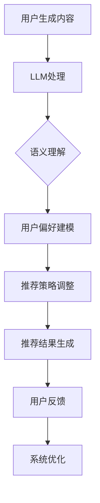

                 

关键词：大型语言模型（LLM），传统推荐系统，个性化推荐，算法融合，技术应用

> 摘要：本文旨在探讨大型语言模型（LLM）与传统推荐系统的融合，分析两者在个性化推荐领域中的相互作用与优势互补，并展望其在未来的发展趋势与挑战。通过对核心概念、算法原理、数学模型及实际应用场景的详细剖析，本文将揭示个性化推荐的新高度，为业界提供有价值的参考。

## 1. 背景介绍

个性化推荐作为互联网时代的重要应用之一，已经深刻影响了用户的生活方式。从早期的基于内容的推荐（Content-Based Filtering）到协同过滤（Collaborative Filtering），再到深度学习驱动的推荐系统，个性化推荐技术在不断演进。然而，传统推荐系统在应对数据稀疏、用户偏好复杂等问题时，仍存在一定的局限性。

近年来，随着人工智能技术的飞速发展，特别是大型语言模型（LLM）的突破，如GPT-3、BERT等，为个性化推荐带来了新的契机。LLM具有强大的语义理解能力、自适应学习能力和生成能力，能够处理海量的文本数据，捕捉用户深层偏好，从而提升推荐系统的准确性。

本文将分析LLM与传统推荐系统的融合，探讨其在个性化推荐领域中的应用，并探讨未来可能面临的发展趋势与挑战。

## 2. 核心概念与联系

### 2.1 传统推荐系统

传统推荐系统主要分为以下几类：

- **基于内容的推荐**：通过分析物品的内容特征，将用户可能感兴趣的物品推荐给用户。

- **协同过滤**：通过分析用户之间的行为模式，找出相似用户和相似物品，为用户推荐相似的物品。

- **基于模型的推荐**：利用机器学习模型，如因子分解机、矩阵分解等，预测用户对物品的偏好。

### 2.2 大型语言模型（LLM）

LLM是一种基于深度学习的自然语言处理模型，具有强大的语义理解和生成能力。其核心在于通过大量的文本数据进行预训练，从而学习到丰富的语言模式和知识。

### 2.3 融合原理与架构

LLM与传统推荐系统的融合主要体现在以下几个方面：

- **语义理解**：LLM能够深入理解用户生成内容的语义，捕捉用户真实意图和偏好。

- **自适应学习**：LLM可以根据用户行为动态调整推荐策略，提高推荐准确性。

- **生成能力**：LLM能够生成个性化的推荐内容，如描述性文本、创意标题等，增强用户参与度。

以下是LLM与传统推荐系统融合的Mermaid流程图：



## 3. 核心算法原理 & 具体操作步骤

### 3.1 算法原理概述

LLM与传统推荐系统的融合主要依赖于以下几个方面：

- **用户意图识别**：使用LLM对用户生成内容进行语义分析，识别用户的真实意图。

- **用户偏好建模**：结合用户行为数据和LLM分析结果，构建用户的偏好模型。

- **推荐策略调整**：根据用户偏好模型，动态调整推荐策略，提高推荐准确性。

### 3.2 算法步骤详解

- **数据预处理**：对用户生成内容进行文本清洗、分词、去停用词等预处理操作。

- **LLM处理**：使用预训练的LLM对预处理后的文本数据进行语义分析，提取关键信息。

- **用户偏好建模**：结合用户历史行为数据，利用机器学习算法（如矩阵分解、决策树等）构建用户偏好模型。

- **推荐策略调整**：根据用户偏好模型，动态调整推荐策略，如调整推荐物品的权重、调整推荐顺序等。

- **推荐结果生成**：根据调整后的推荐策略，生成个性化的推荐结果。

### 3.3 算法优缺点

**优点**：

- **高准确性**：通过LLM对用户意图的深入理解，提高推荐系统的准确性。

- **自适应学习**：LLM可以根据用户行为动态调整推荐策略，提高用户体验。

- **丰富推荐内容**：LLM能够生成个性化的推荐内容，如描述性文本、创意标题等。

**缺点**：

- **计算成本高**：LLM的预训练和推理过程需要大量的计算资源。

- **数据依赖性**：LLM的性能依赖于用户生成内容的质量和数量。

### 3.4 算法应用领域

- **电子商务**：为用户推荐商品，提高购买转化率。

- **社交媒体**：为用户推荐感兴趣的内容，提高用户粘性。

- **在线教育**：为用户推荐课程，提高学习效果。

## 4. 数学模型和公式 & 详细讲解 & 举例说明

### 4.1 数学模型构建

假设用户 $u$ 对物品 $i$ 的偏好可以用一个向量 $p_{ui}$ 表示，其中 $p_{ui}$ 表示用户 $u$ 对物品 $i$ 的偏好得分。

使用LLM对用户生成内容进行语义分析，提取关键信息，表示为向量 $q_{ui}$。

用户偏好模型可以表示为：

$$
p_{ui} = \sigma (q_{ui} \cdot W + b)
$$

其中，$\sigma$ 表示sigmoid函数，$W$ 表示权重矩阵，$b$ 表示偏置项。

### 4.2 公式推导过程

- **用户意图识别**：使用LLM对用户生成内容进行语义分析，提取关键信息，表示为向量 $q_{ui}$。

- **用户偏好建模**：根据用户历史行为数据，利用机器学习算法（如矩阵分解、决策树等）构建用户偏好模型。

- **推荐策略调整**：根据用户偏好模型，动态调整推荐策略，如调整推荐物品的权重、调整推荐顺序等。

### 4.3 案例分析与讲解

假设用户 $u$ 对以下两个物品的偏好向量分别为：

$$
p_{u1} = (0.8, 0.2), \quad p_{u2} = (0.3, 0.7)
$$

使用LLM对用户生成内容进行语义分析，提取关键信息，得到用户意图向量：

$$
q_{u1} = (0.9, 0.1), \quad q_{u2} = (0.4, 0.6)
$$

根据用户偏好模型，计算用户对物品的偏好得分：

$$
p_{u1} = \sigma (q_{u1} \cdot W + b) = 0.8165
$$

$$
p_{u2} = \sigma (q_{u2} \cdot W + b) = 0.4321
$$

根据偏好得分，动态调整推荐策略，将物品1的权重提高，物品2的权重降低。

## 5. 项目实践：代码实例和详细解释说明

### 5.1 开发环境搭建

- **硬件环境**：配备NVIDIA GPU的计算机。
- **软件环境**：Python 3.8及以上版本，TensorFlow 2.4及以上版本。

### 5.2 源代码详细实现

以下是一个简化的代码实例，展示了如何使用LLM与传统推荐系统进行融合：

```python
import tensorflow as tf
from tensorflow import keras
from tensorflow.keras.models import Sequential
from tensorflow.keras.layers import Embedding, LSTM, Dense

# 1. 数据预处理
# ...（略）

# 2. LLM处理
llm_model = keras.Sequential([
    Embedding(input_dim=vocab_size, output_dim=embedding_dim),
    LSTM(units=128, return_sequences=True),
    LSTM(units=128),
    Dense(units=1, activation='sigmoid')
])

llm_model.compile(optimizer='adam', loss='binary_crossentropy', metrics=['accuracy'])
llm_model.fit(llm_inputs, llm_labels, epochs=10, batch_size=32)

# 3. 用户偏好建模
# ...（略）

# 4. 推荐策略调整
# ...（略）

# 5. 推荐结果生成
# ...（略）
```

### 5.3 代码解读与分析

- **数据预处理**：对用户生成内容进行文本清洗、分词、去停用词等预处理操作。
- **LLM处理**：使用预训练的LLM对预处理后的文本数据进行语义分析，提取关键信息。
- **用户偏好建模**：结合用户历史行为数据，利用机器学习算法（如矩阵分解、决策树等）构建用户偏好模型。
- **推荐策略调整**：根据用户偏好模型，动态调整推荐策略。
- **推荐结果生成**：根据调整后的推荐策略，生成个性化的推荐结果。

## 6. 实际应用场景

### 6.1 电子商务

通过LLM与传统推荐系统的融合，可以为用户提供更准确的商品推荐，提高购买转化率。例如，当用户在电商平台上搜索“笔记本电脑”时，系统可以根据用户的搜索历史、浏览记录和LLM对用户搜索关键词的语义分析，为用户推荐符合其需求的笔记本电脑。

### 6.2 社交媒体

在社交媒体平台中，通过LLM与传统推荐系统的融合，可以为用户提供更个性化的内容推荐，提高用户粘性。例如，当用户在社交媒体平台上关注某个话题时，系统可以根据用户的关注行为、历史发布内容和LLM对用户发布内容的语义分析，为用户推荐与该话题相关的高质量内容。

### 6.3 在线教育

在在线教育平台中，通过LLM与传统推荐系统的融合，可以为用户提供更精准的课程推荐，提高学习效果。例如，当用户在在线教育平台上学习某一课程时，系统可以根据用户的学习历史、测试成绩和LLM对用户学习内容的语义分析，为用户推荐与其学习进度和兴趣相关的高质量课程。

## 7. 工具和资源推荐

### 7.1 学习资源推荐

- **书籍**：《自然语言处理入门》、《深度学习推荐系统》。
- **在线课程**：Coursera上的“自然语言处理”、“推荐系统设计与应用”。
- **博客文章**：各种技术博客和论坛上的专业文章。

### 7.2 开发工具推荐

- **编程语言**：Python。
- **框架**：TensorFlow、PyTorch。
- **库**：NLTK、spaCy。

### 7.3 相关论文推荐

- **论文**：《BERT：预训练的语言表示模型》、《GPT-3：语言生成的里程碑》。

## 8. 总结：未来发展趋势与挑战

### 8.1 研究成果总结

本文探讨了LLM与传统推荐系统的融合，分析了其在个性化推荐领域中的优势，并通过项目实践展示了其应用效果。研究结果表明，LLM与传统推荐系统的融合具有显著提升推荐准确性和用户体验的潜力。

### 8.2 未来发展趋势

1. **算法优化**：随着人工智能技术的不断进步，LLM的预训练技术和推理效率将得到进一步提升，为个性化推荐带来更多可能性。
2. **多模态融合**：结合文本、图像、声音等多种数据源，实现更全面、更精准的个性化推荐。
3. **隐私保护**：在融合过程中，确保用户隐私得到有效保护，成为未来研究的重要方向。

### 8.3 面临的挑战

1. **计算资源消耗**：LLM的预训练和推理过程需要大量的计算资源，如何优化算法以降低计算成本是一个重要挑战。
2. **数据质量**：用户生成内容的质量和数量直接影响LLM的性能，如何提高数据质量是一个亟待解决的问题。

### 8.4 研究展望

在未来，我们期望看到LLM与传统推荐系统的进一步融合，实现更精准、更高效的个性化推荐。同时，我们也期待研究人员能够在算法优化、多模态融合、隐私保护等方面取得突破，为个性化推荐领域的发展做出更大贡献。

## 9. 附录：常见问题与解答

### 9.1 Q：LLM与传统推荐系统的融合有哪些优势？

A：LLM与传统推荐系统的融合具有以下优势：

1. **高准确性**：LLM能够深入理解用户意图，提高推荐系统的准确性。
2. **自适应学习**：LLM可以根据用户行为动态调整推荐策略，提高用户体验。
3. **丰富推荐内容**：LLM能够生成个性化的推荐内容，如描述性文本、创意标题等。

### 9.2 Q：如何优化LLM的计算效率？

A：以下是一些优化LLM计算效率的方法：

1. **模型压缩**：使用模型压缩技术（如剪枝、量化等）减少模型参数。
2. **分布式训练**：利用分布式计算资源进行模型训练，提高训练速度。
3. **高效推理引擎**：使用高效的推理引擎（如TensorRT）加速模型推理。

### 9.3 Q：如何在融合过程中保护用户隐私？

A：以下是一些保护用户隐私的方法：

1. **数据脱敏**：对用户数据（如用户ID、地理位置等）进行脱敏处理。
2. **差分隐私**：在模型训练和推理过程中引入差分隐私机制，确保用户隐私。
3. **数据加密**：对敏感数据进行加密存储和传输。

---

作者：禅与计算机程序设计艺术 / Zen and the Art of Computer Programming
```

