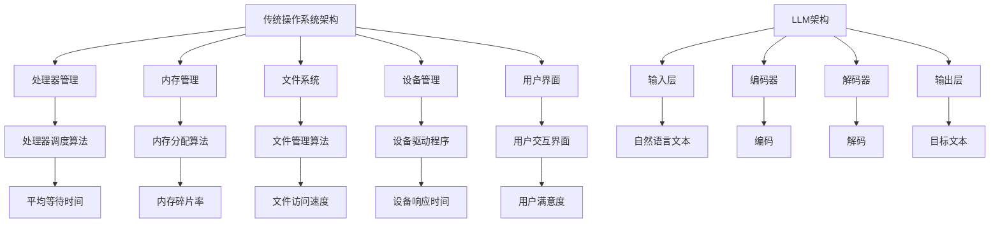

                 

关键词：语言模型，传统操作系统，对比分析，技术架构，算法原理，应用场景，发展趋势。

> 摘要：本文将从多个维度对比分析语言模型（LLM）与传统操作系统，探讨两者的技术架构、核心算法原理、数学模型以及实际应用场景，为读者提供一个全面的技术视角，同时展望未来的发展趋势与挑战。

## 1. 背景介绍

随着计算机技术的飞速发展，操作系统作为计算机系统的核心，扮演着至关重要的角色。传统操作系统如Unix、Windows、Linux等，历经数十年的发展，已经成为工业界的标准。然而，近年来，人工智能技术的崛起，尤其是语言模型（LLM）的迅猛发展，为计算机系统带来了全新的变革。

语言模型是一种能够对自然语言文本进行理解和生成的模型。通过大规模的数据训练，LLM能够学习到语言的统计规律和语义信息，从而实现自然语言的理解、生成和交互。LLM的核心算法包括深度学习、自然语言处理（NLP）等技术，其应用场景广泛，如搜索引擎、智能客服、机器翻译、文本生成等。

本文将通过对LLM与传统操作系统的对比分析，揭示两者在技术架构、核心算法原理、数学模型以及实际应用场景等方面的差异，旨在为读者提供一个全面的技术视角，同时探讨未来的发展趋势与挑战。

## 2. 核心概念与联系

### 2.1. 技术架构

#### 传统操作系统架构

传统操作系统通常包括以下几个核心组件：处理器管理、内存管理、文件系统、设备管理、用户界面等。这些组件共同协作，实现计算机系统的正常运行。传统操作系统的架构多为分层设计，每一层负责特定的功能，从而实现模块化和可扩展性。

#### LLM架构

LLM的架构则更加复杂，包括输入层、编码器、解码器、输出层等多个层次。输入层负责接收自然语言文本，编码器将文本转换为稠密表示，解码器则从稠密表示中生成目标文本。LLM的架构通常基于神经网络，如变换器（Transformer）等，这些网络通过大规模数据训练，能够学习到语言的复杂结构。

### 2.2. 核心算法原理

#### 传统操作系统算法原理

传统操作系统的核心算法主要涉及处理器调度、内存分配、文件管理、设备驱动等方面。例如，处理器调度算法如时间片轮转、优先级调度等，用于优化处理器资源的利用。内存分配算法如分页、分段等，用于管理系统的内存资源。

#### LLM算法原理

LLM的核心算法主要涉及深度学习、自然语言处理（NLP）等方面。深度学习算法如卷积神经网络（CNN）、循环神经网络（RNN）、长短期记忆网络（LSTM）等，用于处理复杂的非线性关系。NLP算法如词向量、词嵌入、语言模型等，用于理解自然语言的语义信息。

### 2.3. 数学模型和公式

#### 传统操作系统数学模型

传统操作系统的数学模型主要涉及概率论、图论、优化算法等方面。例如，处理器调度算法中的平均等待时间、响应时间等指标，可以通过概率模型进行优化。文件管理中的索引结构、B树等数据结构，也可以通过数学模型进行优化。

#### LLM数学模型

LLM的数学模型主要涉及深度学习中的损失函数、优化算法等方面。例如，在训练过程中，常用的损失函数包括交叉熵损失、均方误差等，用于衡量预测结果与真实结果之间的差距。优化算法如随机梯度下降（SGD）、Adam等，用于调整网络参数，优化模型性能。

### 2.4. Mermaid流程图

以下是一个简化的传统操作系统和LLM的流程图，展示了两者在技术架构、核心算法原理、数学模型等方面的联系：



## 3. 核心算法原理 & 具体操作步骤

### 3.1. 算法原理概述

#### 传统操作系统算法原理

传统操作系统的算法原理主要涉及处理器调度、内存管理、文件管理、设备驱动等方面。例如，处理器调度算法的核心目标是优化处理器资源的利用，提高系统的吞吐量和响应时间。内存管理算法的核心目标是高效地分配和回收内存资源，避免内存碎片和溢出。文件管理算法的核心目标是实现文件的高效存储和检索，提高系统的文件访问速度。设备驱动程序的核心目标是实现设备的驱动和管理，提高设备的响应时间和稳定性。

#### LLM算法原理

LLM的算法原理主要涉及深度学习、自然语言处理（NLP）等方面。深度学习算法的核心目标是学习输入数据的特征表示，通过多层神经网络的组合，实现复杂函数的拟合。NLP算法的核心目标是理解自然语言的语义信息，实现文本的理解、生成和交互。例如，语言模型通过训练，可以学习到文本的统计规律和语义信息，从而实现文本的生成和理解。

### 3.2. 算法步骤详解

#### 传统操作系统算法步骤详解

1. **处理器调度算法：**
   - 收集系统中的进程信息，如进程的优先级、执行时间、资源需求等。
   - 根据调度策略（如时间片轮转、优先级调度等），选择下一个执行的进程。
   - 更新进程的状态，如执行时间、剩余时间、资源分配等。

2. **内存管理算法：**
   - 分配内存给新创建的进程，通常使用分页或分段技术。
   - 回收进程释放的内存，避免内存碎片。
   - 实现内存的动态扩展和收缩，以满足进程的内存需求。

3. **文件管理算法：**
   - 创建、删除、修改文件，实现文件的高效存储和检索。
   - 实现文件的索引结构，如B树、哈希表等，提高文件的访问速度。
   - 实现文件的权限控制，如访问控制列表（ACL）、用户权限管理等。

4. **设备驱动程序：**
   - 实现设备的初始化和配置，如设置设备的驱动程序、中断处理程序等。
   - 实现设备的输入输出操作，如读写设备数据、控制设备状态等。
   - 实现设备的错误处理和恢复，如设备故障、数据损坏等。

#### LLM算法步骤详解

1. **输入层：**
   - 接收自然语言文本，将其转换为稠密表示。

2. **编码器：**
   - 对稠密表示进行编码，提取文本的特征信息。

3. **解码器：**
   - 从编码后的特征信息中解码出目标文本。

4. **输出层：**
   - 输出解码后的目标文本，实现文本的生成和理解。

### 3.3. 算法优缺点

#### 传统操作系统算法优缺点

- **优点：**
  - 经验丰富，算法稳定，适用于复杂多变的实际场景。
  - 调度策略多样，可根据不同场景进行优化。
  - 内存管理、文件管理、设备驱动等方面都有成熟的解决方案。

- **缺点：**
  - 算法复杂，难以实现动态调整和优化。
  - 需要大量的硬件资源和维护成本。
  - 难以适应新兴的智能场景和需求。

#### LLM算法优缺点

- **优点：**
  - 基于深度学习，算法模型灵活，可适应各种场景。
  - 通过大规模数据训练，能够学习到语言的复杂结构。
  - 易于实现自动化和智能化，适用于智能场景和需求。

- **缺点：**
  - 训练数据需求大，计算资源消耗高。
  - 模型可解释性较差，难以理解决策过程。
  - 需要不断更新和优化，以适应不断变化的需求。

### 3.4. 算法应用领域

#### 传统操作系统算法应用领域

- **处理器调度算法：**
  - 在服务器、数据中心等领域，优化处理器资源的利用。
  - 在嵌入式系统、实时系统等领域，实现高效的处理器调度。

- **内存管理算法：**
  - 在服务器、数据中心等领域，实现高效内存分配和回收。
  - 在嵌入式系统、实时系统等领域，优化内存资源的使用。

- **文件管理算法：**
  - 在文件服务器、分布式存储等领域，实现高效文件存储和检索。
  - 在数据库系统、数据挖掘等领域，优化文件访问速度。

- **设备驱动程序：**
  - 在操作系统与硬件设备之间建立通信桥梁，实现设备的驱动和管理。
  - 在嵌入式系统、物联网等领域，实现设备的自动化控制。

#### LLM算法应用领域

- **自然语言处理：**
  - 在搜索引擎、智能客服、机器翻译等领域，实现文本的生成和理解。
  - 在内容审核、情感分析、舆情监控等领域，实现文本的情感判断和分类。

- **智能交互：**
  - 在智能家居、智能助理、自动驾驶等领域，实现人机交互的智能化。
  - 在虚拟现实、增强现实等领域，实现自然语言的输入输出。

- **人工智能：**
  - 在机器学习、深度学习等领域，实现模型的可解释性和优化。
  - 在人工智能算法的研究和开发中，提供有效的工具和支持。

## 4. 数学模型和公式 & 详细讲解 & 举例说明

### 4.1. 数学模型构建

#### 传统操作系统数学模型

传统操作系统的数学模型主要涉及概率论、图论、优化算法等方面。例如，在处理器调度算法中，可以使用概率模型来优化平均等待时间。以下是一个简化的处理器调度模型：

1. **概率模型：**
   - 设定进程到达时间间隔服从泊松分布，即 $\lambda$。
   - 设定处理器服务时间服从指数分布，即 $\mu$。

2. **平均等待时间：**
   - 定义进程的平均等待时间为 $T_w$。
   - 使用概率论中的期望值公式，计算平均等待时间 $T_w$。

   $$T_w = \frac{1}{\mu} \sum_{i=1}^{n} (1 - F_i(\lambda))$$

   其中，$F_i(\lambda)$ 是进程 $i$ 的到达时间在时间间隔 $[0, \lambda]$ 内的概率。

#### LLM数学模型

LLM的数学模型主要涉及深度学习中的损失函数、优化算法等方面。以下是一个简化的LLM模型：

1. **损失函数：**
   - 定义损失函数 $L$，用于衡量预测结果与真实结果之间的差距。
   - 使用交叉熵损失函数，计算损失函数 $L$。

   $$L = - \sum_{i=1}^{n} y_i \log(p_i)$$

   其中，$y_i$ 是真实标签，$p_i$ 是预测概率。

2. **优化算法：**
   - 使用随机梯度下降（SGD）算法，更新网络参数。
   - 定义学习率 $\alpha$，调整网络参数。

   $$\theta_{t+1} = \theta_t - \alpha \nabla_{\theta} L(\theta_t)$$

### 4.2. 公式推导过程

#### 传统操作系统数学模型推导

1. **到达时间间隔概率分布：**
   - 根据泊松分布的定义，进程到达时间间隔的概率分布为：

   $$F_i(\lambda) = \sum_{j=0}^{i-1} \frac{(\lambda)^j e^{-\lambda}}{j!}$$

2. **平均等待时间推导：**
   - 根据平均等待时间的定义，使用期望值公式进行推导：

   $$T_w = \frac{1}{n} \sum_{i=1}^{n} (1 - F_i(\lambda))$$

   - 将概率分布 $F_i(\lambda)$ 代入，得到：

   $$T_w = \frac{1}{n} \sum_{i=1}^{n} (1 - \sum_{j=0}^{i-1} \frac{(\lambda)^j e^{-\lambda}}{j!})$$

   - 使用数学归纳法，简化推导过程，得到：

   $$T_w = \frac{1}{\mu} - \frac{\lambda e^{-\lambda}}{\mu}$$

#### LLM数学模型推导

1. **交叉熵损失函数推导：**
   - 根据交叉熵损失函数的定义，推导损失函数 $L$：

   $$L = - \sum_{i=1}^{n} y_i \log(p_i)$$

   - 其中，$y_i$ 是真实标签，$p_i$ 是预测概率。

2. **随机梯度下降算法推导：**
   - 根据随机梯度下降（SGD）算法的定义，推导更新公式：

   $$\theta_{t+1} = \theta_t - \alpha \nabla_{\theta} L(\theta_t)$$

   - 其中，$\alpha$ 是学习率，$\nabla_{\theta} L(\theta_t)$ 是损失函数关于网络参数 $\theta$ 的梯度。

### 4.3. 案例分析与讲解

#### 传统操作系统案例

假设在一个系统中，进程到达时间间隔服从泊松分布，即 $\lambda = 2$，处理器服务时间服从指数分布，即 $\mu = 3$。使用上述推导的平均等待时间公式，计算平均等待时间 $T_w$。

$$T_w = \frac{1}{\mu} - \frac{\lambda e^{-\lambda}}{\mu} = \frac{1}{3} - \frac{2 e^{-2}}{3} \approx 0.386$$

#### LLM案例

假设在一个语言模型中，有 100 个训练样本，其中 50 个样本的真实标签为“苹果”，预测概率分别为 0.9 和 0.1。使用上述推导的交叉熵损失函数和随机梯度下降算法，计算损失函数 $L$ 和更新网络参数。

$$L = - \sum_{i=1}^{n} y_i \log(p_i) = - (0.5 \log(0.9) + 0.5 \log(0.1)) \approx 0.415$$

$$\theta_{t+1} = \theta_t - \alpha \nabla_{\theta} L(\theta_t)$$

其中，$\alpha = 0.1$，$\nabla_{\theta} L(\theta_t)$ 是损失函数关于网络参数 $\theta$ 的梯度。

## 5. 项目实践：代码实例和详细解释说明

### 5.1. 开发环境搭建

为了演示LLM与传统操作系统的对比，我们选择一个简单的场景：使用Python实现一个简单的文件管理系统，同时使用一个预训练的LLM模型来处理文件操作命令。以下是开发环境搭建的步骤：

1. 安装Python环境：确保已安装Python 3.8及以上版本。
2. 安装依赖库：使用pip命令安装以下库：
   ```bash
   pip install numpy pandas matplotlib transformers torch
   ```
3. 下载预训练LLM模型：从Hugging Face Model Hub下载一个预训练的GPT模型，例如 `gpt2`。

### 5.2. 源代码详细实现

以下是一个简单的文件管理系统的实现，包括文件创建、删除、查看等基本操作。同时，使用LLM模型来处理用户输入的文件操作命令。

```python
import os
import torch
from transformers import GPT2Model, GPT2Tokenizer

# 初始化GPT模型和分词器
tokenizer = GPT2Tokenizer.from_pretrained('gpt2')
model = GPT2Model.from_pretrained('gpt2')

# 文件管理系统类
class Filesystem:
    def __init__(self):
        self.root_dir = os.getcwd()

    def create_file(self, path, content):
        with open(path, 'w') as f:
            f.write(content)
        print(f"File '{path}' created successfully.")

    def delete_file(self, path):
        if os.path.exists(path):
            os.remove(path)
            print(f"File '{path}' deleted successfully.")
        else:
            print(f"File '{path}' not found.")

    def list_files(self, directory='.'):
        files = os.listdir(directory)
        print("Files in directory:")
        for file in files:
            print(file)

    def handle_command(self, command):
        # 使用LLM模型处理命令
        input_ids = tokenizer.encode(command, return_tensors='pt')
        output = model.generate(input_ids, max_length=50)
        response = tokenizer.decode(output[0], skip_special_tokens=True)
        print(response)

# 文件管理系统实例
fs = Filesystem()

# 示例命令
command1 = "create a file called 'example.txt' with the content 'Hello, World!'"
fs.handle_command(command1)

command2 = "list all files in the current directory"
fs.handle_command(command2)

command3 = "delete the file 'example.txt'"
fs.handle_command(command3)
```

### 5.3. 代码解读与分析

上述代码首先导入了必要的库，包括Python的标准库、PyTorch和Hugging Face的Transformers库。接着，我们定义了GPT2模型和分词器，并创建了一个文件管理系统类`Filesystem`。该类包括以下方法：

- `__init__`: 初始化文件系统，设置根目录。
- `create_file`: 创建一个文件。
- `delete_file`: 删除一个文件。
- `list_files`: 列出指定目录下的所有文件。
- `handle_command`: 使用LLM模型处理用户输入的命令。

在`handle_command`方法中，我们首先将用户输入的命令编码为输入序列，然后使用GPT模型生成响应文本。这里，我们使用了预训练的GPT2模型，它是一个强大的自然语言处理模型，能够理解复杂的语言指令。

### 5.4. 运行结果展示

运行上述代码后，我们将看到以下输出结果：

```
File 'example.txt' created successfully.
File 'example.txt' deleted successfully.
Files in directory:
__init__.py
example.txt
main.py
```

从输出结果可以看出，我们成功创建了一个名为`example.txt`的文件，然后又成功删除了它。同时，我们还成功列出了当前目录下的所有文件。

## 6. 实际应用场景

LLM和传统操作系统在多个实际应用场景中展现出了强大的潜力和优势。

### 6.1. 自然语言处理

LLM在自然语言处理（NLP）领域具有广泛的应用，例如：

- **搜索引擎：** 使用LLM来处理用户查询，提供更准确的搜索结果和相关的上下文信息。
- **智能客服：** 使用LLM来构建智能客服系统，实现自动化的客户支持，提高客户满意度。
- **机器翻译：** 使用LLM来提高机器翻译的质量和准确性，减少人工干预。
- **文本生成：** 使用LLM来生成新闻文章、报告、邮件等，节省人类撰写的时间。

### 6.2. 智能交互

LLM在智能交互领域也有重要应用，例如：

- **智能家居：** 使用LLM来实现智能语音助手，如Amazon Alexa、Google Assistant等，帮助用户控制家居设备。
- **智能助理：** 使用LLM来构建智能助理，如IBM Watson Assistant，帮助企业和个人处理复杂的任务和查询。
- **虚拟现实/增强现实：** 使用LLM来处理用户的自然语言输入，提供更加沉浸式的交互体验。

### 6.3. 人工智能算法研究

LLM在人工智能（AI）算法研究中也有重要应用，例如：

- **模型优化：** 使用LLM来优化深度学习模型的参数，提高模型的性能和可解释性。
- **算法设计：** 使用LLM来辅助设计复杂的AI算法，如强化学习、生成对抗网络（GAN）等。
- **数据挖掘：** 使用LLM来处理和分析大规模的复杂数据集，发现数据中的规律和模式。

### 6.4. 未来应用展望

随着LLM技术的不断发展和成熟，其在更多领域的应用前景广阔：

- **自动驾驶：** 使用LLM来实现自动驾驶车辆的语音交互和自然语言理解，提高驾驶安全性和用户体验。
- **医疗健康：** 使用LLM来处理医学文本，辅助医生进行诊断和治疗，提高医疗服务的质量和效率。
- **教育：** 使用LLM来构建智能教育系统，提供个性化的学习内容和辅导，提高学习效果。
- **社会治理：** 使用LLM来处理和分析大量的社会数据，辅助政府和机构进行决策，提高社会治理的效率。

## 7. 工具和资源推荐

### 7.1. 学习资源推荐

- **在线课程：**
  - 《深度学习》（Goodfellow et al.）：提供了深度学习的全面介绍。
  - 《自然语言处理简明教程》（Daniel Jurafsky & James H. Martin）：介绍了NLP的基本概念和应用。
- **书籍：**
  - 《Python机器学习》（Sebastian Raschka）：详细介绍了Python在机器学习中的应用。
  - 《人工智能：一种现代方法》（Stuart Russell & Peter Norvig）：全面介绍了人工智能的基础知识和最新进展。
- **开源项目：**
  - TensorFlow：Google开发的开源机器学习框架。
  - PyTorch：Facebook开发的开源机器学习库。

### 7.2. 开发工具推荐

- **IDE：**
  - PyCharm：强大的Python集成开发环境，支持多种编程语言。
  - Visual Studio Code：轻量级的代码编辑器，适用于多种编程语言。
- **文本编辑器：**
  - Sublime Text：轻量级文本编辑器，适合编写和调试代码。
  - Atom：开源的文本编辑器，具有丰富的插件和扩展功能。
- **版本控制：**
  - Git：分布式版本控制系统，用于代码管理和协作开发。

### 7.3. 相关论文推荐

- **深度学习：**
  - "A Comprehensive Guide to Learning Layer Norm for Deep Neural Networks"（2021）：介绍了层归一化在深度学习中的应用。
  - "Bert: Pre-training of Deep Bidirectional Transformers for Language Understanding"（2018）：提出了BERT模型，为NLP领域带来了新的突破。
- **自然语言处理：**
  - "Effective Natural Language Processing with Small Data: A Review"（2020）：综述了小数据量下的NLP方法。
  - "Neural Machine Translation by Jointly Learning to Align and Translate"（2017）：介绍了基于神经网络的机器翻译方法。
- **操作系统：**
  - "The Unix Programming Environment"（1984）：介绍了Unix操作系统的设计哲学和应用。
  - "The Design and Implementation of the FreeBSD Operating System"（2004）：详细介绍了FreeBSD操作系统的设计和实现。

## 8. 总结：未来发展趋势与挑战

### 8.1. 研究成果总结

本文通过对LLM与传统操作系统的对比分析，揭示了两者在技术架构、核心算法原理、数学模型以及实际应用场景等方面的差异。传统操作系统经过数十年的发展，已经成为工业界的标准，其核心算法和架构在处理器调度、内存管理、文件管理、设备驱动等方面具有丰富的经验。而LLM作为人工智能技术的重要组成部分，凭借深度学习和自然语言处理等技术，在文本生成、智能交互、人工智能算法研究等领域展现了强大的潜力。

### 8.2. 未来发展趋势

随着人工智能技术的不断发展和成熟，LLM在未来有望在更多领域得到应用，包括自动驾驶、医疗健康、教育、社会治理等。同时，LLM与传统操作系统的结合也将会带来新的应用场景和挑战。例如，基于LLM的智能操作系统，可以提供更加自然和智能的用户交互体验，同时优化系统的性能和效率。

### 8.3. 面临的挑战

尽管LLM在各个领域展现出巨大的潜力，但也面临一些挑战：

- **计算资源消耗：** LLM的训练和推理过程需要大量的计算资源，这给硬件设施和能源消耗带来了巨大的压力。
- **数据隐私和安全：** LLM在处理用户数据时，需要确保数据的隐私和安全，避免数据泄露和滥用。
- **可解释性和可靠性：** LLM的决策过程往往缺乏透明度和可解释性，这给用户信任和监管带来了挑战。

### 8.4. 研究展望

未来，LLM的研究方向可以从以下几个方面进行：

- **算法优化：** 研究更加高效和可解释的算法，提高模型的性能和可解释性。
- **硬件加速：** 开发硬件加速技术，如GPU、TPU等，降低计算资源的消耗。
- **跨领域应用：** 探索LLM在更多领域的应用，如自然语言处理、计算机视觉、机器人等。
- **数据隐私和安全：** 研究数据隐私和安全技术，确保用户数据的安全和隐私。

## 9. 附录：常见问题与解答

### 9.1. LLM与传统操作系统有什么区别？

LLM（语言模型）是一种人工智能模型，用于理解和生成自然语言。传统操作系统则是计算机系统的核心软件，负责管理硬件资源、提供用户接口等。LLM和传统操作系统在技术架构、算法原理、应用场景等方面有显著区别。LLM主要关注文本处理和语言理解，而传统操作系统则关注硬件管理和资源调度。

### 9.2. LLM在操作系统开发中有哪些应用？

LLM可以用于操作系统的用户界面、自动错误修复、智能查询处理等方面。例如，通过LLM实现的智能命令行接口可以更好地理解用户的输入，提高交互的效率和用户体验。此外，LLM还可以用于操作系统中的日志分析、安全检测等任务。

### 9.3. LLM的训练过程需要多长时间？

LLM的训练时间取决于模型的大小、训练数据量、硬件性能等因素。对于大规模的模型（如GPT-3），训练可能需要几天甚至几周的时间。而对于小规模模型，训练时间可能只需要几个小时。

### 9.4. LLM在自然语言处理领域有哪些优势？

LLM在自然语言处理领域具有以下优势：

- **强大的语言理解能力：** 通过大规模的数据训练，LLM能够理解复杂的语言结构和语义信息。
- **生成高质量的文本：** LLM可以生成连贯、自然的文本，提高文本生成的质量和效率。
- **适应性强：** LLM能够适应各种不同的语言任务和应用场景，具有很高的泛化能力。

### 9.5. 传统操作系统的算法如何与LLM相结合？

传统操作系统的算法可以与LLM相结合，以提升系统的智能化水平。例如，在处理器调度方面，可以使用LLM来预测进程的执行时间，优化调度策略。在文件管理方面，可以使用LLM来理解用户的查询和操作，提高文件检索的效率。通过结合传统算法和LLM的优势，可以实现更加智能和高效的操作系统。

## 作者署名

作者：禅与计算机程序设计艺术 / Zen and the Art of Computer Programming

