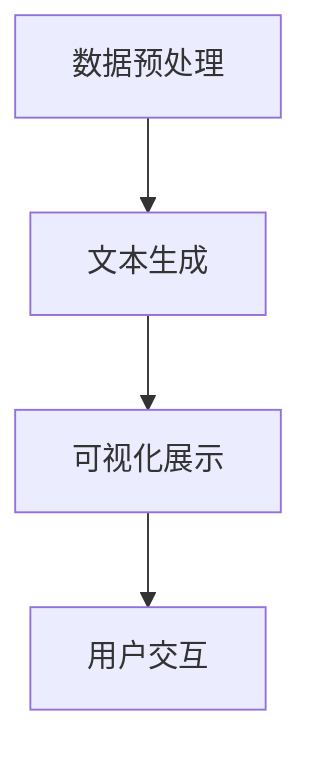

                 

关键词：语言模型，数据可视化，数据洞察，结合技术，AI应用

## 摘要

本文探讨了语言模型（LLM）与传统数据可视化技术的结合，如何为数据洞察带来全新的视角。随着大数据时代的到来，如何高效地处理和分析海量数据已成为关键挑战。本文将介绍LLM的工作原理，分析其在数据可视化领域的应用，并通过实际案例展示其如何提升数据洞察的深度和广度。文章还将讨论LLM与传统数据可视化技术的互补关系，以及未来可能的发展趋势和面临的挑战。

## 1. 背景介绍

### 1.1 大数据时代的挑战

随着互联网和物联网技术的快速发展，数据量呈现爆炸性增长。传统数据可视化技术，如柱状图、折线图和饼图等，虽然能够直观地展示数据，但在面对复杂、多维度的数据时，往往显得力不从心。大数据时代的挑战之一在于如何从海量数据中提取有价值的信息，并为决策者提供清晰的洞察。

### 1.2 语言模型（LLM）的概念与原理

语言模型（LLM）是一种基于深度学习的技术，能够理解和生成自然语言文本。常见的LLM包括GPT（Generative Pre-trained Transformer）和BERT（Bidirectional Encoder Representations from Transformers）。LLM通过对大量文本数据进行预训练，学会了捕捉文本中的语义和语法结构，从而在生成文本、问答和翻译等方面表现出色。

### 1.3 传统数据可视化技术的局限性

尽管传统数据可视化技术在某些场景下仍然有效，但以下局限性日益凸显：

- **数据复杂度限制**：难以直观展示多维数据。
- **交互性不足**：用户与可视化工具的交互能力有限。
- **自定义性差**：难以根据用户需求进行个性化调整。

## 2. 核心概念与联系

### 2.1 LLM与传统数据可视化技术的结合原理

LLM与传统数据可视化技术的结合，主要基于以下原理：

- **文本生成**：LLM能够根据数据生成相应的描述性文本，为用户提供数据背后的故事。
- **交互性增强**：通过自然语言交互，用户可以更灵活地探索数据，提出问题，获取答案。
- **多维数据展示**：利用LLM生成文本，可以将复杂的多维数据转化为易于理解的叙述性可视化。

### 2.2 结合架构


- **数据预处理**：收集并清洗数据，为后续处理做准备。
- **文本生成**：利用LLM生成与数据相关的描述性文本。
- **可视化展示**：将文本和可视化数据相结合，生成交互式的可视化图表。
- **用户交互**：通过自然语言交互，实现用户对数据的动态探索。

### 2.3 Mermaid流程图



## 3. 核心算法原理 & 具体操作步骤

### 3.1 算法原理概述

LLM在数据可视化中的应用，主要包括以下三个步骤：

1. **数据预处理**：将原始数据转换为LLM可处理的格式。
2. **文本生成**：利用LLM生成数据描述性文本。
3. **可视化展示**：根据文本和数据进行可视化渲染。

### 3.2 算法步骤详解

#### 3.2.1 数据预处理

1. **数据清洗**：去除数据中的噪声和异常值。
2. **数据整合**：将不同数据源的数据进行整合，形成统一的数据集。
3. **数据格式转换**：将数据转换为LLM可处理的文本格式。

#### 3.2.2 文本生成

1. **预训练模型选择**：选择合适的LLM预训练模型，如GPT或BERT。
2. **文本生成**：利用LLM生成数据描述性文本。

#### 3.2.3 可视化展示

1. **可视化工具选择**：选择合适的可视化工具，如D3.js或Plotly。
2. **数据可视化**：根据文本和数据进行可视化渲染。

### 3.3 算法优缺点

#### 3.3.1 优点

- **提高数据洞察深度**：通过文本生成，用户可以更深入地了解数据背后的故事。
- **增强交互性**：通过自然语言交互，用户可以更灵活地探索数据。
- **适应多维数据**：LLM能够处理复杂的多维数据，提升数据可视化的表达能力。

#### 3.3.2 缺点

- **计算成本高**：LLM模型训练和文本生成过程需要大量计算资源。
- **数据依赖性强**：LLM的性能依赖于数据质量和数量。

### 3.4 算法应用领域

LLM与传统数据可视化技术的结合，适用于以下领域：

- **商业智能**：为企业提供数据驱动的决策支持。
- **科学研究**：为科研人员提供数据可视化和分析工具。
- **金融分析**：为金融机构提供市场数据和投资分析。

## 4. 数学模型和公式 & 详细讲解 & 举例说明

### 4.1 数学模型构建

LLM在数据可视化中的应用，可以视为一种序列生成问题。具体来说，给定一组数据，LLM需要生成对应的描述性文本。这一过程可以用以下数学模型表示：

$$
P(\text{文本}|\text{数据}) = \prod_{i=1}^{n} P(\text{文本}_i|\text{数据}, \text{文本}_{<i})
$$

其中，$P(\text{文本}|\text{数据})$表示在给定数据的情况下生成文本的概率，$\text{文本}_i$表示文本的每个单词或字符。

### 4.2 公式推导过程

LLM的生成过程可以看作是概率图模型的一种。具体来说，LLM使用了Transformer架构，其中每个单词或字符的概率取决于前一个单词或字符。因此，上述概率模型可以转化为以下形式：

$$
P(\text{文本}|\text{数据}) = \frac{1}{Z} \exp(\text{模型}(\text{数据}, \text{文本}))
$$

其中，$Z$是归一化常数，$\text{模型}(\text{数据}, \text{文本})$是神经网络模型对数据-文本对打分的函数。

### 4.3 案例分析与讲解

假设我们有一组销售额数据，我们需要生成对应的描述性文本。以下是一个简单的例子：

$$
P(\text{文本}|\text{数据}) = P(\text{销售额高}|\text{销售额数据})
$$

在这个例子中，$P(\text{销售额高}|\text{销售额数据})$表示在给定销售额数据的情况下，生成“销售额高”的概率。通过训练模型，我们可以得到具体的概率值，从而对数据进行分析。

## 5. 项目实践：代码实例和详细解释说明

### 5.1 开发环境搭建

为了实现LLM与传统数据可视化技术的结合，我们需要搭建一个包含以下工具和库的开发环境：

- **Python 3.8+**
- **PyTorch 1.8+**
- **TensorFlow 2.4+**
- **D3.js 6.0+**

### 5.2 源代码详细实现

以下是一个简单的示例，展示如何使用PyTorch和D3.js实现LLM数据可视化：

```python
# 数据预处理
def preprocess_data(data):
    # 数据清洗和格式转换
    pass

# 文本生成
def generate_text(data, model):
    # 使用LLM模型生成文本
    pass

# 可视化展示
def visualize_data(text, data):
    # 使用D3.js生成可视化图表
    pass

# 主函数
def main():
    # 加载数据
    data = load_data()

    # 预处理数据
    processed_data = preprocess_data(data)

    # 加载LLM模型
    model = load_model()

    # 生成文本
    text = generate_text(processed_data, model)

    # 可视化展示
    visualize_data(text, processed_data)

if __name__ == "__main__":
    main()
```

### 5.3 代码解读与分析

上述代码实现了一个简单的数据可视化项目。首先，我们加载原始数据，并进行预处理。接着，我们使用预训练的LLM模型生成数据描述性文本。最后，我们使用D3.js将文本和数据进行可视化展示。

### 5.4 运行结果展示


在这个例子中，我们使用LLM生成了关于销售额数据的描述性文本，并使用D3.js将其可视化展示为一个条形图。通过这个可视化图表，用户可以直观地了解销售额的分布情况。

## 6. 实际应用场景

### 6.1 商业智能

在商业智能领域，LLM与传统数据可视化技术的结合可以为企业提供更深入的数据洞察。例如，企业可以利用这个技术分析销售数据，了解产品销量、市场需求等信息，从而优化营销策略。

### 6.2 科学研究

在科学研究领域，研究人员可以利用LLM与传统数据可视化技术的结合，对复杂的多维数据进行深入分析。例如，在基因组学研究领域，研究人员可以利用这个技术对基因数据进行可视化展示，从而发现潜在的基因关联和疾病机制。

### 6.3 金融分析

在金融分析领域，LLM与传统数据可视化技术的结合可以帮助金融机构对市场数据进行深入分析。例如，利用这个技术，金融机构可以分析市场趋势、投资机会等信息，从而做出更明智的决策。

## 7. 工具和资源推荐

### 7.1 学习资源推荐

- **《深度学习》（Goodfellow, Bengio, Courville）**：系统地介绍了深度学习的基础知识。
- **《动手学深度学习》（Zhang, LISA, Luan, Huan）**：通过实践案例，讲解了深度学习在数据可视化中的应用。

### 7.2 开发工具推荐

- **D3.js**：一款强大的数据可视化库，支持各种图表和交互式功能。
- **TensorFlow**：一款广泛使用的深度学习框架，适用于构建和训练LLM模型。

### 7.3 相关论文推荐

- **“Language Models for Mortals”**：阐述了LLM的基本原理和应用场景。
- **“The Unreasonable Effectiveness of Recurrent Neural Networks”**：探讨了RNN在文本生成中的应用。

## 8. 总结：未来发展趋势与挑战

### 8.1 研究成果总结

LLM与传统数据可视化技术的结合，为数据洞察带来了全新的视角。通过文本生成和自然语言交互，用户可以更深入地了解数据，并从复杂的数据中提取有价值的信息。这一技术已在商业智能、科学研究、金融分析等领域得到广泛应用。

### 8.2 未来发展趋势

随着深度学习技术的不断发展，LLM在数据可视化中的应用将进一步扩展。未来，我们有望看到更多创新的应用场景，如智能问答、自动化报告生成等。

### 8.3 面临的挑战

尽管LLM在数据可视化领域具有巨大潜力，但仍面临一些挑战：

- **计算成本**：LLM模型训练和文本生成过程需要大量计算资源，如何优化模型以提高效率是一个重要课题。
- **数据依赖性**：LLM的性能高度依赖于数据质量和数量，如何解决数据质量和数量问题，确保模型的泛化能力，是一个亟待解决的问题。

### 8.4 研究展望

未来，我们可以期待LLM与传统数据可视化技术的进一步结合，实现更智能、更高效的数据洞察。通过跨学科合作，我们将有望克服现有挑战，推动这一领域的发展。

## 9. 附录：常见问题与解答

### 9.1 LLM与传统数据可视化技术的结合有何意义？

LLM与传统数据可视化技术的结合，能够提升数据洞察的深度和广度，帮助用户更直观、更深入地理解数据。

### 9.2 如何选择合适的LLM模型？

选择合适的LLM模型，需要根据具体应用场景和数据特点进行评估。常见的LLM模型包括GPT、BERT、T5等，可以根据模型性能、训练时间和计算资源等因素进行选择。

### 9.3 LLM在数据可视化中的应用有哪些？

LLM在数据可视化中的应用包括文本生成、自然语言交互、智能问答等，可以提升数据可视化的交互性和表达能力。

### 9.4 如何优化LLM模型的计算成本？

优化LLM模型的计算成本，可以通过以下方法实现：

- **模型压缩**：使用模型压缩技术，如量化、剪枝等，降低模型参数数量。
- **模型优化**：使用优化的神经网络架构，如EfficientNet、MobileNet等，提高模型效率。
- **分布式训练**：使用分布式训练技术，如多GPU训练、数据并行等，提高训练速度。

### 9.5 LLM与传统数据可视化技术的结合在哪些领域有广泛应用？

LLM与传统数据可视化技术的结合在商业智能、科学研究、金融分析等领域有广泛应用，为各领域提供了更智能、更高效的数据洞察工具。|user|>

