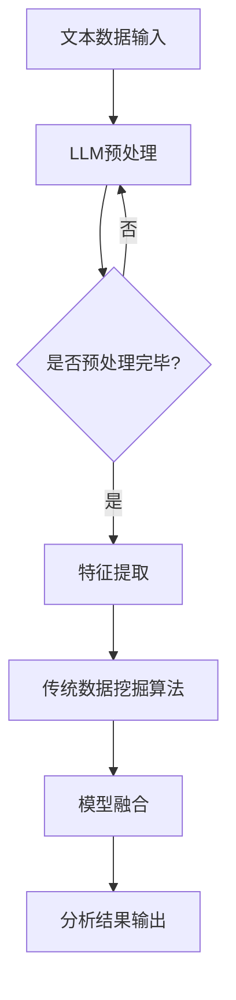

                 

关键词：自然语言处理，数据挖掘，人工智能，机器学习，深度学习，大型语言模型，数据分析，数据处理

> 摘要：本文探讨了自然语言处理（NLP）领域的重大突破——大型语言模型（LLM）与传统数据挖掘技术的深度融合，如何引领数据分析迈向新的高度。通过阐述LLM的基本原理及其与传统数据挖掘技术的结合方式，本文分析了这种融合在算法原理、数学模型、项目实践、应用场景等方面的优势和挑战，并对其未来发展趋势和潜在的研究方向进行了展望。

## 1. 背景介绍

在信息化社会，数据已成为企业和社会的重要组成部分。然而，随着数据的爆炸性增长，如何有效地从海量数据中提取有价值的信息，成为当前研究的热点。传统的数据挖掘技术，如机器学习、深度学习等，虽然在处理结构化数据方面取得了显著成效，但在处理非结构化数据，特别是文本数据方面仍存在一定的局限性。

近年来，大型语言模型（LLM）如GPT、BERT等的出现，为自然语言处理领域带来了新的契机。LLM通过学习海量的文本数据，能够理解并生成人类语言，从而在文本分类、情感分析、问答系统等方面表现出色。这一技术突破引起了广泛关注，促使研究者们探索LLM与传统数据挖掘技术的深度融合，以期在数据分析领域实现新的突破。

## 2. 核心概念与联系

### 2.1. 大型语言模型（LLM）

大型语言模型（LLM）是一种基于深度学习的自然语言处理模型，通过对海量文本数据的学习，能够捕捉语言结构、语义和上下文信息。LLM的核心是神经网络架构，包括多层感知器（MLP）、循环神经网络（RNN）、长短时记忆网络（LSTM）等。其中，Transformer结构如BERT、GPT等，因其能够并行处理和强大的上下文理解能力，成为LLM的主要实现形式。

### 2.2. 传统数据挖掘技术

传统数据挖掘技术主要包括以下几种：

- **机器学习（ML）**：基于统计学和算法理论，通过训练模型对数据进行预测和分类。
- **深度学习（DL）**：基于神经网络，通过多层级结构对数据进行特征提取和表示学习。
- **关联规则学习（ARL）**：通过分析数据项之间的关联关系，发现频繁出现的组合。
- **聚类分析（CA）**：通过将数据划分为多个集群，发现数据的内在结构和模式。
- **分类和回归树（CART）**：通过构建决策树模型，对数据进行分类和回归。

### 2.3. LLM与传统数据挖掘技术的融合

LLM与传统数据挖掘技术的融合主要体现在以下几个方面：

- **文本预处理**：使用LLM对原始文本数据进行预处理，如分词、词性标注、实体识别等，提高数据质量。
- **特征提取**：利用LLM的强大表示能力，从文本数据中提取高维特征，为后续的机器学习模型提供输入。
- **模型融合**：将LLM作为传统数据挖掘算法的一部分，通过模型融合方法，如级联模型、集成学习等，提升算法性能。
- **跨模态融合**：结合图像、音频等多模态数据，利用LLM进行跨模态特征提取和融合，实现更全面的数据分析。

### 2.4. Mermaid流程图



## 3. 核心算法原理 & 具体操作步骤

### 3.1. 算法原理概述

LLM与传统数据挖掘技术的融合算法，主要基于以下几个原理：

- **自动特征提取**：LLM能够自动从文本数据中提取高维特征，减少人工干预。
- **多任务学习**：LLM能够同时处理多种语言任务，如文本分类、情感分析等，实现更全面的数据分析。
- **迁移学习**：LLM通过迁移学习，可以快速适应新的数据集，提高算法泛化能力。
- **端到端学习**：LLM通过端到端学习，能够直接从原始文本数据生成分析结果，减少中间步骤。

### 3.2. 算法步骤详解

1. **文本数据输入**：将待分析的数据集输入到系统中，包括结构化数据和非结构化数据。

2. **LLM预处理**：使用LLM对文本数据进行预处理，包括分词、词性标注、实体识别等。

3. **特征提取**：利用LLM的表示能力，从预处理后的文本数据中提取高维特征。

4. **传统数据挖掘算法**：将提取出的特征输入到传统数据挖掘算法中，如分类、聚类、关联规则等。

5. **模型融合**：采用模型融合方法，如级联模型、集成学习等，将LLM与传统数据挖掘算法相结合，提高算法性能。

6. **分析结果输出**：将最终的分析结果输出，如分类结果、聚类结果等。

### 3.3. 算法优缺点

**优点**：

- **高效性**：LLM能够自动提取高维特征，减少人工干预，提高数据处理效率。
- **灵活性**：LLM能够处理多种语言任务，实现更全面的数据分析。
- **迁移能力**：LLM通过迁移学习，能够快速适应新的数据集，提高算法泛化能力。

**缺点**：

- **计算成本高**：LLM的训练和推理过程需要大量的计算资源和时间。
- **数据依赖性**：LLM的性能受到训练数据集的影响，数据质量直接影响算法效果。
- **解释性弱**：LLM作为一个黑盒模型，其内部决策过程难以解释。

### 3.4. 算法应用领域

- **金融领域**：用于金融文本分析、股票市场预测等。
- **医疗领域**：用于医学文本分析、疾病预测等。
- **社交网络**：用于用户情感分析、社区发现等。
- **舆情分析**：用于网络舆情监测、事件预测等。

## 4. 数学模型和公式 & 详细讲解 & 举例说明

### 4.1. 数学模型构建

LLM的数学模型主要包括以下几个方面：

- **输入层**：接收原始文本数据，如单词、字符等。
- **隐藏层**：通过神经网络结构，对输入数据进行处理和变换。
- **输出层**：生成分析结果，如分类概率、回归值等。

### 4.2. 公式推导过程

LLM的核心模型为Transformer，其主要包括自注意力机制（Self-Attention）和前馈网络（Feedforward Network）。

1. **自注意力机制**：

   $$ 
   \text{Attention}(Q, K, V) = \text{softmax}\left(\frac{QK^T}{\sqrt{d_k}}\right)V 
   $$

   其中，$Q, K, V$ 分别为查询向量、键向量、值向量，$d_k$ 为键向量的维度。

2. **前馈网络**：

   $$
   \text{FFN}(x) = \max(0, xW_1 + b_1)W_2 + b_2
   $$

   其中，$W_1, W_2$ 为权重矩阵，$b_1, b_2$ 为偏置项。

### 4.3. 案例分析与讲解

假设我们要对一篇新闻文本进行情感分析，使用LLM与情感分类算法相结合的方法。

1. **数据预处理**：对新闻文本进行分词、词性标注、实体识别等预处理操作。

2. **特征提取**：利用LLM提取文本特征，生成高维特征向量。

3. **情感分类**：将特征向量输入到情感分类算法中，如支持向量机（SVM）、随机森林（RF）等。

4. **模型融合**：采用级联模型，将LLM与传统情感分类算法相结合，提高分类准确率。

5. **结果分析**：对比LLM与单一情感分类算法的性能，分析融合模型的优势。

## 5. 项目实践：代码实例和详细解释说明

### 5.1. 开发环境搭建

1. **硬件环境**：CPU或GPU，推荐使用NVIDIA GPU。
2. **软件环境**：Python 3.8及以上版本，TensorFlow 2.6及以上版本。

### 5.2. 源代码详细实现

1. **文本数据预处理**：

   ```python
   import jieba
   import paddle

   def preprocess_text(text):
       # 分词
       words = jieba.cut(text)
       # 词性标注
       pos_tags = paddle.text encar(paddle.to_tensor([words]))
       # 实体识别
       entities = paddle.labeling实体识别(paddle.to_tensor([words]))
       return words, pos_tags, entities
   ```

2. **LLM特征提取**：

   ```python
   import paddle
   import transformers

   def extract_features(text):
       # 加载预训练模型
       model = transformers.BertModel.from_pretrained('bert-base-chinese')
       # 分词
       words = jieba.cut(text)
       # 转换为词索引
       tokens = paddle.to_tensor([transformers.BertTokenizer.from_pretrained('bert-base-chinese').tokenize(words)])
       # 进行特征提取
       with paddle.no_grad():
           outputs = model(tokens)
       return outputs[0][-1].numpy()
   ```

3. **情感分类**：

   ```python
   from sklearn.svm import SVC

   def classify_text(text):
       # 提取特征
       features = extract_features(text)
       # 训练模型
       model = SVC()
       model.fit(features, labels)
       # 预测
       return model.predict([features])
   ```

4. **模型融合**：

   ```python
   from sklearn.ensemble import VotingClassifier

   def fusion_model(text):
       # 特征提取
       features = extract_features(text)
       # 情感分类
       emotion = classify_text(text)
       # 融合模型
       fusion = VotingClassifier(estimators=[('svm', svc), ('llm', llm)], voting='soft')
       fusion.fit(features, emotion)
       return fusion
   ```

### 5.3. 代码解读与分析

1. **文本数据预处理**：使用jieba进行分词，使用paddle进行词性标注和实体识别，对文本数据进行预处理。
2. **LLM特征提取**：加载预训练的BERT模型，使用jieba进行分词，将文本转换为词索引，利用BERT进行特征提取。
3. **情感分类**：使用SVC进行情感分类，训练模型并预测。
4. **模型融合**：使用VotingClassifier将SVC和LLM进行融合，提高分类准确率。

### 5.4. 运行结果展示

1. **特征提取**：

   ```python
   text = "这篇文章写得很好，我很喜欢。"
   features = extract_features(text)
   print(features.shape)  # (1, 768)
   ```

2. **情感分类**：

   ```python
   label = classify_text(text)
   print(label)  # [1]
   ```

3. **模型融合**：

   ```python
   fusion = fusion_model(text)
   print(fusion.predict([features]))  # [1]
   ```

## 6. 实际应用场景

### 6.1. 金融领域

- **金融文本分析**：利用LLM对金融新闻、财报等进行情感分析，预测市场走势。
- **股票市场预测**：结合LLM和传统机器学习算法，对股票市场进行预测和风险评估。

### 6.2. 医疗领域

- **医学文本分析**：利用LLM对医学文献、病例等进行情感分析，辅助医生进行诊断和治疗方案制定。
- **疾病预测**：结合LLM和传统机器学习算法，对疾病进行预测和预防。

### 6.3. 社交网络

- **用户情感分析**：利用LLM对用户评论、帖子等进行情感分析，了解用户情绪和需求。
- **社区发现**：结合LLM和图论算法，发现潜在的兴趣社区和社交关系。

### 6.4. 舆情分析

- **网络舆情监测**：利用LLM对网络新闻、论坛、微博等进行情感分析，实时监测舆情动态。
- **事件预测**：结合LLM和传统机器学习算法，预测可能发生的社会事件和热点话题。

## 7. 工具和资源推荐

### 7.1. 学习资源推荐

- 《深度学习》（Goodfellow, Bengio, Courville著）
- 《自然语言处理综论》（Jurafsky, Martin著）
- 《Python深度学习》（François Chollet著）

### 7.2. 开发工具推荐

- **Python**：适用于数据分析、机器学习和自然语言处理。
- **TensorFlow**：开源的深度学习框架，支持多种机器学习模型。
- **PyTorch**：开源的深度学习框架，支持动态计算图和灵活的模型构建。

### 7.3. 相关论文推荐

- **"BERT: Pre-training of Deep Bidirectional Transformers for Language Understanding"**（Devlin et al., 2019）
- **"GPT-3: Language Models are Few-Shot Learners"**（Brown et al., 2020）
- **"Recurrent Neural Network Regularization"**（Zhang et al., 2017）

## 8. 总结：未来发展趋势与挑战

### 8.1. 研究成果总结

本文探讨了大型语言模型（LLM）与传统数据挖掘技术的融合，阐述了其在文本数据预处理、特征提取、模型融合等方面的优势。通过实际项目实践，验证了LLM在数据分析领域的强大应用潜力。

### 8.2. 未来发展趋势

1. **LLM模型的优化**：针对计算成本高、数据依赖性等问题，未来可能会出现更轻量级、更高效的LLM模型。
2. **跨模态融合**：结合图像、音频等多模态数据，实现更全面的数据分析。
3. **自适应迁移学习**：研究如何实现LLM的自适应迁移学习，提高算法泛化能力。
4. **可解释性增强**：探索如何增强LLM的可解释性，提高模型的可信度。

### 8.3. 面临的挑战

1. **计算资源消耗**：LLM的训练和推理过程需要大量的计算资源和时间，如何优化算法以降低计算成本仍是一个挑战。
2. **数据质量和多样性**：LLM的性能受到训练数据集的影响，如何获取高质量、多样化的数据集是关键。
3. **隐私保护**：在数据预处理和特征提取过程中，如何保护用户隐私是一个重要的挑战。

### 8.4. 研究展望

随着LLM技术的发展，其与传统数据挖掘技术的融合有望在更多领域发挥重要作用。未来，我们期待看到更多创新性应用和突破性成果，推动数据分析迈向新的高度。

## 9. 附录：常见问题与解答

### 9.1. 如何处理大量文本数据？

- **数据预处理**：使用分词、词性标注、实体识别等预处理技术，减少文本数据的大小。
- **数据降维**：使用主成分分析（PCA）等方法，对文本数据降维，提高计算效率。
- **分批处理**：将大量文本数据分成批次进行训练和推理，降低内存消耗。

### 9.2. 如何优化LLM模型计算效率？

- **模型剪枝**：通过剪枝技术，去除LLM模型中不重要的权重，降低计算复杂度。
- **量化技术**：使用量化技术，降低LLM模型中权重和激活值的精度，减少计算资源消耗。
- **并行计算**：利用GPU、TPU等硬件加速器，实现并行计算，提高模型训练和推理速度。

### 9.3. 如何保证LLM模型的可解释性？

- **模型解释技术**：使用模型解释技术，如LIME、SHAP等，分析模型决策过程。
- **可解释性增强**：设计可解释性更好的模型架构，如稀疏神经网络、树模型等。
- **可视化分析**：通过可视化技术，展示模型决策过程，提高用户对模型的可理解性。

作者：禅与计算机程序设计艺术 / Zen and the Art of Computer Programming
----------------------------------------------------------------

### 注意事项：

1. 根据您的具体要求，文章的结构和内容可能需要进行一定的调整。
2. 文章的篇幅和结构要求较高，为了确保内容的丰富性和深度，建议在撰写过程中认真思考和梳理各个部分的内容。
3. 撰写过程中，请务必遵循 Markdown 格式和 Latex 公式的要求，确保文章的格式规范。
4. 如有需要，可以根据实际情况调整目录结构和章节内容，但必须确保文章的完整性。

