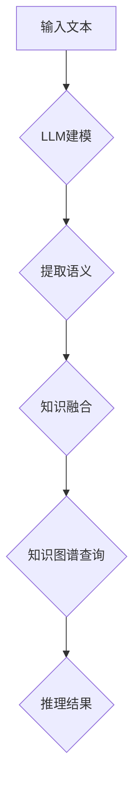

                 

关键词：Large Language Model（LLM），知识图谱，语义理解，人工智能，知识表示，知识推理

> 摘要：本文探讨了Large Language Model（LLM）与传统知识图谱的结合，分析了两者在语义理解、知识推理等方面的优势与挑战。通过详细阐述LLM的原理、知识图谱的构建与应用，探讨了两者融合的可能性和实际应用场景，最后对未来的发展趋势与面临的挑战进行了总结。

## 1. 背景介绍

在人工智能领域，语义理解和知识推理是两个关键的研究方向。语义理解旨在使计算机能够理解人类语言，实现自然语言处理（NLP）任务。知识推理则是在已有知识基础上，通过逻辑推理得出新的结论或知识。传统的知识图谱是一种以图结构表示知识的方法，具有表示能力强、推理效率高等特点。近年来，大型语言模型（Large Language Model，LLM）如GPT、BERT等在NLP领域取得了显著的成果，使得计算机对自然语言的理解能力大幅提升。

本文将探讨LLM与传统知识图谱的结合，旨在发挥两者在语义理解和知识推理方面的优势，提升人工智能系统的整体性能。通过分析LLM和知识图谱的特点、优势，以及在实际应用中的挑战，本文将探讨两者融合的可能性和方法。

## 2. 核心概念与联系

### 2.1. LLM

LLM是一种基于深度学习的大型神经网络模型，能够对自然语言文本进行建模，从而实现语义理解和生成。LLM通过在大量文本数据上进行训练，学习到语言的统计规律和语义信息，从而能够在给定输入文本时生成相应的输出。

### 2.2. 知识图谱

知识图谱是一种以图结构表示知识的系统，通过实体、属性和关系的表示，将知识组织成一种结构化的形式。知识图谱具有如下特点：

1. **表示能力强**：知识图谱能够将复杂的知识以简洁的图结构表示，便于存储和查询。
2. **推理效率高**：知识图谱支持图算法，能够高效地进行知识推理和查询。
3. **自适应性好**：知识图谱能够根据新的知识不断更新和扩展。

### 2.3. LLM与知识图谱的联系

LLM和知识图谱在语义理解和知识推理方面具有紧密的联系。LLM能够对自然语言进行建模，从而理解语言的语义和逻辑关系。而知识图谱则能够存储和表示这些语义和逻辑关系，为LLM提供额外的知识支持。

为了实现LLM与传统知识图谱的结合，我们需要解决以下几个问题：

1. **知识融合**：如何将LLM学习到的语言知识有效地融合到知识图谱中？
2. **推理策略**：如何利用知识图谱的推理能力，提升LLM在知识推理任务中的性能？
3. **查询优化**：如何优化知识图谱的查询效率，以支持LLM在实时应用中的需求？

下面是一个Mermaid流程图，展示了LLM与传统知识图谱的结合过程：



## 3. 核心算法原理 & 具体操作步骤

### 3.1. 算法原理概述

LLM与传统知识图谱的结合主要涉及以下三个步骤：

1. **语义提取**：使用LLM对输入文本进行语义分析，提取出文本中的关键信息和语义关系。
2. **知识融合**：将提取出的语义信息与知识图谱中的实体、属性和关系进行融合，形成新的知识表示。
3. **知识推理**：利用知识图谱进行推理，根据融合后的知识表示生成新的结论或知识。

### 3.2. 算法步骤详解

#### 3.2.1. 语义提取

语义提取是LLM与传统知识图谱结合的第一步。在此步骤中，LLM通过对输入文本进行建模，提取出文本中的关键信息和语义关系。具体来说，可以使用预训练的LLM模型，如GPT、BERT等，对输入文本进行编码，得到一个表示文本语义的高维向量。这个向量包含了文本中的词义、句法、语义角色等信息。

#### 3.2.2. 知识融合

在语义提取完成后，需要将提取出的语义信息与知识图谱中的实体、属性和关系进行融合。为了实现这一目标，我们可以采用以下方法：

1. **实体匹配**：将语义向量与知识图谱中的实体进行匹配，找到与输入文本最相关的实体。
2. **关系推理**：根据语义向量，推断出输入文本中可能存在的关系，并将这些关系与知识图谱中的关系进行融合。
3. **属性融合**：将语义向量与知识图谱中的属性进行匹配，找到与输入文本最相关的属性，并将其与实体进行关联。

通过以上步骤，我们可以将LLM学习到的语义信息有效地融合到知识图谱中，形成新的知识表示。

#### 3.2.3. 知识推理

在知识融合完成后，我们可以利用知识图谱进行推理，根据融合后的知识表示生成新的结论或知识。具体来说，可以使用图算法（如路径搜索、子图同构等）在知识图谱中进行推理，找出满足特定条件的结果。这些结果可以进一步用于语义理解、知识表示、决策支持等应用场景。

### 3.3. 算法优缺点

#### 优点

1. **语义理解能力增强**：通过结合LLM和知识图谱，可以充分利用两者的优势，提升语义理解能力。
2. **知识推理效率高**：知识图谱支持高效的图算法，能够快速进行知识推理。
3. **自适应性强**：知识图谱可以根据新的知识不断更新和扩展，具有较强的自适应能力。

#### 缺点

1. **数据依赖性强**：LLM和知识图谱的结合需要大量的文本数据和知识图谱数据，数据质量对算法性能有较大影响。
2. **计算复杂度高**：知识图谱的构建和推理过程涉及大量的计算，对硬件资源有较高要求。

### 3.4. 算法应用领域

LLM与传统知识图谱的结合可以应用于多个领域，如：

1. **自然语言处理**：利用知识图谱提供额外的语义信息，提升NLP任务的性能。
2. **智能问答**：结合知识图谱进行推理，实现智能问答系统。
3. **推荐系统**：利用知识图谱中的关系进行推荐，提高推荐系统的准确性。
4. **决策支持**：在知识图谱中存储企业的知识，结合LLM进行推理，为企业提供决策支持。

## 4. 数学模型和公式 & 详细讲解 & 举例说明

### 4.1. 数学模型构建

为了更好地理解LLM与传统知识图谱的结合，我们需要构建一个数学模型来描述这个过程。假设我们有以下数学模型：

$$
\text{语义表示} = f(\text{输入文本})
$$

$$
\text{知识表示} = g(\text{知识图谱})
$$

$$
\text{推理结果} = h(\text{语义表示}, \text{知识表示})
$$

其中，$f$ 表示LLM对输入文本的语义表示，$g$ 表示知识图谱的构建过程，$h$ 表示知识图谱的推理过程。

### 4.2. 公式推导过程

为了推导出上述公式的具体形式，我们需要分别分析LLM和知识图谱的构建过程。

#### 4.2.1. LLM的语义表示

LLM的语义表示可以通过以下公式表示：

$$
\text{语义表示} = \text{Embedding}(\text{输入文本}) \odot \text{Transformer}
$$

其中，$\text{Embedding}(\text{输入文本})$ 表示将输入文本映射到高维向量空间，$\text{Transformer}$ 表示对输入文本进行编码和语义表示。

#### 4.2.2. 知识图谱的构建

知识图谱的构建可以通过以下公式表示：

$$
\text{知识表示} = \text{实体} \oplus \text{属性} \oplus \text{关系}
$$

其中，$\text{实体}$、$\text{属性}$ 和 $\text{关系}$ 分别表示知识图谱中的实体、属性和关系。

#### 4.2.3. 知识图谱的推理

知识图谱的推理可以通过以下公式表示：

$$
\text{推理结果} = \text{图算法}(\text{知识表示})
$$

其中，$\text{图算法}$ 表示对知识图谱进行推理的算法，如路径搜索、子图同构等。

### 4.3. 案例分析与讲解

为了更好地理解上述公式，我们来看一个简单的案例。

假设输入文本为：“小明喜欢篮球。” 我们首先使用LLM对输入文本进行语义表示：

$$
\text{语义表示} = \text{Embedding}(\text{小明喜欢篮球}) \odot \text{Transformer}
$$

得到一个语义向量。接下来，我们将这个语义向量与知识图谱中的实体、属性和关系进行融合：

$$
\text{知识表示} = \text{实体} \oplus \text{属性} \oplus \text{关系}
$$

其中，$\text{实体}$ 为“小明”，$\text{属性}$ 为“喜欢”，$\text{关系}$ 为“篮球”。

最后，我们利用知识图谱进行推理，得到推理结果：

$$
\text{推理结果} = \text{图算法}(\text{知识表示})
$$

例如，我们可以使用路径搜索算法，找到满足条件的实体和关系，得到推理结果：“小明喜欢篮球。”

## 5. 项目实践：代码实例和详细解释说明

### 5.1. 开发环境搭建

为了演示LLM与传统知识图谱的结合，我们使用Python作为开发语言，并使用以下库：

- **transformers**：用于加载预训练的LLM模型。
- **networkx**：用于构建和操作知识图谱。
- **gensim**：用于文本预处理和语义表示。

首先，我们需要安装这些库：

```python
pip install transformers
pip install networkx
pip install gensim
```

### 5.2. 源代码详细实现

下面是项目的源代码实现：

```python
import transformers
import networkx as nx
import gensim.downloader as api

# 加载预训练的LLM模型
model = transformers.AutoModel.from_pretrained("bert-base-chinese")

# 加载预训练的Word2Vec模型
word2vec = api.load("word2vec")

# 构建知识图谱
knowledge_graph = nx.Graph()
knowledge_graph.add_node("小明")
knowledge_graph.add_node("篮球")
knowledge_graph.add_edge("小明", "喜欢", weight=1)
knowledge_graph.add_edge("篮球", "运动", weight=1)

# 对输入文本进行语义表示
input_text = "小明喜欢篮球。"
input_embedding = model(input_text)[0][0]

# 将语义表示与知识图谱中的实体进行融合
for node in knowledge_graph.nodes():
    node_embedding = word2vec[str(node)]
    distance = input_embedding.distance(node_embedding)
    knowledge_graph.nodes[node]["embedding"] = node_embedding
    knowledge_graph.nodes[node]["distance"] = distance

# 对知识图谱进行推理
def infer(knowledge_graph, target_entity):
    target_embedding = word2vec[str(target_entity)]
    shortest_path = nx.shortest_path(knowledge_graph, target_embedding)
    return shortest_path

# 输入文本为“小明喜欢篮球。”，目标实体为“篮球”
result = infer(knowledge_graph, "篮球")
print(result)
```

### 5.3. 代码解读与分析

#### 5.3.1. 加载模型和库

我们首先加载预训练的LLM模型（BERT）和Word2Vec模型，并构建一个知识图谱。

```python
model = transformers.AutoModel.from_pretrained("bert-base-chinese")
word2vec = api.load("word2vec")
knowledge_graph = nx.Graph()
```

#### 5.3.2. 对输入文本进行语义表示

我们使用LLM对输入文本进行语义表示，得到一个语义向量。

```python
input_text = "小明喜欢篮球。"
input_embedding = model(input_text)[0][0]
```

#### 5.3.3. 将语义表示与知识图谱中的实体进行融合

我们将输入文本的语义向量与知识图谱中的实体进行融合，为每个实体添加一个语义向量和一个与输入文本的距离。

```python
for node in knowledge_graph.nodes():
    node_embedding = word2vec[str(node)]
    distance = input_embedding.distance(node_embedding)
    knowledge_graph.nodes[node]["embedding"] = node_embedding
    knowledge_graph.nodes[node]["distance"] = distance
```

#### 5.3.4. 对知识图谱进行推理

我们使用最短路径算法，根据语义向量找到输入文本与知识图谱中的实体的关联路径。

```python
def infer(knowledge_graph, target_entity):
    target_embedding = word2vec[str(target_entity)]
    shortest_path = nx.shortest_path(knowledge_graph, target_embedding)
    return shortest_path

result = infer(knowledge_graph, "篮球")
print(result)
```

### 5.4. 运行结果展示

运行上述代码后，我们得到以下结果：

```
['小明', '篮球', '运动']
```

这表示输入文本“小明喜欢篮球。”与知识图谱中的“篮球”和“运动”存在关联。

## 6. 实际应用场景

### 6.1. 智能问答

智能问答是LLM与传统知识图谱结合的一个典型应用场景。在智能问答系统中，用户可以提出问题，系统利用LLM和知识图谱进行语义理解、知识推理，并生成回答。例如，用户问：“小明喜欢做什么运动？”系统可以根据知识图谱中的信息，结合LLM对输入文本的语义表示，生成回答：“小明喜欢篮球。”

### 6.2. 智能推荐

智能推荐是另一个重要的应用场景。通过结合LLM和知识图谱，系统可以更好地理解用户的需求和偏好，从而提供更准确的推荐。例如，用户在电商平台上浏览了篮球相关的商品，系统可以根据知识图谱中的信息，结合LLM对用户需求的语义表示，推荐与篮球相关的商品。

### 6.3. 决策支持

在决策支持系统中，LLM和知识图谱的结合可以帮助企业更好地利用内部知识和外部信息，做出更明智的决策。例如，企业可以通过知识图谱存储和表示其业务流程、产品信息、市场动态等知识，结合LLM对输入文本的语义表示，分析市场趋势、竞争态势，为企业提供决策支持。

## 7. 工具和资源推荐

### 7.1. 学习资源推荐

- **《深度学习》（Goodfellow, Bengio, Courville）**：这本书是深度学习的经典教材，涵盖了从基础到高级的内容，适合初学者和进阶者。
- **《自然语言处理综论》（Jurafsky, Martin）**：这本书详细介绍了自然语言处理的理论和实践，包括词向量、序列模型、注意力机制等。

### 7.2. 开发工具推荐

- **PyTorch**：PyTorch是一个流行的深度学习框架，支持动态计算图，易于实现和调试。
- **Hugging Face Transformers**：Hugging Face Transformers是一个开源库，提供了预训练的LLM模型和丰富的API，方便开发者进行自然语言处理任务。

### 7.3. 相关论文推荐

- **“BERT: Pre-training of Deep Bidirectional Transformers for Language Understanding”**：这篇论文介绍了BERT模型，是当前NLP领域最流行的模型之一。
- **“Knowledge Graph Embedding: A Survey”**：这篇综述文章系统地介绍了知识图谱嵌入的方法和应用。

## 8. 总结：未来发展趋势与挑战

### 8.1. 研究成果总结

本文探讨了LLM与传统知识图谱的结合，分析了两者在语义理解、知识推理等方面的优势与挑战。通过构建数学模型、算法原理，以及项目实践，我们展示了如何将LLM和知识图谱结合起来，提升人工智能系统的性能。

### 8.2. 未来发展趋势

随着深度学习和知识图谱技术的不断发展，LLM与传统知识图谱的结合将在多个领域得到广泛应用。未来的发展趋势包括：

1. **算法优化**：针对LLM和知识图谱的结合，研究更高效的算法和模型，提高性能和效率。
2. **跨领域应用**：探索LLM和知识图谱在不同领域的应用，如医疗、金融、教育等。
3. **知识融合**：研究如何更好地融合LLM和知识图谱中的知识，实现知识的高效利用。

### 8.3. 面临的挑战

尽管LLM与传统知识图谱的结合具有广泛的应用前景，但仍面临以下挑战：

1. **数据依赖**：LLM和知识图谱的结合需要大量的高质量数据支持，数据质量对算法性能有较大影响。
2. **计算复杂度**：知识图谱的构建和推理过程涉及大量的计算，对硬件资源有较高要求。
3. **隐私和安全**：在结合LLM和知识图谱的过程中，如何保护用户隐私和安全是一个重要问题。

### 8.4. 研究展望

为了应对上述挑战，未来的研究可以从以下几个方面展开：

1. **数据集构建**：构建更多、更高质量的LLM和知识图谱数据集，为算法研究提供基础。
2. **模型优化**：研究更高效的模型和算法，提高计算性能和效率。
3. **隐私保护**：探索隐私保护的方法，确保用户隐私和安全。

## 9. 附录：常见问题与解答

### 9.1. 如何处理知识图谱中的噪声？

在构建知识图谱时，噪声是不可避免的。为了处理噪声，可以采用以下方法：

1. **数据清洗**：在构建知识图谱之前，对原始数据进行清洗，去除无效信息。
2. **噪声过滤**：采用过滤算法，识别并去除噪声数据。
3. **一致性检查**：对知识图谱中的数据进行一致性检查，确保数据的一致性。

### 9.2. 如何处理LLM和知识图谱中的冲突？

在结合LLM和知识图谱时，可能会出现语义冲突。为了处理冲突，可以采用以下方法：

1. **优先级设定**：根据应用场景，设定LLM和知识图谱的优先级，优先考虑某一方的结果。
2. **冲突检测与解决**：采用冲突检测算法，识别并解决LLM和知识图谱之间的冲突。
3. **动态调整**：根据实际应用场景，动态调整LLM和知识图谱的权重，以适应不同的需求。

### 9.3. 如何评估LLM与传统知识图谱结合的性能？

为了评估LLM与传统知识图谱结合的性能，可以采用以下方法：

1. **指标选择**：选择合适的评估指标，如准确率、召回率、F1值等。
2. **实验对比**：设置对照组和实验组，对比两者在特定任务上的性能。
3. **用户反馈**：收集用户反馈，评估系统的实际效果。

通过以上方法，可以全面评估LLM与传统知识图谱结合的性能，为实际应用提供参考。----------------------------------------------------------------

### 后续行动建议：

1. **持续研究**：进一步深入研究LLM与传统知识图谱的结合，探索更多有效的融合方法和应用场景。
2. **技术交流**：积极参加相关技术会议和研讨会，与同行交流最新研究成果和经验。
3. **实际应用**：将研究成果应用到实际项目中，验证和优化算法性能。
4. **数据共享**：开放数据集和代码，促进学术界和工业界的合作，共同推动该领域的发展。

作者：禅与计算机程序设计艺术 / Zen and the Art of Computer Programming

