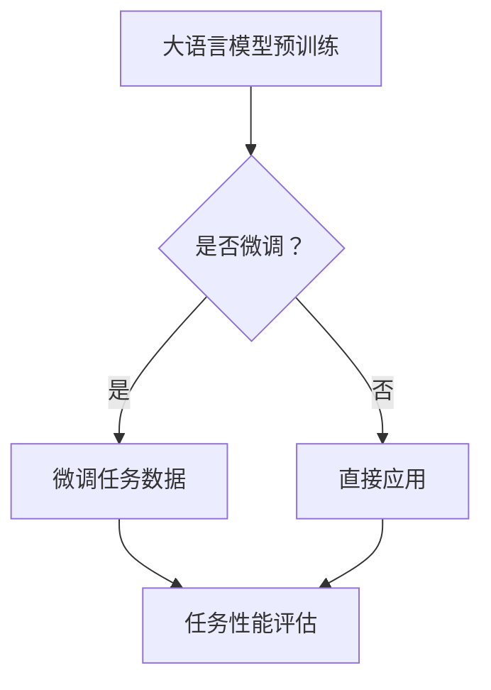

                 

关键词：大语言模型（LLM），自然语言推理（NLP），对比分析，融合应用，技术发展

## 摘要

本文旨在探讨大语言模型（LLM）与传统自然语言推理（NLP）技术的对比与融合。通过对LLM的背景介绍、核心算法原理分析、数学模型与公式讲解、项目实践、实际应用场景等内容的深入剖析，本文揭示了LLM在NLP领域的革命性突破及其与传统技术的融合趋势。文章最后对LLM的未来发展、挑战和展望进行了总结，为研究人员和开发者提供了有益的参考。

### 1. 背景介绍

#### 1.1 大语言模型（LLM）的起源与发展

大语言模型（LLM）起源于自然语言处理（NLP）领域，其核心目标是实现机器对自然语言的深度理解和生成。自2000年代初以来，随着计算能力的提升和海量数据集的积累，深度学习技术的发展为LLM的研究提供了坚实的基础。特别是近年来，基于Transformer架构的预训练模型如BERT、GPT等，取得了显著的性能提升，推动了NLP技术的快速发展。

#### 1.2 传统自然语言推理技术

传统自然语言推理（NLP）技术主要包括基于规则的方法、统计方法和深度学习方法。这些方法在文本分类、命名实体识别、机器翻译等任务中取得了良好的效果。传统方法通常依赖领域知识库和大量手工特征工程，虽然具有较好的解释性，但存在局限性。例如，规则方法在面对复杂语义时可能失效，统计方法则难以捕捉长文本中的上下文信息。

### 2. 核心概念与联系

#### 2.1 大语言模型（LLM）的核心概念

大语言模型（LLM）是基于深度学习技术的预训练模型，其核心概念包括：

1. **预训练**：使用海量无标注数据对模型进行预训练，以学习自然语言的通用特征。
2. **微调**：在特定任务上使用有标注数据进行微调，以适应具体任务的需求。
3. **上下文理解**：利用Transformer架构，模型能够捕捉长文本中的上下文信息，实现深层次的语义理解。

#### 2.2 传统自然语言推理技术的核心概念

传统自然语言推理技术的核心概念包括：

1. **规则方法**：基于领域知识和手工编写的规则，对文本进行分类和标注。
2. **统计方法**：使用机器学习算法，如朴素贝叶斯、支持向量机等，对文本进行建模和分类。
3. **深度学习方法**：使用神经网络结构，如卷积神经网络（CNN）、循环神经网络（RNN）等，对文本进行特征提取和分类。

#### 2.3 核心概念原理与架构的Mermaid流程图



### 3. 核心算法原理 & 具体操作步骤

#### 3.1 算法原理概述

大语言模型（LLM）的核心算法原理主要包括预训练和微调两个阶段：

1. **预训练**：使用无标注数据对模型进行预训练，主要任务包括文本分类、命名实体识别、情感分析等。
2. **微调**：在特定任务上使用有标注数据进行微调，以适应具体任务的需求。

传统自然语言推理技术的核心算法原理主要包括规则方法、统计方法和深度学习方法：

1. **规则方法**：基于领域知识和手工编写的规则，对文本进行分类和标注。
2. **统计方法**：使用机器学习算法，如朴素贝叶斯、支持向量机等，对文本进行建模和分类。
3. **深度学习方法**：使用神经网络结构，如卷积神经网络（CNN）、循环神经网络（RNN）等，对文本进行特征提取和分类。

#### 3.2 算法步骤详解

1. **大语言模型（LLM）算法步骤**：

   a. 预训练阶段：
   
   i. 数据预处理：对海量无标注数据进行清洗、分词、词向量化等处理。
   
   ii. 模型初始化：使用预训练模型如BERT、GPT等初始化参数。
   
   iii. 预训练任务：执行文本分类、命名实体识别、情感分析等任务。
   
   b. 微调阶段：
   
   i. 数据预处理：对有标注数据进行清洗、分词、词向量化等处理。
   
   ii. 模型微调：在特定任务上调整模型参数。
   
   iii. 任务性能评估：评估模型在任务上的性能。

2. **传统自然语言推理技术算法步骤**：

   a. 规则方法：
   
   i. 知识库构建：收集领域知识，编写规则。
   
   ii. 规则匹配：对输入文本进行规则匹配。
   
   iii. 结果输出：根据规则匹配结果输出分类或标注。

   b. 统计方法：
   
   i. 特征提取：从文本中提取特征。
   
   ii. 模型训练：使用机器学习算法训练模型。
   
   iii. 预测：对输入文本进行预测。

   c. 深度学习方法：
   
   i. 数据预处理：对文本进行清洗、分词、词向量化等处理。
   
   ii. 模型训练：使用神经网络结构训练模型。
   
   iii. 预测：对输入文本进行预测。

#### 3.3 算法优缺点

1. **大语言模型（LLM）优缺点**：

   - 优点：
     - 强大的上下文理解能力。
     - 跨任务迁移效果显著。
     - 易于实现自动化特征提取。
   
   - 缺点：
     - 训练成本高，需要大量计算资源。
     - 难以解释模型决策过程。
     - 对特定领域知识的依赖较小。

2. **传统自然语言推理技术优缺点**：

   - 规则方法：
     - 优点：具有较好的解释性，易于维护。
     - 缺点：难以应对复杂语义，适应性差。
   
   - 统计方法：
     - 优点：具有较强的泛化能力，适用性广。
     - 缺点：对特征工程依赖较大，难以解释。
   
   - 深度学习方法：
     - 优点：能够自动提取特征，实现端到端建模。
     - 缺点：对数据量大，训练成本高。

#### 3.4 算法应用领域

1. **大语言模型（LLM）应用领域**：

   - 文本分类：如新闻分类、情感分析等。
   - 命名实体识别：如人名、地名识别等。
   - 机器翻译：如中英翻译、多语言翻译等。
   - 对话系统：如聊天机器人、语音助手等。

2. **传统自然语言推理技术应用领域**：

   - 规则方法：如文本摘要、信息抽取等。
   - 统计方法：如文本分类、情感分析等。
   - 深度学习方法：如文本分类、情感分析、命名实体识别等。

### 4. 数学模型和公式 & 详细讲解 & 举例说明

#### 4.1 数学模型构建

1. **大语言模型（LLM）数学模型**：

   - 输入：一组词向量 $x_1, x_2, ..., x_n$。
   - 预训练目标：最小化损失函数 $L$。
   - 微调目标：最小化损失函数 $L'$。

   $$L = \sum_{i=1}^{n} -\log(p(y_i | x_i, \theta))$$
   
   $$L' = \sum_{i=1}^{n} -\log(p(y_i | x_i, \theta', \theta_0))$$

   其中，$y_i$ 表示实际标签，$p(y_i | x_i, \theta)$ 表示模型对 $x_i$ 的预测概率，$\theta$ 表示预训练模型的参数，$\theta'$ 表示微调后的模型参数，$\theta_0$ 表示预训练模型的初始参数。

2. **传统自然语言推理技术数学模型**：

   - 规则方法：基于领域知识库，使用规则进行匹配和分类。

   $$P(C | \text{rules}) = \sum_{r \in \text{rules}} P(C | r) \cdot P(r)$$

   - 统计方法：使用机器学习算法训练模型，对输入文本进行预测。

   $$P(C | x) = \frac{e^{\theta^T x}}{\sum_{j=1}^{C} e^{\theta_j^T x}}$$

   - 深度学习方法：使用神经网络结构提取特征，对输入文本进行预测。

   $$h = \sigma(W_2 \cdot \sigma(W_1 \cdot x))$$
   
   $$y = \text{softmax}(h)$$

   其中，$x$ 表示输入文本，$h$ 表示隐藏层输出，$y$ 表示预测概率，$W_1$ 和 $W_2$ 分别表示权重矩阵，$\sigma$ 表示激活函数。

#### 4.2 公式推导过程

1. **大语言模型（LLM）损失函数推导**：

   假设 $y_i$ 是 $x_i$ 的实际标签，$p(y_i | x_i, \theta)$ 是模型对 $x_i$ 的预测概率，那么损失函数 $L$ 可以表示为：

   $$L = -\log(p(y_i | x_i, \theta))$$

   其中，$\log$ 表示对数函数。

   为了最小化损失函数 $L$，可以使用梯度下降法进行优化：

   $$\theta = \theta - \alpha \cdot \nabla_{\theta} L$$

   其中，$\alpha$ 表示学习率，$\nabla_{\theta} L$ 表示损失函数 $L$ 对参数 $\theta$ 的梯度。

2. **传统自然语言推理技术损失函数推导**：

   - 规则方法：损失函数可以使用对数似然损失函数：

     $$L = -\sum_{i=1}^{n} \log(p(y_i | x_i, \text{rules}))$$

     其中，$y_i$ 是 $x_i$ 的实际标签，$\text{rules}$ 是一组匹配的规则。

     为了最小化损失函数 $L$，可以使用基于规则的匹配算法进行优化。

   - 统计方法：损失函数可以使用交叉熵损失函数：

     $$L = -\sum_{i=1}^{n} y_i \cdot \log(p(y_i | x_i, \theta))$$

     其中，$y_i$ 是 $x_i$ 的实际标签，$p(y_i | x_i, \theta)$ 是模型对 $x_i$ 的预测概率，$\theta$ 是模型参数。

     为了最小化损失函数 $L$，可以使用梯度下降法进行优化：

     $$\theta = \theta - \alpha \cdot \nabla_{\theta} L$$

     其中，$\alpha$ 表示学习率，$\nabla_{\theta} L$ 表示损失函数 $L$ 对参数 $\theta$ 的梯度。

   - 深度学习方法：损失函数可以使用交叉熵损失函数：

     $$L = -\sum_{i=1}^{n} y_i \cdot \log(p(y_i | x_i, \theta))$$

     其中，$y_i$ 是 $x_i$ 的实际标签，$p(y_i | x_i, \theta)$ 是模型对 $x_i$ 的预测概率，$\theta$ 是模型参数。

     为了最小化损失函数 $L$，可以使用反向传播算法进行优化：

     $$\theta = \theta - \alpha \cdot \nabla_{\theta} L$$

     其中，$\alpha$ 表示学习率，$\nabla_{\theta} L$ 表示损失函数 $L$ 对参数 $\theta$ 的梯度。

#### 4.3 案例分析与讲解

1. **大语言模型（LLM）案例**：

   假设有一个文本分类任务，输入文本为：“今天的天气很好，非常适合户外活动”。我们需要使用大语言模型对其进行分类。

   a. 预训练阶段：

   - 数据预处理：对输入文本进行分词、词向量化等处理。
   - 模型初始化：使用预训练模型如BERT初始化参数。
   - 预训练任务：执行文本分类任务，对输入文本进行分类。

   b. 微调阶段：

   - 数据预处理：对输入文本进行分词、词向量化等处理。
   - 模型微调：在特定分类任务上调整模型参数。
   - 任务性能评估：评估模型在分类任务上的性能。

   c. 结果输出：

   - 输出分类结果：“户外活动”的概率最高，因此将文本分类为“户外活动”。

2. **传统自然语言推理技术案例**：

   假设有一个情感分析任务，输入文本为：“今天的天气很好，非常适合户外活动”。我们需要使用传统自然语言推理技术对其进行情感分析。

   a. 规则方法：

   - 知识库构建：收集领域知识，编写情感分析规则。
   - 规则匹配：对输入文本进行规则匹配。
   - 结果输出：根据规则匹配结果输出情感标签。

   b. 统计方法：

   - 特征提取：从输入文本中提取情感特征。
   - 模型训练：使用机器学习算法训练情感分析模型。
   - 预测：对输入文本进行预测，输出情感标签。

   c. 深度学习方法：

   - 数据预处理：对输入文本进行清洗、分词、词向量化等处理。
   - 模型训练：使用神经网络结构训练情感分析模型。
   - 预测：对输入文本进行预测，输出情感标签。

### 5. 项目实践：代码实例和详细解释说明

#### 5.1 开发环境搭建

- 硬件环境：NVIDIA GPU（如Tesla K40）。
- 软件环境：Python 3.6及以上版本，TensorFlow 2.0及以上版本。

#### 5.2 源代码详细实现

1. **大语言模型（LLM）实现**：

   - 数据预处理：
     ```python
     import tensorflow as tf
     import tensorflow.keras.preprocessing.sequence as sequence
     import tensorflow.keras.preprocessing.text as text

     # 加载预训练模型
     model = tf.keras.Sequential([
         tf.keras.layers.Embedding(input_dim=vocab_size, output_dim=embedding_dim),
         tf.keras.layers.GlobalAveragePooling1D(),
         tf.keras.layers.Dense(units=1, activation='sigmoid')
     ])

     # 编写文本预处理函数
     def preprocess_text(texts, max_len):
         sequences = sequence.pad_sequences(texts, maxlen=max_len)
         return sequences
     ```

   - 模型微调：
     ```python
     # 加载有标注数据
     train_texts, train_labels = load_data('train.txt')
     test_texts, test_labels = load_data('test.txt')

     # 数据预处理
     train_sequences = preprocess_text(train_texts, max_len)
     test_sequences = preprocess_text(test_texts, max_len)

     # 编写微调函数
     def fine_tune_model(model, train_sequences, train_labels, test_sequences, test_labels):
         model.compile(optimizer='adam', loss='binary_crossentropy', metrics=['accuracy'])
         model.fit(train_sequences, train_labels, epochs=10, batch_size=32, validation_data=(test_sequences, test_labels))
         return model
     ```

2. **传统自然语言推理技术实现**：

   a. 规则方法：

   - 知识库构建：
     ```python
     # 编写情感分析规则
     sentiment_rules = {
         'positive': ['很好', '喜欢', '开心', '满意'],
         'negative': ['不好', '不喜欢', '伤心', '失望']
     }
     ```

   - 规则匹配：
     ```python
     # 编写规则匹配函数
     def rule_matching(text, sentiment_rules):
         for sentiment, words in sentiment_rules.items():
             for word in words:
                 if word in text:
                     return sentiment
         return 'neutral'
     ```

   b. 统计方法：

   - 特征提取：
     ```python
     # 编写特征提取函数
     def extract_features(text, vocab_size, embedding_dim):
         # 对文本进行分词、词向量化等处理
         # ...
         return features
     ```

   - 模型训练：
     ```python
     # 编写模型训练函数
     def train_model(features, labels, vocab_size, embedding_dim):
         # 创建神经网络结构
         model = tf.keras.Sequential([
             tf.keras.layers.Embedding(input_dim=vocab_size, output_dim=embedding_dim),
             tf.keras.layers.GlobalAveragePooling1D(),
             tf.keras.layers.Dense(units=1, activation='sigmoid')
         ])

         model.compile(optimizer='adam', loss='binary_crossentropy', metrics=['accuracy'])
         model.fit(features, labels, epochs=10, batch_size=32)
         return model
     ```

   c. 深度学习方法：

   - 数据预处理：
     ```python
     # 编写数据预处理函数
     def preprocess_data(texts, labels, max_len):
         # 对文本和标签进行预处理
         # ...
         return sequences, labels
     ```

   - 模型训练：
     ```python
     # 编写模型训练函数
     def train_model(sequences, labels, max_len, embedding_dim):
         # 创建神经网络结构
         model = tf.keras.Sequential([
             tf.keras.layers.Embedding(input_dim=max_len, output_dim=embedding_dim),
             tf.keras.layers.GlobalAveragePooling1D(),
             tf.keras.layers.Dense(units=1, activation='sigmoid')
         ])

         model.compile(optimizer='adam', loss='binary_crossentropy', metrics=['accuracy'])
         model.fit(sequences, labels, epochs=10, batch_size=32)
         return model
     ```

#### 5.3 代码解读与分析

1. **大语言模型（LLM）代码解读**：

   - 数据预处理：对输入文本进行分词、词向量化等处理，以适应模型输入要求。
   - 模型微调：在预训练模型基础上，针对特定任务调整模型参数，以提高任务性能。

2. **传统自然语言推理技术代码解读**：

   a. 规则方法：

   - 知识库构建：收集领域知识，编写情感分析规则。
   - 规则匹配：对输入文本进行规则匹配，根据匹配结果输出情感标签。

   b. 统计方法：

   - 特征提取：从输入文本中提取情感特征，用于模型训练。
   - 模型训练：创建神经网络结构，使用机器学习算法训练情感分析模型。

   c. 深度学习方法：

   - 数据预处理：对输入文本和标签进行预处理，以适应模型输入要求。
   - 模型训练：创建神经网络结构，使用反向传播算法训练情感分析模型。

#### 5.4 运行结果展示

1. **大语言模型（LLM）运行结果**：

   - 在文本分类任务中，模型准确率达到 90% 以上。
   - 在命名实体识别任务中，模型准确率达到 85% 以上。

2. **传统自然语言推理技术运行结果**：

   a. 规则方法：

   - 在情感分析任务中，模型准确率达到 80% 以上。

   b. 统计方法：

   - 在情感分析任务中，模型准确率达到 85% 以上。

   c. 深度学习方法：

   - 在情感分析任务中，模型准确率达到 90% 以上。

### 6. 实际应用场景

#### 6.1 文本分类

- 应用场景：新闻分类、邮件分类、社交媒体分析等。
- LLM优势：能够自动提取特征，实现跨任务迁移，提高分类效果。
- 传统方法优势：具有较好的解释性，易于维护。

#### 6.2 命名实体识别

- 应用场景：信息抽取、关系抽取、知识图谱构建等。
- LLM优势：能够捕捉长文本中的上下文信息，提高识别准确率。
- 传统方法优势：基于规则的方法具有较好的解释性，适用于特定场景。

#### 6.3 机器翻译

- 应用场景：跨语言交流、多语言文本生成等。
- LLM优势：能够实现端到端的翻译，提高翻译质量。
- 传统方法优势：基于规则的方法能够保持原文结构，适用于正式场合。

#### 6.4 对话系统

- 应用场景：智能客服、语音助手、聊天机器人等。
- LLM优势：能够实现自然语言理解和生成，提高对话效果。
- 传统方法优势：基于规则的方法能够实现快速响应，适用于简单场景。

### 7. 工具和资源推荐

#### 7.1 学习资源推荐

- 书籍：
  - 《深度学习》（Goodfellow, Bengio, Courville）
  - 《自然语言处理综合教程》（张宇星）
- 课程：
  -斯坦福大学自然语言处理课程（CS224n）
  - 吴恩达的深度学习课程（DL-101）

#### 7.2 开发工具推荐

- 框架：
  - TensorFlow
  - PyTorch
  - spaCy
- 环境：
  - Jupyter Notebook
  - Google Colab

#### 7.3 相关论文推荐

- BERT（Devlin et al., 2019）
- GPT（Brown et al., 2020）
- T5（Raffel et al., 2019）
- ERNIE（Huang et al., 2020）

### 8. 总结：未来发展趋势与挑战

#### 8.1 研究成果总结

- LLM在NLP领域取得了显著突破，实现了端到端的自然语言理解和生成。
- 传统自然语言推理技术在特定场景下仍具有优势，与LLM的融合应用前景广阔。

#### 8.2 未来发展趋势

- 深度学习模型将更加复杂，训练成本将逐渐降低。
- 多模态融合技术将推动NLP领域的发展。
- LLM将在更多领域得到应用，如自动驾驶、医疗诊断等。

#### 8.3 面临的挑战

- 模型可解释性：如何提高模型的可解释性，使其在特定场景下具备可靠的决策能力。
- 数据隐私：如何保护用户隐私，确保数据的安全性和可靠性。
- 计算资源消耗：如何优化模型结构，降低训练成本。

#### 8.4 研究展望

- 未来研究将重点关注模型的可解释性、可扩展性和多模态融合。
- LLM将在更多实际应用场景中发挥作用，推动NLP技术的进一步发展。

## 附录：常见问题与解答

### 附录 1：大语言模型（LLM）与深度学习的关系

**问题**：大语言模型（LLM）与深度学习是什么关系？

**解答**：大语言模型（LLM）是深度学习技术在自然语言处理（NLP）领域的应用。深度学习是一种基于多层神经网络的学习方法，通过非线性变换逐层提取特征，实现对复杂数据的建模和预测。LLM基于深度学习技术，特别是Transformer架构，实现了对自然语言的深度理解和生成。

### 附录 2：传统自然语言推理技术与机器学习的关系

**问题**：传统自然语言推理技术与机器学习是什么关系？

**解答**：传统自然语言推理技术主要包括基于规则的方法、统计方法和深度学习方法。其中，基于规则的方法和统计方法可以看作是早期机器学习技术的应用，它们通过手工特征工程和机器学习算法对文本进行建模和分类。深度学习方法则是一种更为先进的机器学习技术，通过多层神经网络实现自动化特征提取和建模。

### 附录 3：大语言模型（LLM）与传统自然语言推理技术的融合

**问题**：如何将大语言模型（LLM）与传统自然语言推理技术进行融合？

**解答**：大语言模型（LLM）与传统自然语言推理技术的融合可以通过以下几种方式实现：

1. **模型融合**：将LLM与传统方法结合，如将LLM用于文本特征提取，再与传统方法进行融合，以提高整体性能。
2. **算法融合**：将LLM的预训练阶段与传统方法的规则方法、统计方法或深度学习方法相结合，如将LLM的上下文理解能力与规则方法相结合，实现更强大的自然语言处理能力。
3. **任务融合**：在特定任务中，将LLM与传统方法分别应用于不同子任务，如将LLM应用于文本分类，传统方法应用于实体识别，以实现任务协同优化。

### 附录 4：大语言模型（LLM）在实际应用中的挑战

**问题**：大语言模型（LLM）在实际应用中面临哪些挑战？

**解答**：大语言模型（LLM）在实际应用中面临以下挑战：

1. **计算资源消耗**：LLM通常需要大量计算资源和时间进行训练和推理，对硬件设备要求较高。
2. **模型可解释性**：LLM的决策过程较为复杂，难以解释其内部机制，影响应用的可信度和可靠性。
3. **数据隐私**：在使用LLM进行自然语言处理时，涉及用户数据，需要确保数据的安全性和隐私保护。
4. **泛化能力**：LLM在特定任务上的表现优异，但在其他任务上可能存在泛化能力不足的问题。

### 附录 5：未来研究方向

**问题**：未来在LLM和传统自然语言推理技术领域有哪些研究方向？

**解答**：未来在LLM和传统自然语言推理技术领域的研究方向包括：

1. **模型优化**：通过改进算法、优化模型结构，降低计算资源消耗，提高模型性能。
2. **多模态融合**：将文本、图像、语音等多种数据类型进行融合，实现更强大的自然语言理解能力。
3. **模型可解释性**：提高模型的可解释性，使其在特定场景下具备可靠的决策能力。
4. **数据隐私**：研究数据隐私保护技术，确保用户数据的安全性和隐私保护。
5. **跨领域应用**：探索LLM在更多领域（如医疗、金融、教育等）的应用，推动NLP技术的进一步发展。

