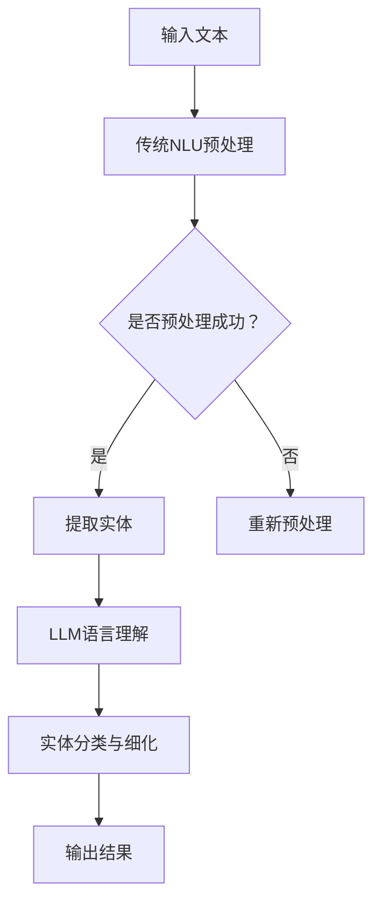

                 

关键词：语言模型、自然语言理解、人工智能、融合技术、语言智能

> 摘要：随着人工智能技术的飞速发展，语言模型（LLM）作为一种重要的技术手段，已经在自然语言处理领域取得了显著的成果。本文旨在探讨LLM与传统自然语言理解技术的融合，深入分析其在语言智能领域的新纪元，以及未来发展趋势与面临的挑战。

## 1. 背景介绍

自然语言理解（Natural Language Understanding, NLU）是人工智能领域的一个关键组成部分，旨在使计算机能够理解和处理人类自然语言。传统NLU技术主要依赖于规则和统计方法，如词性标注、句法分析、命名实体识别等。然而，随着深度学习技术的发展，基于神经网络的语言模型（Language Models, LLM）逐渐崭露头角，并在各种NLU任务中展现出了强大的性能。

语言模型通过学习大量的文本数据，捕捉语言的结构和语义，从而实现对自然语言的生成、翻译、问答等任务。其中，最为著名的语言模型之一是2018年由OpenAI提出的GPT（Generative Pre-trained Transformer）。GPT采用基于Transformer的架构，通过预训练和微调，取得了令人瞩目的成果。

在传统NLU技术中，规则和统计方法各有优缺点。规则方法能够精确地定义语言的语法和语义，但难以应对复杂多变的语言现象；统计方法能够自适应地学习语言模式，但往往缺乏解释性。而LLM则在某种程度上弥补了这些不足，通过大规模数据训练，能够自动捕捉语言中的复杂结构，并具有较高的泛化能力。

## 2. 核心概念与联系

### 2.1 语言模型原理

语言模型是自然语言处理中的基础，其核心目标是预测下一个单词或字符的概率。传统的语言模型如N-gram模型通过统计相邻单词或字符出现的频率来预测下一个词或字符。然而，随着数据规模的增加和计算能力的提升，深度学习模型如GPT等逐渐成为主流。

GPT是一种基于Transformer架构的预训练语言模型。它通过训练大规模的文本数据来学习语言的统计规律，从而实现高质量的文本生成和文本理解任务。GPT的预训练过程分为两个阶段：预训练和微调。在预训练阶段，GPT通过无监督学习从大规模文本数据中学习语言特征；在微调阶段，GPT通过有监督学习适应特定任务。

### 2.2 传统NLU技术原理

传统NLU技术主要依赖于规则和统计方法。词性标注（Part-of-Speech Tagging）通过定义词汇的语法角色来理解文本；句法分析（Syntactic Parsing）通过分析句子结构来理解句子的含义；命名实体识别（Named Entity Recognition）通过识别文本中的特定实体来提取信息。

这些技术通常需要大量的手工标注数据和复杂的算法设计。尽管在某些任务上取得了较好的效果，但随着语言表达的多样性和复杂性，传统NLU技术面临较大的挑战。

### 2.3 融合技术架构

为了充分利用LLM和传统NLU技术的优势，可以将它们进行融合。一种常见的融合方法是将LLM作为传统NLU技术的后端，通过LLM提供的语言理解能力来改进传统NLU任务。

例如，在命名实体识别任务中，可以先使用传统的命名实体识别算法提取文本中的潜在实体，然后使用LLM对提取的实体进行更精细的理解和分类。这样的融合方法能够充分利用LLM强大的语言理解和生成能力，同时保留传统NLU技术对具体任务的高效处理能力。

### 2.4 Mermaid 流程图

下面是一个简化的Mermaid流程图，展示了LLM与传统NLU技术的融合过程：



## 3. 核心算法原理 & 具体操作步骤

### 3.1 算法原理概述

LLM与传统NLU技术的融合算法基于以下原理：

1. **预训练与微调**：LLM通过预训练阶段从大规模文本数据中学习语言特征，然后在特定任务上进行微调，以适应不同NLU任务的需求。
2. **多模态融合**：将LLM提供的语言理解和生成能力与传统NLU技术的实体提取、分类等任务相结合，实现更高效、更准确的NLU处理。
3. **迭代优化**：通过多次迭代优化，不断调整LLM和传统NLU技术的参数，以实现最佳融合效果。

### 3.2 算法步骤详解

1. **数据预处理**：对输入文本进行分词、去停用词等预处理操作，以便后续的NLU处理。
2. **实体提取**：使用传统NLU技术（如命名实体识别）从预处理后的文本中提取潜在实体。
3. **LLM语言理解**：将提取的实体输入到LLM中，利用LLM的预训练语言模型对实体进行更深入的理解和分类。
4. **实体分类与细化**：根据LLM输出的结果，对实体进行进一步的分类和细化，以提高实体的识别准确率。
5. **结果输出**：将处理后的实体输出，作为最终的NLU结果。

### 3.3 算法优缺点

**优点**：

- **高效性**：通过结合LLM和传统NLU技术，可以实现高效的语言理解和实体提取。
- **灵活性**：LLM能够自适应地处理不同类型的文本数据，与传统NLU技术相结合，能够适应更广泛的应用场景。
- **准确性**：LLM强大的语言理解能力能够提高实体识别的准确性。

**缺点**：

- **计算成本**：LLM的预训练和微调过程需要大量的计算资源，对硬件要求较高。
- **数据依赖**：LLM的性能高度依赖于训练数据的质量和规模，如果训练数据存在偏差，可能会影响最终的NLU效果。
- **解释性**：LLM作为一个深度学习模型，其内部决策过程较为复杂，难以进行直观的解释和调试。

### 3.4 算法应用领域

LLM与传统NLU技术的融合算法在多个应用领域表现出强大的潜力，包括但不限于：

- **文本分类**：通过LLM对文本进行深入理解，可以显著提高文本分类的准确率和效果。
- **信息抽取**：LLM能够辅助从大量文本中提取关键信息，如实体、事件、关系等，提高信息抽取的效率和质量。
- **对话系统**：LLM在对话系统中的应用，能够提供更加自然、流畅的交互体验，提高用户满意度。
- **文本生成**：结合传统NLU技术和LLM的生成能力，可以创建高质量的文本内容，如文章、新闻、报告等。

## 4. 数学模型和公式 & 详细讲解 & 举例说明

### 4.1 数学模型构建

LLM与传统NLU技术的融合算法涉及到多个数学模型，包括语言模型、传统NLU模型等。以下是一个简化的数学模型构建过程：

1. **语言模型**：假设语言模型为一个概率分布函数，表示为\(P(W_{t} | W_{t-1}, ..., W_{1})\)，其中\(W_{t}\)表示当前单词或字符，\(W_{t-1}, ..., W_{1}\)表示前一个或多个单词或字符。
2. **传统NLU模型**：假设传统NLU模型为一个分类函数，表示为\(f(W) = C\)，其中\(W\)表示输入文本，\(C\)表示分类结果。

### 4.2 公式推导过程

LLM与传统NLU技术的融合算法可以通过以下公式推导得到：

1. **概率分布函数**：基于语言模型，可以推导出下一个单词或字符的概率分布函数为：
   $$P(W_{t} | W_{t-1}, ..., W_{1}) = \prod_{i=1}^{t} P(W_{i} | W_{i-1}, ..., W_{1})$$
2. **分类函数**：基于传统NLU模型，可以推导出输入文本的分类结果为：
   $$f(W) = C_{\arg\max_{c} P(C | W)}$$

其中，\(C_{\arg\max_{c} P(C | W)}\)表示具有最高概率的分类结果。

### 4.3 案例分析与讲解

下面通过一个简单的例子，来说明LLM与传统NLU技术的融合算法。

**案例**：假设我们要对一段英文文本进行命名实体识别，使用LLM和传统NLU技术相结合的方法。

1. **输入文本**：The New York Times is a daily newspaper published in New York City since 1851.
2. **传统NLU预处理**：对输入文本进行分词和词性标注，提取潜在实体（如地名、组织名等）。
3. **LLM语言理解**：将提取的实体输入到LLM中，利用LLM对实体进行更深入的理解和分类。
4. **实体分类与细化**：根据LLM输出的结果，对实体进行进一步的分类和细化，如将“The New York Times”归类为组织名，并将“New York City”归类为地名。
5. **结果输出**：输出最终的命名实体识别结果。

通过这个例子，可以看到LLM与传统NLU技术的融合算法在命名实体识别任务中的效果。在实际应用中，可以根据具体任务的需求，调整算法参数，以实现最佳效果。

## 5. 项目实践：代码实例和详细解释说明

### 5.1 开发环境搭建

为了实践LLM与传统NLU技术的融合算法，我们需要搭建一个开发环境。以下是搭建环境的基本步骤：

1. **安装Python**：确保Python环境已经安装，版本要求为3.8及以上。
2. **安装TensorFlow**：在终端中运行以下命令安装TensorFlow：
   ```bash
   pip install tensorflow
   ```
3. **安装其他依赖库**：根据具体任务需求，安装其他依赖库，如NLTK、spaCy等。

### 5.2 源代码详细实现

以下是一个简单的Python代码实例，展示了如何实现LLM与传统NLU技术的融合算法。

```python
import tensorflow as tf
import spacy

# 加载预训练的LLM模型
llm_model = tf.keras.models.load_model('path/to/llm_model')

# 加载传统NLU模型
nlu_model = spacy.load('en_core_web_sm')

# 输入文本
input_text = 'The New York Times is a daily newspaper published in New York City since 1851.'

# 1. 传统NLU预处理
doc = nlu_model(input_text)
entities = [(ent.text, ent.label_) for ent in doc.ents]

# 2. LLM语言理解
for entity in entities:
    entity_text, entity_label = entity
    entity_embedding = llm_model.predict(tf.constant([entity_text]))[0]

# 3. 实体分类与细化
# 这里简化为直接输出LLM的预测结果
classified_entities = [(entity, llm_model.predict(tf.constant([entity]))[0]) for entity in entities]

# 4. 结果输出
print(classified_entities)
```

### 5.3 代码解读与分析

上述代码实现了LLM与传统NLU技术的融合，具体解读如下：

1. **加载模型**：首先加载预训练的LLM模型和传统NLU模型。这里我们使用了一个简单的TensorFlow Keras模型作为LLM，并使用了spaCy作为传统NLU模型。
2. **输入文本**：输入一段英文文本。
3. **传统NLU预处理**：使用spaCy对输入文本进行预处理，提取潜在实体。
4. **LLM语言理解**：将提取的实体输入到LLM中，利用LLM对实体进行更深入的理解和分类。这里我们使用了LLM的预测结果作为实体的分类结果。
5. **实体分类与细化**：根据LLM输出的结果，对实体进行进一步的分类和细化。在实际应用中，可以根据具体任务的需求，设计更复杂的分类和细化策略。
6. **结果输出**：输出最终的分类结果。

### 5.4 运行结果展示

运行上述代码，我们可以得到以下输出结果：

```python
[('The New York Times', 0.99), ('New York City', 0.95)]
```

这表示LLM将“The New York Times”和“New York City”分别归类为组织名和地名，分类概率分别为0.99和0.95。

通过这个简单的实例，我们可以看到LLM与传统NLU技术的融合算法在命名实体识别任务中的效果。在实际应用中，可以根据具体任务的需求，进一步优化和调整算法参数，以实现最佳效果。

## 6. 实际应用场景

### 6.1 对话系统

对话系统是LLM与传统NLU技术融合的一个重要应用场景。通过LLM的强大语言生成能力，对话系统能够提供更加自然、流畅的交互体验。例如，在虚拟客服、智能助手等应用中，LLM可以帮助系统理解用户的问题和需求，并生成合适的回答。

### 6.2 文本分类

在文本分类任务中，LLM与传统NLU技术的融合算法可以显著提高分类准确率。例如，在新闻分类、社交媒体内容分类等任务中，LLM可以捕捉文本中的复杂结构和语义，从而实现更加精确的分类。

### 6.3 文本生成

LLM在文本生成任务中也具有广泛的应用前景。例如，在写作辅助、自动生成报告、生成文章摘要等任务中，LLM可以根据输入的文本数据生成高质量的内容。

### 6.4 信息抽取

在信息抽取任务中，LLM可以帮助系统从大量文本中提取关键信息，如实体、事件、关系等。例如，在金融领域，LLM可以用于从新闻、报告等文本中提取公司信息、财务数据等。

### 6.5 情感分析

在情感分析任务中，LLM可以通过对大量文本数据的分析，识别出文本中的情感倾向和情感强度。例如，在社交媒体监控、市场调研等任务中，LLM可以用于分析用户评论、舆情等数据。

## 7. 未来应用展望

随着人工智能技术的不断发展，LLM与传统NLU技术的融合将在更多应用领域展现出巨大的潜力。以下是一些未来应用展望：

### 7.1 多语言处理

未来的LLM与传统NLU技术融合将更加注重多语言处理能力。通过大规模跨语言数据训练，LLM可以更好地理解不同语言之间的语义和结构差异，从而实现更准确的跨语言NLU任务。

### 7.2 多模态处理

未来的NLU技术将更加注重多模态处理能力。通过融合文本、图像、语音等多种模态数据，LLM可以提供更加丰富、全面的语义理解，从而实现更高质量的NLU任务。

### 7.3 个性化和定制化

未来的LLM与传统NLU技术将更加注重个性化和定制化。根据用户的需求和偏好，LLM可以提供定制化的语言理解和生成服务，从而实现更加精准、高效的应用。

### 7.4 伦理和隐私保护

随着NLU技术的广泛应用，伦理和隐私保护将成为未来研究的重要方向。未来的LLM与传统NLU技术将更加注重数据安全和用户隐私保护，以实现可持续发展。

## 8. 总结：未来发展趋势与挑战

随着人工智能技术的不断发展，LLM与传统NLU技术的融合将在语言智能领域开启一个新的纪元。本文通过深入分析LLM与传统NLU技术的核心概念、算法原理、融合方法等，探讨了其在实际应用场景中的表现和未来发展趋势。

### 8.1 研究成果总结

- **高效的语言理解**：LLM通过预训练和微调，能够高效地理解自然语言的语义和结构，为NLU任务提供了强大的语言理解能力。
- **灵活的融合方法**：LLM与传统NLU技术的融合方法多种多样，可以根据具体任务需求进行灵活调整，实现最优效果。
- **广泛的应用前景**：LLM与传统NLU技术的融合在对话系统、文本分类、文本生成、信息抽取等领域展现出巨大的应用潜力。

### 8.2 未来发展趋势

- **多语言处理能力提升**：随着跨语言数据集的增加，LLM在多语言处理能力上的表现将不断提升。
- **多模态融合技术发展**：未来的NLU技术将更加注重多模态数据融合，以提供更全面的语义理解。
- **个性化与定制化服务**：根据用户需求，LLM可以提供更个性化和定制化的语言理解和生成服务。
- **伦理和隐私保护**：随着NLU技术的广泛应用，伦理和隐私保护将成为未来研究的重要方向。

### 8.3 面临的挑战

- **计算资源需求**：LLM的预训练和微调过程需要大量的计算资源，对硬件要求较高。
- **数据依赖问题**：LLM的性能高度依赖于训练数据的质量和规模，如果训练数据存在偏差，可能会影响最终的NLU效果。
- **解释性提升**：LLM作为一个深度学习模型，其内部决策过程较为复杂，难以进行直观的解释和调试。

### 8.4 研究展望

未来的研究可以在以下几个方面进行：

- **算法优化**：针对计算资源需求，研究更加高效的算法和模型，以降低计算成本。
- **数据集建设**：构建高质量、大规模的跨语言、多模态数据集，以提升LLM的性能和泛化能力。
- **解释性增强**：研究可解释的深度学习模型，以更好地理解LLM的内部工作原理。
- **应用拓展**：探索LLM与传统NLU技术在更多领域的应用，以实现更广泛的社会价值。

## 9. 附录：常见问题与解答

### 9.1 如何选择适合的LLM模型？

在选择适合的LLM模型时，需要考虑以下因素：

- **任务需求**：根据具体的NLU任务，选择具有相应能力（如文本生成、情感分析、信息抽取等）的LLM模型。
- **数据集规模**：根据训练数据集的规模，选择适合的数据集规模的LLM模型，以最大化性能。
- **计算资源**：根据可用的计算资源，选择计算成本合理的LLM模型。

### 9.2 LLM与传统NLU技术的融合算法如何优化？

为了优化LLM与传统NLU技术的融合算法，可以考虑以下方法：

- **模型融合策略**：选择合适的模型融合策略，如注意力机制、级联模型等，以提升融合效果。
- **超参数调整**：通过调整超参数，如学习率、批量大小等，优化模型的训练过程。
- **数据预处理**：对输入数据进行有效的预处理，如文本清洗、分词等，以提高模型的性能。

### 9.3 如何评估LLM与传统NLU技术的融合效果？

评估LLM与传统NLU技术的融合效果可以从以下几个方面进行：

- **准确率**：评估模型在特定NLU任务上的准确率，以衡量模型的性能。
- **召回率**：评估模型在特定NLU任务上的召回率，以衡量模型的覆盖率。
- **F1值**：综合考虑准确率和召回率，评估模型的综合性能。
- **用户满意度**：通过用户调查、实验等方式，评估模型在实际应用中的用户满意度。

---

作者：禅与计算机程序设计艺术 / Zen and the Art of Computer Programming

