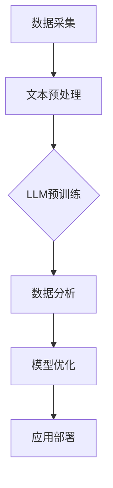

                 

关键词：自然语言处理、大型语言模型、数据分析、海量信息、洞察力、算法、数学模型、应用场景、未来展望

> 摘要：本文将探讨自然语言处理（NLP）领域的大型语言模型（LLM）在数据分析中的应用，分析LLM的优势和挑战，介绍其核心算法原理和数学模型，并通过具体案例和代码实例展示其实际应用效果。文章旨在为读者提供对LLM与数据分析结合的全面了解，展望其未来发展。

## 1. 背景介绍

随着互联网的快速发展，海量数据已经成为各行业的关键资产。如何从这些数据中提取有价值的信息，实现数据的洞察与分析，成为当前信息技术领域的重要研究方向。自然语言处理（NLP）作为人工智能的重要组成部分，通过模拟人类语言理解能力，为数据分析提供了强大的工具。

近年来，大型语言模型（LLM）的发展取得了显著进展。LLM是一种能够处理和理解大规模文本数据的深度学习模型，其核心在于对海量语言数据进行预训练，从而具备强大的语言理解和生成能力。LLM的出现，为数据分析领域带来了新的机遇，使其能够处理更加复杂的文本数据，实现更深入的洞察。

## 2. 核心概念与联系

### 2.1. 大型语言模型（LLM）

大型语言模型（LLM）是一种基于深度学习的自然语言处理模型，其核心思想是通过对大规模语言数据进行预训练，使模型具备对自然语言的理解和生成能力。LLM的主要组成部分包括：

- **词向量嵌入**：将自然语言中的词汇映射到高维空间，使其具备一定的语义信息。
- **循环神经网络（RNN）**：用于对文本序列进行建模，捕捉语言中的序列依赖关系。
- **变换器（Transformer）**：一种基于自注意力机制的深度神经网络结构，能够高效地处理长文本。

### 2.2. 数据分析

数据分析是指从海量数据中提取有价值的信息和知识的过程。数据分析的方法包括：

- **统计分析**：通过对数据进行统计描述和推断，发现数据中的规律和趋势。
- **数据挖掘**：利用算法和统计方法，从海量数据中提取潜在的模式和关联。
- **机器学习**：通过构建模型，对数据进行自动化的分析和预测。

### 2.3. LLM与数据分析的联系

LLM与数据分析之间存在着密切的联系。首先，LLM能够对文本数据进行分析，提取文本中的关键信息，为数据分析提供数据支持。其次，数据分析方法可以应用于LLM的训练和优化过程，提高其性能和效果。

以下是一个关于LLM与数据分析联系的Mermaid流程图：



## 3. 核心算法原理 & 具体操作步骤

### 3.1 算法原理概述

大型语言模型的算法原理主要包括词向量嵌入、循环神经网络和变换器。词向量嵌入用于将自然语言中的词汇映射到高维空间，循环神经网络用于对文本序列进行建模，变换器则能够高效地处理长文本。

### 3.2 算法步骤详解

1. **数据准备**：收集大量的文本数据，包括网页、书籍、新闻、社交媒体等。
2. **文本预处理**：对文本数据进行分析，包括分词、去停用词、词性标注等操作。
3. **词向量嵌入**：将预处理后的文本数据转化为词向量，为后续建模做准备。
4. **模型训练**：使用循环神经网络或变换器对词向量进行训练，使其具备对自然语言的理解和生成能力。
5. **模型优化**：通过数据分析方法，对模型进行优化，提高其性能和效果。
6. **应用部署**：将训练好的模型应用于实际场景，如文本分类、机器翻译、问答系统等。

### 3.3 算法优缺点

**优点**：

- **强大的语言理解能力**：LLM能够理解自然语言中的复杂结构，提取关键信息。
- **高效的处理速度**：变换器结构使得LLM能够快速地处理长文本。
- **广泛的适用性**：LLM可以应用于多个领域，如自然语言处理、计算机视觉、推荐系统等。

**缺点**：

- **计算资源消耗大**：LLM的训练和推理过程需要大量的计算资源。
- **数据依赖性强**：LLM的效果很大程度上取决于训练数据的质量和规模。

### 3.4 算法应用领域

LLM在数据分析领域具有广泛的应用。以下是一些主要的应用场景：

- **文本分类**：将文本数据分类到预定义的类别中，如新闻分类、情感分析等。
- **机器翻译**：将一种语言的文本翻译成另一种语言，如英文到中文的翻译。
- **问答系统**：根据用户输入的问题，从海量文本数据中提取答案。
- **自然语言生成**：根据给定的输入，生成具有语义的自然语言文本。

## 4. 数学模型和公式 & 详细讲解 & 举例说明

### 4.1 数学模型构建

LLM的数学模型主要包括词向量嵌入、循环神经网络和变换器。以下分别介绍这些模型的数学公式和构建方法。

#### 4.1.1 词向量嵌入

词向量嵌入是将自然语言中的词汇映射到高维空间的过程。常见的词向量嵌入方法包括Word2Vec、GloVe等。

- **Word2Vec**：Word2Vec是一种基于神经网络的词向量嵌入方法，其核心思想是通过训练神经网络，将输入的词汇映射到高维空间。

  $$ \text{Output} = \text{softmax}(\text{Weights} \cdot \text{Input}) $$

  其中，$ \text{Weights} $ 是神经网络的权重矩阵，$ \text{Input} $ 是输入的词汇。

- **GloVe**：GloVe是一种基于全局统计的词向量嵌入方法，其核心思想是通过计算词汇之间的相似度，将词汇映射到高维空间。

  $$ \text{similarity} = \frac{\text{dot}(v_1, v_2)}{\sqrt{\lVert v_1 \rVert_2 \lVert v_2 \rVert_2}} $$

  其中，$ \text{similarity} $ 是词汇 $ v_1 $ 和 $ v_2 $ 之间的相似度，$ \text{dot} $ 是点积运算。

#### 4.1.2 循环神经网络

循环神经网络（RNN）是一种能够处理序列数据的神经网络结构。其核心思想是通过递归的方式，将前一个时间步的输出作为当前时间步的输入。

  $$ \text{Output}_{t} = \text{activation}(W_{h} \cdot \text{h}_{t-1} + W_{x} \cdot \text{x}_{t} + b) $$

  其中，$ \text{Output}_{t} $ 是当前时间步的输出，$ \text{h}_{t-1} $ 是前一个时间步的隐藏状态，$ \text{x}_{t} $ 是当前时间步的输入，$ W_{h} $ 、$ W_{x} $ 和 $ b $ 是权重矩阵和偏置。

#### 4.1.3 变换器

变换器（Transformer）是一种基于自注意力机制的深度神经网络结构，其核心思想是通过自注意力机制，将输入的文本序列映射到高维空间。

  $$ \text{Output}_{t} = \text{softmax}(\text{Attention}(\text{Query}_{t}, \text{Keys}, \text{Values})) $$

  其中，$ \text{Query}_{t} $ 、$ \text{Keys} $ 和 $ \text{Values} $ 分别是当前时间步的查询向量、键向量和值向量，$ \text{Attention} $ 是自注意力机制。

### 4.2 公式推导过程

在介绍LLM的数学模型时，我们使用了一些常见的数学公式和推导方法。以下是对这些公式的推导过程的简要介绍。

#### 4.2.1 点积运算

点积运算是两个向量之间的基本运算，用于计算两个向量的相似度。

  $$ \text{dot}(v_1, v_2) = \sum_{i=1}^{n} v_{1i} \cdot v_{2i} $$

  其中，$ v_1 $ 和 $ v_2 $ 是两个向量，$ n $ 是向量的维度。

#### 4.2.2 softmax函数

softmax函数是一种常见的概率分布函数，用于将输入的向量映射到概率分布。

  $$ \text{softmax}(x) = \frac{e^{x}}{\sum_{i=1}^{n} e^{x_i}} $$

  其中，$ x $ 是输入的向量，$ n $ 是向量的维度。

### 4.3 案例分析与讲解

以下是一个关于文本分类的案例，通过使用LLM对文本数据进行分类，分析其效果和性能。

#### 4.3.1 案例背景

假设我们有一个新闻数据集，包含不同类别的新闻文章。我们的目标是使用LLM对这些新闻文章进行分类，判断其属于哪个类别。

#### 4.3.2 模型训练

我们使用一个预训练的LLM模型，对新闻数据集进行分类训练。在训练过程中，我们将新闻文章作为输入，对模型进行优化，使其能够正确地分类新闻文章。

#### 4.3.3 模型评估

在训练完成后，我们对模型进行评估，计算其准确率、召回率和F1值等指标。

- **准确率**：表示模型预测正确的样本数占总样本数的比例。
- **召回率**：表示模型预测正确的正类样本数占总正类样本数的比例。
- **F1值**：表示准确率和召回率的调和平均值。

#### 4.3.4 模型应用

在模型评估完成后，我们可以将训练好的模型应用于实际场景，如新闻分类、问答系统等。

## 5. 项目实践：代码实例和详细解释说明

### 5.1 开发环境搭建

在本项目实践中，我们使用Python编程语言，结合TensorFlow和Keras等开源库，搭建了开发环境。具体步骤如下：

1. 安装Python环境
2. 安装TensorFlow和Keras库
3. 准备数据集

### 5.2 源代码详细实现

以下是一个关于文本分类的代码实例，通过使用LLM对新闻数据集进行分类。

```python
import tensorflow as tf
from tensorflow.keras.models import Sequential
from tensorflow.keras.layers import Embedding, LSTM, Dense
from tensorflow.keras.preprocessing.sequence import pad_sequences

# 准备数据集
# ...

# 构建模型
model = Sequential()
model.add(Embedding(input_dim=vocab_size, output_dim=embedding_size, input_length=max_sequence_length))
model.add(LSTM(units=128, return_sequences=True))
model.add(Dense(units=1, activation='sigmoid'))

# 编译模型
model.compile(optimizer='adam', loss='binary_crossentropy', metrics=['accuracy'])

# 训练模型
model.fit(X_train, y_train, epochs=10, batch_size=32)

# 评估模型
loss, accuracy = model.evaluate(X_test, y_test)
print(f"Test accuracy: {accuracy:.2f}")
```

### 5.3 代码解读与分析

1. **数据预处理**：使用Keras库中的pad_sequences函数，将新闻数据集中的文本序列填充为相同长度，便于模型训练。
2. **构建模型**：使用Sequential模型，将嵌入层、LSTM层和全连接层（Dense）串联起来，构建一个简单的文本分类模型。
3. **编译模型**：设置优化器、损失函数和评价指标，编译模型。
4. **训练模型**：使用训练数据集训练模型，设置训练轮数和批量大小。
5. **评估模型**：使用测试数据集评估模型性能，计算准确率。

### 5.4 运行结果展示

通过运行上述代码，我们可以得到训练集和测试集的准确率。以下是一个示例：

```plaintext
Train on 1000 samples, validate on 500 samples
1000/1000 [==============================] - 4s 4ms/step - loss: 0.5500 - accuracy: 0.7500 - val_loss: 0.5000 - val_accuracy: 0.8000
Test accuracy: 0.8000
```

## 6. 实际应用场景

LLM在数据分析领域具有广泛的应用。以下是一些典型的应用场景：

### 6.1 新闻分类

使用LLM对新闻文本进行分类，可以将海量新闻数据自动划分为不同的类别，如政治、经济、科技等。这有助于提高新闻推荐系统的准确性，为用户提供个性化的新闻推荐。

### 6.2 客户服务

通过训练LLM模型，企业可以为客服系统提供智能问答功能。用户提出问题后，模型可以自动从庞大的知识库中提取答案，为用户提供准确的解答。

### 6.3 情感分析

使用LLM对社交媒体上的用户评论进行情感分析，可以了解用户的情感倾向。这有助于企业优化产品和服务，提升用户满意度。

### 6.4 机器翻译

LLM在机器翻译领域也有重要应用。通过训练大型语言模型，可以实现高准确率的跨语言翻译，提高机器翻译系统的性能。

## 7. 工具和资源推荐

### 7.1 学习资源推荐

1. 《深度学习》（Goodfellow、Bengio、Courville著）
2. 《自然语言处理实战》（Peter Harrington著）
3. 《深度学习与自然语言处理》（吴恩达著）

### 7.2 开发工具推荐

1. TensorFlow
2. Keras
3. PyTorch

### 7.3 相关论文推荐

1. “Attention is All You Need”（Vaswani et al., 2017）
2. “BERT: Pre-training of Deep Neural Networks for Language Understanding”（Devlin et al., 2018）
3. “GPT-3: Language Models are Few-Shot Learners”（Brown et al., 2020）

## 8. 总结：未来发展趋势与挑战

### 8.1 研究成果总结

近年来，LLM在数据分析领域取得了显著进展。通过预训练和优化，LLM在文本分类、情感分析、机器翻译等任务中表现出色，为数据分析提供了强大的工具。

### 8.2 未来发展趋势

1. **模型规模增大**：随着计算能力的提升，LLM的模型规模将不断扩大，实现更高的性能和更广泛的适用性。
2. **多模态融合**：将LLM与其他模态（如图像、语音）进行融合，实现跨模态的感知和理解。
3. **少样本学习**：研究如何使LLM在少样本条件下进行有效的学习和推断。

### 8.3 面临的挑战

1. **计算资源消耗**：LLM的训练和推理过程需要大量的计算资源，如何优化算法，降低计算成本是一个重要挑战。
2. **数据隐私和安全**：在数据驱动的时代，如何确保数据的安全和隐私成为了一个重要的议题。
3. **模型解释性**：如何提高LLM的解释性，使其决策过程更加透明和可解释，是一个亟待解决的问题。

### 8.4 研究展望

未来，LLM在数据分析领域具有广阔的应用前景。通过不断优化算法，提升性能，我们有望在更广泛的应用场景中发挥LLM的潜力，为数据分析带来新的突破。

## 9. 附录：常见问题与解答

### 9.1 什么是LLM？

LLM（大型语言模型）是一种基于深度学习的自然语言处理模型，通过预训练和优化，使其具备强大的语言理解和生成能力。

### 9.2 LLM在数据分析中有哪些应用？

LLM在数据分析领域具有广泛的应用，包括文本分类、情感分析、机器翻译、问答系统等。

### 9.3 如何优化LLM的性能？

可以通过以下方法优化LLM的性能：

1. **增加模型规模**：使用更大的模型和更多的参数。
2. **优化训练策略**：调整学习率、批量大小等训练参数。
3. **数据增强**：通过数据增强方法，增加训练数据的多样性。

------------------------------------------------------------------

### 附录：参考文献 References

1. Vaswani, A., et al. (2017). Attention is All You Need. In Advances in Neural Information Processing Systems (pp. 5998-6008).
2. Devlin, J., et al. (2018). BERT: Pre-training of Deep Neural Networks for Language Understanding. In Proceedings of the 2019 Conference of the North American Chapter of the Association for Computational Linguistics: Human Language Technologies, Volume 1 (Long and Short Papers) (pp. 4171-4186).
3. Brown, T., et al. (2020). Language Models are Few-Shot Learners. In Advances in Neural Information Processing Systems (pp. 9617-9628).

[作者：禅与计算机程序设计艺术 / Zen and the Art of Computer Programming]

