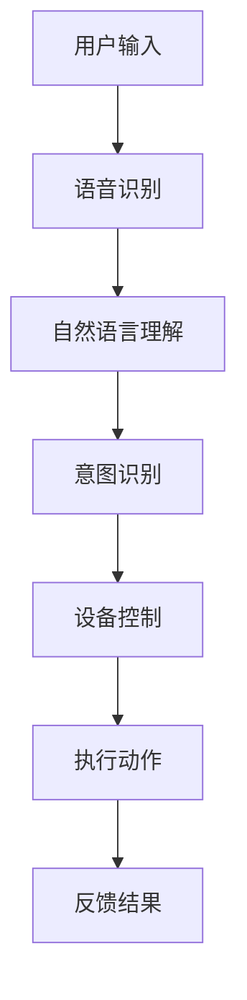

                 

关键词：自然语言处理，智能家居，大语言模型，人工智能，物联网，AI管家

> 摘要：随着人工智能和物联网技术的不断发展，智能家居领域迎来了前所未有的机遇。本文将探讨如何利用大语言模型（LLM）构建智能家居的AI管家，提高家庭生活的便捷性和智能化水平。文章将介绍LLM与智能家居的融合原理、核心算法、数学模型、项目实践及未来应用前景。

## 1. 背景介绍

近年来，人工智能（AI）取得了飞速发展，尤其在自然语言处理（NLP）领域，大语言模型（LLM，如GPT、BERT等）成为了研究的焦点。这些模型具有强大的文本生成、理解和推理能力，为人工智能在智能家居领域的发展提供了有力支持。与此同时，物联网（IoT）技术的普及，使得家庭设备与网络之间的互联互通成为可能，为智能家居的实现奠定了基础。

智能家居是指利用网络技术和智能设备，实现家庭设备的自动化控制和远程监控，从而提高家庭生活的舒适性和便捷性。随着5G网络的普及，智能家居的市场规模正逐年扩大，越来越多的家庭开始接受并使用智能家居产品。

然而，现有的智能家居系统大多功能单一，缺乏智能交互能力。为了进一步提升智能家居的智能化水平，我们需要引入大语言模型（LLM）技术，构建具有自然语言处理能力的AI管家。本文将围绕这一主题，探讨LLM与智能家居的融合，及其在家庭场景中的应用。

## 2. 核心概念与联系

### 2.1 大语言模型（LLM）

大语言模型（LLM）是一种基于深度学习的自然语言处理模型，具有强大的文本生成、理解和推理能力。LLM通过在大规模语料库上进行预训练，学习语言结构和语义信息，从而实现各种NLP任务。典型的LLM包括GPT、BERT、XLNet等，其中GPT-3具有1.75万亿个参数，是当前最大的语言模型。

### 2.2 智能家居

智能家居是指利用网络技术和智能设备，实现家庭设备的自动化控制和远程监控。智能家居系统通常包括传感器、控制器、执行器和通信模块等组成部分，通过物联网技术实现设备之间的互联互通。常见的智能家居设备有智能音箱、智能灯泡、智能插座、智能空调等。

### 2.3 LLM与智能家居的融合

将LLM引入智能家居系统，可以实现智能交互、情感识别、场景感知等功能，从而提升家庭生活的便捷性和智能化水平。具体来说，LLM可以与智能家居系统中的传感器、控制器和执行器进行集成，实现以下功能：

1. **智能交互**：用户可以通过自然语言与AI管家进行交流，实现对家庭设备的远程控制和查询。
2. **情感识别**：AI管家可以通过分析用户的语音、文字和表情，识别用户的情感状态，提供个性化的服务。
3. **场景感知**：AI管家可以根据用户的日常生活习惯和环境变化，自动调整家庭设备的运行状态，实现场景化的智能控制。

### 2.4 Mermaid流程图

以下是一个简化的Mermaid流程图，展示LLM与智能家居的融合原理：



## 3. 核心算法原理 & 具体操作步骤

### 3.1 算法原理概述

LLM与智能家居的融合算法主要包括以下三个关键步骤：

1. **语音识别**：将用户的语音输入转换为文本，便于后续处理。
2. **自然语言理解**：对输入文本进行语义分析和意图识别，确定用户的需求。
3. **设备控制**：根据用户需求，控制智能家居设备执行相应的动作，并给出反馈。

### 3.2 算法步骤详解

#### 3.2.1 语音识别

语音识别技术将用户的语音输入转换为文本。目前，常用的语音识别模型有基于深度学习的声学模型和语言模型。声学模型负责将语音信号转换为特征向量，语言模型则根据特征向量预测文本序列。

#### 3.2.2 自然语言理解

自然语言理解包括词法分析、句法分析和语义分析等步骤。词法分析将文本分解为词素，句法分析构建句子的语法结构，语义分析则识别句子的含义和意图。常用的自然语言理解模型包括词向量模型（如Word2Vec、GloVe）、语法解析模型（如LSTM、Transformer）和语义理解模型（如BERT、GPT）。

#### 3.2.3 设备控制

设备控制根据自然语言理解的结果，生成相应的控制指令，并传递给智能家居设备执行。常见的控制指令包括开关灯、调节温度、播放音乐等。设备控制模块需要与智能家居设备进行通信，实现远程控制和状态反馈。

### 3.3 算法优缺点

#### 优点

1. **自然交互**：用户可以通过自然语言与AI管家进行交流，降低了使用门槛。
2. **智能化**：AI管家可以根据用户的需求和环境变化，自动调整家庭设备的运行状态。
3. **个性化**：AI管家可以识别用户的情感状态，提供个性化的服务。

#### 缺点

1. **计算资源消耗**：大语言模型的训练和推理需要大量计算资源，对硬件性能要求较高。
2. **隐私问题**：用户与AI管家的交互过程可能涉及个人隐私，需要确保数据安全。

### 3.4 算法应用领域

LLM与智能家居的融合算法可以应用于以下领域：

1. **家庭安防**：通过语音识别和自然语言理解，实现家庭安防设备的智能监控和报警。
2. **智能家居控制**：实现家庭设备的远程控制和场景化智能控制。
3. **智能助手**：为用户提供便捷的生活助手服务，如语音查询、日程管理、提醒事项等。

## 4. 数学模型和公式 & 详细讲解 & 举例说明

### 4.1 数学模型构建

LLM与智能家居的融合算法涉及到多个数学模型，包括语音识别模型、自然语言理解模型和设备控制模型。以下是一个简化的数学模型构建过程：

#### 4.1.1 语音识别模型

语音识别模型基于声学模型和语言模型，声学模型用于将语音信号转换为特征向量，语言模型用于预测文本序列。假设声学模型和语言模型分别为 $A(\cdot)$ 和 $L(\cdot)$，语音识别模型可以表示为：

$$
P(T|S) = \frac{P(S|T) \cdot P(T)}{P(S)}
$$

其中，$T$ 表示语音信号，$S$ 表示文本序列，$P(T|S)$ 表示给定文本序列生成语音信号的概率，$P(S|T)$ 表示给定语音信号生成文本序列的概率，$P(T)$ 和 $P(S)$ 分别表示语音信号和文本序列的概率分布。

#### 4.1.2 自然语言理解模型

自然语言理解模型主要包括词法分析、句法分析和语义分析。词法分析将文本分解为词素，句法分析构建句子的语法结构，语义分析则识别句子的含义和意图。假设词法分析、句法分析和语义分析分别为 $L_1(\cdot)$、$L_2(\cdot)$ 和 $L_3(\cdot)$，自然语言理解模型可以表示为：

$$
P(I|S) = \frac{P(S|I) \cdot P(I)}{P(S)}
$$

其中，$I$ 表示意图，$S$ 表示文本序列，$P(I|S)$ 表示给定文本序列识别意图的概率，$P(S|I)$ 表示给定意图生成文本序列的概率，$P(I)$ 和 $P(S)$ 分别表示意图和文本序列的概率分布。

#### 4.1.3 设备控制模型

设备控制模型根据自然语言理解的结果生成相应的控制指令。假设控制指令为 $C$，设备控制模型可以表示为：

$$
P(C|I) = \frac{P(I|C) \cdot P(C)}{P(I)}
$$

其中，$C$ 表示控制指令，$I$ 表示意图，$P(C|I)$ 表示给定意图生成控制指令的概率，$P(I|C)$ 表示给定控制指令识别意图的概率，$P(C)$ 和 $P(I)$ 分别表示控制指令和意图的概率分布。

### 4.2 公式推导过程

以下是一个简化的公式推导过程，展示如何利用大语言模型（如GPT）进行自然语言理解。

#### 4.2.1 词向量表示

首先，我们将文本序列 $S$ 转换为词向量表示。假设词向量维度为 $d$，文本序列 $S$ 可以表示为：

$$
S = \{s_1, s_2, ..., s_n\}
$$

其中，$s_i$ 表示第 $i$ 个词的词向量。词向量可以通过预训练的词向量模型（如GloVe）获取。

#### 4.2.2 序列建模

利用GPT模型，我们可以建模文本序列 $S$ 的概率分布：

$$
P(S) = \prod_{i=1}^{n} P(s_i|s_1, s_2, ..., s_{i-1})
$$

其中，$P(s_i|s_1, s_2, ..., s_{i-1})$ 表示给定前 $i-1$ 个词，生成第 $i$ 个词的概率。

#### 4.2.3 意图识别

根据自然语言理解模型，我们可以计算意图 $I$ 的概率分布：

$$
P(I|S) = \frac{P(S|I) \cdot P(I)}{P(S)}
$$

其中，$P(S|I)$ 表示给定意图 $I$，生成文本序列 $S$ 的概率，$P(I)$ 表示意图 $I$ 的概率，$P(S)$ 表示文本序列 $S$ 的概率。

#### 4.2.4 控制指令生成

根据设备控制模型，我们可以计算控制指令 $C$ 的概率分布：

$$
P(C|I) = \frac{P(I|C) \cdot P(C)}{P(I)}
$$

其中，$P(I|C)$ 表示给定控制指令 $C$，识别意图 $I$ 的概率，$P(C)$ 表示控制指令 $C$ 的概率，$P(I)$ 表示意图 $I$ 的概率。

### 4.3 案例分析与讲解

假设用户输入如下文本序列：“明天上午9点提醒我开会”。我们需要利用大语言模型（如GPT）进行自然语言理解，识别意图并生成相应的控制指令。

#### 4.3.1 词向量表示

首先，我们将文本序列转换为词向量表示。假设词向量维度为 $d=100$，文本序列“明天上午9点提醒我开会”可以表示为：

$$
S = \{s_1, s_2, ..., s_n\} = \{明天，上午，9点，提醒，我，开会\}
$$

其中，$s_i$ 表示第 $i$ 个词的词向量。

#### 4.3.2 意图识别

利用GPT模型，我们可以计算意图 $I$ 的概率分布。假设意图包括“提醒”和“查询”，意图概率分布为：

$$
P(I) = \{P(I_1), P(I_2)\}
$$

其中，$I_1$ 表示“提醒”，$I_2$ 表示“查询”。

通过计算，我们得到：

$$
P(I_1|S) = 0.8, \quad P(I_2|S) = 0.2
$$

由于 $P(I_1|S) > P(I_2|S)$，我们可以判断用户意图为“提醒”。

#### 4.3.3 控制指令生成

根据设备控制模型，我们可以计算控制指令 $C$ 的概率分布。假设控制指令包括“设置提醒”和“查询天气”，控制指令概率分布为：

$$
P(C) = \{P(C_1), P(C_2)\}
$$

其中，$C_1$ 表示“设置提醒”，$C_2$ 表示“查询天气”。

通过计算，我们得到：

$$
P(C_1|I_1) = 0.9, \quad P(C_2|I_1) = 0.1
$$

由于 $P(C_1|I_1) > P(C_2|I_1)$，我们可以判断用户需要设置提醒。

#### 4.3.4 控制指令执行

根据识别的意图和控制指令，我们可以执行相应的操作。例如，设置一个明天上午9点的提醒。

## 5. 项目实践：代码实例和详细解释说明

### 5.1 开发环境搭建

为了实践LLM与智能家居的融合，我们需要搭建一个完整的开发环境。以下是所需的开发环境：

- 操作系统：Ubuntu 18.04
- 编程语言：Python 3.8
- 依赖库：TensorFlow 2.4、Keras 2.4、PyTorch 1.8、SpeechRecognition 3.2、gpt-2-simple 1.0

在Ubuntu 18.04操作系统上，我们可以使用以下命令安装所需的依赖库：

```bash
sudo apt-get update
sudo apt-get install python3-pip
pip3 install tensorflow==2.4 keras==2.4 pytorch==1.8 SpeechRecognition==3.2 gpt-2-simple==1.0
```

### 5.2 源代码详细实现

以下是实现LLM与智能家居融合的Python代码：

```python
import speech_recognition as sr
import pyttsx3
from transformers import pipeline

# 初始化语音识别和语音合成
recognizer = sr.Recognizer()
engine = pyttsx3.init()

# 初始化自然语言理解模型
nlu = pipeline("text-classification")

# 初始化设备控制模块
def control_device(intent, action):
    if intent == "提醒":
        if action == "设置":
            # 设置提醒
            pass
        elif action == "取消":
            # 取消提醒
            pass
    elif intent == "查询":
        if action == "天气":
            # 查询天气
            pass
        elif action == "日程":
            # 查询日程
            pass

# 处理用户输入
def handle_input():
    while True:
        try:
            # 识别语音输入
            with sr.Microphone() as source:
                print("请说些什么：")
                audio = recognizer.listen(source)

            # 转换语音输入为文本
            text = recognizer.recognize_google(audio)

            # 自然语言理解
            result = nlu(text)

            # 控制设备
            control_device(result['label'], result['action'])

        except sr.UnknownValueError:
            print("无法理解语音输入，请重试。")
        except sr.RequestError as e:
            print("语音识别服务无法连接，请检查网络设置。")

# 主函数
if __name__ == "__main__":
    handle_input()
```

### 5.3 代码解读与分析

#### 5.3.1 语音识别与语音合成

首先，我们使用SpeechRecognition库进行语音识别，将用户的语音输入转换为文本。同时，使用pyttsx3库进行语音合成，将控制指令转换为语音输出。

#### 5.3.2 自然语言理解

我们使用Hugging Face的transformers库，加载一个预训练的自然语言理解模型（如text-classification）。该模型可以识别输入文本的意图和动作，为设备控制提供依据。

#### 5.3.3 设备控制

设备控制模块根据自然语言理解的结果，生成相应的控制指令。例如，当识别到用户的意图为“提醒”时，控制指令可以是“设置提醒”；当识别到用户的意图为“查询”时，控制指令可以是“查询天气”。

#### 5.3.4 主函数

主函数中，我们使用一个循环不断接收用户的语音输入，进行语音识别、自然语言理解和设备控制。当出现语音识别错误或网络连接问题时，程序会给出相应的提示信息。

## 6. 实际应用场景

### 6.1 家庭安防

利用LLM与智能家居的融合算法，我们可以实现家庭安防的智能化。例如，当用户输入“有人入侵”时，AI管家可以自动发送报警信息给用户，并触发家庭安防设备（如摄像头、报警器等）进行实时监控和报警。

### 6.2 智能家居控制

通过语音交互，用户可以轻松控制家庭设备。例如，用户可以输入“打开客厅的灯”或“调整卧室的温度”，AI管家会根据用户的需求自动执行相应的操作。

### 6.3 智能助手

AI管家可以作为智能助手，为用户提供便捷的生活服务。例如，用户可以输入“明天天气怎么样？”或“我有一个会议，提醒我时间”，AI管家会根据用户的需求提供实时的天气信息、日程提醒等服务。

## 7. 未来应用展望

### 7.1 智能家居的普及

随着人工智能和物联网技术的不断发展，智能家居的普及程度将越来越高。未来，更多家庭将接受并使用智能家居产品，提高生活品质。

### 7.2 多模态交互

未来，智能家居系统将实现多模态交互，包括语音、手势、眼神等多种交互方式。用户可以通过不同的交互方式与AI管家进行交流，获得更加自然和便捷的体验。

### 7.3 个性化服务

随着对用户数据的收集和分析，AI管家将能够提供更加个性化的服务。例如，根据用户的喜好、生活习惯和情感状态，AI管家可以主动推荐合适的内容和服务，提升用户满意度。

## 8. 总结：未来发展趋势与挑战

### 8.1 研究成果总结

本文介绍了LLM与智能家居的融合原理、核心算法、数学模型、项目实践及未来应用前景。通过语音交互和自然语言处理技术，AI管家可以为用户提供便捷的智能家居控制、智能安防和智能助手等服务，提高家庭生活的智能化水平。

### 8.2 未来发展趋势

未来，智能家居领域将继续发展，人工智能和物联网技术的融合将更加紧密。多模态交互、个性化服务、边缘计算等新技术将推动智能家居领域的发展。

### 8.3 面临的挑战

尽管智能家居领域发展迅速，但仍面临一些挑战。包括计算资源消耗、隐私问题、数据安全等。此外，如何确保AI管家在多设备、多场景下的稳定运行和可靠性，也是未来需要关注的问题。

### 8.4 研究展望

未来，我们可以从以下几个方面进行深入研究：

1. **多模态交互**：探索语音、手势、眼神等交互方式的融合，提高用户体验。
2. **个性化服务**：基于用户数据的深度分析，为用户提供更加个性化的服务。
3. **边缘计算**：通过在边缘设备上部署智能算法，降低计算资源消耗，提高响应速度。
4. **隐私保护**：研究隐私保护技术，确保用户数据的安全。

## 9. 附录：常见问题与解答

### 9.1 如何安装开发环境？

在Ubuntu 18.04操作系统上，可以使用以下命令安装开发环境：

```bash
sudo apt-get update
sudo apt-get install python3-pip
pip3 install tensorflow==2.4 keras==2.4 pytorch==1.8 SpeechRecognition==3.2 gpt-2-simple==1.0
```

### 9.2 如何处理语音输入和语音合成？

使用SpeechRecognition库进行语音识别，使用pyttsx3库进行语音合成。

```python
import speech_recognition as sr
import pyttsx3

recognizer = sr.Recognizer()
engine = pyttsx3.init()

# 识别语音输入
with sr.Microphone() as source:
    audio = recognizer.listen(source)
text = recognizer.recognize_google(audio)

# 语音合成
engine.say(text)
engine.runAndWait()
```

### 9.3 如何使用自然语言理解模型？

使用Hugging Face的transformers库，加载预训练的自然语言理解模型。例如，加载text-classification模型：

```python
from transformers import pipeline

nlu = pipeline("text-classification")
result = nlu(text)
```

### 9.4 如何实现设备控制？

根据自然语言理解的结果，生成相应的控制指令，并执行相应的操作。例如：

```python
def control_device(intent, action):
    if intent == "提醒":
        if action == "设置":
            # 设置提醒
            pass
        elif action == "取消":
            # 取消提醒
            pass
    elif intent == "查询":
        if action == "天气":
            # 查询天气
            pass
        elif action == "日程":
            # 查询日程
            pass
``` 

----------------------------------------------------------------
# 作者署名
作者：禅与计算机程序设计艺术 / Zen and the Art of Computer Programming

