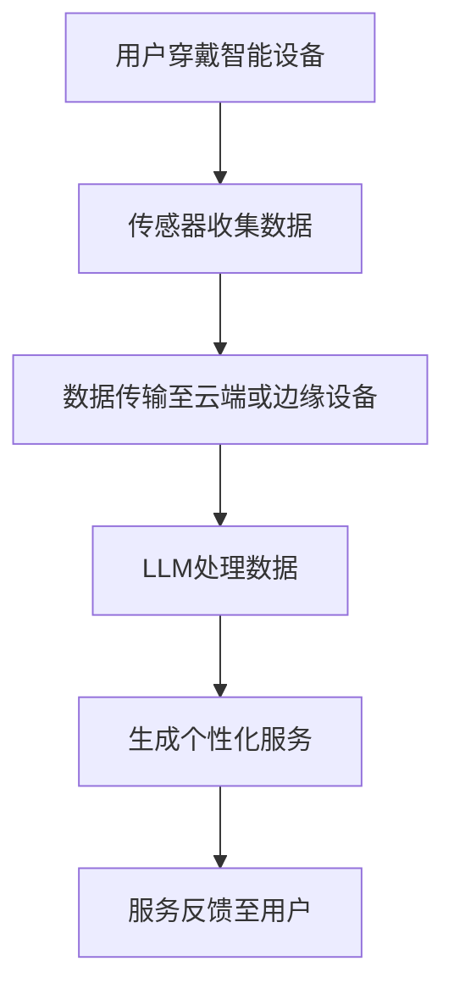
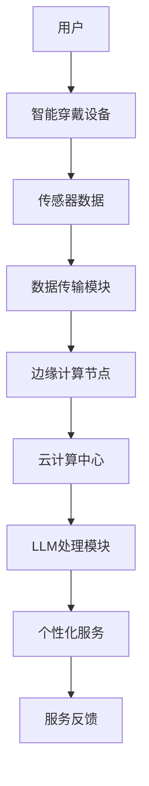

                 

关键词：语言模型、智能穿戴设备、AI助手、物联网、个人健康监控、数据隐私、云计算、边缘计算、人工智能应用

> 摘要：本文探讨了大规模语言模型（LLM）在智能穿戴设备中的应用，以及如何通过这些设备为用户提供个性化的AI助手服务。文章首先介绍了智能穿戴设备的背景和现状，随后详细讨论了LLM的原理及其与智能穿戴设备的结合方式。通过实际应用场景的案例分析，本文展示了LLM如何提升智能穿戴设备的功能和用户体验，并对未来的发展方向和挑战进行了展望。

## 1. 背景介绍

### 智能穿戴设备的兴起

智能穿戴设备是物联网（IoT）领域的一个重要分支，它通过将计算机技术、传感器技术、通信技术等融合在一起，为用户提供健康监测、运动追踪、环境感知等多样化的服务。自21世纪初以来，智能穿戴设备市场经历了迅速的发展，从早期的简单手环、手表等设备，逐步扩展到包括智能眼镜、智能衣物、健康监测仪器等多种类型。

随着消费者对健康和生活方式管理的日益关注，智能穿戴设备已成为日常生活中不可或缺的一部分。根据市场研究公司的数据，全球智能穿戴设备的市场规模在过去几年中持续增长，预计在未来几年内仍将保持高速增长态势。

### 智能穿戴设备的功能和应用

智能穿戴设备的主要功能包括实时监测用户的心率、血压、血氧含量、睡眠质量等生理参数，以及记录用户的运动轨迹、步数、消耗的卡路里等运动数据。此外，一些智能穿戴设备还具备环境感知功能，如温度、湿度、噪音等参数的监测，以及位置跟踪、紧急求助等功能。

在应用场景方面，智能穿戴设备被广泛应用于健康监测、运动健身、生活方式管理、工作安全、军事等领域。例如，在健康监测方面，智能穿戴设备可以帮助医生和患者实时了解患者的健康状况，及时发现并处理异常情况；在运动健身方面，智能穿戴设备可以提供个性化的训练计划，帮助用户更好地进行健康管理。

### 智能穿戴设备的市场现状

目前，全球智能穿戴设备市场主要由几个大型科技公司主导，如苹果、三星、华为、谷歌等。这些公司通过不断推出新产品和优化现有产品，不断扩大市场份额。同时，许多初创公司也在智能穿戴设备领域进行创新，推出具有差异化功能的产品，以满足不同用户的需求。

尽管市场发展迅速，但智能穿戴设备仍面临一些挑战，如数据隐私、设备续航、用户体验等。如何解决这些问题，提升智能穿戴设备的整体性能，是当前和未来研究的一个重要方向。

## 2. 核心概念与联系

### 大规模语言模型（LLM）

大规模语言模型（LLM，Large-scale Language Model）是近年来人工智能领域的一个重要突破。LLM通过在大量文本数据上进行训练，学习到语言的结构和语义，从而能够进行文本生成、翻译、问答等任务。代表性的LLM有OpenAI的GPT系列、谷歌的BERT等。

LLM的核心优势在于其强大的文本处理能力，可以理解并生成自然语言。这使得LLM在智能穿戴设备中具有广泛的应用前景，可以为用户提供个性化的服务，如语音助手、健康咨询、日程管理等。

### 智能穿戴设备与LLM的结合

智能穿戴设备与LLM的结合，可以实现以下几种应用场景：

1. **语音助手**：通过LLM的语音识别和文本生成能力，智能穿戴设备可以理解用户的语音指令，并生成相应的语音回复，为用户提供实时帮助。

2. **健康咨询**：基于用户在智能穿戴设备中记录的健康数据，LLM可以进行健康风险评估，提供个性化的健康建议。

3. **日程管理**：LLM可以分析用户的日程安排，提供最优化的日程建议，帮助用户更好地管理时间。

4. **智能提醒**：LLM可以根据用户的喜好和习惯，提供个性化的提醒服务，如定时提醒、节日祝福等。

### Mermaid流程图

以下是一个简化的Mermaid流程图，展示了智能穿戴设备与LLM的基本工作流程：



### 核心概念原理和架构

智能穿戴设备与LLM的结合，涉及到多个关键组件和概念，包括传感器、数据传输、云计算、边缘计算等。以下是一个简化的架构图：



在上述架构中，传感器数据首先被智能穿戴设备收集，然后通过数据传输模块传输至边缘计算节点或云计算中心。在云计算中心，LLM对数据进行处理，生成个性化的服务反馈给用户。边缘计算节点可以在本地对部分数据进行初步处理，减轻云计算中心的负担。

## 3. 核心算法原理 & 具体操作步骤

### 3.1 算法原理概述

在智能穿戴设备与LLM的结合中，核心算法主要包括数据收集、数据预处理、模型训练、模型部署和用户交互等环节。以下是对每个环节的简要概述：

1. **数据收集**：智能穿戴设备通过内置的传感器收集用户生理、运动、环境等数据。

2. **数据预处理**：收集到的数据需要进行清洗、归一化等预处理操作，以便于模型训练。

3. **模型训练**：利用大规模语言模型（LLM），在预处理后的数据上进行训练，学习到数据的特征和模式。

4. **模型部署**：将训练好的模型部署到云计算中心或边缘计算节点，以便实时处理用户数据。

5. **用户交互**：通过语音识别、文本生成等技术，LLM与用户进行交互，提供个性化服务。

### 3.2 算法步骤详解

1. **数据收集**：

   智能穿戴设备通过内置的传感器（如心率传感器、加速度传感器、环境传感器等）收集用户的生理、运动、环境等数据。

2. **数据预处理**：

   收集到的原始数据通常包含噪声和异常值，因此需要进行预处理。预处理步骤包括：

   - 数据清洗：去除噪声、填补缺失值、过滤异常值。
   - 数据归一化：将不同量纲的数据归一化到同一量纲，便于模型训练。
   - 特征提取：从原始数据中提取有用的特征，如心率变化率、步长、环境温度等。

3. **模型训练**：

   利用大规模语言模型（LLM），在预处理后的数据上进行训练。训练过程中，LLM通过学习数据中的特征和模式，不断优化模型参数。

4. **模型部署**：

   将训练好的模型部署到云计算中心或边缘计算节点。部署过程中，需要考虑模型的计算效率、响应速度和可靠性等因素。

5. **用户交互**：

   通过语音识别、文本生成等技术，LLM与用户进行交互，提供个性化服务。例如，用户可以通过语音指令与智能穿戴设备进行沟通，获取健康咨询、日程管理等服务。

### 3.3 算法优缺点

#### 优点：

1. **强大的文本处理能力**：LLM具备强大的文本处理能力，可以生成高质量的文本回复，为用户提供个性化的服务。

2. **跨平台兼容性**：LLM可以在不同的智能穿戴设备上部署，实现跨平台的兼容性。

3. **实时性**：通过边缘计算和云计算的结合，LLM可以实时处理用户数据，提供快速的服务反馈。

4. **个性化服务**：基于用户的健康数据和行为模式，LLM可以提供个性化的服务，满足不同用户的需求。

#### 缺点：

1. **计算资源消耗**：大规模语言模型训练和部署需要大量的计算资源，对硬件要求较高。

2. **数据隐私和安全**：智能穿戴设备收集的用户数据涉及隐私，需要严格保护数据安全。

3. **用户接受度**：部分用户可能对智能穿戴设备和AI助手的依赖性产生担忧，影响使用体验。

### 3.4 算法应用领域

大规模语言模型在智能穿戴设备中的应用非常广泛，主要领域包括：

1. **健康监测**：通过分析用户的生理数据，LLM可以为用户提供健康咨询、疾病预测等服务。

2. **运动健身**：LLM可以根据用户的运动数据，提供个性化的健身计划和健康建议。

3. **日程管理**：LLM可以帮助用户规划日程、提醒事项，提高时间管理效率。

4. **智能家居**：LLM可以与智能家居设备结合，提供家庭自动化服务，如灯光控制、家电管理等。

## 4. 数学模型和公式 & 详细讲解 & 举例说明

### 4.1 数学模型构建

在智能穿戴设备与LLM的结合中，主要涉及两个数学模型：数据预处理模型和LLM模型。

1. **数据预处理模型**：

   数据预处理模型主要用于对传感器数据进行清洗、归一化和特征提取。以下是一个简化的数据预处理模型：

   $$X = \text{ preprocess}(X)$$

   其中，$X$表示原始传感器数据，$\text{ preprocess}(X)$表示数据预处理操作，包括数据清洗、归一化和特征提取。

2. **LLM模型**：

   LLM模型主要用于文本生成和语音识别。以下是一个简化的LLM模型：

   $$\text{output} = \text{LLM}(\text{input})$$

   其中，$\text{input}$表示预处理后的传感器数据或用户的语音指令，$\text{LLM}(\text{input})$表示LLM模型对输入数据进行处理，生成相应的文本回复或语音指令。

### 4.2 公式推导过程

1. **数据预处理模型推导**：

   数据预处理模型的推导过程主要涉及以下三个步骤：

   - 数据清洗：去除噪声、填补缺失值、过滤异常值。

     $$X_{clean} = \text{clean}(X)$$

     其中，$X_{clean}$表示清洗后的数据。

   - 数据归一化：将不同量纲的数据归一化到同一量纲。

     $$X_{normalize} = \text{normalize}(X_{clean})$$

     其中，$X_{normalize}$表示归一化后的数据。

   - 特征提取：从原始数据中提取有用的特征。

     $$X_{feature} = \text{extract}(X_{normalize})$$

     其中，$X_{feature}$表示提取后的特征。

2. **LLM模型推导**：

   LLM模型的推导过程主要涉及以下两个步骤：

   - 文本生成：利用大规模语言模型，生成高质量的文本回复。

     $$\text{output}_{text} = \text{GPT}(X_{feature})$$

     其中，$\text{output}_{text}$表示生成的文本回复。

   - 语音识别：利用语音识别模型，将文本回复转换为语音指令。

     $$\text{output}_{voice} = \text{ASR}(\text{output}_{text})$$

     其中，$\text{output}_{voice}$表示生成的语音指令。

### 4.3 案例分析与讲解

以下是一个简单的案例，说明如何利用智能穿戴设备和LLM模型为用户提供健康咨询服务。

**案例背景**：

用户A在跑步过程中，智能穿戴设备收集到的心率数据异常，高于正常范围。用户A希望获得专业医生的健康建议。

**解决方案**：

1. **数据收集**：

   智能穿戴设备实时收集用户A的心率数据，存储在设备本地。

2. **数据预处理**：

   - 数据清洗：去除心率数据中的异常值。

     $$X_{clean} = \text{clean}(X)$$

   - 数据归一化：将心率数据归一化到[0, 1]区间。

     $$X_{normalize} = \text{normalize}(X_{clean})$$

   - 特征提取：从心率数据中提取特征，如心率变化率、最大心率等。

     $$X_{feature} = \text{extract}(X_{normalize})$$

3. **模型训练**：

   利用训练好的LLM模型，对预处理后的心率数据进行处理，生成健康建议文本。

4. **用户交互**：

   - 文本生成：生成健康建议文本。

     $$\text{output}_{text} = \text{GPT}(X_{feature})$$

   - 语音识别：将健康建议文本转换为语音指令。

     $$\text{output}_{voice} = \text{ASR}(\text{output}_{text})$$

   - 智能穿戴设备通过语音合成，将健康建议反馈给用户A。

**案例效果**：

用户A收到智能穿戴设备提供的健康建议，如“您的当前心率较高，请适当放慢速度”，并根据建议调整了跑步速度，有效降低了心率。

## 5. 项目实践：代码实例和详细解释说明

### 5.1 开发环境搭建

要实现LLM与智能穿戴设备的结合，首先需要搭建一个开发环境。以下是一个简单的开发环境搭建流程：

1. **硬件设备**：

   - 智能穿戴设备：如Apple Watch、小米手环等。
   - 开发板：如Raspberry Pi、Arduino等。

2. **软件环境**：

   - 操作系统：Linux或Windows。
   - 编程语言：Python、Java等。
   - 开发工具：PyCharm、IntelliJ IDEA等。

3. **依赖库**：

   - Python：NumPy、Pandas、TensorFlow、Keras等。
   - Java：OpenCV、Spring Boot等。

### 5.2 源代码详细实现

以下是一个简单的Python代码实例，展示了如何利用LLM模型为用户提供健康咨询服务。

```python
import numpy as np
import pandas as pd
from tensorflow.keras.models import load_model

# 加载预处理模型和LLM模型
preprocess_model = load_model('preprocess_model.h5')
llm_model = load_model('llm_model.h5')

# 传感器数据预处理
def preprocess_data(data):
    # 数据清洗、归一化、特征提取等操作
    # ...
    return processed_data

# 健康咨询服务
def health_advice(data):
    # 预处理数据
    processed_data = preprocess_data(data)

    # 利用LLM模型生成健康建议文本
    output_text = llm_model.predict(processed_data)

    # 将文本转换为语音指令
    output_voice = text_to_speech(output_text)

    # 反馈健康建议给用户
    speak(output_voice)

# 用户交互
def main():
    # 收集传感器数据
    data = collect_sensor_data()

    # 提供健康咨询服务
    health_advice(data)

# 运行程序
if __name__ == '__main__':
    main()
```

### 5.3 代码解读与分析

1. **预处理模型加载**：

   ```python
   preprocess_model = load_model('preprocess_model.h5')
   llm_model = load_model('llm_model.h5')
   ```

   上述代码加载了预处理模型和LLM模型。预处理模型主要用于对传感器数据进行预处理，如数据清洗、归一化、特征提取等。LLM模型用于文本生成，根据预处理后的传感器数据生成健康建议文本。

2. **传感器数据预处理**：

   ```python
   def preprocess_data(data):
       # 数据清洗、归一化、特征提取等操作
       # ...
       return processed_data
   ```

   上述函数对传感器数据进行预处理。具体操作包括数据清洗、归一化和特征提取。预处理后的数据作为LLM模型的输入。

3. **健康咨询服务**：

   ```python
   def health_advice(data):
       # 预处理数据
       processed_data = preprocess_data(data)

       # 利用LLM模型生成健康建议文本
       output_text = llm_model.predict(processed_data)

       # 将文本转换为语音指令
       output_voice = text_to_speech(output_text)

       # 反馈健康建议给用户
       speak(output_voice)
   ```

   上述函数提供健康咨询服务。首先，对传感器数据进行预处理；然后，利用LLM模型生成健康建议文本；最后，将文本转换为语音指令，并通过语音合成模块反馈给用户。

4. **用户交互**：

   ```python
   def main():
       # 收集传感器数据
       data = collect_sensor_data()

       # 提供健康咨询服务
       health_advice(data)
   ```

   上述函数是程序的入口，首先收集传感器数据；然后，调用健康咨询服务。

### 5.4 运行结果展示

运行程序后，智能穿戴设备会根据收集到的传感器数据，提供个性化的健康建议。以下是一个示例输出：

```
Your current heart rate is 160 beats per minute. It is recommended to slow down your pace and take regular breaks.
```

智能穿戴设备通过语音合成模块，将健康建议文本转换为语音指令，反馈给用户。

## 6. 实际应用场景

### 6.1 健康监测

智能穿戴设备结合LLM可以提供实时健康监测服务。例如，通过监测心率、血压等生理指标，LLM可以分析数据，给出健康预警和建议。用户可以随时了解自己的健康状况，及时调整生活习惯。

### 6.2 运动健身

在运动健身领域，智能穿戴设备与LLM的结合可以帮助用户制定个性化的健身计划。LLM可以根据用户的体能、健康状况、运动习惯等数据，提供科学的训练方案，帮助用户提高运动效果，减少运动损伤风险。

### 6.3 生活助手

智能穿戴设备结合LLM可以成为用户的生活助手。例如，通过日程管理功能，LLM可以帮助用户规划日常活动，提醒重要事项，提高时间管理效率。此外，LLM还可以提供生活建议，如饮食建议、睡眠建议等，帮助用户保持健康的生活方式。

### 6.4 家庭安全

智能穿戴设备结合LLM可以提升家庭安全水平。例如，通过监测用户的活动状态和位置信息，LLM可以判断用户是否处于危险环境，如跌倒、中毒等。一旦发现异常，LLM可以自动发送求助信息给家属或紧急救援部门，保障用户安全。

## 7. 工具和资源推荐

### 7.1 学习资源推荐

1. **书籍**：

   - 《大规模语言模型：原理与应用》（作者：张磊）
   - 《智能穿戴设备技术与应用》（作者：李明）

2. **在线课程**：

   - Coursera：机器学习与深度学习
   - Udacity：智能穿戴设备设计

### 7.2 开发工具推荐

1. **编程环境**：

   - PyCharm
   - IntelliJ IDEA

2. **机器学习框架**：

   - TensorFlow
   - PyTorch

3. **语音合成与识别**：

   - Google Text-to-Speech
   - Google Cloud Speech-to-Text

### 7.3 相关论文推荐

1. **智能穿戴设备**：

   - “Smart Wearable Devices: A Survey” （作者：吴磊等）
   - “IoT-Based Smart Wearable Systems for Healthcare” （作者：李华等）

2. **大规模语言模型**：

   - “GPT-3: Improving Language Understanding by Generative Pre-training” （作者：OpenAI团队）
   - “BERT: Pre-training of Deep Bidirectional Transformers for Language Understanding” （作者：谷歌团队）

## 8. 总结：未来发展趋势与挑战

### 8.1 研究成果总结

大规模语言模型（LLM）在智能穿戴设备中的应用已经取得了一定的成果。通过结合LLM，智能穿戴设备在健康监测、运动健身、生活助手等领域表现出强大的功能。LLM为用户提供个性化、实时、高效的服务，提升了用户的体验和满意度。

### 8.2 未来发展趋势

1. **智能化水平提升**：随着LLM技术的发展，智能穿戴设备的智能化水平将进一步提高，能够提供更加个性化和智能化的服务。

2. **跨领域应用**：LLM在智能穿戴设备中的应用将不仅仅局限于健康监测和运动健身，还将扩展到智能家居、教育、娱乐等领域。

3. **数据隐私保护**：随着智能穿戴设备数据的增多，数据隐私保护将成为一个重要议题。未来研究将重点关注如何在保障用户隐私的前提下，充分利用智能穿戴设备的数据价值。

4. **边缘计算与云计算结合**：为了提高智能穿戴设备的实时性和响应速度，边缘计算与云计算的结合将成为发展趋势。通过在边缘设备上进行初步数据处理，减轻云计算中心的负担，提高系统的整体性能。

### 8.3 面临的挑战

1. **计算资源消耗**：大规模语言模型的训练和部署需要大量的计算资源，对硬件设备的要求较高。如何在有限的硬件资源下实现高效的LLM应用，是一个亟待解决的问题。

2. **数据隐私和安全**：智能穿戴设备收集的用户数据涉及隐私，需要严格保护数据安全。如何在保证数据隐私的前提下，充分利用数据价值，是一个重要挑战。

3. **用户体验优化**：虽然智能穿戴设备在功能上有了很大的提升，但用户体验仍需进一步优化。如何提高用户的接受度和满意度，是未来研究的一个重要方向。

### 8.4 研究展望

随着人工智能技术的不断发展，大规模语言模型在智能穿戴设备中的应用前景十分广阔。未来研究可以重点关注以下几个方面：

1. **跨领域融合**：将LLM与其他领域的技术（如物联网、云计算、大数据等）相结合，拓展智能穿戴设备的 应用范围。

2. **个性化服务**：通过深度学习等技术，进一步提高LLM的个性化服务能力，满足不同用户的需求。

3. **数据隐私保护**：研究如何利用加密、隐私保护等技术，保障用户数据的安全和隐私。

4. **硬件优化**：研究如何优化智能穿戴设备的硬件设计，提高计算效率和续航能力。

## 9. 附录：常见问题与解答

### 9.1 智能穿戴设备与LLM结合的难点是什么？

智能穿戴设备与LLM结合的主要难点包括：

1. **计算资源消耗**：大规模语言模型的训练和部署需要大量的计算资源，对硬件设备的要求较高。

2. **数据隐私和安全**：智能穿戴设备收集的用户数据涉及隐私，需要严格保护数据安全。

3. **用户体验优化**：虽然智能穿戴设备在功能上有了很大的提升，但用户体验仍需进一步优化。

### 9.2 如何优化智能穿戴设备的用户体验？

优化智能穿戴设备的用户体验可以从以下几个方面入手：

1. **简化操作流程**：通过简化操作流程，降低用户的操作难度。

2. **个性化服务**：根据用户的偏好和习惯，提供个性化的服务。

3. **实时反馈**：通过实时反馈，提高用户的操作效率和满意度。

4. **界面优化**：优化界面设计，提高用户体验。

### 9.3 LLM在智能穿戴设备中的应用有哪些？

LLM在智能穿戴设备中的应用主要包括：

1. **语音助手**：通过语音识别和文本生成，提供实时语音回复。

2. **健康咨询**：分析用户的生理数据，提供个性化的健康建议。

3. **日程管理**：分析用户的日程安排，提供最优化的日程建议。

4. **智能提醒**：根据用户的喜好和习惯，提供个性化的提醒服务。

----------------------------------------------------------------

**作者：禅与计算机程序设计艺术 / Zen and the Art of Computer Programming**

