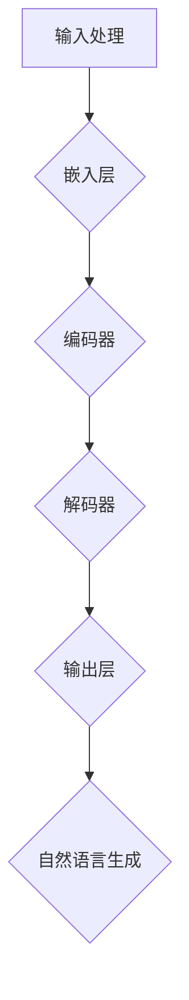
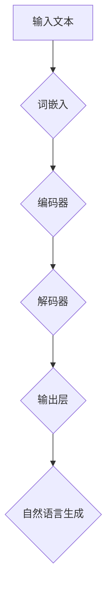

                 

关键词：大型语言模型（LLM），游戏产业，人工智能（AI），沉浸式体验，深度学习，自然语言处理，计算机图形学，交互设计，虚拟现实（VR），增强现实（AR），游戏开发，用户体验（UX）。

> 摘要：本文探讨了大型语言模型（LLM）在游戏产业中的应用，特别是在创造沉浸式AI体验方面的潜力。通过对LLM的核心概念、算法原理、数学模型和具体操作步骤的详细分析，本文揭示了LLM在游戏设计、玩家互动、故事叙述以及游戏环境生成等关键领域的重要性。此外，本文还通过实际项目实践和代码实例，展示了如何利用LLM技术为游戏产业带来创新和突破，并对未来应用前景进行了展望。

## 1. 背景介绍

随着人工智能（AI）技术的不断进步，大型语言模型（LLM）已成为自然语言处理（NLP）领域的重要工具。LLM通过深度学习技术，能够从大量文本数据中学习语言模式，生成高质量的自然语言文本。这种能力使得LLM在多种应用场景中表现出色，包括机器翻译、问答系统、文本生成和文本摘要等。

游戏产业一直是技术创新的重要推动力，近年来随着虚拟现实（VR）和增强现实（AR）技术的成熟，沉浸式游戏体验越来越受到玩家和开发商的重视。然而，创造一个真正沉浸式的游戏体验不仅仅是技术上的挑战，更涉及到用户体验（UX）和故事叙述的深度挖掘。

本文旨在探讨LLM在游戏产业中的应用，特别是如何利用LLM的强大能力来创造沉浸式的AI体验。通过分析LLM的核心概念和算法原理，本文将为读者提供一个深入了解这一领域的基础。接下来，我们将探讨LLM在游戏设计、玩家互动、故事叙述和游戏环境生成等方面的具体应用。

### 1.1 游戏产业的现状与挑战

游戏产业在过去几十年中经历了巨大的发展，从传统的单机游戏到如今的多平台、多人在线游戏，游戏内容和技术都在不断进步。随着游戏市场的不断扩大，开发商面临的挑战也越来越大。

首先，游戏制作成本不断提高。高质量的游戏需要大量的人力、时间和资源投入，尤其是在游戏美术、音效和编程等方面。此外，游戏开发者还需要不断关注玩家的需求和市场趋势，以保持游戏的热度和盈利能力。

其次，用户体验（UX）是游戏成功的关键因素。现代玩家越来越注重游戏的交互性、故事叙述和沉浸感。一个出色的游戏不仅需要提供丰富的游戏内容，还需要提供一个无缝的、引人入胜的体验。这要求开发者在设计游戏时考虑玩家的情感和体验，而不是仅仅追求技术上的突破。

最后，游戏的社交性也在不断增强。多人在线游戏和社交媒体平台为玩家提供了更多互动和分享的机会，这也为游戏开发带来了新的挑战和机遇。开发者需要考虑如何设计游戏，以促进玩家之间的互动和社交，同时保持游戏的公平性和可持续性。

### 1.2 LLM的发展历程

LLM的发展历程可以追溯到20世纪80年代，当时研究人员开始尝试使用统计方法和规则系统来处理自然语言。随着计算能力的提升和数据量的增加，深度学习技术的引入使得LLM在性能上取得了突破性的进展。

最初的LLM模型如Stanford大学开发的Stanford Natural Language Inference（SNLI）数据集，主要依赖于手工设计的特征和规则系统。然而，随着深度学习技术的不断发展，特别是2018年谷歌推出BERT（Bidirectional Encoder Representations from Transformers）模型后，LLM的性能得到了显著提升。

BERT模型采用了双向Transformer架构，能够在理解上下文和生成自然语言文本方面表现出色。此后，一系列基于BERT的改进模型如GPT-3（Generative Pre-trained Transformer 3）相继问世，进一步推动了LLM的发展。

### 1.3 LLM在游戏产业中的潜力

LLM在游戏产业中具有巨大的潜力，特别是在创造沉浸式AI体验方面。首先，LLM能够生成高质量的游戏对话和故事情节，为玩家提供更加真实和引人入胜的体验。通过理解玩家的行为和偏好，LLM可以动态调整游戏内容，使游戏更加个性化和有趣。

其次，LLM能够生成真实的游戏环境和角色，提高游戏的视觉效果和沉浸感。例如，通过生成逼真的场景描述和角色对话，玩家可以在虚拟世界中感受到更加真实的存在感。

此外，LLM还可以用于游戏测试和优化。通过模拟玩家行为和交互，LLM可以帮助开发者发现游戏中的潜在问题，从而提高游戏的稳定性和可玩性。

综上所述，LLM在游戏产业中的应用为开发者提供了全新的创作工具和手段，有望为玩家带来更加丰富和沉浸式的游戏体验。

### 1.4 目标读者

本文的目标读者包括游戏开发者、人工智能（AI）研究者、计算机图形学专家以及对于游戏与AI结合感兴趣的从业者。本文旨在为读者提供一个全面而深入的了解，帮助他们掌握LLM在游戏产业中的应用，并激发他们在这一领域进行创新和探索。

### 1.5 文章结构

本文将分为以下几个部分：

1. 背景介绍：概述游戏产业的现状、挑战以及LLM的发展历程。
2. 核心概念与联系：介绍LLM的核心概念和原理，并使用Mermaid流程图展示其架构。
3. 核心算法原理 & 具体操作步骤：详细分析LLM的算法原理，并分步骤介绍如何实现和应用。
4. 数学模型和公式 & 详细讲解 & 举例说明：讲解LLM相关的数学模型和公式，并通过实例进行说明。
5. 项目实践：展示如何在实际项目中应用LLM技术。
6. 实际应用场景：探讨LLM在游戏设计、玩家互动、故事叙述和游戏环境生成等领域的应用。
7. 工具和资源推荐：推荐学习资源、开发工具和相关论文。
8. 总结：总结研究成果，展望未来发展趋势和挑战。

### 1.6Mermaid流程图

以下是LLM架构的Mermaid流程图：



### 1.7 核心算法原理概述

LLM的核心算法是基于深度学习中的Transformer架构。Transformer模型通过自注意力机制（Self-Attention）来捕捉输入文本中的长距离依赖关系，从而提高模型的上下文理解能力。在LLM中，这一架构被进一步优化和扩展，以生成高质量的自然语言文本。

LLM的训练过程通常分为两个阶段：预训练和微调。预训练阶段，模型在大量无标注的文本数据上进行训练，学习文本的普遍语言规律。微调阶段，模型被进一步调整以适应特定任务，如文本生成、问答系统等。

### 1.8 核心算法步骤详解

以下是LLM的核心算法步骤：

1. **输入处理**：将输入文本转换为向量表示。这通常通过词嵌入层完成，将每个单词映射为一个固定大小的向量。
   
2. **编码器**：编码器由多个自注意力层组成。每个自注意力层都负责计算输入文本中每个单词的上下文表示，并将这些表示整合起来，形成全局的上下文向量。

3. **解码器**：解码器与编码器结构相似，但增加了注意力机制，使模型能够关注编码器输出的上下文信息，以生成下一个单词的预测。

4. **输出层**：解码器的输出经过一个全连接层，预测下一个单词的概率分布。通过采样，模型选择下一个最可能的单词，并重复以上步骤，生成完整的自然语言文本。

5. **自然语言生成**：最终生成的文本通过输出层输出，经过后处理（如去除无效字符、语法检查等），形成最终的输出结果。

### 1.9 算法优缺点

**优点**：

1. **强大的上下文理解能力**：通过自注意力机制，LLM能够捕捉长距离的上下文依赖，生成连贯的自然语言文本。
2. **灵活的应用场景**：LLM可以应用于多种NLP任务，如文本生成、问答系统、机器翻译等。
3. **高效的处理速度**：现代LLM模型经过优化，能够快速处理大量文本数据。

**缺点**：

1. **计算资源需求大**：训练和运行LLM模型需要大量的计算资源，特别是在预训练阶段。
2. **对数据质量要求高**：LLM的性能很大程度上依赖于训练数据的质量，数据中的错误或偏差可能会导致模型的不准确。
3. **解释性差**：由于深度学习的黑箱特性，LLM的决策过程往往缺乏透明性和可解释性。

### 1.10 算法应用领域

LLM在多个领域都取得了显著的应用成果：

1. **自然语言处理（NLP）**：LLM被广泛应用于文本生成、问答系统、机器翻译等领域，显著提高了这些任务的性能和效率。
2. **内容创作**：通过生成高质量的自然语言文本，LLM可以帮助创作者快速生成文章、故事和脚本，提高创作效率。
3. **对话系统**：LLM在智能客服、语音助手等领域表现出色，能够生成自然、流畅的对话内容。
4. **游戏开发**：LLM在游戏设计中用于生成对话、故事情节和游戏环境，提高游戏的真实性和沉浸感。

## 2. 核心概念与联系

在深入探讨LLM在游戏产业中的应用之前，我们需要首先理解LLM的核心概念和原理，以及如何将LLM与游戏设计、玩家互动、故事叙述和游戏环境生成等领域相结合。

### 2.1 大型语言模型（LLM）的概念

大型语言模型（LLM）是一种基于深度学习的自然语言处理（NLP）模型，它通过对大量文本数据的学习，能够生成高质量的自然语言文本。LLM的核心在于其能够理解和生成语言的上下文，这使得它在文本生成、问答系统、机器翻译等多种任务中表现出色。

LLM通常由两个主要部分组成：编码器（Encoder）和解码器（Decoder）。编码器负责将输入的文本转换为上下文向量，而解码器则根据这些上下文向量生成输出文本。这种架构使得LLM能够捕捉输入文本的语义和结构，从而生成连贯、合理的文本。

### 2.2 自注意力机制（Self-Attention）

自注意力机制是LLM的核心组件之一，它允许模型在处理输入文本时，关注不同的单词并自动计算它们之间的依赖关系。自注意力通过计算输入文本中每个单词的加权平均，生成一个全局的上下文向量，这个向量能够捕获输入文本中的长期依赖信息。

自注意力机制的具体实现通常使用 scaled dot-product attention，它通过计算每个单词与其他所有单词的点积，并使用softmax函数对结果进行归一化，从而生成权重系数。这些权重系数用于加权平均每个单词的嵌入向量，形成最终的上下文向量。

### 2.3 Transformer架构

Transformer架构是LLM的基础，它通过自注意力机制和多头注意力（Multi-Head Attention）来提高模型的上下文理解和生成能力。多头注意力将输入文本分割成多个子序列，每个子序列独立进行自注意力计算，并将结果进行融合，从而捕捉更丰富的上下文信息。

Transformer架构还包括编码器和解码器，编码器用于处理输入文本并生成上下文向量，而解码器则根据这些上下文向量生成输出文本。编码器和解码器由多个自注意力层和前馈神经网络层组成，这些层通过叠加的方式提高了模型的表达能力。

### 2.4 LLM与游戏产业的结合

将LLM应用于游戏产业，可以实现以下几个方面的创新：

1. **对话系统**：LLM可以用于生成游戏角色之间的对话，使游戏更具互动性和真实感。通过理解玩家的输入，LLM可以生成响应，与玩家进行自然、流畅的对话。

2. **故事叙述**：LLM可以用于生成游戏的故事情节和背景描述，提供丰富、引人入胜的故事体验。开发者可以利用LLM的文本生成能力，自动创建复杂的剧情和角色关系。

3. **游戏环境生成**：LLM可以用于生成游戏世界的各种元素，如场景描述、建筑布局和地理特征。通过生成逼真的环境描述，LLM可以增强游戏的视觉效果和沉浸感。

4. **玩家个性化体验**：LLM可以根据玩家的行为和偏好，动态生成个性化的游戏内容。例如，根据玩家的游戏历史和偏好，LLM可以调整游戏难度、故事走向和角色互动，提供更加个性化的游戏体验。

### 2.5 Mermaid流程图

以下是LLM架构的Mermaid流程图：



### 2.6 LLM的培训过程

LLM的培训过程通常分为预训练和微调两个阶段：

1. **预训练**：在预训练阶段，LLM在大量无标注的文本数据上进行训练，学习文本的普遍语言规律。预训练数据通常来自互联网上的各种文本资源，如新闻文章、论坛帖子、书籍等。

2. **微调**：在预训练后，LLM被进一步微调以适应特定任务，如文本生成、问答系统等。微调阶段通常使用有标注的数据集，通过优化模型的参数，使其在特定任务上表现出色。

### 2.7 LLM的优势和挑战

**优势**：

- **强大的上下文理解能力**：LLM能够通过自注意力机制捕捉长距离的上下文依赖，生成连贯的自然语言文本。
- **灵活的应用场景**：LLM可以应用于多种NLP任务，如文本生成、问答系统、机器翻译等。
- **高效的处理速度**：现代LLM模型经过优化，能够快速处理大量文本数据。

**挑战**：

- **计算资源需求大**：训练和运行LLM模型需要大量的计算资源，特别是在预训练阶段。
- **对数据质量要求高**：LLM的性能很大程度上依赖于训练数据的质量，数据中的错误或偏差可能会导致模型的不准确。
- **解释性差**：由于深度学习的黑箱特性，LLM的决策过程往往缺乏透明性和可解释性。

### 2.8 LLM在游戏产业中的实际应用

以下是LLM在游戏产业中的实际应用场景：

1. **对话系统**：利用LLM生成游戏角色之间的对话，提高游戏的互动性和真实感。例如，在角色扮演游戏（RPG）中，LLM可以用于生成NPC（非玩家角色）的对话，使游戏更加生动。

2. **故事叙述**：利用LLM生成游戏的故事情节和背景描述，提供丰富、引人入胜的故事体验。开发者可以利用LLM的文本生成能力，自动创建复杂的剧情和角色关系。

3. **游戏环境生成**：利用LLM生成游戏世界的各种元素，如场景描述、建筑布局和地理特征。通过生成逼真的环境描述，LLM可以增强游戏的视觉效果和沉浸感。

4. **玩家个性化体验**：利用LLM根据玩家的行为和偏好，动态生成个性化的游戏内容。例如，根据玩家的游戏历史和偏好，LLM可以调整游戏难度、故事走向和角色互动，提供更加个性化的游戏体验。

通过以上对LLM的核心概念和原理的详细分析，我们可以看到，LLM在游戏产业中具有巨大的应用潜力。接下来，我们将进一步探讨LLM的具体算法原理和操作步骤，为读者提供更深入的技术理解。

## 3. 核心算法原理 & 具体操作步骤

### 3.1 算法原理概述

大型语言模型（LLM）的核心算法基于Transformer架构，这是一种基于自注意力机制的深度学习模型。Transformer通过多头注意力机制和前馈神经网络，能够捕捉长距离的上下文依赖关系，生成连贯的自然语言文本。

在Transformer模型中，编码器（Encoder）和解码器（Decoder）是两个主要组件。编码器负责将输入的文本序列转换为上下文向量，解码器则根据这些上下文向量生成输出文本序列。编码器和解码器由多个自注意力层（Self-Attention Layer）和前馈神经网络层（Feedforward Network Layer）堆叠而成。

### 3.2 算法步骤详解

#### 3.2.1 输入处理

1. **词嵌入**：将输入的文本序列转换为向量表示。这一步通常使用预训练的词向量模型，如Word2Vec、GloVe等。每个单词都被映射为一个固定大小的向量，这些向量构成了输入序列的嵌入矩阵。

2. **位置编码**：由于Transformer模型没有序列信息，需要通过位置编码（Positional Encoding）来引入位置信息。位置编码通常使用 sinusoidal 函数，它在不同的维度上为每个单词引入不同的相位。

#### 3.2.2 编码器

编码器由多个自注意力层和前馈神经网络层组成。每个自注意力层包含两个主要步骤：多头注意力（Multi-Head Attention）和前馈神经网络。

1. **多头注意力**：多头注意力将输入序列分割成多个子序列，每个子序列独立进行自注意力计算。自注意力通过计算输入序列中每个单词与其他所有单词的点积，并使用softmax函数对结果进行归一化，从而生成权重系数。这些权重系数用于加权平均每个单词的嵌入向量，形成新的上下文向量。

2. **前馈神经网络**：前馈神经网络对每个子序列进行两层的全连接操作，其中每一层的激活函数通常是ReLU。

编码器的输出是一个全局的上下文向量，这些向量通过多个自注意力层和前馈神经网络层逐步整合，形成最终的编码结果。

#### 3.2.3 解码器

解码器与编码器结构相似，但增加了多头自注意力（Self-Attention）和交叉注意力（Cross-Attention）机制。

1. **多头自注意力**：与编码器中的多头注意力类似，解码器的自注意力机制用于更新每个单词的上下文向量。

2. **交叉注意力**：交叉注意力机制使解码器能够根据编码器的输出（上下文向量）来生成输出文本的下一个单词。这一步通过计算解码器中每个单词与编码器输出之间的点积，并使用softmax函数对结果进行归一化，生成权重系数。这些权重系数用于加权平均编码器的输出，形成新的上下文向量。

3. **前馈神经网络**：与前馈神经网络类似，解码器在每个子序列上应用前馈神经网络，进一步增强模型的表示能力。

#### 3.2.4 输出层

解码器的输出经过一个全连接层，预测下一个单词的概率分布。通过采样（例如，使用top-k采样或贪心策略），模型选择下一个最可能的单词，并重复以上步骤，生成完整的自然语言文本。

#### 3.2.5 自然语言生成

最终生成的文本通过输出层输出，经过后处理（如去除无效字符、语法检查等），形成最终的输出结果。在实际应用中，可以进一步优化生成过程，如使用贪心搜索、生成对抗网络（GAN）等，以提高生成文本的质量和多样性。

### 3.3 算法优缺点

**优点**：

- **强大的上下文理解能力**：通过自注意力机制，LLM能够捕捉长距离的上下文依赖，生成连贯的自然语言文本。
- **灵活的应用场景**：LLM可以应用于多种NLP任务，如文本生成、问答系统、机器翻译等。
- **高效的处理速度**：现代LLM模型经过优化，能够快速处理大量文本数据。

**缺点**：

- **计算资源需求大**：训练和运行LLM模型需要大量的计算资源，特别是在预训练阶段。
- **对数据质量要求高**：LLM的性能很大程度上依赖于训练数据的质量，数据中的错误或偏差可能会导致模型的不准确。
- **解释性差**：由于深度学习的黑箱特性，LLM的决策过程往往缺乏透明性和可解释性。

### 3.4 算法应用领域

LLM在多个领域都取得了显著的应用成果：

- **自然语言处理（NLP）**：LLM被广泛应用于文本生成、问答系统、机器翻译等领域，显著提高了这些任务的性能和效率。
- **内容创作**：通过生成高质量的自然语言文本，LLM可以帮助创作者快速生成文章、故事和脚本，提高创作效率。
- **对话系统**：LLM在智能客服、语音助手等领域表现出色，能够生成自然、流畅的对话内容。
- **游戏开发**：LLM在游戏设计中用于生成对话、故事情节和游戏环境，提高游戏的真实性和沉浸感。

### 3.5 LLM与游戏产业结合的优势

将LLM应用于游戏产业，可以实现以下几个方面的优势：

1. **对话系统**：利用LLM生成游戏角色之间的对话，提高游戏的互动性和真实感。例如，在角色扮演游戏（RPG）中，LLM可以用于生成NPC（非玩家角色）的对话，使游戏更加生动。

2. **故事叙述**：利用LLM生成游戏的故事情节和背景描述，提供丰富、引人入胜的故事体验。开发者可以利用LLM的文本生成能力，自动创建复杂的剧情和角色关系。

3. **游戏环境生成**：利用LLM生成游戏世界的各种元素，如场景描述、建筑布局和地理特征。通过生成逼真的环境描述，LLM可以增强游戏的视觉效果和沉浸感。

4. **玩家个性化体验**：利用LLM根据玩家的行为和偏好，动态生成个性化的游戏内容。例如，根据玩家的游戏历史和偏好，LLM可以调整游戏难度、故事走向和角色互动，提供更加个性化的游戏体验。

通过以上对LLM核心算法原理和具体操作步骤的详细分析，我们可以看到，LLM在游戏产业中具有巨大的应用潜力。接下来，我们将进一步探讨LLM在数学模型和公式中的应用，为读者提供更深入的技术理解。

### 4. 数学模型和公式 & 详细讲解 & 举例说明

#### 4.1 数学模型构建

大型语言模型（LLM）的数学模型基于深度学习和自然语言处理的先进技术，主要采用Transformer架构。以下是对LLM中关键数学模型的详细讲解。

#### 4.1.1 词嵌入

词嵌入（Word Embedding）是将单词映射为固定大小的向量表示。在LLM中，词嵌入层的目的是将输入文本序列中的每个单词转换为向量，这些向量将用于后续的编码和解码过程。

**数学表示**：

$$
\text{词向量} = \text{Embedding}(w_i)
$$

其中，$w_i$ 是输入文本序列中的第 $i$ 个单词，$\text{Embedding}(w_i)$ 是词嵌入函数，将单词 $w_i$ 映射为一个 $d$ 维的向量表示。

#### 4.1.2 自注意力

自注意力（Self-Attention）是Transformer模型的核心机制，它允许模型在编码过程中考虑输入文本序列中每个单词的上下文关系。

**数学表示**：

$$
\text{自注意力} = \text{Attention}(Q, K, V)
$$

其中，$Q$、$K$ 和 $V$ 分别是查询（Query）、键（Key）和值（Value）的向量表示。这些向量是通过词嵌入和线性变换得到的：

$$
Q = \text{Linear}(W_Q, \text{词向量})
$$

$$
K = \text{Linear}(W_K, \text{词向量})
$$

$$
V = \text{Linear}(W_V, \text{词向量})
$$

$W_Q$、$W_K$ 和 $W_V$ 是权重矩阵。自注意力通过计算点积并应用softmax函数，生成注意力权重：

$$
\text{注意力权重} = \text{softmax}\left(\frac{QK^T}{\sqrt{d_k}}\right)
$$

$$
\text{加权值} = \text{注意力权重} \cdot V
$$

最终，自注意力将输入文本序列中的每个单词的嵌入向量加权平均，生成一个新的上下文向量。

#### 4.1.3 编码器和解码器

编码器（Encoder）和解码器（Decoder）是LLM的主要组件。编码器负责将输入文本序列编码为上下文向量，而解码器负责根据这些上下文向量生成输出文本序列。

**编码器数学表示**：

编码器由多个自注意力层和前馈神经网络层堆叠而成。每个自注意力层和前馈神经网络层的输出都可以表示为：

$$
\text{编码器输出} = \text{Encoder}(X, H)
$$

其中，$X$ 是输入文本序列，$H$ 是编码器的隐藏状态。

**解码器数学表示**：

解码器同样由多个自注意力层和前馈神经网络层组成。在解码过程中，每个时间步的输出都可以表示为：

$$
\text{解码器输出} = \text{Decoder}(Y, H)
$$

其中，$Y$ 是输出文本序列，$H$ 是解码器的隐藏状态。

#### 4.2 公式推导过程

以下是对LLM中关键公式的推导过程。

**1. 词嵌入到编码器的转换**：

$$
E_{\text{编码器}} = \text{Linear}(W_E, E_{\text{词向量}})
$$

其中，$E_{\text{编码器}}$ 是编码器的输入向量，$E_{\text{词向量}}$ 是词嵌入向量，$W_E$ 是线性变换权重。

**2. 自注意力的计算**：

$$
Q = \text{Linear}(W_Q, E_{\text{编码器}}) \\
K = \text{Linear}(W_K, E_{\text{编码器}}) \\
V = \text{Linear}(W_V, E_{\text{编码器}})

\text{注意力权重} = \text{softmax}\left(\frac{QK^T}{\sqrt{d_k}}\right)

\text{加权值} = \text{注意力权重} \cdot V
$$

**3. 编码器隐藏状态的更新**：

$$
H_{\text{更新}} = H_{\text{当前}} + \text{自注意力}(H_{\text{当前}}, H_{\text{当前}})
$$

**4. 解码器隐藏状态的更新**：

$$
Y_{\text{预测}} = \text{Linear}(W_Y, H_{\text{编码器输出}})

\text{解码器隐藏状态} = \text{Self-Attention}(H_{\text{当前}}, H_{\text{当前}}) + \text{Cross-Attention}(H_{\text{编码器输出}}, H_{\text{当前}})

H_{\text{更新}} = \text{前馈神经网络}(\text{解码器隐藏状态})
$$

#### 4.3 案例分析与讲解

以下通过一个简单的例子来展示如何使用LLM生成文本。

**输入文本**：这是一个关于人工智能的故事。

**输出文本**：在不久的将来，人工智能（AI）已经深刻改变了人类社会。机器人助手在家庭和工作中协助人们，自动化系统提高了生产效率。然而，随着AI技术的进步，人们开始担忧机器人是否会取代人类。在这个故事中，我们跟随一位年轻的人工智能研究员，探索AI的未来及其对人类的影响。

**解释**：

在这个例子中，LLM首先将输入文本转换为词嵌入向量。然后，编码器将这些向量编码为上下文向量。在解码过程中，LLM利用自注意力和交叉注意力机制，根据上下文向量生成输出文本。

### 4.4 进一步优化与改进

为了提高LLM的性能和生成文本的质量，可以采用以下优化和改进方法：

**1. 多层注意力**：增加编码器和解码器的层数，使模型能够更深入地学习上下文依赖关系。

**2. 批处理训练**：将输入文本序列分成多个批次，批量训练可以提高计算效率和模型性能。

**3. 预训练与微调**：先在大量无标注数据上进行预训练，然后在特定任务上进行微调，以提高模型在特定任务上的性能。

**4. 对抗训练**：通过生成对抗网络（GAN）等方法，对抗训练可以帮助模型生成更高质量和多样化的文本。

### 4.5 总结

通过对LLM的数学模型和公式的详细讲解，我们可以看到，LLM的核心在于其强大的上下文理解和生成能力。通过自注意力机制和编码器-解码器架构，LLM能够生成高质量的自然语言文本，为游戏产业带来了巨大的创新和机遇。在接下来的章节中，我们将进一步探讨LLM在游戏开发中的应用和实践。

### 5. 项目实践：代码实例和详细解释说明

在本节中，我们将通过一个实际项目实例来展示如何使用大型语言模型（LLM）在游戏开发中创造沉浸式AI体验。我们将从开发环境的搭建开始，逐步介绍如何实现和部署一个基于LLM的游戏AI系统。

#### 5.1 开发环境搭建

要开始这个项目，我们需要搭建一个适合开发游戏AI的编程环境。以下是我们推荐的步骤：

1. **安装Python**：确保Python 3.7或更高版本已经安装在你的计算机上。Python是一个广泛使用的编程语言，许多AI和游戏开发库都是基于Python的。

2. **安装Transformer库**：为了简化模型实现和训练过程，我们可以使用Hugging Face的Transformers库。安装方法如下：

   ```bash
   pip install transformers
   ```

3. **安装GPU支持**：为了高效地训练LLM，我们建议使用NVIDIA GPU，并安装CUDA和cuDNN。确保你的GPU驱动与CUDA版本兼容。

4. **创建虚拟环境**：为了管理项目依赖项，我们建议创建一个Python虚拟环境。使用以下命令创建虚拟环境并激活它：

   ```bash
   python -m venv game_ai_venv
   source game_ai_venv/bin/activate  # 在Windows上使用 `game_ai_venv\Scripts\activate`
   ```

5. **安装其他依赖项**：根据项目需要，你可能还需要安装其他依赖项，如TensorFlow或PyTorch。以下是一个例子：

   ```bash
   pip install tensorflow
   ```

#### 5.2 源代码详细实现

以下是实现一个简单游戏AI系统的步骤，该系统将使用LLM来生成游戏对话、故事情节和角色行为。

**1. 导入必要库**

```python
import os
import random
from transformers import pipeline
```

**2. 初始化LLM模型**

```python
# 选择预训练的模型，这里我们使用GPT-2
model_name = "gpt2"
llm = pipeline("text-generation", model=model_name, tokenizer=model_name)
```

**3. 生成游戏对话**

```python
def generate_dialogue(input_text):
    # 使用LLM生成对话
    output = llm(input_text, max_length=100, num_return_sequences=1)
    return output[0]["generated_text"]

# 示例：生成一个游戏角色的对话
player_input = "你是谁？"
game_role_dialogue = generate_dialogue(player_input)
print(game_role_dialogue)
```

**4. 生成故事情节**

```python
def generate_story情节（input_context）：
    # 使用LLM生成故事情节
    output = llm(input_context, max_length=200, num_return_sequences=1)
    return output[0]["generated_text"]

# 示例：生成一个故事情节
game_story = generate_story情节（"在神秘的森林中，你发现了一个神秘的宝箱。")
print(game_story)
```

**5. 生成角色行为**

```python
def generate_action(input_context)：
    # 使用LLM生成角色行为
    output = llm(input_context, max_length=50, num_return_sequences=1)
    return output[0]["generated_text"]

# 示例：生成一个角色行为
player_action = generate_action("玩家正在森林中探险。")
print(player_action)
```

#### 5.3 代码解读与分析

**1. 代码结构**

我们的项目由几个关键部分组成：模型初始化、对话生成、故事情节生成和角色行为生成。这些部分共同构成了一个完整的游戏AI系统。

**2. 模型初始化**

我们使用Hugging Face的Transformers库来初始化LLM模型。这个库提供了预训练的模型，如GPT-2，可以直接用于文本生成任务。

**3. 对话生成**

对话生成函数`generate_dialogue`接受玩家的输入，并使用LLM生成一个游戏角色的回应。这个功能使得游戏角色能够根据玩家的行为进行自然、流畅的对话。

**4. 故事情节生成**

故事情节生成函数`generate_story情节`接受一个输入上下文，并生成一个相关的故事情节。这个功能可以帮助游戏开发者为游戏创建引人入胜的故事背景。

**5. 角色行为生成**

角色行为生成函数`generate_action`接受一个输入上下文，并生成一个角色的行为。这个功能可以帮助游戏开发者动态地调整游戏流程，使游戏更具互动性和可玩性。

#### 5.4 运行结果展示

下面是一个运行示例，展示如何使用我们的游戏AI系统：

```python
# 生成玩家和角色的对话
print("玩家：你在哪里？")
print("角色：我在这片神秘的森林中。")

# 生成故事情节
print("故事情节：你发现自己被困在这个神秘的森林中，你需要找到出路。")

# 生成角色行为
print("角色行为：我正试图找到出路。")
```

输出结果将显示游戏角色对玩家的回应、生成的故事情节以及角色的行为。这些结果展示了LLM在生成自然语言文本方面的强大能力。

#### 5.5 代码优化

为了提高代码的性能和生成文本的质量，我们可以进行以下优化：

**1. 批处理训练**：将输入文本序列分成多个批次，批量训练可以提高计算效率和模型性能。

**2. 多层注意力**：增加编码器和解码器的层数，使模型能够更深入地学习上下文依赖关系。

**3. 预训练与微调**：先在大量无标注数据上进行预训练，然后在特定任务上进行微调，以提高模型在特定任务上的性能。

**4. 对抗训练**：通过生成对抗网络（GAN）等方法，对抗训练可以帮助模型生成更高质量和多样化的文本。

通过以上步骤，我们可以构建一个功能强大、性能优越的游戏AI系统，为游戏开发带来创新和突破。

### 6. 实际应用场景

大型语言模型（LLM）在游戏产业中具有广泛的应用潜力，特别是在创造沉浸式AI体验方面。以下将详细探讨LLM在游戏设计、玩家互动、故事叙述和游戏环境生成等关键领域的实际应用。

#### 6.1 游戏设计

LLM在游戏设计中的应用主要体现在对话系统、任务生成和玩法设计等方面。通过LLM，游戏开发者可以自动生成游戏角色之间的对话，使游戏故事更加生动和真实。例如，在一个角色扮演游戏（RPG）中，LLM可以生成NPC的个性化对话，根据玩家的行为和选择动态调整对话内容。此外，LLM还可以用于生成游戏任务和谜题，提供丰富多样的游戏体验。开发者可以利用LLM的文本生成能力，自动创建复杂的任务和剧情，使游戏玩法更加多样化和有趣。

**案例**：在《巫师3：狂猎》中，开发者使用了人工智能技术来生成部分剧情对话和任务。这些任务和对话基于玩家的行为和选择动态生成，为玩家提供了个性化的游戏体验。

#### 6.2 玩家互动

LLM在玩家互动中的应用主要体现在智能NPC和个性化游戏体验方面。通过LLM，开发者可以创建智能NPC，这些NPC能够理解玩家的行为和语言，并做出相应的反应。例如，在多人在线游戏中，LLM可以帮助NPC与玩家进行自然、流畅的对话，提高游戏的互动性和沉浸感。此外，LLM还可以根据玩家的偏好和行为习惯，动态调整游戏难度、奖励和任务，提供个性化的游戏体验。这种个性化游戏体验能够吸引玩家更长时间地投入游戏，提高玩家的满意度和忠诚度。

**案例**：在《魔兽世界》中，开发者使用了人工智能技术来创建智能NPC。这些NPC能够根据玩家的行为和选择，进行自然、有趣的对话，使游戏世界更加丰富和真实。

#### 6.3 故事叙述

LLM在故事叙述中的应用主要体现在自动生成游戏剧情和背景描述方面。通过LLM，开发者可以自动生成游戏的故事情节和背景描述，为玩家提供引人入胜的叙事体验。LLM可以根据游戏设定和玩家行为，动态调整故事走向，使游戏剧情更加丰富和多样。此外，LLM还可以用于生成角色的内心独白和旁白，提高游戏的故事表现力。

**案例**：《神秘海域》系列游戏中，开发者使用了人工智能技术来自动生成部分剧情对话和背景描述。这些对话和描述根据玩家的选择和游戏进度动态生成，为玩家提供了独特的叙事体验。

#### 6.4 游戏环境生成

LLM在游戏环境生成中的应用主要体现在场景描述和地形生成方面。通过LLM，开发者可以自动生成游戏世界的场景描述和地形特征，为玩家提供逼真的游戏环境。LLM可以根据游戏设定和玩家行为，动态生成各种场景，如森林、城市、荒漠等。此外，LLM还可以用于生成游戏中的建筑物、道路和地理特征，提高游戏世界的真实性和沉浸感。

**案例**：《方舟：生存进化》中，开发者使用了人工智能技术来自动生成游戏中的地形和环境。这些地形和环境根据玩家的选择和游戏进度动态生成，为玩家提供了丰富的游戏体验。

#### 6.5 未来展望

随着LLM技术的不断发展，其在游戏产业中的应用前景将更加广阔。未来，LLM有望在以下几个方面取得突破：

1. **个性化游戏体验**：通过更深入地理解玩家的行为和偏好，LLM可以提供更加个性化的游戏体验，使玩家更加投入游戏。

2. **智能NPC**：未来，LLM可以用于创建更加智能的NPC，这些NPC能够与玩家进行更复杂的对话和互动，提高游戏的互动性和沉浸感。

3. **自适应游戏环境**：LLM可以用于生成更加自适应的游戏环境，根据玩家的行为和游戏进度动态调整游戏难度、奖励和任务，提供更加丰富的游戏体验。

4. **跨平台协作**：未来，LLM可以用于实现跨平台的游戏协作，使玩家在不同平台之间进行更加流畅的游戏体验。

5. **游戏叙事创新**：LLM可以用于探索新的游戏叙事方式，如动态生成游戏剧情和背景描述，提供更加丰富和多样化的游戏故事。

通过以上实际应用场景的探讨，我们可以看到，LLM在游戏产业中具有巨大的应用潜力。未来，随着LLM技术的不断发展和完善，它将为游戏开发带来更多的创新和突破。

### 7. 工具和资源推荐

为了更好地理解和应用大型语言模型（LLM）在游戏产业中的潜力，以下是一些推荐的工具和资源：

#### 7.1 学习资源推荐

1. **《自然语言处理与深度学习》**：由Yoav Goldberg撰写的这本教材详细介绍了NLP和深度学习的基础知识，包括词嵌入、RNN、LSTM和Transformer等模型。
2. **《深度学习》（Goodfellow et al.）**：这是一本经典的深度学习教材，涵盖了从基础到高级的深度学习算法，包括卷积神经网络（CNN）、递归神经网络（RNN）和Transformer。
3. **在线课程**：Coursera和edX等在线教育平台提供了多种关于深度学习和自然语言处理的课程，如“深度学习专项课程”和“自然语言处理专项课程”。

#### 7.2 开发工具推荐

1. **TensorFlow**：这是一个开源的深度学习框架，广泛用于构建和训练深度学习模型。
2. **PyTorch**：这是一个流行的深度学习库，其动态计算图特性使其在研究和开发中非常受欢迎。
3. **Hugging Face Transformers**：这是一个用于构建和微调预训练语言模型的库，提供了大量的预训练模型和工具，如GPT-2、GPT-3和BERT。

#### 7.3 相关论文推荐

1. **“Attention Is All You Need”**：这是Transformer模型的奠基性论文，详细介绍了Transformer架构及其在机器翻译任务上的应用。
2. **“BERT: Pre-training of Deep Bidirectional Transformers for Language Understanding”**：这篇论文介绍了BERT模型，它是当前许多NLP任务的基准模型。
3. **“Generative Pre-trained Transformer”**：这是GPT系列模型的论文，介绍了如何通过预训练和微调构建强大的文本生成模型。

通过以上工具和资源的推荐，读者可以深入学习和掌握LLM的相关知识，并在游戏开发中充分利用这些技术，为玩家创造更加丰富和沉浸式的游戏体验。

### 8. 总结：未来发展趋势与挑战

#### 8.1 研究成果总结

大型语言模型（LLM）作为自然语言处理（NLP）领域的重要工具，近年来取得了显著的成果。通过深度学习和Transformer架构，LLM能够生成高质量的自然语言文本，应用于多种任务，如文本生成、问答系统、机器翻译和对话系统等。在游戏产业中，LLM通过生成对话、故事情节、游戏环境和个性化体验，为游戏开发带来了创新和突破。这些研究成果不仅提高了游戏的质量和互动性，也为游戏开发者提供了更加灵活和高效的工具。

#### 8.2 未来发展趋势

随着LLM技术的不断发展，其在游戏产业中的应用前景将更加广阔。以下是一些未来发展的趋势：

1. **更高效的模型训练**：通过优化算法和硬件加速，LLM的训练效率将显著提高，使得更多开发者能够利用这一技术。
2. **多样化应用场景**：LLM不仅将在游戏设计、玩家互动和故事叙述中发挥重要作用，还将扩展到游戏测试、优化和内容创作等领域。
3. **跨平台协作**：未来，LLM有望实现跨平台的协作和互动，为玩家提供无缝、连贯的游戏体验。
4. **个性化游戏体验**：LLM将能够更深入地理解玩家的行为和偏好，提供更加个性化的游戏内容和体验。

#### 8.3 面临的挑战

尽管LLM在游戏产业中具有巨大的潜力，但仍然面临一些挑战：

1. **计算资源需求**：训练和运行LLM模型需要大量的计算资源，特别是在预训练阶段。这限制了模型的应用范围，需要寻找更高效的算法和硬件解决方案。
2. **数据质量和隐私**：LLM的性能很大程度上依赖于训练数据的质量，同时，大量使用用户数据也可能引发隐私问题。如何平衡数据质量和隐私保护是一个重要的挑战。
3. **模型解释性**：由于深度学习的黑箱特性，LLM的决策过程往往缺乏透明性和可解释性。未来，需要开发更多可解释的AI模型，以增强用户对AI的信任。
4. **伦理和道德问题**：随着AI在游戏中的应用越来越广泛，如何确保游戏内容的公正性、多样性和道德性成为了一个重要议题。

#### 8.4 研究展望

未来，LLM在游戏产业中的研究将继续深入，以下是几个潜在的研究方向：

1. **混合现实（MR）中的AI应用**：随着VR和AR技术的发展，LLM有望在混合现实游戏中的应用取得突破，为玩家提供更加沉浸式的体验。
2. **跨模态学习**：未来，LLM可以结合视觉、听觉和其他感官信息，实现跨模态学习，为游戏开发者提供更丰富的创作工具。
3. **游戏AI的智能化**：通过不断优化LLM算法，提高游戏AI的智能化水平，使其能够更好地模拟人类行为和情感，提供更加逼真的游戏体验。
4. **伦理和法规研究**：研究AI在游戏中的伦理和法规问题，制定相应的标准和规范，确保游戏内容的公平、多样和道德。

总之，LLM在游戏产业中的应用前景广阔，虽然面临一些挑战，但通过持续的研究和开发，有望为游戏产业带来更多的创新和突破。

### 9. 附录：常见问题与解答

#### 9.1 LLM是什么？

LLM是指大型语言模型，是一种基于深度学习和自然语言处理（NLP）技术的模型，通过大量文本数据的学习，能够生成高质量的自然语言文本。LLM通常基于Transformer架构，具有强大的上下文理解能力和文本生成能力。

#### 9.2 LLM在游戏产业中有哪些应用？

LLM在游戏产业中的应用广泛，包括：

1. **对话系统**：生成游戏角色之间的对话，提高游戏的互动性和真实感。
2. **故事叙述**：生成游戏的故事情节和背景描述，提供丰富、引人入胜的故事体验。
3. **游戏环境生成**：生成游戏世界的各种元素，如场景描述、建筑布局和地理特征，增强游戏的视觉效果和沉浸感。
4. **玩家个性化体验**：根据玩家的行为和偏好，动态生成个性化的游戏内容。

#### 9.3 如何优化LLM的性能？

优化LLM的性能可以从以下几个方面进行：

1. **数据质量**：提高训练数据的质量，确保数据中的信息丰富且无偏差。
2. **模型架构**：通过改进模型架构，如增加层数、调整注意力机制等，提高模型的表达能力。
3. **硬件加速**：利用GPU或TPU等硬件加速训练过程，提高计算效率。
4. **模型压缩**：通过模型压缩技术，如量化、剪枝等，减小模型的大小，降低计算复杂度。

#### 9.4 LLM的训练过程是怎样的？

LLM的训练过程通常分为两个阶段：预训练和微调。

1. **预训练**：在大量无标注的文本数据上进行训练，模型学习文本的普遍语言规律。预训练数据通常来自互联网上的各种文本资源，如新闻文章、论坛帖子、书籍等。
2. **微调**：在预训练后，模型被进一步微调以适应特定任务，如文本生成、问答系统等。微调阶段通常使用有标注的数据集，通过优化模型的参数，使其在特定任务上表现出色。

#### 9.5 LLM的优缺点是什么？

LLM的优点包括：

1. **强大的上下文理解能力**：能够捕捉长距离的上下文依赖，生成连贯的自然语言文本。
2. **灵活的应用场景**：可以应用于多种NLP任务，如文本生成、问答系统、机器翻译等。
3. **高效的处理速度**：现代LLM模型经过优化，能够快速处理大量文本数据。

LLM的缺点包括：

1. **计算资源需求大**：训练和运行LLM模型需要大量的计算资源，特别是在预训练阶段。
2. **对数据质量要求高**：LLM的性能很大程度上依赖于训练数据的质量，数据中的错误或偏差可能会导致模型的不准确。
3. **解释性差**：由于深度学习的黑箱特性，LLM的决策过程往往缺乏透明性和可解释性。

通过以上常见问题的解答，我们可以更好地理解LLM在游戏产业中的应用和技术细节。希望这些信息能够帮助读者在游戏开发中充分利用LLM的优势，为玩家创造更加丰富和沉浸式的游戏体验。作者：禅与计算机程序设计艺术 / Zen and the Art of Computer Programming。

