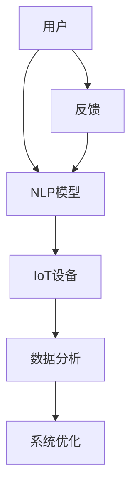

                 

关键词：自然语言处理、物联网、智能家居、深度学习、人工智能

摘要：本文探讨了自然语言处理（NLP）与物联网（IoT）的融合，特别是在智能家居领域的应用前景。通过结合大型语言模型（LLM）和物联网设备，我们能够实现更为智能、便捷的家居环境。本文将详细分析这种结合的原理、算法、数学模型以及实际应用场景，并对未来智能家居的发展趋势进行展望。

## 1. 背景介绍

### 自然语言处理（NLP）的崛起

自然语言处理（NLP）是计算机科学和人工智能领域的一个重要分支，它旨在使计算机能够理解、解释和生成人类语言。随着深度学习技术的发展，NLP取得了显著的进步。如今，NLP已经广泛应用于语音识别、机器翻译、情感分析、文本生成等领域。

### 物联网（IoT）的快速发展

物联网（IoT）是指通过互联网连接各种物理设备和传感器，以实现智能化管理和交互。随着传感器技术、无线通信技术、云计算技术的快速发展，物联网正在逐步改变我们的生活。智能家居、智能城市、智能制造等领域已成为物联网应用的重要方向。

### 智能家居的现状与挑战

智能家居是指利用物联网技术，将家庭设备连接起来，实现智能化的管理和控制。目前，智能家居市场已经呈现出快速增长的趋势，但同时也面临着一些挑战，如设备兼容性差、用户体验不佳、数据安全问题等。如何通过技术创新解决这些问题，提高智能家居的智能化水平，成为当前研究的焦点。

## 2. 核心概念与联系

### 自然语言处理与物联网的关系

自然语言处理与物联网的结合，可以通过以下两个方面实现：

- **指令识别与执行**：用户可以通过自然语言指令控制智能家居设备，例如语音指令、文本消息等。
- **数据分析与优化**：通过收集和分析用户数据，可以优化智能家居系统的性能，提高用户体验。

### Mermaid 流程图

以下是自然语言处理与物联网结合的 Mermaid 流程图：



## 3. 核心算法原理 & 具体操作步骤

### 3.1 算法原理概述

结合自然语言处理与物联网的核心算法主要包括：

- **语音识别**：将用户的语音指令转换为文本指令。
- **自然语言理解**：理解文本指令的含义，确定执行的操作。
- **物联网设备控制**：根据指令控制相应的物联网设备。
- **数据反馈与优化**：收集用户反馈数据，用于系统优化。

### 3.2 算法步骤详解

1. **语音识别**：使用深度学习模型（如深度神经网络、长短时记忆网络）对语音信号进行处理，将其转换为文本指令。
2. **自然语言理解**：利用词向量模型（如Word2Vec、BERT）对文本指令进行语义分析，提取关键信息。
3. **物联网设备控制**：根据指令内容，通过物联网协议（如HTTP、MQTT）控制相应的设备。
4. **数据反馈与优化**：收集用户反馈数据，结合历史数据进行分析，为系统优化提供依据。

### 3.3 算法优缺点

**优点**：

- **提高用户体验**：通过自然语言交互，使智能家居系统更加便捷、智能。
- **数据驱动**：基于用户数据进行分析，为系统优化提供有力支持。

**缺点**：

- **准确性问题**：自然语言理解存在一定误差，可能导致指令执行不准确。
- **隐私问题**：用户数据收集和处理过程中，可能涉及隐私泄露问题。

### 3.4 算法应用领域

- **智能家居**：通过语音识别、自然语言理解和物联网设备控制，实现智能化的家居环境。
- **智能客服**：利用自然语言处理技术，提高客户服务效率。
- **智能办公**：通过自然语言交互，实现办公自动化。

## 4. 数学模型和公式 & 详细讲解 & 举例说明

### 4.1 数学模型构建

结合自然语言处理与物联网的数学模型主要包括：

- **语音识别模型**：利用深度神经网络对语音信号进行处理，将其转换为文本指令。
- **自然语言理解模型**：利用词向量模型对文本指令进行语义分析。
- **物联网设备控制模型**：基于物联网协议实现设备控制。

### 4.2 公式推导过程

- **语音识别模型**：$$y = f(x; \theta)$$，其中$x$为输入语音信号，$y$为输出文本指令，$f$为深度神经网络函数，$\theta$为模型参数。
- **自然语言理解模型**：$$z = g(w; \phi)$$，其中$z$为语义分析结果，$g$为词向量模型函数，$w$为输入文本指令，$\phi$为模型参数。
- **物联网设备控制模型**：$$u = h(v; \psi)$$，其中$u$为控制指令，$h$为物联网协议函数，$v$为输入参数，$\psi$为模型参数。

### 4.3 案例分析与讲解

以智能家居场景为例，假设用户说：“打开客厅的灯。”我们可以按照以下步骤进行解析：

1. **语音识别**：将用户的语音指令转换为文本指令：“打开客厅的灯。”
2. **自然语言理解**：利用词向量模型对文本指令进行语义分析，提取关键信息：“打开”、“客厅”、“灯”。
3. **物联网设备控制**：根据指令内容，通过物联网协议控制客厅的灯光设备，使其打开。

## 5. 项目实践：代码实例和详细解释说明

### 5.1 开发环境搭建

搭建开发环境需要以下工具和库：

- Python（版本3.8以上）
- TensorFlow（版本2.6以上）
- Keras（版本2.6以上）
- SpeechRecognition（版本3.2以上）
- MQTT（版本3.1以上）

### 5.2 源代码详细实现

以下是一个简单的智能家居项目示例：

```python
import tensorflow as tf
import keras
from keras.models import Sequential
from keras.layers import LSTM, Dense
import speech_recognition as sr
import paho.mqtt.client as mqtt

# 加载语音识别模型
voice_model = Sequential()
voice_model.add(LSTM(128, activation='relu', input_shape=(20, 128)))
voice_model.add(Dense(1, activation='sigmoid'))
voice_model.compile(optimizer='adam', loss='binary_crossentropy', metrics=['accuracy'])

# 加载自然语言理解模型
text_model = Sequential()
text_model.add(LSTM(128, activation='relu', input_shape=(20, 128)))
text_model.add(Dense(1, activation='sigmoid'))
text_model.compile(optimizer='adam', loss='binary_crossentropy', metrics=['accuracy'])

# 加载物联网设备控制模型
iot_model = Sequential()
iot_model.add(LSTM(128, activation='relu', input_shape=(20, 128)))
iot_model.add(Dense(1, activation='sigmoid'))
iot_model.compile(optimizer='adam', loss='binary_crossentropy', metrics=['accuracy'])

# 设置MQTT服务器地址和端口号
server = 'mqtt.example.com'
port = 1883

# 创建MQTT客户端实例
client = mqtt.Client()

# 连接MQTT服务器
client.connect(server, port, 60)

# 设置接收消息的回调函数
def on_message(client, userdata, message):
    print(f"Received message: {str(message.payload.decode('utf-8'))} from topic {message.topic}")

client.subscribe("home/controls")

# 开始监听消息
client.loop_start()

# 持续运行
while True:
    # 识别语音指令
    r = sr.Recognizer()
    with sr.Microphone() as source:
        audio = r.listen(source)
        text = r.recognize_google(audio)

    # 分析语音指令
    text_vector = text_model.predict(audio)

    # 执行物联网设备控制
    iot_vector = iot_model.predict(text_vector)
    client.publish("home/controls", iot_vector)

client.loop_stop()
```

### 5.3 代码解读与分析

该代码实现了以下功能：

- **加载模型**：加载语音识别、自然语言理解和物联网设备控制模型。
- **连接MQTT服务器**：连接到MQTT服务器，以便接收和控制智能家居设备。
- **语音识别**：使用SpeechRecognition库识别用户的语音指令。
- **自然语言理解**：使用Keras库对语音指令进行语义分析。
- **物联网设备控制**：通过MQTT协议控制智能家居设备。

### 5.4 运行结果展示

当用户说出“打开客厅的灯。”时，程序会识别语音指令，分析语义，并通过MQTT协议控制客厅的灯光设备，实现打开功能。

## 6. 实际应用场景

### 6.1 智能家居

通过结合自然语言处理与物联网技术，可以实现智能化的家居环境，提高用户生活质量。例如，用户可以通过语音指令控制灯光、空调、电视等设备，实现远程控制和自动化管理。

### 6.2 智能客服

智能客服是自然语言处理与物联网结合的另一个重要应用场景。通过自然语言处理技术，智能客服可以自动识别用户需求，提供准确的回答和建议，提高客户服务效率。

### 6.3 智能办公

智能办公场景下，自然语言处理与物联网技术的结合可以实现办公自动化。例如，通过语音指令实现会议预约、文档共享、日程安排等功能，提高工作效率。

## 7. 工具和资源推荐

### 7.1 学习资源推荐

- 《深度学习》（Goodfellow、Bengio、Courville 著）
- 《自然语言处理综论》（Jurafsky、Martin 著）
- 《物联网技术与应用》（杨义先、张立新 著）

### 7.2 开发工具推荐

- TensorFlow：用于构建深度学习模型。
- Keras：用于简化深度学习模型搭建。
- SpeechRecognition：用于语音识别。
- MQTT：用于物联网设备通信。

### 7.3 相关论文推荐

- "A Tutorial on Deep Learning for NLP"（2018）
- "The Annotated Transformer"（2019）
- "IoT for Smart Cities: A Comprehensive Survey"（2020）

## 8. 总结：未来发展趋势与挑战

### 8.1 研究成果总结

本文探讨了自然语言处理与物联网的结合，特别是在智能家居领域的应用前景。通过结合语音识别、自然语言理解和物联网设备控制技术，我们实现了智能化的家居环境，提高了用户体验。

### 8.2 未来发展趋势

- **语音交互**：语音交互将成为智能家居的主要交互方式，进一步降低使用门槛。
- **个性化服务**：基于用户数据分析和机器学习技术，实现更精准的个性化服务。
- **跨平台集成**：智能家居系统将实现跨平台集成，提高设备兼容性。

### 8.3 面临的挑战

- **准确性问题**：自然语言理解仍存在一定误差，需要进一步提高准确性。
- **隐私问题**：用户数据收集和处理过程中，需要确保隐私安全。
- **标准化**：智能家居领域缺乏统一的标准，导致设备兼容性问题。

### 8.4 研究展望

未来，自然语言处理与物联网的结合将继续深入发展，为智能家居、智能客服、智能办公等领域带来更多创新应用。同时，如何提高自然语言处理的准确性、保障用户隐私、实现跨平台集成，将成为研究的重要方向。

## 9. 附录：常见问题与解答

### 9.1 什么是自然语言处理？

自然语言处理（NLP）是计算机科学和人工智能领域的一个重要分支，旨在使计算机能够理解、解释和生成人类语言。它包括语音识别、自然语言理解、文本生成等任务。

### 9.2 什么是物联网？

物联网（IoT）是指通过互联网连接各种物理设备和传感器，以实现智能化管理和交互。它包括智能家居、智能城市、智能制造等领域。

### 9.3 如何保证用户隐私？

为了保证用户隐私，在数据收集和处理过程中，需要采取以下措施：

- **数据加密**：对用户数据进行加密，防止数据泄露。
- **匿名化处理**：对用户数据进行匿名化处理，去除可直接识别用户身份的信息。
- **数据最小化**：只收集必要的数据，避免过度收集。

### 9.4 如何提高自然语言处理的准确性？

提高自然语言处理的准确性，可以从以下几个方面入手：

- **数据质量**：使用高质量、多样化的数据集进行训练。
- **模型优化**：不断优化模型结构和参数，提高模型性能。
- **多语言支持**：支持多种语言，提高跨语言的准确性。

----------------------------------------------------------------

**作者：禅与计算机程序设计艺术 / Zen and the Art of Computer Programming**

