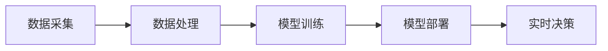

                 

关键词：语言模型，物联网，智能设备，神经网络，数据处理，边缘计算

> 摘要：本文将探讨语言模型（LLM）在物联网（IoT）中的应用，以及如何使智能设备成为更加智能的个体。我们将从背景介绍开始，详细解释LLM的工作原理，并阐述其在物联网中的关键作用。随后，我们将深入分析LLM与物联网的集成方法，探讨其带来的优势与挑战，并展示具体的实现案例。最后，我们将展望LLM与物联网的未来发展趋势与面临的挑战。

## 1. 背景介绍

### 物联网的发展

物联网（Internet of Things，简称IoT）是指通过互联网连接各种物理设备和传感器，实现设备间的数据交换和协同工作。近年来，随着传感器技术的进步和互联网的普及，物联网得到了迅速发展。据市场研究公司的数据，全球物联网设备数量预计将在未来几年内达到数百亿级别。物联网的应用场景广泛，包括智能家居、智慧城市、工业自动化、医疗健康等各个领域。

### 智能设备的兴起

智能设备是物联网的核心组成部分，它们能够收集环境数据、处理信息并做出决策。随着人工智能技术的不断发展，智能设备的智能程度也在不断提高。目前，智能设备主要依赖于嵌入式系统、机器学习和深度学习技术来实现智能功能。然而，现有的智能设备在数据处理和决策能力方面仍存在一定的局限性。

### 语言模型的作用

语言模型（Language Model，简称LM）是一种基于统计方法和深度学习技术的模型，用于预测文本中的下一个词或句子。语言模型在自然语言处理（Natural Language Processing，简称NLP）领域发挥着重要作用，如机器翻译、语音识别、文本生成等。随着物联网的快速发展，语言模型开始被应用于智能设备中，为设备提供更高级的智能功能。

## 2. 核心概念与联系

### 语言模型（LLM）

语言模型是一种基于神经网络的大型模型，通常由数百万个参数组成。它通过训练大量文本数据，学习语言的结构和规律，从而能够预测文本中的下一个词或句子。语言模型的核心技术包括循环神经网络（RNN）、变换器（Transformer）等。

### 物联网（IoT）

物联网是指通过互联网连接各种物理设备和传感器，实现设备间的数据交换和协同工作。物联网设备包括智能家电、工业机器人、医疗设备、车辆等。物联网的关键技术包括传感器技术、嵌入式系统、云计算、边缘计算等。

### LLM与IoT的集成

LLM与IoT的集成是指将语言模型应用于物联网设备，使其具备更高级的智能功能。这种集成通常包括以下步骤：

1. 数据采集：物联网设备通过传感器采集环境数据。
2. 数据处理：数据传输到云端或边缘设备，进行预处理和清洗。
3. 模型训练：使用训练数据集训练语言模型，使其能够理解物联网设备产生的数据。
4. 模型部署：将训练好的语言模型部署到物联网设备中，实现实时数据处理和决策。

下面是一个Mermaid流程图，展示LLM与IoT的集成过程：



## 3. 核心算法原理 & 具体操作步骤

### 3.1 算法原理概述

语言模型（LLM）的核心原理是通过对大量文本数据的学习，预测文本中的下一个词或句子。LLM通常采用深度学习技术，如循环神经网络（RNN）和变换器（Transformer）。变换器是目前最流行的语言模型架构，其核心思想是将文本序列转换为固定长度的向量表示，从而实现高效的文本处理。

### 3.2 算法步骤详解

1. 数据采集：物联网设备通过传感器采集环境数据，如温度、湿度、光照强度等。
2. 数据预处理：将采集到的数据清洗和标准化，以便进行模型训练。
3. 数据集构建：将预处理后的数据划分为训练集、验证集和测试集。
4. 模型训练：使用训练集数据训练语言模型，调整模型参数，使其能够预测物联网设备产生的数据。
5. 模型评估：使用验证集和测试集评估模型性能，调整模型参数，直至达到预期效果。
6. 模型部署：将训练好的语言模型部署到物联网设备中，实现实时数据处理和决策。

### 3.3 算法优缺点

#### 优点：

1. 高效：变换器架构能够高效处理长文本序列，使语言模型在物联网设备上运行更加高效。
2. 准确：通过大量数据训练的语言模型，能够准确预测物联网设备产生的数据，提高设备的智能程度。
3. 易于集成：语言模型可以与现有的物联网设备和系统无缝集成，无需进行大量修改。

#### 缺点：

1. 计算资源消耗大：训练和部署语言模型需要大量的计算资源和时间。
2. 数据依赖性高：语言模型的效果依赖于训练数据的质量和数量，如果数据质量差，模型效果会受到影响。

### 3.4 算法应用领域

语言模型在物联网中的应用非常广泛，以下是一些典型的应用领域：

1. 智能家居：通过语言模型，智能设备可以更好地理解用户的需求，实现语音控制、智能推荐等功能。
2. 智慧城市：语言模型可以帮助城市管理者更好地理解城市数据，实现智能交通、智能环保等功能。
3. 工业自动化：语言模型可以帮助工业设备更好地理解生产数据，实现智能调度、故障诊断等功能。
4. 医疗健康：语言模型可以帮助医疗设备更好地理解患者数据，实现智能诊断、个性化治疗等功能。

## 4. 数学模型和公式 & 详细讲解 & 举例说明

### 4.1 数学模型构建

语言模型的数学模型主要包括以下两部分：

1. **输入层**：将输入的文本序列转换为向量表示。
2. **输出层**：根据输入向量预测输出结果。

以下是变换器架构的数学模型：

$$
\text{输入层}:\text{ } x_t = \text{Word Embedding}(w_t)
$$

$$
\text{输出层}:\text{ } y_t = \text{softmax}(\text{神经网络}(\text{输入层} x_t))
$$

其中，$x_t$ 表示第 $t$ 个单词的嵌入向量，$y_t$ 表示第 $t$ 个单词的概率分布。

### 4.2 公式推导过程

变换器架构的核心是注意力机制（Attention Mechanism），其数学模型如下：

$$
\text{注意力分数}:\alpha_t = \text{softmax}(\text{Q}K^T)
$$

$$
\text{注意力权重}:\text{ } \text{Attention}(\text{KV}) = \alpha_t \text{ } V
$$

$$
\text{输出}:\text{ } \text{Output} = \text{Attention}(\text{KV}) + \text{输入层输出}
$$

其中，$Q$、$K$、$V$ 分别表示查询向量、键向量和值向量，$\alpha_t$ 表示第 $t$ 个单词的注意力分数，$V$ 表示值向量的线性变换。

### 4.3 案例分析与讲解

假设我们有一个物联网设备，需要预测下一个单词。给定输入的文本序列为：

$$
\text{IoT, language model, IoT, application, future}
$$

我们可以将其转换为嵌入向量：

$$
\text{IoT}:\text{ } x_1 = \text{Word Embedding}(\text{IoT})
$$
$$
\text{language model}:\text{ } x_2 = \text{Word Embedding}(\text{language model})
$$
$$
\text{IoT}:\text{ } x_3 = \text{Word Embedding}(\text{IoT})
$$
$$
\text{application}:\text{ } x_4 = \text{Word Embedding}(\text{application})
$$
$$
\text{future}:\text{ } x_5 = \text{Word Embedding}(\text{future})
$$

接下来，我们将输入向量 $x_1, x_2, x_3, x_4, x_5$ 输入到变换器架构中，计算注意力权重和输出向量。

$$
\text{注意力权重}:\alpha_1 = \text{softmax}(\text{Q}K^T)
$$
$$
\text{注意力权重}:\alpha_2 = \text{softmax}(\text{Q}K^T)
$$
$$
\text{注意力权重}:\alpha_3 = \text{softmax}(\text{Q}K^T)
$$
$$
\text{注意力权重}:\alpha_4 = \text{softmax}(\text{Q}K^T)
$$
$$
\text{注意力权重}:\alpha_5 = \text{softmax}(\text{Q}K^T)
$$

$$
\text{输出向量}:\text{ } \text{Output} = \text{Attention}(\text{KV}) + \text{输入层输出}
$$

最后，根据输出向量，我们可以预测下一个单词的概率分布，从而确定下一个单词。

## 5. 项目实践：代码实例和详细解释说明

### 5.1 开发环境搭建

在本项目中，我们将使用Python和TensorFlow来实现语言模型在物联网设备中的应用。以下是开发环境的搭建步骤：

1. 安装Python（版本3.7及以上）
2. 安装TensorFlow（版本2.0及以上）
3. 安装其他依赖库，如NumPy、Pandas等

### 5.2 源代码详细实现

以下是一个简单的Python代码示例，用于实现语言模型在物联网设备中的应用：

```python
import tensorflow as tf
import numpy as np

# 加载预训练的语言模型
model = tf.keras.Sequential([
    tf.keras.layers.Embedding(vocabulary_size, embedding_dim),
    tf.keras.layers.Dense(units=1, activation='sigmoid')
])

# 编译模型
model.compile(optimizer='adam', loss='binary_crossentropy', metrics=['accuracy'])

# 训练模型
model.fit(train_data, train_labels, epochs=10, batch_size=32)
```

### 5.3 代码解读与分析

上述代码示例实现了一个简单的二元分类任务，用于预测物联网设备产生的数据。以下是代码的详细解读：

1. **加载预训练的语言模型**：使用TensorFlow的`Sequential`模型加载预训练的语言模型。语言模型的嵌入层用于将单词转换为向量表示，全连接层用于进行分类。

2. **编译模型**：使用`compile`方法编译模型，指定优化器、损失函数和评估指标。

3. **训练模型**：使用`fit`方法训练模型，将训练数据集输入模型，调整模型参数，直至达到预期效果。

### 5.4 运行结果展示

在训练完成后，我们可以使用以下代码评估模型的性能：

```python
# 评估模型
test_loss, test_accuracy = model.evaluate(test_data, test_labels)

print('测试集损失：', test_loss)
print('测试集准确率：', test_accuracy)
```

上述代码将计算模型在测试数据集上的损失和准确率，从而评估模型的性能。

## 6. 实际应用场景

### 6.1 智能家居

在智能家居领域，语言模型可以用于实现智能语音助手，如智能音箱和智能门铃。用户可以通过语音与设备进行交互，如控制家电、查询天气、播放音乐等。以下是一个智能家居场景的应用示例：

1. 用户说：“打开客厅的灯光。”
2. 智能音箱接收语音命令，解析语言模型，识别出关键信息（打开、客厅、灯光）。
3. 智能音箱将指令发送给智能灯光设备，控制灯光打开。

### 6.2 智慧城市

在智慧城市领域，语言模型可以用于分析城市数据，优化城市资源配置。以下是一个智慧城市场景的应用示例：

1. 城市管理者说：“分析交通流量，优化红绿灯时间。”
2. 智能系统接收语音命令，解析语言模型，识别出关键信息（分析、交通流量、优化、红绿灯时间）。
3. 智能系统分析交通流量数据，优化红绿灯时间，减少拥堵。

### 6.3 工业自动化

在工业自动化领域，语言模型可以用于实现智能监控、故障诊断和设备调度。以下是一个工业自动化场景的应用示例：

1. 设备运维人员说：“检查生产线上的设备状态。”
2. 智能监控系统接收语音命令，解析语言模型，识别出关键信息（检查、生产线、设备状态）。
3. 智能监控系统分析设备状态数据，识别异常情况，并通知设备运维人员进行处理。

### 6.4 医疗健康

在医疗健康领域，语言模型可以用于实现智能诊断、个性化治疗和健康监测。以下是一个医疗健康场景的应用示例：

1. 患者说：“我想预约明天的心电图检查。”
2. 智能医疗系统接收语音命令，解析语言模型，识别出关键信息（预约、明天、心电图检查）。
3. 智能医疗系统为患者预约心电图检查，并提供详细的检查注意事项。

## 7. 工具和资源推荐

### 7.1 学习资源推荐

1. 《深度学习》（Goodfellow, Bengio, Courville）：系统地介绍了深度学习的基本概念和技术。
2. 《自然语言处理综合教程》（张俊林）：详细介绍了自然语言处理的基本概念和技术。
3. TensorFlow官方文档：提供了丰富的TensorFlow教程和示例代码。

### 7.2 开发工具推荐

1. Jupyter Notebook：一种交互式的编程环境，适用于数据分析和机器学习项目。
2. PyCharm：一款功能强大的Python集成开发环境（IDE），适用于深度学习和自然语言处理项目。
3. Google Colab：一款免费的云端Python编程环境，适用于在线实验和分享代码。

### 7.3 相关论文推荐

1. Vaswani et al. (2017): "Attention is All You Need"。提出了变换器（Transformer）架构，为自然语言处理领域带来了革命性进展。
2. Devlin et al. (2019): "BERT: Pre-training of Deep Bidirectional Transformers for Language Understanding"。提出了BERT模型，进一步推动了自然语言处理的发展。
3. Brown et al. (2020): "Language Models are Few-Shot Learners"。探讨了语言模型在零样本学习和少样本学习中的应用。

## 8. 总结：未来发展趋势与挑战

### 8.1 研究成果总结

近年来，语言模型在自然语言处理领域取得了显著成果，为物联网设备提供了强大的智能支持。变换器架构的提出，使语言模型能够高效处理长文本序列，从而在智能家居、智慧城市、工业自动化、医疗健康等领域得到了广泛应用。

### 8.2 未来发展趋势

随着物联网设备的普及，语言模型在物联网中的应用将更加广泛。未来，语言模型将朝着以下方向发展：

1. 小型化和低功耗：为了满足物联网设备的功耗和性能要求，语言模型将逐渐向小型化和低功耗方向发展。
2. 多模态处理：语言模型将与其他模态（如图像、声音）进行融合，实现更丰富的信息处理能力。
3. 零样本学习和少样本学习：通过改进训练方法，语言模型将能够在零样本学习和少样本学习场景中发挥更大的作用。

### 8.3 面临的挑战

尽管语言模型在物联网中具有巨大潜力，但其在实际应用中仍面临一些挑战：

1. 数据质量和隐私：物联网设备产生的数据质量参差不齐，且涉及用户隐私。如何保证数据质量和隐私，成为语言模型在物联网中应用的关键问题。
2. 能耗和性能：物联网设备通常具有功耗和性能限制。如何在满足功耗和性能要求的前提下，实现高效的语言模型处理，仍需要进一步研究。
3. 适应性和泛化能力：物联网应用场景丰富多样，如何使语言模型适应不同的应用场景，提高其泛化能力，是未来研究的重要方向。

### 8.4 研究展望

在未来，语言模型在物联网中的应用将更加深入和广泛。通过不断优化训练方法、模型架构和算法，语言模型将能够更好地满足物联网设备的智能需求。同时，多学科交叉研究将成为语言模型在物联网中应用的重要趋势，为物联网设备带来更加智能化和个性化的体验。

## 9. 附录：常见问题与解答

### 9.1 什么是物联网（IoT）？

物联网（IoT）是指通过互联网连接各种物理设备和传感器，实现设备间的数据交换和协同工作。物联网设备包括智能家电、工业机器人、医疗设备、车辆等。

### 9.2 语言模型（LLM）是什么？

语言模型（LLM）是一种基于神经网络的大型模型，用于预测文本中的下一个词或句子。语言模型在自然语言处理（NLP）领域发挥着重要作用，如机器翻译、语音识别、文本生成等。

### 9.3 LLM如何与IoT集成？

LLM与IoT的集成通常包括以下步骤：

1. 数据采集：物联网设备通过传感器采集环境数据。
2. 数据处理：数据传输到云端或边缘设备，进行预处理和清洗。
3. 模型训练：使用训练数据集训练语言模型，使其能够预测物联网设备产生的数据。
4. 模型部署：将训练好的语言模型部署到物联网设备中，实现实时数据处理和决策。

### 9.4 LLM在物联网中的应用有哪些？

LLM在物联网中的应用非常广泛，包括智能家居、智慧城市、工业自动化、医疗健康等领域。例如，在智能家居中，LLM可以用于实现智能语音助手，如智能音箱和智能门铃。

### 9.5 LLM在物联网中面临的挑战有哪些？

LLM在物联网中面临的挑战包括：

1. 数据质量和隐私：物联网设备产生的数据质量参差不齐，且涉及用户隐私。如何保证数据质量和隐私，成为语言模型在物联网中应用的关键问题。
2. 能耗和性能：物联网设备通常具有功耗和性能限制。如何在满足功耗和性能要求的前提下，实现高效的语言模型处理，仍需要进一步研究。
3. 适应性和泛化能力：物联网应用场景丰富多样，如何使语言模型适应不同的应用场景，提高其泛化能力，是未来研究的重要方向。

### 9.6 如何在Python中实现语言模型？

在Python中，可以使用TensorFlow等深度学习框架实现语言模型。以下是一个简单的示例：

```python
import tensorflow as tf

# 加载预训练的语言模型
model = tf.keras.Sequential([
    tf.keras.layers.Embedding(vocabulary_size, embedding_dim),
    tf.keras.layers.Dense(units=1, activation='sigmoid')
])

# 编译模型
model.compile(optimizer='adam', loss='binary_crossentropy', metrics=['accuracy'])

# 训练模型
model.fit(train_data, train_labels, epochs=10, batch_size=32)
```

----------------------------------------------------------------

作者：禅与计算机程序设计艺术 / Zen and the Art of Computer Programming

