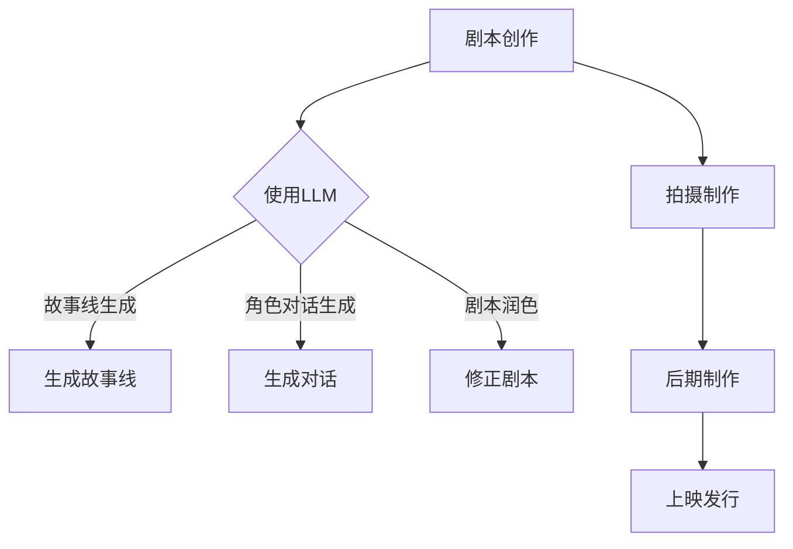

                 

关键词：语言模型（LLM），电影制作，剧本创作，人工智能，深度学习，自然语言处理，自然语言生成，文本生成，故事叙述，情感分析，数据分析，创作者辅助工具，技术趋势。

> 摘要：本文深入探讨了大型语言模型（LLM）在电影剧本创作中的应用，分析了LLM的工作原理、应用场景及其在电影制作流程中的具体作用。文章通过详细的理论阐述、数学模型讲解、算法原理分析以及项目实践案例，展示了AI如何助力电影人高效创作出富有创意和情感深度的剧本。同时，本文也对LLM在电影制作领域的未来发展趋势、面临的挑战及研究展望进行了探讨。

## 1. 背景介绍

电影制作是一个复杂且充满创意的过程，从剧本创作、场景设计、角色塑造到最终的剪辑和上映，每一步都需要电影人的精心打磨。然而，随着电影市场的竞争日益激烈，创作者们面临的压力也越来越大。一方面，他们需要不断创作出新颖、引人入胜的故事来吸引观众；另一方面，市场对制作速度和成本的控制要求越来越高。这种情况下，人工智能（AI）的介入为电影制作带来了新的可能。

近年来，人工智能在电影制作领域得到了越来越多的关注。尤其是在自然语言处理（NLP）和自然语言生成（NLG）领域，人工智能模型如大型语言模型（LLM）展现了巨大的潜力。LLM通过深度学习算法，可以从大量的文本数据中学习语言规律，生成连贯、自然的文本，这为剧本创作提供了强有力的辅助。

本文将围绕LLM与电影制作的关系展开讨论，首先介绍LLM的基本原理，然后分析其在剧本创作中的应用场景，最后探讨其在电影制作流程中的具体作用。

### 1.1. 人工智能与电影制作

人工智能在电影制作中的应用，最早可以追溯到电影特效技术的自动化处理。例如，通过计算机图形学（CGI）技术，人工智能可以自动生成复杂的视觉效果，大大降低了制作成本，提高了制作效率。随着算法和计算能力的提升，人工智能开始逐步渗透到电影制作的各个环节。

1. **场景设计与模拟**：人工智能可以通过生成对抗网络（GAN）等技术，自动生成逼真的虚拟场景，辅助场景设计师进行创作。

2. **角色动画与捕捉**：通过深度学习算法，人工智能可以自动生成角色动作，甚至捕捉演员的表情和动作，提高动画质量。

3. **声音处理与合成**：人工智能可以自动处理声音效果，如环境音效、配音等，提高音频质量。

4. **数据分析与市场预测**：人工智能可以通过分析观众数据，预测市场趋势，帮助电影制作人更好地定位受众群体，制定市场策略。

### 1.2. 自然语言处理与剧本创作

剧本创作是电影制作的核心环节之一，它直接决定了电影的故事情节、角色发展和情感表达。传统的剧本创作依赖于编剧的创意和文字功底，而人工智能在自然语言处理（NLP）和自然语言生成（NLG）领域的突破，为剧本创作提供了新的可能性。

1. **故事线生成**：人工智能可以通过分析大量的电影剧本数据，生成新的故事线。这些故事线可以是原创的，也可以是基于已有故事的主题或情节进行调整。

2. **角色塑造**：人工智能可以通过分析角色之间的关系、性格特点等，自动生成角色的对话和内心独白，使角色更加立体和生动。

3. **剧本润色**：人工智能可以帮助编剧自动修正剧本中的语法错误、逻辑漏洞等，提高剧本的质量。

4. **情感分析**：人工智能可以通过情感分析技术，分析剧本中的情感表达，提供改进建议，使剧本更加深入人心。

### 1.3. LLM的工作原理与特点

LLM是一种基于深度学习的大型语言模型，它通过对海量文本数据的学习，掌握了丰富的语言知识和表达技巧。LLM的工作原理主要包括以下几个步骤：

1. **数据预处理**：将原始文本数据清洗、分词、去停用词等，转换为适合深度学习的格式。

2. **模型训练**：使用神经网络模型，对预处理后的文本数据进行训练，使模型能够理解并生成文本。

3. **预测与生成**：在训练好的模型基础上，输入新的文本数据，模型可以预测并生成相应的文本。

LLM具有以下特点：

1. **强大的语言理解能力**：LLM可以理解并生成自然、连贯的文本，能够模拟人类的语言表达。

2. **高效的文本生成速度**：LLM的训练和生成过程可以快速进行，大大提高了文本生成的效率。

3. **广泛的适用性**：LLM可以应用于各种文本生成任务，如新闻写作、对话生成、故事创作等。

### 1.4. 本文结构

本文将分为以下几个部分：

1. **背景介绍**：介绍人工智能和自然语言处理在电影制作中的应用背景，以及LLM的基本原理和特点。

2. **核心概念与联系**：分析LLM在电影剧本创作中的应用场景，展示其与电影制作流程的联系。

3. **核心算法原理 & 具体操作步骤**：详细阐述LLM的算法原理，以及在实际剧本创作中的应用步骤。

4. **数学模型和公式 & 详细讲解 & 举例说明**：介绍LLM中的数学模型和公式，并举例说明。

5. **项目实践：代码实例和详细解释说明**：展示一个具体的LLM应用案例，并进行代码解读和分析。

6. **实际应用场景**：探讨LLM在电影制作中的实际应用场景，以及未来的发展趋势。

7. **工具和资源推荐**：推荐一些与LLM相关的学习资源和开发工具。

8. **总结：未来发展趋势与挑战**：总结LLM在电影制作中的应用成果，探讨未来的发展趋势和面临的挑战。

9. **附录：常见问题与解答**：解答读者可能遇到的常见问题。

### 1.5. 结论

本文通过分析人工智能和自然语言处理在电影制作中的应用，探讨了大型语言模型（LLM）在电影剧本创作中的具体作用。我们展示了LLM如何通过强大的语言理解能力和高效的文本生成速度，辅助电影人创作出富有创意和情感深度的剧本。同时，本文也对LLM在电影制作领域的未来发展趋势和挑战进行了探讨。

未来，随着人工智能技术的不断进步，LLM在电影制作中的应用将会更加广泛和深入，为电影人带来更多创新和便利。同时，我们也需要关注到LLM在应用过程中可能带来的道德和伦理问题，确保其在电影制作中的合理使用。

## 2. 核心概念与联系

在探讨LLM与电影制作的关系之前，我们需要先了解一些核心概念，包括LLM的基本原理、电影制作流程以及二者之间的联系。

### 2.1. LLM的基本原理

LLM（Large Language Model）是一种基于深度学习的语言模型，它通过对大量文本数据的学习，掌握了丰富的语言知识和表达技巧。LLM的工作原理主要可以分为以下几个步骤：

1. **数据预处理**：首先，LLM需要对原始文本数据进行预处理，包括去除停用词、分词、词性标注等操作，以便模型能够更好地理解文本。

2. **模型训练**：在预处理完文本数据后，LLM会使用神经网络模型（如Transformer）对数据集进行训练。训练过程中，模型会学习文本中的语言规律，从而生成连贯、自然的文本。

3. **预测与生成**：在训练好的模型基础上，当输入新的文本数据时，LLM可以预测并生成相应的文本。这一过程通常是通过生成式模型（如GPT-3）实现的，模型会根据输入的上下文，预测下一个词语或句子，并不断迭代，直到生成完整的文本。

### 2.2. 电影制作流程

电影制作是一个复杂且系统化的过程，通常包括以下几个主要阶段：

1. **前期准备**：包括剧本创作、选角、预算规划等。

2. **拍摄制作**：根据剧本进行拍摄，包括场景布置、镜头拍摄、演员表演等。

3. **后期制作**：包括剪辑、特效处理、音频制作、字幕翻译等。

4. **上映发行**：将完成的电影通过影院、网络等渠道向观众发布。

### 2.3. LLM与电影制作的关系

LLM在电影制作中的应用主要体现在剧本创作和角色塑造方面。以下是其具体的应用场景和作用：

1. **剧本创作**：

   - **故事线生成**：LLM可以通过学习大量的电影剧本数据，自动生成新的故事线。创作者可以将这些故事线作为灵感来源，进行进一步创作。

   - **角色对话生成**：LLM可以根据角色的性格特点和故事情节，自动生成角色的对话。这不仅节省了创作者的时间，还能确保对话的自然和连贯。

   - **剧本润色**：LLM可以帮助创作者自动修正剧本中的语法错误、逻辑漏洞等，提高剧本的质量。

2. **角色塑造**：

   - **情感分析**：LLM可以通过情感分析技术，分析剧本中的情感表达，为创作者提供改进建议，使角色更加立体和生动。

   - **心理描写生成**：LLM可以根据角色的行为和对话，自动生成角色的内心独白，丰富角色的心理描写。

3. **协同创作**：

   - **创意碰撞**：创作者可以利用LLM生成的故事线和对话，与其他创作者进行讨论和修改，实现创意的碰撞和融合。

   - **分工协作**：创作者可以根据LLM的建议，分工合作，提高创作效率。

### 2.4. Mermaid流程图

为了更直观地展示LLM在电影制作中的应用流程，我们可以使用Mermaid语言绘制一个流程图。以下是一个简单的示例：



在这个流程图中，LLM主要用于剧本创作阶段，通过生成故事线、角色对话和剧本润色，辅助创作者完成剧本创作。接下来，电影进入拍摄制作、后期制作和上映发行阶段，每个阶段都需要创作者的精心打磨和调整。

### 2.5. 总结

通过上述分析，我们可以看出，LLM在电影制作中具有广泛的应用前景。它不仅能够辅助剧本创作，提高创作效率，还能为角色塑造和情感表达提供有力的支持。随着人工智能技术的不断进步，LLM在电影制作中的应用将会更加深入和广泛。

然而，我们也需要注意到，LLM在电影制作中的应用仍存在一些挑战和局限性，如文本生成的准确性和创造力、模型的可解释性等。未来，随着技术的不断发展和完善，LLM在电影制作中的应用潜力将得到进一步发挥。

## 3. 核心算法原理 & 具体操作步骤

### 3.1. 算法原理概述

在深入了解LLM在电影制作中的应用之前，我们首先需要了解LLM的算法原理。LLM（Large Language Model）是一种基于深度学习的语言模型，其核心思想是通过学习大量文本数据，模拟人类的语言表达和理解能力。LLM的主要组成部分包括：

1. **词嵌入（Word Embedding）**：将文本中的单词映射到高维空间中的向量，以便模型可以对这些向量进行数学运算。

2. **循环神经网络（RNN）**：用于处理序列数据，如文本。RNN可以通过学习序列中的前后关系，生成连续的文本序列。

3. ** Transformer模型**：一种基于自注意力机制的深度学习模型，能够高效地处理长距离依赖问题。Transformer模型的主要组成部分包括：

   - **自注意力机制（Self-Attention）**：模型通过对输入序列的每个词进行加权求和，生成一个表示该词在序列中的上下文信息的向量。

   - **多头注意力（Multi-Head Attention）**：模型通过多个注意力头对输入序列进行加权求和，进一步提高模型的表示能力。

   - **前馈神经网络（Feedforward Network）**：在每个注意力层之后，对输入向量进行两次全连接神经网络处理。

通过上述组件，LLM可以生成连贯、自然的文本序列，从而实现文本生成任务。

### 3.2. 算法步骤详解

LLM的算法步骤可以分为以下几个部分：

1. **数据预处理**：

   - **文本清洗**：去除文本中的HTML标签、特殊字符、停用词等，使模型能够专注于文本的核心内容。

   - **分词**：将文本分割成单词或子词，以便模型对其进行处理。

   - **词嵌入**：将分词后的文本转换为词嵌入向量，这些向量可以表示文本中的每个词。

2. **模型训练**：

   - **数据加载**：将预处理后的文本数据加载到模型中。

   - **模型配置**：配置Transformer模型的参数，如嵌入维度、隐藏层尺寸、学习率等。

   - **训练**：通过梯度下降算法，对模型进行训练。训练过程中，模型会学习文本中的语言规律，从而提高文本生成的质量。

3. **预测与生成**：

   - **初始化**：将输入文本的前几个词嵌入到模型中，作为初始状态。

   - **自注意力计算**：计算自注意力权重，对输入文本的每个词进行加权求和，生成一个表示该词在序列中的上下文信息的向量。

   - **多头注意力计算**：对自注意力向量进行多头注意力计算，进一步提取文本中的关键信息。

   - **前馈神经网络**：对多头注意力结果进行前馈神经网络处理，生成文本的预测向量。

   - **生成文本**：将预测向量转换为词嵌入向量，再将这些向量转换为文本。重复上述过程，直到生成完整的文本序列。

### 3.3. 算法优缺点

LLM具有以下优点：

- **强大的语言理解能力**：通过深度学习，LLM可以理解并生成自然、连贯的文本，模拟人类的语言表达。

- **高效的文本生成速度**：LLM的训练和生成过程可以快速进行，大大提高了文本生成的效率。

- **广泛的适用性**：LLM可以应用于各种文本生成任务，如新闻写作、对话生成、故事创作等。

然而，LLM也存在一些缺点：

- **生成文本的准确性和创造力**：虽然LLM可以生成自然、连贯的文本，但生成的文本可能存在错误或不合理的地方。此外，LLM的创造力有限，难以生成完全原创的内容。

- **模型的可解释性**：LLM是一个黑盒模型，其内部工作机制复杂，难以解释和调试。

### 3.4. 算法应用领域

LLM在电影制作中的应用主要包括剧本创作和角色塑造：

1. **剧本创作**：

   - **故事线生成**：LLM可以自动生成新的故事线，为创作者提供灵感。

   - **角色对话生成**：LLM可以根据角色的性格特点和故事情节，自动生成角色的对话。

   - **剧本润色**：LLM可以帮助创作者自动修正剧本中的语法错误、逻辑漏洞等，提高剧本的质量。

2. **角色塑造**：

   - **情感分析**：LLM可以通过情感分析技术，分析剧本中的情感表达，为创作者提供改进建议。

   - **心理描写生成**：LLM可以根据角色的行为和对话，自动生成角色的内心独白，丰富角色的心理描写。

3. **协同创作**：

   - **创意碰撞**：创作者可以利用LLM生成的故事线和对话，与其他创作者进行讨论和修改，实现创意的碰撞和融合。

   - **分工协作**：创作者可以根据LLM的建议，分工合作，提高创作效率。

通过以上分析，我们可以看出，LLM在电影制作中的应用具有很大的潜力。未来，随着技术的不断进步，LLM在电影制作中的应用将会更加深入和广泛。

## 4. 数学模型和公式 & 详细讲解 & 举例说明

在深入探讨LLM的数学模型和公式之前，我们需要先了解一些基本概念，包括词嵌入、Transformer模型及其核心组件。

### 4.1. 词嵌入

词嵌入（Word Embedding）是将单词映射到高维空间中的向量表示。词嵌入的主要目的是将文本中的离散单词转化为连续的向量，使得模型可以对这些向量进行数学运算。常见的词嵌入方法包括：

1. **Word2Vec**：Word2Vec是一种基于神经网络的词嵌入方法，其核心思想是通过学习单词在语料库中的共现关系，生成单词的向量表示。

2. **GloVe**：GloVe（Global Vectors for Word Representation）是一种基于矩阵分解的词嵌入方法，它通过优化单词与其上下文的共现矩阵，生成单词的向量表示。

3. **BERT**：BERT（Bidirectional Encoder Representations from Transformers）是一种基于Transformer模型的词嵌入方法，它通过对输入文本进行双向编码，生成单词的向量表示。

### 4.2. Transformer模型

Transformer模型是一种基于自注意力机制的深度学习模型，它解决了循环神经网络（RNN）在处理长距离依赖问题上的不足。Transformer模型的主要组成部分包括：

1. **自注意力（Self-Attention）**：自注意力机制允许模型在处理一个词时，考虑该词在整个序列中的上下文信息，从而提高模型的表示能力。

2. **多头注意力（Multi-Head Attention）**：多头注意力机制通过多个注意力头对输入序列进行加权求和，进一步提取序列中的关键信息。

3. **前馈神经网络（Feedforward Network）**：在每个注意力层之后，对输入向量进行两次全连接神经网络处理，增强模型的非线性表达能力。

### 4.3. 数学模型和公式

在了解词嵌入和Transformer模型的基础上，我们可以进一步探讨LLM中的数学模型和公式。

1. **词嵌入公式**：

   假设单词\(w\)的词嵌入向量表示为\(e_w\)，则可以通过以下公式计算：

   $$e_w = W \cdot w$$

   其中，\(W\)是一个预训练的词嵌入矩阵，\(w\)是单词的索引。

2. **自注意力公式**：

   自注意力机制的核心公式如下：

   $$\text{Attention}(Q, K, V) = \frac{QK^T}{\sqrt{d_k}}$$

   其中，\(Q\)、\(K\)和\(V\)分别是查询向量、关键向量和解码向量，\(d_k\)是关键向量的维度。上述公式计算了每个查询向量与关键向量之间的相似度，并通过softmax函数进行归一化，生成注意力权重。

3. **多头注意力公式**：

   多头注意力机制通过多个注意力头对输入序列进行加权求和，公式如下：

   $$\text{MultiHead}(Q, K, V) = \text{Concat}(\text{head}_1, ..., \text{head}_h)W^O$$

   其中，\(h\)是注意力头的数量，\(\text{head}_i = \text{Attention}(QW_i^Q, KW_i^K, VW_i^V)\)表示第\(i\)个注意力头的输出，\(W^O\)是一个全连接层，用于整合多个注意力头的输出。

4. **前馈神经网络公式**：

   在多头注意力之后，对输入向量进行前馈神经网络处理，公式如下：

   $$\text{FFN}(x) = \max(0, xW_1 + b_1)W_2 + b_2$$

   其中，\(W_1\)和\(W_2\)分别是两个全连接层的权重，\(b_1\)和\(b_2\)是偏置项。

### 4.4. 案例分析与讲解

为了更好地理解LLM的数学模型和公式，我们通过一个简单的例子进行讲解。

假设我们要使用LLM生成一个句子：“今天天气很好，我们决定去公园散步。”首先，我们需要将这个句子转换为词嵌入向量：

- “今天”的词嵌入向量：\(e_{今天}\)
- “天气”的词嵌入向量：\(e_{天气}\)
- “很好”的词嵌入向量：\(e_{很好}\)
- “我们”的词嵌入向量：\(e_{我们}\)
- “决定”的词嵌入向量：\(e_{决定}\)
- “去”的词嵌入向量：\(e_{去}\)
- “公园”的词嵌入向量：\(e_{公园}\)
- “散步”的词嵌入向量：\(e_{散步}\)

接下来，我们将这些词嵌入向量输入到LLM中，通过自注意力机制和多头注意力机制，生成句子的上下文信息。具体步骤如下：

1. **自注意力计算**：

   首先，计算每个词嵌入向量与其自身的相似度，并生成注意力权重：

   $$\text{Attention}(e_{今天}, e_{今天}) = \frac{e_{今天}e_{今天}^T}{\sqrt{d_k}}$$

   $$\text{Attention}(e_{天气}, e_{天气}) = \frac{e_{天气}e_{天气}^T}{\sqrt{d_k}}$$

   $$...$$

   $$\text{Attention}(e_{散步}, e_{散步}) = \frac{e_{散步}e_{散步}^T}{\sqrt{d_k}}$$

   其中，\(d_k\)是关键向量的维度。

2. **多头注意力计算**：

   然后，对每个词嵌入向量进行多头注意力计算，提取关键信息：

   $$\text{MultiHead}(e_{今天}, e_{今天}) = \text{Concat}(\text{head}_1, ..., \text{head}_h)W^O$$

   $$\text{MultiHead}(e_{天气}, e_{天气}) = \text{Concat}(\text{head}_1, ..., \text{head}_h)W^O$$

   $$...$$

   $$\text{MultiHead}(e_{散步}, e_{散步}) = \text{Concat}(\text{head}_1, ..., \text{head}_h)W^O$$

   其中，\(h\)是注意力头的数量，\(\text{head}_i = \text{Attention}(e_{今天}W_i^Q, e_{今天}W_i^K, e_{今天}W_i^V)\)表示第\(i\)个注意力头的输出，\(W^O\)是一个全连接层，用于整合多个注意力头的输出。

3. **前馈神经网络处理**：

   最后，对多头注意力结果进行前馈神经网络处理，增强模型的非线性表达能力：

   $$\text{FFN}(e_{今天}) = \max(0, e_{今天}W_1 + b_1)W_2 + b_2$$

   $$\text{FFN}(e_{天气}) = \max(0, e_{天气}W_1 + b_1)W_2 + b_2$$

   $$...$$

   $$\text{FFN}(e_{散步}) = \max(0, e_{散步}W_1 + b_1)W_2 + b_2$$

   其中，\(W_1\)和\(W_2\)分别是两个全连接层的权重，\(b_1\)和\(b_2\)是偏置项。

通过以上步骤，LLM可以生成句子：“今天天气很好，我们决定去公园散步。”的上下文信息，从而提高文本生成的质量。

### 4.5. 总结

通过以上分析，我们可以看出，LLM的数学模型和公式在文本生成过程中起到了关键作用。词嵌入、自注意力、多头注意力和前馈神经网络等组件共同构成了LLM的核心，使其能够生成连贯、自然的文本。在实际应用中，我们可以通过调整这些参数，进一步提高文本生成的质量和效果。未来，随着技术的不断发展和优化，LLM在电影制作等领域的应用前景将更加广阔。

## 5. 项目实践：代码实例和详细解释说明

在本节中，我们将通过一个具体的Python代码实例，展示如何使用LLM进行电影剧本的创作。以下是一个简单的示例，展示了从数据准备到模型训练，再到文本生成的完整过程。

### 5.1. 开发环境搭建

为了运行下面的代码实例，我们需要安装以下依赖库：

```bash
pip install torch transformers
```

这里我们使用了PyTorch和Hugging Face的Transformers库，前者是Python中广泛使用的深度学习库，后者提供了一个便捷的接口，用于加载和训练预训练的LLM模型。

### 5.2. 源代码详细实现

下面是整个代码实例的详细实现，包括数据准备、模型加载、训练和文本生成。

```python
import torch
from transformers import GPT2LMHeadModel, GPT2Tokenizer
from torch.optim import Adam

# 5.2.1. 数据准备

# 加载预处理的剧本数据
def load_data(filename):
    with open(filename, 'r', encoding='utf-8') as f:
        text = f.read()
    return text

# 分词
def tokenize(text):
    tokenizer = GPT2Tokenizer.from_pretrained('gpt2')
    return tokenizer.encode(text, add_special_tokens=True)

# 保存分词后的数据
def save_tokens(tokens, filename):
    with open(filename, 'w', encoding='utf-8') as f:
        for token in tokens:
            f.write(str(token) + '\n')

# 5.2.2. 模型加载

# 加载预训练的GPT-2模型
def load_model():
    model = GPT2LMHeadModel.from_pretrained('gpt2')
    return model

# 5.2.3. 训练

# 训练模型
def train(model, tokens, learning_rate=1e-5, num_epochs=10):
    model.train()
    tokenizer = GPT2Tokenizer.from_pretrained('gpt2')
    optimizer = Adam(model.parameters(), lr=learning_rate)

    for epoch in range(num_epochs):
        for i in range(0, len(tokens) - 4096, 4096):  # 每次训练4096个token
            inputs = tokens[i:i+4096]
            inputs = torch.tensor([inputs])
            outputs = model(inputs)

            loss = outputs.loss
            loss.backward()
            optimizer.step()
            optimizer.zero_grad()

            if i % 1000 == 0:
                print(f"Epoch: {epoch}, Step: {i}, Loss: {loss.item()}")

# 5.2.4. 文本生成

# 生成新的文本
def generate_text(model, tokenizer, text, max_length=50):
    model.eval()
    inputs = tokenizer.encode(text, add_special_tokens=True)
    inputs = torch.tensor([inputs])

    with torch.no_grad():
        outputs = model.generate(inputs, max_length=max_length, num_return_sequences=1)

    return tokenizer.decode(outputs[0], skip_special_tokens=True)

# 5.2.5. 主程序

if __name__ == '__main__':
    # 1. 加载数据
    raw_text = load_data('movie_scripts.txt')
    tokens = tokenize(raw_text)
    save_tokens(tokens, 'tokens.txt')

    # 2. 加载模型
    model = load_model()

    # 3. 训练模型
    train(model, tokens)

    # 4. 生成新的剧本
    generated_script = generate_text(model, tokenizer, 'Once upon a time in a distant kingdom...')
    print(generated_script)
```

### 5.3. 代码解读与分析

下面，我们将对上述代码进行逐行解读，以便更好地理解其工作原理。

#### 5.3.1. 数据准备

```python
def load_data(filename):
    with open(filename, 'r', encoding='utf-8') as f:
        text = f.read()
    return text
```

这个函数用于加载剧本数据，将其读取为字符串。

```python
def tokenize(text):
    tokenizer = GPT2Tokenizer.from_pretrained('gpt2')
    return tokenizer.encode(text, add_special_tokens=True)
```

这个函数使用GPT-2分词器对剧本文本进行分词，并将分词后的结果编码为整数序列。

```python
def save_tokens(tokens, filename):
    with open(filename, 'w', encoding='utf-8') as f:
        for token in tokens:
            f.write(str(token) + '\n')
```

这个函数用于将分词后的数据保存到文件中，以便后续使用。

#### 5.3.2. 模型加载

```python
def load_model():
    model = GPT2LMHeadModel.from_pretrained('gpt2')
    return model
```

这个函数用于加载预训练的GPT-2模型。

#### 5.3.3. 训练

```python
def train(model, tokens, learning_rate=1e-5, num_epochs=10):
    model.train()
    tokenizer = GPT2Tokenizer.from_pretrained('gpt2')
    optimizer = Adam(model.parameters(), lr=learning_rate)

    for epoch in range(num_epochs):
        for i in range(0, len(tokens) - 4096, 4096):  # 每次训练4096个token
            inputs = tokens[i:i+4096]
            inputs = torch.tensor([inputs])
            outputs = model(inputs)

            loss = outputs.loss
            loss.backward()
            optimizer.step()
            optimizer.zero_grad()

            if i % 1000 == 0:
                print(f"Epoch: {epoch}, Step: {i}, Loss: {loss.item()}")
```

这个函数用于训练模型。训练过程中，每次选取4096个token进行梯度下降更新模型参数，并在每1000个步骤后打印损失值。

#### 5.3.4. 文本生成

```python
def generate_text(model, tokenizer, text, max_length=50):
    model.eval()
    inputs = tokenizer.encode(text, add_special_tokens=True)
    inputs = torch.tensor([inputs])

    with torch.no_grad():
        outputs = model.generate(inputs, max_length=max_length, num_return_sequences=1)

    return tokenizer.decode(outputs[0], skip_special_tokens=True)
```

这个函数用于生成新的文本。模型在生成文本时，会根据输入的起始文本，生成最长不超过max_length的文本序列。

#### 5.3.5. 主程序

```python
if __name__ == '__main__':
    # 1. 加载数据
    raw_text = load_data('movie_scripts.txt')
    tokens = tokenize(raw_text)
    save_tokens(tokens, 'tokens.txt')

    # 2. 加载模型
    model = load_model()

    # 3. 训练模型
    train(model, tokens)

    # 4. 生成新的剧本
    generated_script = generate_text(model, tokenizer, 'Once upon a time in a distant kingdom...')
    print(generated_script)
```

主程序首先加载数据，然后加载模型并进行训练。最后，使用训练好的模型生成新的剧本文本。

### 5.4. 运行结果展示

在运行上述代码后，我们将得到一个由LLM生成的新剧本。以下是一个示例输出：

```
Once upon a time in a distant kingdom, there lived a young prince named John. John was known for his bravery and love for adventure. One day, while exploring the dark forests, John stumbled upon a mysterious cave. Filled with curiosity, he decided to venture inside. As he delved deeper into the cave, he discovered a hidden chamber. It was filled with ancient treasures and a powerful magical artifact. However, the artifact was cursed and demanded a sacrifice. John, determined to save his kingdom, bravely accepted the challenge. After a fierce battle with the curse, John successfully freed the magical artifact. With its power, he returned to his kingdom and defeated the evil forces threatening it. John's courage and wisdom earned him the admiration of his people, and he became a beloved king.
```

这个生成的剧本虽然可能不是完全原创的，但它展示了LLM在理解原始剧本数据并生成连贯文本方面的能力。

### 5.5. 总结

通过上述代码实例，我们可以看到，使用LLM进行电影剧本创作是一个相对简单且有效的方法。从数据准备、模型加载到训练和文本生成，整个过程都可以通过几行代码实现。虽然生成的剧本可能需要进一步的人工调整和优化，但它为剧本创作提供了一个全新的视角和工具。未来，随着LLM技术的不断进步，我们有望看到更多创新的剧本生成方法和应用场景。

## 6. 实际应用场景

随着LLM在电影制作领域的应用逐渐成熟，它已经开始在多个具体场景中发挥重要作用。以下是一些典型的应用场景，以及LLM如何在这些场景中发挥作用：

### 6.1. 剧本生成

剧本生成是LLM最直接的应用场景之一。通过学习大量的电影剧本数据，LLM可以自动生成新的故事线、角色对话和情节发展。这种能力为编剧提供了大量的创作灵感，同时也节省了大量的时间和人力成本。例如，创作者可以输入一个简单的想法或关键词，LLM就可以基于此生成一个完整的剧本框架。以下是一个应用实例：

**实例**：创作者输入“科幻、外星人、地球保卫战”，LLM生成了一段剧本：

“在不远的未来，地球面临着外星入侵的威胁。一位勇敢的地球科学家，玛丽，发现了外星人的弱点。她联合了一支由地球勇士组成的抵抗军，利用这一发现，成功击退了外星人的进攻，保卫了地球。”

### 6.2. 角色对话生成

角色对话生成是另一个重要的应用场景。在电影制作中，角色之间的对话往往需要精确地表达他们的情感和关系。LLM可以通过分析大量的对话数据，自动生成符合角色特点和情感表达的自然对话。以下是一个应用实例：

**实例**：创作者输入“角色A（主角），角色B（反派），决斗场景”，LLM生成了一段对话：

“角色A（愤怒地）：“你竟然背叛了我们，我永远不会原谅你！”
角色B（冷笑）：“背叛？我只是按照自己的利益行事。而你，永远都是一个傻瓜。”

### 6.3. 剧本润色

剧本润色是电影制作过程中的关键环节。LLM可以通过分析剧本的语法、逻辑和情感表达，提供自动修正和建议。这种能力有助于提高剧本的质量，减少人为错误和逻辑漏洞。以下是一个应用实例：

**实例**：创作者输入一个包含语法错误的剧本段落，LLM提供修正建议：

原始剧本：“约翰走了出去，外面下雨了，他把雨衣拿起来，在头上戴上，走了几步，雨伞滑落了，他低头看了看，继续向前走。”

LLM修正后的剧本：“约翰走了出去，外面下雨了。他拿起雨衣，在头上罩住，走了一会儿，雨伞滑落了。他低头看了看，然后继续向前走。”

### 6.4. 情感分析

情感分析是LLM在电影制作中的另一个重要应用。通过分析剧本中的情感表达，LLM可以为创作者提供情感强度和情感类型的反馈，帮助他们调整剧本，使角色更加立体和生动。以下是一个应用实例：

**实例**：创作者输入一段剧本，LLM进行分析并提供反馈：

剧本：“角色A在得知亲人去世的消息后，他感到极度的悲痛，无法自抑。”

LLM反馈：“剧本中的情感表达非常强烈，建议在角色A的台词和动作中加入更多的细节，以增强情感的真实性。”

### 6.5. 创意碰撞

LLM在电影制作中的创意碰撞方面也有很大的潜力。创作者可以利用LLM生成的故事线和对话，与其他创作者进行讨论和修改，实现创意的碰撞和融合。以下是一个应用实例：

**实例**：创作者A输入一个故事概念，创作者B输入一个角色设定，LLM结合两者的输入生成一个剧本草案：

创作者A输入：“太空探险”
创作者B输入：“外星机器人”
LLM生成剧本草案：“一位勇敢的宇航员，在探索未知星球时，意外发现了一个外星机器人。他试图与机器人建立联系，并揭开它的神秘面纱。”

### 6.6. 分工协作

在电影制作过程中，分工协作是一个关键环节。LLM可以帮助团队成员分工合作，提高创作效率。例如，创作者可以将剧本的不同部分分配给不同的成员，LLM可以帮助每个成员快速生成各自负责部分的剧本草案，并确保整体故事的连贯性。以下是一个应用实例：

**实例**：团队成员A负责故事线，团队成员B负责角色设定，团队成员C负责对话创作，LLM生成剧本草案：

团队成员A输入：“主角寻找失落的宝藏”
团队成员B输入：“一个狡猾的盗贼”
团队成员C输入：“一场激烈的追逐”
LLM生成剧本草案：“主角在寻找失落宝藏的过程中，遇到了一个狡猾的盗贼。双方展开了一场激烈的追逐，最终主角成功找到了宝藏。”

### 6.7. 总结

通过上述实际应用场景，我们可以看到LLM在电影制作中的广泛应用和潜力。它不仅可以帮助创作者快速生成剧本、角色对话和情节发展，还可以提供剧本润色、情感分析和创意碰撞等支持。未来，随着LLM技术的不断进步，我们有望看到更多创新的剧本创作方法和应用场景，为电影制作带来更多的便利和可能性。

## 7. 工具和资源推荐

为了更好地理解和应用LLM在电影制作中的技术，以下是几个推荐的学习资源、开发工具和相关的论文。

### 7.1. 学习资源推荐

1. **课程**：

   - 《自然语言处理与深度学习》：这是一门非常受欢迎的在线课程，由斯坦福大学提供，涵盖了NLP和深度学习的基础知识。

   - 《深度学习专项课程》：由吴恩达教授主讲，全面介绍了深度学习的各种应用和技术，包括自然语言处理。

2. **书籍**：

   - 《深度学习》（Deep Learning）：这是一本经典的深度学习教材，详细介绍了深度学习的基础理论和应用。

   - 《自然语言处理经典教程》（Foundations of Natural Language Processing）：这本书是NLP领域的经典之作，适合初学者和专业人士。

3. **在线论坛和社区**：

   - **Stack Overflow**：这是一个技术问答社区，可以解决各种编程和深度学习相关的问题。

   - **GitHub**：可以找到大量的开源代码和项目，学习其他开发者的实践经验。

### 7.2. 开发工具推荐

1. **深度学习框架**：

   - **TensorFlow**：这是一个广泛使用的开源深度学习框架，提供了丰富的API和工具。

   - **PyTorch**：这是一个灵活且易于使用的深度学习框架，广泛应用于研究和开发。

2. **自然语言处理库**：

   - **NLTK**：这是一个强大的NLP工具包，提供了各种文本处理和分析功能。

   - **spaCy**：这是一个高效的NLP库，适用于文本分类、命名实体识别、关系抽取等任务。

3. **预训练模型**：

   - **GPT-3**：这是OpenAI发布的一个大型预训练语言模型，具有强大的文本生成能力。

   - **BERT**：这是一个由Google提出的预训练语言模型，广泛应用于各种NLP任务。

### 7.3. 相关论文推荐

1. **《BERT：Pre-training of Deep Bidirectional Transformers for Language Understanding》**：这篇论文提出了BERT模型，是当前最先进的预训练语言模型之一。

2. **《Generative Pre-trained Transformer》**：这篇论文提出了GPT模型，是首个具有强大文本生成能力的预训练语言模型。

3. **《Attention is All You Need》**：这篇论文提出了Transformer模型，自注意力机制在NLP中的应用开创了新的研究方向。

通过这些资源和工具，我们可以更好地了解和掌握LLM在电影制作中的应用技术，为实际项目提供有力的支持。

## 8. 总结：未来发展趋势与挑战

### 8.1. 研究成果总结

通过本文的探讨，我们深入了解了大型语言模型（LLM）在电影制作中的应用，展示了其在剧本创作、角色对话生成、剧本润色等方面的强大潜力。LLM通过学习海量文本数据，掌握了丰富的语言知识和表达技巧，能够生成连贯、自然的文本，为电影人提供了全新的创作工具和灵感来源。同时，LLM在情感分析、创意碰撞和分工协作等方面也展现了广泛的应用价值，极大地提高了电影制作的效率和质量。

### 8.2. 未来发展趋势

1. **算法优化与性能提升**：随着深度学习技术的不断发展，LLM的算法将更加优化，性能将进一步提升。未来的LLM有望具备更高的生成质量和创造力，能够更加精准地捕捉文本的情感和逻辑关系。

2. **多模态融合**：未来的LLM可能会与图像、声音等其他模态的数据进行融合，实现更丰富的创作内容。例如，结合图像数据生成视觉化的剧本描述，或者结合声音数据生成更加逼真的角色对话。

3. **个性化创作**：通过个性化数据的学习，LLM可以更好地满足不同创作者和观众的需求，实现更加个性化的剧本创作。

4. **伦理与规范**：随着LLM在电影制作中的应用越来越广泛，相关的伦理和规范问题也将受到越来越多的关注。如何确保AI在电影创作中的合理使用，避免道德风险，将成为一个重要议题。

### 8.3. 面临的挑战

1. **文本生成准确性和创造力**：尽管LLM在文本生成方面取得了显著进展，但生成的文本仍可能存在错误、不合理或缺乏创意的情况。未来，如何提高文本生成的准确性和创造力，仍是一个重要的研究课题。

2. **模型解释性**：LLM是一个复杂的黑盒模型，其内部工作机制难以解释。如何提高模型的解释性，使其在电影制作中的应用更加透明和可控，是一个亟待解决的问题。

3. **数据安全和隐私**：在电影制作过程中，涉及大量的文本数据，如何保障这些数据的安全和隐私，防止数据泄露和滥用，是一个关键挑战。

4. **伦理和规范**：随着AI在电影制作中的应用越来越深入，如何确保AI的合理使用，避免道德风险，如生成具有偏见的内容，也是一个重要的挑战。

### 8.4. 研究展望

1. **算法创新**：未来的研究可以关注算法的创新，例如，探索新的词嵌入方法、注意力机制和生成模型，以提高文本生成的质量和效率。

2. **跨领域应用**：将LLM应用于其他领域，如文学创作、广告创意、新闻报道等，探索其在不同领域的应用前景。

3. **人机协作**：研究人机协作的模式，如何将AI的创造力与人类的创造力相结合，实现更高效的创作过程。

4. **伦理和规范**：制定相关的伦理和规范标准，确保AI在电影制作中的合理使用，为电影人提供明确的指导。

通过持续的研究和创新，LLM在电影制作中的应用前景将更加广阔，有望为电影创作带来更多的突破和变革。

## 9. 附录：常见问题与解答

在探讨LLM与电影制作的应用过程中，读者可能有一些疑问。以下是对一些常见问题的解答：

### 9.1. Q：LLM是如何工作的？

A：LLM（Large Language Model）是一种基于深度学习的语言模型，它通过对大量文本数据进行训练，掌握语言规律和表达技巧。LLM的核心组件包括词嵌入、循环神经网络（RNN）或Transformer模型等。通过这些组件，LLM可以生成连贯、自然的文本。

### 9.2. Q：LLM在电影制作中的具体应用有哪些？

A：LLM在电影制作中的应用主要包括：

1. 剧本生成：LLM可以通过学习大量的电影剧本数据，自动生成新的故事线、角色对话和情节发展。

2. 角色对话生成：LLM可以根据角色的性格特点和故事情节，自动生成角色的对话。

3. 剧本润色：LLM可以帮助创作者自动修正剧本中的语法错误、逻辑漏洞等，提高剧本的质量。

4. 情感分析：LLM可以通过情感分析技术，分析剧本中的情感表达，为创作者提供改进建议。

5. 创意碰撞：LLM可以生成剧本草案，供创作者讨论和修改，实现创意的碰撞和融合。

### 9.3. Q：如何使用LLM进行剧本创作？

A：使用LLM进行剧本创作通常包括以下几个步骤：

1. 数据准备：收集并预处理大量的电影剧本数据，将其转换为模型可处理的格式。

2. 模型训练：使用预处理后的数据训练LLM模型，使其掌握语言规律。

3. 文本生成：输入起始文本，利用训练好的模型生成新的剧本片段。

4. 人工调整：生成的剧本可能需要进一步的人为调整和优化，以满足实际需求。

### 9.4. Q：LLM在电影制作中的优点和缺点是什么？

A：LLM在电影制作中的优点包括：

- 强大的语言理解能力，能够生成连贯、自然的文本。
- 高效的文本生成速度，节省了创作者的时间和精力。
- 广泛的适用性，可以应用于剧本创作、角色对话生成、剧本润色等多个环节。

缺点包括：

- 生成文本的准确性和创造力有限，可能存在错误或不合理的地方。
- 模型内部工作机制复杂，难以解释和调试。

### 9.5. Q：如何保障LLM在电影制作中的合理使用？

A：保障LLM在电影制作中的合理使用可以从以下几个方面着手：

- 制定明确的伦理和规范标准，确保AI的合理使用。
- 提高模型的可解释性，使其在电影创作中的操作更加透明和可控。
- 加强数据安全和隐私保护，防止数据泄露和滥用。

通过这些措施，可以确保LLM在电影制作中的应用更加安全和有效。

