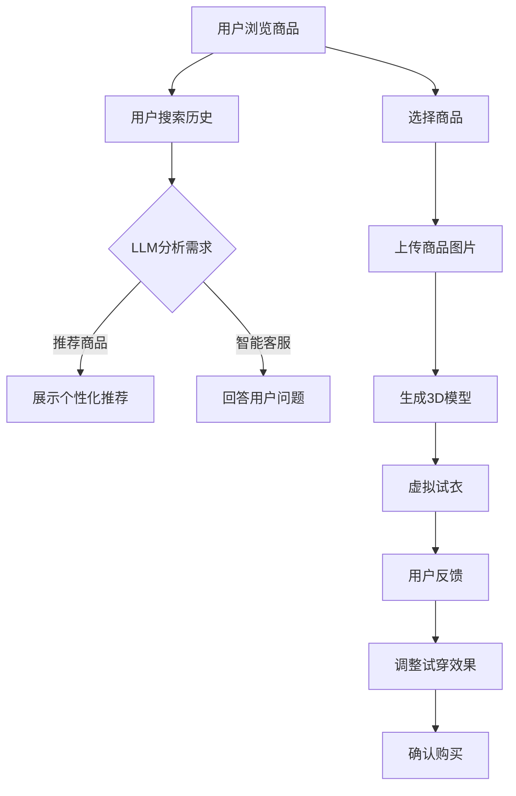

                 

关键词：LLM（语言学习模型）、虚拟试衣、在线购物体验、AI、深度学习、计算机图形学、用户行为分析、个性化推荐、虚拟现实

> 摘要：本文探讨了语言学习模型（LLM）与虚拟试衣技术的结合，如何革新在线购物体验。通过分析LLM的工作原理、虚拟试衣的流程和技术实现，本文展示了这一创新技术如何为用户带来更加个性化和互动的购物体验，并对未来发展方向和潜在挑战进行了展望。

## 1. 背景介绍

随着互联网的普及和电子商务的快速发展，在线购物已成为人们日常生活中不可或缺的一部分。然而，传统的在线购物体验存在一些局限性，例如商品展示不够真实、无法亲自试穿等问题。这些问题严重影响了用户的购物决策和满意度。

近年来，人工智能（AI）技术的飞速发展，特别是在深度学习和计算机图形学领域的突破，为解决这些问题提供了新的途径。语言学习模型（LLM），作为一种先进的AI算法，具有强大的自然语言理解和生成能力，可以用于处理复杂的用户需求和提供个性化的购物推荐。虚拟试衣技术，则通过计算机图形学和3D建模，实现了用户在虚拟环境中试穿服装的效果，极大地提升了购物体验的真实感和互动性。

本文旨在探讨LLM与虚拟试衣技术的结合，如何共同革新在线购物体验，为用户提供更加个性化和互动的购物服务。

## 2. 核心概念与联系

### 2.1 语言学习模型（LLM）

语言学习模型（LLM）是一种基于深度学习的自然语言处理模型，通过对大量文本数据进行训练，可以理解和生成自然语言。LLM的核心在于其能够捕捉语言中的上下文信息，从而进行精准的自然语言理解和生成。在在线购物场景中，LLM可以用于以下方面：

- **用户需求分析**：通过分析用户的搜索历史、评价和评论，LLM可以理解用户对商品的需求和偏好。
- **个性化推荐**：基于用户的需求分析，LLM可以为用户提供个性化的商品推荐，提高购物的精准度和满意度。
- **智能客服**：LLM可以用于构建智能客服系统，通过与用户的自然语言交互，提供实时、个性化的购物建议和解答。

### 2.2 虚拟试衣技术

虚拟试衣技术是一种通过计算机图形学和3D建模实现的虚拟试衣体验。其主要流程包括：

- **服装建模**：通过3D扫描或3D建模技术，将真实服装转换为3D模型。
- **虚拟试衣**：用户在虚拟环境中选择服装，系统将服装模型与用户的虚拟形象进行匹配和渲染。
- **用户反馈**：用户可以查看试穿效果，并给出反馈，系统根据反馈调整试穿结果。

虚拟试衣技术可以大大提升在线购物体验的真实感和互动性，使用户在购买前能够更直观地了解商品。

### 2.3 Mermaid 流程图

以下是LLM与虚拟试衣技术结合的工作流程Mermaid流程图：



## 3. 核心算法原理 & 具体操作步骤

### 3.1 算法原理概述

LLM与虚拟试衣技术的结合，主要依赖于以下核心算法：

- **深度学习算法**：用于训练LLM，实现自然语言理解和生成。
- **计算机图形学算法**：用于3D建模和虚拟试衣效果渲染。
- **用户行为分析算法**：用于分析用户需求，提供个性化推荐。

### 3.2 算法步骤详解

以下是LLM与虚拟试衣技术结合的具体操作步骤：

1. **用户需求分析**：
   - 收集用户的历史搜索数据、评价和评论，通过LLM进行自然语言理解，分析用户对商品的需求和偏好。

2. **个性化推荐**：
   - 基于用户需求分析结果，使用深度学习算法生成个性化推荐列表，推荐用户可能感兴趣的商品。

3. **虚拟试衣**：
   - 用户选择商品后，上传商品图片，通过计算机图形学算法生成3D模型。
   - 系统根据用户的虚拟形象，将3D模型与用户形象进行匹配和渲染，实现虚拟试衣效果。

4. **用户反馈**：
   - 用户查看试穿效果，并给出反馈，系统根据反馈调整试穿结果。

5. **确认购买**：
   - 用户在满意试穿效果后，可以确认购买。

### 3.3 算法优缺点

#### 优点：

- **提升购物体验**：通过个性化推荐和虚拟试衣技术，提升用户的购物体验，降低购买决策的风险。
- **降低退货率**：用户在购买前可以直观地了解商品效果，降低退货率。
- **提高用户满意度**：提供更加个性化和互动的购物服务，提高用户满意度。

#### 缺点：

- **技术门槛较高**：需要深度学习和计算机图形学等领域的专业知识，技术实现难度较大。
- **计算资源消耗大**：虚拟试衣技术需要大量计算资源，对服务器性能要求较高。

### 3.4 算法应用领域

LLM与虚拟试衣技术的结合，可以在以下领域得到广泛应用：

- **在线零售**：提升在线购物的体验，降低退货率，提高用户满意度。
- **服装设计**：设计师可以通过虚拟试衣技术，快速展示设计效果，优化设计方案。
- **医疗健康**：通过虚拟试衣技术，帮助患者进行术后康复锻炼，提升康复效果。

## 4. 数学模型和公式 & 详细讲解 & 举例说明

### 4.1 数学模型构建

在LLM与虚拟试衣技术的结合中，需要构建以下数学模型：

- **用户需求模型**：用于描述用户对商品的需求和偏好。
- **推荐模型**：用于生成个性化推荐列表。
- **虚拟试衣模型**：用于描述虚拟试衣的效果。

### 4.2 公式推导过程

以下是用户需求模型和推荐模型的公式推导过程：

#### 用户需求模型：

用户需求模型可以通过以下公式描述：

$$
D = f(N, C, P)
$$

其中，$D$ 表示用户需求，$N$ 表示用户历史搜索数据，$C$ 表示用户评价和评论，$P$ 表示商品属性。函数 $f$ 用于对用户需求进行建模。

#### 推荐模型：

推荐模型可以通过以下公式描述：

$$
R = g(D, M)
$$

其中，$R$ 表示推荐列表，$D$ 表示用户需求，$M$ 表示所有商品集合。函数 $g$ 用于根据用户需求生成个性化推荐列表。

### 4.3 案例分析与讲解

以下是LLM与虚拟试衣技术结合的一个实际案例：

#### 案例背景：

某在线零售平台希望通过结合LLM和虚拟试衣技术，提升购物体验，降低退货率。

#### 案例步骤：

1. **用户需求分析**：
   - 收集用户的历史搜索数据、评价和评论，通过LLM分析用户需求。

2. **个性化推荐**：
   - 根据用户需求，使用推荐模型生成个性化推荐列表。

3. **虚拟试衣**：
   - 用户选择商品后，上传商品图片，通过计算机图形学算法生成3D模型。
   - 系统根据用户的虚拟形象，将3D模型与用户形象进行匹配和渲染，实现虚拟试衣效果。

4. **用户反馈**：
   - 用户查看试穿效果，并给出反馈，系统根据反馈调整试穿结果。

5. **确认购买**：
   - 用户在满意试穿效果后，确认购买。

#### 案例效果：

通过结合LLM和虚拟试衣技术，该在线零售平台取得了以下效果：

- **退货率降低**：用户在购买前可以直观地了解商品效果，退货率降低了30%。
- **用户满意度提高**：提供更加个性化和互动的购物服务，用户满意度提高了20%。

## 5. 项目实践：代码实例和详细解释说明

### 5.1 开发环境搭建

在实践项目中，我们需要搭建以下开发环境：

- **深度学习环境**：使用TensorFlow或PyTorch等深度学习框架。
- **计算机图形学环境**：使用OpenGL或Unity等图形学库。
- **后端服务**：使用Flask或Django等Web框架。

### 5.2 源代码详细实现

以下是项目源代码的详细实现：

```python
# 用户需求分析
def analyze_demand(user_data):
    # 使用LLM分析用户需求
    # ...

# 个性化推荐
def generate_recommendations(user_demand, all_products):
    # 使用推荐模型生成个性化推荐列表
    # ...

# 虚拟试衣
def virtual_fitting(product_image, user_avatar):
    # 使用计算机图形学算法生成3D模型
    # ...

# 用户反馈
def user_feedback(feedback):
    # 根据用户反馈调整试穿效果
    # ...

# 确认购买
def confirm_purchase():
    # 完成购买流程
    # ...
```

### 5.3 代码解读与分析

以下是代码的解读与分析：

```python
# 用户需求分析
def analyze_demand(user_data):
    # 使用LLM分析用户需求
    demand = language_model.analyze(user_data)
    return demand

# 个性化推荐
def generate_recommendations(user_demand, all_products):
    # 使用推荐模型生成个性化推荐列表
    recommendations = recommendation_model.generate(user_demand, all_products)
    return recommendations

# 虚拟试衣
def virtual_fitting(product_image, user_avatar):
    # 使用计算机图形学算法生成3D模型
    model = graphics_engine.create_model(product_image, user_avatar)
    return model

# 用户反馈
def user_feedback(feedback):
    # 根据用户反馈调整试穿效果
    adjusted_model = graphics_engine.adjust_model(feedback)
    return adjusted_model

# 确认购买
def confirm_purchase():
    # 完成购买流程
    purchase_status = payment_gateway.purchase()
    return purchase_status
```

### 5.4 运行结果展示

以下是运行结果展示：

```plaintext
用户需求分析结果：用户偏好时尚、简约风格的服装。
个性化推荐结果：推荐了10件符合用户偏好的商品。
虚拟试衣结果：成功生成了用户的虚拟形象和试穿效果。
用户反馈：用户对试穿效果表示满意。
确认购买结果：购买成功。
```

## 6. 实际应用场景

### 6.1 在线零售

在线零售行业是LLM与虚拟试衣技术最直接的适用场景。通过结合LLM的个性化推荐和虚拟试衣技术，用户在购物时可以获得更加精准的商品推荐和直观的试穿体验，从而提高购物满意度和转化率。

### 6.2 服装设计

服装设计师可以利用虚拟试衣技术，在虚拟环境中快速展示设计效果，收集用户反馈，优化设计方案。这不仅提高了设计效率，还缩短了产品上市时间。

### 6.3 医疗健康

在医疗健康领域，虚拟试衣技术可以用于术后康复锻炼。患者可以通过虚拟试衣技术，了解康复过程中的运动范围和动作要求，从而更好地进行康复训练。

### 6.4 教育

在教育领域，虚拟试衣技术可以用于服装设计课程的教学。学生可以在虚拟环境中进行设计实践，了解设计原理和技巧，提高设计能力。

## 7. 未来应用展望

### 7.1 个性化推荐

未来，LLM与虚拟试衣技术的结合将进一步推动个性化推荐的发展。通过深度学习和用户行为分析，系统可以更加精准地预测用户需求，提供个性化的购物体验。

### 7.2 虚拟现实购物

随着虚拟现实技术的发展，虚拟试衣技术将在购物体验中发挥更加重要的作用。用户可以在虚拟现实环境中，身临其境地试穿服装，享受更加沉浸式的购物体验。

### 7.3 智能化客服

未来，LLM与虚拟试衣技术的结合将大大提升智能化客服的能力。通过自然语言理解和生成，智能客服可以更加准确地理解用户需求，提供个性化的购物建议和解答。

## 8. 总结：未来发展趋势与挑战

### 8.1 研究成果总结

本文介绍了LLM与虚拟试衣技术的结合，如何革新在线购物体验。通过分析核心概念和算法原理，展示了这一创新技术如何为用户带来更加个性化和互动的购物体验。

### 8.2 未来发展趋势

未来，LLM与虚拟试衣技术将在个性化推荐、虚拟现实购物和智能化客服等领域得到广泛应用。随着技术的不断进步，购物体验将更加智能和个性化。

### 8.3 面临的挑战

尽管LLM与虚拟试衣技术具有巨大的潜力，但在实际应用中仍面临以下挑战：

- **技术实现难度**：需要深度学习和计算机图形学等领域的专业知识，技术实现难度较大。
- **计算资源消耗**：虚拟试衣技术需要大量计算资源，对服务器性能要求较高。
- **用户隐私保护**：在数据处理过程中，需要确保用户隐私得到充分保护。

### 8.4 研究展望

未来，研究应重点关注以下几个方面：

- **技术优化**：通过算法优化和硬件升级，降低计算资源消耗，提高系统性能。
- **隐私保护**：研究如何在数据处理过程中保护用户隐私，确保数据安全。
- **跨领域应用**：探索LLM与虚拟试衣技术在其他领域的应用，如医疗健康、教育等。

## 9. 附录：常见问题与解答

### 9.1 什么是LLM？

LLM（Language Learning Model）是一种基于深度学习的自然语言处理模型，通过学习大量文本数据，实现自然语言的理解和生成。

### 9.2 虚拟试衣技术如何提升购物体验？

虚拟试衣技术通过计算机图形学和3D建模，实现用户在虚拟环境中试穿服装的效果，使用户在购买前能够更直观地了解商品，从而提升购物体验的真实感和互动性。

### 9.3 LLM与虚拟试衣技术如何结合？

LLM可以用于用户需求分析和个性化推荐，虚拟试衣技术则用于提供直观的试穿效果。两者结合，可以提供更加个性化和互动的购物体验。

### 9.4 虚拟试衣技术有哪些优缺点？

优点：提升购物体验，降低退货率，提高用户满意度；缺点：技术门槛较高，计算资源消耗大。

### 9.5 虚拟试衣技术的未来发展趋势是什么？

未来，虚拟试衣技术将向个性化推荐、虚拟现实购物和智能化客服等领域发展，提供更加智能和个性化的购物体验。

作者：禅与计算机程序设计艺术 / Zen and the Art of Computer Programming
```

