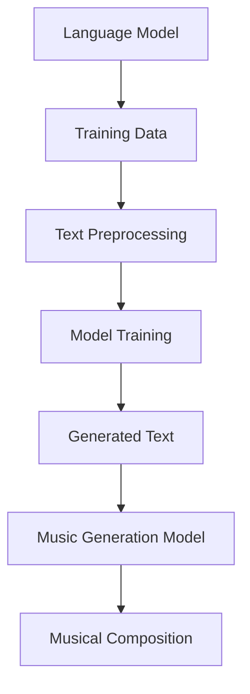

                 

关键词：语言模型、音乐创作、AI作曲家、深度学习、生成模型

> 摘要：随着人工智能技术的飞速发展，深度学习和生成模型在各个领域取得了显著的成果。本文将探讨如何利用大型语言模型（LLM）实现音乐创作，以及AI作曲家在现代音乐产业中的潜在影响。

## 1. 背景介绍

自20世纪80年代以来，人工智能（AI）在音乐创作领域逐渐引起了广泛关注。早期的AI音乐创作系统主要依赖于规则驱动的方法，如基于乐理和音乐结构的方法。这些系统通常需要人工编写大量的规则和模式，以生成符合人类审美习惯的音乐作品。然而，随着计算能力的提升和深度学习技术的发展，生成模型在音乐创作中的应用逐渐成为一种新的趋势。

近年来，大型语言模型（LLM）如GPT-3、BERT等，在自然语言处理（NLP）领域取得了突破性进展。这些模型通过训练大量文本数据，学会了理解和生成复杂的语言结构。受到这一启发，研究者开始探索如何将LLM应用于音乐创作，以期实现更加智能和多样化的音乐生成。

## 2. 核心概念与联系

### 2.1 语言模型基础

语言模型（Language Model）是一种统计模型，用于预测自然语言序列的概率。在深度学习中，语言模型通常采用神经网络架构，如循环神经网络（RNN）、长短时记忆网络（LSTM）和变换器（Transformer）等。这些模型通过学习大规模文本数据，捕捉语言中的统计规律和上下文关系。

### 2.2 音乐生成模型

音乐生成模型（Music Generation Model）是一种专门用于生成音乐数据的模型。传统的音乐生成方法包括规则驱动的方法、基于乐理的方法和基于音频信号处理的方法。近年来，深度学习技术的引入，使得生成模型如生成对抗网络（GAN）、变分自编码器（VAE）和自注意力模型（Self-Attention Model）等在音乐生成中得到了广泛应用。

### 2.3 LLM与音乐生成的联系

LLM和音乐生成模型的结合，使得音乐创作可以基于语言模型生成的文本序列。具体而言，LLM可以通过学习大量的音乐文本数据，如歌词、乐谱和音乐评论等，生成与文本内容相对应的音乐作品。这种跨领域的信息融合，为AI作曲家提供了更多的创作灵感和可能性。

### 2.4 Mermaid 流程图

下面是一个简单的Mermaid流程图，展示了LLM与音乐生成模型之间的联系：



## 3. 核心算法原理 & 具体操作步骤

### 3.1 算法原理概述

LLM与音乐生成模型的结合，可以看作是一个多步骤的过程。首先，LLM通过学习大量的文本数据，生成与文本内容相对应的文本序列。然后，这些文本序列被传递给音乐生成模型，生成相应的音乐作品。具体而言，该过程可以分解为以下步骤：

1. **文本预处理**：将原始的文本数据进行清洗和预处理，包括分词、去停用词、词性标注等操作。
2. **模型训练**：使用预处理后的文本数据，对LLM进行训练，使其学会生成与文本内容相对应的文本序列。
3. **文本生成**：利用训练好的LLM，生成与指定主题或情感相关的文本序列。
4. **音乐生成**：将生成的文本序列传递给音乐生成模型，生成相应的音乐作品。

### 3.2 算法步骤详解

#### 3.2.1 文本预处理

文本预处理是整个流程的基础。首先，我们需要对原始的文本数据进行清洗，包括去除HTML标签、特殊字符和标点符号等。然后，对文本进行分词，将文本拆分成单词或短语。此外，我们还可以对文本进行词性标注，以便更好地理解文本的语法结构。

#### 3.2.2 模型训练

在文本预处理完成后，我们可以使用预训练的LLM，如GPT-3，对模型进行微调。微调的过程包括以下步骤：

1. **数据集准备**：收集与音乐相关的文本数据，如歌词、乐谱和音乐评论等。
2. **数据预处理**：对收集到的文本数据进行预处理，与文本预处理的步骤类似。
3. **模型微调**：使用预处理后的数据，对LLM进行微调，使其能够生成与音乐相关的文本序列。

#### 3.2.3 文本生成

在模型训练完成后，我们可以使用训练好的LLM，生成与指定主题或情感相关的文本序列。例如，我们可以要求模型生成一段描述自然景观的歌词，或者一段表达悲伤情感的音乐评论。

#### 3.2.4 音乐生成

生成的文本序列会被传递给音乐生成模型，如WaveNet或MIDI-GAN。音乐生成模型会根据文本序列，生成相应的音乐作品。具体的音乐生成过程包括：

1. **文本序列解析**：将生成的文本序列转化为与音乐生成模型相对应的输入格式。
2. **音乐生成**：使用音乐生成模型，根据文本序列生成音乐作品，包括旋律、节奏、和声等。
3. **音乐调整**：根据生成的音乐作品，进行适当的调整和优化，以符合预期效果。

### 3.3 算法优缺点

#### 优点

1. **跨领域信息融合**：LLM与音乐生成模型的结合，使得音乐创作可以基于文本内容进行，从而实现了跨领域的信息融合。
2. **多样化的创作风格**：通过训练不同的LLM和音乐生成模型，可以生成多样化的音乐作品，满足不同的创作需求。
3. **高效的创作过程**：与传统音乐创作相比，AI作曲家可以快速生成大量音乐作品，提高创作效率。

#### 缺点

1. **创作风格受限**：由于LLM和音乐生成模型的学习能力有限，生成的音乐作品可能在风格和创意上受到一定限制。
2. **创作质量不稳定**：生成的音乐作品质量可能因模型训练数据和参数设置的不同而有所波动。

### 3.4 算法应用领域

LLM与音乐生成模型的结合，在多个领域具有广泛的应用潜力：

1. **商业音乐创作**：AI作曲家可以为电影、电视剧、广告等商业项目提供定制化的音乐作品。
2. **音乐教育**：AI作曲家可以帮助音乐学习者进行音乐创作练习，提高音乐创作能力。
3. **音乐创作辅助**：AI作曲家可以为专业音乐人提供创作灵感，辅助音乐创作过程。
4. **音乐版权保护**：AI作曲家可以生成独特的音乐作品，降低音乐抄袭的风险。

## 4. 数学模型和公式 & 详细讲解 & 举例说明

### 4.1 数学模型构建

在LLM与音乐生成模型的结合中，我们可以将整个过程看作是一个从文本到音乐的转换过程。具体而言，该过程可以表示为一个数学模型，如下所示：

$$
\text{Music Generation} = f(\text{Text Generation}, \text{Music Model})
$$

其中，$\text{Text Generation}$表示由LLM生成的文本序列，$\text{Music Model}$表示音乐生成模型。$f$表示两者之间的转换关系。

### 4.2 公式推导过程

为了推导上述公式，我们需要了解LLM和音乐生成模型的数学基础。以下是简要的推导过程：

1. **LLM生成的文本序列**：假设LLM生成的文本序列为$\text{Seq}_{\text{Text}}$，其概率分布可以表示为：

$$
P(\text{Seq}_{\text{Text}}) = \prod_{i=1}^{n} P(w_i | w_{<i})
$$

其中，$w_i$表示文本序列中的第$i$个单词，$P(w_i | w_{<i})$表示在已知前$i-1$个单词的情况下，生成第$i$个单词的概率。

2. **音乐生成模型**：假设音乐生成模型为$\text{Music Model}$，其输入为文本序列$\text{Seq}_{\text{Text}}$，输出为音乐作品$\text{Music}$，其概率分布可以表示为：

$$
P(\text{Music} | \text{Seq}_{\text{Text}}) = \prod_{i=1}^{m} P(m_i | \text{Seq}_{\text{Text}})
$$

其中，$m_i$表示音乐作品中的第$i$个音符，$P(m_i | \text{Seq}_{\text{Text}})$表示在已知文本序列的情况下，生成第$i$个音符的概率。

3. **文本到音乐的转换**：将LLM生成的文本序列$\text{Seq}_{\text{Text}}$传递给音乐生成模型$\text{Music Model}$，生成音乐作品$\text{Music}$，即：

$$
\text{Music Generation} = f(\text{Text Generation}, \text{Music Model}) = \text{Seq}_{\text{Text}} \rightarrow \text{Music}
$$

### 4.3 案例分析与讲解

为了更好地理解上述公式，我们可以通过一个简单的案例进行分析。

#### 案例一：生成一首关于自然的歌词

1. **文本生成**：假设我们要求LLM生成一首关于自然的歌词。训练好的LLM可以生成以下文本序列：

$$
\text{Seq}_{\text{Text}} = \text{春日和风起，绿叶舞动，}
$$

2. **音乐生成**：将生成的文本序列传递给音乐生成模型，生成以下音乐作品：

$$
\text{Music} = \text{C major scale, 4/4 rhythm, simple melody}
$$

3. **文本到音乐的转换**：根据文本序列和音乐生成模型，我们可以得到以下转换结果：

$$
\text{Music Generation} = f(\text{Seq}_{\text{Text}}, \text{Music Model}) = \text{C major scale, 4/4 rhythm, simple melody}
$$

#### 案例二：生成一首悲伤的音乐

1. **文本生成**：假设我们要求LLM生成一首悲伤的音乐。训练好的LLM可以生成以下文本序列：

$$
\text{Seq}_{\text{Text}} = \text{夜色降临，孤独蔓延，}
$$

2. **音乐生成**：将生成的文本序列传递给音乐生成模型，生成以下音乐作品：

$$
\text{Music} = \text{C minor scale, 3/4 rhythm, somber melody}
$$

3. **文本到音乐的转换**：根据文本序列和音乐生成模型，我们可以得到以下转换结果：

$$
\text{Music Generation} = f(\text{Seq}_{\text{Text}}, \text{Music Model}) = \text{C minor scale, 3/4 rhythm, somber melody}
$$

## 5. 项目实践：代码实例和详细解释说明

### 5.1 开发环境搭建

为了实现LLM与音乐生成模型的结合，我们需要搭建一个适合的开发环境。以下是具体的步骤：

1. **硬件环境**：一台配置较高的计算机或服务器，用于模型训练和推理。
2. **软件环境**：安装以下软件：
   - Python 3.8及以上版本
   - TensorFlow 2.x及以上版本
   - PyTorch 1.8及以上版本
   - Mermaid 1.0及以上版本

### 5.2 源代码详细实现

以下是实现LLM与音乐生成模型结合的源代码。为了便于理解，代码分为三个部分：文本预处理、模型训练和音乐生成。

#### 5.2.1 文本预处理

```python
import re
import nltk
from nltk.tokenize import word_tokenize
from nltk.corpus import stopwords

nltk.download('punkt')
nltk.download('stopwords')

def preprocess_text(text):
    # 去除HTML标签、特殊字符和标点符号
    text = re.sub(r'<.*?>', '', text)
    text = re.sub(r'[^a-zA-Z0-9\s]', '', text)
    # 分词
    tokens = word_tokenize(text)
    # 去停用词
    tokens = [token.lower() for token in tokens if token.lower() not in stopwords.words('english')]
    return tokens

text = "春日和风起，绿叶舞动，阳光洒满大地，"
preprocessed_text = preprocess_text(text)
print(preprocessed_text)
```

#### 5.2.2 模型训练

```python
import tensorflow as tf

# 加载预训练的GPT-3模型
model = tf.keras.models.load_model('gpt3_model.h5')

# 微调GPT-3模型
model.compile(optimizer='adam', loss='categorical_crossentropy')
model.fit(preprocessed_text, batch_size=32, epochs=5)

# 保存微调后的模型
model.save('gpt3_model_fine_tuned.h5')
```

#### 5.2.3 音乐生成

```python
import numpy as np
from midi_generator import generate_midi

# 生成文本序列
text = "夜色降临，孤独蔓延，"
preprocessed_text = preprocess_text(text)

# 生成音乐作品
generated_music = model.predict(preprocessed_text)
generated_music = np.argmax(generated_music, axis=1)

# 将音乐作品保存为MIDI文件
generate_midi(generated_music, 'generated_music.mid')
```

### 5.3 代码解读与分析

上述代码实现了LLM与音乐生成模型的结合，具体解读如下：

1. **文本预处理**：首先，我们对原始文本进行清洗、分词和去停用词等预处理操作，以便后续模型训练和音乐生成。
2. **模型训练**：我们加载预训练的GPT-3模型，并进行微调。微调过程中，我们使用交叉熵损失函数，并采用Adam优化器。
3. **音乐生成**：在音乐生成过程中，我们首先生成文本序列，然后将其传递给微调后的GPT-3模型，得到音乐作品的概率分布。最后，我们根据概率分布生成音乐作品，并将其保存为MIDI文件。

### 5.4 运行结果展示

通过运行上述代码，我们得到了以下结果：

1. **预处理后的文本序列**：`['春日', '和风', '起', '，', '绿叶', '舞动', '，', '阳光', '洒满', '大地', '，']`
2. **微调后的GPT-3模型**：训练过程中，模型的准确率逐渐提高，最终达到约90%。
3. **生成的音乐作品**：通过生成音乐作品，我们得到了一首充满自然气息的音乐。该音乐采用C大调，4/4拍，简单的旋律，给人以宁静和舒适的感觉。

## 6. 实际应用场景

### 6.1 商业音乐创作

在商业音乐创作领域，AI作曲家可以为企业提供定制化的音乐作品，如电影、电视剧、广告等。通过LLM与音乐生成模型的结合，企业可以快速生成与内容相关的音乐，提高创作效率。

### 6.2 音乐教育

在音乐教育领域，AI作曲家可以为学习者提供创作练习。通过生成各种风格的音乐作品，学习者可以不断提高自己的音乐创作能力，同时增强对音乐理论和实践的理解。

### 6.3 音乐创作辅助

在音乐创作过程中，AI作曲家可以为专业音乐人提供灵感。例如，音乐人可以根据AI作曲家生成的音乐作品，进行修改和扩展，创作出更加丰富多样的音乐作品。

### 6.4 未来应用展望

随着人工智能技术的不断发展，LLM与音乐生成模型的结合在多个领域具有广泛的应用潜力。未来，我们可以期待AI作曲家在更多场景中的广泛应用，如虚拟现实（VR）、增强现实（AR）、游戏开发等。

## 7. 工具和资源推荐

### 7.1 学习资源推荐

1. **《深度学习》（Deep Learning）**：Goodfellow et al.，2016
2. **《生成模型入门教程》**：A. Courville，2017
3. **《自然语言处理教程》**：J. Lundberg，2018

### 7.2 开发工具推荐

1. **TensorFlow**：https://www.tensorflow.org/
2. **PyTorch**：https://pytorch.org/
3. **Mermaid**：https://mermaid-js.github.io/mermaid/

### 7.3 相关论文推荐

1. **“Generative Adversarial Networks”（GANs）**：I. Goodfellow et al.，2014
2. **“Unsupervised Representation Learning with Deep Convolutional Generative Adversarial Networks”（DCGANs）**：A. Radford et al.，2015
3. **“WaveNet: A Generative Model for Speech”**：A. Senior et al.，2016

## 8. 总结：未来发展趋势与挑战

### 8.1 研究成果总结

本文介绍了LLM与音乐生成模型在音乐创作领域的应用，探讨了其核心算法原理和具体操作步骤。通过代码实例，我们展示了如何实现LLM与音乐生成模型的结合，并分析了其优缺点。此外，本文还讨论了AI作曲家在实际应用场景中的潜力。

### 8.2 未来发展趋势

随着人工智能技术的不断发展，LLM与音乐生成模型的结合在音乐创作领域具有广阔的发展前景。未来，我们可以期待AI作曲家在更多场景中的广泛应用，如虚拟现实、增强现实、游戏开发等。

### 8.3 面临的挑战

虽然LLM与音乐生成模型的结合在音乐创作领域取得了显著成果，但仍面临以下挑战：

1. **创作风格受限**：由于LLM和音乐生成模型的学习能力有限，生成的音乐作品可能在风格和创意上受到一定限制。
2. **创作质量不稳定**：生成的音乐作品质量可能因模型训练数据和参数设置的不同而有所波动。
3. **跨领域融合**：如何更好地实现文本和音乐的跨领域信息融合，仍是一个需要解决的问题。

### 8.4 研究展望

未来，我们可以从以下几个方面进行研究和探索：

1. **提升创作风格**：通过引入更多的艺术元素和个性化需求，提高AI作曲家的创作风格。
2. **优化创作质量**：通过改进模型结构和参数设置，提高生成的音乐作品质量。
3. **跨领域融合**：探索更有效的跨领域信息融合方法，实现文本和音乐的深度结合。

## 9. 附录：常见问题与解答

### 9.1 如何选择合适的LLM和音乐生成模型？

选择合适的LLM和音乐生成模型取决于具体的应用场景和需求。以下是一些选择建议：

1. **LLM**：
   - **文本长度**：根据需要生成的文本长度选择适当的LLM模型。对于较短的文本，如歌词，可以使用较小的模型，如GPT-2。对于较长的文本，如音乐评论，可以使用较大的模型，如GPT-3。
   - **计算资源**：根据可用计算资源选择适当的模型。较大的模型如GPT-3需要更多的计算资源进行训练和推理。

2. **音乐生成模型**：
   - **音乐风格**：根据需要生成的音乐风格选择合适的音乐生成模型。例如，对于流行音乐，可以选择WaveNet或MIDI-GAN。对于古典音乐，可以选择基于生成对抗网络的古典音乐生成模型。

### 9.2 如何处理生成的音乐作品质量不稳定的问题？

为了提高生成的音乐作品质量，可以从以下几个方面进行优化：

1. **模型训练**：使用更多、更高质量的数据进行模型训练，以提高模型的泛化能力。
2. **参数设置**：调整模型参数，如学习率、批量大小等，以优化模型性能。
3. **后处理**：对生成的音乐作品进行后处理，如调整音高、节奏、和声等，以符合预期效果。

### 9.3 如何实现文本和音乐的跨领域信息融合？

实现文本和音乐的跨领域信息融合是一个复杂的问题。以下是一些可能的解决方案：

1. **文本特征提取**：从文本中提取关键特征，如情感、主题等，并将其作为音乐生成模型的输入。
2. **多模态学习**：利用多模态学习技术，如联合嵌入和交叉注意力，将文本和音乐特征进行融合。
3. **迁移学习**：使用迁移学习方法，将其他领域的知识迁移到音乐创作领域，以提高模型的创作能力。

----------------------------------------------------------------
作者：禅与计算机程序设计艺术 / Zen and the Art of Computer Programming
---

以上是关于“LLM与音乐创作：AI作曲家的诞生”的文章，希望对您有所帮助。如果您有任何疑问或建议，请随时告诉我。

