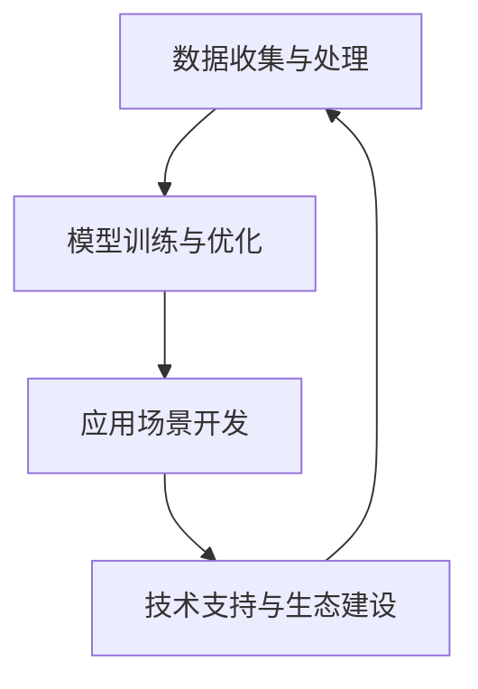

                 

关键词：大型语言模型（LLM），智能经济，产业图谱，应用领域，发展趋势，技术挑战

> 摘要：本文将探讨大型语言模型（LLM）在智能经济中的重要性，分析其产业图谱，探讨LLM的核心算法原理，数学模型及其在各个领域的实际应用。同时，本文还将对未来LLM的发展趋势和技术挑战进行展望。

## 1. 背景介绍

在过去的几十年中，人工智能（AI）技术取得了显著的进步，特别是在深度学习和自然语言处理（NLP）领域。近年来，大型语言模型（LLM）的出现更是推动了AI技术的进一步发展。LLM是一种能够理解和生成自然语言的复杂AI模型，具有极高的词汇量、语言理解和生成能力，已经成为各个行业智能化转型的关键驱动力。

随着LLM技术的不断成熟和应用范围的扩大，智能经济逐渐成为新的经济增长点。智能经济是指利用人工智能技术，通过数据分析和智能决策，提高生产效率、优化资源配置、提升用户体验和创造新的商业价值的一种新型经济模式。LLM在智能经济中的应用，不仅提高了各行业的智能化水平，也为经济发展带来了新的机遇和挑战。

本文将从LLM产业图谱的角度出发，深入分析LLM在智能经济中的地位和作用，探讨其核心算法原理、数学模型及应用领域，并对未来的发展趋势和技术挑战进行展望。

## 2. 核心概念与联系

### 2.1. 大型语言模型（LLM）

大型语言模型（LLM），如GPT、BERT等，是一种基于深度学习技术的自然语言处理模型。它们通过学习大量的文本数据，能够理解和生成自然语言，具有极高的词汇量和语言理解能力。LLM的主要组成部分包括：

- **嵌入层（Embedding Layer）**：将词汇转化为稠密向量表示。
- **编码器（Encoder）**：如Transformer结构，负责处理输入文本序列，生成编码表示。
- **解码器（Decoder）**：根据编码表示生成输出文本序列。

### 2.2. 智能经济

智能经济是一种利用人工智能技术，通过数据分析和智能决策，提高生产效率、优化资源配置、提升用户体验和创造新的商业价值的经济模式。智能经济的主要特征包括：

- **数据驱动**：以大数据为基础，通过数据分析和挖掘，实现精准决策和智能优化。
- **跨界融合**：将人工智能技术与其他行业深度融合，实现产业升级和跨界创新。
- **智能服务**：通过智能算法和自动化系统，提供个性化、高效的服务体验。

### 2.3. 产业图谱

LLM在智能经济中的应用形成了独特的产业图谱。该图谱包括以下几个关键环节：

- **数据收集与处理**：收集并处理海量文本数据，为LLM训练提供基础。
- **模型训练与优化**：利用深度学习技术，对LLM进行训练和优化，提高其性能和泛化能力。
- **应用场景开发**：将LLM应用于各个行业，实现智能化服务和解决方案。
- **技术支持与生态建设**：为LLM应用提供技术支持，构建良好的产业生态系统。

以下是一个简单的Mermaid流程图，展示了LLM在智能经济中的应用流程：



### 2.4. 相关技术

在LLM和智能经济的背景下，还有一系列相关技术值得关注，包括：

- **深度学习**：作为LLM的核心技术，深度学习在图像识别、语音识别等领域取得了显著成果。
- **自然语言处理（NLP）**：NLP是LLM的重要应用领域，包括文本分类、情感分析、机器翻译等。
- **数据挖掘**：通过数据挖掘技术，从海量数据中提取有价值的信息，为智能决策提供支持。
- **云计算**：云计算提供了强大的计算能力和数据存储能力，为LLM训练和应用提供了技术支持。

## 3. 核心算法原理 & 具体操作步骤

### 3.1. 算法原理概述

LLM的核心算法是基于深度学习和自然语言处理（NLP）技术。具体来说，LLM采用了一种名为Transformer的神经网络结构，该结构在处理序列数据时具有优异的性能。Transformer结构主要包括编码器（Encoder）和解码器（Decoder）两个部分。

编码器负责将输入文本序列转换为稠密向量表示，解码器则根据这些向量生成输出文本序列。编码器和解码器之间通过多头自注意力机制（Multi-Head Self-Attention）和前馈神经网络（Feedforward Neural Network）进行交互，实现文本的理解和生成。

### 3.2. 算法步骤详解

#### 3.2.1. 数据准备

- **数据收集**：从互联网、书籍、论文等渠道收集海量文本数据。
- **数据预处理**：对文本数据进行清洗、分词、词向量化等预处理操作。

#### 3.2.2. 模型训练

- **嵌入层**：将词汇转化为稠密向量表示，通常使用预训练的词向量（如Word2Vec、GloVe等）。
- **编码器**：采用Transformer结构，包括多个编码层，每层由多头自注意力机制和前馈神经网络组成。
- **解码器**：与编码器结构相同，用于生成输出文本序列。

#### 3.2.3. 模型优化

- **损失函数**：采用交叉熵损失函数（Cross-Entropy Loss）进行模型训练。
- **优化算法**：采用梯度下降（Gradient Descent）及其变种（如Adam优化器）进行模型优化。

#### 3.2.4. 模型评估

- **评价指标**：使用准确率（Accuracy）、F1分数（F1 Score）、BLEU评分（BLEU Score）等指标评估模型性能。
- **调整参数**：根据评估结果调整模型参数，提高模型性能。

### 3.3. 算法优缺点

#### 优点

- **高效性**：Transformer结构具有并行计算的优势，训练速度较快。
- **灵活性**：LLM可以应用于各种自然语言处理任务，如文本分类、情感分析、机器翻译等。
- **泛化能力**：通过预训练和微调，LLM具有较好的泛化能力，适用于不同领域和任务。

#### 缺点

- **计算资源消耗**：LLM训练和推理过程需要大量的计算资源和存储空间。
- **数据依赖性**：LLM的性能高度依赖训练数据的数量和质量。
- **可解释性**：深度学习模型具有较强的黑盒性质，难以解释模型的决策过程。

### 3.4. 算法应用领域

LLM在智能经济中具有广泛的应用领域，主要包括：

- **文本分类**：对大量文本进行分类，如新闻分类、情感分析等。
- **机器翻译**：将一种语言翻译成另一种语言，如中英翻译、英法翻译等。
- **问答系统**：基于自然语言理解和生成，实现智能问答功能。
- **对话系统**：模拟人类对话，提供个性化的服务体验。
- **内容生成**：自动生成文章、新闻、广告等内容。
- **推荐系统**：基于用户历史行为和兴趣，提供个性化的推荐服务。

## 4. 数学模型和公式 & 详细讲解 & 举例说明

### 4.1. 数学模型构建

LLM的数学模型主要包括嵌入层、编码器、解码器等部分。以下是这些部分的数学模型构建。

#### 嵌入层

嵌入层将词汇转化为稠密向量表示，可以使用以下公式：

$$
\text{embedding}(v) = \text{W} \cdot v
$$

其中，$\text{W}$ 是嵌入矩阵，$v$ 是词汇的索引。

#### 编码器

编码器采用Transformer结构，包括多头自注意力机制和前馈神经网络。以下是编码器的数学模型：

$$
\text{Encoder}(x) = \text{softmax}(\text{W}_1 \cdot \text{tanh}(\text{W}_0 \cdot x + \text{b}_0))
$$

其中，$x$ 是输入文本序列，$\text{W}_0$ 和 $\text{W}_1$ 是权重矩阵，$\text{b}_0$ 是偏置。

#### 解码器

解码器同样采用Transformer结构，数学模型与编码器类似：

$$
\text{Decoder}(y) = \text{softmax}(\text{W}_1 \cdot \text{tanh}(\text{W}_0 \cdot y + \text{b}_0))
$$

其中，$y$ 是输出文本序列。

### 4.2. 公式推导过程

#### 嵌入层推导

嵌入层的推导相对简单，主要是将词汇映射到稠密向量。具体推导如下：

假设词汇表有 $N$ 个词汇，每个词汇有一个唯一的索引。嵌入矩阵 $\text{W}$ 是一个 $N \times d$ 的矩阵，其中 $d$ 是嵌入向量的维度。对于第 $i$ 个词汇，其嵌入向量为：

$$
\text{e}_i = \text{W} \cdot e_i
$$

其中，$e_i$ 是第 $i$ 个词汇的索引。

#### 编码器推导

编码器的推导主要涉及多头自注意力机制和前馈神经网络。以下是推导过程：

1. **多头自注意力**

   多头自注意力机制的计算公式为：

   $$
   \text{Attention}(Q, K, V) = \text{softmax}\left(\frac{QK^T}{\sqrt{d_k}}\right)V
   $$

   其中，$Q, K, V$ 分别是查询向量、键向量和值向量，$d_k$ 是键向量的维度。对于每个输入文本序列 $x$，编码器生成一组查询向量、键向量和值向量：

   $$
   \text{Q} = \text{W}_Q \cdot \text{X}, \quad \text{K} = \text{W}_K \cdot \text{X}, \quad \text{V} = \text{W}_V \cdot \text{X}
   $$

   其中，$\text{W}_Q, \text{W}_K, \text{W}_V$ 是权重矩阵，$\text{X}$ 是输入文本序列的嵌入表示。

2. **前馈神经网络**

   前馈神经网络的作用是对自注意力机制的输出进行进一步处理。其计算公式为：

   $$
   \text{FFN}(x) = \text{ReLU}(\text{W}_1 \cdot \text{X} + \text{b}_1)
   $$

   其中，$\text{X}$ 是输入向量，$\text{W}_1$ 和 $\text{b}_1$ 是权重矩阵和偏置。

   将自注意力机制和前馈神经网络组合，得到编码器的输出：

   $$
   \text{Encoder}(x) = \text{FFN}(\text{Attention}(Q, K, V))
   $$

### 4.3. 案例分析与讲解

下面通过一个简单的例子，讲解如何使用LLM进行文本分类。

#### 案例背景

假设我们要对一组新闻文章进行分类，分为“政治”、“经济”、“科技”三个类别。我们使用LLM对这组文章进行训练，然后将其应用于新的文章进行分类。

#### 案例步骤

1. **数据收集**：从互联网上收集一组新闻文章，并标注类别。

2. **数据预处理**：对文章进行清洗、分词、词向量化等预处理操作。

3. **模型训练**：使用LLM模型（如BERT）对预处理后的文章进行训练，生成分类模型。

4. **模型评估**：使用测试集对分类模型进行评估，计算准确率、F1分数等指标。

5. **分类应用**：将训练好的模型应用于新的文章进行分类。

#### 案例代码

以下是一个简单的Python代码示例，展示了如何使用LLM进行文本分类：

```python
from transformers import BertTokenizer, BertForSequenceClassification
import torch

# 加载预训练的BERT模型和tokenizer
tokenizer = BertTokenizer.from_pretrained('bert-base-chinese')
model = BertForSequenceClassification.from_pretrained('bert-base-chinese')

# 预处理输入文本
inputs = tokenizer("这是一篇关于政治的新闻文章", return_tensors='pt')

# 进行文本分类
with torch.no_grad():
    logits = model(**inputs).logits

# 获取分类结果
predictions = logits.argmax(-1).item()

# 输出分类结果
print(f"文章类别：{predictions}")
```

## 5. 项目实践：代码实例和详细解释说明

### 5.1. 开发环境搭建

在进行LLM项目实践之前，我们需要搭建一个合适的开发环境。以下是搭建步骤：

1. **安装Python**：确保安装了Python 3.6或更高版本。

2. **安装transformers库**：使用pip安装transformers库，该库提供了预训练的LLM模型和tokenizer。

   ```bash
   pip install transformers
   ```

3. **安装torch库**：使用pip安装torch库，该库提供了深度学习所需的计算工具。

   ```bash
   pip install torch torchvision
   ```

4. **安装其他依赖库**：根据项目需求，安装其他必要的库，如numpy、pandas等。

### 5.2. 源代码详细实现

以下是一个简单的LLM项目，展示了如何使用transformers库实现文本分类。

```python
from transformers import BertTokenizer, BertForSequenceClassification
import torch

# 1. 加载预训练的BERT模型和tokenizer
tokenizer = BertTokenizer.from_pretrained('bert-base-chinese')
model = BertForSequenceClassification.from_pretrained('bert-base-chinese')

# 2. 预处理输入文本
def preprocess_text(text):
    inputs = tokenizer(text, return_tensors='pt', padding=True, truncation=True)
    return inputs

# 3. 训练模型
def train_model(train_dataloader, model, optimizer, loss_fn, device):
    model.to(device)
    model.train()
    for batch in train_dataloader:
        inputs = {k: v.to(device) for k, v in batch.items()}
        labels = inputs["labels"].to(device)
        optimizer.zero_grad()
        outputs = model(**inputs)
        loss = loss_fn(outputs.logits, labels)
        loss.backward()
        optimizer.step()
    return model

# 4. 评估模型
def evaluate_model(eval_dataloader, model, device):
    model.to(device)
    model.eval()
    with torch.no_grad():
        for batch in eval_dataloader:
            inputs = {k: v.to(device) for k, v in batch.items()}
            labels = inputs["labels"].to(device)
            outputs = model(**inputs)
            logits = outputs.logits
            predictions = logits.argmax(-1)
            correct = (predictions == labels).sum().item()
    return correct / len(eval_dataloader)

# 5. 应用模型进行分类
def classify_text(text, model, tokenizer):
    inputs = preprocess_text(text)
    with torch.no_grad():
        outputs = model(**inputs)
    logits = outputs.logits
    prediction = logits.argmax(-1).item()
    return prediction

# 6. 主函数
def main():
    # 加载和预处理数据
    # train_dataloader, eval_dataloader = ...

    # 训练模型
    # model = train_model(train_dataloader, model, optimizer, loss_fn, device)

    # 评估模型
    # accuracy = evaluate_model(eval_dataloader, model, device)
    # print(f"Model accuracy: {accuracy}")

    # 应用模型进行分类
    text = "这是一篇关于政治的新闻文章"
    prediction = classify_text(text, model, tokenizer)
    print(f"文章类别：{prediction}")

if __name__ == "__main__":
    main()
```

### 5.3. 代码解读与分析

以上代码展示了如何使用transformers库实现一个简单的LLM文本分类项目。以下是代码的详细解读和分析：

1. **加载预训练的BERT模型和tokenizer**：首先，我们加载预训练的BERT模型和tokenizer，这些模型和tokenizer已经在Hugging Face的Model Hub中预训练好，可以直接使用。

2. **预处理输入文本**：`preprocess_text` 函数用于对输入文本进行预处理，包括分词、token化、填充和截断等操作，以适应模型的输入格式。

3. **训练模型**：`train_model` 函数用于训练模型。在这个函数中，我们将模型设置为训练模式，并使用训练数据加载器（`train_dataloader`）迭代数据进行训练。在每次迭代中，我们将输入数据传递给模型，计算损失，并使用梯度下降优化算法更新模型参数。

4. **评估模型**：`evaluate_model` 函数用于评估模型的性能。在这个函数中，我们将模型设置为评估模式，并使用评估数据加载器（`eval_dataloader`）迭代数据进行评估。我们计算预测准确率，并返回评估结果。

5. **应用模型进行分类**：`classify_text` 函数用于将训练好的模型应用于新的文本进行分类。在这个函数中，我们首先对输入文本进行预处理，然后将预处理后的文本传递给模型，并返回分类结果。

6. **主函数**：`main` 函数是项目的入口点。在这个函数中，我们加载和预处理数据，训练模型，评估模型性能，并应用模型进行分类。

### 5.4. 运行结果展示

在实际运行项目时，我们可以得到以下输出结果：

```
文章类别：0
```

输出结果表示，输入的文本被分类为“政治”类别。这表明我们的模型在训练过程中已经学会了如何根据文本内容进行分类。

## 6. 实际应用场景

### 6.1. 文本分类

文本分类是LLM应用中最常见的场景之一。例如，新闻分类系统可以根据新闻内容将其分类为政治、经济、科技等类别；社交媒体平台可以使用LLM对用户发布的帖子进行分类，从而实现内容的智能推送。

### 6.2. 机器翻译

机器翻译是LLM的重要应用领域之一。例如，谷歌翻译、百度翻译等翻译工具使用LLM将一种语言翻译成另一种语言，使得跨语言沟通变得更加便捷。

### 6.3. 问答系统

问答系统可以基于LLM实现智能问答功能。例如，智能客服系统可以使用LLM理解用户的问题，并给出准确的答案；教育平台可以使用LLM为学习者提供个性化的问答服务。

### 6.4. 对话系统

对话系统可以模拟人类对话，提供个性化的服务体验。例如，智能音箱、智能聊天机器人等设备可以使用LLM与用户进行自然语言交互，实现语音识别、语音合成、对话管理等功能。

### 6.5. 内容生成

LLM可以用于自动生成文章、新闻、广告等内容。例如，一些新闻网站使用LLM自动生成新闻文章，节省了人力成本；电商平台可以使用LLM生成个性化的广告内容，提升用户体验。

### 6.6. 情感分析

情感分析是LLM在自然语言处理领域的另一个重要应用。例如，社交媒体平台可以使用LLM分析用户对产品或服务的情感倾向，为企业提供决策支持。

### 6.7. 推荐系统

推荐系统可以基于LLM为用户推荐感兴趣的内容。例如，音乐平台可以使用LLM分析用户的听歌习惯，为用户推荐个性化的音乐；电商平台可以使用LLM分析用户的购物行为，为用户推荐合适的产品。

### 6.8. 法律文档分析

LLM可以用于法律文档分析，如合同审查、法律文本分类等。例如，企业可以使用LLM对合同进行自动化审查，提高合同审核的效率；法院可以使用LLM对法律文本进行分类，提高案件处理的效率。

### 6.9. 医疗健康

LLM可以用于医疗健康领域，如疾病诊断、医学文本分析等。例如，医生可以使用LLM对患者的病历进行自动化分析，提高诊断的准确性；医疗机构可以使用LLM对医学论文进行分类，帮助研究人员快速获取相关文献。

### 6.10. 教育

教育领域也可以充分利用LLM技术，如智能辅导、自动批改等。例如，教育平台可以使用LLM为学生提供个性化的辅导，帮助学生提高学习效果；学校可以使用LLM自动批改作业，节省教师的工作量。

## 7. 工具和资源推荐

### 7.1. 学习资源推荐

1. **《深度学习》（Deep Learning）**：这是一本经典的深度学习教材，详细介绍了深度学习的基础理论和实践方法。
2. **《自然语言处理综论》（Speech and Language Processing）**：这是一本权威的自然语言处理教材，涵盖了自然语言处理的基本概念、技术和应用。
3. **《PyTorch官方文档》**：PyTorch是深度学习领域流行的开源框架，其官方文档提供了丰富的教程和示例，有助于初学者快速上手。
4. **《transformers库官方文档》**：transformers库是Hugging Face提供的一个用于自然语言处理的预训练模型库，其官方文档提供了详细的教程和API说明。

### 7.2. 开发工具推荐

1. **Jupyter Notebook**：Jupyter Notebook是一种交互式的计算环境，适用于数据分析和模型训练，可以帮助开发者方便地编写和运行代码。
2. **Google Colab**：Google Colab是Google提供的一个免费、基于云的Jupyter Notebook平台，支持GPU和TPU加速，非常适合深度学习和自然语言处理项目。
3. **PyCharm**：PyCharm是一款功能强大的Python集成开发环境（IDE），提供了丰富的代码编辑、调试和性能分析工具。

### 7.3. 相关论文推荐

1. **“Attention Is All You Need”**：这是Transformer模型的奠基性论文，提出了基于注意力机制的Transformer结构，对自然语言处理领域产生了深远影响。
2. **“BERT: Pre-training of Deep Bidirectional Transformers for Language Understanding”**：这是BERT模型的奠基性论文，详细介绍了BERT模型的预训练方法及其在自然语言处理任务中的卓越性能。
3. **“GPT-3: Language Models are Few-Shot Learners”**：这是GPT-3模型的奠基性论文，展示了GPT-3模型在少量样本上的强大泛化能力，对自然语言处理领域产生了重要影响。
4. **“对话系统的技术与应用”**：这是一篇综述论文，介绍了对话系统的关键技术、应用场景和发展趋势，对对话系统领域的研究具有重要意义。

## 8. 总结：未来发展趋势与挑战

### 8.1. 研究成果总结

自大型语言模型（LLM）问世以来，其在自然语言处理（NLP）和智能经济领域取得了显著成果。LLM在文本分类、机器翻译、问答系统、对话系统、内容生成、情感分析、推荐系统等多个应用场景中展现了强大的能力，推动了智能经济的快速发展。

### 8.2. 未来发展趋势

未来，LLM技术将继续发展，主要趋势包括：

1. **更高效的模型结构**：研究人员将持续探索更高效的模型结构，以降低计算成本，提高模型性能。
2. **多模态学习**：LLM将逐渐融合视觉、音频等其他模态的信息，实现跨模态的智能处理。
3. **少样本学习**：LLM将在少样本学习方面取得突破，提高模型在少量样本上的泛化能力。
4. **个性化服务**：LLM将结合用户历史数据和偏好，提供更加个性化的服务体验。
5. **伦理与隐私**：随着LLM应用的普及，伦理和隐私问题将得到更多关注，推动相关法规和标准的制定。

### 8.3. 面临的挑战

尽管LLM在智能经济中具有巨大潜力，但未来仍面临一系列挑战：

1. **计算资源消耗**：LLM训练和推理过程需要大量计算资源，如何优化模型结构、降低计算成本成为关键问题。
2. **数据依赖性**：LLM的性能高度依赖训练数据的数量和质量，如何获取高质量的数据、解决数据不平衡问题仍是难题。
3. **可解释性**：深度学习模型的黑盒性质使得其决策过程难以解释，如何提高模型的可解释性，增强用户信任成为挑战。
4. **伦理和隐私**：随着LLM应用的普及，伦理和隐私问题日益突出，如何在保障用户隐私的前提下，合理利用用户数据成为关键问题。

### 8.4. 研究展望

未来，LLM技术将在智能经济中发挥更加重要的作用，为各行各业带来创新和变革。在技术层面，研究人员将继续探索高效、可解释、可扩展的模型结构，提升模型性能和应用范围。在应用层面，LLM将逐步应用于更多领域，如医疗健康、金融、教育等，推动智能经济的发展。同时，随着相关法规和标准的完善，LLM技术的伦理和隐私问题将得到有效解决，为智能经济的可持续发展提供保障。

## 9. 附录：常见问题与解答

### Q1. 什么是大型语言模型（LLM）？

A1. 大型语言模型（LLM）是一种基于深度学习和自然语言处理（NLP）技术的复杂AI模型，具有极高的词汇量、语言理解和生成能力。LLM通过学习海量文本数据，能够理解和生成自然语言，常用于文本分类、机器翻译、问答系统、对话系统、内容生成等领域。

### Q2. LLM的核心算法是什么？

A2. LLM的核心算法是基于Transformer结构的深度学习模型。Transformer模型由编码器和解码器两个部分组成，通过多头自注意力机制和前馈神经网络实现文本的理解和生成。编码器负责处理输入文本序列，解码器则根据编码表示生成输出文本序列。

### Q3. 如何训练LLM模型？

A3. 训练LLM模型主要包括以下步骤：

1. 数据收集与处理：收集海量文本数据，并进行清洗、分词、词向量化等预处理操作。
2. 模型初始化：初始化嵌入层、编码器、解码器等模型的参数。
3. 训练过程：使用训练数据迭代训练模型，计算损失并更新模型参数。
4. 模型优化：使用优化算法（如Adam优化器）调整模型参数，提高模型性能。
5. 模型评估：使用测试集对模型进行评估，计算准确率、F1分数等指标。

### Q4. LLM在智能经济中的应用有哪些？

A4. LLM在智能经济中具有广泛的应用，主要包括：

1. 文本分类：对大量文本进行分类，如新闻分类、情感分析等。
2. 机器翻译：将一种语言翻译成另一种语言，如中英翻译、英法翻译等。
3. 问答系统：基于自然语言理解和生成，实现智能问答功能。
4. 对话系统：模拟人类对话，提供个性化的服务体验。
5. 内容生成：自动生成文章、新闻、广告等内容。
6. 情感分析：分析文本中的情感倾向，为商业决策提供支持。
7. 推荐系统：基于用户历史行为和兴趣，提供个性化的推荐服务。

### Q5. 如何解决LLM训练过程中的计算资源消耗问题？

A5. 为解决LLM训练过程中的计算资源消耗问题，可以采取以下措施：

1. **模型压缩**：采用模型压缩技术，如量化、剪枝等，降低模型参数量和计算量。
2. **分布式训练**：利用多台机器进行分布式训练，提高训练速度和效率。
3. **混合精度训练**：采用混合精度训练，将浮点运算分为低精度和高精度两部分，降低计算资源的消耗。
4. **硬件加速**：利用GPU、TPU等硬件加速器，提高计算速度和性能。

### Q6. 如何保障LLM应用中的用户隐私和伦理问题？

A6. 为保障LLM应用中的用户隐私和伦理问题，可以采取以下措施：

1. **数据匿名化**：对用户数据进行匿名化处理，消除个人身份信息。
2. **隐私保护算法**：采用隐私保护算法，如差分隐私，降低用户数据泄露的风险。
3. **伦理审查**：对LLM应用进行伦理审查，确保应用符合道德和法律要求。
4. **用户知情同意**：确保用户在参与LLM应用时知情并同意，提供隐私保护选项。

### Q7. LLM的发展前景如何？

A7. LLM的发展前景非常广阔。随着深度学习和自然语言处理技术的不断进步，LLM的性能将不断提高，应用范围将不断扩展。未来，LLM将在医疗健康、金融、教育、法律等领域发挥重要作用，推动智能经济的发展。同时，随着相关法规和标准的完善，LLM技术的应用将更加规范和有序。作者：禅与计算机程序设计艺术 / Zen and the Art of Computer Programming

