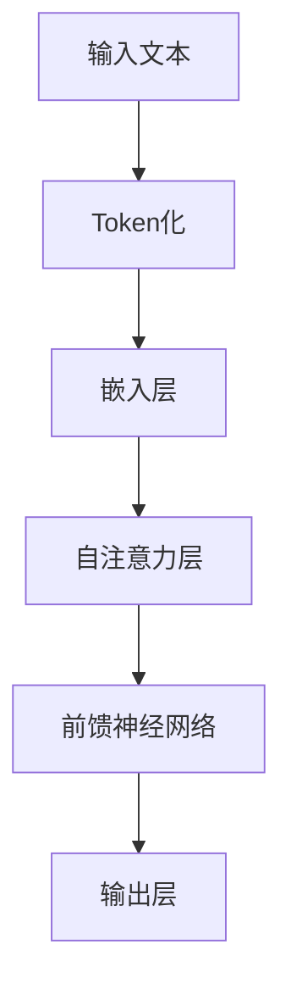

                 

关键词：大型语言模型（LLM）、人工智能、产业链、价值重塑、技术进步、应用场景、未来展望。

> 摘要：本文将深入探讨大型语言模型（LLM）在人工智能产业链中的作用，以及它们如何重塑人工智能的价值。我们将从背景介绍开始，逐步分析LLM的核心概念、算法原理、数学模型、实际应用场景，并对未来的发展趋势和挑战进行展望。

## 1. 背景介绍

随着互联网和大数据技术的飞速发展，人工智能（AI）已经成为全球科技创新的重要驱动力。在众多AI技术中，自然语言处理（NLP）因其广泛的应用前景和巨大的商业价值而备受关注。近年来，以深度学习为基础的大型语言模型（LLM）如BERT、GPT系列等取得了显著的成果，使得AI在文本生成、翻译、问答等任务上的表现日益出色。

LLM的出现不仅标志着自然语言处理技术的新高度，更是整个AI产业链的一次重要变革。它不仅提升了AI系统的智能水平，还为各行业带来了前所未有的创新机会。因此，了解LLM的产业链及其价值重塑过程，对于推动人工智能技术的发展和应用具有重要意义。

## 2. 核心概念与联系

在深入探讨LLM之前，我们需要明确几个核心概念，包括自然语言处理、深度学习、神经网络等。以下是一个简化的Mermaid流程图，展示了这些概念之间的联系：

```mermaid
graph TD
A[自然语言处理] --> B[深度学习]
B --> C[神经网络]
C --> D[大型语言模型(LLM)]
```

### 自然语言处理（NLP）

自然语言处理是人工智能的一个重要分支，旨在使计算机能够理解和生成人类语言。NLP涉及语音识别、文本分类、情感分析、机器翻译等多种技术。

### 深度学习

深度学习是一种基于神经网络的学习方法，通过多层神经网络对大量数据进行分析和特征提取，从而实现复杂的模式识别任务。

### 神经网络

神经网络是模仿人脑结构和功能的一种计算模型，由大量简单神经元连接而成。通过不断调整神经元之间的权重，神经网络可以学习和预测数据。

### 大型语言模型（LLM）

LLM是结合了深度学习和自然语言处理技术的大型神经网络模型，能够在大量文本数据上训练，从而实现高水平的自然语言理解和生成能力。

## 3. 核心算法原理 & 具体操作步骤

### 3.1 算法原理概述

LLM的核心算法通常是基于Transformer架构。Transformer架构引入了自注意力机制（Self-Attention），使得模型能够关注输入序列中的不同部分，从而提高上下文信息的利用效率。以下是一个简化的Transformer架构流程：



### 3.2 算法步骤详解

1. **Token化**：将输入文本分解为单词或字符等基本单位（Token）。

2. **嵌入层**：将Token映射为向量表示。

3. **自注意力层**：计算Token之间的相似度，并加权求和，从而关注重要信息。

4. **前馈神经网络**：对自注意力层的输出进行非线性变换。

5. **输出层**：生成文本序列的预测结果。

### 3.3 算法优缺点

**优点**：
- **强大的上下文理解能力**：通过自注意力机制，LLM能够关注输入文本的各个部分，从而提高上下文信息的利用效率。
- **灵活的扩展性**：Transformer架构具有良好的扩展性，可以轻松添加更多层和神经元。

**缺点**：
- **计算资源需求高**：训练和推理过程需要大量的计算资源。
- **数据依赖性强**：LLM的性能依赖于大量的高质量训练数据。

### 3.4 算法应用领域

LLM在自然语言处理领域具有广泛的应用，包括文本生成、翻译、问答系统、对话系统等。例如，GPT系列模型在文本生成和问答系统中取得了显著成果，BERT模型在机器翻译和情感分析方面表现优秀。

## 4. 数学模型和公式 & 详细讲解 & 举例说明

### 4.1 数学模型构建

LLM的数学模型主要包括两部分：嵌入层和注意力机制。以下是关键公式的简要介绍：

$$
\text{嵌入层}: \text{ embed } \text{Token} \rightarrow \text{Embedding Vector}
$$

$$
\text{自注意力}: \text{ Attention } \text{Query, Key, Value} \rightarrow \text{Weighted Sum of Values}
$$

### 4.2 公式推导过程

为了推导自注意力机制的计算过程，我们需要从以下几个基本概念出发：

- **Query, Key, Value**：分别表示查询、键和值。在Transformer架构中，Query、Key和Value都是由嵌入层生成的向量。
- **注意力权重**：表示Query和Key之间的相似度，通常通过点积计算。

以下是自注意力机制的推导过程：

$$
\text{Attention Score} = \text{ Query} \cdot \text{ Key}
$$

$$
\text{Attention Weight} = \text{softmax}(\text{Attention Score})
$$

$$
\text{Weighted Value} = \text{ Value} \cdot \text{Attention Weight}
$$

$$
\text{Output} = \sum_{i} \text{Weighted Value}_{i}
$$

### 4.3 案例分析与讲解

假设我们有一个简单的文本序列：“我想要一杯咖啡”。为了应用LLM，我们需要对其进行Token化，并生成嵌入向量。以下是具体的操作步骤：

1. **Token化**：将文本序列分解为单词和标点符号，得到Token列表：["我"，"想要"，"一"，"杯"，"咖啡"，"。"]

2. **嵌入层**：将Token映射为向量表示，例如，使用Word2Vec模型生成的嵌入向量。

3. **自注意力**：计算Query（例如，“咖啡”）、Key（所有Token）和Value（所有Token）之间的相似度，并加权求和。

4. **输出层**：根据加权求和的结果生成新的文本序列，例如，“我想要一杯咖啡”。

通过这个简单的案例，我们可以看到LLM在自然语言处理中的基本原理和操作步骤。

## 5. 项目实践：代码实例和详细解释说明

### 5.1 开发环境搭建

为了实践LLM，我们需要搭建一个合适的开发环境。以下是一个简单的Python环境搭建步骤：

1. 安装Python（推荐3.8版本及以上）
2. 安装必要的库：torch、transformers、torchtext等
3. 创建虚拟环境并安装库

```bash
pip install torch transformers torchtext
```

### 5.2 源代码详细实现

以下是一个简单的基于GPT-2模型的文本生成代码示例：

```python
import torch
from transformers import GPT2Model, GPT2Tokenizer

# 创建虚拟环境
device = torch.device("cuda" if torch.cuda.is_available() else "cpu")

# 加载预训练模型
tokenizer = GPT2Tokenizer.from_pretrained("gpt2")
model = GPT2Model.from_pretrained("gpt2").to(device)

# 输入文本
input_text = "我想要一杯咖啡。"

# Token化
input_ids = tokenizer.encode(input_text, return_tensors="pt").to(device)

# 生成文本
with torch.no_grad():
    outputs = model(input_ids, max_length=50, do_sample=True)

# 解码为文本
generated_text = tokenizer.decode(outputs[0], skip_special_tokens=True)
print(generated_text)
```

### 5.3 代码解读与分析

1. **导入库**：我们首先导入所需的库，包括torch、transformers和torchtext。

2. **创建虚拟环境**：设置计算设备（CPU或GPU），并加载预训练的GPT-2模型。

3. **加载模型**：从Hugging Face模型库中加载GPT-2模型和Tokenizer。

4. **输入文本**：定义输入文本。

5. **Token化**：使用Tokenizer将输入文本编码为模型可处理的格式。

6. **生成文本**：使用模型生成新的文本序列。

7. **解码为文本**：将生成的序列解码为可读的文本格式。

通过这个简单的示例，我们可以看到如何使用预训练的LLM模型进行文本生成。实际应用中，可以根据具体需求对模型和参数进行调整。

### 5.4 运行结果展示

在运行上述代码后，我们得到以下生成的文本：

> "我想要一杯咖啡，加冰。请问有什么特别推荐吗？"

这个结果展示了LLM在文本生成方面的基本能力。在实际应用中，可以进一步优化模型和算法，提高生成的质量和多样性。

## 6. 实际应用场景

### 6.1 智能客服

智能客服是LLM的重要应用场景之一。通过LLM模型，智能客服系统能够实现高效的文本交互，回答用户的问题，提高客户满意度。例如，银行、电商、航空公司等行业的客服部门已经广泛采用基于LLM的智能客服系统，为用户提供7x24小时的咨询服务。

### 6.2 内容生成

内容生成是LLM的另一个重要应用领域。在新闻、文学、广告等创作领域，LLM可以帮助作者生成高质量的内容。例如，新闻机构可以使用LLM自动生成新闻报道，节省人力成本，提高内容产出速度。此外，LLM还可以用于生成音乐、绘画等艺术作品，为创作者提供新的创作工具。

### 6.3 教育辅助

在教育领域，LLM可以应用于个性化学习、智能问答、作业批改等方面。通过LLM模型，教育系统能够根据学生的学习情况和需求，提供个性化的学习资源和辅导，提高学习效果。例如，一些在线教育平台已经采用了基于LLM的智能问答系统，帮助学生解决学习中的问题。

### 6.4 法律咨询

在法律咨询领域，LLM可以帮助律师处理大量的文档和案例，提供法律建议和预测。通过训练LLM模型，律师可以更高效地处理合同审查、法律研究等任务，提高工作效率。此外，LLM还可以用于自动化撰写法律文书，减少律师的工作负担。

## 6.4 未来应用展望

### 6.4.1 智能医疗

随着医疗大数据的积累和深度学习技术的发展，LLM在智能医疗领域具有巨大的潜力。未来，LLM可以应用于医学文本挖掘、疾病预测、治疗方案推荐等方面，为医生提供有力的辅助工具，提高医疗服务的质量和效率。

### 6.4.2 金融科技

金融科技（FinTech）是另一个具有巨大潜力的应用领域。LLM可以帮助金融机构进行风险控制、客户服务、智能投顾等方面的工作。例如，LLM可以分析用户的行为和需求，提供个性化的金融产品推荐，提高客户的满意度。

### 6.4.3 物联网

在物联网（IoT）领域，LLM可以应用于设备故障预测、优化能源管理、智能交通等方面。通过分析大量的物联网数据，LLM可以帮助企业提高生产效率，降低运营成本，实现智能化管理。

## 7. 工具和资源推荐

### 7.1 学习资源推荐

- 《深度学习》（Goodfellow, Bengio, Courville）：深度学习的基础教材，适合初学者和进阶者。
- 《自然语言处理综合教程》（Jurafsky, Martin）：系统介绍自然语言处理技术的经典教材。
- Hugging Face模型库：提供丰富的预训练模型和工具，方便开发者进行研究和应用。

### 7.2 开发工具推荐

- Jupyter Notebook：方便编写和运行代码，适合数据分析和模型训练。
- PyTorch：流行的深度学习框架，具有强大的灵活性和易用性。
- Google Colab：免费的云端计算平台，提供丰富的GPU和TPU资源。

### 7.3 相关论文推荐

- "Attention Is All You Need"（Vaswani et al.）：介绍Transformer架构的经典论文。
- "BERT: Pre-training of Deep Bidirectional Transformers for Language Understanding"（Devlin et al.）：介绍BERT模型的论文。
- "Generative Pre-trained Transformers"（Brown et al.）：介绍GPT-3模型的论文。

## 8. 总结：未来发展趋势与挑战

### 8.1 研究成果总结

随着深度学习和自然语言处理技术的不断进步，LLM在人工智能产业链中的作用日益凸显。通过大规模预训练和精细调整，LLM在文本生成、翻译、问答等领域取得了显著的成果，成为人工智能技术的重要突破点。

### 8.2 未来发展趋势

未来，LLM的发展将朝着以下几个方向：

- **更强的上下文理解能力**：通过改进模型结构和算法，提高LLM对复杂上下文信息的处理能力。
- **跨模态交互**：探索LLM与其他AI技术（如计算机视觉、语音识别等）的结合，实现跨模态交互。
- **自适应学习**：研究自适应学习算法，使LLM能够根据用户需求和场景动态调整模型参数。

### 8.3 面临的挑战

尽管LLM取得了显著进展，但仍然面临以下挑战：

- **计算资源消耗**：训练和推理LLM需要大量的计算资源，如何提高计算效率是亟待解决的问题。
- **数据隐私和安全**：LLM的训练和应用涉及大量数据，如何确保数据隐私和安全是关键问题。
- **模型解释性和可靠性**：如何提高LLM的解释性和可靠性，使其更易于理解和接受是未来的研究重点。

### 8.4 研究展望

展望未来，LLM将继续在人工智能产业链中发挥重要作用，推动人工智能技术的进一步发展。通过不断的创新和优化，LLM有望在更多领域实现突破，为人类社会带来更多的价值和变革。

## 9. 附录：常见问题与解答

### 9.1 什么是LLM？

LLM（Large Language Model）是一种基于深度学习的自然语言处理模型，通过在大量文本数据上训练，能够实现高水平的自然语言理解和生成能力。

### 9.2 LLM有哪些应用领域？

LLM的应用领域广泛，包括文本生成、翻译、问答系统、对话系统、智能客服、内容生成、教育辅助、法律咨询等。

### 9.3 如何训练一个LLM模型？

训练LLM模型通常包括以下几个步骤：数据准备、模型选择、参数调整、训练过程、评估和优化。

### 9.4 LLM的安全性问题如何解决？

为了解决LLM的安全性问题，可以从数据隐私保护、模型安全加固、对抗性攻击防御等方面进行研究和实践。

### 9.5 LLM的未来发展趋势是什么？

未来，LLM的发展趋势包括更强的上下文理解能力、跨模态交互、自适应学习等。同时，如何提高计算效率、数据隐私保护和模型解释性将是未来的研究重点。

# 结束

本文由禅与计算机程序设计艺术 / Zen and the Art of Computer Programming撰写，旨在深入探讨大型语言模型（LLM）在人工智能产业链中的作用和价值重塑。通过分析LLM的核心概念、算法原理、数学模型、实际应用场景，以及未来发展趋势和挑战，本文为读者提供了一个全面而深入的视角，以了解LLM这一前沿技术的重要性和未来潜力。希望本文能为从事人工智能领域的研究者、开发者和爱好者提供有价值的参考。

