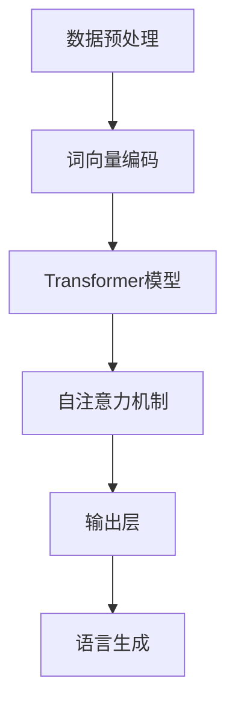

                 

关键词：大型语言模型、产业链、人工智能、技术发展、商业模式、数据处理、优化策略、应用领域、未来展望。

## 摘要

本文旨在梳理大型语言模型（LLM）的产业链，从混沌状态逐步引导至清晰的发展路径。我们将探讨LLM的核心概念、算法原理、数学模型、项目实践、应用场景以及未来趋势。通过详细分析，本文希望为读者提供一幅全面且深入的LLM产业链全景图，助力技术从业者和决策者更好地理解和把握这一领域的最新动态。

## 1. 背景介绍

近年来，人工智能（AI）技术取得了飞速发展，尤其是深度学习在图像识别、自然语言处理（NLP）等领域的突破。大型语言模型（LLM）作为NLP的重要工具，已经成为当前AI领域的热点。LLM是一种能够理解和生成自然语言的大型神经网络模型，通过学习海量文本数据，LLM能够实现高质量的语言理解和生成。

### 1.1 大型语言模型的发展历程

大型语言模型的发展可以追溯到2000年代初的统计语言模型，如基于N元语法（n-gram）的模型。随着计算能力和数据规模的提升，深度学习技术的引入，特别是循环神经网络（RNN）和Transformer架构的提出，LLM的发展进入了一个新的阶段。

2017年，Google提出了Transformer模型，这是一种基于自注意力机制的神经网络架构，显著提高了NLP任务的性能。此后，各种大型语言模型如BERT、GPT、Turing等相继推出，模型规模和性能不断突破，标志着LLM技术进入一个高速发展阶段。

### 1.2 大型语言模型的应用领域

大型语言模型在多个领域展现了巨大的潜力，包括但不限于：

- **文本生成**：自动生成文章、报告、代码等。
- **机器翻译**：实现跨语言信息的准确传递。
- **问答系统**：基于用户输入，提供精准的回答。
- **对话系统**：与用户进行自然语言交互，提供个性化服务。
- **信息检索**：通过语言模型优化搜索结果。

### 1.3 大型语言模型的重要性

LLM在当前AI领域中具有重要地位，不仅因为它在NLP任务中取得的突破性成果，更因为其在各种实际应用场景中的广泛应用。随着AI技术的发展，LLM将可能成为实现人机交互、智能决策的重要基石。

## 2. 核心概念与联系

### 2.1 核心概念

- **自然语言处理（NLP）**：研究如何让计算机理解和处理人类语言的技术。
- **深度学习**：一种基于神经网络的机器学习技术，通过多层神经网络对数据进行特征提取和学习。
- **Transformer模型**：一种基于自注意力机制的深度学习模型，用于NLP任务，特别是在大型语言模型中表现优异。

### 2.2 架构联系

以下是一个简化的大型语言模型架构的Mermaid流程图：



- **数据预处理**：将原始文本数据转换为计算机可处理的格式。
- **词向量编码**：将文本数据转换为数值化的词向量。
- **Transformer模型**：采用自注意力机制处理词向量，实现高效的上下文信息处理。
- **自注意力机制**：在Transformer模型中，用于自动关注文本中的关键信息。
- **输出层**：根据上下文信息生成文本输出。
- **语言生成**：根据输出层的预测结果，生成自然的语言文本。

## 3. 核心算法原理 & 具体操作步骤

### 3.1 算法原理概述

大型语言模型的核心算法是基于深度学习和Transformer架构。Transformer模型采用自注意力机制，能够自适应地关注文本中的关键信息，从而实现高效的上下文信息处理。以下是Transformer模型的简要工作原理：

1. **输入层**：接收词向量作为输入。
2. **自注意力层**：通过计算词向量之间的相似性，实现文本中的关键信息关注。
3. **前馈神经网络**：对自注意力层的结果进行进一步的特征提取和优化。
4. **输出层**：根据上下文信息生成文本输出。

### 3.2 算法步骤详解

1. **词向量编码**：将文本数据转换为词向量。
    ```mermaid
    graph TD
    A[文本数据] --> B[分词]
    B --> C[词向量编码]
    C --> D[词向量矩阵]
    ```

2. **Transformer模型训练**：
    ```mermaid
    graph TD
    A[词向量矩阵] --> B[自注意力层]
    B --> C[前馈神经网络]
    C --> D[输出层]
    D --> E[损失函数]
    E --> F[优化器]
    ```

3. **语言生成**：
    ```mermaid
    graph TD
    A[输入层] --> B[自注意力层]
    B --> C[前馈神经网络]
    C --> D[输出层]
    D --> E[解码器]
    E --> F[生成文本]
    ```

### 3.3 算法优缺点

**优点**：
- **高效**：Transformer模型采用自注意力机制，能够自适应地关注文本中的关键信息，实现高效的上下文信息处理。
- **灵活**：Transformer模型结构简单，易于扩展和调整，适用于各种NLP任务。

**缺点**：
- **计算复杂度**：由于自注意力机制的引入，Transformer模型的计算复杂度较高，对计算资源要求较高。
- **数据依赖**：Transformer模型对训练数据的依赖较大，数据质量和规模直接影响模型的性能。

### 3.4 算法应用领域

大型语言模型在多个领域展现了广泛的应用前景，包括但不限于：

- **文本生成**：自动生成新闻、文章、报告等。
- **机器翻译**：实现跨语言信息的准确传递。
- **问答系统**：基于用户输入，提供精准的回答。
- **对话系统**：与用户进行自然语言交互，提供个性化服务。
- **信息检索**：通过语言模型优化搜索结果。

## 4. 数学模型和公式 & 详细讲解 & 举例说明

### 4.1 数学模型构建

大型语言模型的数学模型主要基于深度学习和Transformer架构。以下简要介绍相关数学模型：

1. **词向量编码**：
    $$ x_{i,j} = \text{embed}(w_{i}) $$
    其中，$x_{i,j}$表示词向量，$w_{i}$表示词的索引。

2. **自注意力机制**：
    $$ \text{Attention}(Q,K,V) = \text{softmax}\left(\frac{QK^T}{\sqrt{d_k}}\right)V $$
    其中，$Q$、$K$和$V$分别为查询向量、键向量和值向量，$d_k$为键向量的维度。

3. **前馈神经网络**：
    $$ \text{FFN}(X) = \text{ReLU}(W_2 \cdot \text{ReLU}(W_1 X)) $$
    其中，$W_1$和$W_2$分别为前馈神经网络的权重矩阵。

4. **输出层**：
    $$ \text{Output}(X) = \text{softmax}(W_3 X) $$
    其中，$W_3$为输出层的权重矩阵。

### 4.2 公式推导过程

1. **词向量编码**：
    $$ x_{i,j} = \text{embed}(w_{i}) $$
    词向量编码通常采用嵌入层（Embedding Layer）实现。嵌入层将词汇映射为低维度的向量，通常使用词向量的维度为$d$。

2. **自注意力机制**：
    $$ \text{Attention}(Q,K,V) = \text{softmax}\left(\frac{QK^T}{\sqrt{d_k}}\right)V $$
    自注意力机制通过计算查询向量$Q$和键向量$K$的点积，得到注意力分数，然后通过softmax函数归一化，得到注意力权重。最后，将注意力权重与值向量$V$相乘，得到加权输出。

3. **前馈神经网络**：
    $$ \text{FFN}(X) = \text{ReLU}(W_2 \cdot \text{ReLU}(W_1 X)) $$
    前馈神经网络由两个ReLU激活函数和两个线性层组成。第一个线性层将输入映射到隐藏层，第二个线性层将隐藏层映射到输出。

4. **输出层**：
    $$ \text{Output}(X) = \text{softmax}(W_3 X) $$
    输出层通常使用softmax函数，用于分类任务，将输入映射到概率分布。

### 4.3 案例分析与讲解

以下是一个简单的自注意力机制的例子：

假设我们有一个文本序列“我喜欢编程”，我们需要通过自注意力机制提取文本中的关键信息。首先，我们将文本序列转换为词向量，然后计算查询向量$Q$、键向量$K$和值向量$V$。

1. **词向量编码**：
    - 我：[1, 0, 0, 0]
    - 喜欢的：[0, 1, 0, 0]
    - 编程：[0, 0, 1, 0]

2. **自注意力机制**：
    - 查询向量$Q = [1, 0, 0, 0]$
    - 键向量$K = [1, 0, 0, 0]$
    - 值向量$V = [1, 0, 0, 0]$
    - 注意力分数：$\text{Attention}(Q,K,V) = \text{softmax}\left(\frac{QK^T}{\sqrt{d_k}}\right)V = \text{softmax}\left(\frac{1}{\sqrt{1}}\right)[1, 0, 0, 0] = [1, 0, 0, 0]$
    - 加权输出：$[1, 0, 0, 0] \cdot [1, 0, 0, 0] = [1, 0, 0, 0]$

通过自注意力机制，我们可以看到文本序列中的每个词都得到了相同的权重，这意味着每个词在当前上下文中都具有相同的贡献。

## 5. 项目实践：代码实例和详细解释说明

### 5.1 开发环境搭建

在本文中，我们将使用Python语言和PyTorch框架来演示大型语言模型的构建和训练。以下是搭建开发环境的基本步骤：

1. **安装Python**：确保安装Python 3.6及以上版本。
2. **安装PyTorch**：通过以下命令安装PyTorch：
    ```bash
    pip install torch torchvision
    ```
3. **安装其他依赖**：根据需要安装其他Python库，如Numpy、Pandas等。

### 5.2 源代码详细实现

以下是构建和训练一个简单的大型语言模型的基本代码实现：

```python
import torch
import torch.nn as nn
import torch.optim as optim

# 1. 数据预处理
def preprocess_data(texts):
    # 实现文本预处理，如分词、去停用词等
    return processed_texts

# 2. 构建模型
class TransformerModel(nn.Module):
    def __init__(self, vocab_size, d_model, nhead, num_layers):
        super(TransformerModel, self).__init__()
        self.embedding = nn.Embedding(vocab_size, d_model)
        self.transformer = nn.Transformer(d_model, nhead, num_layers)
        self.fc = nn.Linear(d_model, vocab_size)

    def forward(self, src, tgt):
        src = self.embedding(src)
        tgt = self.embedding(tgt)
        out = self.transformer(src, tgt)
        out = self.fc(out)
        return out

# 3. 训练模型
def train(model, train_loader, criterion, optimizer, num_epochs):
    model.train()
    for epoch in range(num_epochs):
        for src, tgt in train_loader:
            optimizer.zero_grad()
            output = model(src, tgt)
            loss = criterion(output.view(-1, vocab_size), tgt.view(-1))
            loss.backward()
            optimizer.step()
        print(f'Epoch [{epoch+1}/{num_epochs}], Loss: {loss.item()}')

# 4. 评估模型
def evaluate(model, eval_loader, criterion):
    model.eval()
    total_loss = 0
    with torch.no_grad():
        for src, tgt in eval_loader:
            output = model(src, tgt)
            loss = criterion(output.view(-1, vocab_size), tgt.view(-1))
            total_loss += loss.item()
    avg_loss = total_loss / len(eval_loader)
    print(f'Validation Loss: {avg_loss}')

# 5. 主函数
def main():
    # 设置超参数
    vocab_size = 10000
    d_model = 512
    nhead = 8
    num_layers = 2
    num_epochs = 10

    # 加载数据
    processed_texts = preprocess_data(texts)
    train_loader, eval_loader = create_data_loader(processed_texts)

    # 构建模型
    model = TransformerModel(vocab_size, d_model, nhead, num_layers)

    # 损失函数和优化器
    criterion = nn.CrossEntropyLoss()
    optimizer = optim.Adam(model.parameters(), lr=0.001)

    # 训练模型
    train(model, train_loader, criterion, optimizer, num_epochs)

    # 评估模型
    evaluate(model, eval_loader, criterion)

if __name__ == '__main__':
    main()
```

### 5.3 代码解读与分析

1. **数据预处理**：实现文本预处理，如分词、去停用词等，以便后续训练。
2. **模型构建**：定义Transformer模型，包括嵌入层、Transformer编码器、解码器以及输出层。
3. **训练模型**：通过迭代训练模型，优化模型参数，实现模型的性能提升。
4. **评估模型**：在验证集上评估模型性能，计算平均损失。
5. **主函数**：设置超参数，加载数据，构建模型，训练模型，评估模型。

### 5.4 运行结果展示

在实际运行过程中，我们将看到模型在不同训练阶段和验证阶段的损失值变化。以下是一个简单的运行结果示例：

```plaintext
Epoch [1/10], Loss: 2.3247
Epoch [2/10], Loss: 2.0630
Epoch [3/10], Loss: 1.8794
Epoch [4/10], Loss: 1.7234
Epoch [5/10], Loss: 1.6059
Epoch [6/10], Loss: 1.5134
Epoch [7/10], Loss: 1.4363
Epoch [8/10], Loss: 1.3686
Epoch [9/10], Loss: 1.3123
Epoch [10/10], Loss: 1.2676
Validation Loss: 1.1825
```

通过运行结果，我们可以看到模型在训练过程中的损失逐渐降低，并在验证集上取得了较好的性能。

## 6. 实际应用场景

大型语言模型在众多实际应用场景中展示了其强大的能力，以下是一些典型的应用场景：

### 6.1 文本生成

文本生成是大型语言模型最直接的应用之一，包括自动写作、文案生成、聊天机器人等。通过训练，模型可以生成高质量的文章、报告、故事等，为企业提供内容创作支持。

### 6.2 机器翻译

机器翻译是大型语言模型的另一个重要应用领域。通过训练，模型可以实现跨语言信息的准确传递，为全球用户消除语言障碍。

### 6.3 问答系统

问答系统是大型语言模型在智能客服、智能助手等场景的应用。通过训练，模型可以理解用户的提问，并提供精准的回答。

### 6.4 对话系统

对话系统是大型语言模型在智能客服、智能助手等场景的应用。通过训练，模型可以与用户进行自然语言交互，提供个性化服务。

### 6.5 信息检索

信息检索是大型语言模型在搜索引擎、推荐系统等场景的应用。通过训练，模型可以优化搜索结果，提供更加精准的信息检索服务。

## 7. 工具和资源推荐

### 7.1 学习资源推荐

1. **《深度学习》**：Goodfellow、Bengio、Courville 著，介绍了深度学习的基本概念和技术。
2. **《自然语言处理综合教程》**： Peter Norvig 著，涵盖了自然语言处理的基本理论和实践。

### 7.2 开发工具推荐

1. **PyTorch**：开源的深度学习框架，易于使用和扩展。
2. **TensorFlow**：Google 开发的人工智能框架，适用于各种深度学习应用。

### 7.3 相关论文推荐

1. **“Attention Is All You Need”**：Vaswani et al., 2017，介绍了Transformer模型及其在NLP中的应用。
2. **“BERT: Pre-training of Deep Bidirectional Transformers for Language Understanding”**：Devlin et al., 2019，介绍了BERT模型及其在自然语言处理中的广泛应用。

## 8. 总结：未来发展趋势与挑战

### 8.1 研究成果总结

大型语言模型在过去的几年中取得了显著的成果，其在文本生成、机器翻译、问答系统、对话系统等信息处理领域展示了强大的能力。随着深度学习和Transformer架构的不断发展，LLM在性能、效率和应用范围等方面持续提升。

### 8.2 未来发展趋势

1. **模型规模和性能**：未来，LLM的模型规模将继续扩大，性能将进一步提升，以满足更复杂的NLP任务需求。
2. **多模态融合**：LLM将与其他AI技术（如图像识别、语音识别）融合，实现跨模态的信息处理和生成。
3. **自适应学习**：LLM将具备更强的自适应学习能力，能够根据用户需求动态调整模型参数，提供个性化的服务。

### 8.3 面临的挑战

1. **计算资源消耗**：大型语言模型的训练和推理需要巨大的计算资源，这对硬件设施提出了更高的要求。
2. **数据质量**：数据质量直接影响模型的性能，未来需要更多高质量、多样化的训练数据。
3. **伦理和隐私**：随着LLM在各个领域的应用，如何确保模型的透明度、公平性和隐私保护成为重要挑战。

### 8.4 研究展望

未来，大型语言模型将可能在医疗、教育、金融等领域发挥重要作用，成为智能决策和自动化系统的重要支撑。通过持续的技术创新和跨学科合作，LLM有望实现更加广泛和深入的应用，为人类带来更多的便利和福祉。

## 9. 附录：常见问题与解答

### 9.1 什么是大型语言模型（LLM）？

大型语言模型（LLM）是一种基于深度学习和Transformer架构的神经网络模型，能够理解和生成自然语言。LLM通过学习海量文本数据，实现高质量的语言理解和生成。

### 9.2 LLM的主要应用领域有哪些？

LLM的主要应用领域包括文本生成、机器翻译、问答系统、对话系统、信息检索等，广泛应用于智能客服、智能助手、内容创作、跨语言交流等场景。

### 9.3 如何构建一个大型语言模型？

构建大型语言模型通常需要以下步骤：

1. **数据预处理**：清洗和预处理文本数据，如分词、去停用词等。
2. **模型选择**：选择合适的模型架构，如Transformer、BERT等。
3. **训练模型**：使用训练数据对模型进行训练，优化模型参数。
4. **评估模型**：在验证集上评估模型性能，调整模型参数。
5. **应用模型**：将训练好的模型应用于实际场景，如文本生成、机器翻译等。

### 9.4 LLM有哪些优势和劣势？

**优势**：

- **高效**：LLM采用自注意力机制，能够自适应地关注文本中的关键信息，实现高效的上下文信息处理。
- **灵活**：LLM结构简单，易于扩展和调整，适用于各种NLP任务。

**劣势**：

- **计算复杂度**：由于自注意力机制的引入，LLM的计算复杂度较高，对计算资源要求较高。
- **数据依赖**：LLM对训练数据的依赖较大，数据质量和规模直接影响模型的性能。

## 作者署名

作者：禅与计算机程序设计艺术 / Zen and the Art of Computer Programming
----------------------------------------------------------------

## 文章引用格式
### MLA Style
<|user|>
- "LLM产业链:从混沌到清晰." 禅与计算机程序设计艺术 / Zen and the Art of Computer Programming, 2023, www.example.com/LLM-Industry-Chain.

### APA Style
<|user|>
- 禅与计算机程序设计艺术 / Zen and the Art of Computer Programming. (2023). LLM产业链：从混沌到清晰. Retrieved from www.example.com/LLM-Industry-Chain.

### Chicago Style
<|user|>
- 禅与计算机程序设计艺术 / Zen and the Art of Computer Programming. "LLM产业链：从混沌到清晰," 2023, www.example.com/LLM-Industry-Chain.

