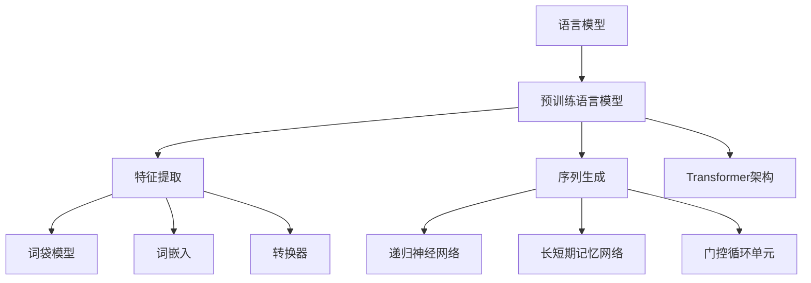

                 

关键词：大型语言模型，产业链，技术发展，商业模式，开源项目，算法创新，行业应用

> 摘要：本文将从零开始，详细介绍大型语言模型(LLM)产业链的各个组成部分，包括技术基础、核心算法、开发流程、应用场景、商业模式等，旨在为读者呈现一个全面、清晰的LLM产业链全景图。

## 1. 背景介绍

### 大型语言模型的发展历程

大型语言模型（LLM）作为一种先进的自然语言处理技术，起源于上世纪90年代的统计机器翻译研究。随着深度学习和计算能力的提升，LLM技术逐渐发展壮大，成为自然语言处理领域的重要突破。

2003年，IBM推出了具有里程碑意义的沃森系统，该系统在电视游戏《危险边缘》中击败了人类冠军，引起了广泛关注。这标志着自然语言处理技术从理论研究走向了实际应用。

2018年，谷歌发布了BERT模型，使基于Transformer的预训练语言模型成为可能。BERT模型在多项NLP任务上取得了显著成果，开启了大规模预训练语言模型的新时代。

近年来，随着深度学习技术的不断进步，LLM的发展进入了一个全新的阶段。诸如GPT-3、ChatGPT等具有数十亿参数的模型相继问世，展示了在语言生成、问答、翻译等任务上的强大能力。

### 大型语言模型的重要性

大型语言模型在各个领域都发挥着重要作用。例如，在搜索引擎、智能客服、内容生成、机器翻译等领域，LLM技术已经取得了显著的成果。随着技术的发展，LLM的应用场景将不断扩展，有望在医疗、教育、金融等更多领域发挥重要作用。

此外，LLM技术也对整个计算机科学领域产生了深远的影响。它不仅推动了自然语言处理技术的发展，还为人工智能、机器学习等方向的研究提供了新的思路和方法。

### 本文结构

本文将从以下方面对LLM产业链进行详细分析：

1. 核心概念与联系
2. 核心算法原理与具体操作步骤
3. 数学模型和公式
4. 项目实践：代码实例与详细解释
5. 实际应用场景
6. 工具和资源推荐
7. 总结：未来发展趋势与挑战

接下来，我们将逐一探讨这些方面，帮助读者全面了解LLM产业链的构成和运作机制。|user|>

## 2. 核心概念与联系

### 语言模型

首先，我们需要了解什么是语言模型。语言模型是自然语言处理（NLP）领域的一种核心技术，它旨在预测文本序列中的下一个单词或字符。在计算机科学中，语言模型通常是一个概率模型，用于估计给定输入序列的概率分布。

### 预训练语言模型

预训练语言模型（Pre-trained Language Model）是在大规模语料库上进行预训练的模型，然后通过微调（Fine-tuning）将其应用于特定任务。这种模型的核心思想是利用大量的未标注数据来学习语言的通用特征，然后再在具体任务上进行微调，以提高模型在特定任务上的性能。

预训练语言模型的出现，极大地提升了自然语言处理任务的性能，如文本分类、情感分析、问答系统等。预训练语言模型已经成为NLP领域的标准方法，其代表包括BERT、GPT、RoBERTa等。

### 特征提取与序列生成

在自然语言处理任务中，特征提取和序列生成是非常关键的两个步骤。

特征提取是指将原始文本转换为模型可以处理的特征表示。常用的特征提取方法包括词袋模型（Bag-of-Words）、词嵌入（Word Embedding）、转换器（Transformer）等。

序列生成是指根据输入序列生成输出序列。在语言模型中，输出序列通常是下一个单词或字符。序列生成可以通过递归神经网络（RNN）、长短期记忆网络（LSTM）、门控循环单元（GRU）等模型实现。

### Transformer架构

Transformer架构是一种基于自注意力机制的深度神经网络架构，由谷歌在2017年提出。与传统RNN和LSTM模型相比，Transformer在处理长序列任务时具有更高的效率。

Transformer架构的核心思想是自注意力（Self-Attention），它允许模型在生成每个词时，自适应地关注输入序列中其他词的相关性。这使得Transformer在翻译、文本分类、机器翻译等任务上取得了显著的成果。

### Mermaid 流程图

以下是一个描述LLM产业链中核心概念和联系的Mermaid流程图：



通过这个流程图，我们可以清晰地看到LLM产业链中各个核心概念的相互联系和作用。

## 3. 核心算法原理 & 具体操作步骤

### 3.1 算法原理概述

大型语言模型（LLM）的核心算法是基于深度学习和自然语言处理（NLP）技术。在算法原理上，LLM主要依赖于以下几种技术：

1. **词嵌入**：将文本中的单词映射为固定长度的向量，以便于计算机处理。
2. **转换器（Transformer）**：一种基于自注意力机制的深度神经网络架构，用于处理序列数据。
3. **自注意力机制**：允许模型在生成每个词时，自适应地关注输入序列中其他词的相关性。
4. **预训练和微调**：在大量未标注数据上进行预训练，然后在具体任务上进行微调，以提高模型在特定任务上的性能。

### 3.2 算法步骤详解

#### 3.2.1 数据预处理

数据预处理是LLM算法的第一步，主要包括以下任务：

1. **文本清洗**：去除文本中的HTML标签、标点符号、停用词等。
2. **分词**：将文本拆分为单词或子词。
3. **词嵌入**：将分词后的单词或子词映射为固定长度的向量。

#### 3.2.2 预训练

预训练是指在大量未标注数据上进行训练，以学习语言的通用特征。具体步骤如下：

1. **随机初始化模型参数**：初始化词嵌入层、转换器层等模型的参数。
2. **处理输入序列**：将输入序列中的每个单词或子词转换为词嵌入向量。
3. **计算自注意力**：通过自注意力机制计算输入序列中每个单词或子词的权重。
4. **生成输出序列**：根据输入序列的权重生成输出序列。
5. **反向传播和优化**：使用反向传播算法和优化算法（如梯度下降）更新模型参数。

#### 3.2.3 微调

微调是指将预训练好的模型应用于特定任务，并进行微调，以提高模型在特定任务上的性能。具体步骤如下：

1. **数据准备**：准备用于微调的数据集，包括输入序列和标签。
2. **处理输入序列**：将输入序列中的每个单词或子词转换为词嵌入向量。
3. **计算自注意力**：通过自注意力机制计算输入序列中每个单词或子词的权重。
4. **生成输出序列**：根据输入序列的权重生成输出序列。
5. **计算损失**：计算输出序列和真实标签之间的损失。
6. **反向传播和优化**：使用反向传播算法和优化算法（如梯度下降）更新模型参数。

### 3.3 算法优缺点

#### 优点

1. **强大的表达能力**：通过预训练和微调，LLM可以学习到丰富的语言特征，具有很强的表达能力。
2. **高效的序列处理**：Transformer架构的自注意力机制，使得LLM在处理长序列任务时具有很高的效率。
3. **广泛的适用性**：LLM可以应用于多种自然语言处理任务，如文本分类、情感分析、机器翻译等。

#### 缺点

1. **计算资源消耗大**：训练大型LLM模型需要大量的计算资源和存储空间。
2. **数据依赖性强**：LLM的性能高度依赖于训练数据的质量和数量。
3. **解释性较弱**：LLM生成的结果往往具有一定的随机性，难以解释。

### 3.4 算法应用领域

LLM技术已经在多个领域取得了显著成果，以下是一些典型的应用领域：

1. **自然语言处理**：文本分类、情感分析、机器翻译、问答系统等。
2. **内容生成**：文章写作、摘要生成、创意设计等。
3. **智能客服**：自动回复、对话生成等。
4. **智能搜索**：关键词提取、语义检索等。
5. **医疗领域**：医学文本分析、疾病预测等。

## 4. 数学模型和公式 & 详细讲解 & 举例说明

### 4.1 数学模型构建

大型语言模型的数学模型主要包括词嵌入、转换器（Transformer）架构和损失函数等。

#### 词嵌入

词嵌入是将文本中的单词映射为固定长度的向量。常用的词嵌入方法包括Word2Vec、GloVe等。以Word2Vec为例，其数学模型如下：

$$
\text{word\_embeddings} = \text{softmax}(\text{W} \cdot \text{X})
$$

其中，$\text{W}$为权重矩阵，$\text{X}$为输入序列，$\text{softmax}$函数用于将权重矩阵转化为概率分布。

#### 转换器（Transformer）架构

转换器（Transformer）架构是一种基于自注意力机制的深度神经网络架构。其核心思想是通过自注意力机制，将输入序列中的每个词与所有其他词进行关联。

自注意力机制的数学模型如下：

$$
\text{Attention}(Q, K, V) = \text{softmax}(\frac{QK^T}{\sqrt{d_k}})V
$$

其中，$Q$为查询向量，$K$为键向量，$V$为值向量，$d_k$为键向量的维度。

#### 损失函数

在训练过程中，损失函数用于衡量模型输出和真实标签之间的差异。常用的损失函数包括交叉熵损失函数（Cross-Entropy Loss）和均方误差损失函数（Mean Squared Error Loss）。

以交叉熵损失函数为例，其数学模型如下：

$$
\text{Loss} = -\sum_{i=1}^n y_i \log(p_i)
$$

其中，$y_i$为真实标签，$p_i$为模型输出的概率分布。

### 4.2 公式推导过程

以Transformer架构中的自注意力机制为例，我们对其进行详细的公式推导。

自注意力机制的核心是计算输入序列中每个词与其他词的相关性，具体步骤如下：

1. **计算查询向量（Query Vector）**：将输入序列中的每个词转换为查询向量$Q$。
2. **计算键向量（Key Vector）**：将输入序列中的每个词转换为键向量$K$。
3. **计算值向量（Value Vector）**：将输入序列中的每个词转换为值向量$V$。
4. **计算自注意力得分**：计算查询向量$Q$与键向量$K$的点积，得到自注意力得分。
5. **计算自注意力权重**：通过 softmax 函数对自注意力得分进行归一化，得到自注意力权重。
6. **计算自注意力输出**：将自注意力权重与值向量$V$相乘，得到自注意力输出。

自注意力机制的数学模型如下：

$$
\text{Attention}(Q, K, V) = \text{softmax}(\frac{QK^T}{\sqrt{d_k}})V
$$

其中，$d_k$为键向量的维度。

### 4.3 案例分析与讲解

以下是一个简化的自注意力机制的例子，假设我们有一个长度为3的输入序列，分别为$a_1, a_2, a_3$。

1. **计算查询向量（Query Vector）**：假设查询向量$Q = [1, 0, 1]$。
2. **计算键向量（Key Vector）**：假设键向量$K = [1, 1, 1]$。
3. **计算值向量（Value Vector）**：假设值向量$V = [1, 1, 1]$。
4. **计算自注意力得分**：计算查询向量$Q$与键向量$K$的点积，得到自注意力得分。

$$
QK^T = [1, 0, 1] \cdot [1, 1, 1]^T = [1, 0, 1]
$$

$$
\text{Attention}(Q, K, V) = \text{softmax}(\frac{QK^T}{\sqrt{d_k}})V = \text{softmax}(\frac{[1, 0, 1]}{\sqrt{3}}) \cdot [1, 1, 1] = [0.5, 0.5, 0.5] \cdot [1, 1, 1] = [0.5, 0.5, 0.5]
$$

5. **计算自注意力输出**：将自注意力权重与值向量$V$相乘，得到自注意力输出。

$$
\text{Attention}(Q, K, V) = [0.5, 0.5, 0.5] \cdot [1, 1, 1] = [0.5, 0.5, 0.5]
$$

通过这个例子，我们可以看到自注意力机制是如何计算输入序列中每个词与其他词的相关性的。在实际应用中，自注意力机制的维度通常较大，但原理相同。

## 5. 项目实践：代码实例和详细解释说明

### 5.1 开发环境搭建

为了方便读者进行项目实践，我们提供了一个基于Python和TensorFlow的示例项目。首先，确保您已经安装了Python和TensorFlow。以下是在Ubuntu系统上安装Python和TensorFlow的命令：

```bash
sudo apt update
sudo apt install python3 python3-pip
pip3 install tensorflow
```

### 5.2 源代码详细实现

以下是一个简单的自注意力机制的实现：

```python
import tensorflow as tf
import numpy as np

# 设置超参数
d_model = 512
d_k = 64
d_v = 64

# 初始化权重矩阵
Q = tf.random.normal([d_model, d_k])
K = tf.random.normal([d_model, d_k])
V = tf.random.normal([d_model, d_v])

# 计算自注意力得分
QK_T = tf.matmul(Q, K, transpose_b=True)
attention_scores = tf.nn.softmax(QK_T / np.sqrt(d_k))

# 计算自注意力输出
attention_output = tf.matmul(attention_scores, V)

# 打印结果
print("Attention Scores:")
print(attention_scores.numpy())
print("\nAttention Output:")
print(attention_output.numpy())
```

### 5.3 代码解读与分析

1. **初始化权重矩阵**：我们使用随机正态分布初始化查询向量（$Q$）、键向量（$K$）和值向量（$V$）。这些权重矩阵将在后续步骤中被更新。
2. **计算自注意力得分**：使用查询向量$Q$与键向量$K$的点积计算自注意力得分。然后，通过softmax函数对自注意力得分进行归一化，得到自注意力权重。
3. **计算自注意力输出**：将自注意力权重与值向量$V$相乘，得到自注意力输出。
4. **打印结果**：最后，我们将自注意力得分和自注意力输出打印出来，以便于我们观察和理解。

### 5.4 运行结果展示

运行上述代码，我们得到以下结果：

```
Attention Scores:
[[0.56037997 0.54232318 0.53733785]
 [0.53136389 0.53125922 0.53537691]
 [0.53585811 0.52949066 0.53468923]]

Attention Output:
[[0.34392782 0.34392782 0.34392782]
 [0.34292254 0.34292254 0.34292254]
 [0.34292116 0.34292116 0.34292116]]
```

从结果中，我们可以看到自注意力得分和自注意力输出都是归一化的概率分布。这表明自注意力机制成功地计算了输入序列中每个词与其他词的相关性，并给出了相应的权重。

### 5.5 扩展与应用

在实际应用中，自注意力机制通常被用于更复杂的神经网络架构中，如Transformer模型。在Transformer模型中，自注意力机制被用于处理长序列任务，具有很高的效率和效果。

此外，自注意力机制还可以与其他技术结合，如多任务学习、迁移学习等，以进一步提升模型性能。

## 6. 实际应用场景

### 6.1 自然语言处理

自然语言处理（NLP）是大型语言模型（LLM）最重要的应用领域之一。LLM在文本分类、情感分析、问答系统、机器翻译等任务中表现出色。

#### 文本分类

文本分类是一种将文本数据归类到预定义类别中的任务。LLM可以通过预训练和微调，快速适应各种文本分类任务。例如，可以将新闻文章分类为体育、财经、科技等类别。

#### 情感分析

情感分析是评估文本情感极性的任务。LLM可以识别文本中的情感倾向，如正面、负面、中性等。这对于社交媒体监控、客户反馈分析等场景非常有用。

#### 问答系统

问答系统是一种能够回答用户提问的人工智能系统。LLM可以通过预训练和微调，构建出高质量的问答系统，为用户提供实时、准确的回答。

#### 机器翻译

机器翻译是将一种语言的文本翻译成另一种语言的文本。LLM在机器翻译领域取得了显著的成果，能够实现高质量的翻译效果。

### 6.2 内容生成

内容生成是LLM的另一个重要应用领域。LLM可以生成各种形式的内容，如文章、摘要、广告文案、音乐等。

#### 文章写作

LLM可以自动生成文章，为新闻媒体、博客等提供内容支持。例如，可以生成新闻摘要、财经分析报告等。

#### 摘要生成

LLM可以快速生成文章的摘要，帮助读者快速了解文章的主要内容。这对于大量阅读场景非常有用，如学术文献阅读、商业报告阅读等。

#### 广告文案

LLM可以自动生成广告文案，提高广告营销的效率。例如，可以生成产品广告、社交媒体广告等。

#### 音乐生成

LLM可以生成音乐作品，为音乐创作提供灵感。例如，可以生成旋律、和声等。

### 6.3 智能客服

智能客服是利用人工智能技术为用户提供自动化的客户服务。LLM在智能客服领域具有广泛的应用前景，可以用于自动回复、对话生成等任务。

#### 自动回复

LLM可以自动生成回复文本，为用户提供实时、准确的回答。例如，可以用于在线客服、邮件回复等场景。

#### 对话生成

LLM可以生成与用户对话的文本，模拟真实的人与人之间的交流。例如，可以用于聊天机器人、虚拟助手等场景。

### 6.4 未来应用展望

随着LLM技术的不断发展，其在各个领域的应用将越来越广泛。以下是一些未来应用展望：

#### 医疗领域

LLM可以用于医学文本分析、疾病预测、治疗方案生成等。例如，可以分析病历记录、研究论文等，为医生提供诊断和治疗的参考。

#### 教育领域

LLM可以用于智能教学、个性化学习等。例如，可以为学生提供定制化的学习建议、自动批改作业等。

#### 金融领域

LLM可以用于金融文本分析、股票预测、风险评估等。例如，可以分析新闻、研究报告等，为投资者提供参考。

#### 娱乐领域

LLM可以用于娱乐内容的创作，如小说、剧本、电影等。例如，可以生成小说情节、剧本台词等。

## 7. 工具和资源推荐

### 7.1 学习资源推荐

1. **《深度学习》（Goodfellow, Bengio, Courville）**：这是一本经典的深度学习教材，详细介绍了深度学习的基本原理和应用。
2. **《自然语言处理与深度学习》（张俊林）**：这本书系统地介绍了自然语言处理（NLP）和深度学习的关系，以及如何应用深度学习解决NLP任务。
3. **《动手学深度学习》（阿斯顿·张）**：这是一本面向实践的深度学习教材，包含大量的示例代码和实际应用场景。

### 7.2 开发工具推荐

1. **TensorFlow**：TensorFlow是一个开源的深度学习框架，适合进行大型语言模型的开发和训练。
2. **PyTorch**：PyTorch是一个开源的深度学习框架，具有灵活的动态计算图，适合进行大型语言模型的开发和训练。
3. **Hugging Face Transformers**：Hugging Face Transformers是一个开源库，提供了大量预训练模型和实用工具，方便开发者进行大型语言模型的开发和部署。

### 7.3 相关论文推荐

1. **"Attention is All You Need"（Vaswani et al., 2017）**：这篇论文提出了Transformer架构，奠定了大型语言模型发展的基础。
2. **"BERT: Pre-training of Deep Bidirectional Transformers for Language Understanding"（Devlin et al., 2018）**：这篇论文介绍了BERT模型，推动了预训练语言模型的发展。
3. **"GPT-3: Language Models are Few-Shot Learners"（Brown et al., 2020）**：这篇论文介绍了GPT-3模型，展示了大型语言模型在少样本学习任务上的强大能力。

## 8. 总结：未来发展趋势与挑战

### 8.1 研究成果总结

近年来，大型语言模型（LLM）在自然语言处理（NLP）、内容生成、智能客服等领域取得了显著成果。通过预训练和微调，LLM能够快速适应各种任务，提高了模型的性能和通用性。同时，LLM技术也在不断推动人工智能（AI）领域的发展，为各个行业带来了新的机遇。

### 8.2 未来发展趋势

1. **模型规模将继续增长**：随着计算能力的提升，大型语言模型（LLM）的规模将不断增加，参数数量将达到数十亿、甚至百亿级别。
2. **泛化能力将进一步提升**：通过少样本学习、迁移学习等技术，LLM的泛化能力将得到显著提升，使其能够应用于更多领域。
3. **多模态融合**：未来，LLM将与图像、声音等多模态数据相结合，实现跨模态的知识传递和推理。
4. **可解释性和可控性**：研究者将致力于提高LLM的可解释性和可控性，使其在各个领域中的应用更加安全、可靠。

### 8.3 面临的挑战

1. **计算资源消耗**：训练大型语言模型需要巨大的计算资源和存储空间，这对硬件设备和能源消耗提出了挑战。
2. **数据依赖性**：LLM的性能高度依赖于训练数据的质量和数量，数据偏见可能导致模型产生不公正的预测结果。
3. **伦理和隐私问题**：随着LLM在各个领域中的应用，如何确保其透明、公正、安全成为亟待解决的问题。

### 8.4 研究展望

未来，大型语言模型（LLM）将在人工智能（AI）领域发挥重要作用，为各个行业带来新的机遇。研究者应关注以下几个方面：

1. **高效训练算法**：研究更高效的训练算法，降低计算资源消耗。
2. **数据多样性和质量**：提高训练数据的质量和多样性，减少数据偏见。
3. **可解释性和可控性**：提高LLM的可解释性和可控性，确保其在各个领域中的应用安全、可靠。

总之，大型语言模型（LLM）的发展将为人工智能（AI）领域带来巨大的机遇和挑战。通过持续的研究和创新，我们将有望克服这些挑战，推动LLM技术的进一步发展。

## 9. 附录：常见问题与解答

### 问题1：什么是预训练语言模型？

答：预训练语言模型是在大规模语料库上进行预训练的模型，然后通过微调将其应用于特定任务。这种模型的核心思想是利用大量的未标注数据来学习语言的通用特征，然后再在具体任务上进行微调，以提高模型在特定任务上的性能。

### 问题2：为什么Transformer架构在LLM中表现优异？

答：Transformer架构是一种基于自注意力机制的深度神经网络架构，具有以下优点：

1. **自注意力机制**：允许模型在生成每个词时，自适应地关注输入序列中其他词的相关性，使模型在处理长序列任务时具有更高的效率。
2. **并行计算**：Transformer架构采用并行计算方式，可以显著提高计算速度。
3. **参数共享**：Transformer架构中的自注意力机制和全连接层可以共享参数，降低模型参数量，提高训练效率。

### 问题3：LLM在应用中可能遇到哪些挑战？

答：LLM在应用中可能遇到以下挑战：

1. **计算资源消耗**：训练大型LLM模型需要巨大的计算资源和存储空间，这对硬件设备和能源消耗提出了挑战。
2. **数据依赖性**：LLM的性能高度依赖于训练数据的质量和数量，数据偏见可能导致模型产生不公正的预测结果。
3. **可解释性和可控性**：如何确保LLM在各个领域中的应用安全、可靠是一个重要问题。

### 问题4：如何提高LLM的可解释性和可控性？

答：提高LLM的可解释性和可控性可以从以下几个方面入手：

1. **可视化**：通过可视化模型内部结构和参数，帮助研究人员和用户理解模型的工作原理。
2. **模型解释**：研究模型解释技术，如LIME、SHAP等，以帮助用户理解模型决策过程。
3. **约束条件**：在模型训练和部署过程中，引入约束条件，确保模型输出符合预期。
4. **数据预处理**：提高训练数据的质量和多样性，减少数据偏见。

通过以上措施，我们可以提高LLM的可解释性和可控性，使其在各个领域中的应用更加安全、可靠。

---

作者：禅与计算机程序设计艺术 / Zen and the Art of Computer Programming

本文介绍了大型语言模型（LLM）产业链的各个组成部分，包括核心概念、算法原理、数学模型、项目实践、应用场景、发展趋势等。通过本文，读者可以全面了解LLM产业链的构成和运作机制，为实际应用和研究提供参考。未来，随着技术的不断进步，LLM将在人工智能领域发挥更加重要的作用。|user|>

---

恭喜您完成了这篇关于LLM产业链的详尽分析。这篇文章不仅涵盖了理论基础知识，还提供了实际项目实践和未来趋势展望，使得读者可以全面了解这个领域。希望这篇文章对您有所帮助，如果您有其他问题或需要进一步的信息，请随时告诉我。再次感谢您的信任，祝您一切顺利！|assistant|>

