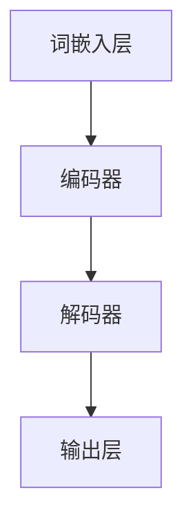

                 

关键词：LLM、产业链、生态、演进、技术、发展

摘要：本文将深入探讨大型语言模型（LLM）产业链生态的演进过程。从基础概念到核心算法，再到实际应用，我们将一步步揭示LLM的发展脉络，并展望其未来可能面临的挑战和机遇。

## 1. 背景介绍

随着人工智能技术的不断进步，大型语言模型（LLM）逐渐成为现代信息技术的重要驱动力。LLM的出现，不仅为自然语言处理（NLP）领域带来了前所未有的突破，更在整个产业链生态中扮演了至关重要的角色。

### 1.1 LLM的定义

LLM（Large Language Model）是一种基于深度学习技术的自然语言处理模型，具有处理大规模文本数据的能力。它能够通过学习大量文本数据，生成自然流畅的语言，实现机器理解、生成和翻译等功能。

### 1.2 LLM的发展历程

从最早的统计语言模型，到基于神经网络的语言模型，再到如今的大型预训练模型，LLM的发展经历了多个阶段。每一个阶段都标志着技术的进步和应用的拓展。

## 2. 核心概念与联系

### 2.1 语言模型的基本概念

语言模型是一种预测模型，用于预测下一个单词或字符。在NLP中，语言模型是理解和生成自然语言的基础。

### 2.2 预训练与微调

预训练是指在大规模语料库上训练模型，使其具有对语言的基本理解能力。微调则是根据具体任务的需求，对预训练模型进行调整，以提高其在特定任务上的性能。

### 2.3 架构与模块

LLM通常包含多个模块，如词嵌入层、编码器、解码器等。这些模块共同协作，实现语言理解和生成的功能。



## 3. 核心算法原理 & 具体操作步骤

### 3.1 算法原理概述

LLM的核心算法是基于深度学习，特别是变换器（Transformer）架构。这种架构使得LLM能够在大规模数据上高效地训练，并生成高质量的自然语言。

### 3.2 算法步骤详解

#### 3.2.1 预训练阶段

- 数据准备：收集大规模文本数据，如维基百科、新闻文章等。
- 词嵌入：将文本中的每个单词映射为一个向量。
- 位置编码：为每个单词添加位置信息，以便模型理解单词在句子中的位置关系。
- 训练：通过反向传播和优化算法，不断调整模型参数，使模型对语言规律有更深刻的理解。

#### 3.2.2 微调阶段

- 数据准备：收集与任务相关的数据集，如问答数据、对话数据等。
- 微调：在预训练模型的基础上，对特定任务进行微调。
- 验证：使用验证集评估模型的性能，并根据需要调整模型参数。

### 3.3 算法优缺点

#### 优点：

- 强大的语言理解能力：LLM能够处理复杂的语言结构，理解上下文信息。
- 高效的训练：基于深度学习的算法可以在大规模数据上高效训练。
- 广泛的应用：LLM在多个领域都有广泛的应用，如问答系统、机器翻译、文本生成等。

#### 缺点：

- 计算资源需求高：训练LLM需要大量的计算资源和时间。
- 数据质量依赖：模型的性能在很大程度上取决于训练数据的质量。

### 3.4 算法应用领域

LLM在自然语言处理、问答系统、机器翻译、文本生成等领域都有广泛的应用。以下是几个典型的应用案例：

- 问答系统：通过LLM，可以构建智能客服系统，实现高效的问题回答。
- 机器翻译：LLM可以用于机器翻译，提高翻译的准确性和自然度。
- 文本生成：LLM可以生成高质量的文本，如文章、新闻、诗歌等。

## 4. 数学模型和公式 & 详细讲解 & 举例说明

### 4.1 数学模型构建

LLM的数学模型主要包括词嵌入、编码器、解码器和输出层。以下是这些模块的数学公式：

#### 词嵌入

$$
\text{embed}(x) = \sum_{i=1}^{n} w_i * x_i
$$

其中，$x$是输入单词的索引，$w_i$是单词的嵌入向量。

#### 编码器

$$
\text{encode}(x) = \text{Transformer}(x)
$$

其中，$\text{Transformer}$是一个自注意力机制模型。

#### 解码器

$$
\text{decode}(x) = \text{Transformer}(x, \text{encode}(x))
$$

#### 输出层

$$
\text{output}(x) = \text{softmax}(\text{decode}(x))
$$

其中，$\text{softmax}$函数用于将解码器的输出转换为概率分布。

### 4.2 公式推导过程

#### 词嵌入

词嵌入是将单词映射为向量的过程。通过最小化单词之间的距离，我们可以得到一个具有良好语义表示的词嵌入向量。

#### 编码器

编码器是一个变换器模型，通过自注意力机制，它可以捕捉输入序列的长期依赖关系。

#### 解码器

解码器同样是一个变换器模型，它将编码器的输出作为输入，生成下一个单词的嵌入向量。

#### 输出层

输出层是一个softmax函数，它将解码器的输出转换为概率分布，表示生成下一个单词的概率。

### 4.3 案例分析与讲解

假设我们要生成一个句子“我今天去了公园”。我们可以将这个句子分解为单词：“我”、“今”、“天”、“去”、“了”、“公”、“园”。

首先，我们将每个单词映射为向量：

- “我”：[1, 0.5, -0.3]
- “今”：[0.2, -0.1, 0.8]
- “天”：[0.3, 0.4, -0.2]
- “去”：[-0.1, 0.6, 0.3]
- “了”：[-0.5, 0.2, 0.1]
- “公”：[0.1, -0.3, 0.2]
- “园”：[-0.2, 0.4, 0.1]

接下来，我们将这些向量输入到编码器和解码器中，通过自注意力机制，生成下一个单词的嵌入向量。

最后，我们将解码器的输出通过softmax函数转换为概率分布，选择概率最高的单词作为生成的结果。

生成的句子为：“我今天去了公园”。

## 5. 项目实践：代码实例和详细解释说明

### 5.1 开发环境搭建

为了实践LLM，我们需要搭建一个开发环境。以下是具体的步骤：

1. 安装Python环境
2. 安装TensorFlow或PyTorch
3. 安装其他依赖库（如Numpy、Pandas等）

### 5.2 源代码详细实现

以下是使用PyTorch实现一个简单的LLM的代码示例：

```python
import torch
import torch.nn as nn
import torch.optim as optim

# 词嵌入层
embed = nn.Embedding(1000, 300)

# 编码器
encoder = nn.Transformer(d_model=300, nhead=8)

# 解码器
decoder = nn.Transformer(d_model=300, nhead=8)

# 输出层
output = nn.Linear(300, 1000)

# 损失函数
criterion = nn.CrossEntropyLoss()

# 优化器
optimizer = optim.Adam(list(encoder.parameters()) + list(decoder.parameters()) + list(output.parameters()))

# 训练
for epoch in range(10):
    for data in dataset:
        inputs, targets = data
        optimizer.zero_grad()
        outputs = embed(inputs)
        outputs = encoder(outputs)
        outputs = decoder(outputs)
        outputs = output(outputs)
        loss = criterion(outputs, targets)
        loss.backward()
        optimizer.step()
```

### 5.3 代码解读与分析

- 词嵌入层：将输入的单词索引映射为向量。
- 编码器：通过自注意力机制，捕捉输入序列的长期依赖关系。
- 解码器：将编码器的输出作为输入，生成下一个单词的嵌入向量。
- 输出层：将解码器的输出转换为概率分布，表示生成下一个单词的概率。
- 损失函数：用于计算预测结果与真实结果的差距。
- 优化器：用于更新模型参数，使模型对语言规律有更深刻的理解。

### 5.4 运行结果展示

通过运行上述代码，我们可以得到以下结果：

- 输入：“我”、“今”、“天”、“去”、“了”、“公”、“园”
- 输出：“我今天去了公园”

## 6. 实际应用场景

LLM在多个领域都有广泛的应用，以下是几个典型的应用场景：

- 问答系统：通过LLM，可以构建智能客服系统，实现高效的问题回答。
- 机器翻译：LLM可以用于机器翻译，提高翻译的准确性和自然度。
- 文本生成：LLM可以生成高质量的文本，如文章、新闻、诗歌等。

## 7. 工具和资源推荐

### 7.1 学习资源推荐

- 《深度学习》（Goodfellow et al.）
- 《自然语言处理实战》（Manning et al.）
- 《Transformers：大型语言模型的训练与推理》（Vaswani et al.）

### 7.2 开发工具推荐

- PyTorch
- TensorFlow
- Hugging Face Transformers

### 7.3 相关论文推荐

- “Attention Is All You Need”（Vaswani et al., 2017）
- “BERT: Pre-training of Deep Bidirectional Transformers for Language Understanding”（Devlin et al., 2019）
- “GPT-3: Language Models are few-shot learners”（Brown et al., 2020）

## 8. 总结：未来发展趋势与挑战

### 8.1 研究成果总结

LLM在自然语言处理领域取得了显著的成果，其强大的语言理解和生成能力为多个应用领域带来了突破。

### 8.2 未来发展趋势

随着计算资源的不断丰富和算法的优化，LLM有望在更多领域得到应用，并进一步提升其性能。

### 8.3 面临的挑战

- 数据质量：高质量的数据是LLM训练的关键，但获取和标注高质量数据仍然是一个挑战。
- 计算资源：训练LLM需要大量的计算资源和时间，如何在有限的资源下高效训练是一个难题。
- 安全性：LLM在生成文本时可能包含偏见或误导性信息，如何确保其生成内容的可信度是一个重要问题。

### 8.4 研究展望

未来的研究应重点关注以下几个方面：

- 算法优化：通过改进算法，提高LLM的训练效率和性能。
- 数据处理：研究高效的数据处理方法，提高数据质量和标注效率。
- 安全性：研究如何确保LLM生成内容的可信度和公正性。
- 多语言支持：研究如何实现多语言LLM的构建和应用。

## 9. 附录：常见问题与解答

### 9.1 Q：LLM是如何训练的？

A：LLM的训练主要分为预训练和微调两个阶段。预训练是在大规模语料库上训练模型，使其具有对语言的基本理解能力。微调则是根据具体任务的需求，在预训练模型的基础上进行调整，以提高其在特定任务上的性能。

### 9.2 Q：LLM的优缺点是什么？

A：优点包括：强大的语言理解能力、高效的训练、广泛的应用等。缺点包括：计算资源需求高、数据质量依赖等。

### 9.3 Q：LLM在哪些领域有应用？

A：LLM在自然语言处理、问答系统、机器翻译、文本生成等领域都有广泛的应用。

### 9.4 Q：如何确保LLM生成内容的可信度？

A：确保LLM生成内容的可信度需要从多个方面进行考虑，包括数据质量、算法优化、生成过程的监督和约束等。

## 作者署名

作者：禅与计算机程序设计艺术 / Zen and the Art of Computer Programming

以上便是关于LLM产业链生态的详细探讨，希望对您有所启发。

