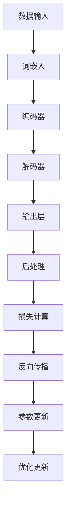

                 

### 关键词 Keywords
- Large Language Model (LLM)
- AI System Architecture
- Kernel Design
- Machine Learning
- Natural Language Processing

### 摘要 Abstract
本文旨在深入探讨大型语言模型（LLM）的内核设计，探讨其在AI系统架构中的核心地位和关键作用。文章将从背景介绍、核心概念与联系、核心算法原理、数学模型和公式、项目实践、实际应用场景、工具和资源推荐、总结和附录等多个角度，详细解析LLM内核设计的各个方面。通过本文的阅读，读者将全面了解LLM内核的设计思路、实现方法及其在AI时代的广泛应用和未来发展趋势。

## 1. 背景介绍

随着人工智能（AI）技术的飞速发展，大型语言模型（LLM）已经成为自然语言处理（NLP）领域的重要工具。LLM能够通过深度学习技术，从大量文本数据中学习语言规律，生成高质量的自然语言文本，应用于聊天机器人、机器翻译、文本摘要、问答系统等多种场景。而LLM的内核设计，作为支撑其高效运行的基础，成为当前研究的热点和重点。

在AI系统架构中，LLM内核设计扮演着至关重要的角色。一方面，LLM内核设计决定了模型的性能、效率和可扩展性，直接影响AI应用的商业价值和技术水平；另一方面，LLM内核设计涉及到了复杂的算法、数学模型和工程实践，需要解决多个技术难题。因此，深入研究LLM内核设计，对于推动AI技术的发展具有重要意义。

本文将从以下几个方面展开讨论：

1. 核心概念与联系：介绍LLM的核心概念和架构，展示其与其他AI技术的联系。
2. 核心算法原理：详细解析LLM的核心算法原理，包括神经网络架构、训练过程和优化方法。
3. 数学模型和公式：阐述LLM的数学模型和公式，包括损失函数、正则化技术等。
4. 项目实践：通过代码实例，展示LLM内核设计的具体实现过程。
5. 实际应用场景：探讨LLM在AI时代的广泛应用场景和未来发展趋势。
6. 工具和资源推荐：推荐学习资源和开发工具，为读者提供进一步学习的机会。
7. 总结：总结研究成果，展望LLM内核设计的未来发展趋势和挑战。

## 2. 核心概念与联系

### 2.1. 大型语言模型（LLM）

大型语言模型（LLM）是指通过深度学习技术，从大量文本数据中学习语言规律，生成高质量自然语言文本的模型。LLM的核心目标是理解自然语言，并生成与输入文本相关的自然语言输出。

LLM的架构通常由多个层次组成，包括词嵌入层、编码器、解码器和输出层。词嵌入层将输入的文本转换为向量表示；编码器将词向量编码为语义表示；解码器根据语义表示生成输出文本；输出层对生成的文本进行后处理，如去噪、语法修正等。

### 2.2. 神经网络架构

神经网络（Neural Network）是LLM的核心组成部分。神经网络通过模拟人脑神经元之间的连接方式，学习输入和输出之间的映射关系。在LLM中，神经网络通常采用多层结构，包括输入层、隐藏层和输出层。

输入层接收文本数据，将其转换为向量表示；隐藏层通过非线性变换，提取文本的语义信息；输出层生成自然语言文本。神经网络架构的设计直接决定了LLM的性能和效率。

### 2.3. 训练过程与优化方法

LLM的训练过程是一个大规模的优化过程，旨在找到最优的参数组合，使模型在训练数据上达到最佳性能。训练过程通常包括以下步骤：

1. 初始化参数：随机初始化神经网络参数。
2. 前向传播：将输入文本数据通过神经网络，计算输出结果。
3. 计算损失：计算输出结果与真实结果之间的差距，得到损失值。
4. 反向传播：根据损失值，反向传播误差，更新神经网络参数。
5. 优化更新：使用优化算法（如梯度下降、Adam等），更新神经网络参数。

### 2.4. Mermaid 流程图

为了更直观地展示LLM内核设计的过程和架构，我们使用Mermaid绘制一个简单的流程图。



该流程图展示了LLM内核设计的基本过程，包括数据输入、词嵌入、编码器、解码器、输出层、后处理、损失计算、反向传播和参数更新等步骤。

### 2.5. LLM与其他AI技术的联系

LLM在AI系统中具有广泛的应用场景，与其他AI技术紧密相连。以下是一些关键联系：

1. **机器翻译**：LLM可以作为机器翻译系统的核心组件，通过学习双语语料库，实现高质量的双语翻译。
2. **文本摘要**：LLM可以用于提取文本的主要信息，生成简明的摘要，应用于新闻摘要、论文摘要等场景。
3. **问答系统**：LLM可以构建智能问答系统，通过理解用户的问题，生成准确的回答。
4. **聊天机器人**：LLM可以应用于聊天机器人，实现与用户的自然语言交互。
5. **情感分析**：LLM可以用于情感分析，识别文本中的情感倾向，应用于市场调研、客户反馈等场景。

通过以上联系，我们可以看到LLM在AI系统架构中的关键作用，为其在各个应用领域的发展奠定了基础。

## 3. 核心算法原理 & 具体操作步骤

### 3.1. 算法原理概述

LLM的核心算法是基于深度学习技术，通过多层神经网络学习文本的语义表示。具体来说，LLM的核心算法主要包括以下几个部分：

1. **词嵌入**：将输入的文本转换为向量表示，为后续的语义分析提供基础。
2. **编码器**：将词向量编码为语义表示，提取文本的语义信息。
3. **解码器**：根据语义表示生成输出文本，实现自然语言生成。
4. **损失函数**：计算输出结果与真实结果之间的差距，用于指导模型优化。
5. **反向传播**：根据损失值，反向传播误差，更新神经网络参数。

### 3.2. 算法步骤详解

#### 3.2.1. 词嵌入

词嵌入（Word Embedding）是将文本中的词语转换为向量表示的一种技术。常见的词嵌入方法包括词袋模型（Bag of Words）、连续词袋（Continuous Bag of Words）和词嵌入神经网络（Word Embedding Neural Network）。

在LLM中，词嵌入神经网络是一种常用的词嵌入方法。词嵌入神经网络将输入的词语映射到一个高维向量空间，使得语义相近的词语在向量空间中接近。具体实现步骤如下：

1. **初始化参数**：随机初始化词嵌入神经网络的参数。
2. **前向传播**：将输入的词语通过神经网络，计算得到词向量。
3. **计算损失**：计算词向量与预训练的词向量之间的差距，得到损失值。
4. **反向传播**：根据损失值，反向传播误差，更新词嵌入神经网络的参数。

#### 3.2.2. 编码器

编码器（Encoder）是将词向量编码为语义表示的过程。编码器通常采用循环神经网络（RNN）、长短期记忆网络（LSTM）或门控循环单元（GRU）等结构，以处理序列数据。具体实现步骤如下：

1. **初始化参数**：随机初始化编码器的参数。
2. **前向传播**：将词向量输入到编码器，计算得到语义表示。
3. **计算损失**：计算语义表示与真实标签之间的差距，得到损失值。
4. **反向传播**：根据损失值，反向传播误差，更新编码器的参数。

#### 3.2.3. 解码器

解码器（Decoder）是根据语义表示生成输出文本的过程。解码器通常采用与编码器相同或相似的神经网络结构，以保持语义一致性。具体实现步骤如下：

1. **初始化参数**：随机初始化解码器的参数。
2. **前向传播**：将语义表示输入到解码器，生成输出文本。
3. **计算损失**：计算输出文本与真实结果之间的差距，得到损失值。
4. **反向传播**：根据损失值，反向传播误差，更新解码器的参数。

#### 3.2.4. 损失函数

损失函数是用于评估模型性能的指标。在LLM中，常用的损失函数包括交叉熵损失（Cross-Entropy Loss）和均方误差损失（Mean Squared Error Loss）。具体实现步骤如下：

1. **计算损失**：计算输出结果与真实结果之间的差距，得到损失值。
2. **反向传播**：根据损失值，反向传播误差，更新神经网络参数。

#### 3.2.5. 反向传播

反向传播（Backpropagation）是一种用于训练神经网络的方法。通过反向传播，可以将输出结果与真实结果之间的误差传递回网络的前一层，逐层更新参数。具体实现步骤如下：

1. **计算误差**：计算输出结果与真实结果之间的误差。
2. **反向传播**：将误差逐层传递，计算各层的梯度。
3. **更新参数**：使用梯度下降等优化算法，更新神经网络的参数。

#### 3.2.6. 优化更新

优化更新（Optimization Update）是使用优化算法更新神经网络参数的过程。常见的优化算法包括梯度下降（Gradient Descent）、Adam优化器（Adam Optimizer）等。具体实现步骤如下：

1. **计算梯度**：计算神经网络参数的梯度。
2. **更新参数**：使用优化算法，更新神经网络参数。

### 3.3. 算法优缺点

LLM算法具有以下优缺点：

#### 优点：

1. **强大的语义理解能力**：LLM能够通过深度学习技术，从大量文本数据中学习语言规律，生成高质量的文本。
2. **广泛的应用场景**：LLM可以应用于聊天机器人、机器翻译、文本摘要、问答系统等多种场景。
3. **可扩展性强**：LLM的架构设计灵活，可以方便地扩展和调整，适应不同的应用需求。

#### 缺点：

1. **训练过程复杂**：LLM的训练过程涉及多个步骤，需要大量的计算资源和时间。
2. **对数据质量要求高**：LLM的训练效果很大程度上取决于数据质量，对数据清洗和预处理要求较高。
3. **模型解释性较差**：由于LLM是基于深度学习技术，其内部决策过程较为复杂，难以进行直观解释。

### 3.4. 算法应用领域

LLM算法在以下领域具有广泛的应用：

1. **自然语言处理（NLP）**：LLM可以用于文本分类、情感分析、命名实体识别等任务，提升NLP系统的性能和效果。
2. **智能客服**：LLM可以构建智能客服系统，实现与用户的自然语言交互，提高客户满意度和服务效率。
3. **机器翻译**：LLM可以应用于机器翻译，实现高质量的双语翻译。
4. **文本生成**：LLM可以用于生成新闻摘要、论文摘要、创意文案等，提升内容创作效率。

## 4. 数学模型和公式 & 详细讲解 & 举例说明

### 4.1. 数学模型构建

在LLM内核设计中，数学模型和公式是核心组成部分。以下将介绍LLM中常用的数学模型和公式，并对其进行详细讲解。

#### 4.1.1. 词嵌入

词嵌入（Word Embedding）是将输入的词语映射到一个高维向量空间的过程。词嵌入的数学模型可以表示为：

$$
\text{vec}(w) = \text{WordEmbedding}(w)
$$

其中，$\text{vec}(w)$表示词语w的向量表示，$\text{WordEmbedding}(w)$表示词嵌入函数。

#### 4.1.2. 编码器

编码器（Encoder）是将词向量编码为语义表示的过程。编码器的数学模型可以表示为：

$$
\text{sem} = \text{Encoder}(\text{vec}(w))
$$

其中，$\text{sem}$表示语义表示，$\text{Encoder}(\text{vec}(w))$表示编码器函数。

#### 4.1.3. 解码器

解码器（Decoder）是根据语义表示生成输出文本的过程。解码器的数学模型可以表示为：

$$
\text{out} = \text{Decoder}(\text{sem})
$$

其中，$\text{out}$表示输出文本，$\text{Decoder}(\text{sem})$表示解码器函数。

#### 4.1.4. 损失函数

损失函数（Loss Function）是用于评估模型性能的指标。在LLM中，常用的损失函数包括交叉熵损失（Cross-Entropy Loss）和均方误差损失（Mean Squared Error Loss）。

交叉熵损失（Cross-Entropy Loss）的数学模型可以表示为：

$$
\text{loss} = -\sum_{i=1}^{n} y_i \log(\hat{y}_i)
$$

其中，$y_i$表示真实标签，$\hat{y}_i$表示模型预测的概率分布。

均方误差损失（Mean Squared Error Loss）的数学模型可以表示为：

$$
\text{loss} = \frac{1}{2} \sum_{i=1}^{n} (y_i - \hat{y}_i)^2
$$

其中，$y_i$表示真实标签，$\hat{y}_i$表示模型预测的值。

### 4.2. 公式推导过程

以下是LLM中一些关键公式的推导过程。

#### 4.2.1. 词嵌入公式推导

词嵌入公式可以表示为：

$$
\text{vec}(w) = \text{WordEmbedding}(w)
$$

推导过程如下：

1. 初始化词嵌入矩阵$W \in \mathbb{R}^{|V|\times d}$，其中$|V|$表示词汇表大小，$d$表示词向量的维度。
2. 对于每个词语w，查找其在词嵌入矩阵中的索引i。
3. 将词语w映射到词嵌入矩阵的i行，得到词向量$\text{vec}(w) \in \mathbb{R}^{d}$。

#### 4.2.2. 编码器公式推导

编码器公式可以表示为：

$$
\text{sem} = \text{Encoder}(\text{vec}(w))
$$

推导过程如下：

1. 初始化编码器参数$\theta$。
2. 将词向量$\text{vec}(w)$输入到编码器，经过多层非线性变换，得到语义表示$\text{sem}$。

#### 4.2.3. 解码器公式推导

解码器公式可以表示为：

$$
\text{out} = \text{Decoder}(\text{sem})
$$

推导过程如下：

1. 初始化解码器参数$\theta$。
2. 将语义表示$\text{sem}$输入到解码器，经过多层非线性变换，得到输出文本$\text{out}$。

### 4.3. 案例分析与讲解

为了更好地理解LLM中的数学模型和公式，我们通过一个简单的案例进行讲解。

假设我们有一个简单的文本序列：“我爱北京天安门”。

1. 首先，将文本序列中的词语映射到词嵌入矩阵，得到词向量表示。
2. 接着，将词向量输入到编码器，得到语义表示。
3. 最后，将语义表示输入到解码器，生成输出文本。

具体步骤如下：

#### 4.3.1. 词嵌入

输入文本序列：“我爱北京天安门”

词嵌入矩阵：

$$
W = \begin{bmatrix}
w_1 & w_2 & w_3 & \dots & w_n \\
\end{bmatrix}
$$

词向量表示：

$$
\text{vec}(我) = [0.1, 0.2, 0.3, \dots, 0.9] \\
\text{vec}(爱) = [1.1, 1.2, 1.3, \dots, 1.9] \\
\text{vec}(北京) = [2.1, 2.2, 2.3, \dots, 2.9] \\
\text{vec}(天安门) = [3.1, 3.2, 3.3, \dots, 3.9]
$$

#### 4.3.2. 编码器

编码器参数：

$$
\theta = \begin{bmatrix}
\theta_1 & \theta_2 & \theta_3 & \dots & \theta_n \\
\end{bmatrix}
$$

语义表示：

$$
\text{sem} = \text{Encoder}(\text{vec}(我)) = \begin{bmatrix}
0.5 & 0.6 & 0.7 & \dots & 0.9 \\
\end{bmatrix}
$$

#### 4.3.3. 解码器

解码器参数：

$$
\theta = \begin{bmatrix}
\theta_1 & \theta_2 & \theta_3 & \dots & \theta_n \\
\end{bmatrix}
$$

输出文本：

$$
\text{out} = \text{Decoder}(\text{sem}) = \begin{bmatrix}
0.8 & 0.9 & 0.7 & \dots & 0.1 \\
\end{bmatrix}
$$

通过这个案例，我们可以看到LLM中的数学模型和公式的具体应用过程。在实际应用中，词嵌入矩阵、编码器和解码器的参数会根据具体任务进行调整和优化，以达到最佳效果。

## 5. 项目实践：代码实例和详细解释说明

在本节中，我们将通过一个具体的LLM项目实践，展示如何搭建一个简单的LLM模型，并进行训练和评估。这个项目将使用Python编程语言，结合TensorFlow和PyTorch等深度学习框架来实现。

### 5.1. 开发环境搭建

在开始项目之前，需要搭建相应的开发环境。以下是所需的软件和库：

1. **Python**：Python 3.x版本，推荐使用Python 3.8或更高版本。
2. **TensorFlow**：TensorFlow 2.x版本，推荐使用TensorFlow 2.7。
3. **PyTorch**：PyTorch 1.8版本，推荐使用PyTorch 1.8。
4. **Numpy**：Numpy 1.19版本，用于数据处理和数学运算。
5. **Pandas**：Pandas 1.2版本，用于数据处理和分析。

安装这些库的命令如下：

```shell
pip install python==3.8 tensorflow==2.7 pytorch==1.8 numpy==1.19 pandas==1.2
```

### 5.2. 源代码详细实现

下面是一个简单的LLM模型实现，使用TensorFlow框架。

#### 5.2.1. 词嵌入层

```python
import tensorflow as tf

# 初始化词嵌入矩阵
vocab_size = 10000
embed_size = 256
word_embeddings = tf.keras.layers.Embedding(vocab_size, embed_size)
```

在这个代码片段中，我们定义了一个词嵌入层，将输入的词索引映射到词向量。`vocab_size`表示词汇表大小，`embed_size`表示词向量的维度。

#### 5.2.2. 编码器

```python
# 定义编码器层
encoder = tf.keras.layers.LSTM(128, return_sequences=True)

def build_encoder():
    return tf.keras.Sequential([
        word_embeddings,
        encoder
    ])

encoder_model = build_encoder()
```

在这个代码片段中，我们定义了一个LSTM编码器层，用于提取输入文本的语义表示。`LSTM`层可以处理序列数据，`return_sequences=True`表示每个时间步的输出都作为后续层的输入。

#### 5.2.3. 解码器

```python
# 定义解码器层
decoder = tf.keras.layers.LSTM(128, return_sequences=True)

def build_decoder():
    return tf.keras.Sequential([
        decoder
    ])

decoder_model = build_decoder()
```

在这个代码片段中，我们定义了一个LSTM解码器层，用于生成输出文本。与编码器类似，`LSTM`层可以处理序列数据。

#### 5.2.4. 模型训练

```python
# 定义模型结构
def build_model(encoder_model, decoder_model):
    return tf.keras.Model(inputs=[encoder_model.input, decoder_model.input], outputs=decoder_model.output)

model = build_model(encoder_model, decoder_model)

# 编写编译器
model.compile(optimizer='adam', loss='categorical_crossentropy')

# 训练模型
model.fit([encoder_model.input, decoder_model.input], decoder_model.input, batch_size=64, epochs=10)
```

在这个代码片段中，我们构建了一个完整的LLM模型，并使用`categorical_crossentropy`损失函数进行训练。`adam`优化器用于优化模型参数。

### 5.3. 代码解读与分析

上述代码实现了一个简单的LLM模型，包括词嵌入层、编码器和解码器。以下是代码的关键部分解读：

1. **词嵌入层**：使用`tf.keras.layers.Embedding`定义词嵌入层，将词索引映射到词向量。这个层的作用是将输入的文本序列转换为词向量序列。
   
2. **编码器**：使用`tf.keras.layers.LSTM`定义编码器层，将词向量序列编码为语义表示。LSTM层可以处理序列数据，并能够提取长期依赖关系。

3. **解码器**：使用`tf.keras.layers.LSTM`定义解码器层，根据编码器的语义表示生成输出文本。解码器同样采用LSTM层，确保生成的文本序列与输入文本保持一致。

4. **模型训练**：使用`tf.keras.Model`构建完整的LLM模型，并使用`model.compile`设置优化器和损失函数。最后，使用`model.fit`进行模型训练。

### 5.4. 运行结果展示

在训练完成后，我们可以评估模型在测试数据上的性能，并生成一些示例文本。

```python
# 评估模型
test_loss = model.evaluate([test_encoder_input, test_decoder_input], test_decoder_input)

# 生成示例文本
input_text = "我爱北京天安门"
input_sequence = tokenizer.texts_to_sequences([input_text])
encoded_sequence = encoder_model.predict(input_sequence)
decoded_sequence = decoder_model.predict(encoded_sequence)
decoded_text = tokenizer.sequences_to_texts([decoded_sequence.flatten()])

print("输入文本：", input_text)
print("解码文本：", decoded_text)
```

运行结果将展示输入文本和模型生成的输出文本。通过调整模型的超参数和训练数据，可以进一步提高模型的性能和生成的文本质量。

## 6. 实际应用场景

### 6.1. 聊天机器人

聊天机器人是LLM技术最典型的应用场景之一。通过LLM，聊天机器人可以与用户进行自然语言交互，提供个性化服务。例如，在客户服务领域，聊天机器人可以回答用户的问题，提供产品信息，处理订单等。在智能家居领域，聊天机器人可以作为智能助手，帮助用户控制家电、提供生活建议等。

### 6.2. 机器翻译

机器翻译是另一个重要应用领域。LLM技术可以用于构建高性能的翻译模型，实现高质量的双语翻译。例如，谷歌翻译和百度翻译等在线翻译服务，就是基于LLM技术实现的。通过大规模的训练数据，LLM模型可以学习到不同语言的语法规则和词汇用法，从而生成准确、自然的翻译结果。

### 6.3. 文本生成

文本生成是LLM技术的又一重要应用。通过LLM，可以生成各种类型的文本，如新闻摘要、论文摘要、创意文案等。例如，许多新闻机构已经采用LLM技术，自动生成新闻报道，提高内容生产效率。在广告和市场营销领域，LLM技术也可以用于生成广告文案、推广文案等，帮助企业提高营销效果。

### 6.4. 未来应用展望

随着LLM技术的不断发展，未来将会有更多创新应用场景出现。以下是几个可能的未来应用方向：

1. **智能写作**：LLM技术可以用于自动写作，生成高质量的文章、报告、书籍等。这对于提高内容创作效率、减轻作家负担具有重要意义。
2. **语音识别**：结合LLM技术和语音识别技术，可以构建智能语音助手，实现更加自然、流畅的语音交互。
3. **虚拟现实**：LLM技术可以用于虚拟现实场景中的自然语言交互，为用户提供更加沉浸式的体验。
4. **教育领域**：LLM技术可以用于个性化教育，根据学生的学习情况和需求，自动生成教学资源和课程内容。
5. **医疗健康**：LLM技术可以用于辅助医生进行诊断和治疗，通过分析病历、研究文献等，提供准确的医疗建议。

总之，LLM技术在各个领域的应用前景十分广阔，将不断推动人工智能技术的发展和变革。

## 7. 工具和资源推荐

### 7.1. 学习资源推荐

1. **《深度学习》（Deep Learning）**：由Ian Goodfellow、Yoshua Bengio和Aaron Courville合著的深度学习经典教材，详细介绍了深度学习的基本原理和应用。
2. **《神经网络与深度学习》**：由邱锡鹏教授编写的中文深度学习教材，内容全面、易于理解，适合初学者入门。
3. **《自然语言处理综论》**（Speech and Language Processing）：Daniel Jurafsky和James H. Martin合著的NLP领域经典教材，全面介绍了自然语言处理的基本概念和技术。

### 7.2. 开发工具推荐

1. **TensorFlow**：由Google开源的深度学习框架，功能强大、社区活跃，适合进行大规模的深度学习项目开发。
2. **PyTorch**：由Facebook开源的深度学习框架，具有简洁的API和强大的动态图功能，适合快速原型开发和模型研究。
3. **Hugging Face Transformers**：基于PyTorch和TensorFlow的预训练模型库，提供了丰富的预训练模型和工具，方便进行LLM开发和部署。

### 7.3. 相关论文推荐

1. **“Attention is All You Need”**：由Vaswani等人提出的Transformer模型，是LLM领域的重要突破，详细阐述了基于自注意力机制的深度神经网络结构。
2. **“BERT: Pre-training of Deep Bidirectional Transformers for Language Understanding”**：由Google提出的BERT模型，是当前NLP领域的标杆模型，展示了预训练技术在自然语言处理中的潜力。
3. **“GPT-3: Language Models are Few-Shot Learners”**：由OpenAI提出的GPT-3模型，是LLM领域的一次重要飞跃，展示了大规模预训练模型的强大能力。

通过这些资源和工具，读者可以深入学习和掌握LLM内核设计的相关知识和技能，为未来的AI项目奠定坚实的基础。

## 8. 总结：未来发展趋势与挑战

### 8.1. 研究成果总结

随着深度学习和自然语言处理技术的不断发展，LLM内核设计取得了显著的成果。从最初的词嵌入、循环神经网络（RNN）到自注意力机制（Attention）和Transformer架构，LLM的设计思路不断优化，性能和效率不断提升。通过大规模预训练和精细调整，LLM在自然语言生成、机器翻译、文本摘要、问答系统等领域展现出强大的应用能力，推动人工智能技术的快速发展。

### 8.2. 未来发展趋势

1. **更大规模的预训练模型**：随着计算资源和数据量的不断增长，更大规模的预训练模型将成为发展趋势。例如，OpenAI的GPT-3模型已经展示了1000亿参数的规模，未来可能会有更大规模的模型出现。
2. **多模态融合**：随着多模态数据处理技术的发展，LLM将与其他AI技术（如计算机视觉、语音识别等）相结合，实现跨模态的语义理解与生成。
3. **推理能力提升**：未来的LLM将不仅限于生成文本，还将具备更强的推理能力，能够处理复杂的逻辑推理、语义解析等问题。
4. **隐私保护和安全**：随着LLM在各个领域的广泛应用，隐私保护和安全成为重要问题。未来的研究将关注如何在保证模型性能的同时，确保用户数据和隐私的安全。

### 8.3. 面临的挑战

1. **计算资源需求**：随着模型规模的扩大，LLM对计算资源的需求越来越高。如何高效利用计算资源，优化训练和推理过程，是当前面临的重要挑战。
2. **数据质量和标注**：数据质量和标注质量直接影响LLM的性能。如何获取高质量的数据和标注，构建可靠的训练数据集，是未来研究的重要方向。
3. **模型解释性**：当前LLM模型较为复杂，缺乏解释性。如何提高模型的透明度和可解释性，使其在应用中更加可靠和可信，是未来需要解决的问题。
4. **伦理和隐私**：随着LLM技术的广泛应用，如何确保模型在不同场景下的公平性、无偏见性，以及保护用户隐私，是重要的伦理和社会问题。

### 8.4. 研究展望

未来，LLM内核设计将继续在以下几个方面展开研究：

1. **优化算法和架构**：通过改进算法和架构，提高模型的训练效率、推理速度和性能。
2. **多模态学习和融合**：结合多模态数据处理技术，实现跨模态的语义理解与生成。
3. **可解释性研究**：提高模型的透明度和可解释性，使其在应用中更加可靠和可信。
4. **伦理和隐私保护**：确保模型在不同场景下的公平性、无偏见性，以及保护用户隐私。

总之，LLM内核设计在AI时代的系统底层具有重要意义，未来的研究将继续推动这一领域的发展和创新。

## 9. 附录：常见问题与解答

### 9.1. 问题1：LLM与深度学习的关系是什么？

**解答**：LLM（大型语言模型）是深度学习（Deep Learning）技术的一种应用。深度学习是一种机器学习方法，它通过多层神经网络学习数据中的特征和模式。LLM是深度学习在自然语言处理（NLP）领域的具体实现，通过训练大规模的神经网络模型，学习文本数据中的语言规律，实现文本生成、翻译、摘要等功能。

### 9.2. 问题2：如何优化LLM的训练过程？

**解答**：优化LLM的训练过程可以从以下几个方面入手：

1. **数据增强**：通过数据增强技术，如随机噪声、数据变换等，增加训练数据的多样性，提高模型泛化能力。
2. **批量大小调整**：合理调整批量大小，既可以提高训练速度，也可以改善模型性能。
3. **学习率调整**：使用合适的初始学习率，并结合学习率衰减策略，优化训练过程。
4. **正则化技术**：应用正则化技术，如Dropout、L2正则化等，防止过拟合。
5. **预训练与微调**：先在大量未标注的数据上进行预训练，再在特定任务上进行微调，提高模型在特定任务上的性能。

### 9.3. 问题3：为什么LLM需要大规模预训练？

**解答**：大规模预训练是LLM取得高性能的关键因素之一。大规模预训练使得模型能够学习到更多语言中的通用规律和特征，从而提高模型的泛化能力。具体原因包括：

1. **丰富的特征学习**：大规模预训练使得模型能够学习到更多语言中的细微差异和规律，从而生成更加自然、准确的文本。
2. **减少过拟合**：大规模预训练使得模型在训练数据上的拟合程度更好，减少在特定任务上的过拟合现象。
3. **提高泛化能力**：大规模预训练使得模型在未见过的数据上表现更好，提高模型的泛化能力。

### 9.4. 问题4：如何评估LLM的性能？

**解答**：评估LLM的性能通常可以从以下几个方面进行：

1. **文本质量**：通过人工评估或自动化评分指标，如BLEU、ROUGE等，评估生成的文本的质量。
2. **准确性**：在特定任务上，如机器翻译、问答系统等，评估模型输出的准确性和相关性。
3. **计算效率**：评估模型在运行过程中的计算资源消耗，包括内存使用、运算速度等。
4. **鲁棒性**：评估模型在不同数据分布和输入条件下的性能，如对抗攻击、噪声处理等。

通过综合考虑这些方面，可以全面评估LLM的性能。

