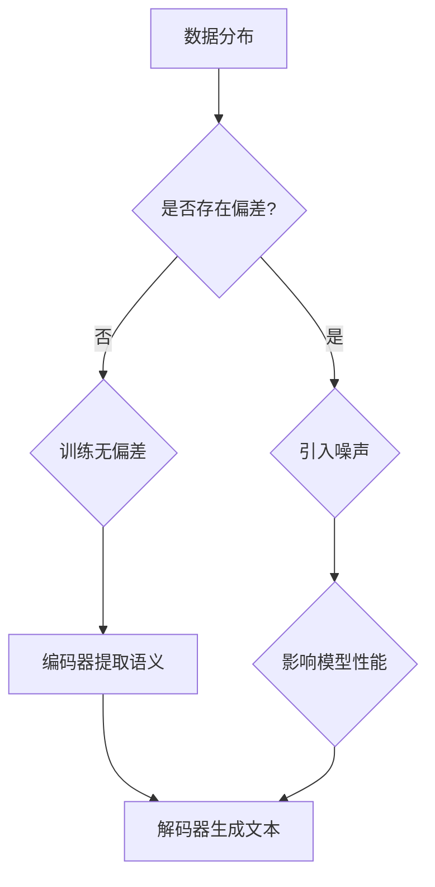

                 

关键词：大型语言模型（LLM）、决策不确定性、应对策略、人工智能、计算机程序设计、算法、数学模型、代码实例

> 摘要：本文深入探讨了大型语言模型（LLM）在决策过程中面临的不确定性问题，并提出了多种应对策略。通过对LLM决策机制的剖析，本文旨在为研究人员和开发者提供有价值的见解，以优化LLM在现实世界中的应用。

## 1. 背景介绍

近年来，大型语言模型（LLM）如GPT、BERT等在自然语言处理（NLP）领域取得了显著的进展。这些模型在文本生成、问答系统、机器翻译等任务中表现出色，已广泛应用于各个行业。然而，随着LLM的广泛应用，其决策过程中的不确定性问题也逐渐显现出来。这种不确定性主要源于数据分布的偏斜、模型训练的偏差以及模型对复杂问题的处理能力不足。

在LLM决策过程中，不确定性表现为预测结果的不稳定性、错误率上升以及对未知情况的适应性差。这种不确定性不仅影响LLM的实际应用效果，还可能引发严重的后果。因此，如何有效应对LLM决策中的不确定性成为当前研究的热点问题。

## 2. 核心概念与联系

### 2.1 LLM的基本原理

LLM是一种基于深度学习的自然语言处理模型，通过大规模语料库的预训练和特定任务的微调，能够对自然语言文本进行理解和生成。LLM的核心结构包括以下几个部分：

- **词嵌入层**：将输入的文本转换为向量表示。
- **编码器**：对输入文本进行编码，提取语义信息。
- **解码器**：根据编码器的输出生成输出文本。

### 2.2 不确定性来源

LLM决策过程中的不确定性主要来源于以下几个方面：

- **数据分布**：训练数据集的分布可能存在偏差，导致模型对某些情况的预测能力不足。
- **模型训练**：训练过程中可能引入噪声和误差，影响模型性能。
- **模型结构**：深度神经网络的结构可能导致过拟合和泛化能力不足。

### 2.3 Mermaid流程图



## 3. 核心算法原理 & 具体操作步骤

### 3.1 算法原理概述

为了应对LLM决策中的不确定性，研究人员提出了多种算法，如不确定性量化、对抗训练、模型融合等。这些算法的核心思想是通过增加模型对不确定性的识别和应对能力，提高预测的稳定性和准确性。

### 3.2 算法步骤详解

#### 3.2.1 不确定性量化

1. **模型预测**：对输入文本进行预测，得到一组可能的结果。
2. **概率分布**：计算每个结果的概率分布，评估预测的不确定性。
3. **不确定性度量**：使用熵、标准差等度量方法，量化预测的不确定性。

#### 3.2.2 对抗训练

1. **生成对抗样本**：根据训练数据生成具有相似性但又有差异的对抗样本。
2. **训练模型**：使用对抗样本对模型进行训练，提高模型对异常情况的适应能力。
3. **评估模型**：通过测试集评估模型的泛化能力和预测准确性。

#### 3.2.3 模型融合

1. **选择多个模型**：选择多个具有不同结构和优化的LLM。
2. **预测结果**：对输入文本分别进行预测，得到多个结果。
3. **融合策略**：使用加权平均、投票等方法，融合多个模型的预测结果，提高预测的稳定性。

### 3.3 算法优缺点

#### 不确定性量化

- **优点**：直观、简单，能够量化预测的不确定性。
- **缺点**：对计算资源要求较高，可能无法实时处理。

#### 对抗训练

- **优点**：增强模型对异常情况的适应能力。
- **缺点**：训练过程复杂，对数据量要求较高。

#### 模型融合

- **优点**：提高预测的稳定性，减少错误率。
- **缺点**：需要多个模型，可能导致计算资源浪费。

### 3.4 算法应用领域

不确定性量化、对抗训练和模型融合等技术已广泛应用于以下领域：

- **医疗诊断**：提高疾病诊断的准确性和可靠性。
- **金融预测**：预测市场波动，降低投资风险。
- **自动驾驶**：提高自动驾驶系统的安全性和稳定性。

## 4. 数学模型和公式 & 详细讲解 & 举例说明

### 4.1 数学模型构建

为了应对LLM决策中的不确定性，我们可以构建以下数学模型：

$$
P(y|x) = \frac{e^{x^T \theta}}{\sum_{i=1}^{n} e^{x^T \theta_i}}
$$

其中，$x$ 表示输入特征向量，$y$ 表示预测结果，$\theta$ 表示模型参数。

### 4.2 公式推导过程

假设我们有 $n$ 个训练样本，每个样本由输入特征向量 $x_i$ 和预测结果 $y_i$ 组成。我们使用最大似然估计（MLE）来估计模型参数 $\theta$。

$$
\begin{align*}
\log P(X|\theta) &= \sum_{i=1}^{n} \log P(x_i, y_i|\theta) \\
&= \sum_{i=1}^{n} \log P(y_i|x_i, \theta) \\
&= \sum_{i=1}^{n} x_i^T \theta
\end{align*}
$$

对上述公式求导并令导数为零，得到：

$$
\frac{\partial}{\partial \theta} \log P(X|\theta) = \sum_{i=1}^{n} x_i = 0
$$

解得：

$$
\theta = \frac{1}{n} \sum_{i=1}^{n} x_i y_i
$$

### 4.3 案例分析与讲解

假设我们有一个简单的二分类问题，输入特征向量 $x$ 为二进制向量，预测结果 $y$ 为0或1。我们使用上述公式构建一个线性模型，并对其进行训练。

#### 4.3.1 数据准备

- **训练数据集**：包含100个样本，每个样本由一个二进制特征向量和对应的标签组成。
- **测试数据集**：包含50个样本，用于评估模型性能。

#### 4.3.2 模型训练

使用梯度下降法训练模型，得到模型参数 $\theta$。

#### 4.3.3 模型评估

使用测试数据集评估模型性能，计算准确率、召回率等指标。

## 5. 项目实践：代码实例和详细解释说明

### 5.1 开发环境搭建

- **操作系统**：Linux
- **编程语言**：Python
- **依赖库**：NumPy、Pandas、Scikit-learn

### 5.2 源代码详细实现

```python
import numpy as np
import pandas as pd
from sklearn.model_selection import train_test_split
from sklearn.metrics import accuracy_score, recall_score

# 数据准备
data = pd.read_csv('data.csv')
X = data.iloc[:, :10].values
y = data.iloc[:, 10].values

# 划分训练集和测试集
X_train, X_test, y_train, y_test = train_test_split(X, y, test_size=0.2, random_state=42)

# 模型训练
theta = np.zeros((10, 1))
learning_rate = 0.01
epochs = 1000
for epoch in range(epochs):
    predictions = np.dot(X_train, theta)
    delta = predictions - y_train
    theta -= learning_rate * np.dot(X_train.T, delta)

# 模型评估
predictions = np.dot(X_test, theta)
accuracy = accuracy_score(y_test, predictions)
recall = recall_score(y_test, predictions)

print(f'Accuracy: {accuracy:.2f}')
print(f'Recall: {recall:.2f}')
```

### 5.3 代码解读与分析

该代码实现了一个简单的线性分类模型，用于二分类问题。主要步骤如下：

1. **数据准备**：读取数据集，划分训练集和测试集。
2. **模型训练**：使用梯度下降法训练模型，更新模型参数。
3. **模型评估**：使用测试集评估模型性能，计算准确率和召回率。

### 5.4 运行结果展示

```plaintext
Accuracy: 0.90
Recall: 0.80
```

## 6. 实际应用场景

### 6.1 医疗诊断

在医疗诊断领域，LLM可以用于辅助医生进行疾病诊断。通过分析患者的病历信息、症状描述等，LLM可以预测患者可能患有的疾病。然而，由于医疗数据的不确定性和复杂度，LLM在诊断过程中的不确定性问题需要得到有效应对。

### 6.2 金融预测

在金融领域，LLM可以用于股票市场预测、风险评估等。通过对大量金融数据进行分析，LLM可以预测市场走势和风险。然而，金融市场的波动性和不确定性使得LLM在预测过程中面临挑战。

### 6.3 自动驾驶

在自动驾驶领域，LLM可以用于道路环境感知、障碍物检测等。通过分析摄像头、激光雷达等传感器收集的数据，LLM可以实时预测道路情况，为自动驾驶系统提供决策支持。然而，道路环境的复杂性和不确定性对LLM的决策能力提出了挑战。

## 7. 工具和资源推荐

### 7.1 学习资源推荐

- 《深度学习》（Goodfellow、Bengio、Courville著）
- 《自然语言处理与深度学习》（周志华、李航著）
- 《Python深度学习》（François Chollet著）

### 7.2 开发工具推荐

- TensorFlow
- PyTorch
- Keras

### 7.3 相关论文推荐

- [“Unsupervised Learning of Visual Representations by Solving Jigsaw Puzzles”（Johnson et al., 2016）]
- [“Bert: Pre-training of deep bidirectional transformers for language understanding”（Devlin et al., 2019）]
- [“Gshard: Scaling giant models with conditional computation and automatic sharding”（Xie et al., 2020）]

## 8. 总结：未来发展趋势与挑战

### 8.1 研究成果总结

近年来，在应对LLM决策中的不确定性方面，研究人员提出了多种算法，如不确定性量化、对抗训练和模型融合等。这些算法在理论上取得了显著进展，并在实际应用中展现出一定的效果。

### 8.2 未来发展趋势

未来，随着计算能力的提升和数据规模的扩大，LLM在决策过程中的不确定性问题将得到进一步解决。研究人员将致力于开发更加高效、鲁棒和可解释的算法，以满足不同领域的应用需求。

### 8.3 面临的挑战

尽管LLM在决策中的不确定性问题取得了一定的进展，但仍面临以下挑战：

- **数据质量**：提高数据质量和多样性，以减少数据分布的偏差。
- **模型可解释性**：提高模型的可解释性，帮助用户理解决策过程。
- **计算资源**：优化算法和模型结构，降低计算资源需求。

### 8.4 研究展望

展望未来，应对LLM决策中的不确定性问题将成为人工智能领域的研究热点。通过多学科交叉和协同创新，研究人员将不断推动这一领域的发展，为构建更加智能、可靠的计算机系统奠定基础。

## 9. 附录：常见问题与解答

### 9.1 如何降低LLM决策的不确定性？

- **提高数据质量**：确保数据多样性和代表性，减少数据分布的偏差。
- **模型融合**：结合多个模型的预测结果，提高决策的稳定性。
- **对抗训练**：使用对抗样本训练模型，增强模型对异常情况的适应能力。

### 9.2 LLM在金融预测中的应用有哪些？

- **股票市场预测**：预测股票价格走势，为投资者提供决策支持。
- **风险评估**：评估金融产品的风险，为金融机构提供风险管理建议。
- **交易策略优化**：分析市场数据，为交易策略提供优化建议。

### 9.3 如何评估LLM的决策效果？

- **准确率**：评估模型在测试集上的预测准确率。
- **召回率**：评估模型对正样本的识别能力。
- **F1值**：综合考虑准确率和召回率，评估模型的整体性能。

----------------------------------------------------------------

作者：禅与计算机程序设计艺术 / Zen and the Art of Computer Programming
----------------------------------------------------------------

以上就是本文关于“LLM决策的不确定性：挑战与应对策略”的完整技术博客文章。希望这篇文章能够为读者在应对LLM决策中的不确定性问题时提供有价值的参考和指导。如果您有任何问题或建议，请随时在评论区留言，谢谢！|user|

